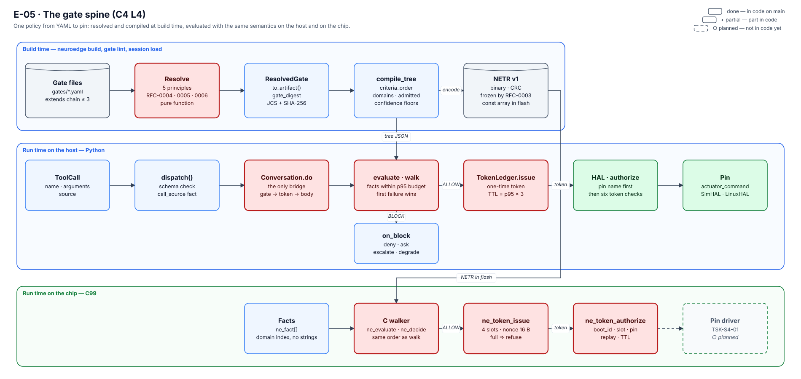
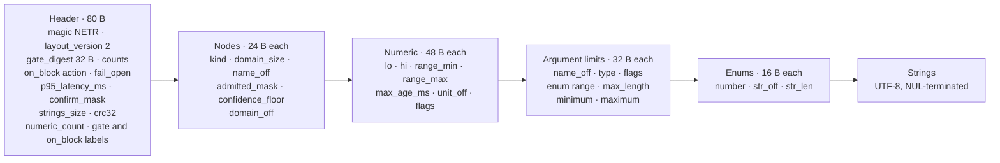
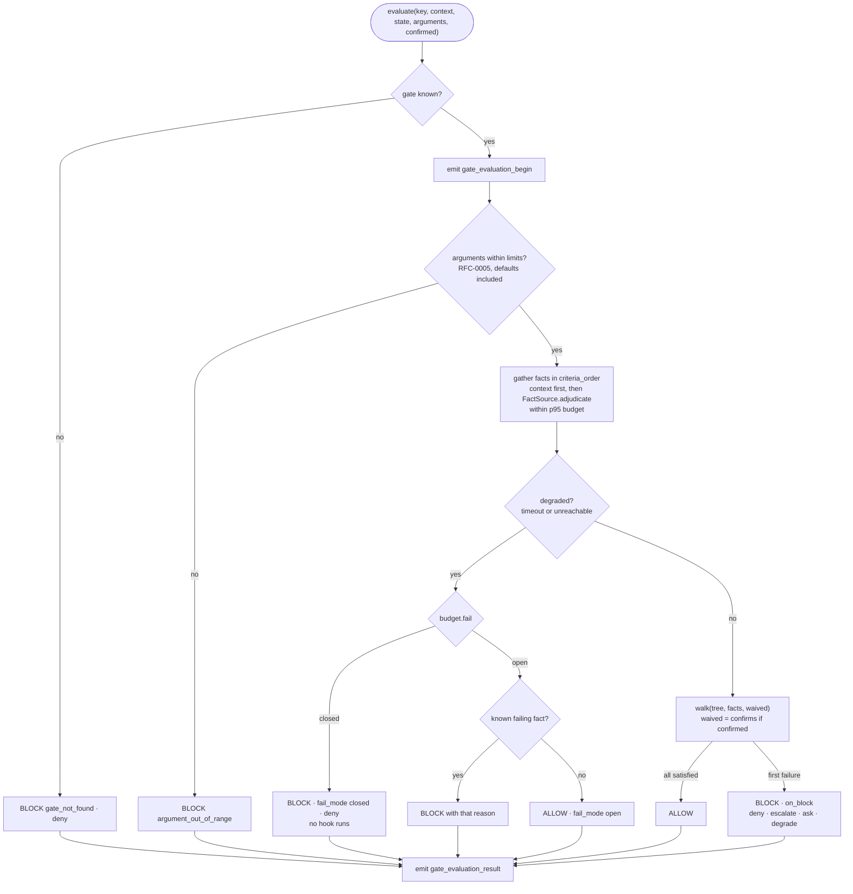
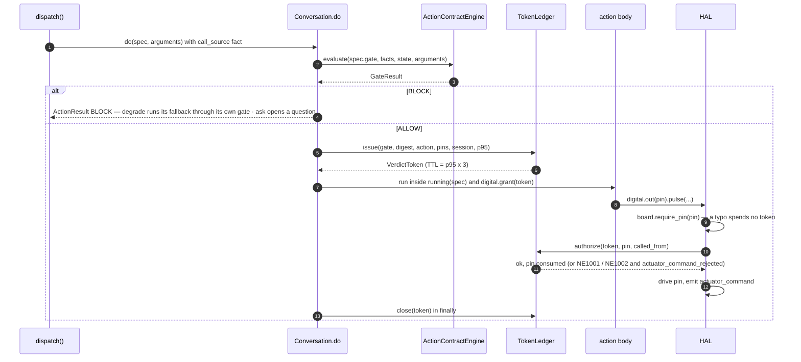
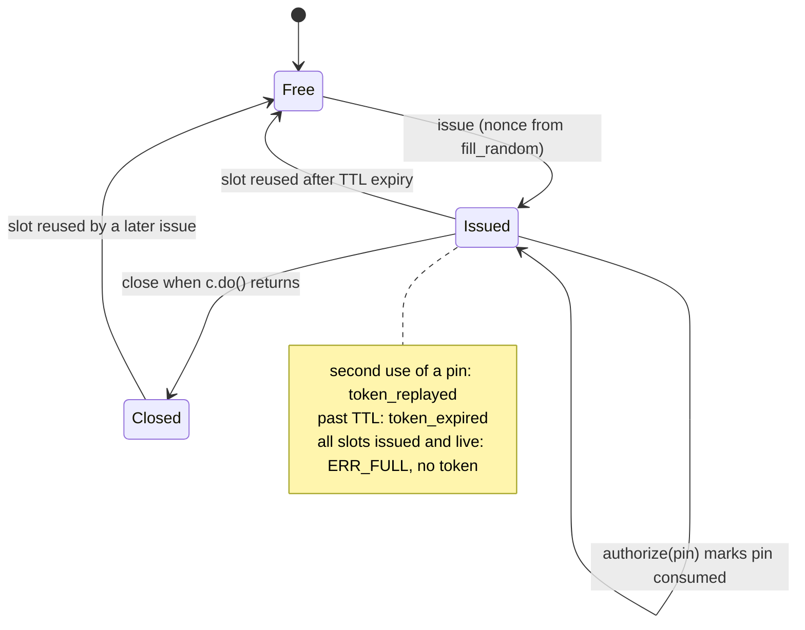
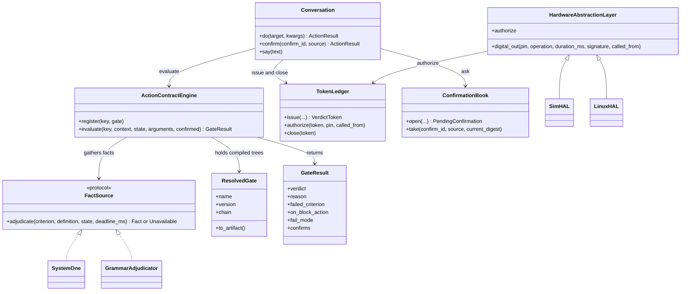

# 05 · Mức mã: gate → token → HAL (C4 L4)

> **Phạm vi:** xương sống an toàn ở mức hàm — một gate đi từ tệp YAML tới một lệnh chân, trên host
> (Python) và trên chip (C). **Nguồn:** `python/neuroedge/engine/`, `python/neuroedge/actions/`,
> `python/neuroedge/hal/`, `targets/esp32s3/components/ne_gate/`; quy phạm: proposal Phụ lục B,
> RFC-0001, 0003, 0004, 0005, 0006.

**Đọc chương này để làm gì:** Dành cho kỹ sư phần mềm và kỹ sư an toàn cần nắm chi tiết đường đi từ tệp gate YAML tới lệnh điều khiển chân phần cứng (C4 L4). Trả lời câu hỏi: gate được phân giải, biên dịch thành cây nhị phân `NETR`, duyệt và cấp token dùng một lần như thế nào trên cả Python lẫn C. Nên đọc [`00`](00-overview.md) và [`03`](03-component-host-c4l3.md) trước, và đọc [`06`](06-runtime-flows.md) sau để xem các luồng lúc chạy.

## 1. Chuỗi xương sống

*Hình E-05 — Từ tệp gate tới chân: phân giải và biên dịch lúc build, lượng giá và token lúc chạy, cùng ngữ nghĩa trên host và chip.*

**Cách đọc sơ đồ:** Các khối thể hiện các giai đoạn biến đổi từ chính sách YAML sang lệnh phần cứng; mũi tên nét liền là luồng xử lý tuần tự qua từng bước, mũi tên nét đứt liên kết dữ liệu phụ trợ. Điều cốt lõi cần nhớ: chỉ có một đường đi duy nhất từ ý định tới chân phần cứng (`dispatch()` → gate → token → HAL), không có đường tắt nào bỏ qua gate.

| Giai đoạn | Khi nào | Host (Python) | Chip (C) |
|:---|:---|:---|:---|
| Phân giải | build, lint, nạp phiên | `gate_resolver.resolve_gate_file` → `ResolvedGate` | — (làm trên host) |
| Băm | build | `canonical.gate_digest` (JCS + SHA-256) | digest nằm trong header `NETR` |
| Biên dịch | build | `decision_tree.compile_tree` → cây JSON; `binary_tree.encode` → `NETR` v1 | `ne_tree_load` kiểm và đọc tại chỗ |
| Gom dữ kiện | mỗi lần lượng giá | `ActionContractEngine._gather` qua `FactSource` | người gọi đưa `ne_fact[]` (chỉ số miền) |
| Lượng giá | mỗi lần lượng giá | `decision_tree.walk` | `ne_evaluate` / `ne_decide` |
| Cấp token | sau `ALLOW` | `TokenLedger.issue` | `ne_token_issue` |
| Cho phép chân | mỗi lệnh chân | `TokenLedger.authorize` qua HAL | `ne_token_authorize` |
| Đóng token | khi `c.do()` trả về | `TokenLedger.close` | `ne_token_close` |

## 2. Phân giải: từ nhiều tệp tới một chính sách

`resolve_gate_file` đọc gate, theo `extends` qua `GateRegistry` (`neuroedge://gates/<path>@<ver>` →
`<gates>/<path>@<ver>.yaml`), rồi gộp chuỗi từ gốc tới lá. Phân giải là **hàm thuần**: không đồng hồ,
không mạng, không ngẫu nhiên (bất biến 4).

| Luật | Nội dung | Vi phạm ⇒ |
|:---|:---|:---|
| Nguyên tắc 1 | Tiêu chí `evaluate` được kế thừa; định nghĩa lại bị từ chối | `NE2003` |
| Nguyên tắc 2 | `allow_when` chỉ được **siết**: tập giá trị nhận được phải là tập con của cha, ngưỡng tin cậy ≥ của cha | `NE2003` |
| Nguyên tắc 3 | Được thêm tiêu chí mới | — |
| Nguyên tắc 4 | `fail: open` không bao giờ được kế thừa | — (tự về `closed`) |
| Nguyên tắc 5 | Tối đa 3 tài liệu trong chuỗi; không vòng | `NE2003` |
| RFC-0004 R1–R3 | `p95` con ≤ cha; chuỗi đã `closed` không mở lại; con không thêm `degrade` hay đổi `fallback_action` | `NE2003` |
| RFC-0005 | Giới hạn tham số chỉ được thu hẹp; bỏ qua ⇒ kế thừa | `NE2003` |
| RFC-0006 | `confirms` của con là tập con của cha; mỗi mục phải là tiêu chí trong `allow_when` | `NE2003` |
| `allow_when` dạng chuỗi (CEL) | Bị từ chối ở mọi nơi hôm nay (TSK-S2-06 hoãn, `TODOS.md` #42) | `NE2002` |

Toán tử của `allow_when` theo kiểu tiêu chí (`constraints.py`): `bool` — giá trị trần hoặc
`{confidence_gte: x}`; `level` — giá trị trần, `eq`, `lte`, `gte`; `choice` — giá trị trần, `eq`, `in`,
`not_in`. Toán tử lạ ⇒ `NE2002`.

Kết quả là `ResolvedGate`; `to_artifact()` là thứ được chuẩn tắc hoá và băm: `schema`, `name`,
`version`, `resolved_from` (chuỗi từ gốc), `evaluate`, `allow_when`, `on_block`, `budget` (luôn có
`fail` tường minh), và `arguments` nếu có. Digest này (`gate_digest`) xuất hiện trong vết ghi, trong
header `NETR`, và trong token.

> Chú ý hai digest khác nhau: `digests.lock` băm **tài liệu YAML như được viết** (khoá tệp gate chuẩn
> mực), còn `gate_digest` băm **gate đã phân giải** (định danh chính sách đang chạy).

## 3. Biên dịch: cây quyết định và `NETR` v1

`compile_tree` tạo cây JSON nội bộ (`neuroedge.decision_tree/v1`, không đóng băng): `criteria_order`
theo thứ tự từ gốc, mỗi nút mang `kind`, `domain`, tập `admitted` và `confidence_floor`. Miền của `bool`
là `false, true`; của `level` là các mức đã khai; của `choice` là các lựa chọn **đã sắp xếp**.

`binary_tree.encode` ghi cây đó thành `NETR` v1 — bố cục nhị phân đóng băng bởi RFC-0003: little-endian,
không con trỏ, chỉ offset, bản ghi cố định kích thước.

```mermaid
flowchart LR
    H["Header · 80 B<br/>magic NETR · layout_version 2<br/>gate_digest 32 B · counts<br/>on_block action · fail_open<br/>p95_latency_ms · confirm_mask<br/>strings_size · crc32<br/>numeric_count · gate and on_block labels"]
    N["Nodes · 24 B each<br/>kind · domain_size · name_off<br/>admitted_mask · confidence_floor<br/>domain_off"]
    M["Numeric · 48 B each<br/>lo · hi · range_min · range_max<br/>max_age_ms · unit_off · flags"]
    A["Argument limits · 32 B each<br/>name_off · type · flags<br/>enum range · max_length<br/>minimum · maximum"]
    E["Enums · 16 B each<br/>number · str_off · str_len"]
    S["Strings<br/>UTF-8, NUL-terminated"]
    H --> N --> M --> A --> E --> S
```

**Cách đọc sơ đồ:** Các hộp đại diện cho từng phân vùng liên tục trong tệp nhị phân `NETR` v2 (từ header 80 byte đến chuỗi UTF-8); mũi tên nét liền biểu thị thứ tự sắp xếp cố định trong bộ nhớ. Điều cốt lõi cần nhớ: bố cục nhị phân không chứa con trỏ mà dùng offset cố định, cho phép walker C đọc trực tiếp tại chỗ từ flash mà không cần cấp phát động (stack ≤ 512 byte).

Kích thước tệp đúng bằng `80 + 24·n + 48·m + 32·a + 16·e + strings` (`m` tiêu chí `numeric`); giới hạn: tối đa 32 nút, miền 32 giá
trị, 32 tiêu chí số, 16 tham số, 64 enum, 16 384 byte chuỗi (khoảng 21 KB). Gate vượt giới hạn bị từ chối **lúc build**
(`NE2002`), không bao giờ tới chip. Đổi bố cục cần RFC và tăng `layout_version`; walker v2 từ chối tệp
v1. Bảng byte đầy đủ: [`docs/rfc/0009-tieu-chi-so-numeric.md`](../../rfc/0009-tieu-chi-so-numeric.md) §3d (v1: RFC-0003).

`ne_tree_load` từ chối tệp hỏng trước khi duyệt: sai magic, sai phiên bản, sai CRC, vượt giới hạn, sai
cấu trúc (offset ngoài tệp, miền `bool` khác 2, ngưỡng NaN, `confirm_mask` khi không phải `ask`…). Không
tải được cây ⇒ không có `ALLOW`.

## 4. Lượng giá

### 4.1 Host: `ActionContractEngine.evaluate`

```mermaid
flowchart TB
    S(["evaluate(key, context, state, arguments, confirmed)"]) --> K{"gate known?"}
    K -- no --> NF["BLOCK gate_not_found · deny"]
    K -- yes --> B["emit gate_evaluation_begin"]
    B --> AR{"arguments within limits?<br/>RFC-0005, defaults included"}
    AR -- no --> AO["BLOCK argument_out_of_range"]
    AR -- yes --> G["gather facts in criteria_order<br/>context first, then FactSource.adjudicate<br/>within p95 budget"]
    G --> DG{"degraded?<br/>timeout or unreachable"}
    DG -- yes --> FM{"budget.fail"}
    FM -- closed --> DC["BLOCK · fail_mode closed · deny<br/>no hook runs"]
    FM -- open --> KF{"known failing fact?"}
    KF -- yes --> DB["BLOCK with that reason"]
    KF -- no --> DO["ALLOW · fail_mode open"]
    DG -- no --> W["walk(tree, facts, waived)<br/>waived = confirms if confirmed"]
    W -- all satisfied --> AL["ALLOW"]
    W -- first failure --> OB["BLOCK · on_block<br/>deny · escalate · ask · degrade"]
    AO --> R["emit gate_evaluation_result"]
    NF --> R
    DC --> R
    DB --> R
    DO --> R
    AL --> R
    OB --> R
```

**Cách đọc sơ đồ:** Hình thoi là các điểm kiểm tra rẽ nhánh, hình chữ nhật là các bước xử lý và hành động; mũi tên nét liền chỉ hướng đi theo kết quả kiểm tra (yes/no, closed/open, all satisfied/first failure). Điều cốt lõi cần nhớ: `walk` là hàm thuần; thiếu dữ kiện hoặc ngoài miền ⇒ `BLOCK`; quá hạn hoặc mất nguồn ⇒ áp `budget.fail` — `closed` (mặc định) chặn, `open` chỉ cho `ALLOW` khi không có dữ kiện đã biết là "không".

- **Ngân sách thời gian** là `budget.p95_latency_ms`, tính từ lúc bắt đầu gom dữ kiện; mỗi lần hỏi
  một `FactSource` bị giới hạn bởi phần ngân sách còn lại. Quá hạn ⇒ `budget_exceeded`; nguồn ném lỗi
  ⇒ `gate_unreachable`. Hai lý do này là **suy giảm**: chúng áp `budget.fail` và bỏ qua `on_block`.
- **Duyệt cây** (`walk`) là hàm thuần: `ALLOW` khi và chỉ khi mọi nút được thoả; lý do là lỗi đầu tiên
  theo `criteria_order`. Không có dữ kiện hoặc giá trị ngoài miền ⇒ `criterion_unavailable`; độ tin cậy
  không phải xác suất (NaN, `True`, > 1) ⇒ `criterion_unavailable`; có ngưỡng mà không có độ tin cậy
  ⇒ `confidence_unavailable`; giá trị không được nhận hoặc dưới ngưỡng ⇒ `condition_not_met`.
- **`fail: open`** chỉ tha những gì *không quyết được*: một dữ kiện đã biết là "không" vẫn chặn
  (`known_failure`).
- **Câu hỏi `ask`** chỉ được mở khi một lời "có" là đủ để đổi `BLOCK` thành `ALLOW` ("answerable"):
  engine duyệt lại với các tiêu chí `confirms` được miễn.

### 4.2 Chip: `ne_evaluate` và `ne_decide`

Cùng thứ tự: giới hạn tham số trước, rồi từng nút theo thứ tự, lỗi đầu tiên thắng; `confirm_mask`
miễn các tiêu chí được xác nhận. `ne_decide` thêm đường suy giảm: với `NE_DEGRADED_UNREACHABLE` hoặc
`NE_DEGRADED_BUDGET`, tham số vượt giới hạn vẫn đứng; `fail_open` chỉ tha khi không có dữ kiện nào đã
biết là hỏng; còn lại chặn với `fail_mode` closed. Mã lý do dùng chung với host
(`engine/firmware.py::REASONS`): 0 không có, 1 `condition_not_met`, 2 `criterion_unavailable`,
3 `confidence_unavailable`, 4 `argument_out_of_range`, 5 `gate_unreachable`, 6 `budget_exceeded`.

## 5. Từ phán quyết tới chân

```mermaid
sequenceDiagram
    autonumber
    participant D as dispatch()
    participant C as Conversation.do
    participant E as ActionContractEngine
    participant L as TokenLedger
    participant A as action body
    participant H as HAL
    D->>C: do(spec, arguments) with call_source fact
    C->>E: evaluate(spec.gate, facts, state, arguments)
    E-->>C: GateResult
    alt BLOCK
        C-->>D: ActionResult BLOCK — degrade runs its fallback through its own gate · ask opens a question
    else ALLOW
        C->>L: issue(gate, digest, action, pins, session, p95)
        L-->>C: VerdictToken (TTL = p95 x 3)
        C->>A: run inside running(spec) and digital.grant(token)
        A->>H: digital.out(pin).pulse(...)
        H->>H: board.require_pin(pin) — a typo spends no token
        H->>L: authorize(token, pin, called_from)
        L-->>H: ok, pin consumed (or NE1001 / NE1002 and actuator_command_rejected)
        H->>H: drive pin, emit actuator_command
        C->>L: close(token) in finally
    end
```

**Cách đọc sơ đồ:** Các cột thẳng đứng đại diện cho các lớp từ điều phối (`dispatch`), hội thoại (`Conversation`), động cơ (`Engine`), sổ token (`TokenLedger`), thân hàm action tới HAL; mũi tên nét liền là lời gọi hàm, mũi tên nét đứt là kết quả trả về; khối `alt` rẽ nhánh giữa `BLOCK` và `ALLOW`. Điều cốt lõi cần nhớ: HAL bắt buộc phải nhận được `VerdictToken` hợp lệ từ `TokenLedger` thì mới cấp phát xung điều khiển chân actuator, và mỗi token chỉ dùng được đúng một lần.

**Thứ tự kiểm của `authorize`** (host và chip giống nhau):

| # | Kiểm | Từ chối với |
|:---:|:---|:---|
| 1 | Là một token (`VerdictToken`; trên chip: con trỏ khác `NULL`) | `not_a_token` · `NE1001` |
| 2 | Cùng tiến trình (`process_instance_id`); trên chip: cùng `boot_id` | `token_expired` · `NE1002` |
| 3 | Do chính sổ này phát (trên chip: khớp một khe theo nonce và digest, so sánh thời gian hằng) | `unknown_token` · `NE1001` |
| 4 | Chân nằm trong tập chân của token | `pin_not_granted` · `NE1001` |
| 5 | Token chưa đóng, chân chưa dùng | `token_replayed` · `NE1002` |
| 6 | Chưa quá TTL | `token_expired` · `NE1002` |

Mọi lần từ chối ghi `actuator_command_rejected {pin, reason, code}` **trước** khi ném lỗi, và chân
không đổi. Nonce không bao giờ vào vết ghi.

**Đã có (TSK-N2-01):** hook phong bì an toàn vật lý (physical envelope hook — giới hạn tổng thời gian bật và tần suất theo từng chân, khai ở `board.v1` — RFC-0007) nằm trong `HAL.digital_out` giữa bước kiểm tra chân (`require_pin`) và `authorize` (`hal/envelope.py`; token không bị tiêu khi bị từ chối) → [`15`](15-target-architecture.md) §4.2. Token thuê có hạn (nhánh `feat/motion`, TSK-I2a-05): (lease token — quyền điều khiển vận động có thời hạn ngắn, tự động gia hạn khi có lệnh mới qua gate, tự hết hạn để dừng an toàn khi mất liên lạc) cho `motion.*` (Q-37) → [`15`](15-target-architecture.md) §4.3.

```mermaid
stateDiagram-v2
    [*] --> Free
    Free --> Issued: issue (nonce from fill_random)
    Issued --> Issued: authorize(pin) marks pin consumed
    Issued --> Closed: close when c.do() returns
    Issued --> Free: slot reused after TTL expiry
    Closed --> Free: slot reused by a later issue
    note right of Issued
        second use of a pin: token_replayed
        past TTL: token_expired
        all slots issued and live: ERR_FULL, no token
    end note
```

**Cách đọc sơ đồ:** Các nút thể hiện trạng thái vòng đời của một khe token trong `TokenLedger` (`Free`, `Issued`, `Closed`); mũi tên nét liền là sự kiện chuyển trạng thái. Điều cốt lõi cần nhớ: mỗi chân của token chỉ dùng được một lần; dùng lại một chân ⇒ `token_replayed`, quá thời gian sống (TTL) sẽ bị `token_expired`, và khi toàn bộ khe đầy thì từ chối cấp mới chứ không đẩy token cũ ra.

## 6. Các lớp chính (host)

```mermaid
classDiagram
    class ActionContractEngine {
        +register(key, gate)
        +evaluate(key, context, state, arguments, confirmed) GateResult
    }
    class FactSource {
        <<protocol>>
        +adjudicate(criterion, definition, state, deadline_ms) Fact or Unavailable
    }
    class ResolvedGate {
        +name
        +version
        +chain
        +to_artifact()
    }
    class GateResult {
        +verdict
        +reason
        +failed_criterion
        +on_block_action
        +fail_mode
        +confirms
    }
    class Conversation {
        +do(target, kwargs) ActionResult
        +confirm(confirm_id, source) ActionResult
        +say(text)
    }
    class TokenLedger {
        +issue(...) VerdictToken
        +authorize(token, pin, called_from)
        +close(token)
    }
    class HardwareAbstractionLayer {
        +digital_out(pin, operation, duration_ms, signature, called_from)
        +authorize
    }
    class ConfirmationBook {
        +open(...) PendingConfirmation
        +take(confirm_id, source, current_digest)
    }
    ActionContractEngine --> ResolvedGate : holds compiled trees
    ActionContractEngine --> FactSource : gathers facts
    ActionContractEngine --> GateResult : returns
    Conversation --> ActionContractEngine : evaluate
    Conversation --> TokenLedger : issue and close
    Conversation --> ConfirmationBook : ask
    HardwareAbstractionLayer --> TokenLedger : authorize
    HardwareAbstractionLayer <|-- SimHAL
    HardwareAbstractionLayer <|-- LinuxHAL
    FactSource <|.. SystemOne
    FactSource <|.. GrammarAdjudicator
```

**Cách đọc sơ đồ:** Các hộp là các lớp và giao thức (`protocol`) chính trên Python host; mũi tên nét liền tam giác rỗng là kế thừa (`SimHAL`, `LinuxHAL`); nét đứt tam giác rỗng là hiện thực giao thức (`SystemOne`, `GrammarAdjudicator` hiện thực `FactSource`); mũi tên thường là nắm giữ hoặc gọi. Điều cốt lõi cần nhớ: `Conversation` là lớp duy nhất nối engine với sổ token; HAL chỉ biết `TokenLedger` qua `authorize`, không biết engine hay `FactSource`.

## 7. Đối chiếu Python ↔ C

Hai hiện thực của cùng một đặc tả (Q-8). Tương đương được chứng minh bằng test, không bằng lời hứa.

| Khái niệm | Python | C | Chứng minh |
|:---|:---|:---|:---|
| Cây | `compile_tree` + `encode` | `ne_tree_load` | `test_c_walker.py` so walker C với engine trên mọi gate và bảng sự thật `fixtures/decision_trees/`, fuzz tệp cây |
| Lượng giá | `walk`, `known_failure` | `ne_evaluate`, `ne_decide` | như trên; self-test lúc khởi động so với đáp án engine tính lúc build |
| Token | `TokenLedger` | `ne_token_*` | `test_c_token.py`: cùng lý do từ chối trên cùng chuỗi thao tác, cộng các đột biến |
| Vết ghi | `EventLog.emit` | `ne_trace_*` | `test_c_trace.py`; `verify --targets esp32s3` so với golden |
| Phiên bản OTA | `firmware.py::_RELEASE` | `ne_ota_parse_version` | `test_ota_version_rule.py` chạy cùng danh sách trường hợp trên cả hai |
