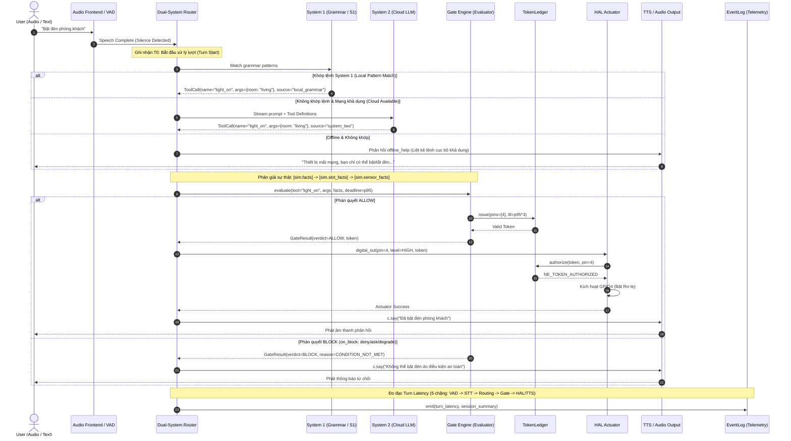
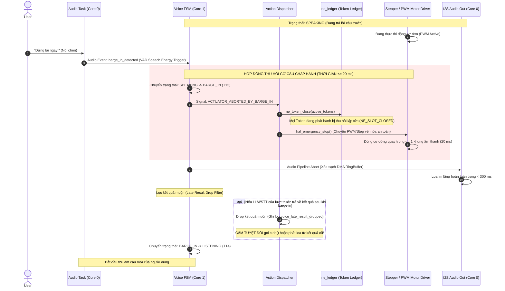
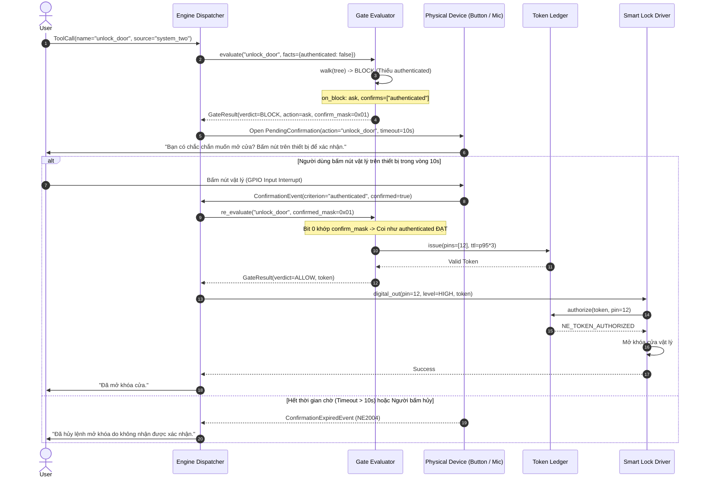
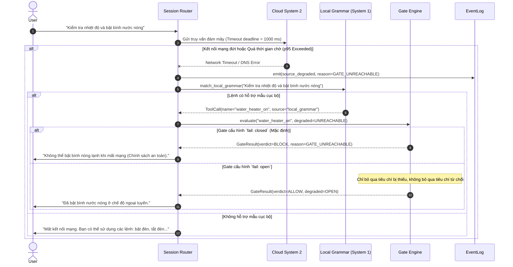
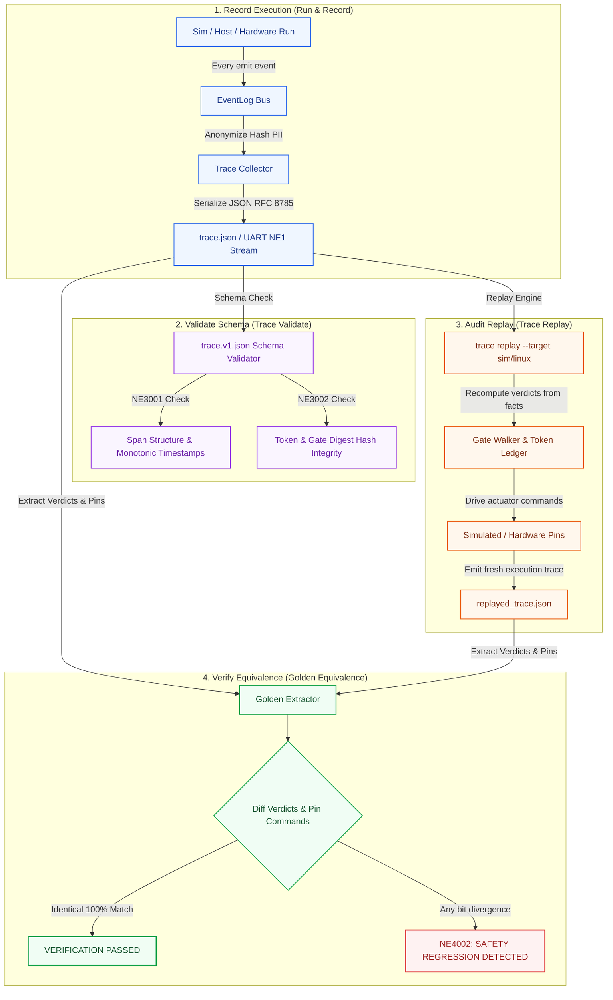

# 06 · Luồng thực thi Runtime

> **Trạng thái:** `done` · Chuẩn hóa luồng hoạt động thời gian thực (Runtime Flows)  
> **Tài liệu tham chiếu:** [04-component-device-c4l3.md](file:///Users/minhlt/Downloads/Projects/neuroedge-init/docs/architecture/vi/04-component-device-c4l3.md), [05-code-gate-hal-c4l4.md](file:///Users/minhlt/Downloads/Projects/neuroedge-init/docs/architecture/vi/05-code-gate-hal-c4l4.md), [E-06-trace-lifecycle](../assets/svg/E-06-trace-lifecycle.svg), [RFC-0006](file:///Users/minhlt/Downloads/Projects/neuroedge-init/docs/rfcs/RFC-0006-on-block-ask-confirms.md)  
> **Bộ kiểm thử chuẩn tắc:** `tests/test_runtime_flows.py`, `tests/test_barge_in.py`, `tests/test_trace_replay.py`

---

## 1. Luồng phiên tương tác tổng thể (`run` session turn)

Mỗi lượt tương tác thoại hoặc văn bản (`turn`) tuân thủ nghiêm ngặt mô hình phân tách nhận thức (Dual-System Router): Lệnh ngắn, quen thuộc được giải quyết cục bộ qua System 1 (Grammar, độ trễ $\le 50$ ms). Các câu lệnh tự do, phức tạp được định tuyến qua System 2 (LLM / Cloud, độ trễ $\le 1200$ ms).

### 1.1. Thứ tự ưu tiên nạp sự thật (Fact Resolution Precedence)

Khi `engine.evaluate()` được triệu gọi, các nguồn dữ kiện được tổng hợp theo thứ tự ưu tiên giảm dần:
1. `[sim.facts]` (Sự thật ghi đè từ kịch bản kiểm thử hoặc phiên chạy hiện tại).
2. `[sim.slot_facts]` (Dữ kiện trích xuất trực tiếp từ các slot của câu lệnh người dùng).
3. `[sim.sensor_facts]` (Dữ kiện đo đạc thời gian thực từ cảm biến phần cứng qua HAL).
4. `[grammar]` (Dữ kiện mặc định khai báo trong quy tắc ngữ pháp).

---

## 2. Hợp đồng ngắt lời & thu hồi chấp hành (Barge-in Abort Contract)

Barge-in là tình huống người dùng lên tiếng ngắt lời khi thiết bị đang xử lý (`THINKING`) hoặc đang phát âm thanh (`SPEAKING`). Hệ thống bắt buộc phải thu hồi quyền điều khiển phần cứng ngay lập tức.

### 2.1. Quy tắc thu hồi Barge-in (Four Invariants of Barge-in)

1. **Hủy lệnh chưa giao ($\le 20$ ms):** Lệnh chưa hoàn thành phải bị hủy tức thì (`ACTUATOR_ABORTED_BY_BARGE_IN`). Lệnh đã hoàn tất vật lý không đảo ngược được nhưng không được gửi tiếp chuỗi lệnh phụ thuộc.
2. **Thu hồi Token:** Token đã cấp cho lệnh bị hủy lập tức bị đóng (`closed`). Mọi nỗ lực điều khiển tiếp theo bằng token này sẽ bị từ chối với lỗi `NE_TOKEN_EXPIRED` hoặc `NE_TOKEN_REPLAYED`.
3. **Câm loa tức thì ($< 300$ ms):** Kênh phát âm thanh phải câm hoàn toàn trong vòng dưới 300 ms (bao gồm thời gian nhận biết năng lượng giọng nói VAD và xả hàng đợi I2S DMA).
4. **Vứt bỏ kết quả muộn (Late Result Drop):** Các phản hồi từ Cloud LLM hoặc STT của lượt cũ đến muộn sau khi ngắt lời sẽ bị tiêu hủy âm thầm (`voice_late_result_dropped`), không được chuyển tới `@action` hay gọi loa.

---

## 3. Điều phối Tool & Xác nhận người tại chỗ (In-Person Confirmation)

Khi một hành động nguy hiểm bị chặn bởi chính sách an toàn nhưng có cấu hình `on_block: ask` kèm thuộc tính `confirms` (theo [RFC-0006](file:///Users/minhlt/Downloads/Projects/neuroedge-init/docs/rfcs/RFC-0006-on-block-ask-confirms.md)), hệ thống kích hoạt cơ chế xác thực vật lý từ con người:

> **Bất biến An toàn về Xác nhận Người:**
> - Xác nhận chỉ có giá trị **dùng một lần** cho một phiên duy nhất.
> - Xác nhận chỉ được chấp nhận nếu bắt nguồn từ **giao diện cục bộ trên thiết bị vật lý** (nút bấm cứng, nhận diện vân tay, hoặc micro tại chỗ). Tuyệt đối cấm xác nhận từ xa qua API không tin cậy.
> - Nếu cấu hình Gate bị thay đổi (băm `gate_digest` đổi) trong lúc đang chờ xác nhận, `PendingConfirmation` lập tức bị hủy bỏ.

---

## 4. Xử lý sự cố mạng & Hạ cấp an toàn (Fail-Closed Offline Fallback)

Hệ thống thiết kế theo nguyên lý ngắt kết nối an toàn: Khi mất kết nối Cloud hoặc AI Provider quá hạn $p95$, hệ thống tự động kích hoạt logic phân giải ngoại tuyến mà không gây treo hệ thống.

---

## 5. Vòng đời vết ghi & Kiểm thử tương đương mục tiêu (Trace Lifecycle & Verification)

Vết ghi kiểm toán (`trace.json`) là bằng chứng toán học bảo đảm tính toàn vẹn hệ thống và tương đương mục tiêu giữa Máy mô phỏng (Sim), Linux và Chip thật (ESP32-S3).

### 5.1. Cơ chế Tái hiện Kiểm toán (Trace Replay Principles)

- **Không sao chép kết quả cũ:** Lệnh `neuroedge trace replay` **tính toán lại từ đầu** mọi phán quyết dựa trên cây quyết định nhị phân và dữ kiện ghi trong trace.
- **Bỏ qua dữ liệu không mang tính an toàn:** Quá trình so sánh Golden Diff loại bỏ thông tin thời gian thực tế (`timestamp_ms`, độ trễ mạng) và câu chữ tự do của LLM, chỉ tập trung tuyệt đối vào:
  1. **Chuỗi phán quyết Gate:** `ALLOW` hay `BLOCK`.
  2. **Chuỗi lệnh kích hoạt chân HAL:** Chân GPIO, mức logic (HIGH/LOW), thời điểm kích hoạt tương đối.
- **Bắt lỗi suy thoái an toàn (NE4002):** Nếu một phiên chạy trên chip thật trả về `ALLOW` trong khi vết ghi chuẩn (Golden) quy định `BLOCK`, hệ thống CI lập tức dừng quy trình build và gắn nhãn **Fatal Safety Regression**.
