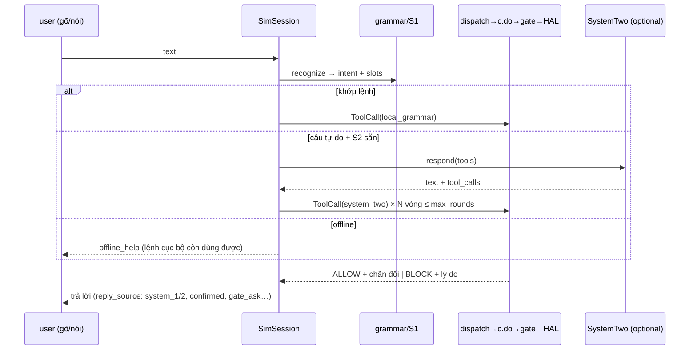
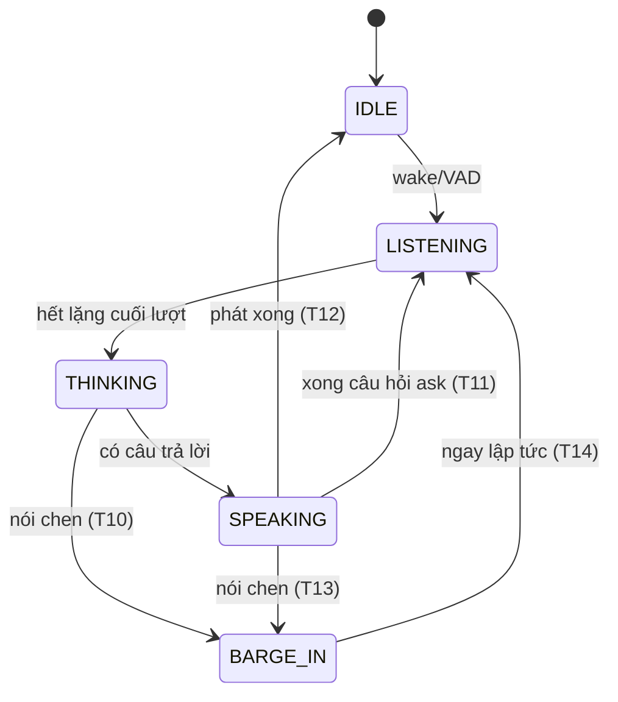
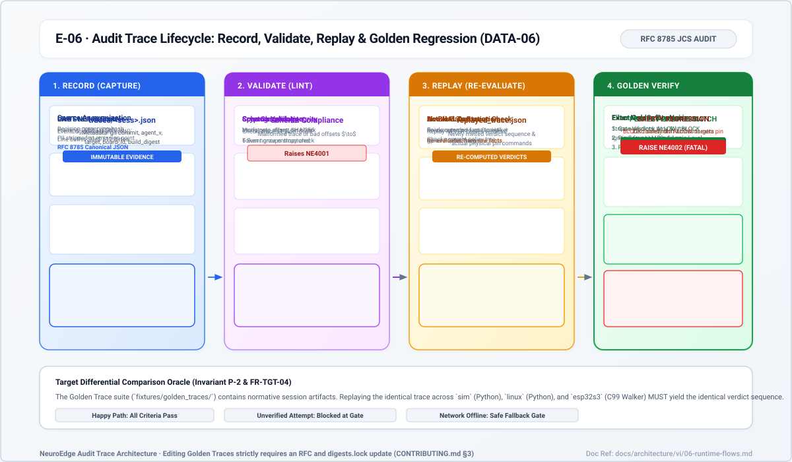

# 06 · Luồng runtime

> Trạng thái: session/tool/voice/trace `done` (I0–I4); OTA/multi-node
> `planned`. Đặc tả chuẩn tắc: `voice_fsm.md`, `tool_calling.md`,
> `simulation_coverage.md`.

## 1. Phiên tương tác (`run`)

Thứ tự fact: `[sim.facts] → [sim.slot_facts] → [sim.sensor_facts] → grammar`.
`c.say()` không qua gate; `c.do()` luôn qua gate. Mỗi lượt ghi `turn_latency`
(path `system_1/2/fallback/none` + 5 chặng); cuối phiên ghi `session_summary`.

## 2. Cắt lời (barge-in) — hợp đồng thu hồi

Vào `BARGE_IN`, thứ tự bắt buộc: (1) hủy mọi lệnh **chưa giao** (≤ 20 ms,
`ACTUATOR_ABORTED_BY_BARGE_IN`); (2) đóng token lệnh bị hủy — muốn làm lại
phải `c.do()` mới; (3) dừng TTS (loa im < 300 ms, kể cả VAD); (4) kết quả muộn
của lượt bị thay (STT/reply/tool) bị drop (`voice_late_result_dropped`),
**không** được `c.do()` hay phát. Lệnh đã giao chạy hết; `ask` đang chờ không
bị tiêu — câu chen có thể là câu trả lời.

## 3. Tool dispatch + xác nhận người

Phong bì `ToolCall{id, name, arguments, source}` — `source` do runtime gán
(`local_grammar/system_one/system_two/mcp/test`), bên gọi không tự khai
(khai → REJECTED). `dispatch`: kiểm schema → chèn `call_source` tin cậy →
`c.do()`. Tool lạ/tham số lạ → REJECTED (lỗi giao thức); giá trị ngoài giới
hạn gate → BLOCK `argument_out_of_range`.

`on_block: ask` (Q-26): chỉ người qua thiết bị xác nhận; gate khai trước điều
người được thay (`confirms`); lượng giá lại với facts hiện tại, tiêu chí khác
vẫn áp; một lần, có hạn, gate đổi thì vô hiệu.

## 4. Vòng đời vết ghi (poster E-06)

`record` (mọi `emit` về một `EventLog`, ẩn danh tại nguồn bằng hash giữ
quyết định) → `trace validate` → `replay` (**tính lại** phán quyết + chân trên
HAL thật, không copy kết quả) → `verify` trên sim/linux/esp32s3 → `golden`
(chỉ so phán quyết + lệnh chân, bỏ timing/chữ). Lệch BLOCK→ALLOW hoặc lệnh
chân mới là *SAFETY REGRESSION* (NE4002). Vết thiết bị đi UART `NE1` qua
`record --target esp32s3 --port`.
