# 06 · Luồng lúc chạy (Dynamic views)

> **Phạm vi:** các luồng quan trọng, mỗi luồng một sơ đồ trình tự hoặc trạng thái, gọi đúng tên hàm
> trong mã. **Nguồn:** `sim/session.py`, `actions/`, `engine/gate.py`, `mcp_server.py`, `mcp_host.py`,
> `models/system.py`, `perception/`, `testing/`, `docs/spec/voice_fsm.md`, `docs/spec/tool_calling.md`.

Mọi luồng dưới đây, dù bắt đầu từ đâu, đều gặp nhau ở cùng một đoạn: `dispatch()` → `Conversation.do`
→ `ActionContractEngine.evaluate` → `TokenLedger` → HAL ([`05`](05-code-gate-hal-c4l4.md) §5). Sơ đồ
chỉ vẽ đoạn đó một lần trong §1 và gọi tên nó ở các luồng khác.

## 1. Một lượt gõ lệnh

`neuroedge run -c "mở cửa phòng 101"` trên `sim`.

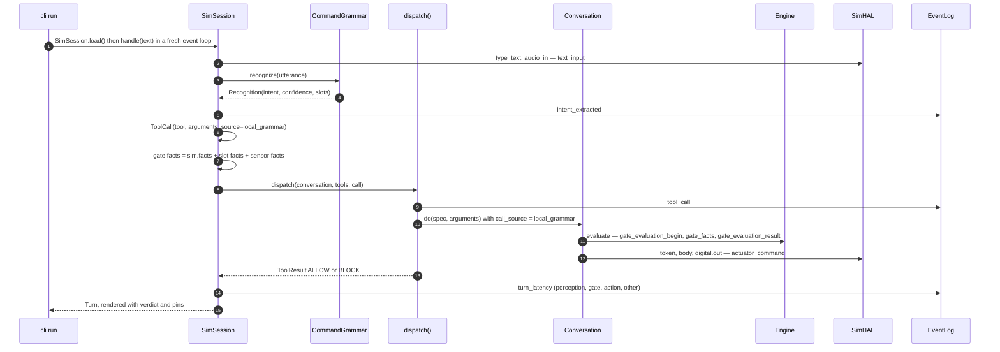
```mermaid
sequenceDiagram
    autonumber
    participant CLI as cli run
    participant S as SimSession
    participant G as CommandGrammar
    participant D as dispatch()
    participant C as Conversation
    participant E as Engine
    participant H as SimHAL
    participant T as EventLog
    CLI->>S: SimSession.load() then handle(text) in a fresh event loop
    S->>H: type_text, audio_in — text_input
    S->>G: recognize(utterance)
    G-->>S: Recognition(intent, confidence, slots)
    S->>T: intent_extracted
    S->>S: ToolCall(tool, arguments, source=local_grammar)
    S->>S: gate facts = sim.facts + slot facts + sensor facts
    S->>D: dispatch(conversation, tools, call)
    D->>T: tool_call
    D->>C: do(spec, arguments) with call_source = local_grammar
    C->>E: evaluate — gate_evaluation_begin, gate_facts, gate_evaluation_result
    C->>H: token, body, digital.out — actuator_command
    D-->>S: ToolResult ALLOW or BLOCK
    S->>T: turn_latency (perception, gate, action, other)
    S-->>CLI: Turn, rendered with verdict and pins
```

Câu không khớp ngữ pháp: có `[system_two]` thì đi luồng §4; không thì `command_not_recognized` và
thiết bị nói những lệnh cục bộ còn dùng được (`offline_help`).

## 2. Hỏi lại và xác nhận (`on_block: ask`, RFC-0006)

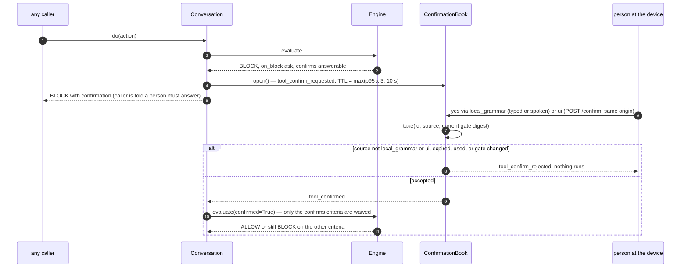
```mermaid
sequenceDiagram
    autonumber
    participant X as any caller
    participant C as Conversation
    participant E as Engine
    participant B as ConfirmationBook
    participant P as person at the device
    X->>C: do(action)
    C->>E: evaluate
    E-->>C: BLOCK, on_block ask, confirms answerable
    C->>B: open() — tool_confirm_requested, TTL = max(p95 x 3, 10 s)
    C-->>X: BLOCK with confirmation (caller is told a person must answer)
    P->>B: yes via local_grammar (typed or spoken) or ui (POST /confirm, same origin)
    B->>B: take(id, source, current gate digest)
    alt source not local_grammar or ui, expired, used, or gate changed
        B-->>P: tool_confirm_rejected, nothing runs
    else accepted
        B-->>C: tool_confirmed
        C->>E: evaluate(confirmed=True) — only the confirms criteria are waived
        E-->>C: ALLOW or still BLOCK on the other criteria
    end
```

- System 2 và client MCP **không có công cụ xác nhận** nào; câu hỏi do chính lời gọi của System 2 tạo
  ra thì System 2 không trả lời được (Q-26).
- Câu "có" nói ra chỉ trả lời câu hỏi của **chính lượt đó** (Q-46).

## 3. Lời gọi MCP

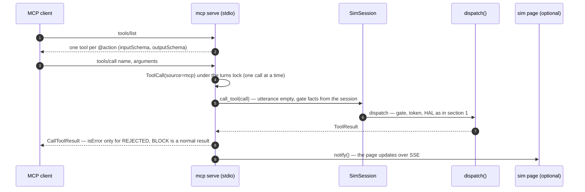
```mermaid
sequenceDiagram
    autonumber
    participant CL as MCP client
    participant M as mcp serve (stdio)
    participant S as SimSession
    participant D as dispatch()
    participant UI as sim page (optional)
    CL->>M: tools/list
    M-->>CL: one tool per @action (inputSchema, outputSchema)
    CL->>M: tools/call name, arguments
    M->>M: ToolCall(source=mcp) under the turns lock (one call at a time)
    M->>S: call_tool(call) — utterance empty, gate facts from the session
    S->>D: dispatch — gate, token, HAL as in section 1
    D-->>M: ToolResult
    M-->>CL: CallToolResult — isError only for REJECTED, BLOCK is a normal result
    M->>UI: notify() — the page updates over SSE
```

Lời gọi MCP không có lời người nói, nên `[system_one]` không gửi gì lên model: tiêu chí đó rơi về ngữ
pháp hoặc chặn. Một gate có thể từ chối riêng nguồn `mcp` qua tiêu chí `call_source`.

## 4. Lượt System 2 (LLM), kèm MCP server bên ngoài

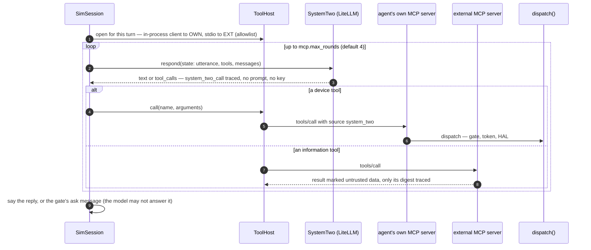
```mermaid
sequenceDiagram
    autonumber
    participant S as SimSession
    participant TH as ToolHost
    participant LLM as SystemTwo (LiteLLM)
    participant OWN as agent's own MCP server
    participant EXT as external MCP server
    participant D as dispatch()
    S->>TH: open for this turn — in-process client to OWN, stdio to EXT (allowlist)
    loop up to mcp.max_rounds (default 4)
        S->>LLM: respond(state: utterance, tools, messages)
        LLM-->>S: text or tool_calls — system_two_call traced, no prompt, no key
        alt a device tool
            S->>TH: call(name, arguments)
            TH->>OWN: tools/call with source system_two
            OWN->>D: dispatch — gate, token, HAL
        else an information tool
            TH->>EXT: tools/call
            EXT-->>TH: result marked untrusted data, only its digest traced
        end
    end
    S->>S: say the reply, or the gate's ask message (the model may not answer it)
```

Nhà cung cấp không trả lời được ⇒ `system_two_unavailable`, thiết bị nói câu offline. Nội dung từ MCP
server bên ngoài có chèn lệnh (prompt injection) thì lời gọi nó dẫn tới vẫn phải qua gate
(`test_mcp_host.py::test_prompt_injection_in_the_news_still_meets_the_gate`).

## 5. Model của System 1 và khi mất mạng

`SystemOne` là `FactSource` của engine. Với `[system_one]`, nó hỏi model chính (Jev qua System One API)
cho các tiêu chí được giao, trong phần ngân sách còn lại trừ 50 ms dự phòng; model không dùng được thì
ngữ pháp lệnh quyết.

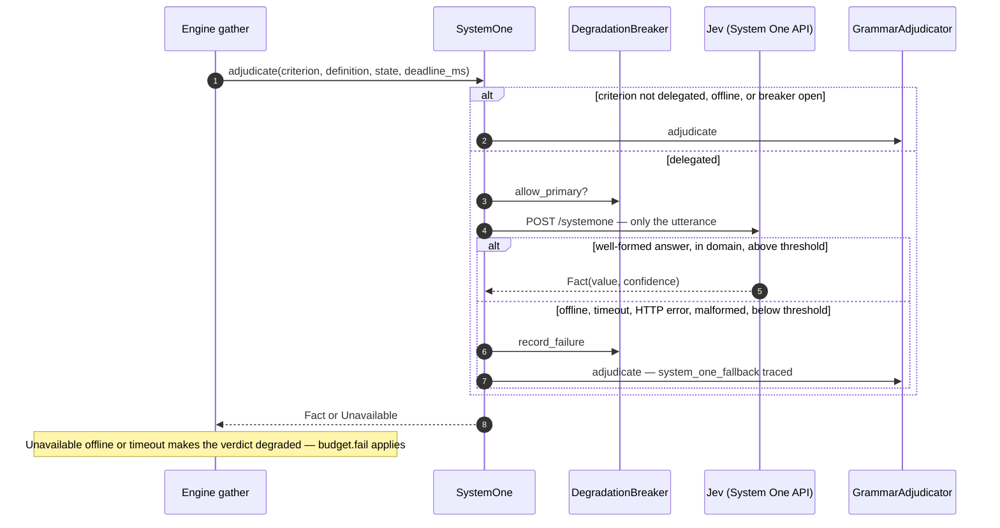
```mermaid
sequenceDiagram
    autonumber
    participant E as Engine gather
    participant S1 as SystemOne
    participant BR as DegradationBreaker
    participant JEV as Jev (System One API)
    participant GR as GrammarAdjudicator
    E->>S1: adjudicate(criterion, definition, state, deadline_ms)
    alt criterion not delegated, offline, or breaker open
        S1->>GR: adjudicate
    else delegated
        S1->>BR: allow_primary?
        S1->>JEV: POST /systemone — only the utterance
        alt well-formed answer, in domain, above threshold
            JEV-->>S1: Fact(value, confidence)
        else offline, timeout, HTTP error, malformed, below threshold
            S1->>BR: record_failure
            S1->>GR: adjudicate — system_one_fallback traced
        end
    end
    S1-->>E: Fact or Unavailable
    Note over E: Unavailable offline or timeout makes the verdict degraded — budget.fail applies
```

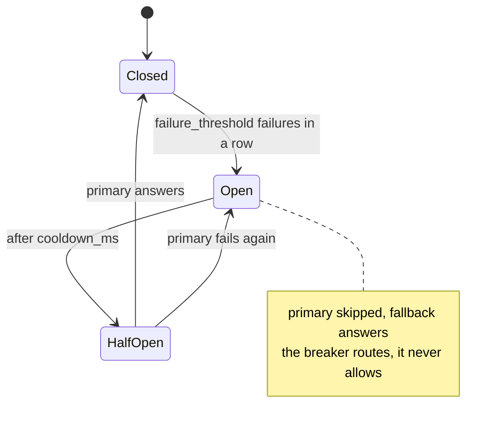
```mermaid
stateDiagram-v2
    [*] --> Closed
    Closed --> Open: failure_threshold failures in a row
    Open --> HalfOpen: after cooldown_ms
    HalfOpen --> Closed: primary answers
    HalfOpen --> Open: primary fails again
    note right of Open
        primary skipped, fallback answers
        the breaker routes, it never allows
    end note
```

Không có fallback nào chạy được cho một tiêu chí do model quyết ⇒ `BLOCK` với `gate_unreachable`
(Q-14, tiêu chí ra I4 số 3).

## 6. Thoại

### 6.1 Máy trạng thái hội thoại

Quy phạm ở `docs/spec/voice_fsm.md` §4 (T01–T14). Mọi lần đổi trạng thái ghi `voice_state_changed`.
Máy trạng thái không bao giờ lượng giá gate hay chạm chân.

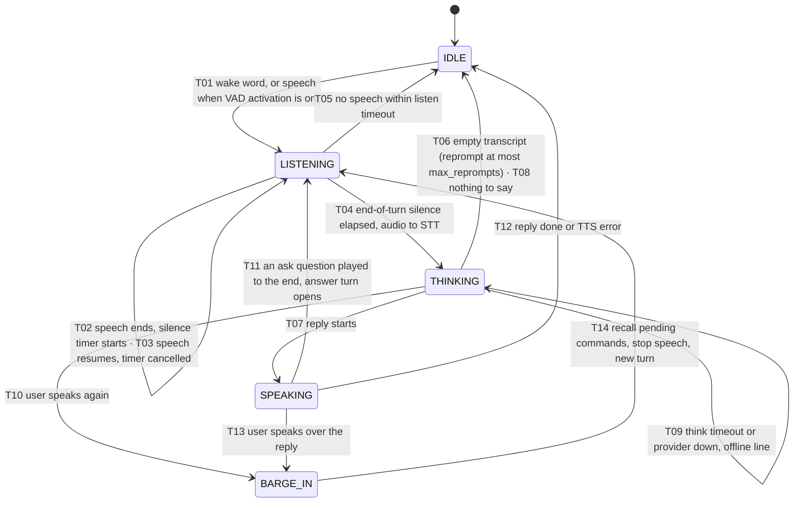
```mermaid
stateDiagram-v2
    [*] --> IDLE
    IDLE --> LISTENING: T01 wake word, or speech when VAD activation is on
    LISTENING --> LISTENING: T02 speech ends, silence timer starts · T03 speech resumes, timer cancelled
    LISTENING --> THINKING: T04 end-of-turn silence elapsed, audio to STT
    LISTENING --> IDLE: T05 no speech within listen timeout
    THINKING --> IDLE: T06 empty transcript (reprompt at most max_reprompts) · T08 nothing to say
    THINKING --> SPEAKING: T07 reply starts
    THINKING --> THINKING: T09 think timeout or provider down, offline line
    THINKING --> BARGE_IN: T10 user speaks again
    SPEAKING --> LISTENING: T11 an ask question played to the end, answer turn opens
    SPEAKING --> IDLE: T12 reply done or TTS error
    SPEAKING --> BARGE_IN: T13 user speaks over the reply
    BARGE_IN --> LISTENING: T14 recall pending commands, stop speech, new turn
```

### 6.2 Một lượt thoại từ tệp WAV

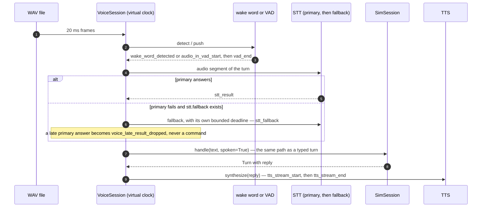
```mermaid
sequenceDiagram
    autonumber
    participant F as WAV file
    participant V as VoiceSession (virtual clock)
    participant W as wake word or VAD
    participant STT as STT (primary, then fallback)
    participant S as SimSession
    participant TTS as TTS
    F->>V: 20 ms frames
    V->>W: detect / push
    W-->>V: wake_word_detected or audio_in_vad_start, then vad_end
    V->>STT: audio segment of the turn
    alt primary answers
        STT-->>V: stt_result
    else primary fails and stt.fallback exists
        V->>STT: fallback, with its own bounded deadline — stt_fallback
        Note over V: a late primary answer becomes voice_late_result_dropped, never a command
    end
    V->>S: handle(text, spoken=True) — the same path as a typed turn
    S-->>V: Turn with reply
    V->>TTS: synthesize(reply) — tts_stream_start, then tts_stream_end
```

**Cắt lời** (`docs/spec/voice_fsm.md` §5): người dùng nói khi thiết bị đang nghĩ hoặc đang nói ⇒ loa
dừng, mọi lệnh **chưa giao** tới chân bị huỷ (`actuator_aborted`, lý do
`ACTUATOR_ABORTED_BY_BARGE_IN`) và token của chúng bị đóng. Lệnh đã giao (một xung đang chạy) chạy hết.

**Từ đánh thức hỏng** (mô hình không nạp được, adapter ném lỗi) ⇒ `wake_word_unavailable`, không lượt
nào mở, phiên vẫn chạy.

Phiên thoại hôm nay chạy trong **thời gian ảo** từ tệp WAV; phiên thời gian thực với micro thật chưa có
(`TODOS.md` #45).

## 7. Vòng bằng chứng: ghi, phát lại, so sánh

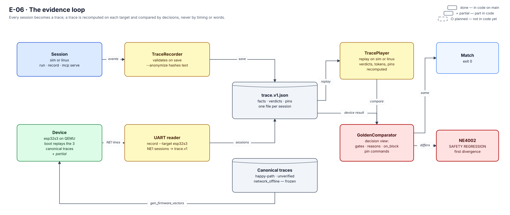
*Hình E-06 — Một phiên thành vết ghi; vết ghi được tính lại trên từng target và so với bản gốc.*

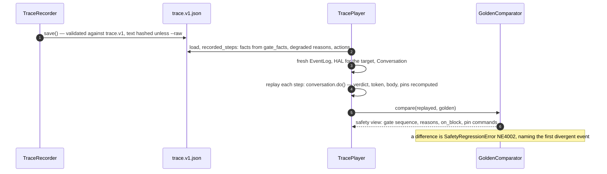
```mermaid
sequenceDiagram
    autonumber
    participant R as TraceRecorder
    participant F as trace.v1.json
    participant P as TracePlayer
    participant G as GoldenComparator
    R->>F: save() — validated against trace.v1, text hashed unless --raw
    P->>F: load, recorded_steps: facts from gate_facts, degraded reasons, actions
    P->>P: fresh EventLog, HAL for the target, Conversation
    P->>P: replay each step: conversation.do() — verdict, token, body, pins recomputed
    P->>G: compare(replayed, golden)
    G-->>P: safety view: gate sequence, reasons, on_block, pin commands
    Note over G: a difference is SafetyRegressionError NE4002, naming the first divergent event
```

- Phát lại **không gọi model và không đọc máy**: dữ kiện đã ghi được đưa vào lại, còn phán quyết, token
  và lệnh chân được **tính lại**.
- So sánh theo **quyết định** (phán quyết, lý do, `on_block`, lệnh chân), bỏ qua thời gian và chữ nói.
- `neuroedge verify --targets sim,linux,esp32s3` làm việc này cho mọi vết ghi chuẩn mực trên từng target;
  trên `esp32s3`, chính firmware phát lại ba vết ghi chuẩn mực lúc khởi động và gửi kết quả qua UART.

## 8. Từ agent tới chip

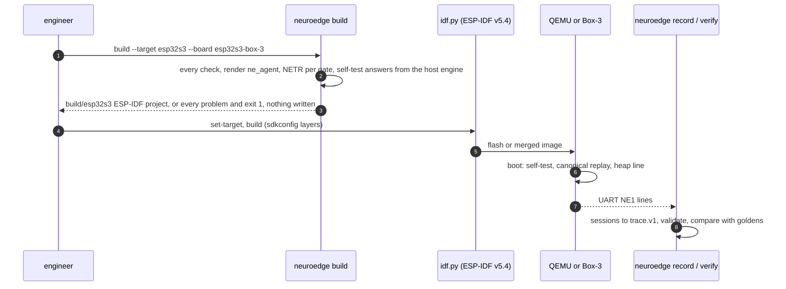
```mermaid
sequenceDiagram
    autonumber
    participant U as engineer
    participant B as neuroedge build
    participant I as idf.py (ESP-IDF v5.4)
    participant Q as QEMU or Box-3
    participant R as neuroedge record / verify
    U->>B: build --target esp32s3 --board esp32s3-box-3
    B->>B: every check, render ne_agent, NETR per gate, self-test answers from the host engine
    B-->>U: build/esp32s3 ESP-IDF project, or every problem and exit 1, nothing written
    U->>I: set-target, build (sdkconfig layers)
    I->>Q: flash or merged image
    Q->>Q: boot: self-test, canonical replay, heap line
    Q-->>R: UART NE1 lines
    R->>R: sessions to trace.v1, validate, compare with goldens
```

## 9. Vòng đời một phiên `linux`

1. `SimSession.load(target="linux")` dựng `TypedLinuxHAL` và gọi `preflight`: mọi cảm biến, màn hình,
   thiết bị âm thanh agent cần được kiểm **trước khi** giữ line GPIO nào. Thiếu thứ gì ⇒ lỗi ba phần,
   mã 1, không line nào bị giữ.
2. Lệnh chân tới line của kernel qua libgpiod v2, tìm theo tên. Xung có thời lượng được thả bằng một
   bộ hẹn giờ; `run -c` chờ xung chạy hết trước khi thoát.
3. Thoát — bình thường, Ctrl-D, SIGTERM (client MCP dừng máy chủ), SIGHUP (đóng terminal) — ⇒ mọi line
   về trạng thái nghỉ và được thả. SIGKILL thì không bắt được: đó là lý do an toàn phần cứng vẫn cần
   (`docs/spec/threat_model.md` §3b).

## 10. Luồng quy hoạch

| Luồng | Increment | Kiến trúc đích |
|:---|:---|:---|
| Lượt thoại trên chip | I5 | [`15`](15-target-architecture.md) §2.2 |
| Từ chối do phong bì an toàn vật lý | I12 | [`15`](15-target-architecture.md) §4.2 |
| Nguồn gọi kích hoạt từ sự kiện (`call_source = "trigger"`, TSK-N6-*) | I12 | [`15`](15-target-architecture.md) §4.2 |
| Ý định đa node và mất liên lạc | I14 | [`15`](15-target-architecture.md) §4.3 |
| Dữ kiện thị giác | I15 | [`15`](15-target-architecture.md) §4.4 |

