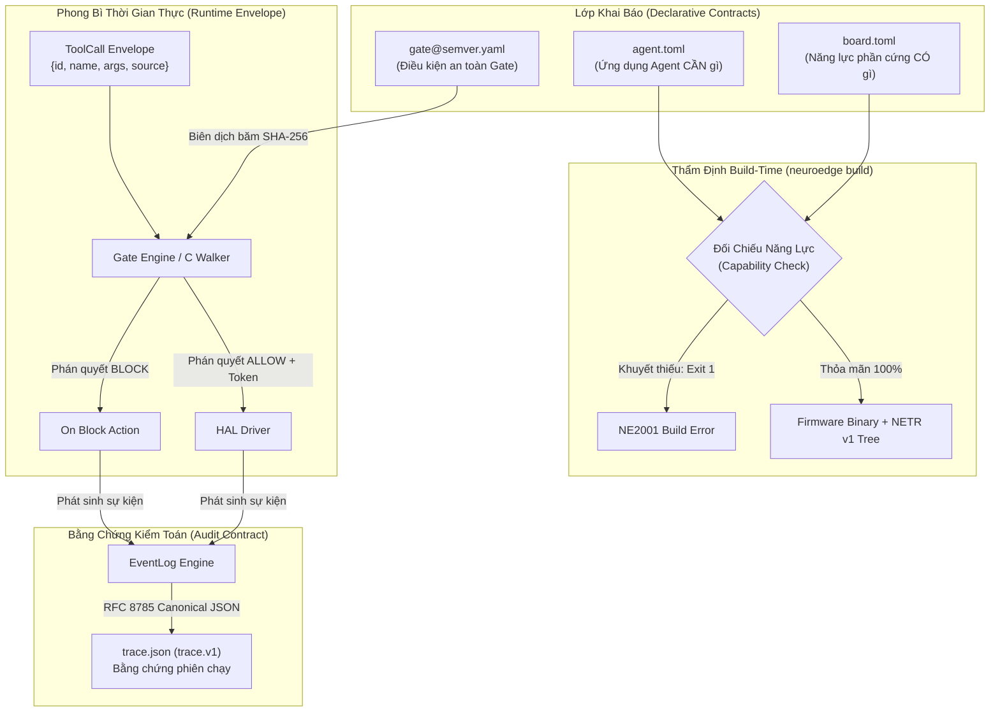
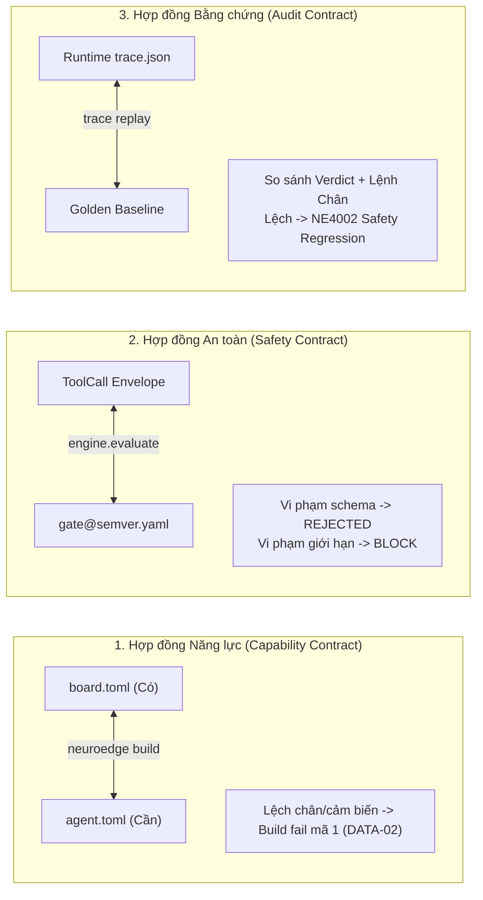

# 07 · Hợp đồng dữ liệu & Khế ước giao diện

> **Trạng thái:** `done` · Chuẩn hóa hợp đồng dữ liệu chuẩn tắc (Data Contracts)  
> **Ràng buộc bắt buộc:** PRD §10 (DATA-01..DATA-06) · [RFC-0003](file:///Users/minhlt/Downloads/Projects/neuroedge-init/docs/rfcs/RFC-0003-binary-decision-tree.md), [RFC-0005](file:///Users/minhlt/Downloads/Projects/neuroedge-init/docs/rfcs/RFC-0005-gate-argument-limits.md)  
> **Lược đồ kiểm toán:** `schemas/board.v1.json`, `schemas/gate.v1.json`, `schemas/trace.v1.json`

---

## 1. Bản đồ tổng thể 4 Tập tin & 1 Phong bì Runtime

Kiến trúc NeuroEdge được xây dựng dựa trên nguyên tắc **khế ước dữ liệu khai báo tường minh (Declarative Contracts)**. Mọi giao tiếp giữa phần cứng, agent logic, bộ kiểm soát an toàn và vết ghi kiểm toán đều được đặc tả qua 4 file dữ liệu và 1 phong bì chuyển tiếp thống nhất:



---

## 2. Đặc tả chi tiết 4 Tập tin Chuẩn tắc

### 2.1. `board.toml` (`board.v1`): Tuyên bố năng lực phần cứng

Bo mạch khai báo các khả năng vật lý thông qua 5 nguyên thủy chuẩn tắc (Audio In, Audio Out, Digital Out, Sensor Read, Display).

```toml
# board.toml — Đặc tả bo mạch ESP32-S3 Box-3 (Tham chiếu)
[board]
id     = "esp32s3-box3"
name   = "ESP32-S3-BOX-3 Development Kit"
target = "esp32s3"
mcu    = "esp32s3"

[capabilities.audio_in]
channels       = 2
sample_rate_hz = 16000
aec            = true       # Acoustic Echo Cancellation trên chip
vad            = true       # Voice Activity Detection phần cứng

[capabilities.audio_out]
channels       = 1
sample_rate_hz = 16000

[capabilities.digital_out]
backend = "gpio"
# RÀNG BUỘC DATA-01: Tên logic, TUYỆT ĐỐI KHÔNG dùng số chân vật lý trong code ứng dụng
pins = ["status_led", "porch_light", "relay_ch1", "door_lock"]

[capabilities.sensor_read]
sensors = ["temperature", "humidity", "motion", "ambient_light"]

[capabilities.display]
width  = 320
height = 240
color  = "rgb565"
```

> **Ràng buộc DATA-01:**  
> Mã nguồn `@action` và `agent.toml` chỉ được phép tham chiếu chân bằng **tên logic** (ví dụ: `"porch_light"`). Bản đồ ánh xạ từ tên logic sang chỉ số chân vật lý (GPIO index) nằm độc quyền trong tầng cấu hình bo mạch hoặc BSP driver của OEM.

---

### 2.2. `agent.toml`: Khai báo nhu cầu và cấu hình Agent

Định nghĩa toàn bộ các yêu cầu tài nguyên, danh sách gate bảo vệ, cấu hình mô phỏng và định tuyến System 2:

```toml
# agent.toml — Cấu hình Trợ lý Nhà Thông minh
[agent]
name    = "home-voice"
version = "1.0.0"

# Đối chiếu DATA-02: Mọi mục trong requires phải có trong board.toml
[requires]
"audio.in"    = { channels = 1 }
"audio.out"   = { sample_rate_hz = 16000 }
"digital.out" = { pins = ["porch_light", "door_lock"] }
"sensor.read" = { sensors = ["motion"] }

[gates]
light_on    = "gates/light_on@1.0.0.yaml"
unlock_door = "gates/unlock_door@1.0.0.yaml"

[targets]
supported = ["sim", "linux", "esp32s3"]

# Dữ kiện cảm biến mô phỏng (Simulation Harness)
[sim.sensors]
motion = false

# Ánh xạ từ cảm biến sang dữ kiện Gate
[sim.sensor_facts]
room_empty = { sensor = "motion", equals = false }

# Định tuyến Cloud System 2 (Tùy chọn)
[system_two]
provider    = "litellm"
model       = "anthropic/claude-sonnet-5"
api_key_env = "ANTHROPIC_API_KEY"
timeout_s   = 15

# Tích hợp công cụ mở rộng qua MCP (Q-27)
[mcp]
max_rounds = 4

[mcp.servers.weather]
command = "python"
args    = ["mcp/weather_server.py"]
tools   = ["get_forecast"]
```

---

### 2.3. `<gate>@<semver>.yaml` (`gate.v1`): Hợp đồng an toàn bất biến

Gate là rào chắn phân giải phán quyết trước khi bất kỳ cơ cấu chấp hành nào được kích hoạt:

```yaml
# gates/unlock_door@1.0.0.yaml
schema: "neuroedge.gate/v1"
name: "unlock_door"
version: "1.0.0"

# Giới hạn tham số nghiêm ngặt theo RFC-0005 (Kiểm tra trước khi evaluate)
arguments:
  door_id:
    type: "string"
    enum: ["front_door", "back_door"]
    max_length: 32
  duration_seconds:
    type: "integer"
    minimum: 1
    maximum: 30

# Các tiêu chí sự thật cần phân giải
evaluate:
  user_authorized:
    type: "bool"
    instructions: "Xác thực người dùng có quyền mở cửa"
  security_state:
    type: "choice"
    options: ["disarmed", "stay", "away"]
    instructions: "Trạng thái hệ thống an ninh"

# Điều kiện cấp quyền (Chỉ được phép siết chặt khi kế thừa)
allow_when:
  user_authorized: true
  security_state: "disarmed"

# Hành vi khi phán quyết bị từ chối
on_block:
  action: "ask"
  confirms: ["user_authorized"]  # RFC-0006: Người có thể bấm nút trên thiết bị để ghi đè

# Ngân sách thời gian và hành vi sự cố
budget:
  p95_latency_ms: 250
  fail: "closed"                 # Bắt buộc fail: closed đối với hành động vật lý nguy hiểm
```

#### Quy tắc SemVer cho Gate (`<gate>@<semver>.yaml`)
- **Tăng Major (`X.0.0`):** Bất kỳ thay đổi nào làm thay đổi biểu thức `allow_when`, sửa đổi tên tiêu chí, hoặc nới lỏng tham số. Các thay đổi này làm thay đổi `gate_digest` SHA-256 và bắt buộc phải qua quy trình RFC cùng lệnh cập nhật `digests.lock`.
- **Tăng Minor (`1.X.0`):** Bổ sung tiêu chí mới hoặc siết chặt khoảng tham số (tăng `minimum`, giảm `maximum`).
- **Tăng Patch (`1.0.X`):** Sửa lỗi chính tả trong trường `instructions` mà không làm thay đổi logic đánh giá.

---

### 2.4. `trace.json` (`trace.v1`): Bằng chứng kiểm toán phiên chạy

Vết ghi kiểm toán lưu trữ toàn bộ các sự kiện xảy ra trong một phiên hoạt động, được định dạng theo chuẩn **RFC 8785 JSON Canonicalization Scheme (JCS)**:

```json
{
  "$schema": "https://schema.neuroedge.dev/trace/v1.json",
  "metadata": {
    "session_id": "sess_4f8a12bc9e",
    "timestamp_utc": "2026-09-26T08:15:30Z",
    "target": "esp32s3",
    "board_id": "esp32s3-box3",
    "agent_version": "1.0.0",
    "build_digest": "sha256:7c92b8e391...",
    "device_id": "dev_esp32_mac_aabbccddeeff"
  },
  "events": [
    {
      "offset_ms": 0,
      "type": "lifecycle_session_start",
      "data": { "wake_reason": "vad_trigger" }
    },
    {
      "offset_ms": 120,
      "type": "voice_vad_complete",
      "data": { "speech_duration_ms": 950 }
    },
    {
      "offset_ms": 185,
      "type": "routing_dispatched",
      "data": { "path": "system_1", "tool_name": "light_on" }
    },
    {
      "offset_ms": 210,
      "type": "gate_evaluated",
      "data": {
        "gate_name": "light_on",
        "gate_digest": "sha256:2c20dc42616d...",
        "verdict": "ALLOW",
        "reason": "NONE",
        "p95_remaining_ms": 225
      }
    },
    {
      "offset_ms": 215,
      "type": "actuator_command_executed",
      "data": {
        "pin": "porch_light",
        "logical_pin_index": 4,
        "operation": "digital_out",
        "level": 1
      }
    },
    {
      "offset_ms": 450,
      "type": "voice_tts_complete",
      "data": { "duration_ms": 235 }
    },
    {
      "offset_ms": 455,
      "type": "lifecycle_session_closed",
      "data": { "status": "completed", "total_latency_ms": 455 }
    }
  ]
}
```

---

## 3. Phong bì Runtime: `ToolCall` Envelope

Mọi lệnh kích hoạt công cụ (từ ngữ pháp cục bộ System 1, LLM System 2, MCP Tools, hoặc Test Runner) đều được chuẩn hóa qua một phong bì duy nhất:

```json
{
  "id": "call_9a8f21cd",
  "name": "light_on",
  "arguments": {
    "room": "porch",
    "brightness": 100
  },
  "source": "local_grammar"
}
```

### Quy tắc bảo vệ trường `source` (Source Integrity Rule)
- Trường `source` nhận một trong các giá trị: `"local_grammar"`, `"system_one"`, `"system_two"`, `"mcp"`, `"test"`.
- **Ràng buộc an ninh:** Trường `source` do chính Dispatcher của runtime đóng dấu và quản lý. Nếu một caller bên ngoài (như Cloud LLM) cố tình gửi chuỗi JSON có sẵn trường `"source"`, Dispatcher sẽ lập tức từ chối lệnh với mã lỗi **REJECTED (Protocol Violation)** nhằm chống giả mạo nguồn gốc lệnh.

---

## 4. Ba Cặp Đối Chiếu Hợp Đồng Hai Chiều (Bidirectional Contracts)

Kiến trúc NeuroEdge kiểm soát tính an toàn qua 3 phép kiểm tra chéo độc lập:



1. **Hợp đồng Năng lực:** Đối chiếu giữa phần cứng có (`board.toml`) và ứng dụng cần (`agent.toml [requires]`). Nếu thiếu bất kỳ nguyên thủy phần cứng nào, trình biên dịch từ chối sinh mã firmware (`DATA-02`).
2. **Hợp đồng An toàn:** Đối chiếu giữa lệnh thực thi (`ToolCall`) và chính sách Gate. Mọi đối số ngoài dải đều bị chuyển thành `BLOCK` an toàn (`argument_out_of_range`).
3. **Hợp đồng Bằng chứng:** Đối chiếu giữa vết ghi thực tế và vết chuẩn (Golden). Công cụ replay tính toán lại toàn bộ phán quyết; nếu có bất kỳ sự trôi lệch logic nào giữa các mục tiêu (Sim vs Linux vs Chip thật), hệ thống sẽ kích hoạt cảnh báo suy thoái an toàn (Safety Regression).
