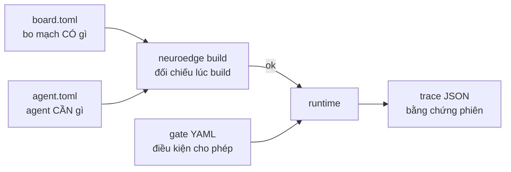

# 07 · Hợp đồng dữ liệu

> Ràng buộc bắt buộc: PRD §10 (DATA-01..DATA-06). Chi tiết trường: Phụ lục
> A–C của tài liệu nguồn + `schemas/`. Tài liệu này chỉ vẽ quan hệ.

## 1. Bốn file + một phong bì

| File | Định dạng | Vai trò một câu | Quy tắc phiên bản |
|:---|:---|:---|:---|
| `board.toml` | TOML (`board.v1`) | Bo mạch khai năng lực 5 nguyên thủy, chân **tên logic** | PR thường (cần phần cứng thật để điền số) |
| `agent.toml` | TOML | Agent khai `[requires]`, gates, `[sim.*]` facts, `[system_two]`, `[mcp.servers]` | PR thường |
| `<gate>@<semver>.yaml` | YAML (`gate.v1`) | `evaluate/allow_when/on_block/budget` + `arguments`; đổi `allow_when` = tăng major | Sửa/xóa gate chuẩn mực → **RFC** + `digests.lock` |
| `<phiên>.json` | JSON (`trace.v1`) | 6 nhóm sự kiện + `metadata`; `type` sự kiện mở (thêm event không cần RFC) | URL `/v1→/v2`; vết cũ replay được sau nâng cấp phụ |
| `ToolCall` envelope | runtime object | `{id, name, arguments, source}` — cùng một đường cho mọi nguồn gọi | Đóng băng vào `schemas/` khi có client ngoài đầu tiên (`TODOS.md` #23) |

## 2. Ba cặp đối chiếu (hợp đồng hai chiều)

1. **Năng lực**: `board.toml` (có) ↔ `[requires]` + `@action(requires)` (cần) —
   lệch thì `build` fail mã 1, không sinh firmware (DATA-02).
2. **An toàn**: `ToolCall` ↔ gate (`arguments` + `allow_when` + `call_source`) —
   lạ thì REJECTED, ngoài giới hạn thì BLOCK, không chân nào đổi trong cả hai.
3. **Bằng chứng**: vết ghi ↔ golden — replay tính lại, golden chỉ so phán quyết
   + lệnh chân (DATA-06: bỏ timestamp và nội dung thô).

DATA-01 (tên logic, không số chân vật lý) + DATA-04 (`evaluate` ánh xạ 1-1 với
3 kiểu `SystemOne`) là hai ràng buộc giữ P-2 và P-4 đứng vững khi đổi
board/provider.
