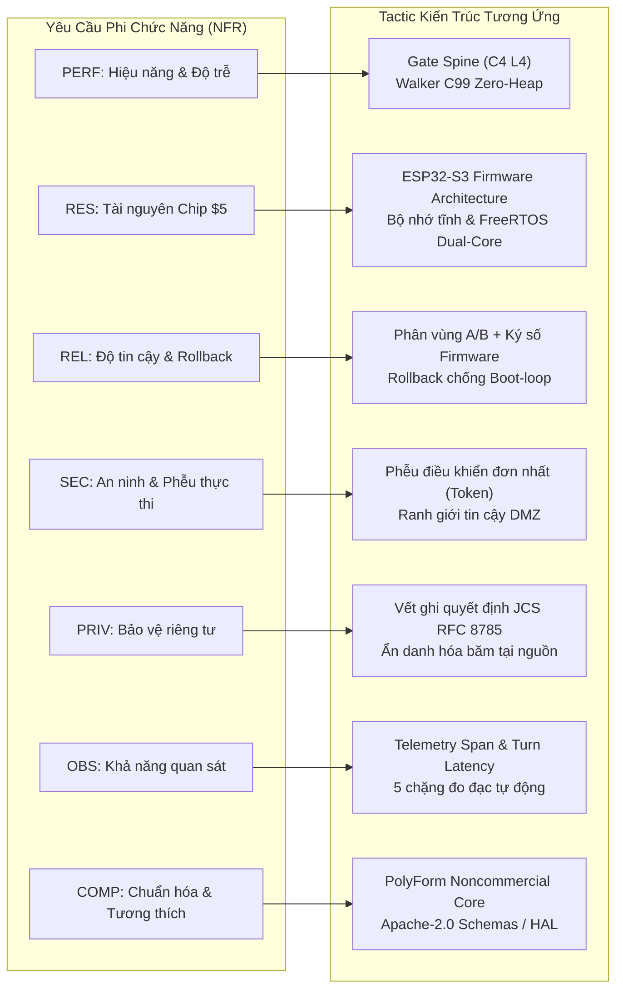

# 08 · Yêu cầu phi chức năng (NFR) → Tactic Kiến trúc

> **Trạng thái:** `done` · Chuẩn hóa đối chiếu NFR và biện pháp kỹ thuật kiến trúc  
> **Tài liệu tham chiếu:** PRD §9, PRD Phụ lục A.3, [04-component-device-c4l3.md](file:///Users/minhlt/Downloads/Projects/neuroedge-init/docs/architecture/vi/04-component-device-c4l3.md), [05-code-gate-hal-c4l4.md](file:///Users/minhlt/Downloads/Projects/neuroedge-init/docs/architecture/vi/05-code-gate-hal-c4l4.md)  
> **Hệ thống kiểm chứng CI:** `ci/nightly-hardware.yml`, `ci/nfr-performance.yml`, `ci/security-audit.yml`

---

## 1. Bản đồ tổng thể NFR và Tactic Kiến trúc

Kiến trúc NeuroEdge được thiết kế để thỏa mãn 7 nhóm yêu cầu phi chức năng cốt lõi (PERF, RES, REL, SEC, PRIV, OBS, COMP) thông qua các chiến thuật phân tách ranh giới, tối ưu hóa không cấp phát động và thẩm định kiểm toán liên tục:

---

## 2. Hiệu năng & Thời gian thực (PERF-01..07)

| Mã NFR | Chỉ tiêu định lượng | Tactic kiến trúc giải quyết | Cơ chế kiểm chứng CI / Thiết bị | Hành động khi vi phạm |
| :--- | :--- | :--- | :--- | :--- |
| **PERF-01** | Độ trễ vòng thoại Streaming P95 $\le 850$ ms | Kiến trúc Cloud-first: STT/TTS chạy streaming qua WebSocket/gRPC; Audio DMA đẩy trực tiếp vào I2S RingBuffer. | Đo lưu lượng audio loopback trong kịch bản kiểm thử thoại tự động `test_voice_e2e.py`. | Cảnh báo suy thoái độ trễ; chặn merge PR nếu P95 $> 950$ ms. |
| **PERF-02** | Đánh giá Gate cục bộ P95 $< 120$ ms (mục tiêu $< 5$ ms trên chip) | Trình duyệt C99 walker (`ne_walker.c`) đọc trực tiếp cây nhị phân `NETR v1` trên Flash memory-mapped, không cấp phát heap, kiểm tra bitmask $O(1)$. | Benchmarking nightly trên phần cứng thật ESP32-S3 qua UART telemetry (`ci/nfr-performance.yml`). | Chặn phát hành nếu vi phạm P95 $> 120$ ms. |
| **PERF-03** | Đánh giá Gate qua Cloud P95 $< 450$ ms | Cơ chế Adjudicator với hạn chót (Deadline) ngân sách: Trừ dần thời gian còn lại của `budget.p95`; nếu timeout lập tức kích hoạt `Unavailable` và xử lý theo fail-closed. | Kiểm tra mô phỏng timeout trong `test_gate_engine.py` với giả lập độ trễ mạng 500 ms. | Tự động hạ cấp phán quyết sang `BLOCK: BUDGET_EXCEEDED`. |
| **PERF-04** | Nhận diện mẫu System 1 P95 $< 100$ ms | Bộ nhận diện ngữ pháp cục bộ dựa trên trie và regex tối ưu (`system_one/grammar.py`), không gọi mô hình ngôn ngữ lớn. | Kiểm thử tải 10,000 câu lệnh mẫu cục bộ trong suite `test_grammar_perf.py`. | Fail CI nếu P95 $> 50$ ms. |
| **PERF-05** | Ngắt cơ cấu chấp hành khi Barge-in $\le 20$ ms | Tín hiệu ngắt VAD gửi trực tiếp qua FreeRTOS Event Group tới Action Dispatcher; thu hồi token và gọi HAL emergency stop trong $\le 1$ khung âm thanh (20 ms). | Đo bằng logic analyzer / oscilloscope đo chân GPIO ngắt động cơ khi phát xung âm thanh chen ngang. | Lỗi nghiêm trọng P0 (Chặn toàn bộ bản build). |
| **PERF-06** | Tắt tiếng Loa khi Barge-in $< 300$ ms | Xả sạch (flush) ngay lập tức bộ đệm I2S DMA RingBuffer trên Core 0 ngay khi VAD xác nhận năng lượng giọng nói. | Thu âm kiểm tra độ dài tiếng dư thừa sau thời điểm phát xung kích hoạt barge-in. | Chặn phát hành firmware nếu tiếng vang kéo dài $> 300$ ms. |
| **PERF-07** | Độ trễ vòng thoại Request-Response P95 $\le 1500$ ms | Tối ưu hóa pipeline System 2, pre-warming kết nối TLS tới LLM provider, sử dụng phong bì công cụ gọn nhẹ. | Đo đạc tổng thể phiên chạy trong vết ghi kiểm toán `turn_latency`. | Cảnh báo hiệu năng trên bảng điều khiển. |

---

## 3. Quản lý tài nguyên phần cứng (RES-01..04)

| Mã NFR | Giới hạn ngân sách | Tactic kiến trúc giải quyết | Cơ chế kiểm chứng CI / Thiết bị | Hành động khi vi phạm |
| :--- | :--- | :--- | :--- | :--- |
| **RES-01** | Giá thành phần cứng mục tiêu $\le 5$ USD | Tối ưu hóa chạy trên SoC đơn chip ESP32-S3 (Dual-core Xtensa LX7, Wi-Fi 4 + BLE 5), không cần bộ tăng tốc NPU ngoài đắt tiền. | Rà soát hóa đơn nguyên vật liệu (BOM) định kỳ cùng đối tác OEM. | Từ chối bổ sung thư viện nặng đòi hỏi chip cao cấp hơn. |
| **RES-02** | Bộ nhớ khả dụng sau khởi động: SRAM $\ge 120$ KB, PSRAM $\ge 2$ MB | Toàn bộ buffer DMA âm thanh cấp phát tĩnh trong PSRAM lúc boot; không dùng `malloc()` trong vòng lặp runtime; bảng cây `NETR` map trực tiếp vào Flash ROM. | Lệnh `memory_probe` lúc boot gửi dung lượng heap thực tế qua vết khởi động `lifecycle_boot`. | Build CI fail nếu dung lượng heap rảnh của firmware nhỏ hơn ngưỡng. |
| **RES-03** | Kích thước Flash Firmware $\le 3.5$ MB | Tối ưu biên dịch `-Os`, tách biệt phân vùng A/B 3.5 MB mỗi slot, loại bỏ các symbol debug không cần thiết. | Script kiểm tra kích thước file nhị phân `check_firmware_size.py` chạy trên artifact build. | Chặn merge PR nếu kích thước file `.bin` vượt quá 3.5 MB ($3,670,016$ bytes). |
| **RES-04** | An toàn 100% khi hoạt động ngoại tuyến | Cây quyết định Gate, cơ chế Token Ledger và Voice FSM chạy 100% cục bộ trên vi điều khiển; khi mất mạng vẫn kích hoạt ngữ pháp lệnh cố định (P0). | Bộ kịch bản kiểm thử suy giảm mạng ngắt kết nối vật lý `test_offline_resilience.py`. | Bất kỳ trường hợp treo thiết bị hoặc kích hoạt sai khi offline đều là lỗi P0. |

---

## 4. Độ tin cậy & Vận hành (REL-01..04)

| Mã NFR | Chỉ tiêu định lượng | Tactic kiến trúc giải quyết | Cơ chế kiểm chứng CI / Thiết bị |
| :--- | :--- | :--- | :--- |
| **REL-01** | Cập nhật OTA quy mô 1,000 thiết bị: 0 trường hợp Brick | Phân vùng kép `ota_0` và `ota_1` kèm RTC Boot Counter: Firmware mới phải vượt qua 5 trạm tự kiểm tra (Self-tests) trước khi xác nhận `esp_ota_mark_app_valid_cancel_rollback()`. | Kiểm thử tự động nâng cấp firmware giả lập lỗi nguồn ngẫu nhiên trên QEMU và giá thử nghiệm phần cứng. |
| **REL-02** | Mặc định Fail-Closed trên toàn hệ thống | Mọi trạng thái không xác định, mất kết nối nguồn sự thật, lỗi cấu trúc gate, hoặc hết slot Token đều dẫn tới phán quyết `BLOCK` và từ chối kích hoạt HAL. | 100% test case trong `tests/test_fail_closed.py` kiểm tra các nhánh ngoại lệ. |
| **REL-03** | Kiểm thử phần cứng liên tục (Nightly CI) | Workflow `nightly-hardware.yml` chạy trên cụm bo mạch thực tế kết nối qua runner tự quản lý, kiểm thử GPIO, I2C, SPI, UART. | Báo cáo kiểm thử phần cứng hàng ngày; trôi lệch kết quả giữa Sim và Phần cứng kích hoạt báo động. |
| **REL-04** | Thời gian hoạt động liên tục (MTBF) $\ge 720$ giờ | Thiết kế kiến trúc không rò rỉ bộ nhớ (Zero dynamic heap drift), FreeRTOS Task Watchdog Timer (TWDT) giám sát Core 0 và Core 1. | Kiểm thử ngâm (Soak Testing) 7 ngày liên tục trên giá thử nghiệm nhiệt độ cao. |

---

## 5. An ninh & Ranh giới tin cậy (SEC-01..09)

| Mã NFR | Ràng buộc an ninh | Tactic kiến trúc giải quyết | Cơ chế kiểm chứng |
| :--- | :--- | :--- | :--- |
| **SEC-01** | Cấm mọi đường tắt tới chân vật lý | Toàn bộ các hàm điều khiển HAL (`ne_hal_digital_out`,...) đều yêu cầu tham số `ne_token`. Không có token hợp lệ, chân không đổi trạng thái. | Kiểm toán mã nguồn tự động cấm gọi trực tiếp ESP-IDF `gpio_set_level()` bên ngoài HAL driver. |
| **SEC-02** | Bảo mật cấp phần cứng (Root of Trust) | Kích hoạt phần cứng ESP32-S3 Secure Boot v2 (chữ ký số RSA-3072) và Flash Encryption (mã hóa XTS-AES-128 phần cứng). | Quy trình nạp khóa eFuse tại xưởng sản xuất và script kiểm tra trạng thái bảo vệ chip. |
| **SEC-03** | Công tắc vật lý ngắt Micro | Thiết kế mạch phần cứng ngắt điện trực tiếp đường cấp nguồn micro (Hardware Kill-switch), không phụ thuộc vào phần mềm. | Sơ đồ nguyên lý mạch (Schematic) được kiểm toán bởi chuyên gia an ninh phần cứng. |
| **SEC-04** | Bảo mật đường truyền mạng | Toàn bộ kết nối ra Internet bắt buộc TLS 1.3 với Certificate Pinning; các giao tiếp quản trị nội bộ dùng mTLS. | Quét lưu lượng mạng bằng Wireshark/Zeek trong môi trường staging; chặn mọi gói tin không mã hóa. |
| **SEC-05** | Định danh thiết bị duy nhất | Mỗi thiết bị sở hữu một cặp khóa riêng biệt lưu trong phân vùng mã hóa NVS, định danh bằng băm MAC và UUID phần cứng. | Kiểm tra chứng chỉ xuất xưởng trong quá trình kiểm thử dây chuyền sản xuất. |
| **SEC-06** | Ký số toàn vẹn Firmware | Bản build firmware và tệp `NETR v1` được ký điện tử; bootloader từ chối nạp nhị phân nếu chữ ký không khớp khóa công khai. | Kiểm tra chữ ký tự động trong pipeline CI trước khi đẩy artifact lên kho OTA. |
| **SEC-07** | Sandbox mã nguồn mở rộng bên thứ ba | Các extension và plugin bên thứ ba chạy trong môi trường bị cô lập (WASM hoặc quy trình stdio riêng), chỉ giao tiếp qua IPC chuẩn. | Khung kiểm thử cô lập quy trình (Process Isolation Tests). |
| **SEC-08** | Cách ly ranh giới AI Provider | Tách biệt hoàn toàn API key trong biến môi trường host; mã hóa token xác thực khi chuyển tiếp; ghi rõ danh tính provider trong trace. | Phân tích tĩnh phát hiện lọt khóa bí mật (Secret Scanning) trong git commit. |
| **SEC-09** | Xử lý bên gọi không tin cậy | Mọi yêu cầu từ Cloud LLM và MCP Server đều bị coi là không tin cậy (Untrusted Caller); trường `source` do Dispatcher tự đóng dấu. | Bộ kiểm thử giả mạo giao thức (Fuzzing & Injection Test Suite). |

---

## 6. Quyền riêng tư & Quản trị vết ghi (PRIV-01..04)

1. **PRIV-01 (Mặc định không lưu âm thanh thô):** Luồng âm thanh sau khi nhận diện VAD và chuyển văn bản STT sẽ bị xóa khỏi bộ đệm vòng DMA. Hệ thống tuyệt đối không ghi âm thanh thô vào Flash hoặc gửi về Cloud trừ khi người dùng chủ động kích hoạt chế độ chẩn đoán (Opt-in Debug).
2. **PRIV-02 (Vết ghi chỉ lưu phán quyết):** Vết ghi `trace.json` chỉ ghi lại metadata, chuỗi phán quyết an toàn (`ALLOW`/`BLOCK`), thông số độ trễ và lệnh chân. Không lưu trữ nội dung hội thoại nhạy cảm của người dùng.
3. **PRIV-03 (Ẩn danh hóa tại nguồn):** Các định danh người dùng (PII) được băm một chiều bằng hàm băm giữ nguyên đặc tính quyết định (Decision-Preserving Hash), bảo đảm dữ liệu ẩn danh nhưng vẫn có thể dùng để chạy Replay kiểm toán.
4. **PRIV-04 (Tuân thủ quyền xóa dữ liệu):** Dữ liệu vết ghi trên đám mây tuân thủ chuẩn GDPR/CCPA; mỗi phiên ghi có vòng đời tối đa 30 ngày trừ khi được gắn cờ lưu trữ kiểm toán an toàn (Golden Trace).

---

## 7. Khả năng quan sát & Giám sát vận hành (OBS-01..03)

1. **OBS-01 (Mỗi phiên là một vết ghi trọn vẹn):** Mỗi phiên tương tác thoại/lệnh từ lúc kích hoạt tới lúc trả kết quả được bao bọc trong một `session_id` duy nhất và xuất ra một tệp vết ghi JSON hoàn chỉnh.
2. **OBS-02 (Đo đạc 5 chặng độ trễ Turn Latency):** Mỗi lượt tương tác tự động đo lường và ghi lại thời gian thực thi của 5 chặng:
   - `audio_vad_ms`: Thời gian phát hiện giọng nói và kết thúc câu.
   - `stt_recognition_ms`: Thời gian nhận diện giọng nói thành văn bản.
   - `routing_decision_ms`: Thời gian phân giải lộ trình System 1 vs System 2.
   - `gate_evaluation_ms`: Thời gian duyệt cây quyết định an toàn.
   - `hal_execution_ms`: Thời gian kích hoạt phần cứng và phát âm thanh phản hồi.
3. **OBS-03 (Tổng kết phiên toàn diện):** Kết thúc phiên ghi nhận sự kiện `session_summary` thống kê tỷ lệ phân phối System 1 / System 2, tổng số token LLM tiêu thụ và chi phí ước tính.

---

## 8. Chuẩn hóa & Tương thích (COMP-01..06)

1. **COMP-01 (Mô hình Giấy phép kép):** Phần lõi bảo mật và runtime sử dụng giấy phép **PolyForm Noncommercial 1.0.0**; các lược đồ hợp đồng dữ liệu (`schemas/`) và mã khung giao diện HAL (`hal-stubs/`) sử dụng giấy phép **Apache-2.0** thân thiện với đối tác tích hợp (ADR Q-45).
2. **COMP-02 (Tương thích Python Host):** Mã nguồn máy chủ và công cụ dòng lệnh hỗ trợ chính thức Python $\ge 3.11$ trên các kiến trúc Linux x86_64 và ARM64 (Debian / Ubuntu / Raspberry Pi OS).
3. **COMP-03 (Tương thích ESP-IDF):** Mã nguồn firmware C99 biên dịch sạch, không cảnh báo trên **ESP-IDF v5.1 LTS** và **v5.3**.
4. **COMP-04 (Tương thích QEMU):** Cung cấp cấu hình máy ảo QEMU ESP32 mô phỏng đầy đủ UART, Flash và GPIO cho phép chạy kiểm thử tự động 100% không cần phần cứng vật lý.
5. **COMP-05 (Chuẩn hóa JSON RFC 8785):** Định dạng serialization chuẩn tắc JCS bảo đảm tính toán băm SHA-256 nhất quán trên mọi nền tảng hệ điều hành.
6. **COMP-06 (Chuẩn hóa Vi điều khiển 32-bit):** Toàn bộ cấu trúc nhị phân `NETR v1` và C Structs được thiết kế căn lề tự nhiên, không phụ thuộc vào trình biên dịch riêng biệt.
