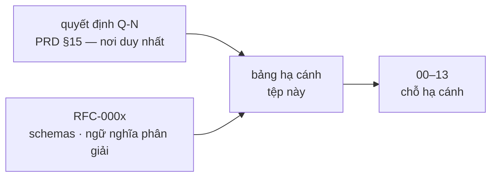

# 09 · Chỉ mục quyết định kiến trúc (ADR)

> Nội dung quyết định: PRD §15 (sổ duy nhất, mã `Q-N`). RFC: `docs/rfc/`.
> Bảng này chỉ nối quyết định với chỗ nó hạ cánh trong kiến trúc.

## 1. ADR đã chốt (trích phần chạm kiến trúc)

| ADR | Quyết định một dòng | Hạ cánh |
|:---|:---|:---|
| Q-2/Q-3 | Box-3 tham chiếu duy nhất; SRAM ≥ 120 KB, PSRAM ≥ 2 MB, firmware ≤ 3,5 MB | `04`, `08` (RES) |
| Q-4/Q-14/Q-15 | Jev + fallback lệnh cố định cục bộ P0; `sim` gõ chữ mặc định | `03` (models/grammar), `06`, `12` |
| Q-8/Q-9/Q-23 + RFC-0003 | C/C++ firmware; build biên dịch gate → cây; cây là bố cục nhị phân NETR v1 | `04`, `05` |
| Q-10/Q-12/Q-28 | LiteLLM là SDK sau `providers/`, extra `cloud`; chuẩn OpenAI API + adapter; FR-GW tối thiểu ở v1.0 | `02`, `03`, `06` |
| Q-11/Q-45 | Allowlist giấy phép; lõi PolyForm Noncommercial, chuẩn Apache-2.0 | `08` (COMP), `CONTRIBUTING.md` §4 |
| Q-13 + RFC-0002 PR2 | Bậc target 1/2/3; đội lõi cam kết bậc 1 | `10-target-equivalence.md` |
| Q-16/Q-21/Q-22 | gpio-sim + i2c-stub + QEMU trong CI; PipeWire AEC trên linux | `10` |
| Q-17/Q-26 + RFC-0006 | Mọi `on_block` đều chặn; chỉ người qua thiết bị xác nhận `ask` | `05`, `06` |
| Q-18 + RFC-0004 | Kế thừa siết chặt cả `budget`/`on_block` (vẫn 5 nguyên tắc) | `05` |
| Q-24/Q-25 + RFC-0005 | Mọi `@action` là tool; ràng buộc tham số nằm trong gate | `05`, `06`, `07` |
| Q-27 | System 2 là MCP host; server ngoài chỉ lấy thông tin (allowlist) | `03`, `06` |
| Q-29/Q-30/Q-31 | Theo dõi MHS không đầu tư; định vị hợp đồng; NeuroBrain bỏ "Copilot" | `00`, `13` |
| Q-32..Q-38 | Robot phân tầng sau Beta: Zenoh-pico, token lease `motion.*`, OUT chứng nhận + nút dừng cứng | `13` |
| Q-39..Q-44 | Increment I0–I18, thứ tự sau Beta, C6 theo dõi, bỏ bậc cắt 5 | `00`, `13` |
| RFC-0001/0002 | Gate điều kiện bắt buộc; mở enum target + bậc (đang thảo luận, lược đồ chưa đổi) | `05`, `10` |

## 2. Quy tắc ADR mới

Quyết định kiến trúc mới phát sinh lúc thực thi → cấp mã `Q-N` ở PRD §15
(trong cùng PR), rồi thêm một dòng vào bảng trên. RFC riêng chỉ khi chạm danh
sách `CONTRIBUTING.md` §3 (schemas, ngữ nghĩa phân giải, vết chuẩn mực,
`digests.lock`, NETR).
