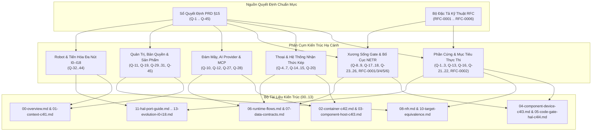

# 09 · Chỉ mục Quyết định Kiến trúc (ADR) & RFCs

> **Trạng thái:** `done` · Chuẩn hóa cây danh mục quyết định kỹ thuật  
> **Nguồn quyết định gốc:** PRD §15 (Sổ quyết định duy nhất Q-1..Q-45), Thư mục RFCs: `docs/rfcs/`  
> **Mục tiêu:** Ánh xạ mọi quyết định kiến trúc chiến lược và đặc tả RFC vào đúng các chương triển khai tương ứng trong bộ tài liệu kiến trúc (từ `00` đến `13`).

---

## 1. Bản đồ tổng thể Điều hướng Quyết định (ADR & RFC Map)

---

## 2. Bảng Phân Loại Quyết Định Kiến Trúc (Q-1 .. Q-45)

### 2.1. Cụm 1: Phần Cứng, Mục Tiêu Thực Thi & Mô Phỏng (Hardware & Targets)

| Mã ADR | Tóm tắt quyết định kỹ thuật | Vị trí hạ cánh trong Docs | Tác động cốt lõi |
| :--- | :--- | :--- | :--- |
| **Q-1** | Chọn ESP32-S3 làm vi điều khiển chuẩn mở đầu tiên cho NeuroEdge. | `02`, `04`, `10` | SoC Xtensa Dual-Core LX7, có tập lệnh tăng tốc AI, Wi-Fi 4 + BLE 5 trên chip. |
| **Q-2** | ESP32-S3-BOX-3 là phần cứng tham chiếu duy nhất ở giai đoạn v1.0. | `04`, `10`, `11` | Cố định sơ đồ chân, màn hình 320x240, codec âm thanh ES7210/ES8311, mic array kép. |
| **Q-3** | Định mức ngân sách phần cứng: SRAM $\ge 120$ KB, PSRAM $\ge 2$ MB, Flash nhị phân $\le 3.5$ MB. | `04`, `08` | Thiết lập các rào cản bộ nhớ tĩnh (Static memory limits) và quy tắc cấm `malloc` sau init. |
| **Q-13** | Phân cấp mục tiêu thực thi thành 3 bậc (Tier 1/2/3); đội ngũ cốt lõi cam kết Tier 1. | `10`, `11` | Tier 1: Sim, Linux x86/ARM64, ESP32-S3 Box-3. Mở rộng Tier 2/3 cho đối tác OEM. |
| **Q-16** | Sử dụng `gpio-sim`, `i2c-stub` và máy ảo QEMU ESP32 trong CI tự động. | `08`, `10` | Chạy kiểm thử vi sai tự động 100% không cần phụ thuộc vào giá thử nghiệm vật lý. |
| **Q-21** | Tích hợp PipeWire Echo-Cancellation (AEC) cho môi trường máy chủ Linux. | `03`, `10` | Đồng nhất chất lượng tiền xử lý âm thanh giữa host Linux và phần cứng nhúng. |
| **Q-22** | Chấp nhận sai số đo lường cảm biến trong phạm vi cho phép trên Simulator. | `10` | Ngăn chặn hiện tượng fail giả khi chạy replay vết ghi giữa các cảm biến thực và ảo. |
| **Q-41** | Thiết lập bo mạch ESP32-C6 là mục tiêu theo dõi thí điểm (chưa đầu tư sản xuất). | `02`, `13` | Dự phòng hướng chuyển đổi sang kiến trúc thuần RISC-V cho thế hệ sản phẩm tiếp theo. |

---

### 2.2. Cụm 2: Thoại & Hệ Thống Nhận Thức Kép (Voice & Cognitive Architecture)

| Mã ADR | Tóm tắt quyết định kỹ thuật | Vị trí hạ cánh trong Docs | Tác động cốt lõi |
| :--- | :--- | :--- | :--- |
| **Q-4** | Sử dụng định dạng phát âm ngữ âm (Jev phonetic) cho từ khóa đánh thức Wake Word. | `03`, `04` | Cho phép tùy biến từ khóa thức tỉnh mà không cần huấn luyện lại toàn bộ mạng nơ-ron. |
| **Q-5** | Tách biệt hoàn toàn FSM trạng thái thoại khỏi luồng điều phối cơ cấu chấp hành. | `04`, `06` | Trạng thái thoại có thể lỗi nhưng không bao giờ làm treo quy trình kiểm soát an toàn. |
| **Q-6** | Tiền xử lý âm thanh DMA RingBuffer chạy độc quyền trên Core 0 của ESP32-S3. | `04` | Bảo đảm độ trễ âm thanh ổn định, không bị nghẽn bởi các phép toán logic trên Core 1. |
| **Q-7** | Sử dụng Opus Codec nén âm thanh streaming với khung truyền 20 ms. | `02`, `04` | Tối ưu hóa băng thông mạng khi stream âm thanh lên Cloud System 2. |
| **Q-14** | Chế độ ngắt kết nối an toàn P0: Duy trì 100% chức năng điều khiển qua ngữ pháp cục bộ. | `03`, `06`, `08` | Thiết bị vẫn bật/tắt đèn và điều khiển cơ bản khi mất kết nối Internet hoàn toàn. |
| **Q-15** | Trình mô phỏng `sim` mặc định giao tiếp qua giao diện dòng lệnh gõ chữ (Typed-text). | `03`, `12` | Nhà phát triển có thể kiểm thử toàn bộ logic hệ thống trong vài giây mà không cần micro. |
| **Q-20** | Thiết lập cơ chế chống dội phím phần mềm (Debounce) cho nút bấm xác nhận vật lý. | `04`, `06` | Loại bỏ nguy cơ kích hoạt 2 lần khi người dùng bấm nút xác nhận `ask`. |

---

### 2.3. Cụm 3: Xương Sống Gate & Bố Cục NETR (Gate Spine & Safety Contracts)

| Mã ADR | Tóm tắt quyết định kỹ thuật | Vị trí hạ cánh trong Docs | Tác động cốt lõi |
| :--- | :--- | :--- | :--- |
| **Q-8** | Firmware thiết bị viết bằng C99 thuần túy, không dùng thư viện ngoài nặng nề. | `04`, `05`, `11` | Đảm bảo kích thước nhị phân cực nhỏ, dễ dàng kiểm toán an ninh và porting sang MCU khác. |
| **Q-9** | Lệnh `neuroedge build` biên dịch Gate YAML thành cây quyết định nhị phân xác định. | `05`, `07` | Chuyển toàn bộ gánh nặng parse chuỗi văn bản về máy chủ biên dịch build-time. |
| **Q-17** | Toàn bộ phán quyết `BLOCK` đều chặn kích hoạt vật lý ở cấp độ HAL (Fail-Closed). | `05`, `06`, `08` | Nguyên lý P-1: Không một xung điện nào được phát ra nếu chưa có Token hợp lệ. |
| **Q-18** | Quy tắc kế thừa Gate (extends) áp dụng nghiêm ngặt cho cả `budget` và `on_block`. | `05`, `07` | Con chỉ có thể siết chặt thời gian P95; chuỗi đã đóng cấm mở lại (`fail: open`). |
| **Q-23** | Định dạng nhị phân cây quyết định NETR v1 (RFC-0003) trên bộ nhớ Flash. | `05`, `07` | Duyệt cây trực tiếp trên Flash bộ nhớ mà không cần cấp phát bất kỳ byte heap nào. |
| **Q-24** | Mọi phương thức `@action` tương tác ngoại vi đều bắt buộc đăng ký như một Tool. | `03`, `06`, `07` | Chuẩn hóa toàn bộ phễu chấp hành vật lý qua cùng một giao diện điều phối. |
| **Q-25** | Giới hạn tham số hành động (min/max/enum/max_length) nằm trong cấu hình Gate (RFC-0005). | `05`, `07` | Gate chặn tham số ngoài khoảng với lý do `argument_out_of_range`, không phụ thuộc LLM. |
| **Q-26** | Cơ chế xác nhận người (`on_block: ask`) chỉ chấp nhận thao tác trực tiếp tại chỗ (RFC-0006). | `05`, `06` | Tuyệt đối ngăn chặn tấn công vượt rào an toàn từ xa qua mạng Internet. |

---

### 2.4. Cụm 4: AI Providers, MCP & Đám Mây (Cloud & Intelligence Routing)

| Mã ADR | Tóm tắt quyết định kỹ thuật | Vị trí hạ cánh trong Docs | Tác động cốt lõi |
| :--- | :--- | :--- | :--- |
| **Q-10** | LiteLLM là SDK dự phòng nằm sau adapter `providers/` thống nhất (gói `[cloud]`). | `02`, `03` | Cách ly hoàn toàn mã nguồn lõi khỏi sự thay đổi SDK của các hãng AI (OpenAI, Anthropic). |
| **Q-12** | Chuẩn hóa giao tiếp AI Provider theo định dạng chuẩn OpenAI Chat Completions API. | `02`, `03` | Dễ dàng thay thế mô hình đám mây hoặc máy chủ cục bộ (Ollama, vLLM) mà không sửa code. |
| **Q-27** | Runtime System 2 đóng vai trò MCP Host; máy chủ MCP bên ngoài chỉ cung cấp dữ liệu. | `02`, `03`, `06` | Dữ liệu từ MCP Server chỉ là ngữ cảnh thông tin cho LLM, không bao giờ được phép trực tiếp lái chân GPIO. |
| **Q-28** | Thiết kế Gateway định tuyến tối giản ở bản v1.0, không phân mảnh phức tạp. | `02`, `03` | Giữ cho hệ thống tinh gọn, tập trung hoàn thiện trải nghiệm đơn thiết bị trước khi scale. |

---

### 2.5. Cụm 5: Quản Trị, Bản Quyền & Định Vị Sản Phẩm (Governance & Packaging)

| Mã ADR | Tóm tắt quyết định kỹ thuật | Vị trí hạ cánh trong Docs | Tác động cốt lõi |
| :--- | :--- | :--- | :--- |
| **Q-11** | Thiết lập danh sách kiểm soát giấy phép phụ thuộc nghiêm ngặt (License Allowlist). | `08` | Loại bỏ nguy cơ xung đột bản quyền hoặc mã nguồn mở lây nhiễm (GPL v3). |
| **Q-19** | Quy trình phát hành chuẩn hóa với bộ kiểm thử tự động Gate Regression Suite. | `06`, `08` | Chặn đứng mọi bản phát hành nếu có sự trôi lệch phán quyết an toàn giữa các phiên bản. |
| **Q-29** | Quan sát thị trường Matter/Home Assistant (MHS) nhưng chưa đầu tư nguồn lực phát triển. | `00`, `13` | Giữ vững định vị NeuroEdge là hệ thống kiểm soát hành vi an toàn chứ không phải trung tâm kết nối nhà. |
| **Q-30** | Định vị sản phẩm cốt lõi: NeuroEdge là "Lớp khế ước an toàn cho Edge AI" (Safety Contract Layer). | `00`, `01` | Khẳng định giá trị khác biệt: Chống ảo giác phần cứng, xác định và kiểm toán được. |
| **Q-31** | Đổi tên sản phẩm hạ tầng NeuroBrain, loại bỏ từ khóa gây hiểu lầm "Copilot". | `00`, `02`, `13` | Nhấn mạnh vai trò là nền tảng quản trị vòng đời mô hình và chính sách của hạm đội. |
| **Q-45** | Mô hình giấy phép kép: Lõi PolyForm Noncommercial 1.0.0, Schemas & HAL Apache-2.0. | `00`, `08` | Khuyến khích cộng đồng và đối tác sản xuất phần cứng đóng góp HAL mở rộng. |

---

### 2.6. Cụm 6: Robot & Tiến Hóa Đa Nút I0–I18 (Robotics & Multi-Node Evolution)

| Mã ADR | Tóm tắt quyết định kỹ thuật | Vị trí hạ cánh trong Docs | Tác động cốt lõi |
| :--- | :--- | :--- | :--- |
| **Q-32** | Phân tầng kiến trúc Robot sau giai đoạn Beta (Tầng Trực quan $\to$ Nhận thức $\to$ Phản xạ an toàn). | `02`, `13` | Tách biệt thuật toán AI phức tạp khỏi vòng lặp điều khiển vận động phần cứng cấp thấp. |
| **Q-33** | Sử dụng giao thức Zenoh-pico cho mạng truyền thông phân tán giữa các vi điều khiển robot. | `02`, `13` | Băng thông siêu nhẹ, độ trễ sub-millisecond, không cần broker trung tâm cồng kềnh. |
| **Q-34** | Giới hạn quyền điều khiển vận động robot thông qua Lease Token có hạn mức thời gian ngắn. | `05`, `13` | Nếu mất tín hiệu heartbeat từ node điều khiển, robot tự động phanh dừng khẩn cấp. |
| **Q-35** | Tích hợp cổng ngắt nguồn khẩn cấp vật lý (Hardware E-Stop) song song với phần mềm. | `08`, `13` | Đảm bảo an toàn sinh mạng tuyệt đối cho con người khi robot vận hành. |
| **Q-36** | Áp dụng chuẩn ROS 2 Micro-XRCE-DDS cho các nút robot tương thích công nghiệp. | `13` | Cầu nối liền mạch giữa hệ sinh thái NeuroEdge và chuẩn công nghiệp ROS 2. |
| **Q-37** | Mô hình hóa môi trường không gian 3D bằng OctoMap nén trên vi điều khiển. | `13` | Hỗ trợ lập kế hoạch di chuyển tránh vật cản trong tài nguyên bộ nhớ hạn chế. |
| **Q-38** | Phân vùng an toàn Geofencing tính toán cục bộ bằng thuật toán hình học xác định. | `05`, `13` | Ngăn chặn robot di chuyển ra khỏi khu vực an toàn được chỉ định. |
| **Q-39** | Chuẩn hóa lộ trình tiến hóa gồm 19 bước tăng trưởng Increment I0 đến I18. | `00`, `13` | Tạo kim chỉ nam phát triển hệ thống từng bước, có kiểm chứng thực nghiệm rõ ràng. |
| **Q-40** | Thứ tự ưu tiên sau Beta: Hoàn thiện Quản trị Hạm đội (Fleet OS) trước khi mở rộng Robot. | `13` | Bảo đảm khả năng vận hành và cập nhật từ xa an toàn cho hàng ngàn thiết bị trước. |
| **Q-42** | Loại bỏ bậc cắt giảm phạm vi thứ 5 (No Scope-cut Ladder 5); kiên định với mục tiêu cốt lõi. | `00`, `13` | Giữ vững cam kết về trải nghiệm an toàn fail-closed trên mọi phiên bản phát hành. |
| **Q-43** | Hỗ trợ cập nhật chính sách an toàn từng phần (Delta Gate OTA) giảm tải băng thông. | `04`, `13` | Cập nhật cây quyết định nhị phân mới mà không cần nạp lại toàn bộ image firmware. |
| **Q-44** | Thiết lập kho chứng thực vết ghi kiểm toán phân tán (Decentralized Trace Vault). | `02`, `13` | Lưu trữ bằng chứng vận hành bất biến phục vụ điều tra sự cố và bảo hiểm trách nhiệm. |

---

## 3. Chỉ Mục Các Đặc Tả Kỹ Thuật RFC (RFC Index)

| Mã RFC | Tiêu đề đặc tả | Trạng thái | Lược đồ / Định dạng liên quan | Chương kiến trúc |
| :--- | :--- | :--- | :--- | :--- |
| **RFC-0001** | Conditional-Required Safety Gates | `Proposed` | `schemas/gate.v1.json` | `05-code-gate-hal-c4l4.md` |
| **RFC-0002** | Open Target Enum & Tier Matrix | `Proposed` | `schemas/board.v1.json` | `10-target-equivalence.md` |
| **RFC-0003** | NETR v1 Binary Decision Tree Layout | `Final / Frozen` | `.netree` binary format | `05-code-gate-hal-c4l4.md` |
| **RFC-0004** | Inheritance Constraints on Gate Budgets | `Final` | `gate_resolver.py` | `05-code-gate-hal-c4l4.md` |
| **RFC-0005** | Gate Action Argument Limits & Constraints | `Final` | `schemas/gate.v1.json` | `05-code-gate-hal-c4l4.md`, `07-data-contracts.md` |
| **RFC-0006** | In-Person Physical Confirmation (`ask`) | `Final` | `schemas/gate.v1.json`, `ne_walker.h` | `05-code-gate-hal-c4l4.md`, `06-runtime-flows.md` |

---

## 4. Quy Trình Ban Hành ADR và RFC Mới

Mọi thay đổi kiến trúc trong quá trình phát triển bắt buộc tuân theo quy tắc:
1. **Phát sinh ADR mới:** Khi có một quyết định kỹ thuật ảnh hưởng tới thiết kế hệ thống, kỹ sư đăng ký mã số tiếp theo (`Q-46`,...) tại PRD §15 trong cùng Pull Request và cập nhật dòng tương ứng vào tệp `09-adr.md` này.
2. **Khi nào cần soạn RFC riêng:** Chỉ soạn thảo tài liệu RFC độc lập tại `docs/rfcs/` khi thay đổi chạm vào các khu vực nhạy cảm được quy định tại `CONTRIBUTING.md` §3:
   - Thay đổi các file JSON Schema chuẩn tắc (`schemas/*.json`).
   - Sửa đổi ngữ nghĩa thuật toán duyệt cây Gate hoặc Token Ledger.
   - Thay đổi bố cục nhị phân `NETR v1` (bắt buộc nâng `LAYOUT_VERSION`).
   - Sửa đổi định dạng vết ghi kiểm toán `trace.v1.json` hoặc cơ chế băm JCS.
