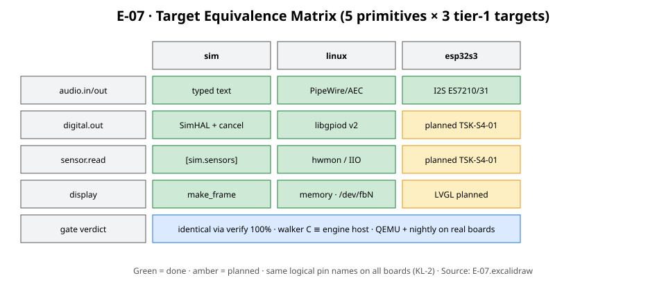
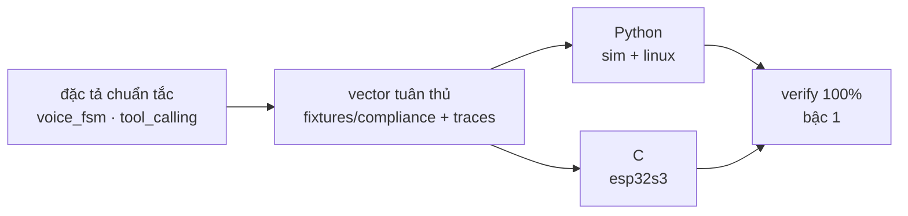

# 10 · Tương đương target

> Nguyên tắc: cùng mã agent → cùng chuỗi phán quyết trên mọi target
> (FR-TGT-04, P-2). Mức cam kết theo bậc (FR-TGT-08, Q-13).

## 1. Ma trận hiện thực (5 nguyên thủy × 3 target bậc 1)

Chi tiết từng ô: `simulation_coverage.md` §2. Tóm tắt: `sim` là target thật
bằng chữ gõ; `linux` ngang `sim` qua gpiod/hwmon/IIO/framebuffer; `esp32s3`
chạy gate qua walker C, HAL đầy đủ planned (`TSK-S4-01`). Ba board dùng chung
tập tên chân logic (KL-2); `sim-default` không giàu hơn Box-3 (bất biến 7).

## 2. Ba lớp bảo vệ tương đương

1. **Đặc tả trước, hai hiện thực sau**: FSM thoại và Gated Tool Profile là
   nguồn sự thật; Python và C/C++ cùng tuân thủ, không chia sẻ mã (`Q-8`).
2. **Vector dùng chung**: kịch bản thoại + 3 vết chuẩn mực
   (`happy-path`, `unverified_attempt`, `network_offline`) — sửa vết chuẩn mực
   cần **RFC**.
3. **`verify` chạy trên mọi target bậc 1**: lệch → `SafetyRegressionError`
   (NE4002); quét 0 artifact → `VerificationError` (NE4004), không bao giờ đạt.

## 3. Mô phỏng theo tầng (Q-21) và bậc target

- Mỗi tầng một công cụ mở đã kiểm chứng: `SimHAL` (logic) · gpio-sim (GPIO
  linux) · backend tệp/PCM (âm thanh CI) · i2c-stub+lm75 (cảm biến) · LVGL so
  ảnh (màn hình) · mã C firmware biên dịch trên host (bảng sự thật mỗi PR) ·
  QEMU (boot/logic) · board thật (âm thanh, màn hình, bộ nhớ, nightly).
- Bậc 2 (đội lõi bảo trì, verify miền phán quyết) và bậc 3 (cộng đồng port, tự
  kiểm qua bộ tuân thủ) chỉ mở sau I8 qua RFC-0002 PR2 — ngưỡng `verify` 100%
  chỉ ràng buộc bậc 1.
