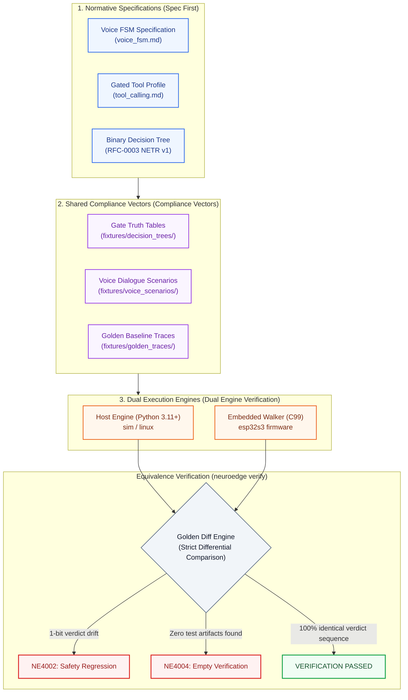
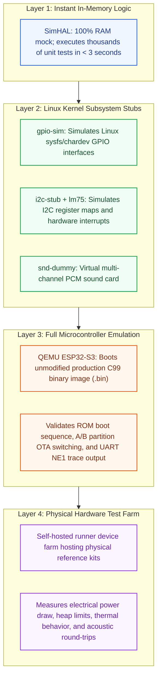

# 10 · Tương đương Mục tiêu (Target Equivalence)

> **Trạng thái:** `done` · Chuẩn hóa nguyên tắc tương đương thực thi giữa các môi trường  
> **Nguyên tắc cốt lõi:** Bất biến P-2 & FR-TGT-04 — Cùng một mã khai báo Agent $\to$ 100% cùng chuỗi phán quyết Gate và trạng thái chân kích hoạt trên mọi mục tiêu phần cứng.  
> **Tài liệu tham chiếu:** [E-07](../assets/svg/E-07-target-matrix.svg), `docs/standards/simulation_coverage.md`, [09-adr.md](file:///Users/minhlt/Downloads/Projects/neuroedge-init/docs/architecture/vi/09-adr.md) (ADR Q-13, Q-16, Q-21, Q-22), [RFC-0002](file:///Users/minhlt/Downloads/Projects/neuroedge-init/docs/rfcs/RFC-0002-open-target-enum-and-tier-matrix.md)

---

## 1. Bản đồ Tổng thể Ba Lớp Bảo Vệ Tương Đương

Mục tiêu tối thượng của NeuroEdge là xóa bỏ hoàn toàn khoảng cách giữa máy mô phỏng (Simulation) và phần cứng vật lý (Production Hardware). Hệ thống kiểm soát tính tương đương qua 3 lớp phòng thủ độc lập:



---

## 2. Ma trận Hiện thực (5 Nguyên thủy $\times$ 3 Target Bậc 1)

Giai đoạn v1.0 cam kết hỗ trợ tuyệt đối 3 target Bậc 1 (Tier 1) trên 5 nguyên thủy phần cứng trừu tượng:

| Nguyên thủy | `sim` (Mô phỏng bộ nhớ) | `linux` (Máy chủ x86_64 / ARM64) | `esp32s3` (ESP32-S3-BOX-3) |
| :--- | :--- | :--- | :--- |
| **`audio.in`** | Bộ đệm giả lập file WAV / Raw PCM; gõ phím dòng lệnh (CLI text) đóng vai trò nhận diện giọng nói. | PipeWire / ALSA driver với bộ lọc triệt tiếng vọng PipeWire Echo-Cancellation (AEC). | Codec kép ES7210 qua I2S DMA, bộ lọc AEC và phần cứng VAD tích hợp trên Core 0. |
| **`audio.out`** | Bộ đệm âm thanh ảo hoặc in text ra terminal; đếm thời lượng phát theo mẫu. | ALSA / PulseAudio / PipeWire qua loa hệ thống hoặc jack 3.5mm / HDMI. | Codec ES8311 qua I2S DMA, khuếch đại công suất onboard NS4150. |
| **`digital.out`** | `SimDigitalOut`: Mảng trạng thái boolean trong RAM; ghi vết thay đổi chân. | Linux Kernel Subsystem `libgpiod` / `gpio-sim` (mô phỏng chân phần mềm). | ESP-IDF GPIO Driver (`gpio_set_level`) điều khiển rơ-le và MOSFET công suất. |
| **`sensor.read`** | `SimSensorRead`: Trả về dữ kiện cài đặt trong `[sim.sensors]` hoặc kịch bản. | Linux `hwmon` / `iio` (Industrial I/O) hoặc `i2c-stub` giả lập IC cảm biến LM75/BMP280. | Driver phần cứng I2C / SPI (đọc cảm biến nhiệt độ, độ ẩm SHTC3, gia tốc kế ICM-42607). |
| **`display`** | In thông điệp giao diện ra terminal hoặc kết xuất ảnh PNG ảo qua headless renderer. | Linux Framebuffer (`/dev/fb0`) hoặc DRM/KMS, giả lập hiển thị qua cửa sổ SDL2. | Màn hình màu SPI LCD 2.4-inch (ST7789, $320 \times 240$, RGB565) qua thư viện đồ họa LVGL. |

### 2.1. Quy tắc Tên chân Logic (KL-2) & Bất biến 7

1. **Thống nhất tên logic (KL-2):** Cả ba target bắt buộc phải chia sẻ chung một tập tên chân logic duy nhất (ví dụ: `"status_led"`, `"porch_light"`, `"door_lock"`).
2. **Bất biến 7 (Không ưu ái máy mô phỏng):** Bo mạch mặc định của trình mô phỏng (`sim-default`) **tuyệt đối không được phép giàu năng lực hơn** bo mạch phần cứng thật ESP32-S3-BOX-3. Nếu phần cứng thật không có ngoại vi đó, `sim-default` không được phép hỗ trợ sẵn nhằm chống ảo giác phần mềm khi porting.

---

## 3. Phân Cấp Bậc Hỗ Trợ Mục Tiêu (Target Tiers per ADR Q-13 & RFC-0002)

| Tiêu chí | Bậc 1: Cốt Lõi (Tier 1 - Core) | Bậc 2: Tham Chiếu (Tier 2 - Reference) | Bậc 3: Cộng Đồng / OEM (Tier 3 - Community) |
| :--- | :--- | :--- | :--- |
| **Danh sách thiết bị** | `sim`, `linux` (Debian/Ubuntu), `esp32s3` (ESP32-S3-BOX-3). | Bo mạch thử nghiệm mở rộng: STM32F4/H7, Raspberry Pi Pico W, ESP32-C6. | Các bo mạch tùy biến của đối tác OEM, vi điều khiển RISC-V mới. |
| **Trách nhiệm bảo trì** | Đội ngũ cốt lõi NeuroEdge (Core Team). | Đội ngũ cốt lõi bảo trì hạ tầng; cộng đồng hỗ trợ driver. | Đối tác OEM hoặc người đóng góp cộng đồng tự bảo trì. |
| **Cơ chế kiểm chứng CI** | Chạy kiểm thử tự động 100% trong **mọi Pull Request** (`ci/pr-checks.yml`). | Chạy kiểm thử trong các đợt phát hành Release hoặc Nightly build. | Kiểm tra qua bộ công cụ tự thẩm định `neuroedge hal test`. |
| **Cam kết tương đương** | Cam kết 100% tương đương chuỗi phán quyết an toàn và lệnh chân. | Đảm bảo đúng miền phán quyết (Verdict Domain Equivalence). | Tự chịu trách nhiệm tuân thủ thông qua bộ vector kiểm toán. |
| **Hành vi khi phát hiện lệch** | Chặn đứng quy trình Release (Lỗi P0). | Đánh dấu cảnh báo; khắc phục trong chu kỳ sprint tiếp theo. | Đối tác OEM tự sửa đổi bản port HAL. |

---

## 4. Ngăn Xếp Mô Phỏng Đa Tầng (Layered Simulation Stack)

Để đạt được độ tin cậy phần cứng cao nhất mà không bị phụ thuộc vào phòng thí nghiệm vật lý, NeuroEdge thiết lập ngăn xếp kiểm thử mô phỏng đa tầng theo ADR Q-21:



### 4.1. Quy tắc Khoảng dung sai Cảm biến (Sensor Tolerance Bounds per ADR Q-22)

- Trong môi trường thực tế, dữ liệu cảm biến (nhiệt độ, khoảng cách) luôn có độ nhiễu và độ trễ vật lý.
- Khi kiểm thử Replay giữa Sim và Phần cứng thật:
  - **Phán quyết Gate:** Bắt buộc phải **trùng khớp 100%** (`ALLOW` là `ALLOW`, `BLOCK` là `BLOCK`).
  - **Dữ liệu số thực cảm biến:** Cho phép sai số biên trong khoảng quy định $\pm 2\%$ đối với ADC và nhiệt độ để tránh hiện tượng báo lỗi giả (False Alarm) do nhiễu môi trường tự nhiên.

---

## 5. Quy trình Kiểm thử Thẩm định Tự động (`neuroedge verify`)

Lệnh dòng lệnh `neuroedge verify` là chốt chặn cuối cùng bảo vệ tính toàn vẹn:

```bash
# Thẩm định tính tương đương giữa mã nguồn hiện tại và vết ghi chuẩn mực
neuroedge verify --agent fixtures/agents/home-voice --golden fixtures/golden_traces/
```

### Tiêu chí Đạt/Không đạt (Pass/Fail Criteria):
1. **NE4002 (`SafetyRegressionError`):** Xảy ra khi có bất kỳ sự trôi lệch nào trong chuỗi phán quyết an toàn (ví dụ: vết chuẩn ghi `BLOCK` nhưng firmware trên chip thật trả về `ALLOW`). Đây là lỗi vi phạm an toàn nghiêm trọng nhất, lập tức trả về mã thoát `1`.
2. **NE4004 (`VerificationError`):** Xảy ra khi bộ quét không tìm thấy bất kỳ artifact kiểm thử nào hoặc đường dẫn vết ghi rỗng. Hệ thống **tuyệt đối không bao giờ âm thầm bỏ qua** mà báo lỗi ngay lập tức để chống lọt lỗi trong CI.
