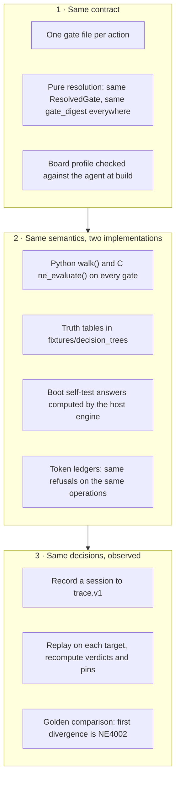
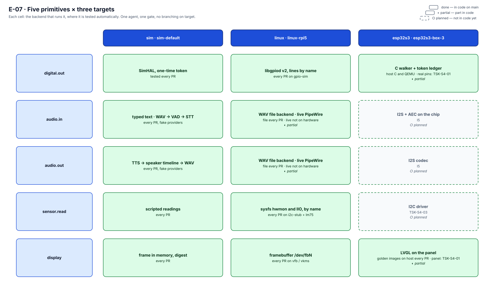

# 10 · Tương đương giữa các target

> **Phạm vi:** vì sao cùng một agent và cùng một gate cho cùng quyết định trên `sim`, `linux` và
> `esp32s3`, điều đó được chứng minh thế nào, và nó **không** hứa gì. **Nguồn:** P-2 (PRD §1.5),
> FR-TGT, `docs/spec/simulation_coverage.md`, `python/neuroedge/testing/`, `targets/esp32s3/main/`.

## 1. Tương đương nghĩa là gì

Hai lần chạy **tương đương** khi, với cùng dữ kiện đầu vào, chúng cho cùng **chuỗi quyết định**: cùng
gate, cùng phán quyết, cùng lý do, cùng hành động `on_block`, cùng lệnh chân (chân, thao tác, thời
lượng). Không so: thời gian, chữ nói, âm thanh, khung hình.

Mã agent **không được rẽ nhánh theo target** (P-2). Khác biệt giữa môi trường nằm trọn trong HAL và
profile bo mạch.

## 2. Ba lớp bảo vệ

```mermaid
flowchart TB
    subgraph L1["1 · Same contract"]
        A1["One gate file per action"]
        A2["Pure resolution: same ResolvedGate, same gate_digest everywhere"]
        A3["Board profile checked against the agent at build"]
    end
    subgraph L2["2 · Same semantics, two implementations"]
        B1["Python walk() and C ne_evaluate() on every gate"]
        B2["Truth tables in fixtures/decision_trees"]
        B3["Boot self-test answers computed by the host engine"]
        B4["Token ledgers: same refusals on the same operations"]
    end
    subgraph L3["3 · Same decisions, observed"]
        C1["Record a session to trace.v1"]
        C2["Replay on each target, recompute verdicts and pins"]
        C3["Golden comparison: first divergence is NE4002"]
    end
    L1 --> L2 --> L3
```

| Lớp | Bảo đảm | Bằng |
|:---|:---|:---|
| **1 · Cùng hợp đồng** | Mọi target nạp cùng một chính sách đã phân giải | Phân giải là hàm thuần (bất biến 4); `gate_digest` giống nhau trong vết ghi, trong `NETR`, trong token |
| **2 · Cùng ngữ nghĩa** | Python và C quyết giống nhau trên mọi dữ kiện | `test_c_walker.py` (mọi gate, mọi dòng bảng sự thật, fuzz); `test_c_token.py`; self-test lúc khởi động của chính firmware |
| **3 · Cùng quyết định, quan sát được** | Một phiên thật cho cùng quyết định khi phát lại ở target khác | `neuroedge verify --targets sim,linux,esp32s3`; `GoldenComparator` |

## 3. Ma trận năm nguyên thủy × ba target

*Hình E-07 — Mỗi ô: backend chạy nó, nơi nó được kiểm tự động, trạng thái.*

| Nguyên thủy | `sim` (`sim-default`) | `linux` (`linux-rpi5`) | `esp32s3` (`esp32s3-box-3`) |
|:---|:---|:---|:---|
| `digital.out` | `SimHAL`, token dùng một lần — PR | libgpiod v2, tìm line theo tên — PR trên gpio-sim | walker + sổ token C — host và QEMU; chân thật `planned` (TSK-S4-01) |
| `audio.in` | chữ gõ vào ngữ pháp; WAV → VAD → STT — PR | tệp WAV — PR; micro thật qua PipeWire — mới mở thiết bị | `planned` (I5) |
| `audio.out` | câu cần nói; TTS → dòng thời gian loa → WAV — PR | tệp WAV — PR; loa thật — chưa kiểm trên phần cứng | `planned` (I5) |
| `sensor.read` | số đọc giả lập — PR | sysfs hwmon/IIO — PR trên `i2c-stub` + `lm75` | `planned` (TSK-S4-03) |
| `display` | khung trong bộ nhớ, digest — PR | framebuffer — PR trên `vfb`/`vkms` | giao diện LVGL: ảnh golden trên host — PR; panel thật `planned` |

Ba ô chỉ kiểm được trên bo mạch: `audio.in` và `audio.out` của `esp32s3`, và phần âm học của `linux`.
Chúng chờ runner hằng đêm trên phần cứng thật (TSK-S4-05, TSK-I2-01).

## 4. Luật của profile bo mạch

- **`sim` không được giàu hơn bo mạch tham chiếu** (bất biến 7). `sim-default` sao đúng năng lực của
  Box-3: một agent chạy trên `sim` thì cũng khai được cho `esp32s3`.
- **Build đối chiếu hai chiều**: mỗi nguyên thủy agent cần (`[requires]`, mỗi `@action(requires=…)`) phải
  có trên bo mạch, đúng tên chân, đúng cảm biến, đủ tần số lấy mẫu, có khử vang nếu agent đòi.
  Thiếu ⇒ `NE3001`, build dừng, không ghi gì. Ví dụ: `villa-concierge` đòi `aec = true` nên bị từ chối
  trên `linux-rpi5` cho tới khi Pi đo đạt khử vang (`simulation_coverage.md` §6.2).
- **Tên chân là logic** (`door_lock`, `porch_light`, `gate_relay`); số GPIO thuộc về HAL của từng target.
- Danh sách target đóng băng ở ba target bậc 1 cho tới RFC-0002 (I11).

## 5. `verify` làm gì trên từng target

| Target | Cách phát lại | Cần gì |
|:---|:---|:---|
| `sim` | `TracePlayer` trên `SimHAL` | không gì |
| `linux` | `TracePlayer` trên `LinuxHAL`, line GPIO thật | line thật hoặc gpio-sim (`scripts/setup_gpio_sim.sh`) |
| `esp32s3` | **Chính firmware** phát lại ba vết ghi chuẩn mực lúc khởi động (`trace_vectors.c`) và gửi kết quả qua UART; host đọc (`--port`) và so với golden | firmware đang chạy, trên QEMU hoặc bo mạch |

Firmware phát lại một vết ghi hay một gate **cũ hơn** checkout ⇒ `NE4003` (firmware cũ), không so.
Trên `sim`/`linux`, một vết ghi chuẩn mực ghi `gate_digest` khác gate checkout biên dịch ra cũng
⇒ `NE4003`, không so (RFC-0008): vết ghi chuẩn mực phải được quyết bởi đúng gate nó được ghi cùng.
`neuroedge replay` trên vết ghi của người dùng thì **không lỗi**: gate có thể được siết có chủ ý
(quickstart, giờ 3) — phát lại vẫn tính lại phán quyết, báo `SAFETY REGRESSION` như cũ khi lệch
golden, và thêm cảnh báo nêu gate đã đổi (digest cũ → digest mới). Vết ghi không mang
`gate_digest` (ghi trước RFC-0008) phát lại đúng như trước.
Một loại artifact quét được 0 tệp ⇒ `NE4004`, mã 1: không có "PASS" rỗng.

## 6. Tương đương không hứa gì

- **Thời gian.** `verify` so quyết định, chưa so thời gian (TSK-S4-04).
- **Thao tác và thời lượng trên chip.** Trên `esp32s3`, `operation` và `duration_ms` của lệnh chân hôm nay
  lấy từ bảng dựng trên host; chip chỉ quyết có phát không và chân nào (`TODOS.md` #37).
- **Chất lượng âm thanh** trong âm học thật.
- **Target bậc 2 và 3** (`simulation_coverage.md` §7).
