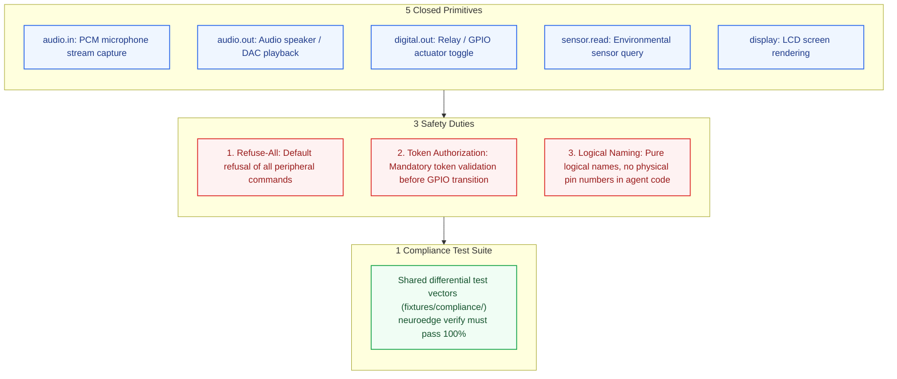
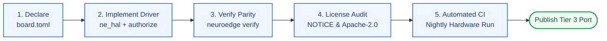

# 11 · Hướng dẫn Đối tác OEM Port HAL (OEM Porting Guide)

> **Trạng thái:** `done` · Chuẩn hóa hướng dẫn tích hợp tầng trừu tượng phần cứng (HAL)  
> **Đối tượng:** Kỹ sư nhúng, nhà sản xuất thiết bị gốc (OEM) và đối tác phát triển bo mạch phần cứng mới (U5).  
> **Mục tiêu:** Cung cấp khế ước kỹ thuật "5 + 3 + 1", mẫu khai báo `board.toml`, khung mã C chuẩn (`hal-stubs`) và quy trình 5 bước thẩm định tuân thủ trước khi phát hành.  
> **Chính sách sở hữu trí tuệ:** Đối tác OEM giữ toàn quyền sở hữu bản quyền mã nguồn driver HAL của mình (kho Git riêng); NeuroEdge chỉ lập chỉ mục đăng ký trong Gate Registry (ADR Q-45).

---

## 1. Khế ước Porting Chuẩn tắc (Khế ước 5 + 3 + 1)

Để đảm bảo tính bất biến **P-1 (Fail-Closed)** và **P-2 (Target Equivalence)**, bất kỳ bản port phần cứng mới nào (Tier 3) cũng bắt buộc phải tuân thủ nghiêm ngặt mô hình "5 + 3 + 1":



---

## 2. Đặc tả Giao diện C HAL Chuẩn (`ne_hal.h`)

Tất cả các bản port nhúng (C99) đều phải triển khai giao diện tiêu chuẩn định nghĩa trong `ne_hal.h`. Mã nguồn phải biên dịch sạch, không dùng cấp phát động sau khi hệ thống khởi động:

```c
/* ne_hal.h — Giao diện Tầng Trừu tượng Phần cứng NeuroEdge */
#ifndef NE_HAL_H
#define NE_HAL_H

#include <stdint.h>
#include <stdbool.h>
#include <stddef.h>
#include "ne_token.h"

#ifdef __cplusplus
extern "C" {
#endif

/* 1. Khởi tạo toàn bộ phần cứng ngoại vi theo cấu hình board.toml */
ne_status ne_hal_init(void);

/* 2. Điều khiển chân Digital Out (Rơ-le, LED, Khóa điện)
 * BẮT BUỘC: Phải gọi ne_token_authorize() trước khi đổi trạng thái GPIO.
 * Nếu token không hợp lệ -> CẤM ĐỔI CHÂN và trả về mã lỗi thích hợp.
 */
ne_status ne_hal_digital_out(const char *pin_name, uint8_t level, const ne_token *token);

/* 3. Đọc dữ liệu cảm biến môi trường (Nhiệt độ, Độ ẩm, Cảm biến chuyển động) */
ne_status ne_hal_sensor_read(const char *sensor_name, double *out_value);

/* 4. Thu âm thanh từ Microphone (Khung PCM 16kHz, 16-bit mono) */
ne_status ne_hal_audio_in_read(int16_t *buffer, size_t samples, size_t *samples_read);

/* 5. Ghi âm thanh ra Loa (I2S DMA streaming) */
ne_status ne_hal_audio_out_write(const int16_t *buffer, size_t samples, size_t *samples_written);

/* 6. Kết xuất khung hình lên màn hình hiển thị (Tùy chọn) */
ne_status ne_hal_display_flush(uint16_t x1, uint16_t y1, uint16_t x2, uint16_t y2, const void *color_buf);

#ifdef __cplusplus
}
#endif

#endif /* NE_HAL_H */
```

### 2.1. Đoạn mã Driver Tham Chiếu: Điều khiển chân có thẩm định Token

```c
/* Ví dụ triển khai hàm ne_hal_digital_out trên bo mạch tùy biến */
ne_status ne_hal_digital_out(const char *pin_name, uint8_t level, const ne_token *token) {
    if (!pin_name || !token) {
        return NE_ERR_ARGUMENT;
    }

    /* 1. Chuyển đổi tên logic sang chỉ số chân vật lý của bo mạch */
    int gpio_num = bsp_lookup_gpio(pin_name);
    if (gpio_num < 0) {
        return NE_ERR_STRUCTURE; /* Tên chân không được bo mạch hỗ trợ */
    }

    /* 2. THẨM ĐỊNH NGHĨA VỤ AN TOÀN: Xác thực token với Sổ cái Ledger */
    uint32_t now_ms = bsp_get_time_ms();
    ne_token_reason auth_res = ne_token_authorize(&g_ledger, token, (uint32_t)gpio_num, now_ms);
    
    if (auth_res != NE_TOKEN_AUTHORIZED) {
        /* Ghi nhận sự kiện kiểm toán từ chối lệnh chấp hành */
        ne_telemetry_emit_rejected(pin_name, auth_res);
        return NE_ERR_LIMITS; /* TỪ CHỐI THỰC THI - FAIL CLOSED */
    }

    /* 3. Token hợp lệ: Cho phép chuyển trạng thái vật lý của chân */
    bsp_gpio_set_level(gpio_num, level);
    ne_telemetry_emit_actuator_executed(pin_name, level);
    
    return NE_OK;
}
```

---

## 3. Bản mẫu Cấu hình `board.toml` cho Bo mạch Mới

Đối tác OEM tạo tệp `board.toml` đặt tại thư mục gốc của gói BSP. Toàn bộ các chân phải đặt tên logic mang ý nghĩa ngữ nghĩa, không dùng số GPIO vật lý trong danh mục của ứng dụng:

```toml
# board.toml — Bản mẫu khai báo bo mạch OEM
[board]
id     = "acme-smart-hub-v2"
name   = "ACME Smart Home Gateway v2.0"
target = "acme_mcu"          # Định danh target OEM (RFC-0002)
mcu    = "cortex-m7"         # Dòng vi điều khiển hoặc SoC

# Khai báo Audio In (Nếu không hỗ trợ microphone, bỏ qua khối này)
[capabilities.audio_in]
channels       = 1
sample_rate_hz = 16000
aec            = true        # Hỗ trợ triệt tiếng vọng phần cứng
vad            = true        # Hỗ trợ nhận diện năng lượng giọng nói

# Khai báo Audio Out
[capabilities.audio_out]
channels       = 1
sample_rate_hz = 16000

# Khai báo Chân Điều Khiển Ngoại Vi (Digital Out)
[capabilities.digital_out]
backend = "gpio"
# RÀNG BUỘC DATA-01: Chỉ liệt kê tên logic
pins = [
    "status_led_red",
    "status_led_green",
    "relay_pump",
    "relay_heater",
    "alarm_buzzer"
]

# Khai báo Cảm Biến Onboard (Sensor Read)
[capabilities.sensor_read]
sensors = [
    "water_temperature",
    "water_pressure",
    "ambient_temp",
    "leak_detected"
]

# Khai báo Màn hình LCD (Nếu có)
[capabilities.display]
width  = 480
height = 320
color  = "rgb565"
```

---

## 4. Quy trình 5 Bước Thẩm định và Công bố Porting (Checklist)

Để một bản port HAL được chính thức công nhận và xuất bản lên Gate Registry, đối tác OEM phải hoàn thành toàn bộ 5 bước trong danh mục kiểm tra:



| Bước | Hạng mục kiểm tra | Tiêu chuẩn nghiệm thu thành công |
| :---: | :--- | :--- |
| **1** | Khai báo năng lực bo mạch | Lệnh `neuroedge board show` hiển thị đầy đủ thông tin; lệnh `neuroedge build` biên dịch thành công cho ứng dụng mẫu `home-voice`. |
| **2** | Kiểm toán ranh giới an toàn | Kiểm tra xâm nhập nội bộ (Internal Pentest): Xác nhận không tồn tại bất kỳ con đường nào điều khiển GPIO mà không qua hàm `ne_token_authorize()`. |
| **3** | Thẩm định bộ vector tuân thủ | Chạy lệnh `neuroedge verify --target acme_mcu` đạt **100% khớp phán quyết** trên cả 3 vết chuẩn mực (`happy-path`, `unverified_attempt`, `network_offline`). |
| **4** | Tuân thủ quyền sở hữu trí tuệ | Đính kèm tệp `NOTICE` ghi rõ bản quyền tác giả; mã nguồn giao tiếp tuân thủ giấy phép **Apache-2.0** (không sử dụng mã lây nhiễm GPL v3). |
| **5** | Tích hợp CI kiểm thử liên tục | Thiết lập pipeline chạy tự động hàng đêm (Nightly CI) trên phần cứng thật; công khai kết quả chạy kiểm thử cho người dùng cuối. |

---

## 5. Chính Sách Bản Quyền & Phân Phối (Asset Governance)

- **Quyền tác giả Driver:** Đối tác OEM sở hữu 100% bản quyền đối với mã nguồn driver BSP và file `board.toml` của mình. Quý đối tác có thể lưu trữ driver trên kho lưu trữ mã nguồn riêng (Private hoặc Public GitHub repository).
- **Cơ chế liên kết:** Phần lõi NeuroEdge chỉ liên kết với driver OEM thông qua các header chuẩn (`ne_hal.h`, `ne_token.h`). Mô hình này bảo vệ bí mật công nghệ phần cứng của đối tác trong khi vẫn giữ vững cam kết an toàn không khoan nhượng của hệ sinh thái.
