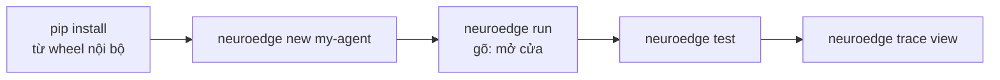

# 12 · Chạy được trong ngày đầu (dev mới)

> Mục tiêu: từ máy sạch tới agent có gate chạy trên `sim` trong < 10 phút
> (nhịp của Hành trình 1, PRD §2.3). Cú pháp lệnh chuẩn ở `CHANGELOG.md` §2.3.



## 1. Bốn lệnh (15 phút đầu)

```bash
neuroedge new my-agent && cd my-agent
neuroedge run -c "mở cửa phòng 101"     # ALLOW: door_lock PULSED 30s
neuroedge run -c "mở cửa phòng 202"     # BLOCK room_matches → lễ tân
neuroedge test                          # Action CI xanh: assert + golden
```

Không mạng, không key, không phần cứng (`Q-15`): đầu vào mặc định là chữ gõ
→ ngữ pháp lệnh cục bộ. Giọng nói và LLM thật là tuỳ chọn (extra
`neuroedge[cloud]`, key qua biến môi trường).

## 2. Bản đồ khái niệm tối thiểu (đủ để không lạc)

| Gặp gì | Hiểu một câu | Đọc tiếp |
|:---|:---|:---|
| `agent.toml` | Agent cần gì: action, gate, facts mô phỏng | `07-data-contracts.md` |
| `*.gate.yaml` | Hợp đồng của một hành động: `evaluate/allow_when/on_block/budget` | `05-code-gate-hal-c4l4.md` |
| `board.toml` | Bo mạch có gì: 5 nguyên thủy, tên chân logic | `07`, `10-target-equivalence.md` |
| `neuroedge build` | Đối chiếu agent ↔ board lúc build, fail sớm đủ 3 phần lỗi | `05` |
| `c.do()` / `c.say()` | Nói không qua gate; động vào vật lý bắt buộc `c.do()` | `05`, `06-runtime-flows.md` |
| `traces/*.json` | Vết ghi mọi phiên; replay tính lại, golden chỉ so quyết định | `06` |
| `neuroedge verify` | Cùng vết ghi, cùng quyết định trên mọi target bậc 1 | `10` |

## 3. Khi kẹt (lỗi 3 phần ở đâu → làm gì)

Mọi lỗi nêu đủ **ở đâu · vì sao · cách xử lý** (FR-DX-04, mã `NE…` ở PRD
Phụ lục B). Ba lỗi gặp đầu tiên:

| Mã | Gặp khi | Cách xử lý |
|:---|:---|:---|
| NE3001/NE3002 | `build` fail đối chiếu năng lực | Đọc `where`: thiếu năng lực gì → sửa `board.toml` hoặc `[requires]` |
| NE2002/NE2003 | `gate lint` đỏ | Đọc `why`: sai trường hay nới lỏng kế thừa → sửa gate, không sửa engine |
| NE4001 | `trace validate` đỏ | Đọc đường dẫn trường sai → sửa vết ghi hoặc chạy lại `record` |

Chưa hiện thực (target/lệnh lạ) thoát mã 2 và nêu task nào sẽ làm — không phải lỗi của bạn.
