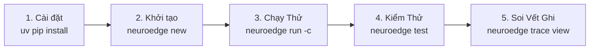
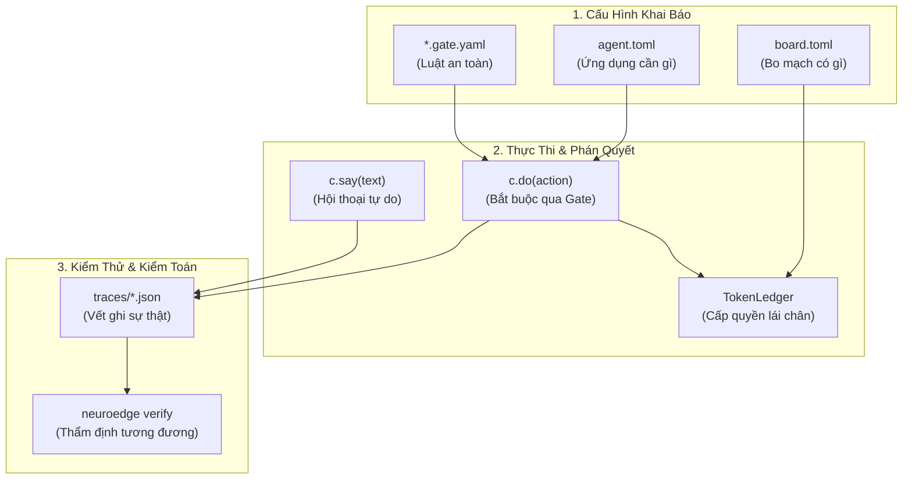

# 12 · Hướng dẫn Khởi động Nhanh trong Ngày đầu (Day-1 Quickstart)

> **Trạng thái:** `done` · Chuẩn hóa quy trình làm quen dành cho kỹ sư mới (Onboarding Guide)  
> **Mục tiêu:** Giúp lập trình viên mới (Persona U1 & U2) từ máy tính trắng thiết lập xong môi trường, chạy thành công một Agent có rào chắn an toàn (Gate) trên máy mô phỏng (`sim`) và kiểm tra vết ghi trong **dưới 10 phút**.  
> **Cam kết:** Không cần micro, không cần tài khoản Cloud API, không cần phần cứng nhúng (ADR Q-15).

---

## 1. Hành trình 10 Phút Đầu Tiên (Từ Số Không đến Agent Có Rào Chắn)



### Bước 1: Cài đặt công cụ NeuroEdge CLI

Yêu cầu môi trường: Python $\ge 3.11$ trên macOS hoặc Linux (x86_64 / ARM64).

```bash
# Tạo môi trường ảo và cài đặt gói lõi
python3 -m venv .venv && source .venv/bin/activate
pip install -e "python/"

# Kiểm tra cài đặt thành công
neuroedge --version
# Output mong đợi: neuroedge-cli v0.1.0 (target: sim, linux, esp32s3)
```

---

### Bước 2: Tạo dự án Agent mới từ mẫu chuẩn

```bash
neuroedge new smart-home && cd smart-home
```

Cấu trúc thư mục được tự động sinh ra:

```text
smart-home/
├── agent.toml            # Khai báo cấu hình, tài nguyên cần dùng và gates
├── board.toml            # Khai báo phần cứng mô phỏng (sim-default)
├── actions/
│   └── home.py           # Mã xử lý hành động c.do() và hội thoại c.say()
├── gates/
│   └── light_on@1.0.0.yaml # Cây quyết định an toàn kiểm soát bật đèn
└── tests/
    └── test_home.py      # Kịch bản kiểm thử Action CI tự động
```

---

### Bước 3: Chạy thử tương tác trên Simulator (`sim`)

Lệnh `neuroedge run` mặc định khởi chạy môi trường mô phỏng bằng bàn phím (Typed-text), kích hoạt ngữ pháp lệnh cục bộ System 1:

```bash
# 1. Thử lệnh an toàn (Thỏa mãn điều kiện an toàn -> ALLOW)
neuroedge run -c "bật đèn phòng khách"
```

**Đầu ra màn hình Terminal (Trường hợp ALLOW):**

```text
[neuroedge:sim] Booting session sess_8f21ab...
[routing] System 1 (local_grammar) matched: light_on(room="living")
[gate:light_on] Evaluating facts: {room_empty: false} -> ALLOW (reason: NONE, p95: 1.2ms)
[ledger] Minted token nonce=4a8f... TTL=360ms pins=[porch_light]
[hal:sim] digital_out(pin="porch_light", level=HIGH) -> PIN ACTIVATED
[speech] c.say("Đã bật đèn phòng khách.")
[session] Closed with status: COMPLETED in 48ms (Turn Latency: S1=48ms)
```

Bây giờ thử một trường hợp vi phạm chính sách an toàn:

```bash
# Giả lập cảm biến phát hiện có người trong phòng nhưng ra lệnh tắt đèn khi chưa được phép
neuroedge run -c "tắt đèn phòng ngủ" --sensor room_empty=false
```

**Đầu ra màn hình Terminal (Trường hợp BLOCK):**

```text
[neuroedge:sim] Booting session sess_9c32de...
[routing] System 1 (local_grammar) matched: light_off(room="bedroom")
[gate:light_off] Evaluating facts: {room_empty: false} -> BLOCK (reason: CONDITION_NOT_MET)
[gate:light_off] on_block triggered: deny
[hal:sim] REFUSED: Zero pins toggled (Fail-Closed default enforced)
[speech] c.say("Không thể tắt đèn khi phòng vẫn đang có người.")
[session] Closed with status: BLOCKED in 32ms
```

---

### Bước 4: Chạy kiểm thử tự động (Action CI)

```bash
neuroedge test
```

```text
============================= test session starts ==============================
tests/test_home.py::test_light_on_allow PASSED                            [ 50%]
tests/test_home.py::test_light_off_blocked_when_occupied PASSED          [100%]

--------------------------------------------------------------------------------
Verification: Golden trace matching PASS (2/2 traces match bitwise)
Memory probe: Peak simulation heap = 1.4 MB (Safe under 120 KB SRAM limit)
============================== 2 passed in 0.42s ===============================
```

---

### Bước 5: Xem và phân tích vết ghi kiểm toán (Trace View)

```bash
neuroedge trace view --last
```

Hiển thị toàn bộ tiến trình phân tích sự thật, băm mật mã của Gate và chuỗi sự kiện phần cứng theo chuẩn RFC 8785:

```text
Session ID    : sess_8f21ab
Target        : sim
Board         : sim-default (Logical pins: porch_light, door_lock)
Verdict Chain : ALLOW (Gate: light_on@1.0.0, SHA256: 2c20dc42...)
Actuation     : digital_out(porch_light, HIGH) at offset +42ms
Total Turn    : 48ms (System 1: 100%, System 2: 0%)
Audit Trace   : traces/sess_8f21ab.json [VALID]
```

---

## 2. Bản đồ Khái niệm Tối thiểu (Mental Model Map)

Để không bị bỡ ngỡ giữa các khái niệm kiến trúc, nhà phát triển chỉ cần ghi nhớ 6 thành phần cốt lõi:



| Khái niệm | Ý nghĩa cốt lõi trong một câu | Tài liệu đọc sâu |
| :--- | :--- | :--- |
| `agent.toml` | Khai báo toàn bộ tài nguyên, danh sách Gate và cấu hình nguồn sự thật của Agent. | [07-data-contracts.md](file:///Users/minhlt/Downloads/Projects/neuroedge-init/docs/architecture/vi/07-data-contracts.md) |
| `*.gate.yaml` | Hợp đồng an toàn của một hành động: quy định tiêu chí `evaluate`, điều kiện `allow_when` và xử lý `on_block`. | [05-code-gate-hal-c4l4.md](file:///Users/minhlt/Downloads/Projects/neuroedge-init/docs/architecture/vi/05-code-gate-hal-c4l4.md) |
| `board.toml` | Khai báo 5 nguyên thủy của bo mạch phần cứng bằng tên logic (không số chân vật lý). | [10-target-equivalence.md](file:///Users/minhlt/Downloads/Projects/neuroedge-init/docs/architecture/vi/10-target-equivalence.md) |
| `c.do()` | Hàm thực thi hành động vật lý: **Luôn luôn bị chặn bởi Gate**, chỉ chạy khi có Token hợp lệ. | [03-component-host-c4l3.md](file:///Users/minhlt/Downloads/Projects/neuroedge-init/docs/architecture/vi/03-component-host-c4l3.md) |
| `c.say()` | Hàm phát âm thanh hoặc thông điệp hội thoại: **Không qua Gate**, có thể bị ngắt bởi barge-in. | [06-runtime-flows.md](file:///Users/minhlt/Downloads/Projects/neuroedge-init/docs/architecture/vi/06-runtime-flows.md) |
| `traces/*.json` | Bản ghi vết kiểm toán toàn diện của phiên chạy; replay sẽ tính lại toàn bộ phán quyết từ đầu. | [07-data-contracts.md](file:///Users/minhlt/Downloads/Projects/neuroedge-init/docs/architecture/vi/07-data-contracts.md) |
| `neuroedge verify`| Công cụ kiểm thử vi sai: bảo đảm cùng vết ghi sẽ sinh ra 100% cùng chuỗi phán quyết trên Sim và Chip thật. | [10-target-equivalence.md](file:///Users/minhlt/Downloads/Projects/neuroedge-init/docs/architecture/vi/10-target-equivalence.md) |

---

## 3. Cẩm nang Chẩn đoán & Xử lý Mã lỗi (NE Diagnostic Codes)

Mọi thông báo lỗi trong hệ thống NeuroEdge đều tuân thủ nguyên tắc chuẩn tắc **3 phần tường minh**: **Ở đâu (`where`) · Vì sao (`why`) · Cách khắc phục (`how`)** (FR-DX-04). Dưới đây là bảng cứu nguy nhanh khi gặp sự cố:

| Mã Lỗi | Tên Lỗi | Xảy ra khi nào? | Nguyên nhân cốt lõi | Cách xử lý tức thì |
| :---: | :--- | :--- | :--- | :--- |
| **NE1001** | `TokenContractError` | Gọi hàm HAL trực tiếp mà không có Token hợp lệ hoặc truyền sai Token của hành động khác. | Lập trình viên vi phạm hợp đồng an toàn: cố tình lái chân mà không gọi qua `c.do()`. | Sửa lại mã `@action`: luôn thực thi qua `c.do(gate="...")` để hệ thống cấp Token tự động. |
| **NE1002** | `TokenReplayError` | Cố tình tái sử dụng một Token đã dùng hoặc Token đã quá hạn thời gian sống (TTL). | Tấn công Replay hoặc hành động thực thi quá chậm vượt quá $p95 \times 3$. | Không lưu trữ Token vào biến toàn cục; mỗi lần kích hoạt vật lý phải là một lệnh `c.do()` mới. |
| **NE2001** | `CapabilityMismatchError` | Khi chạy lệnh `neuroedge build`. | `agent.toml` đòi hỏi ngoại vi (ví dụ: `pins = ["door_lock"]`) nhưng `board.toml` không cung cấp. | Kiểm tra lại `board.toml` xem đã khai báo chân đó chưa, hoặc giảm yêu cầu `[requires]` trong `agent.toml`. |
| **NE2002** | `GateSchemaError` | Khi chạy `neuroedge gate lint`. | Tệp Gate YAML sai cú pháp, thiếu trường bắt buộc, hoặc vi phạm kiểu dữ liệu chuẩn `gate.v1`. | Đọc kỹ thông báo lỗi trỏ tới dòng vi phạm trong file YAML; sửa theo chuẩn trong `schemas/gate.v1.json`. |
| **NE2003** | `GateInheritanceError` | Kế thừa Gate (`extends`). | Gate con cố tình định nghĩa lại tiêu chí đã có của cha (vi phạm P-1) hoặc nới lỏng ngân sách $p95$. | Gate con chỉ được phép siết chặt điều kiện (`allow_when`), tuyệt đối không khai báo đè tiêu chí cũ. |
| **NE2004** | `ConfirmationExpiredError` | Khi Gate chặn với `on_block: ask`. | Người dùng không bấm nút xác nhận trên thiết bị trong vòng 10 giây. | Bấm nút xác nhận vật lý kịp thời hoặc kéo dài thời gian chờ trong cấu hình kịch bản. |
| **NE3001** | `UnsupportedTargetError` | Chạy lệnh `neuroedge build --target`. | Chỉ định target chưa được hỗ trợ trong danh sách `supported` của agent. | Kiểm tra lại danh sách target được hỗ trợ (`sim`, `linux`, `esp32s3`). |
| **NE3002** | `LogicalPinConflictError` | Biên dịch firmware cho bo mạch. | Hai tên logic khác nhau bị gán trùng vào cùng một số chân GPIO vật lý trong `board.toml`. | Sửa lại bảng ánh xạ GPIO trong cấu hình bo mạch để mỗi tên logic sở hữu một chân riêng biệt. |
| **NE4001** | `TraceValidationError` | Chạy `neuroedge trace validate`. | Tệp vết ghi `trace.json` bị sửa đổi thủ công, sai cấu trúc JSON hoặc mâu thuẫn thời gian offset. | Chạy lại lệnh ghi vết `neuroedge record` để sinh ra vết ghi hợp lệ mới từ đầu. |
| **NE4002** | `SafetyRegressionError` | Chạy `neuroedge verify`. | Có sự trôi lệch phán quyết an toàn giữa mã nguồn mới và vết chuẩn Golden (ví dụ: trước `BLOCK` nay thành `ALLOW`). | **CẢNH BÁO NGUY HIỂM:** Rà soát lại thay đổi mã nguồn logic gần nhất; không được phép nới lỏng điều kiện an toàn. |
| **NE4004** | `EmptyVerificationError` | Chạy `neuroedge verify`. | Thư mục chứa vết ghi kiểm toán rỗng hoặc đường dẫn truyền vào không chứa artifact nào. | Cung cấp đúng đường dẫn tới thư mục vết ghi kiểm toán chứa các tệp `.json`. |

> **Quy tắc Thoát mã 2 (Task In-Progress):**  
> Nếu bạn chạy một lệnh hoặc target phần cứng đang trong lộ trình phát triển (chưa hoàn thiện), công cụ CLI sẽ thoát với **Exit Code 2** và thông báo rõ mã Task Jira/GitHub (ví dụ: `TSK-S4-01`) chịu trách nhiệm xây dựng tính năng đó. Đây là hành vi thiết kế có chủ đích, không phải lỗi hệ thống của bạn!
