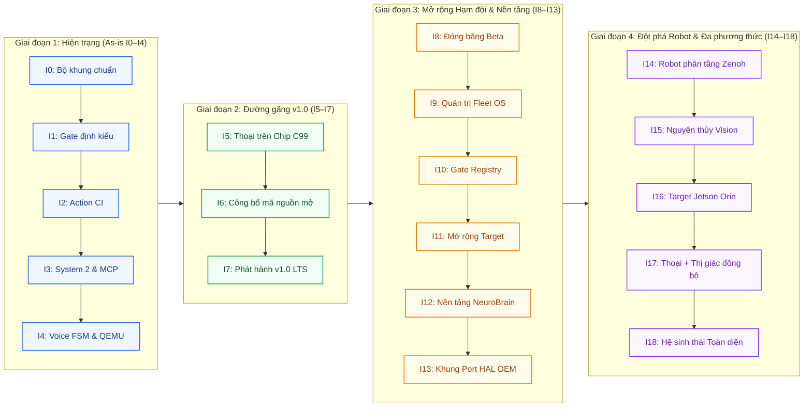
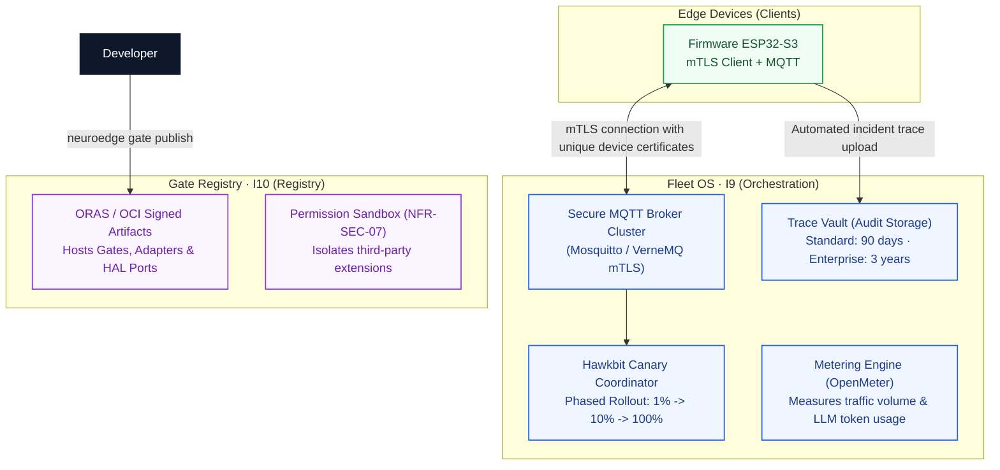
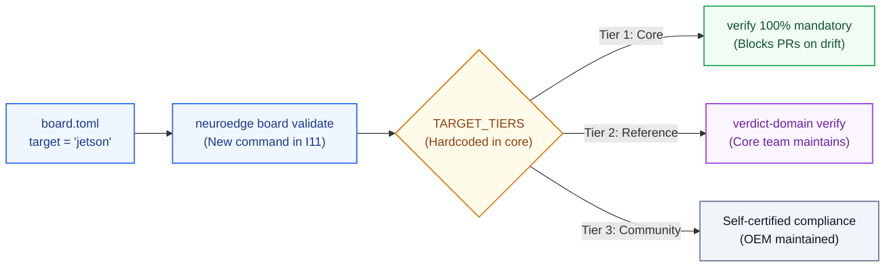
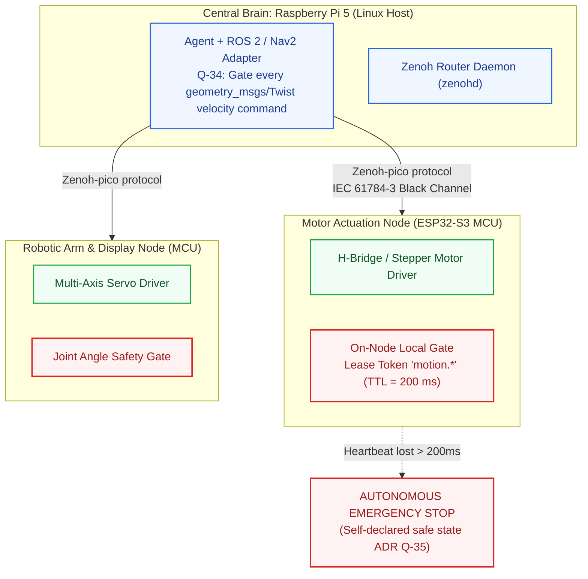

# 13 · Tiến hóa Kiến trúc I0–I18 (Hiện trạng vs Tương lai)

> **Trạng thái:** `done` · Chuẩn hóa lộ trình tiến hóa kiến trúc 19 bước tăng trưởng  
> **Nguyên tắc tổ chức:** Lịch trình thời gian và trạng thái nhiệm vụ chỉ khai báo tại PRD §0.2. Tài liệu này chỉ tập trung mô hình hóa **sự thay đổi về mặt kiến trúc** (Variation Points) qua từng bước tăng trưởng (Increments).  
> **Tài liệu tham chiếu:** [E-08-roadmap-timeline](../assets/svg/E-08-roadmap-timeline.svg), [02-container-c4l2.md](file:///Users/minhlt/Downloads/Projects/neuroedge-init/docs/architecture/vi/02-container-c4l2.md), [04-component-device-c4l3.md](file:///Users/minhlt/Downloads/Projects/neuroedge-init/docs/architecture/vi/04-component-device-c4l3.md)

---

## 1. Lộ trình Tiến hóa 19 Bước Tăng Trưởng (I0–I18 Roadmap Map)



---

## 2. Hiện Trạng Đã Hoàn Thành: As-is I0–I4 (Đã có mã & Kiểm thử)

| Chặng | Mã nguồn thực thi | Biến chuyển kiến trúc cốt lõi | Hiện trạng kiểm chứng |
| :--- | :--- | :--- | :--- |
| **I0: Khung dự án** | `python/neuroedge/cli.py` | Thiết lập cấu trúc CLI, phân quyền ranh giới thư mục, khung test vi sai ban đầu. | 100% xanh trên CI. |
| **I1: Gate có kiểu** | `engine/gate.py`, `gate_resolver.py` | Kiểm tra cú pháp schema `gate.v1`, hợp nhất kế thừa đa cấp ($\le 3$ cấp), thực thi các bất biến P-1, P-2 và thu hẹp đối số theo RFC-0005. | Hơn 120 unit test kiểm tra hợp nhất và phát hiện lỗi kế thừa. |
| **I2: Action CI** | `actions/conversation.py`, `actions/token.py` | Triển khai giao diện `@action`, cơ chế phát hành `TokenLedger` dùng một lần, lệnh ghi vết `record` và tái hiện `replay`. | Kiểm thử tự động golden diff phát hiện trôi lệch an toàn. |
| **I3: System 2 & MCP** | `providers/adapter.py`, `mcp/` | Tích hợp thư viện LiteLLM qua adapter trung gian (gói `[cloud]`), System 2 đóng vai trò MCP Host kết nối máy chủ ngoại vi qua kênh stdio (Q-27). | Kiểm thử tích hợp mock provider OpenAI/Anthropic. |
| **I4: Voice FSM & QEMU** | `voice/fsm.py`, `targets/esp32s3/` | Hiện thực FSM thoại Python với cơ chế ngắt lời barge-in, trình duyệt cây nhị phân C99 `ne_walker` đọc `NETR v1` và xuất vết qua UART trên máy ảo QEMU ESP32. | Differential testing `test_c_walker.py` và `test_c_token.py` đạt 100% khớp. |

---

## 3. Đường Găng Phát Hành v1.0: Planned I5–I7

| Increment | Biến chuyển kiến trúc cốt lõi | Tactic đối phó rủi ro kỹ thuật |
| :--- | :--- | :--- |
| **I5: Thoại thời gian thực trên Chip** | - Hiện thực C99 thứ hai của Voice FSM chạy song song trên Core 1 của ESP32-S3.<br/>- Xử lý âm thanh I2S DMA RingBuffer trên Core 0.<br/>- Luồng streaming nén Opus trực tiếp qua kết nối WebSocket/TLS lên Cloud AI Provider. | **Rủi ro R-1 (Tràn bộ nhớ MCU):** Cấp phát tĩnh toàn bộ audio buffer trong PSRAM; nếu thiếu RAM sẽ tái lập kế hoạch kiến trúc (ADR Q-44), tuyệt đối không cắt giảm chức năng thoại. |
| **I6: Công bố mã nguồn mở** | - Phát hành chính thức các JSON Schema lên URL công khai (`schema.neuroedge.dev`).<br/>- Thiết lập Software Bill of Materials (SBOM) và chữ ký xuất xứ SLSA Provenance.<br/>- Đóng gói và phát hành gói cài đặt Python chính thức lên PyPI. | Rà soát toàn diện danh mục bản quyền phụ thuộc, bảo đảm tuân thủ giấy phép kép PolyForm Noncommercial / Apache-2.0. |
| **I7: Phát hành v1.0 LTS** | - Kích hoạt cơ chế cập nhật OTA phân vùng kép A/B kèm chữ ký số và tự động rollback khi gặp lỗi boot-loop.<br/>- Thiết lập phần cứng Secure Boot v2 và mã hóa toàn bộ Flash ROM (XTS-AES).<br/>- Đạt kiểm thử ngâm hoạt động ổn định 24/7 trên phần cứng thật (A1–A9). | Đóng toàn bộ nợ kiểm toán an ninh (SEC-02 $\to$ SEC-06, SEC-08) tại PRD Phụ lục A.3 trước ngày phát hành. |

---

## 4. Chi tiết Kiến trúc Mở rộng Sau Beta: Planned I8–I18

### 4.1. I8: Đóng Băng Nhánh Beta (Beta Release Stabilization)
- **Biến chuyển kiến trúc:** Đóng băng toàn bộ chuỗi phiên bản `1.0.x`. Nhánh này chỉ tiếp nhận các bản vá lỗi bảo mật khẩn cấp (P0/P1) và sửa lỗi suy thoái an toàn.
- **Tiêu chuẩn mở:** Đạt toàn bộ 9 tiêu chí kiểm nghiệm thực địa A1–A9 của bản v1.0.

---

### 4.2. I9–I10: Quản trị Hạm đội (Fleet OS) & Kho Gate Tập Trung (Gate Registry)



- **I9 (Fleet OS):** Cung cấp một điểm kết nối và bộ thông tin xác thực duy nhất cho toàn bộ hạm đội thiết bị. Hỗ trợ cập nhật firmware Canary theo tỷ lệ phần trăm (1% $\to$ 10% $\to$ 100%) và tự động dừng khi tỷ lệ lỗi vượt ngưỡng $0.1\%$.
- **I10 (Gate Registry):** Quản lý phiên bản các gói Gate, Adapter và bản port HAL bằng chuẩn OCI container artifacts có chữ ký điện tử. Các extension bên thứ ba bị cô lập hoàn toàn trong sandbox quyền hạn.

---

### 4.3. I11: Mở rộng Danh mục Mục tiêu (Target Expansion per RFC-0002)



- Mở rộng enum `target` trong schema bo mạch, phân cấp thành Tier 1/2/3 mà không làm phá vỡ tính tương thích ngược của các bo mạch hiện có.

---

### 4.4. I12: Nền tảng Trợ lý Phòng Thí nghiệm NeuroBrain

```mermaid
flowchart TB
    classDef act fill:#0f172a,stroke:#0f172a,color:#ffffff,stroke-width:1.5px;
    classDef brain fill:#faf5ff,stroke:#9334e6,color:#6b21a8,stroke-width:1.5px;
    classDef gated fill:#eff6ff,stroke:#2563eb,color:#1e3a8a,stroke-width:1.5px;
    classDef gate fill:#fef2f2,stroke:#dc2626,color:#991b1b,stroke-width:2px;
    classDef hal fill:#f0fdf4,stroke:#16a34a,color:#14532d,stroke-width:1.5px;
    classDef dut fill:#fff7ed,stroke:#ea580c,color:#7c2d12,stroke-width:1.5px;

    ENG_TEAM["Hardware Engineering Team"]:::act -->|Technical Dialogue| BRAIN["neuroedge.brain<br/>(Circuit Analysis Engine)"]:::brain
    BRAIN -->|MANDATORY VIA dispatch()| ACT["Actions / Gated Tools<br/>(call_source = 'brain')"]:::gated
    ACT --> GATE["Gate Engine -> Decision Tree"]:::gate --> HAL["HAL Drivers"]:::hal
    BRAIN -.->|Read-Only I2C Bus Sniffer| HW["Device Under Test (DUT)"]:::dut
```

> **Bất biến Kiến trúc B-1:**  
> Thành phần `neuroedge.brain` **tuyệt đối không bao giờ được gọi trực tiếp xuống HAL**. Mọi thao tác cấp nguồn, kích xung, hoặc đo mạch phát sinh từ hội thoại phân tích đều bắt buộc phải đi qua rào chắn Gate tương ứng như một người dùng thông thường.

---

### 4.5. I13: Bộ Công Cụ Porting Cho Cộng Đồng (Community Port Kit)
- Hoàn thiện tài liệu, mẫu mã nguồn C stubs và bộ vector kiểm thử tự động phục vụ các đối tác OEM đưa NeuroEdge lên các dòng vi điều khiển mới (liên kết mật thiết với [11-hal-port-guide.md](file:///Users/minhlt/Downloads/Projects/neuroedge-init/docs/architecture/vi/11-hal-port-guide.md)).

---

### 4.6. I14: Kiến trúc Robot Phân Tầng Đa Nút (Tiered Robotics Architecture)



- **Quyền điều khiển có thời hạn (Lease Token `motion.*`):** Mỗi lệnh vận tốc robot chỉ có giá trị hiệu lực tối đa 200 ms. Nếu mất kết nối mạng giữa bộ não trung tâm và node chấp hành, xe tự động dừng lại trong vòng 200 ms.
- **Rào chắn an toàn kép:** Tích hợp công tắc dừng khẩn cấp phần cứng (Hard E-Stop) ngắt điện trực tiếp động cơ song song với rào chắn Gate phần mềm.

---

### 4.7. I15–I17: Tích hợp Thị Giác Máy Tính (Vision & Multimodal Perception)
- **I15 (Nguyên thủy `vision.in`):** Soạn thảo RFC riêng cho dữ liệu hình ảnh. Kết quả thị giác từ camera được nén thành dữ kiện xác định (`bool/level/choice`) qua System 1 trước khi đưa vào Gate duyệt.
- **I16 (Hỗ trợ NVIDIA Jetson):** Đưa nền tảng Jetson Orin Nano / Nano thành target Bậc 2, tận dụng NPU tăng tốc các mô hình VLM cục bộ thời gian thực.
- **I17 (Hội tụ Đa phương thức Thoại + Thị giác):** Tích hợp luồng âm thanh và camera vào một máy trạng thái đồng nhất, cho phép ra lệnh thoại kết hợp chỉ trỏ vật thể ("Bật chiếc đèn bàn màu xanh kia").

---

### 4.8. I18: Hệ Sinh Thái Mở & Chứng Nhận Tự Động (Ecosystem Scale)
- Phát hành SDK lập trình đa ngôn ngữ (Python, C/C++, Rust, TypeScript).
- Mở cổng đăng ký và kiểm toán tự động miễn phí cho các bản port HAL của bên thứ ba.
- Giữ vững nguyên tắc cốt lõi: Không bao giờ thương mại hóa các tính năng an toàn cơ bản; giữ trọn vẹn lời hứa bảo vệ an toàn cho mọi tương tác vật lý của trí tuệ nhân tạo.
