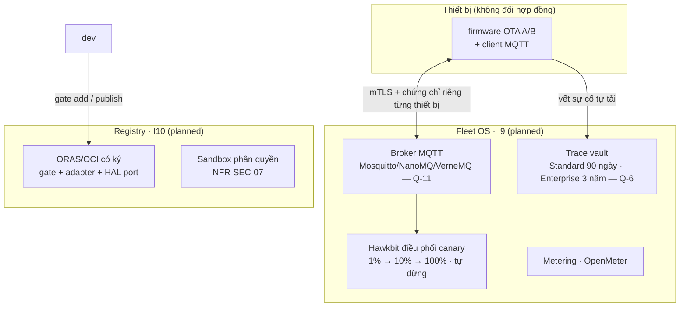
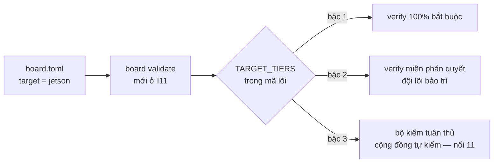
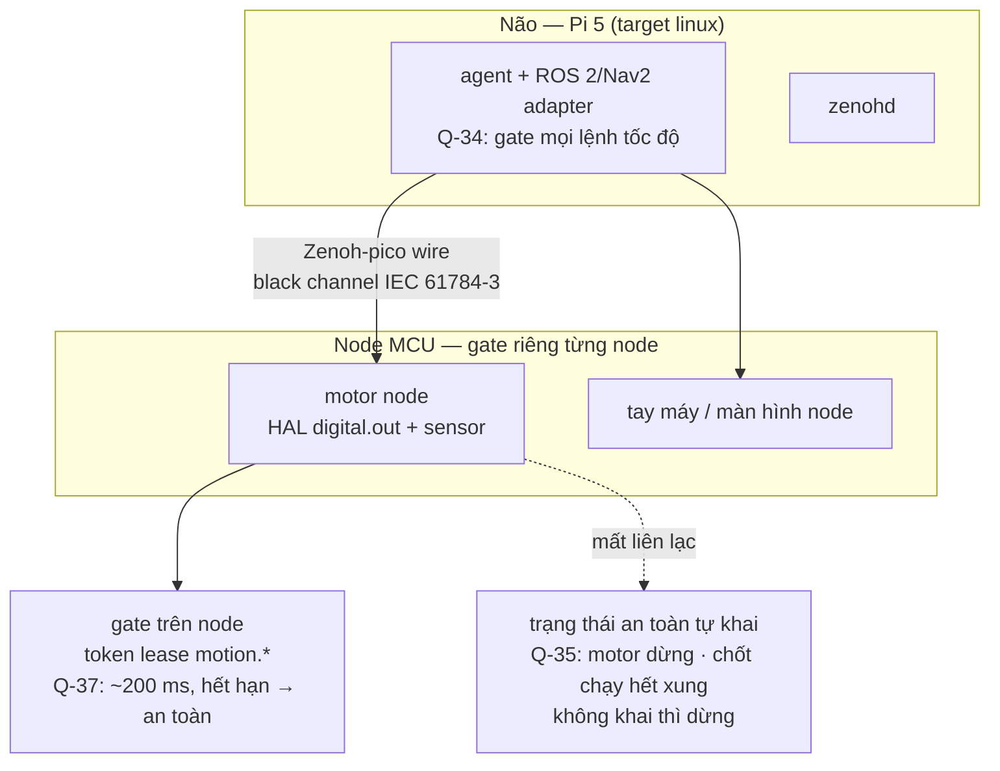

# 13 · Tiến hóa I0–I18 (as-is vs planned)

> Ngày/tag: roadmap §0.2 (nơi duy nhất). Dưới đây chỉ nói *kiến trúc đổi gì*
> qua từng chặng — không chép ngày hay trạng thái task.


## 1. As-is: I0–I4 (done, đã có mã)

Gate có kiểu + kế thừa an toàn, `sim`+`linux` ngang nhau, Action CI
(record/replay/assert/golden), MCP + System 2 qua LiteLLM, FSM thoại Python +
barge-in, walker/token/UART trên QEMU. Cổng nhu cầu 2026-10-25 (Q-20) quyết
Go/Adjust/Stop cho I3–I7.

## 2. Planned: I5–I7 (v1.0)

| Increment | Đổi kiến trúc | Rủi ro giữ |
|:---|:---|:---|
| I5 thoại trên chip | Hiện thực C/C++ thứ hai của FSM (port XiaoZhi/Pipecat, tuân cùng vector); streaming Opus lên provider | R-1 bộ nhớ (spike TSK-S1-10; trượt thì mở `Q-N` lập lại kế hoạch, không cắt thoại — Q-44) |
| I6 công khai | Lược đồ lên URL công khai; SBOM + provenance; PyPI đầu tiên | Điều khoản license thương mại (`TODOS.md` #44) |
| I7 v1.0 | OTA A/B có ký + rollback; Secure Boot + mã hóa flash; ổn định 24h; đủ A1–A9 | Nợ tiêu chí SEC-02→06/08 (Phụ lục A.3) phải đóng trước |

## 3. Planned: sau Beta (chi tiết từng chặng)

Tổng quát:

| Chặng | Variation point kiến trúc | Điều kiện mở |
|:---|:---|:---|
| I8 Beta | Đóng băng dòng `1.0.x` (chỉ lỗi chặn + an toàn); RFC/đặc tả vẫn merge (R12) | I7 đạt A1–A9 |
| I9–I10 Fleet + Registry | Một endpoint/credential cả đội; failover khai cấu hình; OTA canary; registry ORAS có ký; metering | Beta đạt B1 + B2 (Q-41) |
| I11 mở target | Enum `target` theo bậc + `TARGET_TIERS` + `board validate` (RFC-0002 PR2) | I8 |
| I12 NeuroBrain | `neuroedge.brain` chỉ qua `dispatch()` (B-1); lab action có gate; phong bì an toàn | I11 (+ I2/I3) |
| I13 bộ port | Tài liệu + vector + khung port bậc 3 (nối `11`) | I11 |
| I14 robot phân tầng | Mỗi node HAL + gate riêng; Zenoh-pico wire (Q-36); token lease `motion.*` (Q-37); ROS 2/Nav2 gate mọi lệnh tốc độ (Q-34); trạng thái an toàn từng cơ cấu (Q-35) | I13 (+ I4/I7/I11/I12) |
| I15–I17 thị giác | `vision.in` qua RFC riêng; `jetson` bậc 2; gate đa phương thức | Nhu cầu camera đo được |
| I18 hệ sinh thái | SDK đa thiết bị, kho HAL port, chứng nhận miễn phí tự kiểm | I13 (+ I9/I10) |

Chi tiết thiết kế đầy đủ của từng chặng nằm ở ghi chú thiết kế
(`neuroedge-roadmap-phase1-5.md`, `neuroedge-roadmap-phase2.md`,
`draft-ke-hoach-mo-rong-robot-fofoca.md`, `draft-rfc-node-giao-thuc-dieu-phoi.md`) —
dưới đây chỉ mô hình hóa chỗ kiến trúc thay đổi, đủ cho dev thấy biên trước khi mở RFC.

### 3.1 I9–I10 — Fleet OS + Gate Registry (C4 L2 planned)



- Giữ chỗ đã có từ hôm nay: `gate publish` in digest JCS + `digests.lock`
  (điều kiện của I10 là registry có ký, không phải thay đổi ngữ nghĩa gate);
  `device_id` trong `metadata` vết ghi; FR-OTA chốt từ trước.
- API công khai AURA dùng (Khối 4) là API công khai của tầng này.

### 3.2 I11 — Mở danh sách target (RFC-0002 PR2)



- Chỉ mở **enum** `target` + bảng bậc trong mã lõi; nguyên thủy `vision.in`
  tách RFC riêng (I15). Lược đồ chưa đổi cho tới khi RFC được phê duyệt
  (roadmap §2.3).
- Biết trước một vấn đề đã ghi: khi `vision.in` có, `sim` không được giàu hơn
  bo tham chiếu ⇒ cần profile `sim-vision` đối 1-1 (`TODOS.md` #14).

### 3.3 I12 — NeuroBrain (C4 L2 planned)

```mermaid
flowchart TB
    U[nhóm dựng mạch] -->|hội thoại| BRAIN[neuroedge.brain<br/>planned]
    BRAIN -->|chỉ qua dispatch()| ACT[actions/tools<br/>call_source = brain? — xem ghi chú]
    ACT --> ENG[engine → gate] --> HAL[HAL]
    BRAIN -.->|I2C chỉ đọc · phong bì an toàn N2| HW[phần cứng lab]
```

- **Bất biến B-1**: `neuroedge.brain` không gọi HAL trực tiếp — mọi tác động
  vật lý của hội thoại dựng mạch vẫn đi qua cùng một gate. Nếu `call_source = brain`
  cần thêm, đó là thay đổi Gated Tool Profile ⇒ phải qua đặc tả/corpus
  (`docs/spec/tool_calling.md` §9) trong cùng PR — không tự thêm.
- Chi tiết khối N0–N7, bring-up có gate: `neuroedge-roadmap-phase1-5.md`.

### 3.4 I13 — Bộ port cộng đồng (C4 L3 planned)

Tài liệu + vector + khung port cho bậc 3: đúng hợp đồng ở `11-hal-port-guide.md`
(5 nguyên thủy + 3 nghĩa vụ an toàn + 1 bộ tuân thủ), cộng quy trình công bố
kết quả `verify` phạm vi port.

### 3.5 I14 — Robot phân tầng (C4 L2 planned)



- **Gate vẫn thuần**: đếm hạn lease ở HAL/runtime, gate không thêm ngữ nghĩa;
  trace đa node mở rộng `trace.v1` bằng trường tùy chọn (không `trace.v2`, Q-32).
- RFC-node, RFC-motion, RFC-pin-extends cấp số khi mở PR (bản nháp đã có).

### 3.6 I15–I17 — Thị giác (C4 L3 planned)

- Nguyên thủy `vision.in` qua **RFC riêng** (RFC-0002 §9.1): kết quả thị giác
  chỉ là ngữ cảnh, agent phải quy về `bool/level/choice` qua `SystemOne` —
  rule engine giữ 100% xác định cho tới khi có RFC ngữ nghĩa riêng.
- Ngân sách bộ nhớ MCU phải đo trước khi khai `vision_in` trên `esp32s3`;
  `jetson` bậc 2, thời gian thực; I17 gộp thoại + thị giác vào một máy trạng
  thái với gate đa phương thức. Chi tiết: `neuroedge-roadmap-phase2.md` V1a/V1b/V2/V3.

### 3.7 I18 — Hệ sinh thái thiết bị

SDK đa thiết bị, kho HAL port lập chỉ mục, chứng nhận **miễn phí, tự kiểm**
(phân biệt dòng chứng nhận có thu phí vẫn bị chặn — PRD §14). Điều kiện mở:
≥ 3 bản port bậc 3 vượt bộ tuân thủ.

Ngoài roadmap: AURA thực địa (chỉ API công khai), Marketplace (chặn tới khi
đạt G1–G4).
