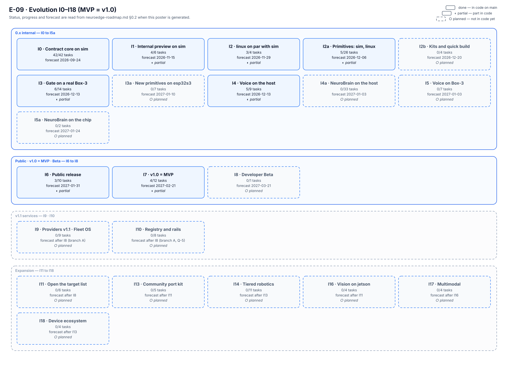

# 13 · Tiến hoá kiến trúc theo mốc phát hành

> **Phạm vi:** kiến trúc lớn lên thế nào qua mười mốc phát hành theo người dùng, cái gì đã được chuẩn bị
> sẵn, cái gì cần RFC. **Nguồn:** mười mốc và increment của từng mốc ở roadmap §0.5 ("Mười mốc phát hành
> theo người dùng"); trạng thái, tiến độ, ngày dự báo chỉ ở roadmap §0.2 (Q-39) — trang này không chép lại
> chúng, và hình E-09 được **sinh từ chính hai bảng đó**. Thiết kế của các hướng mở rộng ở
> `neuroedge-design-lab-mcp.md`, `neuroedge-design-phase2.md`, `draft-ke-hoach-mo-rong-robot-fofoca.md`,
> `draft-rfc-node-giao-thuc-dieu-phoi.md`.

## 1. Một xương sống, mười mốc

NeuroEdge lớn lên theo **chiều rộng**, không theo **ngoại lệ**. Mỗi mốc thêm một nơi gate chạy (Pi, chip,
nhiều node), một loại thứ gate canh (cảm biến, PWM, camera, motor), hay một cách gọi vào (giọng nói, hội
thoại, MCP qua mạng, bridge của bên thứ ba). Không mốc nào thêm một đường tới phần cứng mà không qua gate. Đó là tinh thần sản
phẩm ở [`00`](00-overview.md) §1.1, viết thành luật kiến trúc: **kiến trúc được phép rộng ra, xương sống
`dispatch()` → gate → token → HAL → vết ghi thì không được ngắn lại.**

Vì thế mỗi mốc ở §3 trả lời bốn câu hỏi theo cùng một thứ tự: người dùng làm được gì, kiến trúc thêm gì,
hợp đồng nào đổi, và **lời hứa an toàn nào được chứng minh lại** trên phạm vi mới.

*Hình E-09 — Mười mốc phát hành, mỗi mốc gom các increment của nó; trạng thái, tiến độ và ngày dự báo
đọc từ roadmap §0.2 lúc sinh hình.*

Mốc 6 (**ra mắt công khai**) là lần đầu người ngoài dùng được; mốc 7 (**v1.0**) là lần đầu đủ tin cậy để
đưa vào thiết bị bán ra. MVP là v1.0 đầy đủ, một lần ra mắt: trượt thì dời ngày, không cắt phạm vi (Q-52).
Đường găng (roadmap §2.2): bo mạch về → spike bộ nhớ (TSK-S1-10) → mốc 3 → mốc 4 và 5 trên chip → mốc 6 →
mốc 7. CPO Dashboard (`docs/business/cpo-dashboard.html`) đọc cùng bảng mốc.

## 2. Những gì không đổi qua mọi mốc

Đây là phần **không được tiến hoá**. Mỗi mốc mới phải chứng minh lại đúng các mệnh đề này trên phạm vi
của nó; cột cuối là mốc mà phép chứng minh trở nên khó nhất.

| Lời hứa sản phẩm | Cơ chế kiến trúc | Bằng chứng | Khó nhất ở mốc |
|:---|:---|:---|:---|
| Không lệnh nào ra phần cứng mà không có gate | Một đường `dispatch()` → `c.do()` → gate → token dùng một lần → HAL; ngoại lệ duy nhất là lệnh về trạng thái an toàn (Q-62) | `docs/spec/threat_model.md` §1–§2b; test chặn từng đường tắt | 4 (cắt lời), 10 (nhiều node) |
| Không chắc thì không làm | Fail-closed ở mọi hướng (bất biến 2); dữ kiện cũ, thiếu, sai kiểu ⇒ `BLOCK` | `fixtures/traces/network_offline.json`; corpus phản chứng | 2 (cảm biến, camera), 3 (mất mạng trên chip) |
| Một hợp đồng ở mọi nơi | Cùng tệp gate, phân giải thuần (bất biến 4); Python và C cùng đặc tả; `verify` so phán quyết | [`10`](10-target-equivalence.md); `neuroedge verify --targets sim,linux,esp32s3` | 3 (chip thật), 10 (bo cộng đồng) |
| Bằng chứng thay cho lời hứa | Mọi phán quyết vào vết ghi `trace.v1`; replay tính lại không gọi model | [`06`](06-runtime-flows.md) §7; Action CI | 5 (bản nháp do client viết), 9 (vết ghi từ hiện trường) |
| Người giữ quyền cuối | Model và client MCP không xác nhận được `ask` (Q-26); bản nháp do client MCP viết qua NeuroEdge Lab phải có người duyệt (Q-71); không ai xác nhận thay một số đo (Q-62) | test `confirms`; RFC-0006, RFC-0009 | 5 (dựng bằng hội thoại) |
| Cắm vào stack của người khác | MCP là bề mặt gọi vào; model và giọng nói là provider thay được (P-4); lược đồ, đặc tả, bộ kiểm tuân thủ và corpus tuân thủ theo Apache-2.0 (Q-45, Q-67); từ I2c, bên thứ ba tự nối qua điểm cắm của `neuroedge.sdk` mà không sửa lõi, bất biến an toàn không đổi (Q-67) | `docs/spec/tool_calling.md`; `fixtures/tool_calls/`; bộ test tuân thủ plugin (I2c, `planned`) | 2 (nền tảng mở, Q-67), 6 (MCP qua mạng, Q-58) |

## 3. Kiến trúc qua từng mốc

Nhãn `done` / `partial` / `planned` theo quy ước của [`README.md`](../README.md); trạng thái chi tiết từng
increment ở roadmap §0.2.

### Mốc 1 — Thử trên laptop *(I0, I1)*

- **Người dùng làm được:** cài một gói, chạy một agent có gate trên `sim` trong dưới 10 phút; không phần
  cứng, không tài khoản, không khoá API (M1).
- **Kiến trúc thêm:** lõi hợp đồng an toàn — Action Contract Engine, `sim` cùng trang web cục bộ, CLI, MCP
  server và host, System 2 qua LiteLLM (Q-10); walker C, sổ token và vết ghi UART trên QEMU; NeuroEdge
  Studio (Q-51); vết ghi băm chữ người dùng tại nguồn theo mặc định (TSK-I1-01) `done`. Gói wheel nội bộ và
  phép đo TTFV `partial`.
- **Hợp đồng:** `gate.v1`, `trace.v1`, `board.v1` đóng băng — mọi mốc sau xây trên chúng; RFC-0008 ghim
  `gate_digest` vào ba vết ghi chuẩn mực.
- **Lời hứa được chứng minh bằng:** ba vết ghi chuẩn mực replay trong CI; `wheel-smoke` chạy cả hành trình
  từ bản đã cài.

### Mốc 2 — Thiết bị thật trên Raspberry Pi *(I2, I2a, I2b, I2c)*

- **Người dùng làm được:** đấu một kit (đèn, cửa, quạt, cảm biến, camera, motor) vào Pi 5; cùng agent, cùng
  gate như trên laptop; nối sản phẩm của hãng khác (Muse, Home Assistant, MCP server sẵn có) qua plugin và
  proxy.
- **Kiến trúc thêm:** `LinuxHAL` ngang `sim` — `run`, `record`, `mcp serve --target linux`, cảm biến
  hwmon/IIO, màn hình framebuffer `done` trên phần cứng ảo; nightly trên Pi 5 `planned`. **Bốn gói nguyên
  thủy tuỳ chọn theo bo mạch** (Q-53): cảm biến (`digital.in`, I2C chỉ đọc, `analog.in`, tiêu chí `numeric`),
  điều khiển mịn (PWM), thị giác (`vision.in`), chuyển động (`motion.*`); **phong bì an toàn** thành cơ chế
  chung cho mọi cơ cấu chấp hành; profile `sim-rpi5`; năm kit mẫu và `neuroedge add` → [`15`](15-target-architecture.md)
  §2.1, §4.2, §4.4. Trên `sim` và `linux` (gpio-sim, `i2c-stub`, `vivid` ở job `linux-hal`): phong bì an toàn, `digital.in`, I2C chỉ đọc, `analog.in`, thị giác, tiêu chí `numeric` và `NETR` v2, profile `sim-rpi5`, năm kit mẫu, thư viện gate và `neuroedge add` `done` (kit chưa dựng trên phần cứng thật, `TODOS.md` #59); PWM và `motion.*` `done` trên `sim`, trên `linux` mới với cây sysfs giả. Còn `planned`: `verify` phát lại agent `fan-pwm` và `rover`, kênh PWM và cơ cấu thật, camera mất giữa phiên trên kernel, golden suy luận thị giác, ô `esp32s3` (I3a). **I2c — Nền tảng mở** (Q-67; phụ thuộc I2b, đồ thị ở roadmap §2.1; **I11 — mở
  danh sách target — đã gộp vào I2c**): bên thứ ba tự nối NeuroEdge với sản phẩm mới bằng vài lệnh, không sửa
  lõi, không chờ đội lõi. Lõi an toàn dùng độc lập qua `neuroedge.guard` (không cần `agent.toml`, `@action` hay
  `SimSession`); Extension SDK `neuroedge.sdk` với sáu loại điểm cắm qua entry points — bridge, fact source,
  actuator, board, template, exporter — kèm bộ test tuân thủ theo loại (`neuroedge conformance`); hai proxy phổ
  quát `neuroedge proxy mcp` và `proxy http`; cơ cấu chấp hành từ xa có mức tự tắt, đầu tiên là Home Assistant;
  `--board <đường dẫn>` cho bo cộng đồng ngoài kho và danh sách target mở theo bậc (RFC-0002); index cộng đồng
  cho `plugin search/install`. I4a, I6, I13, I14 và I16 phụ thuộc I2c → `neuroedge-design-open-platform.md`,
  [`16`](16-ecosystem-landscape.md) §3, §8. `planned`; chữ ký RFC-0002 và việc đổi giấy phép corpus tuân thủ sang
  Apache-2.0 `done` (2026-10-04).
- **Hợp đồng:** sáu RFC đã chấp thuận (2026-10-01): RFC-0007, RFC-0009 → RFC-0013 — `board.v1` nhận khối
  mới; `gate.v1` nhận tiêu chí `numeric`; `NETR` v2 ghim byte ở RFC-0009 §3d. Cho I2c: RFC-0002 đã ký
  (2026-10-04); RFC-0016 (lõi dùng độc lập và Extension SDK), RFC-0017 (`source` theo không gian tên
  `bridge:<id>`) và RFC-0018 (cơ cấu chấp hành từ xa) đã chấp thuận (Q-68); mã RFC-0014 (dữ kiện từ tiến
  trình ngoài) kéo lên I2c; `neuroedge.sdk` có phiên bản và cam kết ổn định riêng, chặt hơn `0.x` của gói; corpus
  tuân thủ (`fixtures/tool_calls/`, `fixtures/contracts/`, `fixtures/traces/`, `fixtures/agents/`) theo
  Apache-2.0 (`LICENSING.md`).
- **Lời hứa được chứng minh bằng:** lệnh về phía an toàn không bao giờ bị chặn; mọi chân `digital_out` mặc
  định là cơ cấu chấp hành và có phong bì ghi bền qua khởi động lại; tự tắt tại
  `min(thời hạn lệnh, max_continuous_ms)`; giám sát ngoài tiến trình khi runtime treo (RFC-0007 §9); dữ
  kiện thị giác lượng giá từng khung rồi AND, camera đứng hình ⇒ `BLOCK` (RFC-0012). Với plugin: bridge chỉ có
  `dispatch(ToolCall)` và không có handle HAL, fact source không tự khai tuổi dữ kiện, actuator chỉ được HAL lái
  sau token và phong bì (FR-EXT-03), mỗi điều có ca phản chứng bị bộ test tuân thủ bắt; proxy chỉ có giá trị khi
  là đường duy nhất tới đích (`plugin doctor` cảnh báo khi đích còn tới được mà không qua proxy); cơ cấu từ xa
  khai mức tự tắt, hành động không hoàn tác cần thiết bị tự tắt được dù mất liên lạc (RFC-0018 §7); bridge
  `neuroedge-muse` viết ở kho riêng, lõi không đổi dòng nào (A13).

### Mốc 3 — Gate chạy trên chip $5 *(I3, I3a)*

- **Người dùng làm được:** nạp agent lên ESP32-S3 (Box-3 và M5Stack CoreS3 — Q-61); gate quyết ngay trên
  chip, mất mạng vẫn chặn đúng.
- **Kiến trúc thêm:** HAL trên chip (GPIO, I2C — TSK-S4-01, TSK-S4-03); runner hằng đêm có bo mạch thật
  (TSK-S4-05); bốn gói nguyên thủy trên chip, phong bì cưỡng chế trong firmware từ bảng `const` trong
  flash → [`15`](15-target-architecture.md) §2.1. Walker, sổ token, vết ghi UART, component sinh cho
  agent, self-test và giao diện LVGL `done` trên QEMU và host; mọi thứ trên silicon `planned`.
- **Hợp đồng:** không đổi — chip đọc đúng các hợp đồng của mốc 1 và 2; walker v1 từ chối cây v2 thay vì
  đọc sai.
- **Lời hứa được chứng minh bằng:** `verify` ba target trên từng bo tham chiếu (RFC-0013 §3f); spike bộ
  nhớ theo ngưỡng Q-3, quy tắc quyết định chốt trước khi đo (Q-44).

### Mốc 4 — Nói chuyện với thiết bị *(I4, I5)*

- **Người dùng làm được:** ra lệnh bằng giọng nói trên laptop, Pi và chip; cắt lời thì lệnh chưa chạy bị
  huỷ.
- **Kiến trúc thêm:** máy trạng thái hội thoại năm trạng thái, wake-word, STT/TTS qua provider, Jev qua
  System One API (Q-4, Q-12); `run --mic` trên laptop `done`; AEC qua PipeWire (Q-22) và phiên sống trên Pi
  `planned`; đường âm thanh trên chip (I2S, AEC, VAD, Opus) và máy trạng thái bằng C (TSK-S5-03, Q-8)
  `planned` → [`15`](15-target-architecture.md) §2.2, §2.3.
- **Hợp đồng:** `docs/spec/voice_fsm.md` là đặc tả chuẩn tắc cho cả hai hiện thực; bộ vector tuân thủ dùng
  chung.
- **Lời hứa được chứng minh bằng:** hợp đồng thu hồi lệnh vật lý (`voice_fsm.md` §5) — cắt lời huỷ lệnh
  chưa giao trong ≤ 1 khung âm thanh; `motion.*` dừng ngay (Q-57).

### Mốc 5 — Dựng bằng hội thoại *(I4a, I5a)*

- **Người dùng làm được:** mô tả thiết bị bằng lời với AI mình đang dùng (Claude Code, Claude Desktop); AI
  viết action, gate và phong bì qua tool của NeuroEdge Lab; NeuroEdge chấm; người duyệt rồi mới khoá (Q-55, Q-71).
- **Kiến trúc thêm:** gói `lab/` cô lập, không vòng LLM — tool tác động có gate, tool dựng và chấm hợp đồng
  nháp (`neuroedge lab check`, chạy lại trong Action CI), Lab Monitor, trigger theo sự kiện — trên host, rồi lab action, gate và phong bì trên chip (khối N7) →
  [`15`](15-target-architecture.md) §4.2. `planned`.
- **Hợp đồng:** không đổi `gate.v1`; bản nháp `motion.*` phải khai phong bì và trạng thái an toàn, thiếu thì
  `lab check` từ chối.
- **Lời hứa được chứng minh bằng:** mọi lệnh tác động của client vẫn đi qua `dispatch()` → gate; bản nháp chỉ
  khoá sau `lab check`, `gate lint` và người duyệt; không tool nào khoá chính sách; model không bao giờ tự
  xác nhận; client có shell không giữ quyền thiết bị (`threat_model.md` §2c).

### Mốc 6 — Ra mắt công khai *(I6)*

- **Người dùng làm được:** ai cũng `pip install neuroedge`; gọi thiết bị từ Claude, Home Assistant hay một
  agent framework qua MCP có xác thực. **Lần đầu người ngoài dùng được.**
- **Kiến trúc thêm:** gói trên PyPI có SBOM và attestation; lược đồ ở URL công khai `schema.neuroedge.dev`
  (A9); **bề mặt tích hợp** (Q-58): MCP qua mạng — Streamable HTTP, OAuth 2.1, mTLS theo thiết bị, mặc định
  tắt (TSK-P2-04) — và Gated Tool Profile đóng băng vào `schemas/` (TSK-I6-05); **bề mặt Python công khai** có đặc tả
  và phiên bản (TSK-I6-06, Q-63). `partial`: quét bí mật, SBOM, MCP qua mạng có xác thực (chưa thử trên hai máy thật), hợp đồng cho người tích hợp trong `schemas/` (RFC-0015) và bề mặt Python công khai `done`; PyPI và lược đồ ở URL công khai `planned`.
- **Hợp đồng:** lược đồ phong bì `ToolCall` và kết quả, định danh phiên bản `board.v1` và danh mục mã lỗi vào `schemas/`
  qua RFC; từ đây OSS khác hiện thực được profile theo phần Apache-2.0 mà không phụ thuộc mã PolyForm NC (Q-59).
- **Lời hứa được chứng minh bằng:** client trên máy khác vẫn chỉ gửi được *yêu cầu*; thiếu xác thực ⇒ từ
  chối; bật cổng mạng mà thiếu cấu hình xác thực ⇒ không khởi động; lặp lời gọi N lần ⇒ N lần `BLOCK`.

### Mốc 7 — v1.0: đưa vào sản phẩm *(I7)*

- **Người dùng làm được:** cập nhật firmware có ký, khoá thiết bị, chạy ổn định 24 giờ; đủ tiêu chí nghiệm
  thu A1–A13 (PRD §11.1).
- **Kiến trúc thêm:** Secure Boot, mã hoá flash, anti-rollback eFuse, công tắc micro vật lý (TSK-S6-05)
  `planned`; OTA có ký và rollback phân vùng kép A/B `done` trên QEMU → [`15`](15-target-architecture.md) §2.4.
- **Hợp đồng:** không đổi; `sdkconfig.ota` là lớp cấu hình riêng.
- **Lời hứa được chứng minh bằng:** bên thứ ba hiện thực chuẩn từ lược đồ công khai (A9); 10 người ngoài
  cài từ PyPI (A1); 5 người dựng kit (A12); một bên thứ ba nối hệ sinh thái mới trong ≤ 1 ngày, lõi không đổi
  dòng nào (A13).

### Mốc 8 — Developer Beta *(I8)*

- **Người dùng làm được:** 50–100 lập trình viên ngoài dùng thật trên dòng `1.0.x`.
- **Kiến trúc thêm:** không thêm tính năng; viễn trắc ẩn danh, có thể tắt (TSK-S3-09, từ mốc 6) đo B1–B5.
- **Hợp đồng:** đóng băng tính năng trên `1.0.x` — chỉ lỗi chặn và lỗi an toàn (R12); RFC, đặc tả, CI vẫn
  merge.
- **Lời hứa được chứng minh bằng:** số đo thật, không phải giả định, quyết hướng thương mại (điểm rẽ,
  roadmap §5.6; Q-41).

### Mốc 9 — Vận hành đội thiết bị *(I9, I10)*

- **Người dùng làm được:** cập nhật hàng nghìn thiết bị theo đợt, kéo vết ghi sự cố từ xa, dùng chung gate
  qua registry có ký.
- **Kiến trúc thêm:** **container đầu tiên phía máy chủ.** Fleet OS: điều phối OTA theo đợt (Hawkbit, Q-11),
  broker MQTT giấy phép dễ dãi, kho vết ghi sự cố (Q-6), cấp phát danh tính thiết bị (TSK-K2-04), lớp
  provider tự vận hành gom endpoint và failover (TSK-K2-01→03, Q-28). Gate Registry: kho OCI (ORAS,
  Harbor), đo lường (OpenMeter) → [`15`](15-target-architecture.md) §3.1–§3.3. `planned`.
- **Hợp đồng:** trường mới trong `metadata` của vết ghi (không cần RFC); ký gate và kiểm chữ ký trên thiết
  bị (TSK-W2-04); ghim `extends` theo digest (TSK-S3-21) đã kéo lên I2c — RFC rồi mã (Q-67).
- **Lời hứa được chứng minh bằng:** OTA cấp thiết bị vẫn là của lõi, chiến dịch là của Fleet OS (proposal
  §6.4) — dịch vụ không bao giờ nằm trên đường quyết định của gate; 1.000 thiết bị, 0 brick (M5).

### Mốc 10 — Mở rộng hệ sinh thái *(I13, I14, I16, I17, I18)*

- **Người dùng làm được:** cộng đồng tự port bo mạch mới; robot Pi 5 với nhiều node MCU; Jetson; thoại cùng
  thị giác.
- **Kiến trúc thêm:** bộ port với vector tuân thủ chạy ngoài kho (Q-13), đứng trên bậc target `TARGET_TIERS`
  và `board validate` (RFC-0002) — phần này trước là I11, nay đã gộp vào I2c (Q-67, mốc 2); robot phân tầng — mỗi node tự lượng giá gate, Zenoh-pico (Q-36), mất liên lạc về
  trạng thái an toàn theo từng cơ cấu (Q-35), ROS 2/Nav2 có gate (Q-34); `jetson` bậc 2; chứng nhận phần
  cứng miễn phí, tự kiểm chứng (SDK và chứng nhận "NeuroEdge-gated" đã kéo lên I2c) →
  [`15`](15-target-architecture.md) §4, [`16`](16-ecosystem-landscape.md). `planned`.
- **Hợp đồng:** RFC-node, RFC an toàn robot di động (TSK-W4-07); vết ghi nhiều node bằng trường tuỳ chọn
  (Q-32). RFC-0002 (enum `target`) không còn ở mốc này — đã ký 2026-10-04, phần mã chuyển vào I2c (mốc 2).
- **Lời hứa được chứng minh bằng:** gate on-device, không gate tập trung, kể cả khi hệ thống trải trên nhiều
  chip; black channel không tin transport; robot di động bắt buộc nút dừng khẩn phần cứng (Q-38).

## 4. Điểm biến thiên đã có sẵn

Những chỗ kiến trúc hôm nay đã cố ý để mở, để các chặng trên không phải đập lại nền:

| Điểm | Ở đâu | Cho phép |
|:---|:---|:---|
| Nguồn dữ kiện | giao thức `FactSource` (`engine/gate.py`) | thêm model quyết định, cảm biến, thị giác làm nguồn dữ kiện mà không đổi engine |
| Nhà cung cấp model và giọng nói | `models/providers/`, `perception/providers/`, adapter `python:` | đổi nhà cung cấp bằng cấu hình |
| HAL | lớp con `HardwareAbstractionLayer` + profile `boards/` | target mới (RFC-0002 đã ký; phần mã ở I2c) |
| Backend registry | `GateRegistry` (`gate_resolver.py`) — docstring ghi rõ sẽ thay bằng tra cứu OCI | Gate Registry (I10) |
| Sự kiện vết ghi | `type` là chuỗi tự do trong `trace.v1`; `metadata` nhận trường thêm | sự kiện mới, vết ghi nhiều node, mà không cần `trace.v2` |
| Lớp cấu hình firmware | `SDKCONFIG_DEFAULTS` nhiều lớp | bật tính năng theo bo mạch mà không rẽ nhánh mã |
| Cây trên thiết bị | `NETR` có `layout_version` | bố cục v2 (RFC-0009 §3d: bảng `numeric`, nhãn gate) đã hiện thực ở TSK-W1-02; walker từ chối bố cục khác thay vì đọc sai |

## 5. Nợ kiến trúc đã biết

Mỗi mục là một lựa chọn có chủ đích, có mốc kích hoạt trong `TODOS.md`:

| Nợ | Vì sao chấp nhận hôm nay | `TODOS.md` |
|:---|:---|:---|
| Vết ghi chưa ký | cần khoá thiết bị; thuộc Fleet OS | #1 |
| Token là `(nonce, digest)` trong bộ nhớ, không ký | mối đe doạ trong phạm vi là bỏ qua do nhầm lẫn | #2 |
| `extends` chưa ghim theo digest | chưa có registry; `digests.lock` phủ CI; đã lên lịch ở I2c (TSK-S3-21, Q-67) | #15 |
| Kết nối MCP chỉ sống một lượt | mỗi lượt REPL một vòng lặp sự kiện | #25 |
| Thao tác và thời lượng lệnh chân trên chip lấy từ bảng dựng trên host | cách action chạy trên MCU chưa chốt | #37 |
| Đọc cảm biến `linux` chặn vòng lặp sự kiện | chưa có agent vừa nói vừa đọc cảm biến | #48 |
