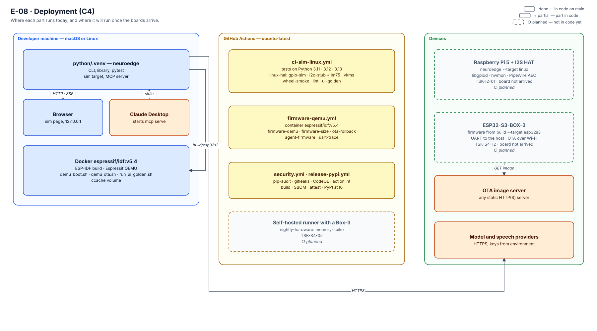

# 14 · Triển khai (C4 deployment)

> **Phạm vi:** mỗi container của [`02`](02-container-c4l2.md) chạy trên máy nào, trong môi trường nào, nối
> với nhau qua gì — hôm nay và khi bo mạch về. **Nguồn:** `.github/workflows/`, `scripts/`, `boards/`,
> `targets/esp32s3/components/ne_ota/Kconfig`, `python/neuroedge/models/providers/config.py`.

## 1. Bức tranh

*Hình E-08 — Ba vùng: máy của kỹ sư, máy chạy CI của GitHub, thiết bị. Khối `○ planned` chưa có phần cứng.*

NeuroEdge **không có dịch vụ phía máy chủ nào** trước tầng dịch vụ v1.1 (I0–I8): không tài khoản, không broker, không
backend. Mọi thứ chạy trên máy của người dùng hoặc trên thiết bị. Dịch vụ phía máy chủ đầu tiên là Fleet
OS ở I9 ([`13`](13-evolution-i0-i18.md) §3, mốc 9).

## 2. Nút triển khai

| Nút | Môi trường | Chạy gì | Trạng thái |
|:---|:---|:---|:---|
| **Máy kỹ sư** | macOS hoặc Linux, Python 3.11+, `python/.venv` | CLI và thư viện `neuroedge`, target `sim`, `mcp serve`, pytest | ✅ |
| **Trình duyệt** | cùng máy | trang `sim` của `--ui`, phục vụ **chỉ trên 127.0.0.1** (`sim/ui.py`) | ✅ |
| **Claude Desktop** (hoặc client MCP khác) | cùng máy | khởi động `neuroedge mcp serve` làm tiến trình con, nói stdio | ✅ |
| **Docker `espressif/idf:v5.4`** | cùng máy hoặc runner CI | dựng firmware ESP-IDF, Espressif QEMU; `scripts/qemu_boot.sh`, `qemu_ota.sh`, `run_ui_golden.sh` | ✅ |
| **GitHub Actions** | `ubuntu-latest` | năm workflow ở §3 | ✅ |
| **Runner tự quản có Box-3** | nhãn `[self-hosted, esp32s3-box-3]` | job `memory-spike` của `nightly-hardware.yml` | ○ planned (TSK-S1-10, TSK-S4-05) |
| **Raspberry Pi 5 + HAT I2S** | Linux, profile `boards/linux-rpi5.toml` | `neuroedge --target linux`: libgpiod, hwmon, âm thanh | ○ planned (TSK-I2-01) |
| **ESP32-S3-BOX-3** | firmware từ `neuroedge build --target esp32s3` | gate trên chip, vết ghi UART tới host, OTA | ○ planned (TSK-S4-12) — đã chạy trên QEMU |
| **Máy chủ ảnh OTA** | bất kỳ máy chủ HTTP(S) tĩnh nào | phục vụ ảnh ứng dụng đã ký | ✅ trên QEMU (`qemu_ota.sh` dùng `python3 -m http.server` trên 127.0.0.1) |
| **Nhà cung cấp model và giọng nói** | dịch vụ ngoài qua HTTPS | model ngôn ngữ, STT, TTS, Jev | ✅ tuỳ chọn; mặc định không gọi mạng |

Điều chặn các nút này hôm nay nằm ở roadmap §0.1 ("Chặn ngoài tầm kỹ thuật").

## 3. CI: mỗi job chứng minh gì

| Workflow | Kích hoạt | Job | Chứng minh |
|:---|:---|:---|:---|
| `ci-sim-linux.yml` | PR, push, tay | `frozen-artifacts` | ba lược đồ hợp lệ; gate khớp `digests.lock`; mọi gate phân giải; corpus gate hỏng vẫn hỏng; ba vết ghi chuẩn mực hợp lệ; profile bo mạch |
| | | `tests` | pytest trên Python 3.11, 3.12, 3.13; **fail nếu có test bị skip** |
| | | `linux-hal` | `LinuxHAL` trên dòng GPIO ảo (gpio-sim), cảm biến hwmon (i2c-stub + lm75), framebuffer ảo (vfb hoặc vkms — runner GitHub chỉ có vkms); `verify --targets sim,linux` |
| | | `wheel-smoke` | bản cài từ wheel chạy được, không chỉ bản editable |
| | | `lint` | `ruff check`, `ruff format --check` |
| | | `licence-obligations` | nghĩa vụ giấy phép (`CHANGELOG.md` §3.9) |
| | | `cloud-extra` | extra `neuroedge[cloud]` (LiteLLM thật) giữ đúng chính sách giấy phép Q-11, adapter chạy trên đối tượng trả về thật mà không gọi mạng |
| | | `ui-golden` | mỗi màn hình × ngôn ngữ của UI LVGL dựng trên host khớp PNG golden |
| `firmware-qemu.yml` | PR và push đụng firmware hoặc engine, hằng đêm, tay | `firmware-qemu` | firmware boot trên QEMU và self-test gate đạt; heap khi boot trên sàn Q-3 |
| | | `firmware-size` | ngân sách tĩnh Q-3: ảnh ≤ 3,5 MB, còn ≥ 120 KB SRAM trong |
| | | `ota-rollback` | cập nhật có ký, từ chối khoá sai, rollback — trên QEMU |
| | | `agent-firmware` | agent mới của người dùng build ra firmware và boot trên QEMU; agent bo mạch không phục vụ được thì không có firmware (mã thoát 1) |
| | | `uart-trace` | vết ghi UART thành `trace.v1` hợp lệ, và `verify --targets esp32s3` đạt |
| `security.yml` | PR, push, hằng tuần, tay | `pip-audit`, `gitleaks`, `actionlint`, `codeql`, `codeql-c` | lỗ hổng đã biết trong tập phụ thuộc ghim; không bí mật trong lịch sử git; workflow sạch; phân tích tĩnh Python và C |
| `release-pypi.yml` | tag `v*.*.*`, PR đụng đóng gói, tay | `build` → `sbom` → `smoke` → `attest` → `publish-*` → `github-release` | sdist và wheel; SBOM CycloneDX; provenance Sigstore; PyPI thật ở I6 |
| `nightly-hardware.yml` | hằng đêm, tay | `firmware-build`, `upstream-drift`, `drift-issue`, `memory-spike`, `report` | ảnh vừa khe OTA; trôi phụ thuộc thượng nguồn (không bao giờ làm đỏ, Q-32); đo bộ nhớ trên bo mạch khi có runner |

Bước cụ thể: chính các tệp workflow. Trạng thái xanh/đỏ hiện hành: roadmap §0.1.

## 4. Cấu hình và bí mật khi triển khai

| Thứ | Ở đâu | Luật |
|:---|:---|:---|
| Khoá API của nhà cung cấp | biến môi trường; `agent.toml` chỉ ghi **tên** biến (`api_key_env`) | khoá không bao giờ nằm trong tệp của agent, vết ghi hay kho |
| Địa chỉ máy chủ OTA | `CONFIG_NEUROEDGE_OTA_URL` lúc build; NVS (namespace `ne_ota`, khoá `url`) ghi đè lúc chạy | rỗng thì tắt kiểm tra; HTTP thường được phép vì chữ ký ảnh là phép kiểm toàn vẹn — nó không cho tính bí mật |
| Khoá ký OTA | ngoài kho; ảnh mang chữ ký, thiết bị kiểm bằng khoá đã ký app đang chạy | khoá sai ⇒ ảnh bị từ chối (`ota-rollback`) |
| Chọn target và bo mạch | `--target`, `--board`, profile `boards/*.toml` | profile khai những gì đã đo, không hơn ([`11`](11-hal-port-guide.md) §3) |
| Lớp cấu hình firmware | `sdkconfig.defaults` + `sdkconfig.qemu` / `sdkconfig.ota` | QEMU và bo mạch khác nhau ở lớp cấu hình, không ở mã |

## 5. Kết nối giữa các nút

| Từ → tới | Giao thức | Ghi chú |
|:---|:---|:---|
| `neuroedge` → trình duyệt | HTTP + SSE trên 127.0.0.1 | không mở ra mạng |
| Claude Desktop → `mcp serve` | MCP qua stdio | transport mạng: `--http` (TSK-P2-04), thiết bị khác qua mTLS, không phải Claude Desktop |
| `neuroedge` → Docker IDF | `neuroedge build --target esp32s3` sinh project; ESP-IDF dựng trong container | |
| Box-3 → host | UART, dòng `NE1` | `record`/`verify --port` đọc; baud và console còn mở (`TODOS.md` #35) |
| Box-3 → máy chủ OTA | HTTP(S) GET ảnh đã ký | Wi-Fi thật chưa nối (`TODOS.md` #50) |
| `neuroedge` → nhà cung cấp | HTTPS; `http://` chỉ cho máy chủ trên chính máy này | chi tiết theo từng client: [`01`](01-context-c4l1.md) §3 |

## 6. Chưa triển khai

- **Không có máy chủ nào của NeuroEdge trước v1.1.** Điều phối OTA theo đợt (Hawkbit), broker MQTT, kho vết ghi sự cố, danh tính thiết bị là Fleet OS (I9); kho lưu trữ và phân phối gate là Gate Registry (I10) — chi tiết cấu trúc triển khai máy chủ: [`15`](15-target-architecture.md) §3.1/§3.2.
- **Cụm robot phân tầng chưa triển khai.** Cấu trúc phân tầng gồm Raspberry Pi 5 làm não kết nối với các node vi điều khiển chuyên trách ESP32-S3 và RP2350 qua bus truyền thông Zenoh-pico (I14, Q-32, Q-33, Q-36) — chi tiết bố trí nút mạng: [`15`](15-target-architecture.md) §4.3.
- **Nút suy luận thị giác Jetson chưa triển khai.** Target `jetson` (bậc 2, I16) (bậc 2 theo FR-TGT-08, Q-13) chạy thị giác qua JetPack và TensorRT (`neuroedge-design-phase2.md` §7, TSK-V2-01) — chi tiết triển khai phần cứng: [`15`](15-target-architecture.md) §4.4.
- **Không có bo mạch thật trong CI.** Mọi bằng chứng về chip hôm nay là QEMU và test C trên host; bằng
  chứng trên silicon chờ bo mạch và runner tự quản (`TODOS.md` #10).
- **Chưa phát hành lên PyPI.** Workflow đã có; phát hành thật ở I6.
