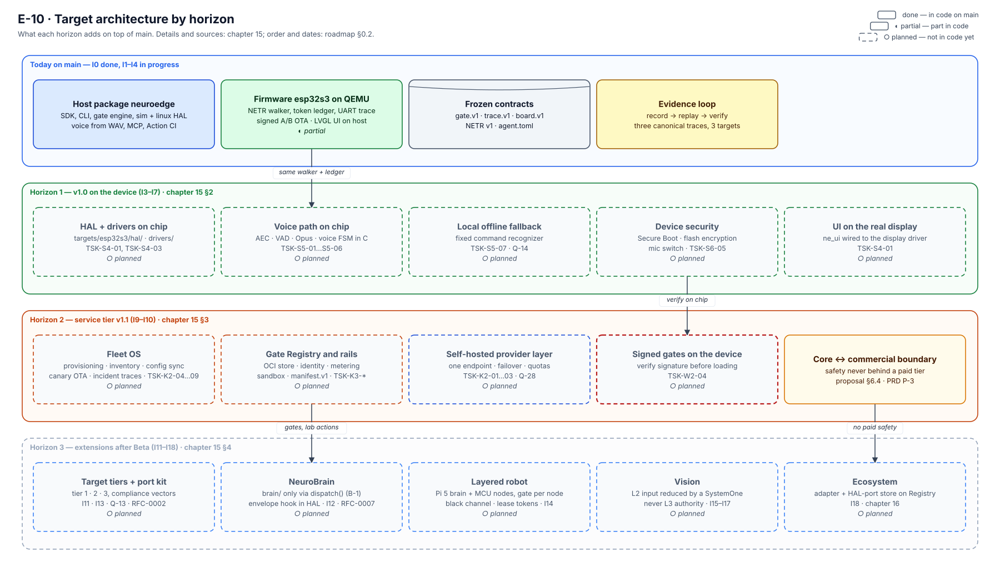
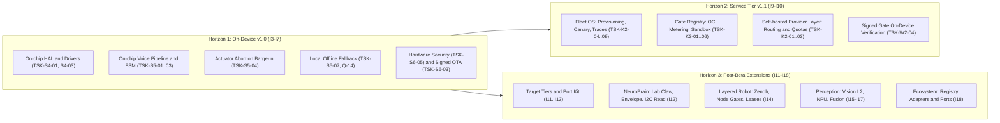
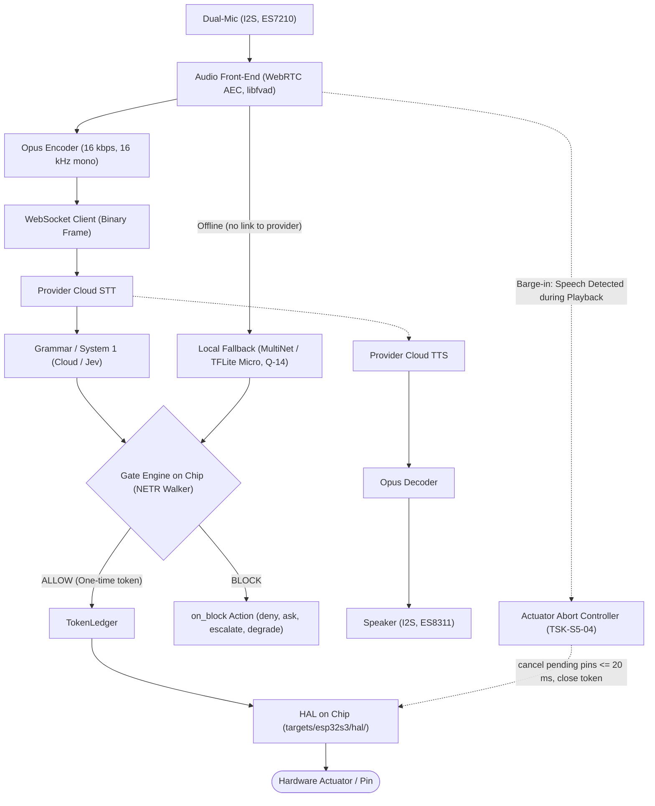
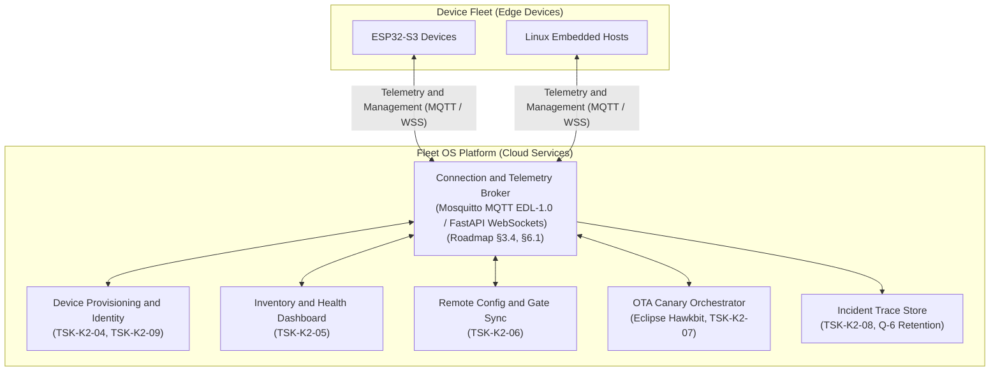
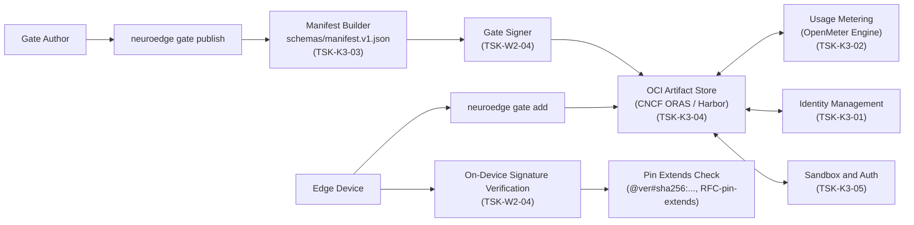
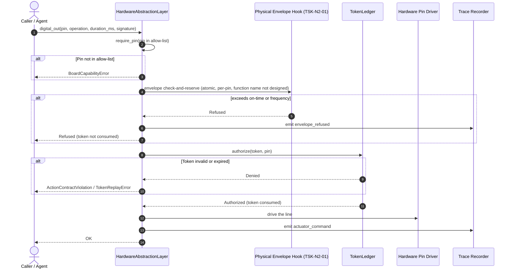
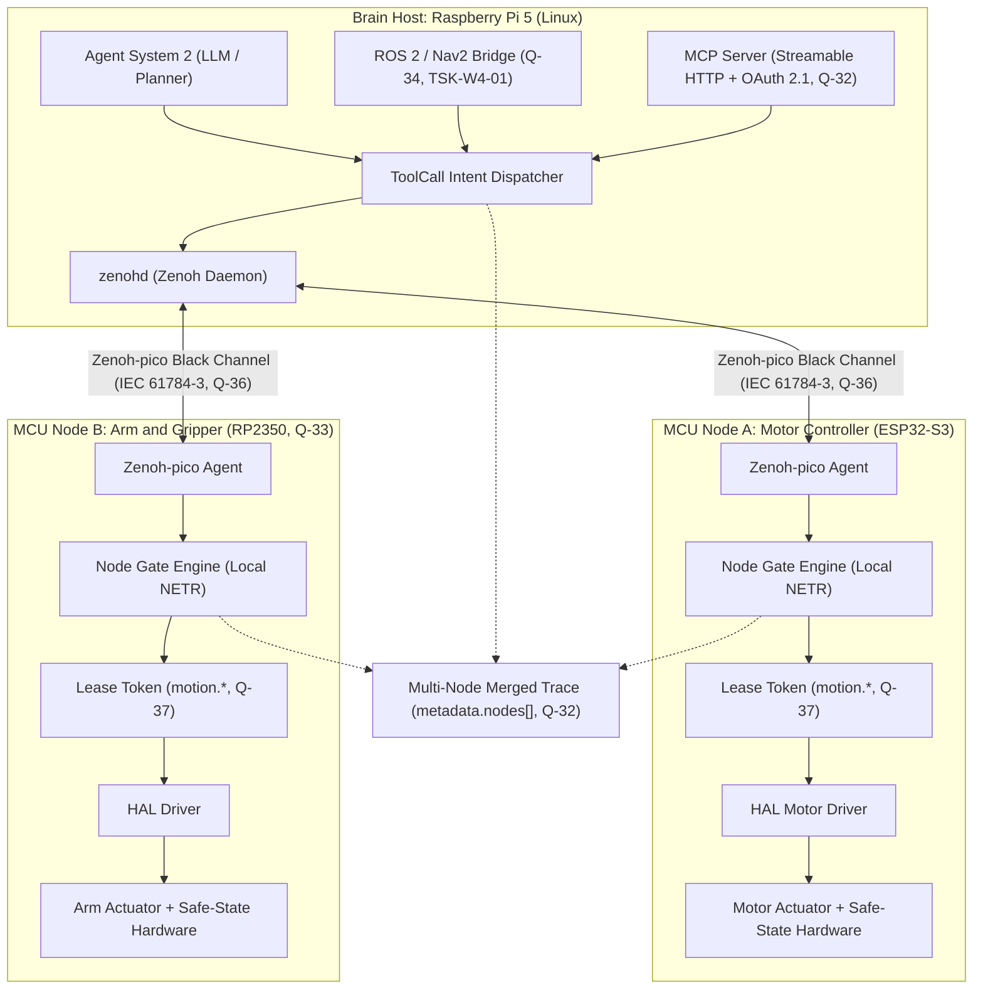
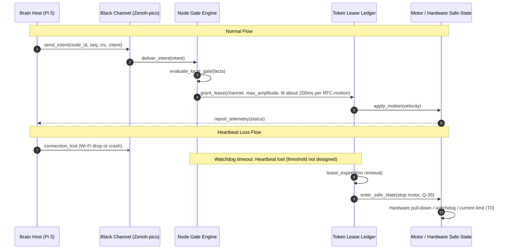
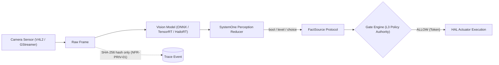

# 15 · Kiến trúc mục tiêu theo chân trời

> **Phạm vi:** kiến trúc mục tiêu (to-be architecture) của NeuroEdge qua ba chân trời phát triển. **Nguồn sự thật:**
> [`neuroedge-roadmap.md`](../../../neuroedge-roadmap.md) §2.1, §3, §4.4–§4.8, §5, §6, §7, Phụ lục D;
> [`neuroedge-prd.md`](../../../neuroedge-prd.md) §15, Phụ lục D.2;
> [`neuroedge-proposal.md`](../../../neuroedge-proposal.md) §3.1, §6;
> [`neuroedge-design-neurobrain.md`](../../../neuroedge-design-neurobrain.md);
> [`neuroedge-design-phase2.md`](../../../neuroedge-design-phase2.md);
> [`draft-ke-hoach-mo-rong-robot-fofoca.md`](../../../draft-ke-hoach-mo-rong-robot-fofoca.md) §2, §4, Phụ lục A;
> [`draft-rfc-node-giao-thuc-dieu-phoi.md`](../../../draft-rfc-node-giao-thuc-dieu-phoi.md) §3.
> **Quy ước trạng thái:** `done` / `partial` / `planned`.

**Đọc chương này để làm gì:** Chương này dành cho kiến trúc sư phần mềm, kỹ sư nhúng và kỹ sư hệ thống cần nắm rõ hình thái kiến trúc đích (to-be architecture) của NeuroEdge qua từng giai đoạn hoàn thiện. Tài liệu trả lời các câu hỏi: *Mỗi chân trời bổ sung những thành phần, driver, giao thức và dịch vụ nào? Ranh giới an toàn và cơ chế an toàn theo mặc định ([fail-closed](../../user/thuat-ngu.md): không thẩm định được gate thì chặn; mất mạng thì gate vẫn lượng giá bằng fallback cục bộ, chỉ chặn khi fallback không có hoặc không chạy — Q-14) được duy trì ra sao khi mở rộng quy mô từ một chip đơn lẻ tới hệ thống robot nhiều node và điện toán đám mây?* Trước khi đọc, người đọc nên nắm bức tranh tổng quan tại [`00`](00-overview.md) và hiện trạng tiến hoá tại [`13`](13-evolution-i0-i18.md). Sau chương này, đọc tiếp [`16`](16-ecosystem-landscape.md) để thấy toàn cảnh các bên tham gia trong hệ sinh thái mở rộng.

---

## 1. Ba chân trời

Lộ trình tiến hoá kiến trúc của NeuroEdge được phân chia thành ba **chân trời** (horizons — các giai đoạn phát triển kiến trúc với ranh giới năng lực và môi trường thực thi xác định):

| Chân trời | Increments | Thay đổi trong kiến trúc (Là gì & Vì sao cần) | Nơi thiết kế |
|:---|:---|:---|:---|
| **Chân trời 1 (H1)** — v1.0 trên thiết bị | I3–I7 | Hoàn thiện firmware trên chip ESP32-S3: đưa HAL 5 nguyên thủy lên chip thật, driver phần cứng (codec I2S, LCD ST7789, GPIO), đường thoại thời gian thực (AEC, VAD, Opus streaming), máy trạng thái hội thoại C99, cơ chế cắt lời thu hồi lệnh actuator (`actuator_abort.c`), client streaming WebSocket lên cloud, fallback nhận diện lệnh cố định offline khi mất mạng ([`Q-14`](../../../neuroedge-prd.md#15-sổ-quyết-định)), bảo mật thiết bị (Secure Boot, mã hoá flash, ngắt micro vật lý, anti-rollback eFuse), giao diện LVGL nối driver hiển thị. Tiền đề của demo "nói chuyện với con chip $5" (roadmap §4.6): thoại trên Box-3, gate trên chip. | Roadmap [§4.4–§4.8](../../../neuroedge-roadmap.md#44-i3--gate-trên-box-3-thật), PRD [Phụ lục D.2](../../../neuroedge-prd.md#d2-giao-thức-truyền-dẫn--định-dạng-vết-ghi-wire-protocol), [`04`](04-component-device-c4l3.md) |
| **Chân trời 2 (H2)** — Tầng dịch vụ v1.1 | I9–I10 | Xuất hiện hai container mới phía máy chủ: **Fleet OS** (cấp phát danh tính, sổ kiểm kê, giám sát sức khỏe, đồng bộ cấu hình và gate từ xa, điều phối chiến dịch canary rollout (phát hành theo đợt nhỏ dần lên toàn đội) qua Eclipse Hawkbit, kho thu thập vết ghi sự cố tập trung, thu hồi chứng chỉ) và **Gate Registry** (kho OCI (chuẩn đóng gói artifact của Open Container Initiative) công khai qua CNCF ORAS/Harbor, định danh ổn định, hệ đo lường qua OpenMeter, sandbox phân quyền, manifest (tệp mô tả gói) `schemas/manifest.v1.json`, gate có ký và kiểm chữ ký trên chip, ghim `extends` bằng digest). Lớp trừu tượng provider tự vận hành hoàn thiện (định tuyến đa nhà cung cấp, failover, quota). Cần thiết để quản trị đội thiết bị quy mô lớn mà không làm mất tính tự chủ an toàn của từng thiết bị. | Roadmap [§6](../../../neuroedge-roadmap.md#6-tầng-dịch-vụ-v11-i9i10), Proposal [§6](../../../neuroedge-proposal.md#6-mặt-phẳng-thương-mại-fleet-os), PRD [`Q-6`](../../../neuroedge-prd.md#15-sổ-quyết-định), [`Q-28`](../../../neuroedge-prd.md#15-sổ-quyết-định), [`02`](02-container-c4l2.md) §5 |
| **Chân trời 3 (H3)** — Mở rộng sau Beta | I11–I18 | Mở rộng danh mục target theo 3 [bậc target](../../user/thuat-ngu.md) (I11, I13); **NeuroBrain** (I12) cho bring-up phần cứng qua hội thoại, package `brain/` cô lập, lab action có gate, [phong bì an toàn vật lý](../../user/thuat-ngu.md) trong HAL, bus I2C chỉ đọc, trigger sự kiện; **Robot phân tầng** (I14) phối hợp não Pi 5 và nhiều node MCU (ESP32-S3, RP2350) qua [black channel](../../user/thuat-ngu.md) Zenoh-pico, mỗi node tự lượng giá gate, [token thuê có hạn](../../user/thuat-ngu.md) (lease) cho `motion.*`, trạng thái an toàn khi mất liên lạc, cầu ROS 2/Nav2; **Thị giác** (I15–I17) mở rộng nhận thức L2 trên Linux/Jetson rút gọn qua [SystemOne](../../user/thuat-ngu.md), NPU rời; **Hệ sinh thái** (I18) chia sẻ adapter và port HAL trên Registry. Cần thiết để NeuroEdge mở rộng ra các hệ thống chuyển động phức tạp, tay máy và đa giác quan. | Roadmap [§7](../../../neuroedge-roadmap.md#7-hướng-mở-rộng-sau-beta-i11i18), [`neuroedge-design-neurobrain.md`](../../../neuroedge-design-neurobrain.md), [`neuroedge-design-phase2.md`](../../../neuroedge-design-phase2.md), [`draft-ke-hoach-mo-rong-robot-fofoca.md`](../../../draft-ke-hoach-mo-rong-robot-fofoca.md), [`draft-rfc-node-giao-thuc-dieu-phoi.md`](../../../draft-rfc-node-giao-thuc-dieu-phoi.md) |

*Hình E-10 — Bốn dải: hiện trạng trên main và ba chân trời; khối nét đứt là planned. Sinh bởi scripts/gen_architecture_diagrams.py.*

*Cách đọc hình E-10:* Hình biểu diễn bốn dải ngang tương ứng với hiện trạng mã nguồn trên nhánh `main` và ba chân trời quy hoạch nối tiếp nhau. Khối nét liền đã có mã (◐ là một phần), khối nét đứt là planned. Các nhãn nối giữa dải (same walker + ledger, verify on chip, no paid safety) cho thấy chân trời sau dùng lại walker, sổ token và gate của chân trời trước.

Sơ đồ quan hệ phát triển giữa ba chân trời:

*Cách đọc sơ đồ:* Ba khối chữ nhật đại diện cho ba chân trời kiến trúc. Mũi tên từ H1 trỏ sang H2 và H3 thể hiện rằng toàn bộ cơ chế an toàn và tương đương target của Chân trời 1 là điều kiện tiên quyết bắt buộc trước khi kích hoạt tầng dịch vụ đám mây (H2) hoặc mở rộng đa node/thị giác (H3). Điểm cốt lõi cần nhớ: việc bổ sung dịch vụ quản trị hay robot phân tầng không bao giờ làm suy giảm hoặc phá vỡ các bảo đảm an toàn đã đóng gói trên thiết bị của H1.

---

## 2. Chân trời 1 — v1.0 trên thiết bị (I3–I7)

### 2.1 Thành phần firmware quy hoạch

Trên vi điều khiển ESP32-S3, các thành phần đã có mã ở `main` gồm walker `components/ne_gate/`, bộ định dạng vết ghi `components/ne_trace/`, phần sinh riêng của agent `components/ne_agent/`, và module cập nhật `components/ne_ota/` (đã chạy trên Espressif QEMU, chi tiết tại [`04`](04-component-device-c4l3.md) §3). Bảng dưới đây quy hoạch các thành phần cần bổ sung và hoàn thiện trên phần cứng thật từ các task I3–I7:

| Thành phần (đường dẫn quy hoạch) | Là gì & Vì sao cần | Task chi phối | Tái sử dụng mã nguồn mở (Roadmap §3) | Trạng thái |
|:---|:---|:---|:---|:---:|
| `targets/esp32s3/hal/` | Hiện thực 5 nguyên thủy HAL trên ESP-IDF; cần thiết để cung cấp giao tiếp chân vật lý chuẩn mực tương đương với `sim` và `linux`. | [`TSK-S4-01`](../../../neuroedge-roadmap.md#44-i3--gate-trên-box-3-thật) | ESP-IDF (toolchain) — roadmap §4.4 | `planned` |
| `targets/esp32s3/drivers/` | Driver ngoại vi thật: codec I2S ES8311/ES7210, LCD ST7789, GPIO; cần thiết để điều khiển trực tiếp thanh ghi phần cứng của Box-3. | [`TSK-S4-03`](../../../neuroedge-roadmap.md#44-i3--gate-trên-box-3-thật) | Port trực tiếp driver từ XiaoZhi ESP32 (roadmap [§3.4](../../../neuroedge-roadmap.md#34-ma-trận-tích-hợp-theo-khối), [§3.5](../../../neuroedge-roadmap.md#35-năm-dự-án-port-trực-tiếp)) | `planned` |
| `targets/esp32s3/drivers/audio_path.c` | Đường dẫn âm thanh thu/phát; cần thiết để kết nối luồng I2S từ codec vào bộ đệm vòng mà không chạy STT/TTS trên thiết bị. | [`TSK-S5-02`](../../../neuroedge-roadmap.md#46-i5--thoại-trên-box-3) | Port cấu hình codec và I2S clock từ XiaoZhi ESP32 (roadmap [§3.5](../../../neuroedge-roadmap.md#35-năm-dự-án-port-trực-tiếp)) | `planned` |
| `targets/esp32s3/audio/` | Tích hợp WebRTC AEC, libfvad (VAD), Opus streaming; cần thiết để khử tiếng vọng, lọc khoảng lặng và nén luồng âm thanh thời gian thực. | [`TSK-S5-01`](../../../neuroedge-roadmap.md#46-i5--thoại-trên-box-3) | WebRTC AEC, libfvad, Opus; port pipeline từ Pipecat (roadmap [§3.4](../../../neuroedge-roadmap.md#34-ma-trận-tích-hợp-theo-khối), [§3.5](../../../neuroedge-roadmap.md#35-năm-dự-án-port-trực-tiếp)) | `planned` |
| `targets/esp32s3/fsm/voice_fsm.c` | Hiện thực C/C++ của máy trạng thái hội thoại 5 trạng thái; cần thiết để đồng bộ chuẩn xác hành vi hội thoại với bản Python trên host. | [`TSK-S5-03`](../../../neuroedge-roadmap.md#46-i5--thoại-trên-box-3) | Đặc tả chuẩn tắc [`voice_fsm.md`](../../spec/voice_fsm.md), vượt bộ vector tuân thủ TSK-S3-10 (roadmap [§3.8](../../../neuroedge-roadmap.md#38-bảo-toàn-tương-đương-target-khi-có-hai-ngôn-ngữ)) | `planned` |
| `targets/esp32s3/fsm/actuator_abort.c` | Cơ chế thu hồi lệnh actuator chưa thực thi khi bị cắt lời (≤ 20 ms, đóng token); cần thiết để chặn rò rỉ lệnh vật lý khi người dùng đổi ý. | [`TSK-S5-04`](../../../neuroedge-roadmap.md#46-i5--thoại-trên-box-3) | Cơ chế barge-in từ Pipecat (roadmap [§3.5](../../../neuroedge-roadmap.md#35-năm-dự-án-port-trực-tiếp)), hợp đồng [`voice_fsm.md`](../../spec/voice_fsm.md) §5 | `planned` |
| `targets/esp32s3/audio/provider_client.c` | Client streaming âm thanh đẩy khung Opus lên STT, nhận luồng TTS qua WebSocket; cần thiết để giao tiếp mạng độ trễ thấp với cloud provider. | [`TSK-S5-06`](../../../neuroedge-roadmap.md#46-i5--thoại-trên-box-3) | Vòng lặp streaming WebSocket nhị phân từ XiaoZhi ESP32 (roadmap [§3.5](../../../neuroedge-roadmap.md#35-năm-dự-án-port-trực-tiếp)) | `planned` |
| `targets/esp32s3/fallback/` | Bộ nhận diện lệnh cố định cục bộ offline; cần thiết để duy trì năng lực ra lệnh an toàn khi mất kết nối Internet ([`Q-14`](../../../neuroedge-prd.md#15-sổ-quyết-định)). | [`TSK-S5-07`](../../../neuroedge-roadmap.md#46-i5--thoại-trên-box-3) | ESP-SR MultiNet hoặc TFLite Micro / ESP-NN (roadmap [§4.6](../../../neuroedge-roadmap.md#46-i5--thoại-trên-box-3)) | `planned` |
| `targets/esp32s3/security/` | Khối an toàn phần cứng: Secure Boot, mã hóa flash, nút ngắt micro vật lý, eFuse; cần thiết để chống nạp firmware lậu và chống nghe lén. | [`TSK-S6-05`](../../../neuroedge-roadmap.md#48-i7--v10) | ESP-IDF (chưa chọn thành phần cụ thể) | `planned` |
| `targets/esp32s3/ui/` | 9 màn hình build và so ảnh golden trên host (TSK-S4-10 xong); chưa link vào firmware, chờ driver màn hình (TSK-S4-01). Cần thiết để hiển thị trạng thái và thông báo xác nhận. | [`TSK-S4-01`](../../../neuroedge-roadmap.md#44-i3--gate-trên-box-3-thật), [`TSK-S4-10`](../../../neuroedge-roadmap.md#44-i3--gate-trên-box-3-thật) | Thư viện đồ hoạ nhúng LVGL v9 (roadmap [§3.4](../../../neuroedge-roadmap.md#34-ma-trận-tích-hợp-theo-khối)) | `partial` |
| `targets/esp32s3/sdkconfig.defaults` | Tệp cấu hình đã có sẵn trong kho; cấu hình tối ưu bộ nhớ đạt ngân sách SRAM ≥ 120 KB, PSRAM ≥ 2 MB ([`Q-3`](../../../neuroedge-prd.md#15-sổ-quyết-định)) cho đường thoại là phần quy hoạch. | [`TSK-S5-05`](../../../neuroedge-roadmap.md#46-i5--thoại-trên-box-3) | ESP-IDF Kconfig | `planned` |

### 2.2 Đường thoại trên chip

Đường thoại thời gian thực trên chip ESP32-S3 vận hành theo chu trình cloud-first ([`CR-1.0`](../../../neuroedge-roadmap.md#46-i5--thoại-trên-box-3)), bảo đảm STT, TTS và suy luận ngôn ngữ đặt ở nhà cung cấp điện toán đám mây nhằm giảm tải tài nguyên tính toán cho vi điều khiển:

*Cách đọc sơ đồ:* Mũi tên nét liền biểu thị hai đường dẫn thực thi: đường trực tuyến chính (qua encoder Opus, WebSocket lên cloud STT và System 1) và đường ngoại tuyến dự phòng (khi mất kết nối, AFE chuyển âm thanh trực tiếp sang bộ nhận diện lệnh cục bộ MultiNet/TFLite Micro). Cả hai đường đều hội tụ tại Gate Engine cục bộ trên chip để kiểm soát chốt pin. Mũi tên nét đứt biểu thị chỗ nối sang TTS và luồng ngắt lời (barge-in). Điểm cốt lõi cần nhớ: việc thẩm định an toàn luôn diễn ra trên vi điều khiển; khi mất mạng thiết bị không bị treo mà tự động chuyển sang fallback cục bộ.

- **Xử lý âm thanh đầu vào (AFE):** Tín hiệu micro I2S qua codec ES7210 được đưa vào khối AFE (WebRTC AEC và libfvad) để khử tiếng vọng từ loa và nhận diện giọng nói (VAD). Khung âm thanh 20 ms được nén bằng Opus rồi truyền lên provider cloud qua WebSocket nhị phân.
  *Nguồn chưa thống nhất: `docs/spec/simulation_coverage.md` §2 và TSK-S4-11 ghi ESP-SR AFE (AEC, VAD); chọn một khi làm TSK-S5-01.*
- **Xử lý ý định và an toàn:** Văn bản sau STT chuyển tới grammar/System 1. Nếu mất mạng, hệ thống chuyển sang bộ nhận diện lệnh cố định cục bộ (fallback offline theo [`Q-14`](../../../neuroedge-prd.md#15-sổ-quyết-định)). Dữ kiện tạo ra chuyển thành tool call đưa vào walker `NETR` của Gate Engine chạy ngay trên MCU. Chỉ khi gate trả về `ALLOW`, một token dùng một lần mới được cấp phát để HAL kích hoạt chân vật lý.
- **Cắt lời (Barge-in) và thu hồi lệnh:** Khi người dùng nói chen ngang lúc loa đang phát, khối VAD phát hiện giọng nói sẽ lập tức kích hoạt bộ điều khiển hủy (`actuator_abort.c`): nó lập tức hủy mọi lệnh actuator đang chờ (≤ 20 ms), đóng token của lệnh bị hủy, rồi dừng TTS (< 300 ms tính từ lúc người dùng bắt đầu nói) — bước hủy không chờ bước dừng TTS ([`voice_fsm.md`](../../spec/voice_fsm.md) §5.2).
- **Phần chưa thiết kế (state plainly):** Mô hình đa nhiệm FreeRTOS cho toàn bộ đường thoại — bao gồm số lượng task FreeRTOS, mức độ ưu tiên của từng task, cấu trúc hàng đợi (FreeRTOS queues), và chiến lược ghim nhân (core affinity) trên hai nhân của ESP32-S3 — **chưa được thiết kế** (như đã ghi nhận tại [`04`](04-component-device-c4l3.md) §2). Thiết kế hiện tại chỉ xác định các khối chức năng và ấn định các ràng buộc thời gian (hủy lệnh actuator chưa giao ≤ 20 ms, ngân sách bộ nhớ theo [`Q-3`](../../../neuroedge-prd.md#15-sổ-quyết-định)).

### 2.3 Giao thức quy hoạch

Các giao thức truyền dẫn được quy hoạch theo chuẩn mở và tối ưu cho tài nguyên vi điều khiển (PRD [Phụ lục D.2](../../../neuroedge-prd.md#d2-giao-thức-truyền-dẫn--định-dạng-vết-ghi-wire-protocol), roadmap [Phụ lục D](../../../neuroedge-roadmap.md#phụ-lục-d--giao-thức-truyền-dẫn)):

1. **Giao thức mạng Wi-Fi / LAN:**
   - **Kênh truyền:** `WebSocket` bảo mật (WSS).
   - **Khung nhị phân (Binary Frame):** truyền luồng âm thanh Opus Voice Mode (16 kbps, 16 kHz mono, kích thước khung 20 ms = 320 mẫu). Mọi target tuân thủ cùng định dạng này. `sim` phát lại tệp WAV qua đúng đường mã hóa này để giữ tương đương với chip thật. Trạng thái: `planned`.
   - **Khung văn bản (Text Frame):** truyền sự kiện vết ghi JSON (PRD Phụ lục D.2). Trạng thái: `planned`.
2. **Giao thức cổng nối tiếp UART:**
   - **Tốc độ baud:** **chưa chốt** — PRD Phụ lục D.2 ghi 921600, nhưng `sdkconfig.defaults` không đặt (ESP-IDF mặc định 115200) và Box-3 có thể đưa console qua USB-Serial-JTAG; chốt khi bo mạch về ([`TODOS.md`](../../../TODOS.md) #35, [`TSK-S4-12`](../../../neuroedge-roadmap.md#44-i3--gate-trên-box-3-thật)).
   - **Định dạng vết ghi:** JSON Lines, mỗi dòng mang tiền tố `NE1 ` cố định để tách biệt với log firmware. Định dạng vết ghi dòng `NE1 ` đã hoàn thành trên host và QEMU ([`TSK-S4-09`](../../../neuroedge-roadmap.md#44-i3--gate-trên-box-3-thật), `docs/spec/simulation_coverage.md` §4).
   - **Đóng gói nhị phân:** Khi cần truyền dữ liệu nhị phân, giao thức đóng gói khung sử dụng `SLIP` (Serial Line Internet Protocol) theo PRD Phụ lục D.2. Trạng thái: `planned`.

### 2.4 Bảo mật thiết bị

Kiến trúc bảo mật phần cứng tại Chân trời 1 tạo thành vành đai bảo vệ toàn vẹn cho thiết bị:

- **Secure Boot:** bật Secure Boot trên ESP32-S3 ([`TSK-S6-05`](../../../neuroedge-roadmap.md#48-i7--v10), NFR-SEC-02); thuật toán chữ ký chưa chọn (NFR-SEC-02 không nêu thuật toán; RSA-3072 hôm nay là chữ ký ảnh OTA theo FR-OTA-03, [`TSK-S6-03`](../../../neuroedge-roadmap.md#48-i7--v10)). Chưa có Secure Boot thì người có cáp vẫn đổi được firmware (roadmap [`TSK-S6-03`](../../../neuroedge-roadmap.md#48-i7--v10)).
- **Mã hoá flash:** bật mã hoá flash trên ESP32-S3 ([`TSK-S6-05`](../../../neuroedge-roadmap.md#48-i7--v10), NFR-SEC-02); thuật toán và cách quản lý khoá chưa thiết kế.
- **Nút ngắt micro vật lý:** bo mạch tham chiếu có nút ngắt micro vật lý ([`TSK-S6-05`](../../../neuroedge-roadmap.md#48-i7--v10), NFR-SEC-03); ngắt nguồn hay ngắt tín hiệu chưa thiết kế.
- **Anti-rollback eFuse:** chống hạ cấp bằng eFuse đi cùng Secure Boot ([`TSK-S6-05`](../../../neuroedge-roadmap.md#48-i7--v10); roadmap [`TSK-S6-03`](../../../neuroedge-roadmap.md#48-i7--v10)). Hôm nay hạ cấp chỉ bị chặn bằng mốc trong NVS — tức là bảo vệ bằng phần mềm.
- **Cơ chế cập nhật OTA:** Cập nhật OTA cấp thiết bị — phân vùng kép A/B (`ota_0`, `ota_1`), kiểm tra chữ ký RSA-3072 trên ảnh tải về, và tự động rollback khi phát hiện bootloop hoặc self-test thất bại — đã có hiện thực trên QEMU và được mô tả chi tiết tại [`04`](04-component-device-c4l3.md) §6.

---

## 3. Chân trời 2 — tầng dịch vụ v1.1 (I9–I10)

### 3.1 Fleet OS

Fleet OS là **dịch vụ thương mại duy nhất** của NeuroEdge (Proposal [§6.2](../../../neuroedge-proposal.md#62-tầng-quản-trị-đội-thiết-bị-fleet-management-os--5-năng-lực-chính), Roadmap [§6.1](../../../neuroedge-roadmap.md#61-i9--lớp-provider-v11-và-fleet-os)), cung cấp hạ tầng quản trị tập trung cho các đội thiết bị từ xa:

*Cách đọc sơ đồ:* Khối Device Fleet bên trái là các thiết bị biên chạy độc lập. Khối Fleet OS bên phải là cụm dịch vụ đám mây. Mũi tên hai chiều giữa thiết bị và broker thể hiện kênh viễn trắc và nhận lệnh cấu hình. Nguồn chỉ liệt kê các mô-đun (TSK-K2-04…09) và chọn broker MQTT hoặc FastAPI WebSockets cho kết nối và viễn trắc; các mô-đun nối với nhau thế nào thì chưa thiết kế. Điểm cốt lõi cần nhớ: Fleet OS chỉ đóng vai trò mặt phẳng quản trị (management plane); thiết bị biên giữ toàn quyền tự chủ lượng giá an toàn trên từng cơ cấu chấp hành.

- **Các thành phần và task của Fleet OS:**
  - `services/fleet/provisioning.py` ([`TSK-K2-04`](../../../neuroedge-roadmap.md#61-i9--lớp-provider-v11-và-fleet-os)): Cấp phát danh tính, nạp chứng chỉ thiết bị tự động. Thu hồi chứng chỉ khi thiết bị bị xâm phạm thực hiện tại `services/fleet/` ([`TSK-K2-09`](../../../neuroedge-roadmap.md#61-i9--lớp-provider-v11-và-fleet-os), NFR-SEC-05).
  - `services/fleet/inventory.py` ([`TSK-K2-05`](../../../neuroedge-roadmap.md#61-i9--lớp-provider-v11-và-fleet-os)): Sổ kiểm kê thiết bị, theo dõi trạng thái sống/chết (online/offline), phiên bản firmware, RSSI sóng Wi-Fi, nhiệt độ chip. Dashboard hữu ích ngay từ $n=1$.
  - `services/fleet/config_sync.py` ([`TSK-K2-06`](../../../neuroedge-roadmap.md#61-i9--lớp-provider-v11-và-fleet-os)): Đồng bộ cấu hình, bí mật và cập nhật gate an toàn từ xa cho toàn đội mà không cần nạp lại firmware.
  - `services/fleet/canary.py` ([`TSK-K2-07`](../../../neuroedge-roadmap.md#61-i9--lớp-provider-v11-và-fleet-os)): Điều phối chiến dịch phát hành firmware theo đợt (canary 1% → 10% → 100%) kế thừa từ Eclipse Hawkbit, tự động dừng chiến dịch và rollback khi tỷ lệ lỗi vượt ngưỡng cho phép (mục tiêu 1.000 thiết bị / 0 brick).
  - `services/fleet/trace_collector.py` ([`TSK-K2-08`](../../../neuroedge-roadmap.md#61-i9--lớp-provider-v11-và-fleet-os)): Tự động tải tệp vết ghi sự cố (incident traces) về kho lưu trữ tập trung khi thiết bị gặp lỗi.
- **Ranh giới dữ liệu lên Fleet OS:**
  - **Dữ liệu được phép lên Fleet OS:** Viễn trắc sức khỏe (online/offline, phiên bản firmware, RSSI, nhiệt độ chip — FR-FLT-03) và tệp vết ghi sự cố (FR-FLT-05); vết chỉ chứa quyết định, không dữ liệu thô (NFR-PRIV-03). Thời hạn lưu trữ theo [`Q-6`](../../../neuroedge-prd.md#15-sổ-quyết-định): gói Fleet Standard lưu trữ 90 ngày; gói Fleet Enterprise lưu trữ 3 năm (NFR-PRIV-03).
  - **Dữ liệu không lên Fleet OS:** Âm thanh không vào kho vết ghi của Fleet OS ([`Q-6`](../../../neuroedge-prd.md#15-sổ-quyết-định), NFR-PRIV-03: vết chỉ chứa quyết định, không dữ liệu thô). Kênh kết nối và viễn trắc: broker MQTT giấy phép dễ dãi (Mosquitto EDL-1.0, NanoMQ hoặc VerneMQ — [`Q-11`](../../../neuroedge-prd.md#15-sổ-quyết-định)) hoặc FastAPI WebSockets (roadmap [§3.4](../../../neuroedge-roadmap.md#34-ma-trận-tích-hợp-theo-khối), [§6.1](../../../neuroedge-roadmap.md#61-i9--lớp-provider-v11-và-fleet-os)). Âm thanh không đi qua Fleet OS: luồng WebSocket âm thanh của thiết bị kết thúc ở lớp provider tự vận hành (§3.3, FR-GW-04) — [`Q-47`](../../../neuroedge-prd.md#15-sổ-quyết-định).

### 3.2 Gate Registry và các đường ray

Gate Registry (Roadmap [§6.2](../../../neuroedge-roadmap.md#62-i10--registry-và-các-đường-ray), [`TSK-K3-*`](../../../neuroedge-roadmap.md#62-i10--registry-và-các-đường-ray)) cung cấp hạ tầng phân phối, xác thực và kiểm soát các gói gate an toàn thông qua các chuẩn công nghiệp mở:

*Cách đọc sơ đồ:* Nửa trên là chuỗi cung ứng chính sách (tác giả xuất bản qua manifest, ký số và lưu vào kho OCI). Nửa dưới là chuỗi tiêu thụ (thiết bị kéo gate về, xác minh chữ ký trên chip và kiểm tra ghim digest kế thừa). OpenMeter và Sandbox đóng vai trò đường ray kiểm soát đo lường và bảo mật. Điểm cốt lõi cần nhớ: gate an toàn được đóng gói và xác minh như một OCI artifact chuẩn hóa; thiết bị chỉ thực thi gate khi chữ ký số mật mã hợp lệ.

- **Hạ tầng lưu trữ OCI:** Dựa trên CNCF ORAS và Harbor để lưu trữ các artifact gate dưới dạng OCI image chuẩn hóa ([`TSK-K3-04`](../../../neuroedge-roadmap.md#62-i10--registry-và-các-đường-ray), FR-REG-01).
- **Định danh ổn định:** Định danh ổn định cho thiết bị, agent và gate ([`TSK-K3-01`](../../../neuroedge-roadmap.md#62-i10--registry-và-các-đường-ray), FR-REG-05); định dạng chưa thiết kế. Quy ước hiện có (PRD Phụ lục C): gate trên Registry `neuroedge://gates/<nhóm>/<tên>@<semver>`, agent `<tên>@<semver>`.
- **Hệ đo lường sử dụng (Metering):** Tích hợp OpenMeter để gom cụm sự kiện và đối soát lượt gọi agent cùng lượt thẩm định gate, tương thích giao tiếp với cổng thanh toán Stripe Billing ([`TSK-K3-02`](../../../neuroedge-roadmap.md#62-i10--registry-và-các-đường-ray), FR-REG-06, FR-TEL-04).
- **Cơ chế phân quyền và Sandbox:** Thiết lập môi trường cách ly và kiểm soát quyền hạn khi chạy agent hoặc mã bên thứ ba trên thiết bị có cơ cấu chấp hành ([`TSK-K3-05`](../../../neuroedge-roadmap.md#62-i10--registry-và-các-đường-ray), FR-REG-07).
- **Lược đồ Manifest:** Định nghĩa chuẩn hóa tệp mô tả gói `schemas/manifest.v1.json` và quy chuẩn phiên bản SemVer ([`TSK-K3-03`](../../../neuroedge-roadmap.md#62-i10--registry-và-các-đường-ray), FR-REG-02, FR-GATE-10).
- **Kho chia sẻ adapter:** Chia sẻ các adapter kết nối provider do cộng đồng đóng góp dùng chung hạ tầng OCI ([`TSK-K3-06`](../../../neuroedge-roadmap.md#62-i10--registry-và-các-đường-ray), FR-REG-08).
- **Ký gate và xác minh trên thiết bị:** Ký số các artifact gate và kiểm tra tính hợp lệ của chữ ký trực tiếp trên thiết bị biên trước khi nạp vào bộ nhớ ([`TSK-W2-04`](../../../neuroedge-roadmap.md#62-i10--registry-và-các-đường-ray), FR-REG-04).
- **Ghim `extends` bằng digest:** Bắt buộc ghim định danh kế thừa bằng mã băm nội dung (`@<ver>#sha256:...`) để chống tấn công thay đổi nội dung gate cha trên Registry, thực thi qua `RFC-pin-extends` ([`TSK-S3-21`](../../../neuroedge-roadmap.md#62-i10--registry-và-các-đường-ray), FR-GATE-05, FR-GATE-06).

### 3.3 Lớp provider tự vận hành

Lớp trừu tượng nhà cung cấp (FR-GW) là một **thành phần tự vận hành (self-host) thuộc lõi**, không phải là một dịch vụ do NeuroEdge đứng ra kinh doanh hay thu phí (Proposal [§6.1](../../../neuroedge-proposal.md#61-lớp-trừu-tượng-nhà-cung-cấp-provider-abstraction-layer--6-năng-lực-tự-vận-hành), Roadmap [§6.1](../../../neuroedge-roadmap.md#61-i9--lớp-provider-v11-và-fleet-os)).

Theo quyết định [`Q-28`](../../../neuroedge-prd.md#15-sổ-quyết-định), phạm vi được phân định rành mạch giữa hai mốc phát hành:
- **v1.0 (Khối 1a, TSK-S2-11):** Giao ở mức tối thiểu cho nhu cầu của thiết bị đơn lẻ:
  - Cấu hình một bảng `[system_two]` trong `agent.toml` (`provider`, `model`, `api_base`, `api_key_env`) phục vụ mọi nhà cung cấp mà LiteLLM hoặc một adapter tùy chỉnh hỗ trợ. Khóa API đọc từ biến môi trường, tuyệt đối không nằm trong code, file cấu hình hay gate.
  - Hợp đồng failover cơ bản trong mã nguồn (`SystemTwo(provider=..., fallback=...)`): provider chính lỗi thì chuyển sang fallback; không còn đường nào thì trả `Unavailable` và gate áp `fail` của nó (mặc định `closed`).
- **v1.1 (Khối 2, TSK-K2-01→03):** Hoàn thiện các năng lực cấp đội thiết bị:
  - `python/neuroedge/models/providers/auth.py` ([`TSK-K2-01`](../../../neuroedge-roadmap.md#61-i9--lớp-provider-v11-và-fleet-os)): Gom một endpoint và một credential dùng chung cho toàn bộ đội thiết bị; khóa do người dùng tự quản lý, xoay được mà không cần nạp lại firmware (FR-GW-01, FR-GW-02).
  - `python/neuroedge/models/providers/routing.py` ([`TSK-K2-02`](../../../neuroedge-roadmap.md#61-i9--lớp-provider-v11-và-fleet-os)): Khai báo nhiều provider và chính sách failover ngay trong cấu hình `agent.toml` mà không cần viết mã; kiểm soát hạn mức (quota) theo từng thiết bị để tránh sự cố lặp vòng gây cạn kiệt ngân sách (FR-GW-03, FR-GW-05, FR-TEL-06).
  - `python/neuroedge/models/providers/traces.py` ([`TSK-K2-03`](../../../neuroedge-roadmap.md#61-i9--lớp-provider-v11-và-fleet-os)): Giao thức tối ưu hóa cho thiết bị biên và tự động xuất tệp vết ghi JSON đồng nhất định dạng cho từng phiên (FR-GW-04, FR-GW-06, FR-GW-07).

**Vai trò của LiteLLM:** LiteLLM được dùng như một **thư viện định tuyến (SDK) chạy trong tiến trình** qua extra tùy chọn `neuroedge[cloud]` ([`Q-10`](../../../neuroedge-prd.md#15-sổ-quyết-định), [`Q-11`](../../../neuroedge-prd.md#15-sổ-quyết-định)). LiteLLM **không phải là máy chủ gateway hay proxy server** do NeuroEdge vận hành. NeuroEdge không đứng giữa dòng token và không bán lại token suy luận (PRD §1.4 N4). Người dùng tự cấu hình, tự giữ khóa và trả phí suy luận trực tiếp cho nhà cung cấp mô hình AI.

### 3.4 Ranh giới lõi ↔ dịch vụ thương mại

Để bảo đảm tính minh bạch và tránh sự mập mờ "open-core", ranh giới giữa Lõi source-available và Dịch vụ thương mại Fleet OS được ấn định bất biến theo Proposal [§6.4](../../../neuroedge-proposal.md#64-phân-định-ranh-giới-giữa-lõi-và-dịch-vụ-thương-mại):

| Tiêu chí | Lõi source-available ([`Q-45`](../../../neuroedge-prd.md#15-sổ-quyết-định)) | Dịch vụ thương mại Fleet OS (Cloud) |
|:---|:---|:---|
| **Định nghĩa tính năng cốt lõi** | Toàn bộ logic chạy trên thiết bị, cơ chế an toàn, runtime nhận thức và kiểm thử CI | Hạ tầng điều phối từ xa, lưu trữ tập trung và bảng điều khiển quản trị đội thiết bị |
| **Cơ chế cập nhật OTA** | **Cấp thiết bị (On-device OTA Agent):** • Tự nạp firmware qua HTTP endpoint mở • Phân vùng kép A/B (Dual-partition scheme) • Tự động rollback cục bộ khi phát hiện bootloop • Kiểm tra chữ ký mật mã (RSA/ECDSA) trên chip | **Cấp đội thiết bị (Fleet Rollout Orchestration):** • Phân phối theo từng đợt (Canary 1% → 10% → 100%) • Quản lý chiến dịch phát hành (Campaign management) • Tự động dừng chiến dịch và khôi phục khi tỷ lệ lỗi toàn fleet vượt ngưỡng • Kho lưu trữ firmware tập trung |
| **Ghi nhận & Tái hiện lỗi** | Ghi vết ra tệp JSON cục bộ (`traces/*.json`); chạy lệnh `neuroedge replay` trên máy tính cá nhân | Tự động tải tệp vết ghi JSON khi có sự cố từ xa; kho lưu trữ vết tập trung và công cụ phân tích hồi quy đám mây |
| **Vận hành ngoại tuyến (Offline)** | Chức năng an toàn (gate, máy trạng thái, fail-closed) chạy 100% ngoại tuyến; nhận thức suy giảm về bộ nhận diện lệnh cố định cục bộ ([`Q-14`](../../../neuroedge-prd.md#15-sổ-quyết-định)) — STT, TTS và suy luận LLM cần kết nối tới provider cloud | Yêu cầu kết nối để đồng bộ viễn trắc và nhận lệnh điều phối |
| **Yêu cầu tài khoản** | Hoàn toàn không, cài đặt và chạy ngay | Yêu cầu tài khoản xác thực tổ chức |
| **Khả năng tự dựng hạ tầng** | Hỗ trợ đầy đủ qua các interface mở (pluggable backend) | Khách hàng tự duy trì hạ tầng riêng hoặc sử dụng dịch vụ đám mây trọn gói |
| **Lớp kết nối nhà cung cấp AI** | Lớp trừu tượng tự vận hành: người dùng tự cấu hình provider, tự giữ khóa, tự trả phí suy luận cho nhà cung cấp | Không thương mại hóa — NeuroEdge không bán lại token |
| **Adapter và HAL port bên thứ ba** | Tác giả giữ nguyên bản quyền và chọn giấy phép của mình; mã nằm ở kho riêng của tác giả, NeuroEdge chỉ lập chỉ mục trong Registry. Trách nhiệm an toàn thuộc về bên vận hành thiết bị. Cổng kiểm soát là Bộ kiểm thử tuân thủ, sandbox phân quyền và đối chiếu năng lực lúc build | Không thương mại hóa. Fleet OS hiển thị trạng thái tuân thủ của adapter đang chạy trên đội thiết bị, nhưng không bán, không bảo chứng và không khóa adapter nào sau tường phí |
| **Bản quyền định dạng gate & trace** | Chuẩn mở Apache-2.0 ([`Q-45`](../../../neuroedge-prd.md#15-sổ-quyết-định)) theo quy trình RFC, cam kết chuyển giao trung lập | Kế thừa chuẩn mở, không tạo biến thể đóng |

**Nguyên tắc không mục tiêu (Non-goals):**
1. **Không yêu cầu tài khoản để an toàn:** Toàn bộ chức năng an toàn — lượng giá gate, cấp token một lần, và cưỡng chế fail-closed tại HAL — vận hành 100% độc lập trên thiết bị mà không cần tạo tài khoản hay kết nối tới máy chủ của NeuroEdge (proposal §6.4; [`P-3`](../../../neuroedge-prd.md#15-năm-nguyên-tắc-thiết-kế-bất-biến): tính năng an toàn không tách thành gói trả thêm).
2. **Không bán lại token suy luận:** NeuroEdge không đóng vai trò làm đại lý bán lại token AI (PRD §1.4 N4); người dùng trực tiếp thanh toán cho nhà cung cấp mô hình theo mức sử dụng thực tế.

---

## 4. Chân trời 3 — mở rộng sau Beta (I11–I18)

### 4.1 Mở danh sách target và bậc (I11, I13)

Để mở rộng danh mục phần cứng mà không làm suy giảm chất lượng cam kết, NeuroEdge phân tầng cam kết target thành 3 **bậc target** (target tiers — mức độ cam kết chất lượng, tần suất kiểm thử và hỗ trợ kỹ thuật của đội ngũ đối với từng môi trường, [`Q-13`](../../../neuroedge-prd.md#15-sổ-quyết-định), Proposal [§3.2](../../../neuroedge-proposal.md#phân-tầng-cam-kết-theo-bậc-target), FR-TGT-08, [RFC-0002](../../rfc/0002-mo-rong-target-va-nguyen-thuy-thi-giac.md)):

| Bậc | Target áp dụng | Trách nhiệm bảo trì | Cam kết kiểm chứng |
|:---:|:---|:---|:---|
| **Bậc 1 — Chính thức** | `sim`, `linux`, `esp32s3` | Đội ngũ lõi | `neuroedge verify` đạt **100%**; kiểm thử tự động hằng đêm (nightly) trên bo mạch vật lý thật; bắt buộc khai đủ 5 nguyên thủy HAL cơ sở (FR-HAL-01). |
| **Bậc 2 — Mở rộng** | `jetson` (I16) | Đội ngũ lõi | `neuroedge verify` đạt 100% trên miền phán quyết; kiểm thử phần cứng theo đợt phát hành (không chạy hằng đêm). |
| **Bậc 3 — Cộng đồng** | `rp2350`, `stm32` (I13, I14) | Cộng đồng mã nguồn mở | Bên đóng góp tự port và tự kiểm chứng thông qua **Bộ kiểm thử tuân thủ** chạy độc lập. Đội lõi không cam kết chất lượng và không chặn phát hành vì bậc này (*ngoại lệ:* RP2350 làm node cho robot phân tầng do đội lõi trực tiếp port theo [`Q-33`](../../../neuroedge-prd.md#15-sổ-quyết-định)). |

Tại increment I11 ([`TSK-V1a-*`](../../../neuroedge-roadmap.md#71-i11--mở-danh-sách-target)), enum `target` được mở rộng tại `schemas/board.v1.json` và `schemas/trace.v1.json`, đồng thời bảng ánh xạ năng lực `TARGET_TIERS` được đưa vào mã nguồn lõi (`python/neuroedge/hal/board.py`).

Tại increment I13 ([`TSK-P1-*`](../../../neuroedge-roadmap.md#73-i13--bộ-port-cộng-đồng)), đội ngũ lõi xuất bản **Bộ công cụ port cho cộng đồng** (`docs/porting/`, `targets/_template/`) kèm bộ vector tuân thủ độc lập ngôn ngữ đóng gói chạy ngoài repo (`fixtures/compliance/portable/`) và công cụ CLI `neuroedge board check <path>` ([`TSK-P1-05`](../../../neuroedge-roadmap.md#73-i13--bộ-port-cộng-đồng)) để bên ngoài tự kiểm chứng mức độ tương thích.

### 4.2 NeuroBrain (I12)

NeuroBrain ([`Q-31`](../../../neuroedge-prd.md#15-sổ-quyết-định), Roadmap [§7.2](../../../neuroedge-roadmap.md#72-i12--neurobrain), [`neuroedge-design-neurobrain.md`](../../../neuroedge-design-neurobrain.md)) cung cấp bring-up phần cứng có hợp đồng bằng hội thoại với mô hình ngôn ngữ lớn (LLM).

- **Gói `brain/` và bất biến B-1:** Toàn bộ logic tương tác của NeuroBrain được cô lập trong gói `python/neuroedge/brain/`. Theo **bất biến B-1**, `brain/` chỉ được phép tương tác với phần cứng thông qua đường duy nhất là `dispatch()` → `c.do()` → gate. Cấm tuyệt đối việc gọi phương thức HAL hoặc import `hal.linux`/`hal.sim`. Bất biến này được kiểm tra tự động trên CI bằng bài kiểm tra quét AST và import (`tests/test_brain_boundary.py`, [`TSK-N1-07`](../../../neuroedge-roadmap.md#72-i12--neurobrain)).
- **Lab Action có kiểm soát:** Định nghĩa `@action` mẫu `lab_pulse` ([`TSK-N1-01`](../../../neuroedge-roadmap.md#72-i12--neurobrain)) với tham số xung `duration_ms ≤ 2000`. Cờ cấu hình `[lab] enabled` trong `agent.toml` mặc định tắt ([`TSK-N1-02`](../../../neuroedge-roadmap.md#72-i12--neurobrain)). Lệnh `neuroedge build --release` sẽ từ chối biên dịch nếu cờ này đang bật ([`TSK-N1-03`](../../../neuroedge-roadmap.md#72-i12--neurobrain)). Kết quả lệnh lab luôn trả kèm `gate explain` để LLM tự sửa lỗi tham số ([`TSK-N1-04`](../../../neuroedge-roadmap.md#72-i12--neurobrain)).
- **Hook phong bì an toàn vật lý (Physical Safety Envelope):**
  Phong bì vật lý (giới hạn thời lượng bật và tần suất tối đa trên từng chân GPIO) được khai báo trong `board.v1` và được cưỡng chế bởi một hook đặt trong `HardwareAbstractionLayer.digital_out` ([`TSK-N2-01`](../../../neuroedge-roadmap.md#72-i12--neurobrain), [`TSK-N2-02`](../../../neuroedge-roadmap.md#72-i12--neurobrain)).
  - **Thứ tự thực thi bắt buộc:** `pin check (require_pin)` → `envelope` → `authorize` → `record`.
  - **Xử lý khi vi phạm phong bì:** Nếu hành động vượt quá giới hạn phong bì vật lý, lệnh bị từ chối (tên lớp lỗi chưa thiết kế) và ghi sự kiện `envelope_refused` vào vết ghi. Lúc này, **token phán quyết KHÔNG bị tiêu hủy (token not consumed)** vì chưa bước vào hàm `authorize()`.

Sơ đồ trình tự thực thi hook phong bì vật lý:

*Cách đọc sơ đồ:* Các mũi tên thể hiện thứ tự thẩm tra bốn bước trước khi dòng điện vật lý được xuất ra chân vi điều khiển. Bước 2 (phong bì) và bước 3 (sổ token) là hai chốt chặn an toàn độc lập. Điểm cốt lõi cần nhớ: phong bì an toàn vật lý được kiểm tra trước khi tiêu hủy token; nếu phong bì từ chối do vượt tổng thời gian bật hay tần suất, token không bị tiêu (TSK-N2-01); nguồn không nói gì thêm về việc token còn dùng lại được hay không.

- **Bus I2C chỉ đọc (Khối N3):** quét bằng read-byte, không quick-write; đọc chip ID; không nhận diện được thì ghi "không nhận diện", không đoán ([`TSK-N3-01`](../../../neuroedge-roadmap.md#72-i12--neurobrain)).
- **Trigger sự kiện (Khối N6):** Bổ sung giá trị `call_source = "trigger"` ([`TSK-N6-01`](../../../neuroedge-roadmap.md#72-i12--neurobrain)). Luật bất biến: `trigger ∉ HUMAN_SOURCES`, trigger không được quyền xác nhận các câu hỏi `on_block: ask` ([`Q-26`](../../../neuroedge-prd.md#15-sổ-quyết-định), [`TSK-N6-02`](../../../neuroedge-roadmap.md#72-i12--neurobrain)). Có cơ chế debounce và áp trần tần suất kích hoạt ([`TSK-N6-03`](../../../neuroedge-roadmap.md#72-i12--neurobrain)).
- **NeuroBrain trên ESP32-S3 (Khối N7):** Tái dùng walker C và sổ token để lượng giá lab action trên chip ([`TSK-N7-01`](../../../neuroedge-roadmap.md#72-i12--neurobrain)); phong bì an toàn được cưỡng chế trong firmware C ([`TSK-N7-02`](../../../neuroedge-roadmap.md#72-i12--neurobrain)).
- **Vị trí của RFC-0007:** RFC-0007 ([`TSK-N0-03`](../../../neuroedge-roadmap.md#72-i12--neurobrain)) là RFC giữ chỗ cho nguyên thủy `digital.in`, bus I2C chỉ đọc, và khai báo phong bì trong `board.v1`. RFC này **giữ nguyên 100% cấu trúc `schemas/gate.v1.json`**.

### 4.3 Robot phân tầng (I14)

Đối với các hệ thống robot phức tạp như robot FOFOCA (Roadmap [§7.4](../../../neuroedge-roadmap.md#74-i14--robot-phân-tầng), [`draft-ke-hoach-mo-rong-robot-fofoca.md`](../../../draft-ke-hoach-mo-rong-robot-fofoca.md), [`draft-rfc-node-giao-thuc-dieu-phoi.md`](../../../draft-rfc-node-giao-thuc-dieu-phoi.md)), kiến trúc phân chia rành mạch giữa **Não điều phối** và **Các node điều khiển cơ cấu**:

*Cách đọc sơ đồ:* Khối trên là não Pi 5 đóng vai trò chủ thể lập kế hoạch (agent host), nhận yêu cầu từ MCP hay ROS 2 bridge và phát ý định (intent) xuống mạng. Các khối dưới là các vi điều khiển độc lập trực tiếp lái động cơ hay tay máy. Kênh truyền Zenoh-pico được xử lý như black channel không tin cậy. Điểm cốt lõi cần nhớ: không có gate tập trung trên Pi 5; mỗi node vi điều khiển tự thẩm định gate bằng dữ kiện cục bộ và cấp token lease riêng.

- **Mô hình phối hợp:** Não (Raspberry Pi 5) chạy Agent, MCP server mạng (Streamable HTTP + OAuth 2.1 theo [`Q-32`](../../../neuroedge-prd.md#15-sổ-quyết-định), [`TSK-P2-04`](../../../neuroedge-roadmap.md#74-i14--robot-phân-tầng)), và cầu nối ROS 2/Nav2 ([`Q-34`](../../../neuroedge-prd.md#15-sổ-quyết-định), [`TSK-W4-01`](../../../neuroedge-roadmap.md#74-i14--robot-phân-tầng)). Trên wire chỉ phát đi **ý định (intent)**. Mỗi node MCU (ESP32-S3 hoặc RP2350 theo [`Q-33`](../../../neuroedge-prd.md#15-sổ-quyết-định), [`TSK-W3-07`](../../../neuroedge-roadmap.md#74-i14--robot-phân-tầng)) **tự lượng giá gate của chính nó** bằng dữ kiện cục bộ, tự cấp và tiêu token. **Cấm tuyệt đối mô hình gate tập trung** trên não (luật BT2, RFC-node §3.1).
- **Kênh truyền Black Channel qua Zenoh-pico:** Dùng Zenoh-pico (nhánh Apache-2.0) trên MCU và `zenohd` trên Pi ([`Q-36`](../../../neuroedge-prd.md#15-sổ-quyết-định), [`TSK-W3-01`](../../../neuroedge-roadmap.md#74-i14--robot-phân-tầng)). Toàn bộ tầng truyền dẫn coi là "black channel" không tin cậy theo tiêu chuẩn IEC 61784-3 ([`TSK-W3-03`](../../../neuroedge-roadmap.md#74-i14--robot-phân-tầng)). Mỗi thông điệp điều phối mang các trường bảo vệ theo RFC-node §3.3:
  - `node_id` / `conn_id`: định danh node và kết nối, chống giả mạo chéo node;
  - `seq`: số thứ tự gói, chống phát lại (replay attack) và trượt thứ tự;
  - `crc`: kiểm tra tính toàn vẹn bit trên kênh vật lý;
  - `epoch` / `boot_id` / `ttl`: chống sử dụng ý định cũ đã hết hạn;
  - `heartbeat`: tín hiệu nhịp tim định kỳ giữa Pi và node.
- **Token thuê có hạn (Lease Tokens) cho `motion.*`:** Khác với token chân kích xung một lần, lệnh di chuyển động cơ `motion.*` sử dụng token thuê có thời hạn ngắn (cỡ ~200 ms) ([`Q-37`](../../../neuroedge-prd.md#15-sổ-quyết-định), [`TSK-W1-03`](../../../neuroedge-roadmap.md#74-i14--robot-phân-tầng)). Mỗi lệnh mới được gate thông qua sẽ gia hạn thời gian thuê. Khi hết lệnh, token tự hết hạn và cơ cấu về trạng thái an toàn của nó ([`Q-35`](../../../neuroedge-prd.md#15-sổ-quyết-định)); con số cụ thể chốt ở RFC-motion ([`TSK-W1-03`](../../../neuroedge-roadmap.md#74-i14--robot-phân-tầng)).
- **Trạng thái an toàn khi mất liên lạc (Safe State on Link Loss):** Mỗi cơ cấu chấp hành tự khai báo trạng thái an toàn trong cấu hình (ví dụ: motor, kẹp dừng ngay; chốt cửa chạy hết xung rồi khoá; đèn giữ nguyên — [`Q-35`](../../../neuroedge-prd.md#15-sổ-quyết-định)). Nếu không khai báo, hệ thống mặc định dừng (fail-closed, [`Q-35`](../../../neuroedge-prd.md#15-sổ-quyết-định)). Mất kết nối nhịp tim (heartbeat loss) được coi là một biến cố dừng kiểu tắt máy có ghi vết để phát lại được.
- **Ngân sách cắt lời xuyên chip:** Máy trạng thái hội thoại chạy trên Pi, còn lệnh đang chờ có thể nằm ở node; RFC-node phải định nghĩa thông điệp hủy Pi → node và ngân sách thời gian của nó (chưa thiết kế). [`Q-36`](../../../neuroedge-prd.md#15-sổ-quyết-định) đặt ngưỡng độ trễ p99 Pi → node ≤ 20 ms cho spike W3-1.
- **Vết ghi hợp nhất đa node (Multi-node Trace):** Áp dụng phương án A theo [`Q-32`](../../../neuroedge-prd.md#15-sổ-quyết-định) ([`TSK-W3-04`](../../../neuroedge-roadmap.md#74-i14--robot-phân-tầng)): bổ sung trường tùy chọn `metadata.nodes[]` và quy ước nhúng `data.node_id` trong sự kiện vết ghi, không phá vỡ hoặc thay đổi cấu trúc `schemas/trace.v1.json`. Lệnh `neuroedge verify` được mở rộng để kiểm chứng tính nhất quán giữa các node ([`TSK-W3-06`](../../../neuroedge-roadmap.md#74-i14--robot-phân-tầng)).

Sơ đồ trình tự phát lệnh và xử lý mất liên lạc trên robot phân tầng:

*Cách đọc sơ đồ:* Nửa trên là chu kỳ bình thường (não gửi ý định, node gate tự lượng giá và cấp token lease ngắn hạn). Nửa dưới mô tả kịch bản đứt kết nối mạng: khi mất nhịp tim, node từ chối ý định mới; lease không được gia hạn nên tự hết hạn và cơ cấu về trạng thái an toàn nó tự khai (Q-35); tầng T0 (kéo xuống, watchdog, giới hạn dòng) giữ an toàn cả khi phần mềm crash. Điểm cốt lõi cần nhớ: việc dừng an toàn của robot khi mất mạng được bảo đảm bằng thời hạn token và phần cứng cơ sở, không phụ thuộc vào gói tin gửi từ não.

### 4.4 Thị giác (I15–I17)

Thị giác mở rộng khả năng nhận thức của NeuroEdge từ âm thanh sang hình ảnh (Roadmap [§7.5–§7.7](../../../neuroedge-roadmap.md#75-i15--thị-giác-trên-linux), [`neuroedge-design-phase2.md`](../../../neuroedge-design-phase2.md) §6–§8):

*Cách đọc sơ đồ:* Mũi tên nét liền biểu diễn đường ống xử lý dữ liệu: cảm biến camera thu nhận khung hình, mô hình thị giác tính toán, và bộ rút gọn SystemOne chuyển đổi tensor thành dữ kiện rời rạc (`bool`, `level`, `choice`) nạp vào FactSource cho Gate Engine. Mũi tên nét đứt thể hiện việc bảo vệ quyền riêng tư. Điểm cốt lõi cần nhớ: mô hình thị giác chỉ là nguồn cung cấp dữ kiện nhận thức L2; Gate Engine L3 giữ quyền phán quyết hành động độc lập; vết ghi tuyệt đối không chứa khung hình thô.

- **Nguyên tắc thẩm quyền L2 so với L3:** Thị giác là đầu vào nhận thức tầng L2, tuyệt đối **không bao giờ là thẩm quyền phán quyết tầng L3** (`neuroedge-design-phase2.md` §2.1). Mọi suy luận từ khung hình camera bắt buộc phải đi qua một `SystemOne` để rút gọn về ba kiểu dữ liệu nguyên thủy mà Gate Engine đã biết lượng giá: `bool`, `level`, hoặc `choice` (`neuroedge-design-phase2.md` §2.2). Gate engine giữ nguyên tính xác định và không phụ thuộc vào tensor hình ảnh.
- **Thành phần phần mềm:** Module thị giác nằm trong package `python/neuroedge/perception/vision/` ([`TSK-V1b-03`](../../../neuroedge-roadmap.md#75-i15--thị-giác-trên-linux)). Môi trường `sim` cung cấp camera ảo phát lại chuỗi ảnh để kiểm thử hồi quy Action CI mà không cần camera vật lý ([`TSK-V1b-02`](../../../neuroedge-roadmap.md#75-i15--thị-giác-trên-linux), [`TSK-V1b-04`](../../../neuroedge-roadmap.md#75-i15--thị-giác-trên-linux)).
- **Tăng tốc phần cứng (Accelerators):**
  - Trên `linux` (Raspberry Pi 5): sử dụng GStreamer và V4L2 cho đường ống thu nhận khung hình; Ultralytics YOLO và ONNX Runtime cho mô hình; kết nối NPU rời qua HailoRT (Hailo-8) và Edge TPU runtime (Coral) ([`TSK-V1b-05`](../../../neuroedge-roadmap.md#75-i15--thị-giác-trên-linux)).
  - Trên `jetson` (Bậc 2, I16): tích hợp JetPack và TensorRT tăng tốc GPU; DeepStream xử lý đường ống đa camera thời gian thực ([`TSK-V2-01`](../../../neuroedge-roadmap.md#76-i16--thị-giác-trên-jetson), [`TSK-V2-02`](../../../neuroedge-roadmap.md#76-i16--thị-giác-trên-jetson)).
  - Đa phương thức (I17): hợp nhất nhận thức thoại, thị giác và cảm biến trong một máy trạng thái (`perception/fusion/`, [`TSK-V3-01`](../../../neuroedge-roadmap.md#77-i17--đa-phương-thức)); gate đa phương thức cần có `RFC visual-evidence gate semantics` ([`TSK-V3-04`](../../../neuroedge-roadmap.md#77-i17--đa-phương-thức)).
- **Quyền riêng tư dữ liệu:** Tuân thủ nghiêm ngặt NFR-PRIV-01 và NFR-PRIV-03 (`neuroedge-design-phase2.md` §2.3, [`TSK-V1b-08`](../../../neuroedge-roadmap.md#75-i15--thị-giác-trên-linux)). Tệp vết ghi **không bao giờ nhúng khung hình thô**. Vết ghi mặc định chỉ lưu trữ giá trị băm SHA-256 (`vision_ref`) và kích thước khung hình. Việc ghi lại hình ảnh thô chỉ được kích hoạt khi bật cờ tường minh `metadata.raw_capture`.

### 4.5 Hệ sinh thái (I18)

Hệ sinh thái thiết bị tại increment I18 (Roadmap [§7.8](../../../neuroedge-roadmap.md#78-i18--hệ-sinh-thái-thiết-bị), [`TSK-P2-*`](../../../neuroedge-roadmap.md#78-i18--hệ-sinh-thái-thiết-bị), `neuroedge-design-phase2.md` §9.2) mở rộng mạng lưới phần cứng và thành phần mở rộng:

- **Kho Adapter và HAL Port:** Vận hành trên hạ tầng Gate Registry OCI sẵn có để chia sẻ các adapter và bản port HAL do cộng đồng đóng góp (`services/registry/ports.py`, [`TSK-P2-01`](../../../neuroedge-roadmap.md#78-i18--hệ-sinh-thái-thiết-bị)).
- **Điều kiện mở:** Increment I18 chỉ được kích hoạt khi có **ít nhất 3 bản port bậc 3** do cộng đồng hoàn thành độc lập (PRD §14, Roadmap [§7.8](../../../neuroedge-roadmap.md#78-i18--hệ-sinh-thái-thiết-bị)).
- **Theo dõi tuân thủ:** Fleet OS Dashboard hiển thị trạng thái tuân thủ và phiên bản của các adapter đang vận hành trên đội thiết bị (`services/fleet/compliance_view.py`, [`TSK-P2-02`](../../../neuroedge-roadmap.md#78-i18--hệ-sinh-thái-thiết-bị)).
- **Chứng nhận miễn phí tự kiểm chứng:** Chứng nhận phần cứng miễn phí, tự kiểm chứng ([`TSK-P2-03`](../../../neuroedge-roadmap.md#78-i18--hệ-sinh-thái-thiết-bị)) và chứng nhận tự kiểm "NeuroEdge-gated" cho runtime và MCP server bên thứ ba ([`TSK-P2-06`](../../../neuroedge-roadmap.md#78-i18--hệ-sinh-thái-thiết-bị)): bên thứ ba tự chạy bộ vector tuân thủ và công bố kết quả. NeuroEdge không thu phí chứng nhận và không đứng ra bảo chứng chất lượng, tránh gánh nặng pháp lý cho dự án. Tuyệt đối không xây dựng sàn thương mại (Marketplace) riêng khi chưa đạt cột mốc G1–G4 (Khối 5 ngoài roadmap). Toàn cảnh hệ sinh thái (các bên tham gia, tài sản chia sẻ, nền tảng phân phối, vòng lặp giá trị) được trình bày tại chương [`16`](16-ecosystem-landscape.md).

---

## 5. Điều không đổi qua mọi chân trời

Dù kiến trúc mở rộng từ một vi điều khiển đơn lẻ lên hệ thống robot phân tầng đa node hay bổ sung thị giác và dịch vụ đám mây, sáu điều sau (tổng hợp từ các bất biến và đặc tính kiến trúc) được giữ ở mọi chân trời:

1. **Đường duy nhất tới chân vật lý (Single path to a pin):** Mọi hành động vật lý đều phải đi qua chuỗi khép kín: `dispatch()` → `c.do()` → gate evaluate → token dùng một lần → HAL `authorize()`. Không có bất kỳ đường tắt nào tới cơ cấu chấp hành ([`Q-24`](../../../neuroedge-prd.md#15-sổ-quyết-định)).
2. **Không chắc thì chặn (Fail-closed by default):** Không thẩm định được gate — timeout, mất mạng mà không có fallback cục bộ, mất camera, dữ kiện thiếu hay sai kiểu — thì `BLOCK`; chỉ gate tự khai `fail: open` mới cho qua ([`00`](00-overview.md) §2, CHANGELOG §3.3 #2). Mất nhịp tim giữa node thì cơ cấu về trạng thái an toàn (Q-35).
3. **Gate là dữ liệu có phiên bản (Gate is data):** Gate an toàn luôn là dữ liệu có phiên bản, được định danh chuẩn tắc `neuroedge://`, băm JCS SHA-256, biên dịch thành cây quyết định tất định, và quy tắc kế thừa chỉ được phép siết chặt chính sách ([`Q-18`](../../../neuroedge-prd.md#15-sổ-quyết-định)).
4. **Vết ghi tự tính lại và phát lại được (Replay recomputes):** Tệp vết ghi mang đầy đủ dữ kiện để tính toán lại toàn bộ chuỗi phán quyết trong môi trường kiểm thử Action CI mà không cần gọi lại mô hình AI và không cần chạm vào thiết bị vật lý.
5. **Một vết ghi cho mỗi phiên (One trace per session):** Mỗi phiên tương tác sinh đúng một tệp vết ghi hoàn chỉnh (NFR-OBS-01, FR-ACE-06).
6. **Cùng một quyết định trên mọi môi trường (Same decision on every target):** Nguyên tắc tương đương môi trường bảo đảm mã nguồn agent không rẽ nhánh theo target; cùng một kịch bản dữ kiện cho ra phán quyết và phản ứng hoàn toàn nhất quán trên `sim`, `linux`, và `esp32s3` ([`Q-8`](../../../neuroedge-prd.md#15-sổ-quyết-định), P-2, proposal §3.2).

Nguồn từng điều: [`00`](00-overview.md) §2, §4; [`CHANGELOG.md`](../../../CHANGELOG.md) §3.3 (mười bất biến — một danh sách khác, chi tiết hơn).

---

## 6. Nguồn

1. **Lộ trình phát triển:**
   - [`neuroedge-roadmap.md`](../../../neuroedge-roadmap.md) (§2.1 Đồ thị phụ thuộc, §3 Chiến lược tái sử dụng OSS, §3.8 Bảo toàn tương đương target, §4.4–§4.8 Bảng task I3–I7, §5 I8 Developer Beta, §6 I9–I10 Tầng dịch vụ v1.1, §7 I11–I18 Mở rộng sau Beta, Phụ lục D Giao thức truyền dẫn).
2. **Tài liệu yêu cầu sản phẩm:**
   - [`neuroedge-prd.md`](../../../neuroedge-prd.md) (§1.4 Non-goals N4; §9 Nhóm yêu cầu phi chức năng; §15 Sổ quyết định: `Q-3`, `Q-6`, `Q-8`, `Q-10`, `Q-11`, `Q-12`, `Q-13`, `Q-14`, `Q-18`, `Q-24`, `Q-26`, `Q-28`, `Q-31`, `Q-32`, `Q-33`, `Q-34`, `Q-35`, `Q-36`, `Q-37`, `Q-45`; Phụ lục D.2 Wire protocol).
3. **Đề xuất kiến trúc nền tảng:**
   - [`neuroedge-proposal.md`](../../../neuroedge-proposal.md) (§3.1 Sơ đồ khối 5 tầng L0–L4 và trục Action CI; §3.2 Tương đương môi trường và phân tầng bậc target; §6 Mặt phẳng thương mại Fleet OS; §6.4 Ma trận phân định ranh giới Lõi ↔ Dịch vụ thương mại).
4. **Các ghi chú thiết kế chi tiết:**
   - [`neuroedge-design-neurobrain.md`](../../../neuroedge-design-neurobrain.md) (Ghi chú thiết kế NeuroBrain Giai đoạn 1.5, bất biến B-1, hook phong bì an toàn vật lý, Phụ lục A ESP-Claw).
   - [`neuroedge-design-phase2.md`](../../../neuroedge-design-phase2.md) (Ghi chú thiết kế Giai đoạn 2: thị giác L2, phân tầng target, tăng tốc NPU).
   - [`draft-ke-hoach-mo-rong-robot-fofoca.md`](../../../draft-ke-hoach-mo-rong-robot-fofoca.md) (§2 Bất biến và danh sách RFC, §4 Kiến trúc mục tiêu robot 7 tầng, Phụ lục A Khung RFC).
   - [`draft-rfc-node-giao-thuc-dieu-phoi.md`](../../../draft-rfc-node-giao-thuc-dieu-phoi.md) (§3 Thay đổi đề xuất cho giao thức điều phối node, black channel, lease tokens).
5. **Các chương kiến trúc liên quan trong cùng tài liệu:**
   - [`00 · Tổng quan kiến trúc`](00-overview.md) (§2 Hệ thống trong một hình, §4 Đặc tính kiến trúc).
   - [`02 · Kiến trúc Container`](02-container-c4l2.md) (§5 Container quy hoạch).
   - [`04 · Thành phần firmware ESP32-S3`](04-component-device-c4l3.md) (§3 Danh mục component, §6 Cập nhật OTA có ký).
   - [`05 · Thiết kế chi tiết Gate và HAL`](05-code-gate-hal-c4l4.md) (§5 Từ phán quyết tới chân).
   - [`13 · Tiến hoá I0–I18: hiện trạng và kế hoạch`](13-evolution-i0-i18.md) (§2 Thay đổi qua từng chặng, §3 Điểm biến thiên).
   - [`16 · Toàn cảnh hệ sinh thái`](16-ecosystem-landscape.md).
