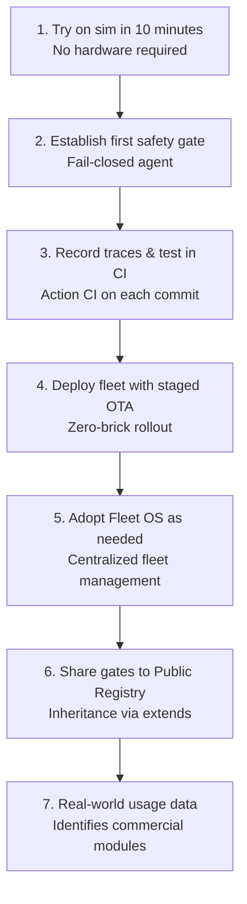

# 16 · Hệ sinh thái (C4 system landscape)

> **Phạm vi:** góc nhìn toàn cảnh hệ sinh thái (C4 system landscape) — mọi bên tham gia, tài sản dùng chung, nền tảng phân phối và vận hành, cùng các dòng chảy giá trị giữa chúng ở hiện trạng và quy hoạch tương lai. **Nguồn:** [`neuroedge-proposal.md`](../../../roadmap/neuroedge-proposal.md) §1.5, §1.6, §1.7, §6, §8.4–§8.9, §9; [`neuroedge-roadmap.md`](../../../roadmap/neuroedge-roadmap.md) §4.3.3 (I2c), §6.2 (I10), §7.3 (I13), §7.8 (I18), §8; [`neuroedge-prd.md`](../../../roadmap/neuroedge-prd.md) §1.4, §1.5 (P-3, P-5), §2.1 (U1–U7), §3, §7.3 (FR-EXT), §14, §15 (Q-11, Q-13, Q-32..Q-38, Q-45, Q-67); [`neuroedge-design-phase2.md`](../../../roadmap/neuroedge-design-phase2.md) §9; [`neuroedge-design-open-platform.md`](../../../roadmap/neuroedge-design-open-platform.md); [`thi-truong-tich-hop-2026-10-04.md`](../../reports/thi-truong-tich-hop-2026-10-04.md); [`LICENSING.md`](../../../LICENSING.md); [`TODOS.md`](../../../TODOS.md) #32, #33. Quy ước nhãn `done` / `partial` / `planned`: [`README.md`](../README.md).

**Đọc chương này để làm gì:** Chương này dành cho mọi bên tham gia hệ sinh thái NeuroEdge — từ lập trình viên độc lập (maker), kỹ sư nhúng, đối tác OEM, người vận hành đội thiết bị, chuyên gia kiểm toán an toàn, tác giả plugin bên thứ ba cho đến nhà đầu tư và đối tác thương mại. Tài liệu trả lời các câu hỏi kiến trúc cốt lõi: Toàn bộ hệ sinh thái NeuroEdge gồm những bên nào? Những loại tài sản nào được chia sẻ và bảo vệ? Các nền tảng nào luân chuyển những tài sản đó? Dòng giá trị tuần hoàn thế nào giữa cộng đồng và doanh nghiệp? Và ranh giới giữa lõi source-available (miễn phí cho mục đích phi thương mại, doanh nghiệp cần license thương mại — Q-45) với dịch vụ thương mại Fleet OS nằm ở đâu?

- **Đọc trước:** [`00`](00-overview.md) (tổng quan hệ thống), [`01`](01-context-c4l1.md) (bối cảnh C4 L1) và [`07`](07-data-contracts.md) (hợp đồng dữ liệu).
- **Đọc sau:** [`13`](13-evolution-i0-i18.md) (tiến hóa I0–I18) và các mục thiết kế kiến trúc đích tương ứng tại [`15`](15-target-architecture.md) (§3.1 Fleet OS, §3.2 Registry, §3.4 ranh giới lõi ↔ thương mại, §4.1 bộ port kit, §4.5 hệ sinh thái thiết bị).

## 1. Bức tranh

*Hình E-11 — Các bên, tài sản dùng chung và nền tảng; nét đứt là planned. Sinh bởi scripts/gen_architecture_diagrams.py.*

**Cách đọc sơ đồ E-11:** Hình E-11 phác họa toàn bộ các đối tượng tham gia xung quanh các nền tảng phân phối và vận hành trung tâm. Hình có bốn cột: các bên (PRD §2.1), lõi source-available và chuẩn mở Apache-2.0, tài sản dùng chung (§3) và nền tảng (§4). Đường nét liền (solid) biểu thị các tương tác đã hiện thực và vận hành trên mã nguồn hiện tại (`done`); đường nét đứt (dashed) biểu thị các tương tác theo kế hoạch mở rộng (`planned`). Thông điệp cốt lõi độc giả cần ghi nhớ: Lõi an toàn NeuroEdge đóng vai trò trung tâm cưỡng chế mọi lệnh điều khiển phần cứng vật lý, độc lập hoàn toàn với việc tài sản đến từ đâu. Các thiết kế to-be chi tiết được quy hoạch tại [`15`](15-target-architecture.md) (§3.1 Fleet OS, §3.2 Registry, §3.4 ranh giới lõi ↔ dịch vụ thương mại, §4.1 bộ port kit, §4.5 hệ sinh thái thiết bị).

Sơ đồ dưới đây thể hiện chi tiết các luồng tài sản dùng chung luân chuyển giữa các bên và các nền tảng:

```mermaid
flowchart TD
    subgraph Parties["Ecosystem Parties"]
        DEV["Maker / App Developer (U1, U2)"]
        OEM["OEM Partner (U5)"]
        PORTER["Community Porter (U5 / tier 3)"]
        QA["Safety Reviewer / QA (U4)"]
        FLEET_OP["Fleet Operator (U3)"]
        ROBOT["Robot Integrator (U6)"]
        PLUG["Plug-in Author, third party (U7)"]
        PROVIDERS["Model / Speech Providers"]
    end

    subgraph Platforms["Platforms & Distribution"]
        REPO["Public source repo (done) · schema URLs (planned I6)"]
        PYPI["PyPI Package (planned I6)"]
        IDX["Community Plug-in Index (planned I2c)"]
        REG["Gate Registry (planned I10)"]
        FLT["Fleet OS (planned I9)"]
        MKT["Marketplace (planned Block 5)"]
        AURA["AURA Vertical App (planned Block 4)"]
    end

    %% Today flows (solid)
    DEV -->|"reads schemas & specs"| REPO
    OEM -->|"declares board capability (board.toml)"| REPO
    OEM -->|"runs compliance vectors"| REPO
    QA -->|"audits gates & trace replays"| REPO
    PROVIDERS -->|"OpenAI-compatible & decision endpoints"| DEV

    %% Planned flows (dashed)
    DEV -.->|"installs SDK & CLI (planned I6)"| PYPI
    DEV -.->|"publishes & inherits gates (planned I10)"| REG
    DEV -.->|"shares provider adapters (planned I10)"| REG
    DEV -.->|"packages agents (planned I10)"| REG
    DEV -.->|"connects devices & syncs incident traces (planned I9)"| FLT

    PORTER -.->|"downloads port kit (planned I13) & compliance vectors"| REPO
    PORTER -.->|"submits HAL ports & board profiles (planned I18)"| REG

    QA -.->|"verifies signed gates (planned I10)"| REG

    FLEET_OP -.->|"deploys staged OTA & remote config (planned I9)"| FLT
    FLEET_OP -.->|"analyzes incident traces (planned I9)"| FLT

    ROBOT -.->|"builds node firmware and ROS 2 bridge (planned I14)"| REPO

    PLUG -.->|"reads public SDK docs & runs compliance suite (planned I2c)"| REPO
    PLUG -.->|"publishes plug-ins with conformance result (planned I2c)"| IDX
    DEV -.->|"searches & installs plug-ins (planned I2c)"| IDX

    REG -.->|"curates verified assets (planned Block 5)"| MKT
    AURA -.->|"consumes core SDK & reference gates (planned Block 4)"| REPO
    AURA -.->|"contributes real-world proven gates (planned Block 4)"| REG
```

**Cách đọc sơ đồ luồng:** Các ô thuộc nhóm Parties là các chủ thể sáng tạo hoặc thụ hưởng giá trị; các ô thuộc nhóm Platforms là các kênh phân phối mã, dữ liệu và điều phối vận hành. Đường nét liền chỉ áp dụng cho những luồng công việc đang chạy thực tế hôm nay trên kho mã nguồn và môi trường mô phỏng (`sim`/`linux`). Các luồng nét đứt là quy hoạch: I2c, I6, I9, I10, I13, I14, I18, cùng Khối 4 (AURA) và Khối 5 (Marketplace) nằm ngoài roadmap. Ba luồng của I2c: tác giả plugin (U7) đọc tài liệu công khai và chạy bộ test tuân thủ, đưa plugin lên index cộng đồng; người dùng tìm và cài plugin từ đó — index này không phải Marketplace (PRD §14). Điểm cốt lõi: Mọi tài sản mở rộng (gate, adapter, bản port, plugin) đều phải qua cổng kiểm định trước khi được triển khai lên thiết bị thật.

## 2. Các bên tham gia

Bảng đối chiếu từng bên tham gia, sản phẩm xây dựng hoặc sử dụng, giá trị nhận được và phương thức NeuroEdge phục vụ từ hiện tại đến tương lai (gắn với mã người dùng `U1`–`U7` tại [`neuroedge-prd.md`](../../../roadmap/neuroedge-prd.md) §2.1):

| Bên tham gia | Xây dựng hoặc sử dụng | Giá trị nhận được | Cách NeuroEdge phục vụ: Hôm nay → Quy hoạch |
|:---|:---|:---|:---|
| **Maker & Kỹ sư sáng chế độc lập** (`U1`) | Xây dựng agent đầu tiên (`agent.toml`, action, gate YAML); dùng môi trường mô phỏng (`sim`) hoặc bo mạch cá nhân | Trải nghiệm dưới 10 phút (TTFV < 10'), không rào cản tài khoản, không cần mua trước phần cứng; cơ chế *fail-closed* (mặc định chặn khi lỗi hoặc bất định) bảo vệ an toàn cho cơ cấu chấp hành | **Hôm nay (`done`):** Thư viện mã nguồn `neuroedge`, CLI (`new`, `run`, `test`, `record`, `replay`), target `sim` và `linux` (`gpio-sim`), QEMU cho `esp32s3`. → **Quy hoạch (`planned`):** Cài đặt một lệnh qua PyPI (I6, [`neuroedge-roadmap.md`](../../../roadmap/neuroedge-roadmap.md) §4.7); kho gate mẫu phong phú trên Registry (I10). |
| **Trưởng nhóm kỹ thuật nhúng / App Developer** (`U2`) | Phát triển sản phẩm thương mại; cấu hình gate, kết nối cảm biến/actuator; chạy Action CI trong quy trình CI/CD | Tự động hóa kiểm thử an toàn trước khi nạp chip; chuyển đổi bo mạch không viết lại logic nghiệp vụ (nguyên tắc P-2); tái sử dụng chính sách an toàn đã kiểm chứng | **Hôm nay (`done`):** Bộ kiểm thử Action CI, bảng sự thật gate, corpus phản chứng khép kín hai chiều, target tương đương Python/C. → **Quy hoạch (`planned`):** Kéo gate qua `gate add` từ Gate Registry có ký số (I10, [`15`](15-target-architecture.md) §3.2); ghim `extends` bằng digest JCS SHA-256 (TSK-S3-21); mua license thương mại cho doanh nghiệp (Q-45). |
| **Kỹ sư vận hành đội thiết bị (Fleet Operator)** (`U3`) | Quản lý, giám sát và cập nhật phần mềm cho đội 100–10.000 thiết bị ngoài hiện trường | Cập nhật OTA theo đợt kiểu *canary* (triển khai tăng dần 1% → 10% → 100%) chống rủi ro làm brick hàng loạt; cập nhật gate từ xa không nạp lại firmware; chẩn đoán sự cố từ xa qua vết ghi tải về máy cá nhân (MTTR < 10 phút) | **Hôm nay (`partial`):** OTA cấp thiết bị phân vùng kép A/B có ký và rollback trên QEMU (`targets/esp32s3/components/ne_ota/`); vết ghi JSON cục bộ. → **Quy hoạch (`planned`):** Tầng dịch vụ thương mại **Fleet OS** (I9, [`15`](15-target-architecture.md) §3.1) tích hợp Eclipse Hawkbit điều phối canary, broker MQTT cho viễn trắc/cấu hình từ xa, kho lưu trữ và phân tích trace sự cố tập trung (FR-FLT-01..06, TSK-K2-04..09). |
| **Chuyên gia an toàn & QA (Safety Reviewer)** (`U4`) | Thẩm định, phê duyệt điều kiện gate; điều tra vết ghi sự cố và đối soát tuân thủ | Đọc và hiểu được chính sách an toàn dạng YAML mà không cần đọc mã nguồn; bảo đảm tính bất biến (kế thừa chỉ siết chặt); tái hiện lỗi tất định từ vết ghi | **Hôm nay (`done`):** Lệnh CLI `neuroedge gate lint`, `gate explain`, `trace validate`, `trace view`, `replay`. → **Quy hoạch (`planned`):** Kiểm tra chữ ký số mật mã OCI/ORAS trên gate và vết ghi (TSK-W2-04, I10); hiển thị trạng thái tuân thủ của adapter đang chạy trên đội thiết bị (TSK-P2-02, I18). |
| **Đối tác sản xuất phần cứng (OEM / ODM)** (`U5`) | Sản xuất bo mạch, mô-đun phần cứng; khai báo hồ sơ năng lực bo mạch (`board.toml`); phong bì an toàn theo chân `done` trên `sim` và `linux` (RFC-0007, I2a), còn `esp32s3` ở I3a | Đưa phần cứng vào hệ sinh thái agent mà không bị khóa vào một dòng chip; chuẩn hóa năng lực chấp hành | **Hôm nay (`partial`):** Lược đồ `board.v1.json` (có khối phong bì và nguyên thủy mở rộng), bốn profile bo tham chiếu cho ba target bậc 1 (`boards/sim-default.toml`, `sim-rpi5.toml`, `linux-rpi5.toml`, `esp32s3-box-3.toml`), hướng dẫn port ([`11`](11-hal-port-guide.md)). → **Quy hoạch (`planned`):** Mở enum `target` theo *phân tầng bậc (tier)* qua RFC-0002 — đã ký 2026-10-04, phần mã chuyển vào I2c ([`neuroedge-roadmap.md`](../../../roadmap/neuroedge-roadmap.md) §4.3.3; I11 đã gộp vào I2c, Q-67); công cụ `neuroedge board validate` và `board show` (TSK-V1a-05); `--board <đường dẫn>` cho bo cộng đồng ngoài kho, tự chứng nhận, không bao giờ là bo tham chiếu (TSK-I2c-05). |
| **Người port phần cứng cộng đồng (Community Porter)** (`U5` / bậc 3) | Viết bản port HAL C/Python cho các vi điều khiển hoặc SBC mới ngoài bậc 1/2 (STM32, RP2350… — lưu ý RP2350 làm node robot phân tầng do đội lõi port theo Q-33, bản port bậc 3 chung do cộng đồng) | Bộ công cụ port độc lập ngôn ngữ, tài liệu đầy đủ, quy trình tự kiểm chứng minh bạch để được công nhận bậc 3 mà không cần đội lõi can thiệp | **Hôm nay (`partial`):** Hợp đồng 5 nguyên thủy HAL cơ sở ([`11`](11-hal-port-guide.md) §2); lõi C99 độc lập framework. → **Quy hoạch (`planned`):** Bộ port kit cộng đồng (Khối P1, I13, [`15`](15-target-architecture.md) §4.1) gồm `fixtures/compliance/portable/` (TSK-P1-01), khung mẫu `targets/_template/` (TSK-P1-03), lệnh `neuroedge board check` (TSK-P1-05), kho chia sẻ HAL port trên Registry (TSK-P2-01, I18), chứng nhận tự kiểm miễn phí (TSK-P2-03). |
| **Đội tích hợp robot phân tầng (Robot Integrator)** (`U6`) | Tích hợp robot di động/cánh tay gồm một SBC não (Pi 5) và nhiều vi điều khiển chấp hành (ESP32-S3, RP2350) kết nối ROS 2/Nav2 | Mọi lệnh vận tốc và chuyển động đều qua gate tại từng node cục bộ; dùng *token thuê có hạn (lease token)* để tự dừng nếu mất liên lạc; cơ cấu tự về trạng thái an toàn (fail-closed, Q-35) | **Hôm nay (`planned`):** Thiết kế kiến trúc tại `draft-ke-hoach-mo-rong-robot-fofoca.md` và `draft-rfc-node-giao-thuc-dieu-phoi.md`. → **Quy hoạch (`planned`):** Increment I14 ([`15`](15-target-architecture.md) §4.3) với wire Zenoh-pico làm *kênh black channel* (kênh truyền không tin cậy, Q-36), nguyên thủy `motion.*` và token thuê có hạn (Q-37), RFC-node (TSK-W3-02), vết ghi hợp nhất đa node (TSK-W3-04), cầu ROS 2/Nav2 xét gate mọi lệnh tốc độ (Q-34, TSK-W4-01), node RP2350 do đội lõi port (Q-33, TSK-W3-07). |
| **Tác giả plugin bên thứ ba (Plug-in Author)** (`U7`) | Hãng thiết bị AI mới, cộng đồng của một hệ sinh thái (Muse Gadgets, Home Assistant, xiaozhi…) hay maker viết cầu nối cho sản phẩm mình đang dùng; viết plugin ở kho riêng, theo giấy phép của mình | Tự nối sản phẩm của mình với lớp an toàn chỉ qua tài liệu công khai, không sửa lõi, không chờ đội lõi; tự chứng minh đúng bằng bộ test tuân thủ (Q-67) | **Hôm nay (`planned`):** chưa có điểm cắm nào dành cho nhóm này — hợp đồng đã mở (lược đồ, đặc tả và corpus tuân thủ theo Apache-2.0) và điểm cắm duy nhất đang mở là provider mô hình (`python:pkg.mod:factory`, FR-MDL-08). → **Quy hoạch (`planned`):** I2c ([`neuroedge-roadmap.md`](../../../roadmap/neuroedge-roadmap.md) §4.3.3, [`neuroedge-design-open-platform.md`](../../../roadmap/neuroedge-design-open-platform.md)): `neuroedge.guard`, Extension SDK `neuroedge.sdk` với sáu loại điểm cắm, `neuroedge conformance`, `proxy mcp` và `proxy http`, `plugin search/install` trên index cộng đồng; bài kiểm A13 là bridge `neuroedge-muse` (TSK-I2c-17). |
| **Nhà cung cấp mô hình AI & giọng nói (Model / Speech Providers)** (Bên ngoài) | Cung cấp dịch vụ suy luận LLM (System 2), System One (Jev), ASR và TTS | Khách hàng NeuroEdge kết nối trực tiếp, tự trả tiền token/suy luận cho nhà cung cấp (NeuroEdge không bán lại token, PRD §1.4 N4) | **Hôm nay (`done`):** Giao diện *FactSource* (nguồn dữ kiện chỉ cung cấp quan sát, không cấp ALLOW), tích hợp chuẩn OpenAI API (`models/providers/openai_chat.py`, `perception/providers/openai_audio.py`), System One API trên OpenRouter (`systemone_api.py`), thư viện LiteLLM (`litellm_provider.py`, Q-10). → **Quy hoạch (`planned`):** Lớp trừu tượng provider hoàn chỉnh cho đội thiết bị (FR-GW, v1.1, TSK-K2-01..03); kho chia sẻ adapter provider do cộng đồng đóng góp (TSK-K3-06, I10). |

## 3. Tài sản dùng chung

Bảng kê khai toàn bộ tài sản dữ liệu và mã nguồn luân chuyển giữa các bên trong hệ sinh thái:

| Tài sản dùng chung | Hợp đồng định nghĩa | Cách chia sẻ hôm nay | Cách chia sẻ trong tương lai (Registry, ký số, ghim digest) | Giấy phép của tài sản (Q-45, Q-11) |
|:---|:---|:---|:---|:---|
| **Gate an toàn** (`gate.v1`) | [`07`](07-data-contracts.md) §2, [`schemas/gate.v1.json`](../../../schemas/gate.v1.json), RFC-0001, RFC-0004, RFC-0005, RFC-0006 | Đã có bản cục bộ: phân giải từ `gates/`, digest RFC 8785 + SHA-256; chưa ký, chưa tải từ xa (`python/neuroedge/cli/main.py`) | Ký, tải từ Gate Registry (I10); ký số mật mã theo chuẩn *OCI (Open Container Initiative)* và kiểm tra chữ ký trên thiết bị (TSK-W2-04); ghim kế thừa bằng digest JCS SHA-256 qua cú pháp `@<ver>#sha256:...` (TSK-S3-21) | Định dạng và lược đồ theo **Apache-2.0** (Q-45). Các tệp trong `gates/` của kho theo PolyForm Noncommercial 1.0.0 ([`LICENSING.md`](../../../LICENSING.md)); giấy phép của gate bên thứ ba: **chưa có nguồn** |
| **Adapter kết nối provider** (`python:`) | Giao thức `FactSource` / `Provider` ([`03`](03-component-host-c4l3.md) §3.4), đặc tả [`docs/spec/tool_calling.md`](../../spec/tool_calling.md), cấu hình `agent.toml` | Mã nguồn Python trong kho (`neuroedge.models.providers`), adapter nạp qua `provider = "python:pkg.mod:factory"` (import module Python) | Kho chia sẻ adapter dùng chung hạ tầng Registry OCI (TSK-K3-06, I10; TSK-P2-01, I18); chạy qua sandbox phân quyền (TSK-K3-05) và bộ kiểm thử tuân thủ; hiển thị trạng thái tuân thủ trên Fleet Dashboard (TSK-P2-02) | Tác giả giữ nguyên bản quyền và tự chọn giấy phép (proposal §6.4); nếu tích hợp vào gói phân phối phải nằm trong allowlist Q-11 (MIT, BSD, Apache-2.0, ISC, PSF, CNRI-Python, MPL-2.0, Zlib, CC0-1.0; cấm GPL, SSPL, BSL) |
| **Bản port HAL + Hồ sơ bo mạch** (HAL port + `board.toml`) | [`07`](07-data-contracts.md) §4, [`schemas/board.v1.json`](../../../schemas/board.v1.json), hợp đồng 5 nguyên thủy HAL ([`11`](11-hal-port-guide.md) §2), RFC-0002 | Mã C/Python trong cây thư mục `python/neuroedge/hal/` và `targets/esp32s3/`, tệp cấu hình trong `boards/*.toml` | Bộ port kit độc lập (TSK-P1-01..05, I13); kho HAL port do cộng đồng đóng góp trên hạ tầng Registry (TSK-P2-01, I18); tự kiểm chứng bằng `neuroedge board check` và công bố kết quả tự chứng nhận miễn phí (TSK-P2-03) | Tác giả bản port giữ nguyên bản quyền và tự chọn giấy phép (proposal §6.4, `LICENSING.md` dẫn `NOTICE`); tuân thủ allowlist Q-11 nếu đóng gói cùng mã nguồn lõi |
| **Plugin của bên thứ ba** (bridge, fact source, actuator, board, template, exporter) | RFC-0016 (Extension SDK `neuroedge.sdk`), RFC-0017 (`source` theo không gian tên), RFC-0018 (cơ cấu chấp hành từ xa) — bản nháp; [`neuroedge-design-open-platform.md`](../../../roadmap/neuroedge-design-open-platform.md) §4 | Chưa có: điểm cắm duy nhất đang mở là provider mô hình (`python:`) | Package Python ở kho của tác giả, khai qua entry points, chỉ nạp khi người vận hành bật rõ; `neuroedge conformance <package>` cho kết quả máy đọc được; tìm và cài bằng `neuroedge plugin search/install` từ index cộng đồng (I2c). Plugin là mã thực thi chạy trong tiến trình, người vận hành tin (NFR-SEC-10); an toàn vẫn do lõi giữ — bridge không có handle HAL, actuator chỉ lái sau token và phong bì (FR-EXT-03) | Mã plugin ở kho của tác giả, **theo giấy phép của tác giả**; NeuroEdge không đòi bản quyền (Q-67, [`LICENSING.md`](../../../LICENSING.md)). Việc *dùng* chung runtime vẫn theo điều khoản của runtime |
| **Agent hoàn chỉnh** (`agent.toml` + logic) | [`07`](07-data-contracts.md) §3 (`agent.toml`), cấu trúc thư mục agent (actions, gates, prompts), *manifest (tệp đặc tả gói)* (TSK-K3-03) | Dự án mẫu trong kho (`fixtures/agents/home-voice/`, `python/neuroedge/templates/`), phân phối qua repo git | Đóng gói theo manifest chuẩn SemVer (`schemas/manifest.v1.json` quy hoạch, TSK-K3-03, I10), phân phối qua OCI Registry kèm định danh ổn định (TSK-K3-01); tương lai giao dịch qua Marketplace (Khối 5) | Chưa có nguồn cho agent bên thứ ba; agent mẫu trong kho theo PolyForm Noncommercial 1.0.0 (Q-45), trừ `fixtures/agents/` mà corpus tuân thủ dùng: Apache-2.0 (Q-67) |
| **Vết ghi thực thi** (`trace.v1`) | [`07`](07-data-contracts.md) §7, [`schemas/trace.v1.json`](../../../schemas/trace.v1.json), RFC-0008 (mang `gate_digest`) | Tệp JSON cục bộ (`traces/*.json`, `fixtures/traces/`), đối soát qua CI Action CI | Thiết bị tự động đẩy vết sự cố lên kho tập trung của Fleet OS qua WebSocket/MQTT (FR-FLT-05, TSK-K2-08, I9); ký số mật mã trace (TSK-W2-04, `TODOS.md` #1); vết hợp nhất đa node (TSK-W3-04, I14) | Lược đồ theo **Apache-2.0** (Q-45). Dữ liệu vết ghi chỉ ghi quyết định, không dữ liệu thô (NFR-PRIV-03, Q-6) |
| **Bộ vector tuân thủ** (Compliance Vectors) | [`docs/spec/voice_fsm.md`](../../spec/voice_fsm.md) §9, [`docs/spec/tool_calling.md`](../../spec/tool_calling.md) §9, bảng sự thật gate | Thư mục `fixtures/compliance/voice/`, `fixtures/tool_calls/`, `fixtures/contracts/`, `fixtures/traces/` chạy trong pytest; chỉ có `fixtures/traces/` chạy trên cả QEMU | Đóng gói thành bộ kiểm thử độc lập ngôn ngữ chạy được ngoài repo (`fixtures/compliance/portable/`, TSK-P1-01, I13); bộ corpus tự kiểm chứng "NeuroEdge-gated" cho runtime bên thứ ba (TSK-P2-06, đã chuyển sang I2c) | `fixtures/compliance/`, `fixtures/tool_calls/`, `fixtures/contracts/`, `fixtures/traces/` và `fixtures/agents/` mà corpus dùng: **Apache-2.0** (Q-45, Q-67; [`LICENSING.md`](../../../LICENSING.md)) |
| **Lược đồ dữ liệu chuẩn** (Schemas) | bảy lược đồ trong `schemas/` — `gate.v1`, `trace.v1`, `board.v1`, `tool-call.v1`, `tool-result.v1`, `error.v1`, `error-codes.v1` (RFC-0015) — và `manifest.v1.json` (quy hoạch, TSK-K3-03, I10) | Tệp JSON Schema tại thư mục `schemas/` trong kho git | Xuất bản ở URL công khai chính thức (`https://schema.neuroedge.dev/...`) tại I6 (Q-39); đăng ký SchemaStore công cộng toàn cầu (FR-TRC-10) để IDE nhận diện tự động; cam kết chuyển giao quản trị cho tổ chức trung lập tại G1 (proposal §1.5) | **Apache-2.0** (Q-45, [`LICENSING.md`](../../../LICENSING.md)) |

## 4. Nền tảng

Hệ sinh thái vận hành dựa trên các nền tảng và kênh phân phối sau (mỗi dòng nêu rõ bản chất và lý do vì sao cần thiết):

| Nền tảng | Bản chất & Vì sao cần thiết trong hệ sinh thái | Trạng thái | Increment | Chi tiết kiến trúc tương lai |
|:---|:---|:---:|:---:|:---|
| **Kho mã nguồn & Lược đồ công khai (Source Repo & Schemas URL)** | Kho mã nguồn công khai (source-available, Q-45) và điểm xuất bản tài liệu; cần thiết để minh bạch hóa đặc tả, tiếp nhận RFC và phân phối chuẩn công nghiệp | `partial` | I6 | Đã mở public từ 2026-09-25 (Q-45); URL `schema.neuroedge.dev` ở I6 (TSK-I6-02, [`neuroedge-roadmap.md`](../../../roadmap/neuroedge-roadmap.md) §4.7); đăng ký SchemaStore ở I7 (TSK-S6-07, FR-TRC-10) |
| **Gói phân phối PyPI (`neuroedge`)** | Kênh phân phối thư viện Python chính thức; cần thiết để lập trình viên cài đặt SDK và CLI trong một dòng lệnh không ma sát (`pip install neuroedge`) | `planned` | I6 | Hoàn tất khi đạt demo thoại trên cả ba môi trường bậc 1 ([`neuroedge-roadmap.md`](../../../roadmap/neuroedge-roadmap.md) §4.7, Q-39) |
| **Extension SDK (`neuroedge.sdk`) và bộ test tuân thủ plugin** | Điểm cắm có phiên bản và cam kết ổn định riêng, chặt hơn `0.x` của gói: sáu loại (bridge, fact source, actuator, board, template, exporter) nạp qua entry points, `neuroedge conformance <package>` cho kết quả máy đọc được; cần thiết để bên thứ ba tự nối NeuroEdge với sản phẩm mới mà không sửa lõi | `planned` | I2c | RFC-0016 → RFC-0018 (bản nháp); [`neuroedge-roadmap.md`](../../../roadmap/neuroedge-roadmap.md) §4.3.3; [`neuroedge-design-open-platform.md`](../../../roadmap/neuroedge-design-open-platform.md) §3, §4 |
| **Index cộng đồng của plugin (Community Plug-in Index)** | Kho index riêng (Apache-2.0) cho `neuroedge plugin search/install`, hiện kết quả tuân thủ; huy hiệu "NeuroEdge-gated" chỉ cấp khi plugin đạt bộ test tuân thủ. **Không phải Marketplace:** không thu phí, không xếp hạng trả tiền, không bảo chứng (PRD §14, FR-EXT-08); cần thiết để tìm và cài plugin mà không chờ đội lõi | `planned` | I2c | TSK-I2c-18 ([`neuroedge-roadmap.md`](../../../roadmap/neuroedge-roadmap.md) §4.3.3); kho index nằm ngoài kho này |
| **Hệ điều hành quản trị đội thiết bị (Fleet OS)** | Dịch vụ thương mại duy nhất của Khối 2: quản trị vòng đời thiết bị, staged OTA (Eclipse Hawkbit), viễn trắc/cấu hình từ xa qua MQTT và FastAPI WebSockets, kho lưu trữ và phân tích trace sự cố; cần thiết để quản trị thiết bị quy mô lớn mà không làm brick máy | `planned` | I9 | Xem [`15`](15-target-architecture.md) §3.1 (proposal §6.2; roadmap §6.1) |
| **Kho Gate Registry & Các đường ray nền tảng (Gate Registry)** | Hạ tầng OCI Registry (CNCF ORAS/Harbor) miễn phí lưu trữ, chia sẻ và ghim gate an toàn, adapter kết nối provider; quản lý định danh ổn định, đo lường (OpenMeter) và sandbox phân quyền; cần thiết để tạo hiệu ứng mạng chia sẻ an toàn | `planned` | I10 | Xem [`15`](15-target-architecture.md) §3.2 (proposal §8.5; roadmap §6.2) |
| **Bộ port kit cộng đồng (Community Port Kit)** | Bộ tài liệu, khung mẫu và bộ vector tuân thủ đóng gói độc lập; cần thiết để người ngoài tự đưa NeuroEdge lên vi điều khiển mới (bậc 3) mà không cần đội lõi can thiệp | `planned` | I13 | Xem [`15`](15-target-architecture.md) §4.1 (phase 2 §9.1; roadmap §7.3) |
| **Hệ sinh thái thiết bị (I18)** | Kho chia sẻ adapter và bản port HAL cộng đồng cùng hiển thị trạng thái tuân thủ trên Fleet Dashboard (quy trình chứng nhận tự kiểm "NeuroEdge-gated" đã kéo lên I2c, Q-67); cần thiết để mở rộng độ phủ phần cứng an toàn | `planned` | I18 | Xem [`15`](15-target-architecture.md) §4.5 (phase 2 §9.2; roadmap §7.8) |
| **Sàn giao dịch thương mại (Marketplace)** | Sàn giao dịch thương mại có thu phí (Khối 5) cho các gate chuyên ngành đã qua thực địa, wake-word tùy biến, bo mạch chứng nhận và dịch vụ chuyên gia; thiết kế thanh toán: chưa có nguồn; cần thiết để thương mại hóa các tài sản có giá trị cao | `planned` | Khối 5 (ngoài roadmap) | Chặn tại PRD §14; chỉ kích hoạt khi đạt đủ 4 cột mốc định lượng G1–G4 (proposal §8.7, §8.8) |
| **Ứng dụng dọc AURA (AURA Vertical App)** | Ứng dụng mẫu trọn gói (full-stack vertical app) cho khách sạn & nghỉ dưỡng (Khối 4), dùng 100% API công khai; cần thiết để chứng minh tính khả thi thực địa, tạo nguồn gate thực tế và tạo dòng doanh thu dự án sớm | `planned` | Khối 4 (ngoài roadmap) | Triển khai sau Developer Beta (I8), khi API ổn định và có đối tác thực tế (proposal §7, §8.6; PRD §3.1) |

## 5. Vòng lặp giá trị

Vòng lặp giá trị và hiệu ứng mạng từ chia sẻ cấu hình an toàn gồm đúng 7 bước tuần tự không rẽ nhánh ngược, theo đúng [`neuroedge-proposal.md`](../../../roadmap/neuroedge-proposal.md) §1.7:

**Cách đọc sơ đồ vòng lặp:** Quy trình gồm 7 bước đi thẳng từ trải nghiệm cá nhân của lập trình viên (bước 1) tới khi tạo ra dữ liệu thị trường thực tế (bước 7). Không có mũi tên quay lại (proposal §1.7). Proposal chỉ nêu hai điểm then chốt: bước 2 và 3 tạo khác biệt kỹ thuật; bước 6 tạo hiệu ứng mạng trước khi mở Marketplace (Marketplace chỉ mở sau G1–G4, proposal §8.7–§8.8).

### Phân công nền tảng và hiện trạng từng bước

| Bước trong vòng lặp | Nền tảng đảm nhiệm | Hiện trạng | Ghi chú kỹ thuật |
|:---|:---|:---:|:---|
| **1. Thử trên `sim` trong 10 phút** | Gói `neuroedge` (CLI, `SimHAL`) | `partial` | Chạy thử agent trong môi trường mô phỏng sau 10 phút, không cần mua phần cứng; TTFV < 10 phút chưa đo — TSK-I1-02 tạm hoãn |
| **2. Viết gate đầu tiên** | Engine gate lõi (`gate.v1`) | `done` | Thiết lập gate an toàn đầu tiên — agent tự động từ chối tác vụ nguy hiểm (fail-closed) |
| **3. Ghi vết + Action CI** | Action CI (`EventLog`, `TraceRecorder`, `replay`) | `done` | Ghi nhật ký chạy thực tế trên bo mạch (tệp JSON), tự động kiểm thử trong CI mỗi commit |
| **4. Triển khai đội thiết bị với OTA theo đợt** | OTA Agent cấp thiết bị → Fleet Rollout Engine | `partial` | Triển khai đội thiết bị (10 ➔ 100 ➔ 1.000 máy), cập nhật OTA theo đợt an toàn tuyệt đối; cấp thiết bị A/B OTA có ký chạy trên QEMU (`targets/esp32s3/components/ne_ota/`), điều phối theo đợt thuộc Fleet OS (I9) |
| **5. Dùng Fleet OS khi cần** | **Fleet OS** (Hawkbit + MQTT + FastAPI WebSockets) | `planned` (I9) | Sử dụng gói quản trị tập trung (Fleet Management OS) theo nhu cầu thực tế; giám sát sức khỏe, kho vết sự cố, cập nhật gate từ xa |
| **6. Chia sẻ gate qua Public Registry bằng `extends`** | **Gate Registry** (OCI/ORAS) | `planned` (I10) | Chia sẻ các gate an toàn đã hoàn thiện lên Public Registry (kế thừa qua `extends`) |
| **7. Nhận diện nhu cầu thương mại qua dữ liệu sử dụng** | Hệ đo lường OpenMeter & Registry analytics | `planned` (I10) | Dữ liệu sử dụng gate thực tế giúp xác định chính xác các mô-đun có nhu cầu thương mại cao |

> [!NOTE]
> Sàn giao dịch thương mại (Marketplace, Khối 5) chỉ được kích hoạt sau khi hệ sinh thái vượt qua toàn bộ 4 cột mốc kiểm chứng thị trường định lượng G1–G4 ([`neuroedge-proposal.md`](../../../roadmap/neuroedge-proposal.md) §8.7–§8.8).

### Hai điểm then chốt và tính chất hai loại tài sản chia sẻ

Theo [`neuroedge-proposal.md`](../../../roadmap/neuroedge-proposal.md) §1.7:
1. **Bước 2 và 3 tạo ra giá trị kỹ thuật khác biệt mà các giải pháp khác chưa đáp ứng được (proposal §1.7):** Hợp đồng an toàn được kiểm thử trong CI trước khi nạp chip.
2. **Bước 6 tạo ra hiệu ứng mạng tự nhiên trước khi mở Marketplace thương mại:** Gate an toàn là tài nguyên lý tưởng để chia sẻ: dung lượng nhẹ (tệp YAML), minh bạch, không rủi ro pháp lý, và giúp nâng cao tiêu chuẩn an toàn cho toàn bộ cộng đồng sử dụng.

**Khác biệt giữa chia sẻ Gate và chia sẻ Adapter/HAL Port:**
Từ Giai đoạn 2 (proposal §1.7, §8.9), cộng đồng còn chia sẻ *mã thực thi* — adapter kết nối provider và bản port HAL. Lập luận biện minh cho việc chia sẻ gate không chuyển sang được cho loại tài sản này:
- **Gate an toàn:** Dữ liệu khai báo YAML, chạy qua bộ phân giải đã cưỡng chế năm nguyên tắc kế thừa, rủi ro thấp. Cổng kiểm soát là `neuroedge gate lint`.
- **Adapter và HAL port:** Mã thực thi (Python, C/C++) chạy trực tiếp trên thiết bị có cơ cấu chấp hành vật lý, rủi ro cao. Cổng kiểm soát phải gồm **ba lớp**:
  1. *Bộ kiểm thử tuân thủ* (TSK-P1-01, I13) để tự chứng minh tương đương target;
  2. *Sandbox phân quyền* (TSK-K3-05, I10) để giới hạn truy cập chân actuator nhạy cảm;
  3. *Đối chiếu năng lực lúc build* (`neuroedge build`, TSK-S2-02, đã có) để chặn bất tương thích bo mạch.

Bất biến cốt lõi: Dù adapter hay bản port HAL đến từ đâu, **mọi lệnh tới cơ cấu chấp hành vẫn phải qua gate**, và gate vẫn chạy trong lõi do NeuroEdge kiểm soát. Một bản port sai có thể làm thiết bị không chạy; nó không thể làm thiết bị hành động khi gate nói không.

Từ Q-67, **plugin của bên thứ ba** (bridge, fact source, actuator, board, template, exporter — I2c, `planned`) là cùng loại tài sản mã thực thi: package Python ở kho của tác giả, theo giấy phép của tác giả, chạy trong tiến trình và là mã người vận hành tin (NFR-SEC-10). Cổng kiểm soát của nó là bộ test tuân thủ theo loại (`neuroedge conformance`) cùng các bất biến cấu trúc của FR-EXT-03; ký số plugin đi cùng registry (I10).

## 6. Chuẩn mở và quản trị

Chiến lược của NeuroEdge: mã nguồn công khai là kênh tiếp cận, định dạng là chuẩn mực công nghiệp ([`neuroedge-proposal.md`](../../../roadmap/neuroedge-proposal.md) §1.5).

### Chuẩn mở là gì

Theo quyết định **Q-45** ([`neuroedge-prd.md`](../../../roadmap/neuroedge-prd.md) §15, [`LICENSING.md`](../../../LICENSING.md)):
- Mã nguồn NeuroEdge (runtime Python, CLI, firmware, dịch vụ, công cụ, test) phát hành theo **PolyForm Noncommercial 1.0.0** (source-available); plugin và adapter của bên thứ ba ở kho của tác giả, theo giấy phép của tác giả (Q-67).
- Toàn bộ **chuẩn mở giữ nguyên giấy phép Apache-2.0**:
  - `schemas/`: bảy lược đồ `gate.v1`, `trace.v1`, `board.v1`, `tool-call.v1`, `tool-result.v1`, `error.v1`, `error-codes.v1` (RFC-0015), và `manifest.v1.json` (quy hoạch, TSK-K3-03, I10).
  - `docs/spec/` (toàn bộ thư mục): [`tool_calling.md`](../../spec/tool_calling.md), [`voice_fsm.md`](../../spec/voice_fsm.md), [`simulation_coverage.md`](../../spec/simulation_coverage.md), [`threat_model.md`](../../spec/threat_model.md), [`ui.md`](../../spec/ui.md), [`hal_mcu_review.md`](../../spec/hal_mcu_review.md).
  - `fixtures/compliance/`: bộ vector tuân thủ và corpus kiểm thử chuẩn tắc.
  - Corpus tuân thủ `fixtures/tool_calls/`, `fixtures/contracts/`, `fixtures/traces/` và `fixtures/agents/` mà corpus dùng (Q-67, [`LICENSING.md`](../../../LICENSING.md)).
Điều này bảo đảm bên thứ ba được tự do hiện thực chuẩn và chạy bộ kiểm tuân thủ mà không cần license thương mại của NeuroEdge.

### Quy trình thay đổi chuẩn (RFC và Semantic Versioning)

Mọi thay đổi đối với chuẩn mở đều phải tuân thủ quy trình RFC minh bạch và đóng băng theo [`CONTRIBUTING.md`](../../../CONTRIBUTING.md) §3:
- **Các thay đổi bắt buộc phải có RFC:**
  1. Sửa bất kỳ tệp nào trong `schemas/*.json`;
  2. Sửa ngữ nghĩa phân giải gate (`engine/gate_resolver.py`, `engine/constraints.py`);
  3. Sửa ba vết ghi chuẩn mực trong `fixtures/traces/*.json`;
  4. Sửa hoặc xóa gate đã khóa trong `digests.lock` (`gates/`, `fixtures/gates/valid/`, `fixtures/gates/registry/`);
  5. Đổi bố cục nhị phân `NETR` của cây trên thiết bị (tăng số phiên bản bố cục, RFC-0003).
- **Hiện trạng các RFC:**
  - RFC 0001 → RFC-0013: đã chấp thuận ([`docs/rfc/README.md`](../../rfc/README.md); 0003 thu hẹp; RFC-0002 ký 2026-10-04, phần mã chuyển vào I2c — Q-67). RFC-0007 và RFC-0009 → RFC-0013 là sáu RFC của I2a, chấp thuận 2026-10-01 (`digital.in`, I2C chỉ đọc, `analog.in` và trường phong bì trong `board.v1`, TSK-N0-03; tiêu chí `numeric`; PWM; `motion.*`; `vision.in`; nguyên thủy tuỳ chọn theo bo mạch — Q-53), hiện thực phần host trên `sim` và `linux`, còn `esp32s3` ở I3a. RFC-0008 đã chấp thuận và hiện thực (vết ghi chuẩn mực mang `gate_digest`; `verify` từ chối khi lệch, `replay` cảnh báo). RFC-0014 (dữ kiện từ tiến trình ngoài) đã chấp thuận, mã ở I2c (Q-67); RFC-0015 (hợp đồng cho người tích hợp) đã chấp thuận và hiện thực.
  - RFC-0016, RFC-0017, RFC-0018 (I2c, Q-67): bản nháp chờ chữ ký kỹ thuật trưởng — lõi dùng độc lập và Extension SDK; nguồn gọi theo không gian tên (`bridge:<id>`); cơ cấu chấp hành từ xa và mức tự tắt.
  - Các RFC quy hoạch chưa cấp số: RFC-node (giao thức điều phối đa node, TSK-W3-02), RFC-pin-extends (tên tạm; ghim `extends` theo digest, TSK-S3-21 — đã lên lịch ở I2c), RFC visual-evidence gate semantics (ngữ nghĩa bằng chứng thị giác trong gate, TSK-V3-04), RFC mobile-robot safety (tầng an toàn robot di động, TSK-W4-07).
- **Cam kết tương thích ngược:** Tuyệt đối tuân thủ SemVer 2.0; không phá vỡ tính tương thích ngược của các gate an toàn đã phát hành.

### Xuất bản Schema `$id` URL và tích hợp SchemaStore

- Lược đồ JSON Schema chuẩn được định danh bằng URI cố định:
  - `gate.v1`: `$id = "https://schema.neuroedge.dev/gate/v1.json"`
  - `board.v1`: `$id = "https://schema.neuroedge.dev/board/v1.json"`
  - `trace.v1`: `$id = "https://schema.neuroedge.dev/trace/v1.json"`
- Được đưa lên hosting công khai tại I6 (TSK-I6-02, chưa bắt đầu; [`neuroedge-roadmap.md`](../../../roadmap/neuroedge-roadmap.md) §4.7).
- **Đăng ký SchemaStore công cộng** (FR-TRC-10, proposal §3.7; TSK-S6-07, I7): Schema được đăng ký vào SchemaStore để VS Code và các IDE tự động nhận diện, hỗ trợ auto-complete và lint lỗi trực tiếp khi người dùng chỉnh sửa tệp gate/board/trace mà không cần cài đặt công cụ CLI của NeuroEdge.

### Cam kết chuyển giao quản trị cho tổ chức trung lập tại mốc G1

Trích dẫn chuẩn xác cam kết từ [`neuroedge-proposal.md`](../../../roadmap/neuroedge-proposal.md) §1.5:

> *"Khi đạt Cột mốc xác thực thị trường G1 (10.000 thiết bị active, cộng đồng nhà phát triển ổn định), NeuroEdge cam kết **chuyển giao toàn bộ quyền quản trị đặc tả kỹ thuật Gate và lược đồ vết ghi JSON cho một tổ chức trung lập** (như Linux Foundation hoặc Eclipse Foundation). NeuroEdge sẽ tiếp tục cạnh tranh và tạo ra giá trị thương mại thông qua license thương mại của lõi và chất lượng dịch vụ **Fleet OS**, thay vì độc quyền nắm giữ định dạng chuẩn."*

Lưu ý: Các tổ chức được nêu trong cam kết (Linux Foundation, Eclipse Foundation) là các ví dụ minh họa cho mô hình quản trị trung lập; chưa có tổ chức cụ thể nào được lựa chọn chính thức ở giai đoạn hiện tại.

## 7. Mô hình thương mại và ranh giới

Mô hình kinh doanh của NeuroEdge phân định tường minh ai trả tiền cho cái gì, bảo đảm không bao giờ khóa tính năng an toàn sau tường phí:

### Ai trả tiền cho cái gì

1. **License thương mại cho lõi (Commercial License, Q-45):**
   - Người dùng cá nhân, học tập, nghiên cứu và phi thương mại: sử dụng trọn vẹn toàn bộ mã nguồn miễn phí theo PolyForm Noncommercial 1.0.0.
   - Doanh nghiệp sử dụng NeuroEdge trong sản phẩm, dịch vụ hoặc vận hành nội bộ: bắt buộc mua license thương mại do NeuroEdge cấp. Điều khoản, phạm vi, giá và quyền dùng thử chưa chốt (`TODOS.md` #44).
2. **Các gói dịch vụ Fleet OS (Fleet OS Tiers, proposal §6.3, PRD Q-6):**
   - **Gói quản trị cơ sở (Fleet Standard):** Mức giá cơ sở $1 / thiết bị hoạt động / tháng. Lưu trữ vết ghi sự cố 90 ngày (PRD Q-6). Cung cấp năng lực quản trị đội cơ sở (chưa có nguồn phân gói theo năng lực).
   - **Gói vận hành nâng cao (Fleet Enterprise):** Tính phí theo cam kết SLA, kiểm toán vết tuân thủ và lưu trữ vết ghi dài hạn 3 năm (PRD Q-6).
3. **Không bán lại token suy luận (No Resold Inference Tokens, PRD §1.4 N4, proposal §6.1, §6.4):**
   Lớp trừu tượng provider là thành phần tự vận hành (self-host) thuộc lõi mã nguồn. Người dùng tự cấu hình nhà cung cấp, tự giữ API key và trả tiền suy luận trực tiếp cho OpenAI, Anthropic, OpenRouter... NeuroEdge không đứng giữa luồng token, không tính phí chênh lệch và không bán lại token suy luận.
4. **Marketplace chỉ mở sau khi đạt G1–G4 (PRD §14, proposal §8.7, §8.8):**
   Sàn giao dịch thương mại có thu phí (Khối 5) hiện ở trạng thái **Chặn** (PF-3). Chỉ được kích hoạt khi vượt qua cả 4 cột mốc kiểm chứng thị trường: G1 (≥ 10.000 thiết bị active), G2 (≥ 50 tài sản cộng đồng), G3 (> 30% thiết bị tái sử dụng tài sản bên thứ ba), G4 (có giao dịch thanh toán tự nhiên giữa người dùng). Thiết kế thanh toán: **chưa có nguồn**.
5. **Không hỗ trợ thanh toán tự động giữa các agent (No Agent-to-Agent Payment, PRD §14 PF-4, proposal §9):**
   Tính năng thanh toán tự động giữa các agent bị **Chặn** (PF-4) để loại bỏ nghĩa vụ xin giấy phép tài chính và phòng chống rửa tiền phức tạp.

### Lõi an toàn không bao giờ nằm sau gói trả phí (PRD P-3)

Theo nguyên tắc bất biến **P-3** ([`neuroedge-prd.md`](../../../roadmap/neuroedge-prd.md) §1.5) và [`neuroedge-proposal.md`](../../../roadmap/neuroedge-proposal.md) §6.4:
- Mọi tính năng cần thiết để một thiết bị vận hành an toàn và độc lập — gate engine, fail-closed, sổ token, Action CI, fallback ngữ pháp cục bộ khi mất mạng — đều nằm trọn trong lõi mã nguồn.
- Người dùng phi thương mại có trọn lõi miễn phí; doanh nghiệp có trọn lõi trong license thương mại. Không có bất kỳ tính năng an toàn nào bị bóc tách thành "tính năng enterprise" hay khóa sau gói trả phí riêng.
- Nhà phát triển hoàn toàn có thể tự dựng máy chủ OTA riêng để cập nhật thiết bị qua HTTP endpoint mở mà không bắt buộc phải mua Fleet OS. Fleet OS chỉ thương mại hóa năng lực tự động hóa chiến dịch phát hành quy mô lớn và tiết kiệm thời gian vận hành cho doanh nghiệp.

Ranh giới kiến trúc chi tiết giữa Lõi và Fleet OS được phân định tại [`15`](15-target-architecture.md) §3.4 (proposal §6.4).

## 8. Hệ sinh thái bên ngoài

Các hệ sinh thái bên thứ ba mà NeuroEdge kết nối hoặc theo dõi:

| Hệ sinh thái | Vai trò kết nối | Giao thức / Cơ chế tích hợp | Trạng thái |
|:---|:---|:---|:---:|
| **Nhà cung cấp Mô hình & Giọng nói (Model & Speech Providers)** | Cung cấp năng lực ngôn ngữ System 2 (Claude, GPT), *SystemOne* (mô hình trả lời có cấu trúc `bool`/`level`/`choice`, ví dụ Jev), nhận dạng ASR và tổng hợp TTS | Chuẩn OpenAI API (`/chat/completions`, `/audio/transcriptions`, `/audio/speech`), OpenRouter System One API (`POST {api_base}/systemone`), thư viện LiteLLM định tuyến (Q-10, Q-12) | `done` (host, `sim`, `linux`); `planned` (I5: TSK-S5-01, TSK-S5-06 cho streaming âm thanh trên `esp32s3`) |
| **Client & Server MCP (Model Context Protocol)** | Đưa các action phần cứng ra ngoài dưới dạng tool có gate bảo vệ (Gated Tool Profile, Q-24); System 2 đọc thông tin từ các MCP server bên ngoài (Q-27) | Giao tiếp JSON-RPC qua stdio cục bộ (`mcp_server.py`, `mcp_host.py`); MCP qua mạng có xác thực (`mcp_http.py`: Streamable HTTP + mTLS + OAuth 2.1, mặc định tắt, TSK-P2-04) và MCP cho MCU qua gateway (TSK-P2-05) ở I14 | `done` (stdio; mạng, chưa thử trên hai máy thật); `planned` (MCU gateway ở I14) |
| **ROS 2 & Nav2** | Tích hợp nguyên bản cho robot phân tầng (Q-34); NeuroEdge không viết lại thuật toán dẫn đường mà chỉ đặt gate kiểm soát mọi lệnh vận tốc (`cmd_vel`, 10–20 Hz, hướng ISO 13482) | ROS 2 messages/actions qua bridge trên SBC Linux (TSK-W4-01, I14) | `planned` (I14, sau Developer Beta) |
| **Zenoh (Eclipse Zenoh)** | Wire protocol kết nối giữa SBC não (Pi 5) và các vi điều khiển MCU (ESP32-S3, RP2350) làm kênh *black channel* (kênh truyền không tin cậy theo IEC 61784-3, Q-36) | `zenohd` trên Pi và `zenoh-pico` trên MCU, nhánh giấy phép Apache-2.0; spike W3-1 kiểm chứng 3 ngưỡng (trễ p99 ≤ 20 ms, SRAM ≤ 40 KB, tự nối lại ≤ 2 s) | `planned` (I14) |
| **Espressif & ESP-IDF** | Hệ sinh thái vi điều khiển biên chính thức v1.0. Bo tham chiếu ESP32-S3-Box-3 (Q-2). Framework ESP-IDF v5.4. Xử lý âm thanh qua ESP-SR (WakeNet/MultiNet) hoặc TFLite Micro / ESP-NN (Q-14, `TODOS.md` #17). Runner Espressif QEMU trong CI (TSK-S4-08) | Các component firmware (`ne_agent`, `ne_gate` gồm sổ token `ne_token.c`, `ne_ota`, `ne_trace`), flash layout nhị phân `NETR` v1 (RFC-0003) | `partial` (chạy trên QEMU; phần cứng Box-3 thật ở I3, I5, I7) |
| **Model Hardware Standard (MHS — Anthropic)** | Chuẩn kết nối phần cứng của Anthropic (research preview 2026-08-27, Q-29, `TODOS.md` #32, #33). Tag đặc tính thiết bị và giới hạn an toàn là nguồn dữ liệu tiềm năng cho gate | Chuẩn bị adapter HAL host trên `linux` qua MCP khi MHS mở mã nguồn và ổn định; không thuộc bậc 1, không sửa `schemas/`, không cần RFC-0002; khi có, adapter là một plugin (Q-67). NeuroEdge định vị là tầng an toàn/kiểm thử trên thiết bị MHS | `planned` (theo dõi, không đầu tư ở v1.0) |
| **Device Context Protocol (DCP)** | Giao thức MCU của một tác giả (arXiv, MIT): bridge DCP↔MCP chặn trước khi tới thiết bị, HMAC capability token; không có policy kế thừa, Action CI hay vết ghi (proposal §10.1) | Theo dõi; đọc lại khi DCP ra spec v0.4 đổi ngữ nghĩa an toàn (`TODOS.md` #32) | `planned` (theo dõi) |
| **Lớp an toàn Physical AI mới nổi** | Các giải pháp và công cụ bảo vệ runtime Physical AI mới xuất hiện: OneDiagonal ("release gate"), AI Safety Gate, STATE16 (runtime guardrails), Peridio/Avocado OS ("OS cho Physical AI") | Theo dõi đặc tả và phân tích cạnh tranh trước I6, theo câu C7 của bộ phỏng vấn (Q-56) (`TODOS.md` #32, proposal §10.1–§10.2) | `planned` (theo dõi) |

Bốn hình dạng tích hợp phủ phần lớn thị trường thiết bị cho AI agent (báo cáo thị trường [`thi-truong-tich-hop-2026-10-04.md`](../../reports/thi-truong-tich-hop-2026-10-04.md) §1–§2; thiết kế: [`neuroedge-design-open-platform.md`](../../../roadmap/neuroedge-design-open-platform.md) §5). NeuroEdge dự định tự làm adapter cho mỗi hình dạng; hệ sinh thái mới chỉ cần một plugin mỏng trên hình dạng của nó. **Mọi adapter dưới đây là `planned` — chưa có cái nào được xây:**

| # | Hình dạng tích hợp | Ví dụ trong thị trường | Adapter NeuroEdge (`planned`) | Gate đặt ở đâu | Increment |
|:---:|:---|:---|:---|:---|:---:|
| 1 | Agent gọi tool qua MCP | Home Assistant (`/api/mcp`), Alexa+ (MCP Toolkit), ESP-Claw, xiaozhi (MCP bọc trong WebSocket hoặc MQTT), Anthropic MHS | `neuroedge proxy mcp` cùng `neuroedge guard init --mcp` (sinh gate chặn mặc định cho từng tool từ `inputSchema`) | MCP proxy đứng trước server thật; server thật chỉ nghe trên đường proxy tới được, `plugin doctor` kiểm | I2c |
| 2 | Thiết bị gọi ra cloud của hãng | Muse Gadgets (SDK ESP32 và Linux, Apache-2.0; thiết bị giữ kết nối ra phía Muse), xiaozhi | Plugin bridge chạy trên thiết bị, thay bộ thực thi lệnh của SDK hãng và gỡ lệnh thô như `system.run` của Muse; bài kiểm A13 là bridge `neuroedge-muse` ở kho riêng (TSK-I2c-17) | Bộ điều phối trên thiết bị, giữa đường truyền và driver | I2c |
| 3 | Hub / HTTP cục bộ, pub/sub | Home Assistant, ESPHome, Muse Home Link, Matter, MQTT | `neuroedge proxy http`; cơ cấu chấp hành từ xa kiểu Home Assistant có mức tự tắt khai rõ (RFC-0018, TSK-I2c-16) | Reverse proxy trước API, hoặc cầu nối giữ vai controller chỉ phát lại lệnh đã qua gate | I2c |
| 4 | Middleware robot | ROS 2 + ROSA, LeRobot | Node gate cho ROS 2 (robot phân tầng, Q-34) | Node chặn giữa planner và controller | I14 |

Mã do LLM sinh rồi chạy trên thiết bị (ESP-Claw, `system.run` của Muse) là trường hợp riêng: ranh giới tool đã quá muộn, nên gate phải nằm ở lớp HAL mà mã đó gọi tới (báo cáo §2). Ví dụ thị trường là ảnh chụp ngày 2026-10-04, thị trường đổi nhanh; MHS mới ở bản xem trước (công bố 2026-08-27), chưa có kho hay giấy phép (`TODOS.md` #33).

## 9. Nguồn

Tài liệu này tổng hợp và dẫn chiếu các nguồn sự thật sau:
- **Đề xuất chiến lược và mô hình kinh tế:** [`neuroedge-proposal.md`](../../../roadmap/neuroedge-proposal.md) §1.5 (nguồn mở làm kênh, định dạng làm chuẩn, cam kết chuyển giao G1), §1.6 (phân phối và 1.000 lập trình viên), §1.7 (vòng lặp giá trị 7 bước và hiệu ứng mạng), §3.7 (SchemaStore), §6 (Fleet OS: 6.1 trừu tượng hóa provider, 6.2 quản trị đội, 6.3 cấu trúc doanh thu, 6.4 ranh giới lõi và dịch vụ), §7 (ứng dụng mẫu AURA), §8.4–§8.9 (Khối 2 Fleet OS, Khối 3 đường ray hạ tầng, Khối 4 AURA, Khối 5 Marketplace, Giai đoạn 2), §9 (ranh giới sản phẩm và đánh đổi), §10.1–§10.2 (bối cảnh cạnh tranh MHS, DCP).
- **Kế hoạch thực thi và tiêu chí ra:** [`neuroedge-roadmap.md`](../../../roadmap/neuroedge-roadmap.md) §0.2 (increment I0–I18), §4.3.3 (I2c nền tảng mở: TSK-I2c-01..19), §4.7 (I6 công khai PyPI), §6.1 (I9 Fleet OS), §6.2 (I10 Registry và các đường ray: TSK-K3-01..06, TSK-S3-21, TSK-W2-04), §7.1 (I11 đã gộp vào I2c: TSK-V1a-01..06 nằm ở §4.3.3), §7.3 (I13 bộ port cộng đồng: TSK-P1-01..05), §7.4 (I14 robot phân tầng: TSK-W2..W4; TSK-P2-04, 05; PWM, tiêu chí số, `motion.*` (TSK-W1-*) đã vào I2a, I3a — §4.3.1, §4.4.1), §7.8 (I18 hệ sinh thái thiết bị: TSK-P2-01, 02, 03; TSK-P2-06 đã chuyển sang I2c), §8 (ngoài roadmap: Khối 4, Khối 5).
- **Yêu cầu và sổ quyết định:** [`neuroedge-prd.md`](../../../roadmap/neuroedge-prd.md) §1.4 (phi mục tiêu N1–N4), §1.5 (nguyên tắc P-1–P-5), §2.1 (nhóm người dùng U1–U7), §2.2 (JTBD J1–J7), §3 (phạm vi phát hành), §7.3 (FR-EXT-01→09), §9.4 (NFR-SEC-10), §11.1 (A13), §14 (ngoài phạm vi), §15 (các quyết định: Q-2 bo mạch, Q-6 lưu trữ vết, Q-10 LiteLLM, Q-11 giấy phép phụ thuộc, Q-12 kết nối AI, Q-13 phân tầng bậc target, Q-14 fallback cục bộ, Q-24 tool calling, Q-27 MCP, Q-29 định vị MHS, Q-32..Q-38 robot phân tầng, Q-45 đổi giấy phép sang PolyForm Noncommercial và chuẩn Apache-2.0, kho công khai từ 2026-09-25, Q-67 nền tảng mở).
- **Nền tảng mở:** [`neuroedge-design-open-platform.md`](../../../roadmap/neuroedge-design-open-platform.md) (ba tầng, sáu điểm cắm, bốn hình dạng tích hợp, mô hình tin cậy, giấy phép); báo cáo thị trường [`thi-truong-tich-hop-2026-10-04.md`](../../reports/thi-truong-tich-hop-2026-10-04.md); RFC-0016, RFC-0017, RFC-0018 (`docs/rfc/`, bản nháp).
- **Ghi chú thiết kế Giai đoạn 2:** [`neuroedge-design-phase2.md`](../../../roadmap/neuroedge-design-phase2.md) §9 (Khối P1 bộ công cụ port, Khối P2 hệ sinh thái thiết bị), §10 (cột mốc xác thực V-G1..V-G5).
- **Quy định giấy phép và quy ước đóng góp:** [`LICENSING.md`](../../../LICENSING.md) (bảng phân định PolyForm Noncommercial, Apache-2.0, NOTICE); [`CONTRIBUTING.md`](../../../CONTRIBUTING.md) §2 (CLA), §3 (danh mục thay đổi cần RFC), §8.1 (nguyên tắc một sự thật ở một nơi).
- **Các việc hoãn có chủ ý:** [`TODOS.md`](../../../TODOS.md) #1 (ký vết ghi), #11 (bất biến phiên bản phía registry), #15 (ghim `extends` bằng digest, TSK-S3-21; đã lên lịch ở I2c), #17 (xác minh giấy phép ESP-SR), #25 (kết nối MCP), #32 (theo dõi MHS, DCP và lớp an toàn Physical AI mới nổi), #33 (adapter MHS), #40 (phỏng vấn người mua robot), #43 (CLA), #44 (điều khoản license thương mại), #55 (cơ cấu chấp hành từ xa; thiết kế đã lên lịch ở I2c).
