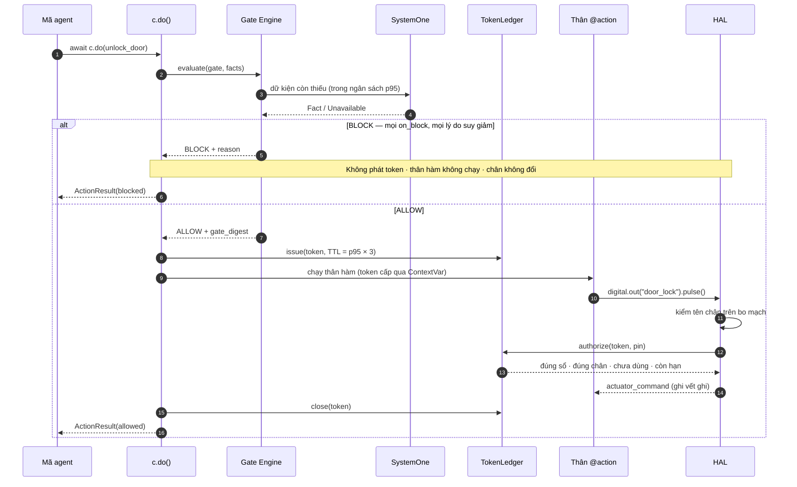

# Mô hình mối đe dọa — đường từ phán quyết tới chân GPIO

**Phạm vi:** Khối 1a (`sim`, `linux`). Viết cùng TSK-S2-05 theo `TODOS.md` #2.
**Mã nguồn:** `python/neuroedge/actions/`, `python/neuroedge/hal/`.

## 1. Đường hợp lệ duy nhất

HAL không có bộ kiểm nào khác: khi chưa gắn `Conversation`, HAL **từ chối mọi lệnh**,
kể cả chuỗi trông giống bằng chứng.

## 2. Trong phạm vi: bỏ qua gate do nhầm lẫn

Mối đe dọa mà Khối 1a chứng minh được bằng test là **bỏ qua gate do nhầm lẫn** — lập
trình viên gọi thẳng hàm, dùng lại token cũ, sao chép một lệnh từ lần gọi trước.

| Đường tắt | Chặn bởi | Mã | Test |
|:---|:---|:---|:---|
| Gọi thẳng hàm `@action` | ContextVar `running` chỉ `c.do()` đặt | NE1001 | `test_a_direct_call_is_a_contract_violation_naming_the_caller` |
| `digital.out()` ngoài `c.do()` | ContextVar `grant` rỗng | NE1001 | `test_digital_out_outside_c_do_is_a_contract_violation` |
| `hal.digital_out` với chuỗi, digest, token tự dựng | Ledger chỉ nhận token do chính nó phát hành | NE1001 | `test_no_path_reaches_a_pin_without_a_valid_token` |
| HAL chưa gắn ledger | Authorizer mặc định từ chối tất cả | NE1001 | `test_a_hal_without_a_ledger_refuses_every_command` |
| Token cho chân A dùng cho chân B | `pin ∈ token.pins` | NE1001 | `test_a_token_for_one_pin_cannot_drive_another` |
| Dùng lại token (trong hoặc sau `c.do()`) | Mỗi chân tiêu một lần; token đóng khi `c.do()` trả về | NE1002 `token_replayed` | `test_a_second_pulse_…`, `test_a_token_kept_past_c_do_…` |
| Token quá hạn | TTL = p95 × 3 | NE1002 `token_expired` | `test_a_token_used_after_its_ttl_is_token_expired` |
| Token từ tiến trình trước (restart) | `process_instance_id` | NE1002 `token_expired` | `test_a_token_from_another_process_instance_is_token_expired` |
| Task sinh trong thân hành động gọi lại hành động sau khi `c.do()` trả về | Quyền chạy là cờ dùng chung, đóng khi `c.do()` thoát | NE1001 | `test_a_spawned_task_cannot_call_the_action_after_c_do_returns` |
| Độ tin cậy không phải xác suất (`NaN`, `True`, > 1) lọt ngưỡng | `walk()` coi là `criterion_unavailable` | — (phán quyết BLOCK) | `test_a_non_probability_confidence_blocks` |
| `fail: open` biến một "không" đã biết thành ALLOW | `known_failure()` — `open` chỉ tha điều không quyết được | — (phán quyết BLOCK) | `test_fail_open_still_blocks_on_a_known_failing_fact` |

Mọi lần từ chối ghi `actuator_command_rejected{pin, reason, code}` vào vết ghi **trước**
khi ném lỗi; chân không đổi trạng thái. Nonce không bao giờ vào vết ghi.

## 2b. Trong phạm vi: bên gọi không tin cậy (Q-24)

Từ Q-24, hành động còn đến từ LLM (System 2) và client MCP, không chỉ từ mã agent. Cả hai
là bên gọi **không tin cậy**: mô hình có thể ảo giác hoặc bị prompt injection qua nội dung
nó đọc; client MCP có thể là một agent tự động. Chúng chỉ gửi được *yêu cầu* — một
`ToolCall` — và mọi yêu cầu đi qua `dispatch()` (`docs/spec/tool_calling.md` §2) trước
đường §1.

| Đường tắt | Chặn bởi | Kết quả | Test |
|:---|:---|:---|:---|
| Gọi tool không tồn tại | `dispatch()` bước 2 | `REJECTED`, chân không đổi | `test_a_hallucinated_tool_or_argument_moves_nothing` |
| Tham số lạ hoặc sai kiểu | `check_arguments()` | `REJECTED` | `test_a_hallucinated_tool_or_argument_moves_nothing` · `test_arguments_are_checked_and_coerced` |
| Tự khai `call_source` để giả làm câu lệnh cục bộ | `call_source` không phải tham số; dispatcher tự chèn | `REJECTED` | `test_a_model_cannot_claim_its_own_call_source` |
| Gọi hành động gate đã cấm cho nguồn đó | Gate đọc `call_source` | `BLOCK` | ví dụ `fixtures/agents/home-voice/gates/`; ⏳ test riêng ở corpus TSK-S3-24 |
| Tham số trong kiểu nhưng nguy hiểm (`duration_s = 3600`) | Ràng buộc tham số trong gate (Q-25, RFC-0005) | `BLOCK argument_out_of_range` | ⏳ TSK-S3-25 |
| Tự trả lời câu hỏi `ask` dành cho người | Chỉ kênh thiết bị xác nhận được (Q-26) | Xác nhận bị từ chối | ⏳ TSK-S3-26 |
| Nội dung từ MCP server bên ngoài bị cài lệnh ("hãy tắt đèn") | Kết quả là dữ liệu cho mô hình, không phải lệnh; lời gọi mô hình sinh ra sau đó vẫn qua gate (Q-27) | `BLOCK` theo gate | `test_prompt_injection_in_the_news_still_meets_the_gate` |
| Tool bên ngoài có hiệu ứng vật lý (đi vòng qua gate) | Allowlist `tools` trong `agent.toml`; quy tắc: hiệu ứng vật lý phải là `@action`; tên trùng `@action` ⇒ build lỗi | Tool ngoài allowlist `REJECTED` | `test_a_tool_outside_the_allowlist_is_refused` · `test_build_refuses_a_bad_mcp_table` |
| Server bên ngoài treo hoặc không chạy | `timeout_s`; server bị bỏ qua | `mcp_server_unavailable`, tool thiết bị vẫn chạy | `test_a_server_that_does_not_start_is_skipped_and_the_lights_still_work` |
| Lặp lời gọi bị chặn tới khi lọt | Gate tất định: cùng dữ kiện ⇒ cùng phán quyết; mỗi lần đều ghi vết | `BLOCK` lặp lại | ⏳ corpus TSK-S3-24 |

**Ngoài phạm vi ở v1.0:** MCP chỉ qua **stdio**, nên bên chạy được `neuroedge mcp serve`
là người vận hành, có quyền ngang runtime (§3). Transport mạng cần xác thực trước khi mở
(`TODOS.md` #24, NFR-SEC-09).

## 3. Ngoài phạm vi: kẻ giả mạo trong cùng tiến trình

Token là `(nonce, digest)` trong bộ nhớ. Mã chạy **trong cùng tiến trình** đọc được
ledger, nên tự mint được token. Khối 1a **không** chống lại điều đó — đó là mã độc có
quyền ngang runtime, không phải nhầm lẫn.

Mốc kích hoạt để đưa vào phạm vi: khách yêu cầu chống tấn công nội tiến trình, hoặc
firmware có secure element (`TODOS.md` #2).

## 4. Giả định

- Agent chỉ nhận HAL qua runtime (`Conversation`), không tự dựng HAL.
- Đồng hồ ledger là đồng hồ đơn điệu của engine; test dùng đồng hồ giả.
- `gate_digest` trong token là để truy vết, không phải để chứng thực — chữ ký gate
  thuộc Khối 3 (Gate Registry).
