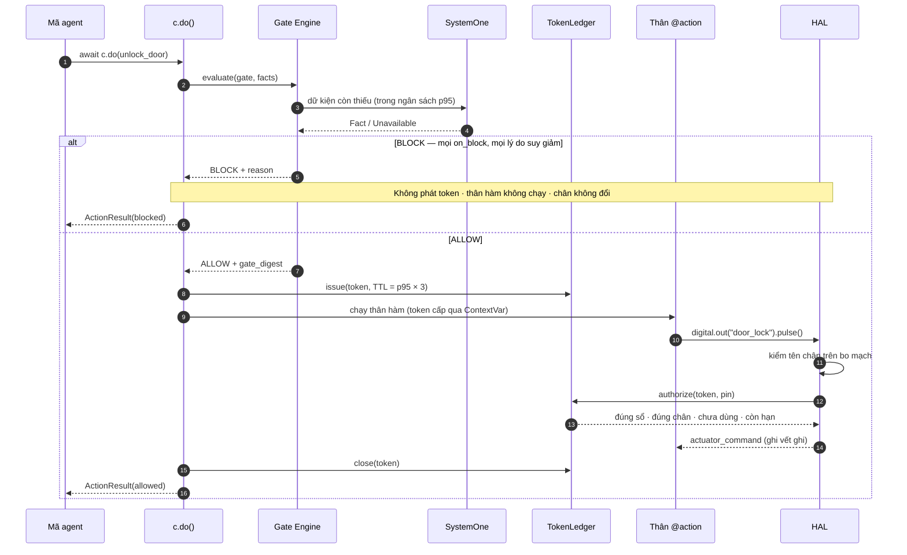

# Mô hình mối đe dọa — đường từ phán quyết tới chân GPIO

**Phạm vi:** Khối 1a (`sim`, `linux`) và phần thiết bị đã có — walker gate và sổ token C
(TSK-S4-02), chạy trên host và QEMU. Viết cùng TSK-S2-05 theo `TODOS.md` #2.
**Mã nguồn:** `python/neuroedge/actions/`, `python/neuroedge/hal/`,
`targets/esp32s3/components/ne_gate/`.

## 1. Đường hợp lệ duy nhất

HAL không có bộ kiểm nào khác: khi chưa gắn `Conversation`, HAL **từ chối mọi lệnh**,
kể cả chuỗi trông giống bằng chứng.

Sơ đồ bắt đầu ở `c.do()`. Lời gọi từ LLM hay client MCP đi qua `dispatch()` trước
(`docs/spec/tool_calling.md` §2), và lời xác nhận `ask` lượng giá lại chính gate này
(`tool_calling.md` §6); cả hai ở §2b.

## 2. Trong phạm vi: bỏ qua gate do nhầm lẫn

Mối đe dọa mà Khối 1a chứng minh được bằng test là **bỏ qua gate do nhầm lẫn** — lập
trình viên gọi thẳng hàm, dùng lại token cũ, sao chép một lệnh từ lần gọi trước.

| Đường tắt | Chặn bởi | Mã | Test |
|:---|:---|:---|:---|
| Gọi thẳng hàm `@action` | ContextVar `running` chỉ `c.do()` đặt | NE1001 | `test_a_direct_call_is_a_contract_violation_naming_the_caller` |
| `digital.out()` ngoài `c.do()` | ContextVar `grant` rỗng | NE1001 | `test_digital_out_outside_c_do_is_a_contract_violation` |
| `hal.digital_out` với chuỗi, digest, token tự dựng | Ledger chỉ nhận token do chính nó phát hành | NE1001 | `test_no_path_reaches_a_pin_without_a_valid_token` |
| HAL chưa gắn ledger | Authorizer mặc định từ chối tất cả | NE1001 | `test_a_hal_without_a_ledger_refuses_every_command` |
| Token cho chân A dùng cho chân B | `pin ∈ token.pins` | NE1001 | `test_a_token_for_one_pin_cannot_drive_another` |
| Dùng lại token (trong hoặc sau `c.do()`) | Mỗi chân tiêu một lần; token đóng khi `c.do()` trả về | NE1002 `token_replayed` | `test_a_second_pulse_…`, `test_a_token_kept_past_c_do_…` |
| Token quá hạn | TTL = p95 × 3 | NE1002 `token_expired` | `test_a_token_used_after_its_ttl_is_token_expired` |
| Token từ tiến trình trước (restart) | `process_instance_id` | NE1002 `token_expired` | `test_a_token_from_another_process_instance_is_token_expired` |
| Sổ token trên thiết bị đầy (mọi ô giữ token còn sống) | Sổ đầy ⇒ đóng an toàn: `ne_token_issue` từ chối (`NE_TOKEN_ERR_FULL`), không cấp token thì không có hành động; không bao giờ đẩy token còn sống ra | — (không token) | `test_what_only_the_c_ledger_has` |
| Trên thiết bị: token của lần boot trước, đồng hồ `millis` tràn vòng | `boot_id` thay `process_instance_id`; tuổi token tính `(uint32_t)(now − issued)` | NE1002 `token_expired` | `test_the_c_ledger_refuses_exactly_as_the_host_ledger` |
| Trên thiết bị: cây `NETR` hỏng, bị cắt, bị sửa, hoặc bố cục lạ | `ne_tree_load` kiểm magic, `layout_version`, CRC, giới hạn và mọi offset trước khi dùng; lỗi ⇒ không có cây ⇒ không phán quyết ALLOW nào (RFC-0003) | `NE_ERR_MAGIC` · `VERSION` · `CRC` · `LIMITS` · `STRUCTURE` | fuzz cắt/hỏng/cấu trúc thù địch của `test_walker_host.c`, chạy trong `test_the_c_walker_matches_the_host_engine_on_every_gate` |
| Gate quá lớn cho thiết bị | Bộ mã hoá `NETR` từ chối gate vượt giới hạn thiết bị (vd quá 32 nút) lúc build, không sinh `.netree` | NE2002 | `test_a_gate_too_large_for_the_device_is_refused_at_build` |
| Gate chuẩn mực bị sửa âm thầm (digest đổi) | `digests.lock`: CI đỏ khi digest đổi hoặc tệp bị xoá mà không có RFC | — (CI) | `test_a_changed_digest_needs_an_rfc_and_update_does_not_hide_it` · `test_a_deleted_file_needs_an_rfc` |
| Task sinh trong thân hành động gọi lại hành động sau khi `c.do()` trả về | Quyền chạy là cờ dùng chung, đóng khi `c.do()` thoát | NE1001 | `test_a_spawned_task_cannot_call_the_action_after_c_do_returns` |
| Độ tin cậy không phải xác suất (`NaN`, `True`, > 1) lọt ngưỡng | `walk()` coi là `criterion_unavailable` | — (phán quyết BLOCK) | `test_a_non_probability_confidence_blocks` |
| `fail: open` biến một "không" đã biết thành ALLOW | `known_failure()` — `open` chỉ tha điều không quyết được | — (phán quyết BLOCK) | `test_fail_open_still_blocks_on_a_known_failing_fact` |

Mọi lần từ chối ghi `actuator_command_rejected{pin, reason, code}` vào vết ghi **trước**
khi ném lỗi; chân không đổi trạng thái. Nonce không bao giờ vào vết ghi.

## 2b. Trong phạm vi: bên gọi không tin cậy (Q-24)

Từ Q-24, hành động còn đến từ LLM (System 2) và client MCP, không chỉ từ mã agent. Cả hai
là bên gọi **không tin cậy**: mô hình có thể ảo giác hoặc bị prompt injection qua nội dung
nó đọc; client MCP có thể là một agent tự động. Chúng chỉ gửi được *yêu cầu* — một
`ToolCall` — và mọi yêu cầu đi qua `dispatch()` (`docs/spec/tool_calling.md` §2) trước
đường §1.

| Đường tắt | Chặn bởi | Kết quả | Test |
|:---|:---|:---|:---|
| Gọi tool không tồn tại | `dispatch()` bước 2 | `REJECTED`, chân không đổi | `test_a_hallucinated_tool_or_argument_moves_nothing` |
| Tham số lạ hoặc sai kiểu | `check_arguments()` | `REJECTED` | `test_a_hallucinated_tool_or_argument_moves_nothing` · `test_arguments_are_checked_and_coerced` |
| Tự khai `call_source` để giả làm câu lệnh cục bộ | `call_source` không phải tham số; dispatcher tự chèn | `REJECTED` | `test_a_model_cannot_claim_its_own_call_source` |
| Gọi hành động gate đã cấm cho nguồn đó | Gate đọc `call_source` | `BLOCK` | corpus `fixtures/tool_calls/valid/light_on_source_denied.yaml` · `open_gate_mcp_degrades.yaml` |
| Tham số trong kiểu nhưng nguy hiểm (`duration_s = 3600`) | Ràng buộc tham số trong gate (Q-25, RFC-0005) — kiểm cả giá trị mặc định, trước mọi dữ kiện | `BLOCK argument_out_of_range` | `test_a_system_two_tool_call_with_a_dangerous_argument_is_blocked_by_the_gate` · `test_the_default_value_is_what_the_gate_checks` |
| Tự trả lời câu hỏi `ask` dành cho người | Chỉ `local_grammar`/`ui` xác nhận được (Q-26); không có tool xác nhận; chữ mô hình nói không phải câu trả lời | `tool_confirm_rejected`, câu hỏi vẫn chờ người | `test_only_a_person_on_the_device_may_answer` · `test_system_two_cannot_answer_the_question_its_own_call_raised` · `test_an_mcp_client_has_no_way_to_confirm` |
| Dùng một lời "có" để vượt tiêu chí gate không cho người thay | Chỉ tiêu chí trong `on_block.confirms` được thay (RFC-0006); câu hỏi chỉ mở khi "có" đủ để cho qua | `BLOCK` với tiêu chí còn lại | `test_confirmation_stands_in_only_for_the_listed_criteria` · `test_the_question_is_only_offered_when_a_yes_would_be_enough` |
| Trang web khác gửi "Đồng ý" hoặc một lệnh tới UI cục bộ | Mọi `POST` (`/confirm`, `/command`) chỉ nhận `Host` và `Origin` là `127.0.0.1`/`localhost` đúng cổng — chặn cả DNS rebinding | HTTP 403 | `test_another_site_cannot_answer_for_the_person` · `test_another_origin_cannot_send_commands` · `test_another_origin_still_cannot_send_commands` |
| Nội dung từ MCP server bên ngoài bị cài lệnh ("hãy tắt đèn") | Kết quả là dữ liệu cho mô hình, không phải lệnh; lời gọi mô hình sinh ra sau đó vẫn qua gate (Q-27) | `BLOCK` theo gate | `test_prompt_injection_in_the_news_still_meets_the_gate` |
| Tool bên ngoài có hiệu ứng vật lý (đi vòng qua gate) | Allowlist `tools` trong `agent.toml`; quy tắc: hiệu ứng vật lý phải là `@action`; tên trùng `@action` ⇒ build lỗi | Tool ngoài allowlist `REJECTED` | `test_a_tool_outside_the_allowlist_is_refused` · `test_build_refuses_a_bad_mcp_table` |
| Server bên ngoài treo hoặc không chạy | `timeout_s`; server bị bỏ qua | `mcp_server_unavailable`, tool thiết bị vẫn chạy | `test_a_server_that_does_not_start_is_skipped_and_the_lights_still_work` |
| Lặp lời gọi bị chặn tới khi lọt | Gate tất định: cùng dữ kiện ⇒ cùng phán quyết; mỗi lần đều ghi vết | `BLOCK` lặp lại | chưa có test riêng |

**Ranh giới tin cậy của `mcp serve --ui`.** Trang và client MCP dùng **chung một phiên**
(`tool_calling.md` §8). Chữ gõ trên trang đi vào như lời của người trên thiết bị: câu lệnh
là `local_grammar`, nút Đồng ý là nguồn xác nhận `ui`. Vì vậy một người mở được trang thì trả
lời được câu hỏi `ask` mà lời gọi MCP mở ra, và đổi được cảm biến giả lập — đúng ý đồ:
người xem demo đứng thay người trong phòng. Ranh giới là **quyền mở trang**: server chỉ
nghe `127.0.0.1` và chỉ nhận yêu cầu cùng nguồn gốc (dòng trên). Client MCP vẫn không có
đường nào để tự xác nhận (`test_an_mcp_client_has_no_way_to_confirm`); luồng MCP rồi người
trên trang: `test_a_tool_call_through_mcp_then_a_person_on_the_page`.

**Ngoài phạm vi ở v1.0:** MCP chỉ qua **stdio**, nên bên chạy được `neuroedge mcp serve`
là người vận hành, có quyền ngang runtime (§3). Transport mạng cần xác thực trước khi mở
(`TODOS.md` #24, NFR-SEC-09).

## 3. Ngoài phạm vi: kẻ giả mạo trong cùng tiến trình

Token là `(nonce, digest)` trong bộ nhớ. Mã chạy **trong cùng tiến trình** đọc được
ledger, nên tự mint được token. Khối 1a **không** chống lại điều đó — đó là mã độc có
quyền ngang runtime, không phải nhầm lẫn.

Mốc kích hoạt để đưa vào phạm vi: khách yêu cầu chống tấn công nội tiến trình, hoặc
firmware có secure element (`TODOS.md` #2).

## 4. Giả định

- Agent chỉ nhận HAL qua runtime (`Conversation`), không tự dựng HAL.
- Đồng hồ ledger là đồng hồ đơn điệu của engine; test dùng đồng hồ giả.
- `gate_digest` trong token là để truy vết, không phải để chứng thực — chữ ký gate
  thuộc Khối 3 (Gate Registry).
