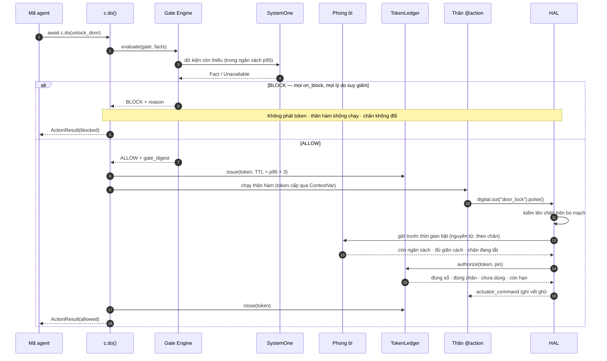

# Mô hình mối đe dọa — đường từ phán quyết tới chân GPIO

**Phạm vi:** Khối 1a (`sim`, `linux`) và phần thiết bị đã có — walker gate và sổ token C
(TSK-S4-02), chạy trên host và QEMU. Viết cùng TSK-S2-05 theo `TODOS.md` #2.
**Mã nguồn:** `python/neuroedge/actions/`, `python/neuroedge/hal/`,
`targets/esp32s3/components/ne_gate/`.

## 1. Đường hợp lệ duy nhất

```mermaid
sequenceDiagram
    autonumber
    participant A as Mã agent
    participant C as c.do()
    participant E as Gate Engine
    participant S as SystemOne
    participant V as Phong bì
    participant L as TokenLedger
    participant B as Thân @action
    participant H as HAL

    A->>C: await c.do(unlock_door)
    C->>E: evaluate(gate, facts)
    E->>S: dữ kiện còn thiếu (trong ngân sách p95)
    S-->>E: Fact / Unavailable
    alt BLOCK — mọi on_block, mọi lý do suy giảm
        E-->>C: BLOCK + reason
        Note over C,H: Không phát token · thân hàm không chạy · chân không đổi
        C-->>A: ActionResult(blocked)
    else ALLOW
        E-->>C: ALLOW + gate_digest
        C->>L: issue(token, TTL = p95 × 3)
        C->>B: chạy thân hàm (token cấp qua ContextVar)
        B->>H: digital.out("door_lock").pulse()
        H->>H: kiểm tên chân trên bo mạch
        H->>V: giữ trước thời gian bật (nguyên tử, theo chân)
        V-->>H: còn ngân sách · đủ giãn cách · chân đang tắt
        H->>L: authorize(token, pin)
        L-->>H: đúng sổ · đúng chân · chưa dùng · còn hạn
        H-->>B: actuator_command (ghi vết ghi)
        C->>L: close(token)
        C-->>A: ActionResult(allowed)
    end
```

HAL không có bộ kiểm nào khác: khi chưa gắn `Conversation`, HAL **từ chối mọi lệnh**,
kể cả chuỗi trông giống bằng chứng.

**Phong bì đứng trước token.** Thứ tự trong `HardwareAbstractionLayer.digital_out` là
`require_pin → phong bì → authorize → record` (RFC-0007 §3d, TSK-N2-01). Phong bì là lớp chặn thứ
hai, độc lập với gate: nó chỉ biết từ chối (`EnvelopeRefusedError`, NE1003, sự kiện `envelope_refused`),
không bao giờ cho phép, nên gate viết lỏng đến đâu thì giới hạn vật lý của chân vẫn đứng. Vì đứng trước
`authorize`, lệnh bị từ chối **không tiêu token**; `authorize` thất bại sau khi đã giữ trước thì phong
bì hoàn trả toàn bộ phần đã giữ.

**Ngoại lệ duy nhất của luật "không lệnh nào ra phần cứng mà không có ALLOW"** (RFC-0007 §3d, §8;
Q-62): lệnh **về phía an toàn**. Đó là `digital.out` `off` (kênh PWM: `duty = 0` và thả `enable_pin`, kể cả một lệnh
`pwm` có `duty` lượng tử về 0 — RFC-0010 §9.6), và mọi lệnh HAL tự phát khi hết `duration_ms`,
hết `max_continuous_ms`, khi cắt lời, khi BLOCK, mất liên lạc, `hal.close()` hoặc khi tiến trình giám sát
thả line. Các lệnh này **không qua phong bì, không cần ALLOW hay token, không chờ `min_interval_ms`** —
`min_interval_ms` chỉ từ chối lệnh *bật* kế tiếp, tính từ lúc lần bật trước kết thúc. Lý do: lệnh đưa cơ
cấu về trạng thái an toàn không bao giờ được phép bị cản bởi bất kỳ cơ chế kiểm soát nào, kể cả sổ token
hỏng, đồng hồ lệch hay bản ghi phong bì không đọc được. Lệnh vẫn ghi vết ghi (`actuator_command`, kèm
`cause` khi HAL tự phát) — chỉ không bị chặn. Hệ quả cần biết: `off` chỉ cần tên chân có trên bo mạch;
HAL không kiểm bằng chứng cho nó (`test_off_needs_no_envelope_no_proof_and_no_waiting`).

**Chuyển động có lease** (RFC-0011 §3c, §3d, TSK-I2a-05). Lệnh `motion.*` đi cùng đường `require_channel → giới
hạn bo mạch → phong bì → authorize → record`, nhưng bằng chứng là **lease** trong token: một lệnh, trong `lease_ms`
của kênh, và chỉ một lần qua gate mới gia hạn được; HAL không bao giờ tự gia hạn. Lệnh **về trạng thái an
toàn của kênh** (`stop`/`hold`) là phần mở rộng của ngoại lệ trên: lease hết, hết `max_continuous_ms` hay
`max_hold_ms`, cắt lời, BLOCK, `motion.stop`, `hal.close()`, tiến trình giám sát thả đường enable — không qua
phong bì, không cần token hay ALLOW, không chờ `ramp_min_ms`/`min_interval_ms`, luôn ghi `motion_safe` kèm nguyên
nhân (`test_stop_needs_no_token_no_envelope_and_does_not_wait_for_a_ramp`). Trên `linux`, đường enable của driver
do tiến trình giám sát giữ cùng hạn (hết lease + 250 ms), nên runtime treo hoặc chết cũng làm driver mất điện
(`test_a_runtime_stopped_with_sigstop_while_a_motor_runs_loses_its_driver`).

**Cơ cấu chấp hành từ xa** (RFC-0018 §3c, §3g, TSK-I2c-16). Một thiết bị ở xa (Home Assistant, ESPHome,
Matter…) do plugin `neuroedge.actuators` lái là **một chân `digital.out` có tên**, và lệnh tới nó đi **đúng** đường
trên, thêm một chốt: `require_pin → chốt trạng thái → phong bì → authorize → record → apply`. Chốt trạng thái chỉ
cho lệnh bật qua khi HAL *biết* thiết bị đang tắt (trạng thái `off` với lần đọc lại không cũ hơn 2 s); `uncertain`,
`quarantined` hay một lần đọc thấy `on` mà NeuroEdge không bật ⇒ `EnvelopeRefusedError` trước phong bì và token. Chỉ HAL giữ
plugin; plugin không nhận HAL, sổ token hay phong bì, mã agent không nhận plugin. Ngoại lệ "lệnh về phía an toàn"
dưới đây **phủ thêm** đích này: `off` tới cơ cấu từ xa (`Actuator.safe_off()`) luôn được thử, không phong bì, không
token, gửi lại mỗi 500 ms tới khi xác nhận, không bao giờ ném lỗi cho bên gọi — và **không thêm ngoại lệ nào khác**.
Bảo đảm tự tắt khi NeuroEdge treo hay mất liên lạc nằm ở thiết bị theo mức khai (L2 hẹn giờ, L3 lease), không ở tiến
trình giám sát; L0/L1 không có, nên bị cấm cho hành động không hoàn tác (luật D5, NE3002/NE3001 ở build).
Chi tiết hiện thực: [`extension_sdk.md`](extension_sdk.md) §7.

Sơ đồ bắt đầu ở `c.do()`. Lời gọi từ LLM hay client MCP đi qua `dispatch()` trước
(`docs/spec/tool_calling.md` §2), và lời xác nhận `ask` lượng giá lại chính gate này
(`tool_calling.md` §6); cả hai ở §2b.

## 2. Trong phạm vi: bỏ qua gate do nhầm lẫn

Mối đe dọa mà Khối 1a chứng minh được bằng test là **bỏ qua gate do nhầm lẫn** — lập
trình viên gọi thẳng hàm, dùng lại token cũ, sao chép một lệnh từ lần gọi trước.

| Đường tắt | Chặn bởi | Mã | Test |
|:---|:---|:---|:---|
| Gọi thẳng hàm `@action` | ContextVar `running` chỉ `c.do()` đặt | NE1001 | `test_a_direct_call_is_a_contract_violation_naming_the_caller` |
| `digital.out()` ngoài `c.do()` | ContextVar `grant` rỗng | NE1001 | `test_digital_out_outside_c_do_is_a_contract_violation` |
| `hal.digital_out` với chuỗi, digest, token tự dựng | Ledger chỉ nhận token do chính nó phát hành | NE1001 | `test_no_path_reaches_a_pin_without_a_valid_token` |
| HAL chưa gắn ledger | Authorizer mặc định từ chối tất cả | NE1001 | `test_a_hal_without_a_ledger_refuses_every_command` |
| Token cho chân A dùng cho chân B | `pin ∈ token.pins` | NE1001 | `test_a_token_for_one_pin_cannot_drive_another` |
| Dùng lại token (trong hoặc sau `c.do()`) | Mỗi chân tiêu một lần; token đóng khi `c.do()` trả về | NE1002 `token_replayed` | `test_a_second_pulse_…`, `test_a_token_kept_past_c_do_…` |
| Lease dùng cho hai lệnh | Mỗi lease một lệnh; lệnh thứ hai ⇒ `lease_used` | NE1002 `lease_used` | `test_a_lease_carries_exactly_one_command` |
| Lease quá hạn (lệnh tới sau `lease_ms`) | `lease_ms` của kênh từ lúc phán quyết, không phải `TTL_FACTOR` | NE1002 `lease_expired` | `test_a_lease_that_ran_out_before_the_command_is_refused`, `test_the_lease_is_the_boards_and_not_the_gates_or_the_ttl` |
| Lease của kênh A dùng cho kênh B | `channel ∈ token.channels` | NE1001 | `test_a_lease_for_one_channel_is_no_proof_for_another` |
| Token quá hạn | TTL = p95 × 3 | NE1002 `token_expired` | `test_a_token_used_after_its_ttl_is_token_expired` |
| Token từ tiến trình trước (restart) | `process_instance_id` | NE1002 `token_expired` | `test_a_token_from_another_process_instance_is_token_expired` |
| Sổ token trên thiết bị đầy (mọi ô giữ token còn sống) | Sổ đầy ⇒ đóng an toàn: `ne_token_issue` từ chối (`NE_TOKEN_ERR_FULL`), không cấp token thì không có hành động; không bao giờ đẩy token còn sống ra | — (không token) | `test_what_only_the_c_ledger_has` |
| Trên thiết bị: token của lần boot trước, đồng hồ `millis` tràn vòng | `boot_id` thay `process_instance_id`; tuổi token tính `(uint32_t)(now − issued)` | NE1002 `token_expired` | `test_the_c_ledger_refuses_exactly_as_the_host_ledger` |
| Trên thiết bị: cây `NETR` hỏng, bị cắt, bị sửa, hoặc bố cục lạ | `ne_tree_load` kiểm magic, `layout_version`, CRC, giới hạn và mọi offset trước khi dùng; lỗi ⇒ không có cây ⇒ không phán quyết ALLOW nào (RFC-0003) | `NE_ERR_MAGIC` · `VERSION` · `CRC` · `LIMITS` · `STRUCTURE` | fuzz cắt/hỏng/cấu trúc thù địch của `test_walker_host.c`, chạy trong `test_the_c_walker_matches_the_host_engine_on_every_gate` |
| Gate quá lớn cho thiết bị | Bộ mã hoá `NETR` từ chối gate vượt giới hạn thiết bị (vd quá 32 nút) lúc build, không sinh `.netree` | NE2002 | `test_a_gate_too_large_for_the_device_is_refused_at_build` |
| Gate chuẩn mực bị sửa âm thầm (digest đổi) | `digests.lock`: CI đỏ khi digest đổi hoặc tệp bị xoá mà không có RFC | — (CI) | `test_a_changed_digest_needs_an_rfc_and_update_does_not_hide_it` · `test_a_deleted_file_needs_an_rfc` |
| Task sinh trong thân hành động gọi lại hành động sau khi `c.do()` trả về | Quyền chạy là cờ dùng chung, đóng khi `c.do()` thoát | NE1001 | `test_a_spawned_task_cannot_call_the_action_after_c_do_returns` |
| Gate viết lỏng cho một chân bật quá lâu, quá thường, hoặc bật lại để kéo dài | Phong bì theo chân của bo mạch (RFC-0007 §3d): tự tắt bắt buộc tại `min(thời hạn, max_continuous_ms)`, ngân sách `max_on_ms_per_window` trên cửa sổ trượt, `min_interval_ms` tính từ lúc lần bật trước kết thúc; chân đang bật từ chối lệnh bật thứ hai | NE1003 `envelope_refused` (`window_budget` · `min_interval_ms` · `already_on`), token không bị tiêu | `test_the_budget_holds_exactly_the_reserved_time_and_an_early_off_refunds_the_rest` · `test_a_pin_that_is_on_refuses_another_on_or_pulse_instead_of_restarting_its_limit` · `test_a_refused_command_does_not_consume_the_verdict_token` |
| Hai lệnh đồng thời cùng chân cùng qua ngân sách còn lại | Giữ trước **nguyên tử** dưới khoá theo chân (TSK-N2-02) | NE1003, đúng một lệnh bị từ chối | `test_two_concurrent_commands_on_one_pin_give_exactly_one_envelope_refused` |
| Khởi động lại liên tục để xoá bộ đếm phong bì | Thời gian bật ghi bền **trước** khi bật (write-ahead; tệp trạng thái theo bo mạch trên `linux`), sau khởi động coi mọi lần bật đã ghi như vừa xảy ra và mỗi chân chờ `min_interval_ms`; bản ghi hỏng, thiếu hoặc không ghi được ⇒ coi cả cửa sổ đã dùng hết | NE1003 `window_unreadable` | `test_after_a_restart_what_was_recorded_counts_against_the_window_and_the_pin_waits` · `test_a_corrupt_record_makes_the_pin_refuse_every_on` · `test_a_missing_record_is_refused_unless_this_is_declared_a_new_rig` |
| Tiến trình runtime treo (SIGSTOP, kẹt) hoặc chết khi chân đang bật; hẹn giờ tự tắt chết cùng nó | Trên `linux`, mặc định bật (tắt chỉ cho test/gỡ lỗi, ghi ở `metadata.supervision`; giám sát không chạy ⇒ lệnh bật bị từ chối `supervisor_unavailable`, `off` vẫn chạy): line của chân có phong bì do **tiến trình giám sát riêng** giữ; runtime gửi nhịp tim; mất nhịp quá `heartbeat_timeout_ms`, quá hạn hoặc đóng ống ⇒ giám sát thả line (`hal/supervisor.py`) | Line về 0, runtime ghi `actuator_command` `off` kèm `cause` `supervisor_*` khi tỉnh lại | `test_a_runtime_stopped_with_sigstop_while_a_line_is_on_loses_the_line` · `test_a_runtime_that_dies_loses_its_lines_because_the_pipe_closes` · `tests_linux/test_gpio_envelope.py` |
| Bật cơ cấu từ xa khi HAL không biết nó đang tắt (lệnh trước mơ hồ, mất kênh đọc lại, lần đọc cũ, vừa khởi động) | Chốt trạng thái trước phong bì; chỉ một lần đọc `off` tươi mới ra khỏi `uncertain`, không bao giờ một hẹn giờ (RFC-0018 §3g) | NE1003 `actuator_state_unknown` | `test_an_uncertain_actuator_refuses_on_but_still_sends_off`, `test_uncertain_ends_only_on_a_fresh_off_readback_never_on_a_timer`, `test_a_restart_leaves_every_remote_actuator_uncertain` |
| Hoàn phần giữ trước của một lệnh bật có thể đã tới thiết bị | Plugin phân loại lỗi: chỉ `NotSent`/`Rejected` hoàn; `Ambiguous` (hay lỗi lạ, quá `command_timeout_ms`) giữ phần giữ trước và vào `uncertain` | — | `test_an_ambiguous_send_failure_holds_the_reservation_and_marks_the_actuator_uncertain`, `test_a_not_sent_failure_refunds_the_reservation` |
| HAL tắt thứ nó không bật (người, automation của hub, công tắc tường) | Nợ tắt: HAL chỉ gửi `off` của nó cho lệnh bật **của nó** chưa xác nhận tắt; đọc thấy `on` lạ ⇒ từ chối bật `already_on`, không gửi `off` | NE1003 `already_on` | `test_the_hal_turns_off_only_what_it_turned_on`, `test_a_reading_of_on_nobody_commanded_is_already_on_not_a_command_to_turn_off` |
| Thiết bị vi phạm mức tự tắt nó khai | P2: đọc lại ở `hạn + tolerance_ms` mỗi lần chạy; còn `on` ⇒ `off`, `quarantined` (ghi bền), mọi lệnh bật bị từ chối tới khi người vận hành gỡ trên bản ghi | NE1003 `actuator_quarantined` | `test_a_device_still_on_after_its_guarantee_is_commanded_off_and_quarantined`, `test_a_quarantined_actuator_refuses_every_on_until_the_record_is_cleared` |
| Hành động không hoàn tác trên cơ cấu "không tự tắt" | Luật D5 ở build **và** lúc nạp (cùng một hàm kiểm) | NE3002 · NE3001 | `test_an_irreversible_actuator_below_l2_is_refused_at_build`, `test_the_same_declaration_is_refused_at_load_without_agent_toml` |
| Độ tin cậy không phải xác suất (`NaN`, `True`, > 1) lọt ngưỡng | `walk()` coi là `criterion_unavailable` | — (phán quyết BLOCK) | `test_a_non_probability_confidence_blocks` |
| `fail: open` biến một "không" đã biết thành ALLOW | `known_failure()` — `open` chỉ tha điều không quyết được | — (phán quyết BLOCK) | `test_fail_open_still_blocks_on_a_known_failing_fact` |

Mọi lần từ chối ghi `actuator_command_rejected{pin, reason, code}` vào vết ghi **trước**
khi ném lỗi; chân không đổi trạng thái. Nonce không bao giờ vào vết ghi. Phong bì từ chối ghi
`envelope_refused{pin, operation, reason, …}` (`docs/spec/simulation_coverage.md` §3) và ném NE1003, cũng
trước khi chạm chân hay token.

## 2b. Trong phạm vi: bên gọi không tin cậy (Q-24)

Từ Q-24, hành động còn đến từ LLM (System 2) và client MCP, không chỉ từ mã agent. Cả hai
là bên gọi **không tin cậy**: mô hình có thể ảo giác hoặc bị prompt injection qua nội dung
nó đọc; client MCP có thể là một agent tự động. Chúng chỉ gửi được *yêu cầu* — một
`ToolCall` — và mọi yêu cầu đi qua `dispatch()` (`docs/spec/tool_calling.md` §2) trước
đường §1.

| Đường tắt | Chặn bởi | Kết quả | Test |
|:---|:---|:---|:---|
| Gọi tool không tồn tại | `dispatch()` bước 2 | `REJECTED`, chân không đổi | `test_a_hallucinated_tool_or_argument_moves_nothing` |
| Tham số lạ hoặc sai kiểu | `check_arguments()` | `REJECTED` | `test_a_hallucinated_tool_or_argument_moves_nothing` · `test_arguments_are_checked_and_coerced` |
| Tự khai `call_source` để giả làm câu lệnh cục bộ | `call_source` không phải tham số; dispatcher tự chèn | `REJECTED` | `test_a_model_cannot_claim_its_own_call_source` |
| Bridge (Muse, Home Assistant…) mang `"source": "local_grammar"` trong thông điệp cloud, hoặc nói lời gọi của mình là của bridge khác | `ToolRequest` không có `source`; lõi gán `bridge:<id>` từ id đã đăng ký (RFC-0017 §3b). Dựng thẳng `ToolCall` bên ngoài `Dispatcher` chỉ mã thù địch cùng tiến trình làm được (§3) | Nguồn là `bridge:<id>` của chính nó | `test_a_gate_that_lists_one_bridge_blocks_another` · `test_a_bridge_or_client_source_is_valid_and_a_made_up_family_is_not` |
| Nguồn không ai đăng ký (`bridge:typo`), họ lạ (`mqtt:x`), id có `\n` cuối | `dispatch()` kiểm tập id đã đăng ký; `ToolCall` kiểm văn phạm bằng `fullmatch`. Tới gate bằng đường khác thì giá trị ngoài `options` ⇒ `criterion_unavailable`, kể cả dưới `fail: open` | NE1004 (lỗi lập trình), hoặc `BLOCK` | `test_a_call_for_a_source_nobody_registered_is_refused_by_dispatch` · `test_a_source_with_a_trailing_newline_is_refused` · `test_a_source_outside_a_gates_options_blocks_even_under_fail_open` |
| Mã agent, `[sim.facts]`, nguồn dữ kiện hay mô hình đặt `call_channel` | Chèn sau cùng ở điểm theo từng lời gọi; `call_channel` ∈ `RUNTIME_CRITERIA`; không phải tham số của tool | Bị ghi đè / `[system_one]` từ chối / `REJECTED` | `test_call_channel_cannot_be_set_by_facts_sim_facts_or_a_fact_source` · `test_system_one_may_not_judge_call_channel` · `test_a_model_cannot_claim_its_own_call_channel` |
| Bridge tự trả lời câu hỏi `ask` dành cho người | `bridge:*` và `mcp:*` ∉ `HUMAN_SOURCES` | `tool_confirm_rejected` | `test_only_a_person_on_the_device_may_answer` |
| Client MCP gọi một máy chủ MCP có sẵn (Home Assistant…) qua `neuroedge proxy mcp`: gọi tool, tham số, hay tool không ai khai | Chỉ tool trong `guard.toml` được phơi; mỗi lời gọi qua `Guard` và chỉ chuyển tiếp trong `run` sau ALLOW; gate sinh ra chặn mặc định; không kết nối được/thiếu tool/lệch lược đồ ⇒ không khởi động; máy chủ thật hỏng sau ALLOW ⇒ lỗi, không thử lại | `BLOCK` / `REJECTED`, máy chủ thật không bị chạm | `test_the_proxy_forwards_only_after_allow_and_never_on_block` · `test_a_generated_gate_blocks_until_the_operator_opens_it` · `test_a_missing_upstream_tool_refuses_start` · `test_an_upstream_error_after_allow_is_an_error_result_not_a_retry` |
| Client gọi **thẳng** máy chủ thật, bỏ qua proxy | **Không chặn được.** Proxy chỉ canh con đường đi qua nó (RFC-0016 §5 rủi ro 3); `neuroedge plugin doctor` cảnh báo đích còn tới được và mục Claude Desktop khác khởi chạy cùng máy chủ, và nói thẳng những gì nó không kiểm được. Việc chặn thật là của tường lửa/ACL và của người vận hành | Gate chỉ để trang trí nếu đích còn mở | `test_doctor_warns_when_the_upstream_is_reachable_directly` · `test_doctor_finds_another_desktop_entry_that_launches_the_upstream` · `test_doctor_says_what_it_cannot_check` |
| Một bridge mượn nguồn `mcp` của client phía trước proxy | Đường giữ nguồn `mcp` là nội bộ của `Guard`, không `Dispatcher` nào chạm tới; bridge chỉ có `bridge:<id>` | Nguồn là `bridge:<id>` | `test_a_bridge_cannot_obtain_the_front_source` |
| Client HTTP gọi một API cục bộ (Tasmota, Shelly, REST tự viết) qua `neuroedge proxy http`: route/tham số/đường dẫn không khai, thông tin đăng nhập của client | Chỉ route khai báo qua được (404 còn lại); mỗi route là tool của `Guard`, chuyển tiếp chỉ trong `run` sau ALLOW; gate sinh ra chặn mặc định; nguồn `bridge:<id>` phải được gate liệt kê; tham số lạ/lồng/lặp và đường dẫn không an toàn ⇒ 400 trước khi dispatch; `Authorization`/`Cookie` của client không bao giờ chuyển; front chỉ loopback | 403/400/404, API thật không bị chạm | `test_the_proxy_forwards_only_after_allow_and_never_on_block` · `test_an_undeclared_route_is_a_404_and_nothing_is_forwarded` · `test_a_bad_argument_is_a_400_and_nothing_is_forwarded` · `test_the_clients_credentials_are_not_forwarded_and_the_configured_ones_are` |
| Client gọi **thẳng** API thật (luôn tới được trên cùng máy/mạng cục bộ), hoặc máy khác trong mạng dùng front của proxy | **Không chặn được:** proxy canh con đường đi qua nó (RFC-0016 §5 rủi ro 3). Front không có xác thực nên chỉ nghe loopback (địa chỉ khác bị từ chối lúc nạp); `plugin doctor` luôn cảnh báo API còn tới được và nói thẳng điều nó không kiểm được. Việc đặt API thiết bị sau tường lửa/ACL là của người vận hành | Gate chỉ để trang trí nếu API còn mở | `test_doctor_warns_that_the_device_api_is_reachable_directly` · `test_a_bad_proxy_config_is_a_three_part_error` (listen không loopback) |
| Người vận hành bật `allow_lan_http = true` để đặt proxy trước thiết bị http thuần trên mạng nhà (Home Assistant, Tasmota, Shelly) | Mặc định tắt; khi bật chỉ nhận IP riêng/link-local/loopback hoặc `*.local`/`*.lan`/`*.home.arpa`; host công khai, CGNAT `100.64/10` và IPv4-mapped IPv6 vẫn bị từ chối; thông tin đăng nhập trong URL vẫn bị từ chối; `plugin doctor` luôn **CẢNH BÁO** khi khoá bật | **Rủi ro còn lại, nói thẳng:** lời gọi, token (`headers_env`) và câu trả lời đi **không mã hoá** trên LAN — ai nghe được mạng nhà (Wi-Fi bị lộ, một thiết bị IoT bị chiếm, kẻ ở cùng mạng) đọc được và chép lại được token, rồi gọi thẳng thiết bị, bỏ qua proxy và gate. Cờ chỉ thu hẹp đường tới internet, không mã hoá gì | `test_a_lan_host_is_accepted_only_with_the_flag` · `test_any_other_host_stays_refused_even_with_the_flag` · `test_credentials_in_the_url_stay_refused_with_the_flag` · `test_doctor_warns_when_the_key_is_on_and_not_when_it_is_off` |
| Gọi hành động gate đã cấm cho nguồn đó | Gate đọc `call_source` | `BLOCK` | corpus `fixtures/tool_calls/valid/light_on_source_denied.yaml` · `open_gate_mcp_degrades.yaml` |
| Hai lời gọi chồng nhau trên một `Conversation` lấy nhầm nguồn của nhau (fallback hay câu hỏi `ask` của lời gọi `mcp` bị lượng giá như `local_grammar` đang chạy bên cạnh) | `call_source` thuộc về từng lời gọi (`Conversation.do_with`), không nằm trong `c.facts` dùng chung | `BLOCK` theo nguồn thật; câu hỏi giữ nguồn gốc | `test_an_mcp_call_is_not_judged_as_the_local_call_in_flight_beside_it` · `test_a_question_records_the_source_of_its_own_call_under_overlap` · `test_two_overlapping_calls_leave_no_source_in_the_conversation` |
| Tham số trong kiểu nhưng nguy hiểm (`duration_s = 3600`) | Ràng buộc tham số trong gate (Q-25, RFC-0005) — kiểm cả giá trị mặc định, trước mọi dữ kiện | `BLOCK argument_out_of_range` | `test_a_system_two_tool_call_with_a_dangerous_argument_is_blocked_by_the_gate` · `test_the_default_value_is_what_the_gate_checks` |
| Tự trả lời câu hỏi `ask` dành cho người | Chỉ `local_grammar`/`ui` xác nhận được (Q-26); không có tool xác nhận; chữ mô hình nói không phải câu trả lời | `tool_confirm_rejected`, câu hỏi vẫn chờ người | `test_only_a_person_on_the_device_may_answer` · `test_system_two_cannot_answer_the_question_its_own_call_raised` · `test_an_mcp_client_has_no_way_to_confirm` |
| Dùng một lời "có" để vượt tiêu chí gate không cho người thay | Chỉ tiêu chí trong `on_block.confirms` được thay (RFC-0006); câu hỏi chỉ mở khi "có" đủ để cho qua | `BLOCK` với tiêu chí còn lại | `test_confirmation_stands_in_only_for_the_listed_criteria` · `test_the_question_is_only_offered_when_a_yes_would_be_enough` |
| Trang web khác gửi "Đồng ý" hoặc một lệnh tới UI cục bộ | Mọi `POST` (`/confirm`, `/command`) chỉ nhận `Host` và `Origin` là `127.0.0.1`/`localhost` đúng cổng — chặn cả DNS rebinding | HTTP 403 | `test_another_site_cannot_answer_for_the_person` · `test_another_origin_cannot_send_commands` · `test_another_origin_still_cannot_send_commands` |
| Nội dung từ MCP server bên ngoài bị cài lệnh ("hãy tắt đèn") | Kết quả là dữ liệu cho mô hình, không phải lệnh; lời gọi mô hình sinh ra sau đó vẫn qua gate (Q-27) | `BLOCK` theo gate | `test_prompt_injection_in_the_news_still_meets_the_gate` |
| Tool bên ngoài có hiệu ứng vật lý (đi vòng qua gate) | Allowlist `tools` trong `agent.toml`; quy tắc: hiệu ứng vật lý phải là `@action`; tên trùng `@action` ⇒ build lỗi | Tool ngoài allowlist `REJECTED` | `test_a_tool_outside_the_allowlist_is_refused` · `test_build_refuses_a_bad_mcp_table` |
| Server bên ngoài treo hoặc không chạy | `timeout_s`; server bị bỏ qua | `mcp_server_unavailable`, tool thiết bị vẫn chạy | `test_a_server_that_does_not_start_is_skipped_and_the_lights_still_work` |
| Lặp lời gọi bị chặn tới khi lọt (một client, hay nhiều kết nối, qua stdio hay qua mạng) | Gate tất định: cùng dữ kiện ⇒ cùng phán quyết; không có đếm lần thử, không có "thử lại", không có trạng thái nào lời gọi trước để lại cho lời gọi sau; mỗi lần đều ghi vết. Chỉ **dữ kiện đổi** mới đổi được phán quyết | N lời gọi ⇒ N `BLOCK` và N chuỗi sự kiện, không chân nào đổi | `test_repeating_a_blocked_call_over_the_network_never_slips_through` (deny và degrade, 25 lần, qua mTLS) · `test_the_same_facts_give_the_same_verdict_with_or_without_the_network` (`TODOS.md` #29) |
| Client MCP qua mạng không có chứng chỉ, chứng chỉ do CA lạ ký, hoặc chỉ nói TLS 1.2 | mTLS bắt buộc, TLS 1.3 tối thiểu (NFR-SEC-04): bắt tay thất bại, không byte HTTP nào tới ứng dụng; không có sự kiện vết ghi (xảy ra trước mã ứng dụng) | Kết nối bị đóng | `test_a_client_without_a_trusted_certificate_never_reaches_http` · `test_a_client_that_will_not_speak_tls_13_is_refused` |
| Gọi qua mạng không token, hoặc token sai: hết hạn, chữ ký khoá khác, `alg: none`, sai `aud` hay `iss`, thiếu `exp`/`sub` | Bộ kiểm token của resource server (OAuth 2.1, RFC 9068/8707); chỉ thuật toán bất đối xứng | `401`, **không gì được chuyển tiếp**, `mcp_auth_refused` | `test_a_request_without_a_valid_token_is_refused_and_nothing_is_dispatched` · `test_a_request_with_no_token_at_all_is_a_401_and_is_traced` |
| Token thiếu phạm vi | `--required-scope` | `403` | `test_a_token_without_the_required_scope_is_a_403` |
| Token của thiết bị A bị đánh cắp, trình từ máy khác (kể cả máy có chứng chỉ hợp lệ của thiết bị B) | Token ràng buộc chứng chỉ (RFC 8705, `cnf.x5t#S256`): phải bằng dấu vân tay chứng chỉ đang kết nối; token không ràng buộc bị từ chối | `401` `cert_mismatch` / `not_cert_bound` | `test_every_device_gets_its_own_token_and_one_cannot_use_anothers` · `BAD_TOKENS` (hai ca) |
| Thiết bị đã xác thực dùng lại phiên MCP của thiết bị khác (đoán `mcp-session-id`) | Phiên gắn với (issuer, `client_id`, `sub`) của token mở nó | `404` | `test_a_session_belongs_to_the_device_that_opened_it` |
| Bật cổng mạng mà thiếu một mảnh cấu hình (TLS, CA, issuer, audience, JWKS), hoặc đưa vào khoá có thể ký | Khởi động đóng: `prepare` kiểm đủ **trước** khi dựng phiên và mở socket; JWKS chứa khoá riêng hay khoá đối xứng bị từ chối | Thoát mã 1, lỗi ba phần | `test_the_network_transport_refuses_to_start_without_the_whole_configuration` · `test_the_cli_refuses_to_start_half_configured_before_wiring_a_session_or_binding` · `test_a_key_file_that_could_forge_tokens_is_refused` |
| Client mạng tự khai `call_source` để giả làm lệnh cục bộ | Như dòng `call_source` ở đầu mục: không phải tham số; nguồn của kết nối `--http` là `mcp` | `REJECTED` | `test_an_authenticated_client_lists_and_calls_the_gated_tools` |

**Ranh giới tin cậy của `mcp serve --ui`.** Trang và client MCP dùng **chung một phiên**
(`tool_calling.md` §8). Chữ gõ trên trang đi vào như lời của người trên thiết bị: câu lệnh
là `local_grammar`, nút Đồng ý là nguồn xác nhận `ui`. Vì vậy một người mở được trang thì trả
lời được câu hỏi `ask` mà lời gọi MCP mở ra, và đổi được cảm biến giả lập — đúng ý đồ:
người xem demo đứng thay người trong phòng. Ranh giới là **quyền mở trang**: server chỉ
nghe `127.0.0.1` và chỉ nhận yêu cầu cùng nguồn gốc (dòng trên). Client MCP vẫn không có
đường nào để tự xác nhận (`test_an_mcp_client_has_no_way_to_confirm`); luồng MCP rồi người
trên trang: `test_a_tool_call_through_mcp_then_a_person_on_the_page`.

**Ranh giới tin cậy của `mcp serve --http` (TSK-P2-04, Q-58, `tool_calling.md` §8.1).** MCP mặc định
qua **stdio**: bên chạy được `neuroedge mcp serve` là người vận hành, có quyền ngang runtime (§3). Cổng mạng
**mặc định tắt**, và khi bật thì bên gọi vẫn **không tin cậy** — chỉ được tin là *được phép hỏi*, còn gate quyết
định. Ai qua được cửa: người giữ **cả** một chứng chỉ client do `--client-ca` ký **và** một token do issuer cấp
cho đúng chứng chỉ đó. Những gì cửa mạng **không** làm được, nói rõ:

- **Không phân biệt thiết bị ở gate — hôm nay.** Mọi lời gọi qua mạng, thiết bị nào cũng vậy, là `call_source = mcp`; gate
  không cấm riêng được một thiết bị hay riêng cửa mạng. Hai thiết bị cùng quyền như nhau với gate; phân quyền theo thiết bị
  làm ở issuer (phạm vi trong token). Văn phạm `mcp:<client>` đã được nhận (RFC-0017, `tool_calling.md` §1, §5), nhưng nhãn
  chỉ được gán khi người vận hành đặt bảng `[mcp.clients]` (TSK-I2c-10 nửa (b), chưa làm): từ đó thiết bị có nhãn phân biệt được ở gate,
  thiết bị chưa đặt nhãn vẫn là `mcp`.
- **Không thu hồi tức thì.** Token chết khi hết hạn hoặc khi issuer đổi khoá (`--jwks` đọc một lần lúc khởi
  động — đổi khoá thì khởi động lại); chứng chỉ client không kiểm CRL/OCSP. Cấp token ngắn hạn. Một thiết bị bị
  chiếm giữ cả khoá riêng lẫn token vẫn gọi được tới khi token hết hạn; nó vẫn chỉ *hỏi* được, và gate vẫn
  chặn điều gate chặn — N lần hỏi lại vẫn là N lần `BLOCK`.
- **Kẻ giữ chứng chỉ hợp lệ có thể gây quá tải.** Không giới hạn tốc độ ở tầng ứng dụng; vết ghi chỉ giữ
  10 000 lần từ chối đầu mỗi phiên (`last_recorded`) để vết không phình vô hạn. Bắt tay TLS thất bại không vào
  vết ghi, chỉ vào log của uvicorn.
- **Token chỉ được kiểm lúc nhận yêu cầu.** Một luồng SSE đã mở sống tiếp tới khi đóng, dù token đã hết hạn.
- **Lệnh quản trị không qua mạng** (`gate lint`, `trace validate`): Q-63 chủ ý không mở thêm bề mặt này.
- **Chưa thử trên hai máy thật.** Test chạy trong một tiến trình trên 127.0.0.1 với CA tạm sinh lúc chạy.

## 2d. Trong phạm vi: plugin của bên thứ ba (RFC-0016 §3d, §5; phần actuator)

Plugin chạy trong tiến trình là mã người vận hành tin (§3 vẫn ngoài phạm vi): RFC-0016 cho bảo đảm **cấu trúc**, bộ kiểm
tuân thủ bắt lỗi vô ý, nguồn gốc làm lựa chọn kiểm toán được. Bản này nạp loại `neuroedge.actuators`; loại khác bị từ chối (TSK-I2c-11).

| Đường tắt | Chặn bởi | Mã | Test |
|:---|:---|:---|:---|
| Actuator nhận lệnh không qua HAL | Chỉ HAL giữ driver; lệnh bật qua `_admit` | NE1001 / NE1003 | `test_no_path_reaches_a_remote_actuator_without_a_valid_token`, `test_an_actuator_is_reachable_only_through_the_hal` |
| Plugin nhận HAL, sổ token, phong bì | Factory nhận đúng một `config` chỉ đọc; `actuator.receives_no_handles` | NE3002 | `test_a_remote_actuator_plugin_receives_no_hal_no_ledger_and_no_envelope`, `test_a_factory_of_the_wrong_shape_refuses_start` |
| `pip install` tự bật một plugin | Danh sách bật ở tệp được commit; phát hiện không import; không cờ CLI | — (không nạp) | `test_an_installed_plugin_that_is_not_enabled_never_loads`, `test_no_cli_flag_enables_a_plugin` |
| Plugin hỏng, lệch SDK, trùng tên bị bỏ qua lặng lẽ | Không khởi động | NE3002 | `test_a_plugin_that_fails_to_import_refuses_start_and_starts_nothing`, `test_an_sdk_mismatch_refuses_start`, `test_two_enabled_distributions_with_one_entry_point_name_refuse_start` |
| `safe_off` bị chặn sau token hay phong bì | `off` không đi qua chúng; `actuator.off_is_unconditional` | — | `test_safe_off_needs_no_token_and_no_envelope`, `test_off_to_a_remote_actuator_needs_no_token_and_is_never_refused` |
| `sim` lái thiết bị thật | `sim` luôn lái `DeviceDouble` của `probe()` | — | `test_sim_never_uses_the_real_plugin` |

**Rủi ro còn lại của cơ cấu từ xa** — nói thẳng ở RFC-0018 §5 (không chép lại): phân vùng mạng với L0/L1, phần sụn hay hub báo sai,
đồng hồ thiết bị, bộ điều khiển khác, thân `@action` đi vòng (build chỉ cảnh báo), `reversible = true` khai sai, plugin xấu
chạy trong tiến trình (`neuroedge build` không chạy P1; `neuroedge conformance` chạy trên bản giả, không trên thiết bị thật).

## 3. Ngoài phạm vi: kẻ giả mạo trong cùng tiến trình

Token là `(nonce, digest)` trong bộ nhớ. Mã chạy **trong cùng tiến trình** đọc được
ledger, nên tự mint được token. Khối 1a **không** chống lại điều đó — đó là mã độc có
quyền ngang runtime, không phải nhầm lẫn.

Việc này hoãn có chủ ý; mốc kích hoạt để đưa vào phạm vi ở [`TODOS.md`](../../TODOS.md) #2.

## 3b. Ngoài phạm vi: an toàn chức năng được chứng nhận (Q-38)

NeuroEdge **không** phải chức năng an toàn được chứng nhận: không SIL theo IEC 61508, không PL theo
ISO 13849. Gate chặn lệnh sai do nhầm lẫn của agent (§2); nó không thay biện pháp an toàn độc lập, và
phần mềm không cứu được khi tiến trình crash hay bị SIGKILL. Thiết bị có cơ cấu gây hại được cho người
— motor của robot di động (Q-34) — phải có nút dừng khẩn bằng phần cứng, cắt nguồn không qua phần mềm.
Tư thế này là tạm thời; IN/OUT thật chốt theo câu C6 của bộ phỏng vấn (`docs/business/cong-nhu-cau-2026-10-25/`) và [`TODOS.md`](../../TODOS.md) #40.

## 4. Giả định

- Agent chỉ nhận HAL qua runtime (`Conversation`), không tự dựng HAL.
- Đồng hồ ledger là đồng hồ đơn điệu của engine; test dùng đồng hồ giả.
- Đồng hồ phong bì là đồng hồ của phiên (`EventLog.clock`, mili giây); replay dùng mốc đã ghi của lệnh, không
  bao giờ đồng hồ treo tường. Giữa hai lần khởi động không có đồng hồ tin cậy nên phong bì giả định xấu nhất (§1).
- Phong bì và tiến trình giám sát chống nhầm lẫn và treo, không chống kẻ có quyền ngang runtime (§3): kẻ đó xoá
  được tệp trạng thái hay giết tiến trình giám sát. SIGKILL cả hai thì chân giữ nguyên mức cho tới khi gpiod thả
  line (§3b: điện trở kéo xuống hoặc watchdog phần cứng).
- `gate_digest` trong token là để truy vết, không phải để chứng thực — chữ ký gate
  thuộc Khối 3 (Gate Registry).
