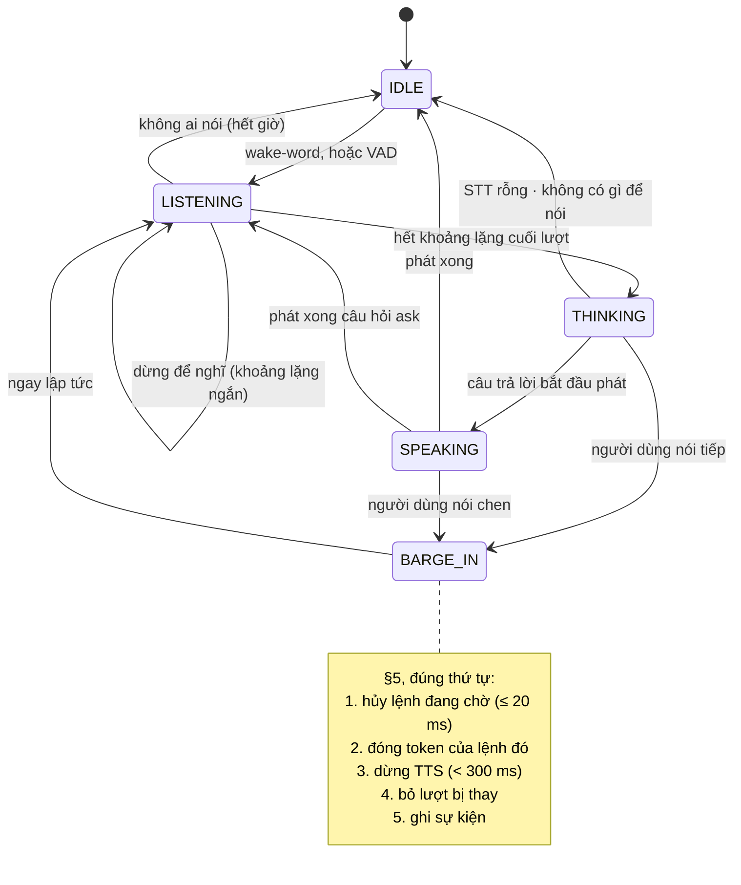

# Máy trạng thái hội thoại — đặc tả chuẩn tắc

**Trạng thái:** chuẩn tắc (TSK-S2-07). Hiện thực: Python cho `sim`/`linux` (TSK-S3-11; đường âm thanh
và provider STT/TTS: TSK-S3-13), C/C++ cho `esp32s3` (TSK-S5-03, S5-04); cả hai phải qua **một** bộ
vector tuân thủ (TSK-S3-10, §9). Yêu cầu: FR-PER-02 → FR-PER-05 (`neuroedge-prd.md` §4.4), FR-MDL-09,
FR-PER-07. Quyết định: Q-8 (hai ngôn ngữ), Q-12 (chuẩn OpenAI), Q-14 (mất mạng), Q-17 (`on_block`),
Q-26 (xác nhận `ask`).

Tài liệu này là nơi **duy nhất** định nghĩa máy trạng thái hội thoại và hợp đồng thu hồi lệnh vật
lý. Roadmap §3.8 giữ lý do phải có một đặc tả cho hai hiện thực; `docs/spec/hal_mcu_review.md` RB-3
dẫn về §5. Từ khoá **PHẢI**, **KHÔNG ĐƯỢC**, **NÊN** mang nghĩa như RFC 2119.

## 0. Vì sao máy trạng thái này chạm tới an toàn vật lý

Q-8 buộc có hai hiện thực: Python trên `sim`/`linux`, C/C++ trên `esp32s3`. FR-PER-02 đòi rằng khi
người dùng nói chen, lệnh actuator chưa thực thi phải bị thu hồi. Vì vậy hành vi cắt lời đi thẳng vào
miền hành động vật lý. Hai hiện thực cắt lời khác nhau sẽ thu hồi lệnh khác nhau, tức phá tương đương
target (FR-TGT-04) ở đúng miền nguy hiểm nhất. Cách giữ: **một đặc tả, hai hiện thực, một bộ vector**.

## 1. Phạm vi

Máy trạng thái điều phối **lượt nói**: khi nào nghe, khi nào nghĩ, khi nào nói, khi nào bị cắt lời.

- Nó **không** lượng giá gate và **không bao giờ** tự phát lệnh chân. Chân chỉ động qua `c.do()` →
  gate → token (`docs/spec/threat_model.md` §2). Máy trạng thái chỉ quyết định lượt nào còn hiệu lực,
  và hủy lệnh đang chờ theo §5.
- Không thuộc phạm vi: thuật toán AEC, VAD, wake-word (tích hợp thư viện có sẵn — PRD §4.4); STT, TTS
  và suy luận ngôn ngữ (chạy ở provider cloud — FR-PER-07). Máy trạng thái chỉ thấy **kết quả** của
  chúng qua các sự kiện §8; hợp đồng provider và cách khai (`[stt]`, `[tts]` trong `agent.toml`) ở
  `python/neuroedge/perception/providers/` (TSK-S3-13).

## 2. Mô hình: đầu vào, đồng hồ, tính tất định

- Máy trạng thái **PHẢI** chỉ đổi trạng thái theo **sự kiện đầu vào** (§8) và theo **đồng hồ đơn điệu
  tính bằng ms do bên ngoài cấp**, như engine gate (`ActionContractEngine(clock=…)`). Nó **KHÔNG ĐƯỢC**
  đọc giờ thực, sinh số ngẫu nhiên, hay tự đo thời gian ngoài đồng hồ đó.
- Cùng chuỗi sự kiện, ở cùng `offset_ms`, **PHẢI** cho cùng chuỗi trạng thái, cùng lệnh chân và cùng
  lệnh bị hủy, trên cả hai hiện thực. Đây là điều cho phép replay và bộ vector §9 chạy trong
  **thời gian ảo**.
- Mỗi lượt có một số thứ tự tăng dần (`turn`). Lệnh chân, câu hỏi `ask` và kết quả đến muộn đều gắn
  với lượt sinh ra chúng.

## 3. Năm trạng thái

| Trạng thái | Nghĩa | Micro | Loa |
|:---|:---|:---|:---|
| `IDLE` | Không có lượt nào mở. Chờ wake-word hoặc VAD | Nghe; đệm vòng giữ âm thanh trước khi kích hoạt (RB-2) | Im |
| `LISTENING` | Đang thu một lượt nói. Đếm khoảng lặng cuối lượt | Thu | Im |
| `THINKING` | Lượt đã đóng: chờ STT, model hoặc ngữ pháp cục bộ. Gate lượng giá ở đây, qua `c.do()` | Vẫn nghe, để phát hiện người dùng nói tiếp | Im |
| `SPEAKING` | Đang phát câu trả lời | Vẫn nghe (sau AEC), để phát hiện cắt lời | Phát |
| `BARGE_IN` | **Tạm thời.** Thực hiện hợp đồng §5, rồi sang `LISTENING` ngay, không chờ đầu vào | — | Dừng |

## 4. Bảng chuyển trạng thái

Bảng là quy phạm: một cặp (trạng thái, sự kiện) không có ở đây thì **không** đổi trạng thái. Tên sự
kiện ở §8; tham số (`end_of_turn_silence_ms`…) ở §6. Mã dòng `T01`…`T14` là thứ bộ vector §9 khai
trong `covers`.

| # | Từ | Sự kiện hoặc điều kiện | Sang | Hiệu ứng |
|:---:|:---|:---|:---|:---|
| T01 | `IDLE` | `wake_word_detected`; hoặc `audio_in_vad_start` khi hiện thực bật kích hoạt bằng VAD | `LISTENING` | Mở lượt mới |
| T02 | `LISTENING` | `audio_in_vad_end` | `LISTENING` | Bắt đầu đếm `end_of_turn_silence_ms` |
| T03 | `LISTENING` | `audio_in_vad_start` trong lúc đang đếm | `LISTENING` | Hủy bộ đếm: người nói dừng để nghĩ, không bị cắt (FR-PER-03) |
| T04 | `LISTENING` | Bộ đếm hết | `THINKING` | Đóng lượt, gửi âm thanh đi STT |
| T05 | `LISTENING` | Không có `audio_in_vad_start` nào trong `listen_timeout_ms` kể từ khi vào | `IDLE` | Đóng lượt, không làm gì |
| T06 | `THINKING` | `stt_result` với `text` rỗng | `IDLE` | Tối đa `max_reprompts` lượt hỏi lại liên tiếp, rồi im (FR-PER-05) |
| T07 | `THINKING` | `tts_stream_start` của lượt hiện tại | `SPEAKING` | — |
| T08 | `THINKING` | Lượt kết thúc mà không có gì để phát | `IDLE` | — |
| T09 | `THINKING` | Hết `think_timeout`, `system_two_unavailable`, hoặc `stt_unavailable` của lượt | `THINKING` | Theo §7: câu offline, rồi phát nó như mọi câu trả lời |
| T10 | `THINKING` | `audio_in_vad_start` | `BARGE_IN` | Người dùng nói tiếp: lượt đang nghĩ bị thay |
| T11 | `SPEAKING` | `tts_stream_end`, câu vừa phát là câu hỏi `ask` (RFC-0006) | `LISTENING` | Mở lượt mới cho câu trả lời |
| T12 | `SPEAKING` | `tts_stream_end` | `IDLE` | — |
| T13 | `SPEAKING` | `audio_in_vad_start` | `BARGE_IN` | — |
| T14 | `BARGE_IN` | (ngay khi vào) | `LISTENING` | §5, rồi mở lượt mới |

Mỗi lần đổi trạng thái **PHẢI** ghi `voice_state_changed` (§8).

## 5. Hợp đồng thu hồi lệnh vật lý

### 5.1 Lệnh đang chờ

Một **lệnh đang chờ** là lệnh chân mà gate đã `ALLOW` và token đã được cấp, nhưng **thời điểm giao
tới chân còn ở tương lai**: lệnh hẹn giờ (bắt đầu sau một độ trễ), hoặc lệnh xếp sau câu nói. Ngay khi
lệnh được giao tới chân — chân đã bật, xung đã bắt đầu — nó **không** còn là lệnh đang chờ.

### 5.2 Khi cắt lời

Vào `BARGE_IN`, hiện thực **PHẢI** làm đúng thứ tự:

1. **Hủy mọi lệnh đang chờ** của các lượt tới lượt hiện tại. Từ lúc nhận sự kiện kích cắt lời tới
   lúc chắc chắn chân sẽ không bị kích: **≤ 1 khung âm thanh = 20 ms** (khung Opus 20 ms, PRD Phụ lục
   D.2; RB-3). Mỗi lệnh bị hủy ghi `actuator_aborted {pin, reason: "ACTUATOR_ABORTED_BY_BARGE_IN"}`
   (`docs/spec/simulation_coverage.md` §3). Bước này **KHÔNG ĐƯỢC** chờ bước 3.
2. **Đóng token** của lệnh bị hủy (`TokenLedger.close` / `ne_token_close`): cùng phán quyết đó không
   bao giờ được kích chân về sau. Muốn làm lại phải có lượng giá gate mới, qua `c.do()` mới.
3. **Dừng TTS**: xả đệm DAC, ghi `tts_stream_end {duration_ms, reason: "barge_in"}`. Từ lúc người
   dùng bắt đầu nói tới lúc loa im: **< 300 ms**, kể cả độ trễ của VAD (FR-PER-02).
4. **Bỏ lượt bị thay.** Kết quả đến muộn của lượt cũ — STT, câu trả lời của model, tool call —
   **KHÔNG ĐƯỢC** gọi `c.do()` và **KHÔNG ĐƯỢC** được phát thành tiếng.
5. **Ghi** `voice_state_changed` vào `BARGE_IN`, rồi từ `BARGE_IN` sang `LISTENING`.

### 5.3 Lệnh đã giao thì chạy hết

Cắt lời **KHÔNG ĐƯỢC** cắt một lệnh đã giao tới chân. Ví dụ: `happy-path.json` mở khoá `door_lock
pulse 30000`, TTS nói "Door unlocked. Welcome home.", khách nói "cảm ơn" khi xung mới chạy được một
giây — xung vẫn chạy đủ 30 s và cửa vẫn mở cho khách vào.

Lý do: FR-PER-02 chỉ thu hồi lệnh **chưa thực thi**; lời nói thu hồi được, hành vi vật lý đã xảy ra thì
không (proposal §4.6). `PendingCommand.cancel()` của `LinuxHAL` cắt được một xung đang chạy, nhưng khả
năng đó dành cho tắt máy (SIGTERM), không cho cắt lời. Một cờ theo từng hành động kiểu "vẫn cắt khi đã
chạy" cần RFC, vì `gate.v1` không nhận trường lạ (`TODOS.md` #39).

### 5.4 Không bị cắt lời chạm tới

- **Câu hỏi `ask` đang chờ** (RFC-0006, `docs/spec/tool_calling.md` §6): cắt lời **KHÔNG ĐƯỢC** tiêu
  nó. Câu người dùng vừa nói chen có thể chính là câu trả lời. Câu hỏi chỉ hết theo TTL, hoặc khi được
  trả lời.
- **Phán quyết đã ghi**: cắt lời không sửa hay xoá sự kiện nào đã ghi; nó chỉ thêm sự kiện.

### 5.5 Hiện thực hôm nay

Python (TSK-S3-11): `digital.out(pin).pulse(…, after_ms=N)` là **lệnh hẹn giờ**. Trên `sim`
(`SimHAL`), gate lượng giá và token được tiêu ngay; chân chỉ được ghi và `actuator_command` chỉ được
ghi khi tới hạn (`PendingCommand.delivered`), do `perception.VoiceSession` giao trên đồng hồ tiêm vào.
Không có driver đó thì lệnh hẹn giờ bị từ chối. `LinuxHAL` chưa có lệnh hẹn giờ: nó **từ chối**
`after_ms` (`BoardCapabilityError`), không bao giờ giao sớm thay. Lệnh "xếp sau câu nói" chưa có ở
hiện thực nào. `esp32s3`: TSK-S4-01 và S5-04 (handle hủy được — RB-3). Hiện thực nào thêm lệnh hẹn giờ
mà không thêm §5.2 là sai đặc tả.

Ba ràng buộc của lệnh hẹn giờ, chốt ở lượt review của TSK-S3-11:

- **Giao trong TTL của phán quyết.** Thời điểm giao cách lúc cấp token không quá TTL của token
  (`p95_latency_ms` × 3, `actions/token.py`); vượt thì lệnh bị từ chối ngay lúc hẹn
  (`ActionContractViolation`). Phán quyết không bao giờ kích chân trên dữ kiện gate chưa thấy.
- **`after_ms` làm tròn lên**, không bao giờ xuống: 0,5 ms là 1 ms, vẫn là lệnh đang chờ. Âm thì bị từ chối.
- **Rào chắn là lệnh hủy, không phải token.** Trong Python, `c.do()` đã đóng token khi action trả về và
  `SimHAL.run_due()` không hỏi lại sổ token: chân đứng yên vì lệnh bị hủy (`run_due` bỏ qua lệnh đã hủy).
  Bước 2 của §5.2 vẫn chạy để bản C/C++, nơi token có thể còn mở, giữ cùng hợp đồng.
- **Action ném lỗi thì lệnh của nó bị hủy.** Lệnh action đã hẹn trước khi ném lỗi được hủy với
  `actuator_aborted {pin, reason: "ACTUATOR_ABORTED_BY_ACTION_ERROR"}`: phán quyết cho cả action, không
  cho nửa đã chạy.

## 6. Tham số

Các giá trị dưới đây chỉnh được, **không** phải hợp đồng an toàn. Hợp đồng là hai ngân sách của §5.2
(20 ms, 300 ms) và thứ tự các bước. Mỗi hiện thực khai giá trị mặc định của mình; mỗi ca vector ghi
giá trị nó dùng.

| Tham số | Nghĩa | Mặc định gợi ý |
|:---|:---|:---|
| `end_of_turn_silence_ms` | Khoảng lặng sau `audio_in_vad_end` để coi là hết lượt (FR-PER-03) | 700 |
| `listen_timeout_ms` | `LISTENING` không có tiếng nói thì về `IDLE` | 8000 |
| `think_timeout` | Chờ câu trả lời tối đa. System 2: `timeout_s` × `GRACE` của `[system_two]` (`models/providers/`); ngữ pháp cục bộ trả lời ngay | theo provider |
| `max_reprompts` | Số lượt hỏi lại liên tiếp khi STT rỗng, trước khi im | 1 |

Con số đo được trên bo mạch thay các giá trị gợi ý ở TSK-S5-01, S5-03.

## 7. Suy giảm và mất mạng

- Mất mạng thì gate **vẫn lượng giá** bằng ngữ pháp lệnh cục bộ; không có fallback chạy được thì
  hành động bị chặn với lý do `gate_unreachable` (Q-14, engine). Máy trạng thái không đổi điều đó.
- Hết `think_timeout` hoặc provider không trả lời: thiết bị nói câu offline (`reply_source` =
  `offline_help`, `docs/spec/tool_calling.md` §7) rồi về `IDLE`. Máy trạng thái **KHÔNG ĐƯỢC** biến một
  lần hết giờ thành `ALLOW`, và **KHÔNG ĐƯỢC** tự gọi lại `c.do()` (`threat_model.md` §2b).
- **STT không dùng được** — lỗi HTTP, hết giờ, không có key, câu trả lời không phải bản chép lời (không
  phải chữ, ký tự điều khiển, U+FFFD, dài hơn mọi lượt): `stt_unavailable {turn, reason}`, rồi T09 với
  câu offline nói rằng thiết bị không nghe được và lệnh gõ vẫn chạy (FR-MDL-03). Không bao giờ có bản
  chép lời bịa ra, không `c.do()`; bản chép lời đến sau của lượt đó bị bỏ (§5.2 bước 4). STT vẫn chưa trả
  lời khi hết `think_timeout` cũng là STT không dùng được. Bản chép lời **rỗng** từ một STT chạy tốt là
  "không nghe ra gì" — T06, không phải lỗi (V5).
- **TTS không dùng được:** `tts_unavailable {reason}` rồi `tts_stream_end {reason: "error"}` — câu vẫn
  được ghi và hiện (`tts_stream_start`), chỉ không phát thành tiếng; `error` kết thúc câu như `done`.
  Không thử lại.
- Hiện thực Python: `python/neuroedge/perception/voice_session.py` (đường âm thanh) và
  `python/neuroedge/perception/providers/` (adapter OpenAI audio, lỗi → `SpeechUnavailable`).
- Lỗi liên tiếp mở mạch ngắt (`engine/circuit_breaker.py`), đi thẳng fallback. Độ trễ của gate do
  `budget.p95_latency_ms` của chính gate quy định (FR-GATE-09). Đặc tả này **không** thêm ngưỡng
  P95 nào: NFR-PERF-07 (P95 < 1500 ms) là mục tiêu đo, không phải điều kiện kích hoạt.

## 8. Vết ghi

Danh mục **duy nhất** của sự kiện máy trạng thái hội thoại. Sự kiện theo nguyên thủy HAL ở
`docs/spec/simulation_coverage.md` §3; tool call, xác nhận, System 2 ở `docs/spec/tool_calling.md` §7.
Thêm sự kiện không cần RFC.

| Sự kiện | `data` | Vai trò | Có từ |
|:---|:---|:---|:---|
| `wake_word_detected` | `{word, score}` | Đầu vào | Mới |
| `audio_in_vad_start` | `{energy_db}` | Đầu vào | simulation_coverage §3 |
| `audio_in_vad_end` | `{}` | Đầu vào | Mới |
| `stt_result` | `{text, turn}` — `""` là không nghe ra gì; `turn` là lượt đã gửi âm thanh đi | Đầu vào | Mới |
| `stt_unavailable` | `{turn, reason}` — provider STT không cho được bản chép lời của lượt đó (§7) | Đầu vào (T09) | Mới (TSK-S3-13) |
| `audio_in_segment` | `{sha256, duration_ms, sample_rate_hz}` — âm thanh của lượt vừa gửi đi STT (T04), chỉ digest | Đầu ra | simulation_coverage §3 |
| `tts_stream_start` | `{text}` | Đầu vào của máy trạng thái (câu trả lời bắt đầu phát). Hiện thực Python tự sinh nó từ câu trả lời của lượt, nên `VoiceSession.feed` không nhận nó (§9.1); bản C/C++ nhận nó như đầu vào | simulation_coverage §3 |
| `tts_stream_end` | `{duration_ms, sha256?, reason?}` — `reason`: `done` · `barge_in` · `error` | Đầu vào khi `done` / `error`; **đầu ra** khi `barge_in` (§5.2 bước 3). Có provider TTS, hiện thực Python tự sinh cả `done` (hết âm thanh, kèm `sha256`) và `error` | simulation_coverage §3; `reason` mới |
| `tts_unavailable` | `{reason}` — provider TTS không tổng hợp được câu trả lời (§7) | Đầu ra, ngay trước `tts_stream_end` `error` | Mới (TSK-S3-13) |
| `system_two_unavailable` | `{task, reason}` | Đầu vào | tool_calling §7 |
| `voice_state_changed` | `{from, to, trigger, turn}` | Đầu ra | Mới |
| `actuator_aborted` | `{pin, reason}` | Đầu ra (§5.2 bước 1) | simulation_coverage §3 |
| `voice_reprompt` | `{turn, count}` — `count` là số lượt STT rỗng liên tiếp, ≤ `max_reprompts` | Đầu ra (T06) | Mới (TSK-S3-11) |
| `voice_late_result_dropped` | `{turn, input}` — `input`: `stt_result` · `stt_unavailable` · `system_two_reply` | Đầu ra (§5.2 bước 4) | Mới (TSK-S3-11) |

`trigger` là một trong: `wake_word`, `speech_start`, `turn_end`, `listen_timeout`, `transcript_empty`,
`reply_start`, `reply_empty`, `reply_end`, `ask_asked`, `barge_in`.

Lời người nói chỉ nằm ở trường `text` (`stt_result`, `text_input`, `command_not_recognized`), và câu
thiết bị nói ở `text` của `tts_stream_start`, nên chế độ ẩn danh (FR-TRC-07) băm chúng thành `sha256:`.
Ngoại lệ, có từ trước TSK-S3-13: câu hỏi `ask` của gate còn nằm nguyên trong `message` của
`tool_confirm_requested` và `gate_evaluation_result` — đó là chữ của gate (tệp gate, có digest), không
phải của người dùng. `reason` của `stt_unavailable` / `tts_unavailable` **KHÔNG ĐƯỢC** mang lời nói:
adapter OpenAI audio không trích thân câu trả lời của server vào lỗi, và lỗi lạ của một adapter tự viết
chỉ để lại tên lớp.

Replay và golden:

- **Đầu vào** được cấp lại ở đúng `offset_ms` đã ghi. Đặc biệt `audio_in_vad_start` trong lúc
  `SPEAKING` là **đầu vào**: replay phải cấp nó lại, thì `actuator_aborted` mới được **tính lại**. Nếu
  không, lần hủy biến mất khi replay và golden báo lệch.
- `actuator_aborted` nằm trong phần so golden của `replay` / `verify` (`testing/golden.py`).
  `voice_state_changed` thì không, vì phụ thuộc thời gian; nó được so trong bộ vector §9.

## 9. Tuân thủ — đầu vào của TSK-S3-10

Một hiện thực được gọi là **tuân thủ** khi qua toàn bộ corpus `fixtures/compliance/voice/` với
`expected_results.yaml`, khép kín hai chiều như mọi corpus (`CONTRIBUTING.md` §3). Corpus **không**
nằm ở gốc `fixtures/traces/`: thư mục đó giữ đúng ba vết ghi chuẩn mực của miền quyết định, và sửa ở
đó cần RFC. Giai đoạn 2 mở rộng sang `fixtures/compliance/multimodal/` (TSK-V3-02).

- **Tệp ca**: agent (một thư mục của `fixtures/agents/`), tham số §6 dùng cho ca, dữ kiện gate, và chuỗi
  sự kiện đầu vào §8 kèm `offset_ms` — thời gian ảo.
- **Đáp án**: chuỗi `voice_state_changed`, phán quyết gate, mọi lệnh chân và lệnh bị hủy theo đúng thứ
  tự, lý do dừng TTS. Thời gian chỉ so trong thời gian ảo; ví dụ `actuator_aborted` ở cùng `offset_ms`
  với sự kiện kích cắt lời.
- Hiện thực C/C++ chỉ được nghiệm thu khi qua **toàn bộ** corpus (roadmap §3.8, TSK-S5-03).

Kịch bản bắt buộc:

| # | Kịch bản | Đáp án phải có |
|:---:|:---|:---|
| V1 | Cắt lời khi có lệnh hẹn giờ đang chờ | `actuator_aborted` (`ACTUATOR_ABORTED_BY_BARGE_IN`) · chân không bao giờ nhận xung · dùng lại token bị từ chối |
| V2 | Cắt lời khi xung đang chạy | Xung chạy đủ thời lượng · không có `actuator_aborted` |
| V3 | Người dùng nói tiếp lúc `THINKING`, trước khi có câu trả lời | Câu trả lời đến muộn không được phát · lượt cũ không gọi `c.do()` |
| V4 | Cắt lời giữa câu hỏi `ask` | Câu hỏi vẫn mở · "có" ở lượt sau, trong TTL, xác nhận được |
| V5 | 20 khung nhiễu liên tiếp (VAD kích, STT rỗng) | Mỗi lần về `IDLE` · không quá `max_reprompts` lần hỏi lại liên tiếp · lệnh thật sau đó vẫn chạy (FR-PER-05) |
| V6 | Provider hết giờ / mất mạng | Câu offline · gate vẫn lượng giá bằng ngữ pháp cục bộ, hoặc `gate_unreachable` · không bao giờ `ALLOW` vì hết giờ |
| V7 | Người nói chậm: khoảng lặng ngắn hơn `end_of_turn_silence_ms` giữa câu | Không bị cắt lượt (FR-PER-03) |

Hai ngân sách thời gian thực (20 ms, 300 ms) **không** kiểm được trong thời gian ảo. Chúng được đo trên
bo mạch, ở tiêu chí ra 2 của Sprint 5 và job hằng đêm TSK-S4-05.

### 9.1 Quy ước của bộ vector (TSK-S3-10)

Mỗi ca là một tệp JSON; khoá của nó, và đáp án `{proves, events}` trong `expected_results.yaml`, được
`neuroedge/testing/voice_corpus.py` thẩm định. Agent của corpus là `fixtures/agents/voice-door/`.

- **Ca:** `scenario` (`V1`…`V7`), `covers` (dòng §4), `agent`, `params` (§6, phần không ghi lấy mặc
  định gợi ý; `think_timeout_ms` và `vad_activation` — bật T01 bằng VAD — cũng là tham số), `world`
  (`facts`, `unset_facts`, `sensors`, `system_two` — có provider hay không, `facts_source` —
  `local_grammar` hoặc `unreachable`: model quyết dữ kiện mất mạng và không có fallback cục bộ),
  `inputs`, `until_ms`.
- **Đầu vào:** các sự kiện đầu vào §8, cộng hai đầu vào chỉ của corpus: `system_two_reply {turn,
  text?, tool_calls?}` — câu trả lời kịch bản hoá của provider cho một lượt; `reuse_token {pin}` — lái
  lại chân bằng token của lệnh vừa bị hủy (V1). `tts_stream_start` không phải đầu vào của ca: thiết bị
  tự phát câu trả lời. `tts_stream_end` đầu vào chỉ mang `done` hoặc `error`.
- **Qua provider giả.** Hiện thực Python chạy mỗi ca hai lần, cùng một đáp án (TSK-S3-13): một lần cấp
  đầu vào như ghi, một lần qua STT và TTS giả kịch bản hoá từ ca — bản chép lời (hoặc `stt_unavailable`)
  ra từ đường STT, ở đúng `offset_ms` của đầu vào; câu trả lời phát tới đúng `tts_stream_end` của ca.
  Đầu vào không provider nào sinh được (bản chép lời thứ hai của cùng lượt) vẫn cấp như ghi
  (`neuroedge/testing/voice_corpus.py`).
- **Đáp án so được:** `voice_state_changed`, `action_requested` (tức `c.do()` được gọi),
  `gate_evaluation_result` (`verdict`, `reason`, `action`), `actuator_command`, `actuator_aborted`,
  `actuator_command_rejected`, `tts_stream_start` (`text` chỉ khi đáp án ghi), `tts_stream_end` với
  `barge_in`, `tool_confirm_requested` / `tool_confirmed` / `tool_confirm_declined` /
  `tool_confirm_expired`, `voice_reprompt`, `voice_late_result_dropped` — đủ, đúng thứ tự, đúng
  `offset_ms`.
- **Thứ tự trong cùng một ms.** Hạn chót có offset **nhỏ hơn** một đầu vào được xử lý trước đầu vào đó,
  sớm trước; trong cùng một hạn, lệnh hẹn giờ được giao trước bộ đếm của máy trạng thái. Đầu vào ở
  **đúng** ms của một hạn chót đi **trước** hạn đó: cắt lời đúng ms lệnh hẹn giờ tới hạn thì lệnh bị
  hủy (fail-closed); tiếng nói đúng ms hết `end_of_turn_silence_ms` thì lượt tiếp tục. Ở `until_ms`,
  mọi hạn chót tới và bằng nó đều chạy.
- **Hiệu ứng trước trạng thái.** Sự kiện hiệu ứng của một dòng được ghi trước `voice_state_changed` của
  dòng đó, như §5.2 đặt bước 1–4 trước bước 5. Dòng ở lại trạng thái cũ (T02, T03, T09) không ghi
  `voice_state_changed`.
- **Lượt.** `turn` của `X → BARGE_IN` là lượt bị thay; `BARGE_IN → LISTENING` mang lượt mới. Bộ đếm
  `think_timeout` chạy từ lúc vào `THINKING`. Chỉ một kết quả cho lượt đang `THINKING` được tác động;
  mọi kết quả khác ghi `voice_late_result_dropped` và không làm gì.

## 10. Để mở

- Cờ theo từng hành động "vẫn cắt khi đã chạy" (§5.3): cần RFC — `TODOS.md` #39.
- FR-PER-04 (P1, rút lại lời khi model đổi kết luận): quan hệ giữa lời bị rút lại và lệnh đang chờ của
  lượt đó chưa chốt. TSK-S3-11 và TSK-S3-13 **không** chốt: hiện thực Python tổng hợp cả câu trả lời
  rồi mới phát, và STT theo chuẩn OpenAI (`/v1/audio/transcriptions`) chỉ trả một bản chép lời cuối mỗi
  lượt — chưa có lời nào phát từng phần để rút, chưa có bản chép lời từng phần. Khi có (client
  streaming TSK-S5-06; micro và loa trên máy tính sau TSK-S5-08): bản chép lời từng phần **KHÔNG
  ĐƯỢC** chạy lượt; chốt kèm `Q-N`.
- **Lời hỏi lại của T06 được phát thế nào.** T06 sang `IDLE` (loa im, §3) nhưng hiệu ứng là "hỏi lại".
  TSK-S3-11 chọn cách hẹp: máy trạng thái chỉ ghi `voice_reprompt` (đếm, cưỡng chế `max_reprompts`) và
  không phát gì, không đổi trạng thái. TSK-S3-13 giữ nguyên: phát lời hỏi lại nghĩa là nói trong `IDLE`
  (trái §3) hoặc cho T06 sang `SPEAKING` — đổi đáp án của V5 và của mọi ca T06, nên cần một `Q-N` trước.
- **Cắt lời lúc `THINKING`** không ghi `tts_stream_end`: không có luồng nào đang phát (§3). Bước 1, 2,
  4, 5 của §5.2 vẫn chạy đủ.
- **`system_two_unavailable`** chỉ kích T09 khi lượt đang chờ provider; lượt đã có câu trả lời từ ngữ
  pháp cục bộ không bị câu offline chen vào. `tts_stream_end` với `error` kết thúc câu như `done`.
- **Lệnh hẹn giờ trên `linux`** và lệnh "xếp sau câu nói": chưa có (§5.5). Phiên thoại trên `linux`
  (`VoiceSession` ngoài `sim`) đến cùng TSK-S5-08; nó cắm nguồn khung âm thanh và loa `sounddevice` vào
  đúng hai vai `hal/audio.py` định nghĩa cho `sim` (tệp WAV, dòng thời gian WAV).
- **Hai ngân sách §5.2 trên `sim`** là thời gian ảo: loa dừng đúng ms VAD xác nhận tiếng nói chen (VAD
  năng lượng cần 60 ms tiếng nói), không đo được độ trễ âm thanh thật. Đo trên bo mạch (§9).
- **Hết lời thì không còn thu hồi được.** Chỉ `THINKING` và `SPEAKING` kích cắt lời (§4). Khi câu trả
  lời đã phát xong (`IDLE`, rồi `LISTENING` của lượt mới), người dùng nói "thôi, đừng mở" thì lệnh hẹn
  giờ của lượt trước vẫn được giao. TTL của phán quyết (§5.5) chặn trên khoảng đó, nhưng không thay được
  ý định thu hồi. TSK-S3-13 không chốt — đây là quyết định sản phẩm (hủy lệnh đang chờ khi mở lượt mới,
  hay một intent "hủy"), cần `Q-N`; hôm nay lệnh hẹn giờ vẫn chỉ có trên `sim`.
- **Chân trời hẹn giờ đang mượn TTL của phán quyết (§5.5).** Hôm nay khoảng hẹn tối đa = `p95_latency_ms`
  × 3, nên muốn hẹn N ms phải khai p95 ≥ N/3 — nới luôn ngưỡng fail-closed về độ trễ của gate (`voice-door`
  đã phải nâng 120 → 700). Hai tham số này khác nghĩa. Hướng được đề xuất, theo mẫu select-before-operate
  (IEC 61850 `sboTimeout`, DNP3 CROB) và timed interaction của Matter: một **chân trời hẹn giờ riêng**, mặc
  định nhỏ và có trần cứng theo board, cộng **lượng giá lại gate lúc giao** cho lệnh vượt TTL (điều kiện
  kiểm lại lúc dùng, như caveat thời gian của macaroon). Khai chân trời trong gate cần RFC (`gate.v1` không
  nhận trường lạ); khai trong board hay `agent.toml` thì không. Kỹ thuật trưởng chốt, kèm `Q-N`.
- Giá trị mặc định của §6: đo và chốt trên bo mạch (TSK-S5-01, S5-03).
