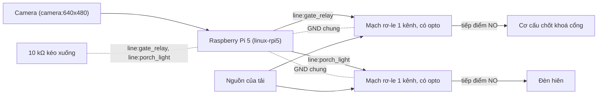

# Kit 4 — Camera cổng (`gate-camera`)

> **Mã task:** TSK-I2b-02. Quy trình chung, quy tắc an toàn và danh sách việc chưa kiểm:
> [`kit-phan-cung.md`](kit-phan-cung.md). Trang này chỉ nói riêng về kit.

Một camera nhìn cổng. Khi mô hình thấy **người lạ** trong vùng cổng, agent bật đèn hiên và khoá cổng; mọi
trường hợp còn lại — không có người lạ, mô hình không chắc, khung hình quá cũ, camera mất, người trong nhà
chưa đồng ý ghi hình, có người trong vùng riêng tư — thì **chặn** và chân không đổi. Camera chỉ cấp dữ kiện
(nhãn, vùng, điểm tin cậy, RFC-0012); ngưỡng nằm ở gate (Q-54), và mô hình thay được mà gate không đổi.

## Gate đã khoá

`stranger_light@1.0.0` và `stranger_lock@1.0.0` nằm ở `fixtures/agents/gate-camera/gates/`, có digest trong
`digests.lock`. Cả hai **kế thừa `gates/home/camera@1.0.0`** của thư viện khởi đầu và chỉ siết thêm:

| Điều kiện | Nguồn | Gate cha khoá? |
|:---|:---|:---|
| `recording_consent`: người trong nhà đã đồng ý ghi hình | dữ kiện phiên (`[sim.facts]`; trên thiết bị là công tắc hoặc chế độ nhà) | có |
| `person_in_private_zone: false` và `private_zone_confidence ≤ 0,10` | camera, vùng `private_zone` | có, kèm `max_age_ms` 300 |
| `stranger_at_gate: true` và `stranger_confidence ≥ 0,85` (đèn) hoặc `≥ 0,90` (khoá) | camera, vùng `gate_area`, nhãn `unknown_person` | gate con thêm |

Mỗi tiêu chí thị giác được xét trên **từng khung** của cửa sổ và các kết quả được AND lại; số điểm tin cậy
mang `max_age_ms`, nên một camera đứng hình lặp "không có ai" không chứng minh được vùng riêng tư trống, và
mất camera là `criterion_unavailable`. Sửa gate đã khoá cần RFC (`CONTRIBUTING.md` §3).

## BOM

Mô tả theo chức năng và thông số. **Không có mã hàng, giá hay nhà bán**; mọi dòng "chưa kiểm trên phần cứng thật".

| # | Hạng mục | Thông số | `linux` (Pi 5) |
|:--|:---|:---|:---|
| 1 | Bo điều khiển | Raspberry Pi 5 (profile `linux-rpi5`) | có |
| 2 | Camera | Camera CSI hoặc USB cho V4L2, ít nhất 640×480 ở 30 khung/s (profile khai hai chế độ: 640×480 `rgb888`, 1280×720 `yuyv`) | có |
| 3 | Mạch rơ-le (khoá cổng) | Một kênh, đầu vào 3,3 V tương thích, có opto cách ly, tiếp điểm chịu đủ dòng của cơ cấu chốt | có |
| 4 | Cơ cấu chốt khoá cổng | Chốt điện (xung kích 30 s) hoặc khoá điện từ do thợ lắp; nguồn riêng, tách khỏi nguồn của bo | có |
| 5 | Mạch rơ-le (đèn) | Một kênh như dòng 3 | có |
| 6 | Đèn hiên | Đèn của gia đình hoặc đèn thử 12 V; **thử bằng LED + điện trở trước** | có |
| 7 | Điện trở kéo xuống | 10 kΩ từ mỗi chân `gate_relay`, `porch_light` về GND | có |
| 8 | Nguồn cho bo | Nguồn 5 V cho Pi 5 | có |

Kit này **không build trên `esp32s3-box-3`** (bo không khai `vision.in`; `NE3001`) và không chạy trên
`sim-default`. Mô hình nhận diện "người lạ" là của bạn: kho chỉ có mô hình giả có kịch bản
(`provider = "replay"`), đổi sang mô hình thật là đổi `provider` ở `[vision]`, không sửa mã action.

## Sơ đồ đấu dây

Nhãn `line:<tên>` là tên chân của bo trong `boards/*.toml`; `camera:<rộng>x<cao>` là một chế độ trong
`[capabilities.vision_in.modes]`. Test `python/tests/test_kits.py` kiểm cả hai với profile bo. Số chân
vật lý của header Pi chưa được gán trong kho. Chỉ có sơ đồ cho `linux-rpi5`: Box-3 không có camera.

<!-- wiring: linux-rpi5 -->


## Từ hộp tới chạy thật

Quy trình chung ở [`kit-phan-cung.md`](kit-phan-cung.md) §2. Riêng kit này, camera là **bước thêm** (cần bo có
`vision.in`):

```bash
neuroedge new cong --template gate-camera && cd cong
neuroedge build --target sim --board sim-rpi5
neuroedge test
neuroedge run --board sim-rpi5       # REPL; camera ảo phát lại kịch bản: khung 5–12 có người lạ ở cổng
```

- **`sim-rpi5`**: camera ảo; `neuroedge test` chạy sáu ca (cho phép đèn và khoá; không có ai, điểm 0,60,
  người trong vùng riêng tư, thiếu đồng ý, camera mất ⇒ BLOCK, chân không đổi).
- **`linux` trên Pi 5**: đặt `NEUROEDGE_LINUX_CAMERA=/dev/videoN`; HAL mở đúng chế độ bo khai và từ chối
  nếu driver làm tròn. Agent được phát lại bằng nhãn đã ghi, không cần camera (`neuroedge verify`).
  Test: `python/tests_linux/test_kit_gate_camera.py` (camera ảo `vivid`, chân `gpio-sim`; job `linux-hal`).
- Ảnh thô không bao giờ vào vết ghi: vết chỉ có băm và kích thước khung (NFR-PRIV-03).

## Vết golden

`fixtures/traces/kits/gate-camera-allow.json` (người lạ ⇒ đèn bật, cổng khoá: ALLOW ×2),
`gate-camera-block.json` (không có ai, thiếu đồng ý, điểm 0,60, người trong vùng riêng tư, camera mất ⇒
BLOCK ×5, chân không đổi). Sinh bằng `scripts/gen_kit_traces.py`; `neuroedge verify` phát lại trên các bo
khai `vision.in`.
