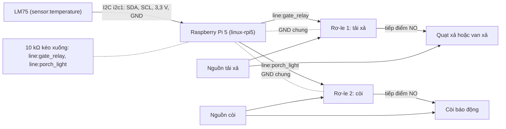
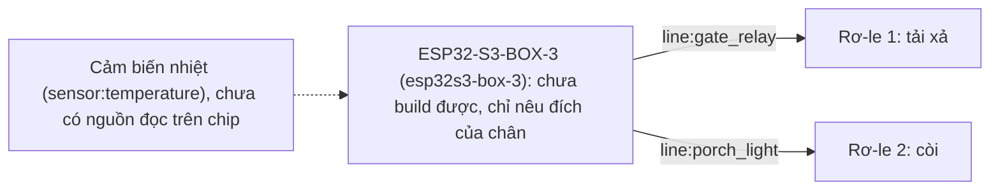

# Kit 3 — Giám sát phòng máy (`factory-monitor`)

> **Mã task:** TSK-I2b-01. Quy trình chung, quy tắc an toàn và danh sách việc chưa kiểm:
> [`kit-phan-cung.md`](kit-phan-cung.md). Trang này chỉ nói riêng về kit.

Giám sát môi trường công nghiệp theo proposal §1.6 mục 3: cảm biến nhiệt cấp một dải nhiệt
(`low · normal · high · critical`), và hai tải vật lý đi qua gate — **tải xả** (quạt xả, hoặc cuộn van xả
điện từ: cùng chân `gate_relay`, cùng gate `vent_*`) và **còi báo động** (chân `porch_light`, gate
`alarm_*`). Tên mẫu `factory-monitor` giữ nguyên; lý do và phạm vi chỉnh ở
[`kit-phan-cung.md`](kit-phan-cung.md) §1.

| Lệnh | Gate quyết |
|:---|:---|
| `bật quạt` | `vent_on`: luôn cho phép (thêm không khí là an toàn) |
| `tắt quạt` | `vent_off`: tới `normal` cho phép; `high` hỏi lại người trên thiết bị; `critical` chặn, không hỏi |
| `bật báo động` | `alarm_on`: luôn cho phép |
| `tắt báo động` | `alarm_off`: trên `normal` chặn — không ai tắt còi khi phòng còn nóng |

Đọc cảm biến mất, hỏng hay dưới -40 °C ⇒ cả hai dữ kiện chưa xác định: `tắt quạt` và `tắt báo động` bị chặn,
không hỏi; `bật quạt`, `bật báo động` vẫn chạy. Chi tiết dải và ngưỡng: `README.md` của dự án sinh ra.

## Gate đã khoá

Bốn gate `vent_on`, `vent_off`, `alarm_on`, `alarm_off` (`@1.0.0`) ở `fixtures/agents/factory-monitor/gates/`
có digest trong `digests.lock`. Sửa chúng cần RFC (`CONTRIBUTING.md` §3).

## BOM

Mô tả theo chức năng và thông số. **Không có mã hàng, giá hay nhà bán**, trừ cảm biến nhiệt mà kho đã nêu
tên (LM75, đọc qua hwmon). Mọi dòng "chưa kiểm trên phần cứng thật".

| # | Hạng mục | Thông số | `linux` (Pi 5) | `esp32s3` |
|:--|:---|:---|:---|:---|
| 1 | Bo điều khiển | Raspberry Pi 5 (profile `linux-rpi5`) | có | — |
| 2 | Bo điều khiển | ESP32-S3-BOX-3 | — | **chưa build được** (agent khai `supported = ["sim", "linux"]`: dải nhiệt `[sim.sensor_facts]` chỉ có trên `sim` và `linux`) |
| 3 | Cảm biến nhiệt | LM75 trên bus I2C (kernel nạp driver `lm75`, đọc `hwmon:lm75/temp1`), dải đo bao trọn -40 đến 125 °C | có | — |
| 4 | Mạch rơ-le tải xả | Một kênh, đầu vào 3,3 V tương thích, có opto, tiếp điểm chịu dòng của quạt xả hoặc cuộn van; tải xoay chiều do thợ điện đấu | có | — |
| 5 | Tải xả | Quạt xả thông gió, hoặc van xả điện từ; loại van tự đóng khi mất điện thì mất điện là an toàn hay không phải do thiết kế van quyết, kit không kiểm | có | — |
| 6 | Mạch rơ-le còi | Như dòng 4, một kênh | có | — |
| 7 | Còi báo động | Còi hoặc chuông báo động theo điện áp của nguồn còi | có | — |
| 8 | Điện trở kéo xuống | 10 kΩ từ mỗi chân `gate_relay`, `porch_light` về GND | có | — |
| 9 | Nguồn | Nguồn 5 V cho Pi; nguồn riêng cho từng tải | có | — |

Trên ESP32-S3-BOX-3 kit này **chưa build được**, nên chưa có BOM cho nó: nếu sau này agent khai `esp32s3`,
phần thay đổi là dòng 1 và 3 (Box-3 không phơi bus I2C đã kiểm trong kho) — sơ đồ ESP32 dưới đây chỉ cho
biết đích của các chân.

## Sơ đồ đấu dây

Nhãn `line:<tên>` là tên chân của bo trong `boards/*.toml`; `sensor:<tên>` là tên cảm biến trong
`[capabilities.sensor_read]`. Test `python/tests/test_kits.py` kiểm cả hai. Số chân vật lý của header Pi
chưa được gán trong kho: bạn chọn chân, miễn line mang đúng tên.

<!-- wiring: linux-rpi5 -->


<!-- wiring: esp32s3-box-3 -->


## Từ hộp tới chạy thật

Quy trình chung ở [`kit-phan-cung.md`](kit-phan-cung.md) §2. Riêng kit này (`sim` khởi động ở 45 °C, dải `high`):

```bash
neuroedge new xuong --template factory-monitor && cd xuong
neuroedge run -c "bật quạt"           # ALLOW: gate_relay bật
neuroedge run -c "tắt quạt"           # BLOCK ask: hỏi xác nhận (đang nóng)
neuroedge run -c "tắt báo động"       # BLOCK deny
neuroedge test
```

Trong REPL: `:sensor temperature 60` rồi `tắt quạt` ⇒ chặn, không hỏi; `:sensor temperature 30` rồi
`tắt báo động` ⇒ cho phép.

- **`linux` trên Pi 5**: cùng agent, số đọc đến từ LM75 qua hwmon:
  `NEUROEDGE_LINUX_SENSORS="temperature=hwmon:lm75/temp1" neuroedge run --target linux`. Kernel báo đơn vị
  khác `C` thì số đọc bị từ chối. Test: `python/tests_linux/test_kit_factory_monitor.py` (cùng LM75 giả của
  `i2c-stub` mà `test_sensor_display.py` dùng).
- **`esp32s3`**: không build (xem BOM dòng 2).

## Vết golden

`fixtures/traces/kits/factory-monitor-allow.json` (bật quạt, bật báo động, tắt quạt khi `normal`, tắt báo
động khi đã nguội ⇒ ALLOW), `factory-monitor-block.json` (tắt quạt lúc `high` và `critical`, tắt báo động
lúc nóng, số đọc không hợp lệ ⇒ BLOCK, chân không bao giờ đổi). Sinh bằng `scripts/gen_kit_traces.py`;
`neuroedge verify` phát lại.
