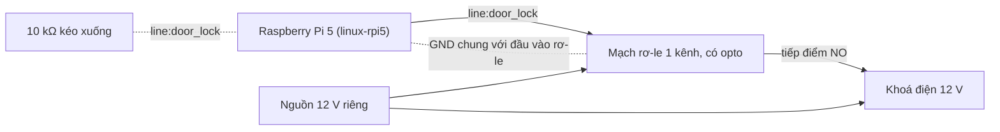
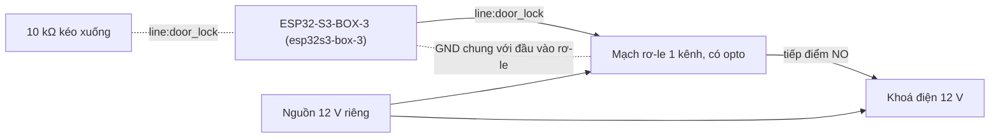

# Kit 1 — Khoá cửa villa (`villa-concierge`)

> **Mã task:** TSK-I2b-01. Quy trình chung, quy tắc an toàn và danh sách việc chưa kiểm:
> [`kit-phan-cung.md`](kit-phan-cung.md). Trang này chỉ nói riêng về kit.

Agent nhận lệnh "mở cửa phòng 101", đưa qua gate `unlock_door@1.2.0` và chỉ khi gate cho phép mới cấp
**một xung** (mặc định 30 s) vào chân `door_lock`. Gate đòi khách đã xác thực, mức rủi ro không quá `low`
và số phòng khớp hồ sơ đặt phòng; thiếu một thứ ⇒ chặn và chuyển lễ tân.

## Gate đã khoá

`unlock_door@1.2.0` nằm ở `gates/unlock_door@1.2.0.yaml` (kế thừa `gates/hospitality/base-access@1.0.0.yaml`)
và đã có digest trong `digests.lock`. Agent trỏ tới nó bằng `neuroedge://gates/unlock_door@1.2.0`, nên
dự án sinh ra không mang bản sao nào để lệch. Sửa nó cần RFC (`CONTRIBUTING.md` §3).

## BOM

Mô tả theo chức năng và thông số. **Không có mã hàng, giá hay nhà bán**; mọi dòng "chưa kiểm trên phần cứng thật".

| # | Hạng mục | Thông số | `esp32s3` | `linux` (Pi 5) |
|:--|:---|:---|:---|:---|
| 1 | Bo điều khiển | ESP32-S3-BOX-3 (bo tham chiếu duy nhất, có codec, micro, loa, màn hình 320×240) | có | — |
| 2 | Bo điều khiển | Raspberry Pi 5 (profile `linux-rpi5`: "Raspberry Pi 5 + I2S HAT") | — | có |
| 3 | Mạch rơ-le | Một kênh, đầu vào 3,3 V tương thích, có opto cách ly, tiếp điểm chịu đủ dòng của khoá | có | có |
| 4 | Khoá điện | Chốt hoặc ghim điện từ 12 V cho cửa; loại tự khoá hay tự mở khi mất điện chọn theo lối thoát hiểm của toà nhà | có | có |
| 5 | Nguồn cho khoá | Nguồn 12 V riêng, đủ dòng khởi động của khoá; không dùng chung với nguồn của bo | có | có |
| 6 | Điốt dập ngược | Mắc song song cuộn khoá nếu mạch rơ-le không có sẵn | có | có |
| 7 | Điện trở kéo xuống | 10 kΩ từ chân `door_lock` về GND, để chân thả nổi là khoá không mở | có | có |
| 8 | Nguồn cho bo | Theo bo (USB-C cho Box-3; nguồn 5 V cho Pi 5) | có | có |
| 9 | Phần giọng nói (Pi 5) | HAT I2S và micro mà profile mô tả; **profile khai `aec = false`** nên agent không build trên `linux-rpi5` | — | chưa dùng được |

## Sơ đồ đấu dây

Nhãn `line:<tên>` là **tên chân của bo** trong `boards/*.toml`. Test `python/tests/test_kits.py` kiểm mọi
`line:` ở đây có thật trong profile bo tương ứng và mọi chân agent cần đều xuất hiện, để tài liệu không lệch.
Số chân vật lý của header Pi và GPIO của ESP32 **chưa được gán trong kho** (xem
[`kit-phan-cung.md`](kit-phan-cung.md) §2 bước 4): bạn chọn chân, miễn line mang đúng tên.

<!-- wiring: linux-rpi5 -->


<!-- wiring: esp32s3-box-3 -->


## Từ hộp tới chạy thật

Quy trình chung ở [`kit-phan-cung.md`](kit-phan-cung.md) §2. Riêng kit này:

```bash
neuroedge new villa --template villa-concierge && cd villa
neuroedge run -c "mở cửa phòng 101"      # ALLOW: door_lock bật 30 s
neuroedge run -c "mở cửa phòng 202"      # BLOCK room_matches, chuyển lễ tân
neuroedge run -c "mở cửa"                # BLOCK: không có số phòng, dữ kiện chưa xác định
neuroedge test
neuroedge build --target esp32s3 --board esp32s3-box-3     # firmware; nạp: nap-firmware.md
```

- **`sim`**: chạy được ngay (`neuroedge run`, `run --ui`).
- **`linux` trên Pi 5**: `neuroedge build --target linux --board linux-rpi5` bị từ chối (`NE3003`) vì agent
  đòi `audio.in` có AEC mà profile Pi 5 khai `aec = false`; kho **không** hạ yêu cầu đó cho khớp. Phần khoá và
  gate vẫn chạy được trên chân GPIO thật: test `python/tests_linux/test_kit_villa_concierge.py` dùng một bản
  sao của agent chỉ khai `digital.out` để chứng minh ALLOW cấp xung vào line `door_lock`, còn BLOCK thì line
  không bao giờ đổi mức. Đường tới giọng nói trên Pi 5 cần một profile có AEC (I5), chưa có.
- **`esp32s3`**: build ra project ESP-IDF; firmware chưa điều khiển chân (TSK-S4-01).

## Vết golden

`fixtures/traces/kits/villa-concierge-allow.json` (đúng phòng ⇒ ALLOW, xung 30 s),
`villa-concierge-block.json` (phòng sai, thiếu số phòng, rủi ro cao ⇒ BLOCK, chân không bao giờ đổi).
Sinh bằng `scripts/gen_kit_traces.py`; `neuroedge verify` phát lại.
