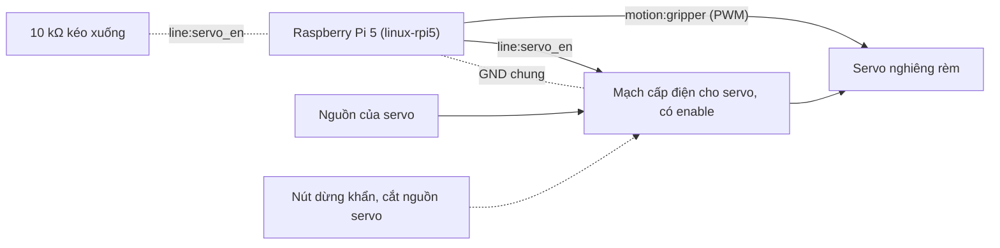

# Kit 5 — Rèm cửa (`blinds`)

> **Mã task:** TSK-I2b-02. Quy trình chung, quy tắc an toàn và danh sách việc chưa kiểm:
> [`kit-phan-cung.md`](kit-phan-cung.md). Trang này chỉ nói riêng về kit.

Rèm lá nghiêng bằng một servo (`motion.*`, RFC-0011): **mở** (90°) và **đóng** (0°). Mỗi lệnh qua gate rồi
nhận một **lease** một lệnh trong 200 ms; không ai gia hạn thì kênh về `safe_state` của nó (`hold`: giữ vị trí
tối đa `max_hold_ms` = 2 s rồi cắt điện). **Phong bì thời gian** của kênh cắt lệnh vượt mức dù gate đã cho
phép. Kit làm cho rèm lá; cửa cuốn xem phần "Giới hạn" cuối trang.

## Gate đã khoá

`blinds_open@1.0.0` và `blinds_close@1.0.0` nằm ở `fixtures/agents/blinds/gates/`, có digest trong
`digests.lock`. Cả hai **kế thừa `gates/home/light@1.0.0`** của thư viện khởi đầu và chỉ siết thêm:

- (gate cha) bộ truyền động không báo lỗi (`device_fault_free`: người có mặt **không** trả lời thay được);
  ngoài giờ yên tĩnh (`quiet_hours_ok`: người có mặt nói "có" thì xét lại);
- `estop_released`: nút dừng khẩn đã nhả;
- `blinds_close` thêm `path_clear`: khe rèm không có vật hay tay (đóng là chiều có thể kẹp);
- ngân sách 100 ms = `lease_ms / 2` của kênh, kiểm lúc `neuroedge build`.

Lệnh theo hướng an toàn (về `safe_state`, dừng) không bao giờ qua gate (RFC-0011). Sửa gate đã khoá cần RFC.

## BOM

Mô tả theo chức năng và thông số. **Không có mã hàng, giá hay nhà bán**; mọi dòng "chưa kiểm trên phần cứng thật".

| # | Hạng mục | Thông số | `linux` (Pi 5) |
|:--|:---|:---|:---|
| 1 | Bo điều khiển | Raspberry Pi 5 (profile `linux-rpi5`) | có |
| 2 | Servo nghiêng rèm | Servo mô hình điều khiển bằng xung PWM, hành trình ít nhất 90°, đủ mô-men cho trục lá rèm | có |
| 3 | Mạch cấp điện cho servo | Có chân enable từ bo (`servo_en`): enable thấp là servo mất điện; nguồn riêng, tách khỏi nguồn của bo | có |
| 4 | Điện trở kéo xuống | 10 kΩ từ chân `servo_en` về GND (chân thả nổi ⇒ servo tắt) | có |
| 5 | Nút dừng khẩn | Nút nhấn giữ, cắt nguồn của servo bằng phần cứng, độc lập với phần mềm | có |
| 6 | Cảm biến khe rèm (tuỳ chọn) | Công tắc hoặc cảm biến phát hiện vật kẹp; kit mô phỏng `path_clear` bằng dữ kiện phiên | có |
| 7 | Nguồn cho bo | Nguồn 5 V cho Pi 5 | có |

Kit **không build trên `esp32s3-box-3`** và `sim-default` (không khai `motion`). Kênh `gripper` là tên kênh
servo của profile; kit dùng nó làm trục nghiêng của rèm lá.

## Sơ đồ đấu dây

Nhãn `line:<tên>` là tên chân của bo trong `boards/*.toml`; `motion:<kênh>` là tên kênh trong
`[[capabilities.motion.servo]]`. Test `python/tests/test_kits.py` kiểm cả hai với profile bo. Tín hiệu PWM
của kênh do HAL điều khiển (không phải chân `digital.out` của agent), nên sơ đồ chỉ vẽ dây dẫn tới servo.
Chỉ có sơ đồ cho `linux-rpi5`: Box-3 không khai `motion`.

<!-- wiring: linux-rpi5 -->


## Từ hộp tới chạy thật

Quy trình chung ở [`kit-phan-cung.md`](kit-phan-cung.md) §2. Riêng kit này (cần bo có `motion`):

```bash
neuroedge new rem --template blinds && cd rem
neuroedge build --target sim --board sim-rpi5
neuroedge run --board sim-rpi5 -c "mở rèm"      # ALLOW: servo gripper tới 90°
neuroedge test
```

- **`sim-rpi5`**: `neuroedge test` chạy sáu ca (mở, đóng, lease hết hạn ⇒ `safe_state`, ba BLOCK không
  nhúc nhích servo, phong bì từ chối lệnh thứ hai quá sớm). Trong REPL, `:set path_clear false` rồi
  `đóng rèm` ⇒ BLOCK.
- **`linux` trên Pi 5**: kênh cần một nguồn PWM khai bằng biến môi trường (`NEUROEDGE_LINUX_MOTION`,
  ví dụ `gripper=pwmchip0/1`, cần overlay PWM của Pi) và line `servo_en` do device-tree đặt tên. Test:
  `python/tests_linux/test_kit_blinds.py` (chân `gpio-sim`, cây PWM giả). Servo thật, mô-men và việc
  driver cắt điện khi `servo_en` xuống **chưa kiểm** (cần giàn thử, RFC-0011 §3f).

## Giới hạn

- **Gate `motor` của thư viện chưa dùng được cho kit này.** Nó đòi dòng điện (`A`) và nhiệt độ (`degC`) dạng
  số, mà chưa bo mạch nào khai một kênh `analog.in` đúng đơn vị đó (`adc0` là `V`; `sensor.read` không cấp
  số có đơn vị). Một gate con của `motor` vì thế luôn chặn `criterion_unavailable` trên mọi bo hiện có.
  Kit kế thừa `light` (chỉ dữ kiện đúng/sai) và thêm `estop_released`. Khi có kênh dòng điện và nhiệt độ trong
  profile bo, đổi sang `motor` là việc của một PR riêng.
- **Cửa cuốn**: kênh `motor` của kho chưa có chiều ngược (`direction` chỉ `forward`, RFC-0011), nên kit không
  làm cửa cuốn hai chiều; rèm lá dùng servo (có vị trí) nên mở và đóng đều làm được.

## Vết golden

`fixtures/traces/kits/blinds-allow.json` (mở, lease không gia hạn ⇒ `hold`, đóng khi còn giữ: ALLOW ×2),
`blinds-block.json` (dừng khẩn, tay trong khe, lỗi bộ truyền động ⇒ BLOCK ×3; rồi mở, `hold` hết `max_hold_ms`
thì cắt điện, và lệnh đóng quá sớm bị phong bì từ chối). Sinh bằng `scripts/gen_kit_traces.py`; `neuroedge verify` phát lại trên các bo khai `motion`.
