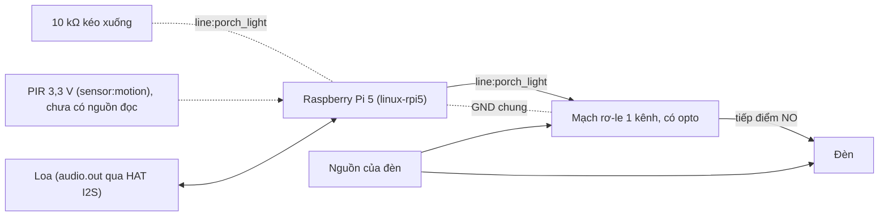
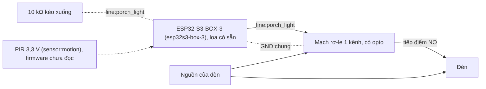

# Kit 2 — Trợ lý giọng nói trong nhà (`home-voice`)

> **Mã task:** TSK-I2b-01. Quy trình chung, quy tắc an toàn và danh sách việc chưa kiểm:
> [`kit-phan-cung.md`](kit-phan-cung.md). Trang này chỉ nói riêng về kit.

Một agent, ba loại việc, mỗi loại một hợp đồng: hỏi đáp trên kho kiến thức của gia đình (nói, không gate;
mất mạng thì đọc câu trả lời cục bộ), đọc tin tức (cần mạng; mất mạng thì nói là không có, không bịa), và
**bật/tắt đèn** (vật lý, qua gate): đèn không bao giờ tắt khi cảm biến chuyển động còn thấy người.

## Gate đã khoá

`light_on@1.0.0` và `light_off@1.0.0` nằm ở `fixtures/agents/home-voice/gates/` và có digest trong
`digests.lock`. `light_off` đọc dữ kiện `room_empty` do cảm biến `motion` cấp; còn người ⇒ chặn và hỏi
lại, người trên thiết bị nói "có" thì tắt (RFC-0006); mô hình hay MCP **không** trả lời thay được. Sửa gate
cần RFC (`CONTRIBUTING.md` §3).

## BOM

Mô tả theo chức năng và thông số. **Không có mã hàng, giá hay nhà bán**; mọi dòng "chưa kiểm trên phần cứng thật".

| # | Hạng mục | Thông số | `esp32s3` | `linux` (Pi 5) |
|:--|:---|:---|:---|:---|
| 1 | Bo điều khiển | ESP32-S3-BOX-3 (loa và micro có sẵn) | có | — |
| 2 | Bo điều khiển | Raspberry Pi 5 (profile `linux-rpi5`: "Raspberry Pi 5 + I2S HAT") | — | có |
| 3 | Âm thanh ra | Loa của Box-3 (có sẵn); với Pi 5: đầu ra của HAT I2S mà profile mô tả, kèm loa có khuếch đại | có sẵn | có |
| 4 | Mạch rơ-le | Một kênh, đầu vào 3,3 V tương thích, có opto cách ly, tiếp điểm chịu đủ dòng của đèn (đèn mạng 220 V cần rơ-le và dây đúng cấp điện áp, do thợ điện đấu) | có | có |
| 5 | Đèn | Đèn của gia đình hoặc đèn thử 12 V; **thử bằng LED + điện trở trước** | có | có |
| 6 | Cảm biến chuyển động | PIR ngõ ra số 3,3 V (profile khai cảm biến `motion`) | xem chú thích | xem chú thích |
| 7 | Điện trở kéo xuống | 10 kΩ từ chân `porch_light` về GND | có | có |
| 8 | Nguồn cho bo | Theo bo (USB-C cho Box-3; nguồn 5 V cho Pi 5) | có | có |

Chú thích dòng 6 — **cảm biến `motion` chưa nối được thật**: `linux` đọc cảm biến qua sysfs (hwmon, IIO) và
kho chưa có driver nào cho PIR nối GPIO. Phiên `--target linux` của agent này vì thế **bị từ chối trước khi
yêu cầu bất kỳ line nào** (Q-16: không có nguồn thì không đoán) cho tới khi bạn khai một nguồn cho `motion`
bằng `NEUROEDGE_LINUX_SENSORS="motion=hwmon:<tên>/<kênh>"`; và dù khai, số đọc của sysfs là số có đơn vị
chứ không phải đúng/sai, nên dữ kiện `room_empty` **vẫn chưa xác định** và `light_off` luôn **chặn**
(`criterion_unavailable`). Đèn bật được; **không tắt được qua agent trên `linux`**. Đó là hướng an toàn,
nhưng kit chưa dùng được đầy đủ trên Pi cho tới khi có nguồn `motion` đúng kiểu. Firmware `esp32s3` chưa
đọc cảm biến (TSK-S4-01).

**Trên `linux`, nguồn `motion` chưa được nối, và việc sửa chờ giàn thật.** Hiện `light_off` luôn **chặn**
theo hướng an toàn (`criterion_unavailable`); đèn chỉ bật được. Cách sửa dự kiến: nối PIR vào một line
`digital.in` của `linux-rpi5` và khai `[sim.digital_facts] room_empty = { pin = "<line của PIR>", equals = false }`
(line thấp là phòng trống). Gate không phải đổi (`room_empty` là `bool`), nhưng chân PIR là tham số của giàn
thật, profile `linux-rpi5` chưa khai nó, và `digital.in` chỉ có trên `linux-rpi5`/`sim-rpi5` — nên việc này
chờ bước dựng phần cứng, không làm trước khi có bo thật.

## Sơ đồ đấu dây

Nhãn `line:<tên>` là tên chân của bo trong `boards/*.toml`; `sensor:<tên>` là tên cảm biến trong
`[capabilities.sensor_read]`. Test `python/tests/test_kits.py` kiểm cả hai với profile bo tương ứng. Số
chân vật lý của header Pi và GPIO của ESP32 chưa được gán trong kho.

<!-- wiring: linux-rpi5 -->


<!-- wiring: esp32s3-box-3 -->


## Từ hộp tới chạy thật

Quy trình chung ở [`kit-phan-cung.md`](kit-phan-cung.md) §2. Riêng kit này:

```bash
neuroedge new nha --template home-voice && cd nha
neuroedge run -c "bật đèn"                    # ALLOW: porch_light bật
neuroedge run -c "wifi nhà mình là gì"        # trả lời từ knowledge.toml, không gate
neuroedge test
```

Trong REPL (`neuroedge run`): `:sensor motion true` rồi `tắt đèn` ⇒ BLOCK `room_empty`, hỏi lại; `có` ⇒
tắt. System 2 và tin tức dùng khoá API của bạn nếu bạn bật `[system_two]` (đã chú thích sẵn trong
`agent.toml`); không bật thì mọi thứ chạy offline.

- **`linux` trên Pi 5**: line `porch_light` điều khiển được. Không khai nguồn `motion` ⇒ phiên bị từ chối,
  không line nào bị yêu cầu. Khai một nguồn ⇒ `light_on` ALLOW và cấp chân, `light_off` BLOCK và chân không
  bao giờ đổi (xem chú thích BOM dòng 6). Test: `python/tests_linux/test_kit_home_voice.py`; nguồn `motion`
  trong test là một thiết bị hwmon giả dựng trong thư mục tạm, vì kernel không có driver PIR.
- **`esp32s3`**: `neuroedge build --target esp32s3 --board esp32s3-box-3` ra project ESP-IDF; chưa có âm
  thanh (I5) và chưa điều khiển chân (TSK-S4-01).

## Vết golden

`fixtures/traces/kits/home-voice-allow.json` (bật đèn, tắt đèn khi phòng trống ⇒ ALLOW),
`home-voice-block.json` (tắt đèn khi còn người, khi không đọc được cảm biến ⇒ BLOCK, chân không đổi).
Sinh bằng `scripts/gen_kit_traces.py`; `neuroedge verify` phát lại.
