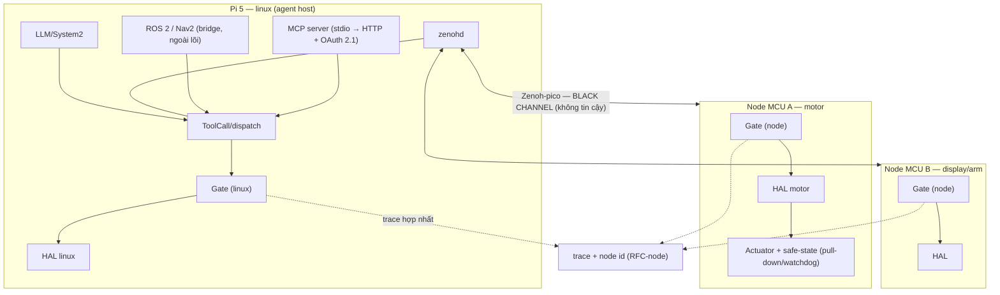

# Kế hoạch mở rộng NeuroEdge cho robot phân tầng phức tạp (FOFOCA)

**Phiên bản:** 0.1 — bản nháp, chưa phải quyết định của kho

**Ngày lập:** 25 tháng 9, 2026 · Lịch sử thay đổi: `CHANGELOG.md`

**Tài liệu nguồn:**

- `neuroedge-prd.md` §4.2 (FR-TGT), §4.4 (FR-HAL), §9.4 (NFR-SEC), §15 (Q-13, Q-29)
- `neuroedge-proposal.md` §3.2, §3.4, §3.8, §8.9, §10.1–§10.2, Phụ lục H.3
- `docs/spec/threat_model.md`, `docs/spec/tool_calling.md`, `docs/spec/hal_mcu_review.md`
- `docs/rfc/0002-mo-rong-target-va-nguyen-thuy-thi-giac.md`, `docs/rfc/0003-bo-cuc-nhi-phan-cay.md`
- `neuroedge-roadmap-phase1-5.md` (bản nháp Giai đoạn 1.5), `TODOS.md`, `CONTRIBUTING.md`

**Phạm vi:** các chặng W0–W4 — mở nguyên thủy HAL, an toàn actuator, hạ tầng tin cậy,
multi-node, hệ sinh thái; kèm khung RFC cho từng thay đổi.

**Ngoài phạm vi:**

- Matter / Apple HomeKit (PRD §14).
- SLAM, tránh vật cản, dẫn đường tự hành — tích hợp ngoài qua ROS 2, không tự phát triển
  (`neuroedge-roadmap-phase2.md:218`).
- MHS ở bậc 1 hoặc chạm `schemas/` (Q-29 giữ nguyên: theo dõi, adapter cộng đồng khi chuẩn mở).
- Tự huấn luyện/tinh chỉnh mô hình.

> **Trạng thái quản trị.** Đây là kế hoạch đề xuất, **chưa** là quyết định của kho. Các
> điểm cần chốt phải vào `neuroedge-prd.md` §15 dưới mã `Q-N` mới (Phụ lục C); chỉ khi đó
> kế hoạch mới có hiệu lực. Tệp này **không** cập nhật tiến độ (nguồn duy nhất:
> `neuroedge-roadmap.md` §0) và **không** tạo sự thật mới — mỗi sự thật có đúng một nơi
> (`CONTRIBUTING.md` §8.1).

---

## Mục lục

1. [Mục tiêu và định nghĩa "xong"](#1-mục-tiêu-và-định-nghĩa-xong)
2. [Bất biến và kỷ luật thực thi](#2-bất-biến-và-kỷ-luật-thực-thi)
3. [Trạng thái xuất phát](#3-trạng-thái-xuất-phát)
4. [Kiến trúc mục tiêu](#4-kiến-trúc-mục-tiêu)
5. [Cơ sở: nghiên cứu giải pháp OSS/thế giới](#5-cơ-sở-nghiên-cứu-giải-pháp-osssthế-giới)
6. [Chặng 0 — việc nhẹ làm ngay](#6-chặng-0--việc-nhẹ-làm-ngay)
7. [Chặng 1 — cơ thể: HAL và an toàn actuator](#7-chặng-1--cơ-thể-hal-và-an-toàn-actuator)
8. [Chặng 2 — hệ thần kinh](#8-chặng-2--hệ-thần-kinh)
9. [Chặng 3 — multi-node](#9-chặng-3--multi-node)
10. [Chặng 4 — hệ sinh thái](#10-chặng-4--hệ-sinh-thái)
11. [Chặng 5 — chứng nhận an toàn chức năng](#11-chặng-5--chứng-nhận-an-toàn-chức-năng)
12. [Thứ tự, phụ thuộc, đường găng, ước lượng](#12-thứ-tự-phụ-thuộc-đường-găng-ước-lượng)
13. [Rủi ro và đối sách](#13-rủi-ro-và-đối-sách)
14. [Điểm mở cần chốt](#14-điểm-mở-cần-chốt)
15. [Khi thực thi — tài liệu phải cập nhật](#15-khi-thực-thi--tài-liệu-phải-cập-nhật)
16. [Bước tiếp theo](#16-bước-tiếp-theo)

**Phụ lục**

- [A — Khung các RFC dự kiến](#phụ-lục-a--khung-các-rfc-dự-kiến)
- [B — Truy vết W-item với nguồn](#phụ-lục-b--truy-vết-w-item-với-nguồn)
- [C — Quyết định chờ cấp mã Q-N](#phụ-lục-c--quyết-định-chờ-cấp-mã-q-n)

---

## Quy ước tài liệu

- Mọi mã và ký hiệu (`FR-*`, `NFR-*`, `Q-N`, `TSK-*`, `W*`, `§x.y`) giải mã ở
  [`docs/user/thuat-ngu.md`](docs/user/thuat-ngu.md).
- Mốc ghi bằng **ngày tuyệt đối**.
- `W`-item là mã cục bộ của bản nháp này; khi hạ cánh phải cấp `TSK-*` thật trong
  `neuroedge-roadmap.md`.

---

## 1. Mục tiêu và định nghĩa "xong"

**Mục tiêu:** một robot kiểu FOFOCA — Pi 5 làm não, nhiều MCU (motor, display, arm) làm
tay chân — chạy trên NeuroEdge với hợp đồng an toàn nguyên vẹn: mọi hành động vật lý đi
qua gate, kể cả khi hệ thống trải trên nhiều chip, và mọi mở rộng đều có đường kiểm thử.

**Definition of Done của chương trình (FOFOCA reference demo):**

| # | Tiêu chí | Cách chứng minh |
|:--:|:--|:--|
| D1 | Pi 5 (`linux`) + ≥ 2 node MCU (ESP32-S3 + RP2350) chạy HAL/gate cục bộ, liên lạc qua wire "black channel" | Demo + test CI |
| D2 | Ý định thoại → gate từng node quyết → actuator chạy; **mất liên lạc → node về trạng thái an toàn** | Fault injection: drop/delay/replay/tamper |
| D3 | Trace hợp nhất đa node replay được trong CI | `neuroedge verify` + replay |
| D4 | Kỹ sư ngoài port được một bo bậc 3 chỉ bằng tài liệu công khai, < 8 giờ | Tiêu chí ra khối P1 |
| D5 | SBOM + OTA ký + mTLS/cert thiết bị demo được | Chặng 2 |

---

## 2. Bất biến và kỷ luật thực thi

### 2.1 Bất biến

| # | Luật | Nguồn |
|:--:|:--|:--|
| B1 | Một đường duy nhất tới actuator: gate → token dùng một lần → HAL authorize → vết ghi | `docs/spec/threat_model.md` §1 |
| B2 | Gate chạy **on-device**, fail-closed; **không gate tập trung** (kể cả multi-node) | `neuroedge-proposal.md` §3.4, Phụ lục H.3 |
| B3 | Chạm `schemas/`, ngữ nghĩa phân giải gate, ba vết ghi chuẩn mực, `digests.lock`, bố cục `NETR` → **RFC** (2 PR: RFC rồi mã) | `CONTRIBUTING.md` §3 |
| B4 | Mỗi mở rộng: mục threat model + test (0 skip) + corpus khép kín hai chiều; fuzz nếu chạm `NETR` | `CONTRIBUTING.md` §3, §5 |
| B5 | Milestone-gated + PF-3 (nhu cầu thật); giữ bậc 1 không pha loãng (R-7) | `neuroedge-roadmap.md` §0, PRD R-7 |
| B6 | Nguyên thủy mới: tùy chọn theo bo mạch, `sim` không giàu hơn bo mạch, bậc 1 vẫn đủ 5 nguyên thủy | FR-HAL-01, `TODOS.md` #14 |
| B7 | Giấy phép: allowlist Q-11; mọi port theo 5 nghĩa vụ `CONTRIBUTING.md` §4 + `NOTICE`; không copyleft mạnh | `CONTRIBUTING.md` §4 |

### 2.2 Danh sách RFC dự kiến

| RFC | Nội dung | Hợp đồng ảnh hưởng | Trạng thái |
|:--|:--|:--|:--|
| RFC-0002 | Phân tầng target + `vision.in` | `board.v1`, `trace.v1` | Đang thảo luận → cần phê duyệt |
| RFC-0007 *(số dự kiến, chưa mở)* | `digital.in` + I2C chỉ đọc + ADC | `board.v1`, `gate.v1`?, `NETR`? | Chưa mở |
| RFC-numeric *(gộp RFC-0007 hoặc riêng — xem §14)* | `evaluate.type: numeric` + nút `NETR` | `gate.v1`, `NETR` | Chưa mở (`TODOS.md` #30) |
| RFC-motion *(số cấp khi mở)* | `motion.*`/`analog.in` + phong bì N2 + token theo kênh + bố cục `NETR` mới | `board.v1`, `gate.v1`?, `NETR` | Chưa mở |
| RFC-vision-bậc23 *(số cấp khi mở)* | Khoá `vision.in` cho bậc 2/3 + luật riêng tư | `board.v1` | Chưa mở |
| RFC-node *(số cấp khi mở)* | Giao thức điều phối node + black channel + trace đa node | `trace.v1`, ngữ nghĩa phân giải? | Chưa mở — xem `draft-rfc-node-giao-thuc-dieu-phoi.md` |
| RFC-pin-extends *(số cấp khi mở)* | Ghim `extends` bằng digest | `gate.v1` | Chưa mở (`TODOS.md` #15) |

> Số RFC chỉ được cấp khi mở PR RFC (chỉ chứa tệp RFC, `CONTRIBUTING.md` §3). `RFC-0007`
> là số dự kiến đã được nhắc trong bản nháp Giai đoạn 1.5; các số khác trong bảng là tên
> tạm.

---

## 3. Trạng thái xuất phát

Bảng dưới chỉ ghi **trạng thái thật**, không đánh giá quá cao phần đã đặc tả:

| Hạng mục | Trạng thái thật | Nguồn |
|:--|:--|:--|
| Gate + token dùng một lần + trace replay + bên gọi không tin cậy | Đã kiểm chứng (A3) | `docs/spec/threat_model.md` §1–§2b |
| Secure Boot, mã hóa flash, nút ngắt micro | Đặc tả; Sprint 6 = 0% | TSK-S6-05, `neuroedge-prd.md` §9.4 |
| TLS 1.3/mTLS/cert thiết bị/thu hồi | Đặc tả; **không có task hiện thực**; ghi "cần tiêu chí" | NFR-SEC-04/05, `neuroedge-prd.md:830` |
| OTA ký số | Đặc tả; TSK-S6-01..04 = 0% | NFR-SEC-06, `neuroedge-prd.md` §4 |
| Quyền riêng tư (vision, ẩn danh trace) | Luật đã có; task chưa bắt đầu | `TODOS.md` #31 |
| Ký gate/trace | Chưa có; `gate_digest` chỉ truy vết, không chứng thực | `docs/spec/threat_model.md:125` |
| Giấy phép/port OSS | Q-11 + 5 nghĩa vụ + CI; **SBOM chưa có** | `CONTRIBUTING.md` §4, `NOTICE` |
| Phân tầng target 1/2/3 | Q-13 đã chốt; RFC-0002 đang thảo luận; `TARGET_TIERS` chưa vào mã | `python/neuroedge/hal/board.py:58` |
| Chuyển giao chuẩn cho tổ chức trung lập | Cam kết **có điều kiện** tại G1 (10.000 thiết bị) | `neuroedge-proposal.md:246,709` |
| Nợ tiêu chí NFR-SEC | 6 mã "cần tiêu chí" (SEC-02→06, 08) | `neuroedge-prd.md:862` |

---

## 4. Kiến trúc mục tiêu

### 4.1 Sơ đồ



### 4.2 Sáu lớp

| Lớp | Thành phần | Vai trò |
|:--|:--|:--|
| L0 | Phần cứng node | Trạng thái an toàn cục bộ: kéo xuống/watchdog/giới hạn dòng — crash-safe |
| L1 | **Zenoh-pico** (nhánh Apache-2.0) trên MCU; `zenohd` trên Pi | Wire "black channel" — **không tin cậy** |
| L2 | Lớp an toàn kiểu **black channel** (node id, seq, CRC, timestamp, heartbeat/TTL) | Thông điệp tự bảo vệ; mất heartbeat → node về trạng thái an toàn |
| L3 | **Gate từng node** (giữ nguyên) + agent/ý định trên Pi | Không gate tập trung; node nào tự quyết node đó |
| L4 | **Trace hợp nhất** (RFC-node) | Bằng chứng replay đa node |
| L5 | **MCP** (stdio → Streamable HTTP + OAuth 2.1) | Mặt tiếp xúc agent/control plane — không dùng làm wire MCU |
| L6 | **ROS 2 bridge** qua `zenoh-bridge-dds` (chỉ trên Pi) | ROS action → ToolCall → gate → HAL |

Nguyên tắc xuyên suốt: **an toàn không nằm ở transport**. Zenoh/WiFi được coi là mạng
không tin cậy (IEC 61784-3 black channel); an toàn nằm ở gate + token + watchdog từng node.
Token TTL = p95 × 3 (đã có) chặn lệnh cũ khi liên lạc chập chờn.

---

## 5. Cơ sở: nghiên cứu giải pháp OSS/thế giới

### 5.1 Điều phối node

| Giải pháp | Ưu điểm | Hạn chế | Giấy phép |
|:--|:--|:--|:--|
| **Eclipse Zenoh / zenoh-pico** | Một giao thức từ MCU tới cloud; overhead ~5 byte; P2P/routed/brokered; đã chạy ESP32, RP2040/Pico, Zephyr, FreeRTOS; độ trễ WiFi/4G tốt hơn MQTT; có bridge ROS 2 (`zenoh-bridge-dds`); đang thành lựa chọn cho R2X (robot-to-anything) | Trẻ hơn DDS/MQTT; cần spike trên ESP32-S3 thật | **EPL-2.0 OR Apache-2.0** — chọn nhánh Apache-2.0 để qua Q-11 |
| **micro-ROS / Micro XRCE-DDS** | Chuẩn OMG (DDS-XRCE), ROS 2 native; đội ngũ eProsima | Cần agent trên Pi; nặng hơn; mô hình client–server | Apache-2.0 |
| **MQTT** | Phổ biến, nhiều broker | "Broker paradox": hai thiết bị cùng LAN vẫn vòng qua broker; broker đang vướng Q-11 (EMQX BSL, Mosquitto EPL) | Broker: vướng Q-11 |
| **ROS 2 / DDS làm wire** | Hệ sinh thái robot lớn nhất | Không lên MCU; multicast/UDP nặng; kéo máy trạng thái ra khỏi thiết bị (đã bị loại ở H.3) | Apache-2.0 |

### 5.2 An toàn phân tán — black channel

**IEC 61784-3** định nghĩa mẫu "black channel": truyền thông an toàn trên mạng **không
tin cậy** bằng cách để mỗi thông điệp an toàn tự mang trường bảo vệ (CRC, số thứ tự,
dấu thời gian, định danh kết nối, watchdog) và **mỗi thiết bị tự thực hiện chức năng an
toàn** của mình. Đây khớp chính xác với bất biến B2 của NeuroEdge (gate on-device,
fail-closed) và cho phép dùng transport phổ thông mà không phải tin nó.

Hệ quả thiết kế:

- Node giữ **trạng thái an toàn cục bộ** (ngắt điện động cơ) — phần mềm không cứu được
  khi crash/SIGKILL, cần kéo xuống phần cứng/watchdog (`neuroedge-roadmap-phase1-5.md:128,369`).
- Mất heartbeat/TTL → node từ chối mọi ý định mới và về trạng thái an toàn.
- Replay protection: số thứ tự + nonce + cửa sổ thời gian; không bao giờ "ALLOW cũ" phát lại được.

### 5.3 MCP qua mạng

Spec MCP hiện hành (2026-07-28) đã có **authorization OAuth 2.1 cho HTTP transport**
(Streamable HTTP; Protected Resource Metadata RFC 9728; Authorization Server Metadata
RFC 8414; Client ID Metadata Documents). Khuyến nghị: dùng đúng spec thay vì tự chế, và
vẫn thêm mTLS ở tầng thiết bị (NFR-SEC-04) cùng test chống lặp lời gọi (`TODOS.md` #29)
trước khi mở cổng mạng.

### 5.4 MHS

MHS vẫn là **research preview** (2026-08-27), chưa công bố schema/giấy phép; kế hoạch mở
mã nguồn. Đối tác công bố gồm **Raspberry Pi**, Hugging Face (LeRobot), AWS (Strands
Robots), Universal Robots — tức đúng tầng Pi của FOFOCA. Giữ Q-29: theo dõi; khi chuẩn mở
thì làm adapter HAL host qua MCP theo mô hình cộng đồng, không bậc 1, không chạm `schemas/`.

### 5.5 Khuyến nghị

1. **Wire protocol:** Zenoh-pico (mặc định đề xuất), micro-ROS là phương án B; chốt bằng
   spike W3-1 trên phần cứng thật.
2. **An toàn:** black channel + watchdog + trạng thái an toàn cục bộ; không tin transport.
3. **MCP:** giữ ở mặt agent; mở mạng bằng Streamable HTTP + OAuth 2.1 sau mTLS.
4. **ROS 2:** bridge qua Zenoh trên Pi, tại ranh giới gate.
5. **MHS:** theo dõi (Q-29), ưu tiên thấp.

**Nguồn:** zenoh.io và zenoh-pico (EPL-2.0 OR Apache-2.0; hỗ trợ ESP32/Pico/Zephyr/FreeRTOS);
Micro XRCE-DDS (eProsima, OMG); so sánh DDS/MQTT/Zenoh cho ROS 2 (arXiv 2309.07496);
IEC 61784-3 (black channel); MCP Authorization spec 2026-07-28; Anthropic MHS preview
2026-08-27.

---

## 6. Chặng 0 — việc nhẹ làm ngay

Không cần RFC, không chạm vùng đóng băng; làm trước để tăng độ tin cậy với chi phí thấp.

| ID | Việc | Artifact | Điều kiện xong |
|:--|:--|:--|:--|
| W0-1 | Tiêu chí nghiệm thu 6 NFR-SEC (02→06, 08) + rà NFR-SEC-09 | `neuroedge-prd.md` Phụ lục A.3 + test/evidence | Hết dòng "cần tiêu chí" (`neuroedge-prd.md:862`); mỗi mã có ≥ 1 đường kiểm chứng |
| W0-2 | SBOM (CycloneDX/SPDX) từ `requirements-lock.txt` | `release-pypi.yml` + artifact phát hành | SBOM sinh trong CI phát hành, gắn đúng phiên bản wheel |
| W0-3 | Quét lỗ hổng/bí mật: `pip-audit`, gitleaks, CodeQL (Python + C firmware) | `.github/workflows/` | Job chặn khi có phát hiện mức cao; không còn khoảng trống quét |
| W0-4 | Nightly drift: cảnh báo → chặn (hoặc tự mở issue) | `.github/workflows/nightly-hardware.yml:85-121` | Có ít nhất một job đỏ khi resolved lệch lock |
| W0-5 | Dọn `TODOS.md` #31 (FR chưa có task) và #17 (giấy phép ESP-SR) | `TODOS.md`, roadmap | Có chủ trì hoặc quyết định văn bản |

**Ước lượng:** S (1–2 PR). **Phụ thuộc:** không.

---

## 7. Chặng 1 — cơ thể: HAL và an toàn actuator

Đây là chặng **quan trọng nhất** cho FOFOCA: multi-node và ROS 2 vô nghĩa nếu HAL không
diễn tả được chuyển động và cảm biến.

### 7.1 1A — mở rộng trong 5 nguyên thủy (làm trước, ít rủi ro)

| ID | Việc | RFC? | Điều kiện xong |
|:--|:--|:--:|:--|
| W1A-1 | Chuẩn hóa PWM (tần số/độ rộng xung) + kênh phản hồi trạng thái trong `digital.out` | Có (tham số + schema) | Ràng buộc biên có test biên; gate kiểm cả giá trị mặc định (mẫu RFC-0005) |
| W1A-2 | `sensor.read` kiểu số + **tiêu chí `numeric`** | Có | `gate.v1` + nút `NETR` + walker C + corpus; `gate lint` xanh |
| W1A-3 | Rà `board.v1.json`: khoá capability lạ phải bị từ chối lúc nạp (RFC-0002 §3c.2) | Gộp RFC-0002 PR2 | Khoá gõ sai không còn lọt qua schema |

### 7.2 1B — nguyên thủy mới (theo làn sóng)

| Làn | Việc | Phụ thuộc | Điều kiện xong |
|:--|:--|:--|:--|
| RFC-1 | Duyệt **RFC-0002**; soạn **RFC-0007** (`digital.in`/I2C chỉ đọc/ADC); soạn **RFC-numeric** | Chữ ký kỹ thuật trưởng; `Q-N` cho Giai đoạn 1.5 | RFC-0002 approved + PR2 (TSK-V1a-01..06); 3 bất biến test theo bậc; `TARGET_TIERS` trong mã |
| RFC-2 | **`motion.*`** (motor/servo) + **`analog.in`**; phong bì N2; token theo kênh; bố cục `NETR` mới | RFC-1 + numeric; nhu cầu/đối tác; bo mạch thật | Threat model có dòng cho từng đường tắt mới; fuzz `NETR`; test crash-safe trên QEMU + nightly thật |
| RFC-3 | Khoá **`vision.in`** bậc 2/3: `fps`, `modes[]`, `pixel_format`; kết quả phải quy về `bool`/`level`/`choice` trước gate; không khung hình thô vào trace | RFC-1 | Camera trong `sim` không giàu hơn bo mạch (`TODOS.md` #14); fail-closed khi mất camera/model |

**Thiết kế sơ bộ từng nguyên thủy mới:**

| Nguyên thủy | Tham số chính | An toàn | Ghi chú |
|:--|:--|:--|:--|
| `motion.*` (motor/servo) | kênh, đích, tốc độ, thời lượng, ramp | Phong bì N2: duty tối đa, thời gian chạy liên tục tối đa, rate limit; **trạng thái an toàn = ngắt điện**; token phạm vi = kênh + thời lượng tối đa + một lần dùng | Nguyên thủy riêng (không nhồi vào `digital.out`) để hợp đồng rõ |
| `analog.in` | giá trị số, đơn vị, hiệu chuẩn | Ngưỡng qua tiêu chí `numeric`; không suy diễn ngoài thang | Phụ thuộc RFC-numeric |
| `vision.in` | `fps`, `modes[]`, `pixel_format` | Kết quả quy về `bool/level/choice`; fail-closed khi mất camera/model; không khung hình thô vào trace | Thiết kế đã có ở RFC-0002 §9.1 |
| `digital.in` / I2C / ADC | mức logic, địa chỉ thiết bị I2C, kênh ADC | I2C chỉ đọc, allowlist thiết bị; `lab_read` có cờ; ADC theo kết quả spike | Nguồn: bản nháp Giai đoạn 1.5 (N0/N3) |

### 7.3 An toàn actuator (làm cùng RFC-2, không tách)

- **L0 crash-safe:** kéo xuống/watchdog/giới hạn dòng trên bo tham chiếu + runbook bắt
  buộc ghi rõ (`neuroedge-roadmap-phase1-5.md:128,369`).
- **Phong bì N2:** giới hạn duty/rate/thời gian cưỡng chế trong `digital_out`/`motion`;
  cờ lab cho ngoại lệ có kiểm soát.
- **Token theo kênh:** mở rộng phạm vi token từ `pin` sang `kênh + thời lượng tối đa +
  một lần dùng`, cập nhật cả host ledger lẫn `ne_token.c`.

**Ước lượng:** 1A = M; RFC-2 = L. **Đường găng:** có.

---

## 8. Chặng 2 — hệ thần kinh

Thiết kế ngay, **chưa đặt lịch**; điểm quyết định thời điểm: sau Beta, khi có (a) nhu cầu
thật, (b) bo mạch về, (c) mốc Khối 2/3 mở.

| ID | Việc | NFR / FR | Phụ thuộc | Điều kiện xong |
|:--|:--|:--|:--|:--|
| W2-1 | mTLS + cert thiết bị + thu hồi + provisioning | SEC-04/05, FR-FLT-01 | TSK-K2-04 | Provisioning cấp cert riêng; thu hồi được; test mTLS hai chiều |
| W2-2 | OTA ký + A/B + rollback; verify chữ ký trên chip | SEC-06, FR-OTA-01..04 | TSK-S6-01..04 | Boot loop → rollback; chữ ký sai → từ chối áp dụng |
| W2-3 | Secure Boot + mã hóa flash + nút ngắt micro; **bổ sung task TPM Linux** | SEC-02/03 | TSK-S6-05 + bo mạch | Cấu hình khởi động an toàn + test trên bo thật |
| W2-4 | Ký gate + verify trên thiết bị (Registry OCI/ORAS); ký trace (`TODOS.md` #1); streaming (#3) | — | Khối 2/3 | Gate cộng đồng có chuỗi tin cậy; trace ký đối soát được |
| W2-5 | Sandbox mã bên thứ ba (capability-scoped pin access; phạm vi `linux` trước) | SEC-07 | v1.1 | Mã bên thứ ba không chạm được chân ngoài phạm vi cấp |
| W2-6 | MCP qua mạng: **Streamable HTTP + OAuth 2.1** + mTLS thiết bị + test #29 | SEC-09 | W2-1 | Không có đường nào tới actuator mà chưa xác thực |
| W2-7 | SBOM kèm phát hành + attestation build + pin GitHub Actions | — | W0-2/3 | SBOM + provenance cho mọi bản phát hành |

**Ước lượng:** L. **Đường găng:** không (trừ W2-1 là điều kiện của W2-6).

---

## 9. Chặng 3 — multi-node

### 9.1 Mô hình

- Một agent (chạy trên Pi/`linux`) phát **ý định**; mỗi node MCU **tự lượng giá gate của
  nó** rồi mới chạm actuator — không gate tập trung (B2).
- Phân biệt rõ: **Fleet OS** (nhiều thiết bị độc lập, Khối 2) khác **multi-node** (một
  robot nhiều MCU).
- Mầm mống đã có: MCP gateway cho thiết bị (TSK-P2-05, `docs/spec/tool_calling.md:216`).

### 9.2 Black channel

| Thành phần | Nội dung |
|:--|:--|
| Định danh node | `node_id`, vai trò, khoá liên kết (PSK/mTLS) |
| Bảo vệ thông điệp | `seq`, CRC, `timestamp`, `ttl`, định danh kết nối |
| Watchdog | Heartbeat Pi↔node; mất → từ chối ý định mới, về trạng thái an toàn |
| Replay | Số thứ tự + nonce + cửa sổ thời gian; token TTL = p95 × 3 chặn lệnh cũ |
| Tin cậy | Transport **không** được tin; mọi phán quyết vẫn ở gate từng node |

### 9.3 Trace hợp nhất

`schemas/trace.v1.json` hiện yêu cầu `metadata.target` (enum 3 giá trị) + `board_id`
(`trace.v1.json:15,25,29`); `metadata.additionalProperties: true` (`:39`) nhưng `events`
đóng (`:58`). Hai phương án:

| Phương án | Cách làm | Ưu | Nhược |
|:--|:--|:--|:--|
| **A (khuyến nghị cho v1.x)** | Thêm `metadata.nodes[]` tùy chọn + quy ước `data.node_id` trong sự kiện | Không phá tương thích; không cần đổi enum | Quy ước nằm trong `data`; cần tài liệu hoá + fixture mới (RFC) |
| B | `trace.v2` với `nodes[]` và `node_id` cấp sự kiện | Rõ ràng, chuẩn mực | Phá tương thích; chi phí migrate toàn bộ corpus |

Quyết định ở RFC-node (Phụ lục C #2). Thêm một vết ghi chuẩn mực mới = **RFC**
(`CONTRIBUTING.md` §3).

### 9.4 Việc phải làm

| ID | Việc | Artifact | Điều kiện xong |
|:--|:--|:--|:--|
| W3-1 | **Spike Zenoh-pico ↔ Pi** (ESP32-S3 + RP2350): độ trễ, RAM/flash, reconnect, giấy phép; so sánh micro-ROS | `docs/reports/` + số đo | Kết luận chọn wire protocol; ghi `NOTICE` nếu nhận mã |
| W3-2 | **RFC-node**: mô hình node, intent, safety wrapper, heartbeat → safe-state, wire, trace | `docs/rfc/` | RFC approved; threat model §2c; corpus tool-call mở rộng |
| W3-3 | Lớp black channel: wrapper + watchdog + replay protection | `python/` + firmware | Test drop/delay/replay/tamper: không ALLOW nào lọt; mất link → safe-state |
| W3-4 | Trace hợp nhất đa node (chọn A/B) | `schemas/trace.v1.json` hoặc `trace.v2` | Replay đa node xanh; `digests.lock` cập nhật đúng luật |
| W3-5 | Gateway/node: tài liệu hoá quan hệ với TSK-P2-05 | `docs/spec/tool_calling.md` | Phân biệt Fleet OS ≠ multi-node + test |
| W3-6 | `verify` mở rộng cho cụm node (tương đương miền phán quyết) | CLI + CI | Lệch → `SafetyRegressionError` (NE4002) |

**Lưu ý phần cứng:** repo đã có `rp2350` trong kế hoạch bậc 3 (`neuroedge-proposal.md:1690`),
nên chọn **RP2350** thay vì RP2040 cho node tay máy để tái dùng target bậc 3 dự kiến.

**Ước lượng:** M (spike) + L (RFC + hiện thực). **Đường găng:** có.

---

## 10. Chặng 4 — hệ sinh thái

| ID | Việc | Điều kiện xong | Ước lượng |
|:--|:--|:--|:--:|
| W4-1 | **ROS 2 bridge tại ranh giới gate** (chỉ `linux`, qua `zenoh-bridge-dds`): ROS action → ToolCall → gate → HAL | Demo Nav2 trong `sim`: ý định → gate → hành động; ROS 2 không chạm actuator trực tiếp | M |
| W4-2 | Bộ kiểm thử tuân thủ portable (P1) + `docs/porting/tier3.md` + `targets/_template/` | Kỹ sư ngoài port bậc 3 chỉ bằng tài liệu, < 8h | M |
| W4-3 | Registry có ký (OCI/ORAS) + bất biến server-side (#11) + ghim `extends` digest (#15) | ≥ 10 gate OSS publish (TR-4); verify chữ ký trên thiết bị | L |
| W4-4 | Kho adapter/HAL (FR-REG-08) | Adapter cộng đồng cài được qua registry | M |
| W4-5 | MHS adapter (khi chuẩn mở; theo dõi đối tác Raspberry Pi) | Adapter HAL host qua MCP; **không bậc 1, không chạm `schemas/`** (Q-29) | S–M |
| W4-6 | Q-11 chốt Hawkbit/EMQX; OFL cho font; ESP-SR | Phê duyệt văn bản trước Khối 2 | S |

**Giấy phép cho Chặng 4:** ROS 2/Nav2 Apache-2.0 (qua Q-11) nhưng vẫn theo 5 nghĩa vụ
`CONTRIBUTING.md` §4; chọn DDS permissive; bridge là thành phần **cộng đồng/đối tác**,
không bậc 1.

---

## 11. Chặng 5 — chứng nhận an toàn chức năng

Không tự quyết IN/OUT: đây là **câu hỏi cổng nhu cầu C6** — "chứng nhận an toàn chức năng
(IEC 61508, ISO 13849, hoặc tiêu chuẩn họ tự nêu) có là điều kiện mua?"
(`docs/business/cong-nhu-cau-2026-10-25/README.md:44`).

Nếu IN, khung tham chiếu:

| Chuẩn | Vai trò |
|:--|:--|
| IEC 61508 | Vòng đời an toàn chức năng, SIL, phân tích nguy cơ |
| IEC 61784-3 | Black channel — khớp thiết kế Chặng 3 |
| ISO 13482 | Robot chăm sóc cá nhân/gia đình (hợp FOFOCA hơn ISO 26262) |

Đường gần: tự công bố + bằng chứng trace/Action CI, không phải chứng nhận SIL ngay.

---

## 12. Thứ tự, phụ thuộc, đường găng, ước lượng

```text
W0 ──► RFC-0002 (duyệt) ──► RFC-0007 / RFC-numeric ──► RFC-2 motion + N2 ──► W3 (node) ──► W4-1 ROS 2
                        └──► RFC-3 vision ──────────────────────────────────┘
W2 (song song sau Beta; W2-1 trước W2-6)
```

| Ưu tiên | Gói | Đường găng? | Ước lượng | Ghi chú |
|:--:|:--|:--:|:--:|:--|
| 1 | W0 | Không | S | Làm ngay |
| 2 | RFC-0002 → 1A → RFC-2 | **Có** | M + L | Mở khóa mọi thứ robot |
| 3 | W3-1 → W3-2 → W3-3/4 | **Có** (đa node) | M + L | Spike quyết wire protocol |
| 4 | W4-1, W4-2 | Không | M | Giá trị cộng đồng |
| 5 | W2-1/2/3/6 | Không | L | Mốc Beta |
| 6 | W4-3/4/5 | Không | M | Hệ sinh thái |

---

## 13. Rủi ro và đối sách

| Rủi ro | Mức | Đối sách |
|:--|:--:|:--|
| v1.0 kín lịch, mở rộng làm loãng chất lượng bậc 1 | Cao | Tách người/PR; Chặng 1 tách khỏi đường tới hạn A2/Beta; R-7 giữ nguyên |
| Zenoh trẻ hơn DDS | Trung bình | Spike W3-1 bắt buộc trước khi chốt RFC-node; micro-ROS là phương án B |
| Black channel thêm lớp wrapper mới | Trung bình | Fuzz/replay test riêng; tái dùng mẫu `NETR` |
| Trace đa node phá vỡ tương thích | Trung bình | Chọn A/B trong RFC; cập nhật corpus + `digests.lock` đúng luật |
| Token theo kênh phức tạp | Trung bình | Làm cùng RFC-2, không nhồi vào 1A |
| Giấy phép (Zenoh nhánh kép, Hawkbit/EMQX) | Trung bình | Chọn nhánh Apache-2.0; ghi `NOTICE`; chốt Q-11 trước Khối 2 |
| Bo mạch thật về chậm | Cao | Phần không cần bo mạch kéo lên trước (tiền lệ TSK-S4-02/07/08) |
| Mở rộng không có nhu cầu thật | Trung bình | Neo vào cổng nhu cầu 2026-10-25 + PF-3; không tự phát triển SLAM |

---

## 14. Điểm mở cần chốt

| # | Điểm mở | Chốt ở đâu |
|:--:|:--|:--|
| 1 | Wire protocol node: Zenoh vs micro-ROS | Spike W3-1 → RFC-node |
| 2 | Trace: mở rộng `trace.v1` (A) vs `trace.v2` (B) | RFC-node |
| 3 | RFC-numeric gộp vào RFC-0007 hay tách riêng | Khi soạn RFC-1 |
| 4 | `motion.*` là nguyên thủy riêng (khuyến nghị) hay mở rộng `digital.out` | RFC-motion |
| 5 | Mô hình token theo kênh (kênh + thời lượng + một lần) | RFC-motion |
| 6 | Chứng nhận an toàn: IN/OUT | Cổng nhu cầu C6 |
| 7 | Q-11 phần mở (Hawkbit/EMQX) | Trước Khối 2 |
| 8 | MCP mạng dùng OAuth 2.1 theo spec (khuyến nghị) | W2-6 |
| 9 | Node tham chiếu multi-node: ESP32-S3 + RP2350 | Spike W3-1 |

---

## 15. Khi thực thi — tài liệu phải cập nhật

Theo `CONTRIBUTING.md` §8 (mỗi sự thật có đúng một nơi, §8.1):

| Tài liệu | Cập nhật gì |
|:--|:--|
| `neuroedge-roadmap.md` §0 | Tiến độ từng `W`-item khi hạ cánh (cấp `TSK-*` thật), mốc |
| `CHANGELOG.md` `[Chưa phát hành]` | Mỗi task một mục |
| `neuroedge-prd.md` | Tiêu chí NFR-SEC; FR-HAL/FR-TGT khi RFC-0002/RFC-motion hạ cánh; `Q-N` mới ở §15 |
| `TODOS.md` | Mục mới (node, trace, spike) + đóng #17/#31 khi xong |
| `docs/spec/threat_model.md` | §2c đa node + dòng mới cho motion/analog/vision |
| `docs/spec/tool_calling.md` | Gateway/node, MCP mạng |
| `docs/rfc/*` | RFC-0007, RFC-numeric, RFC-motion, RFC-node, RFC-vision-bậc23, RFC-pin-extends |
| `NOTICE` | Zenoh (nhánh Apache-2.0), ROS 2/Nav2, MHS khi port |
| `docs/user/thuat-ngu.md` | Giải mã `W*` nếu bản nháp được nhận; thuật ngữ node/black channel |

---

## 16. Bước tiếp theo

1. **PR W0** (CI + tiêu chí NFR-SEC + `TODOS.md`) — không chạm vùng RFC.
2. **Soạn RFC-0007 + RFC-numeric** (một hoặc hai PR RFC — Phụ lục C #3).
3. **Đẩy RFC-0002 qua phê duyệt** (chữ ký kỹ thuật trưởng).
4. **Draft RFC-node + kế hoạch spike W3-1** (đã có bản nháp kèm theo:
   `draft-rfc-node-giao-thuc-dieu-phoi.md`).
5. Ghi Chặng 2/3 vào roadmap/`TODOS.md` dạng "thiết kế sẵn, chưa đặt lịch" **sau khi**
   các `Q-N` tương ứng được cấp.

---

## Phụ lục A — Khung các RFC dự kiến

Mỗi khung dưới đây là dàn ý để chuyển thành RFC đầy đủ theo
`docs/rfc/0000-template.md` khi mở PR.

### A.1 RFC-0002 (đang thảo luận — cần phê duyệt)

- **Việc cần làm:** hoàn tất thảo luận theo hướng D4→A đã chốt trong biên bản review;
  lấy chữ ký kỹ thuật trưởng (tiêu chí ra V1a #1); hợp nhất PR2 (TSK-V1a-01..06).
- **Nội dung đã sẵn:** mở enum target lên 6; `TARGET_TIERS` thuộc lõi, `board.toml`
  không tự khai bậc; 3 bất biến test theo bậc; `vision.in` tách §9.1.

### A.2 RFC-0007 *(số dự kiến)* — `digital.in` + I2C chỉ đọc + ADC

- **Vấn đề:** HAL chỉ có `digital.out`/`sensor.read`; không đọc được nút nhấn/công tắc,
  không đọc cảm biến I2C, không có ADC.
- **Đề xuất:** thêm `digital.in`; bus I2C **chỉ đọc** theo allowlist thiết bị; ADC theo
  kết quả spike; `lab_read` có cờ.
- **Ảnh hưởng:** `board.v1` (capability mới), có thể `gate.v1` nếu cần tiêu chí mới;
  `sim` phải có mô hình tương ứng nhưng không giàu hơn bo mạch.
- **Nguồn:** bản nháp Giai đoạn 1.5 (N0, N3).

### A.3 RFC-numeric — `evaluate.type: numeric`

- **Vấn đề:** `schemas/gate.v1.json` chỉ nhận `bool`/`level`/`choice`; không diễn đạt
  được ngưỡng số (`pressure < 8 bar`) — `TODOS.md` #30.
- **Đề xuất:** thêm `numeric` + ngữ nghĩa siết chặt cho nguyên tắc 2 + nút trong `NETR`.
- **Ảnh hưởng:** `gate.v1` (đổi enum đã đóng băng → RFC), `NETR` layout, walker C.

### A.4 RFC-motion — `motion.*` + `analog.in` + phong bì N2 + token theo kênh

- **Vấn đề:** robot cần chuyển động và cảm biến tương tự; `digital.out` không diễn tả
  được vòng phản hồi/duty; token hiện chỉ theo `pin`.
- **Đề xuất:** nguyên thủy `motion.*` (motor/servo) + `analog.in`; phong bì an toàn N2
  (duty/rate/thời gian); trạng thái an toàn = ngắt điện; token phạm vi kênh + thời lượng
  + một lần; bố cục `NETR` mới (tăng `layout_version`).
- **Ảnh hưởng:** `board.v1`, `gate.v1` (nếu cần), `NETR`, walker C, `ne_token.c`, `sim`.
- **Phụ thuộc:** RFC-numeric; bo mạch thật.

### A.5 RFC-vision-bậc23 — khoá `vision.in` cho bậc 2/3

- **Vấn đề:** `vision.in` mới có thiết kế (RFC-0002 §9.1), chưa có hợp đồng đầy đủ cho
  bậc 2/3 và luật riêng tư.
- **Đề xuất:** chốt `fps`/`modes[]`/`pixel_format`; kết quả quy về `bool/level/choice`
  trước gate; không khung hình thô vào trace; fail-closed khi mất camera/model.
- **Ảnh hưởng:** `board.v1`; fixture vision; bất biến "sim không giàu hơn bo mạch".

### A.6 RFC-node — giao thức điều phối node

- **Xem bản nháp kèm theo:** `draft-rfc-node-giao-thuc-dieu-phoi.md`.

### A.7 RFC-pin-extends — ghim `extends` bằng digest

- **Vấn đề:** `extends` ghim theo phiên bản, không ghim nội dung; registry không kiểm
  soát có thể tái publish (`TODOS.md` #11, #15).
- **Đề xuất:** cho phép `@<ver>#sha256:…`; đổi `pattern` của `gate.v1.json`.
- **Ảnh hưởng:** `gate.v1`, ngữ nghĩa phân giải, `digests.lock`; cần kỹ thuật trưởng.

---

## Phụ lục B — Truy vết W-item với nguồn

| W-item | Yêu cầu / nguồn liên quan |
|:--|:--|
| W0-1 | NFR-SEC-02→06, 08; `neuroedge-prd.md:862` |
| W0-2/3/4 | Q-11 (`NOTICE`), `CONTRIBUTING.md` §4; nightly `upstream-drift` |
| W0-5 | `TODOS.md` #31, #17 |
| W1A-1 | FR-HAL-01; `neuroedge-proposal.md:456`; RFC-0005 |
| W1A-2 | FR-HAL-01; `TODOS.md` #30; RFC-numeric |
| W1A-3 | RFC-0002 §3c.2 |
| W1B-RFC-1 | FR-TGT-08, RFC-0002; bản nháp GĐ1.5 N0/N3 |
| W1B-RFC-2 | FR-HAL-01; N2 (bản nháp GĐ1.5 §7); crash-safe (`roadmap-phase1-5.md:128,369`) |
| W1B-RFC-3 | RFC-0002 §9.1; `TODOS.md` #14; NFR-PRIV |
| W2-1..7 | NFR-SEC-02→09; FR-FLT-01; FR-OTA-01..04; `TODOS.md` #1, #3, #24, #29 |
| W3-1..6 | FR-TGT-08; `docs/spec/tool_calling.md:216`; TSK-P2-05; FR-CI-07 (NE4002) |
| W4-1 | `neuroedge-roadmap-phase2.md:218`; Q-11; FR-MDL-10 |
| W4-2 | FR-GOV-03/04; TSK-P1-01..04 |
| W4-3 | FR-REG-01..07; `TODOS.md` #11, #15; TR-4 |
| W4-4 | FR-REG-08 |
| W4-5 | Q-29; `TODOS.md` #33 |
| W4-6 | Q-11 (`TODOS.md` #16, #17); OFL font (GĐ1.5) |

---

## Phụ lục C — Quyết định chờ cấp mã Q-N

Các điểm dưới đây cần một mục `Q-N` mới trong `neuroedge-prd.md` §15 trước khi kế hoạch
có hiệu lực:

| # | Câu hỏi quyết định | Gợi ý |
|:--:|:--|:--|
| 1 | Wire protocol node: Zenoh-pico hay micro-ROS? | Spike W3-1 quyết; mặc định đề xuất Zenoh (nhánh Apache-2.0) |
| 2 | Trace đa node: mở rộng `trace.v1` hay `trace.v2`? | A cho v1.x; xem lại khi có fixture vision/đa node chuẩn mực |
| 3 | RFC-numeric gộp hay tách khỏi RFC-0007? | Tách nếu RFC-0007 đã lớn |
| 4 | `motion.*` nguyên thủy riêng hay mở rộng `digital.out`? | Nguyên thủy riêng để hợp đồng rõ |
| 5 | Token theo kênh: phạm vi gồm gì? | Kênh + thời lượng tối đa + một lần dùng |
| 6 | Chứng nhận an toàn chức năng: IN hay OUT? | Cổng nhu cầu C6 |
| 7 | Q-11 phần mở: Hawkbit EPL-2.0, EMQX BSL? | Trước Khối 2 |
| 8 | MCP mạng: OAuth 2.1 theo spec? | Có |
| 9 | Node tham chiếu: ESP32-S3 + RP2350? | RP2350 tái dùng bậc 3 dự kiến |
