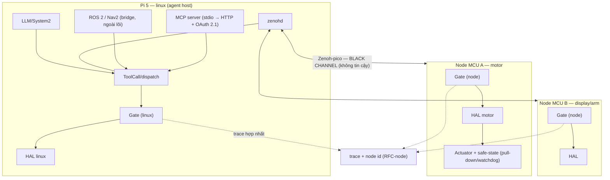

# Ghi chú thiết kế: mở rộng NeuroEdge cho robot phân tầng phức tạp (FOFOCA)

> **Ghi chú thiết kế.** Tệp này giữ mục tiêu, bất biến, kiến trúc, nghiên cứu và khung RFC
> cho robot phân tầng. Nó **không** có lịch, trạng thái, tiêu chí ra, ước lượng hay thang cắt:
> task, tiêu chí ra và phụ thuộc chỉ nằm ở [`neuroedge-roadmap.md`](neuroedge-roadmap.md)
> increment **I14** (§7.4); việc chặng W0 là TSK-W0-01 (I7), TSK-W0-02 và W0-03 (I6),
> TSK-W0-04 (I2). Quyết định chỉ nằm ở `neuroedge-prd.md` §15: **Q-32** (nhận hướng; trace
> `v1`, `motion.*`, MCP OAuth 2.1, drift mở issue), **Q-33** (RP2350), **Q-34** (ROS 2/Nav2),
> **Q-35** (mất liên lạc), **Q-36** (wire), **Q-37** (token `motion.*`), **Q-38** (chứng nhận
> an toàn), **Q-40** (thứ tự sau Beta). Mỗi sự thật có đúng một nơi (`CONTRIBUTING.md` §8.1).

**Cập nhật:** 2026-09-25 · Lịch sử thay đổi: `CHANGELOG.md`

**Tài liệu nguồn:**

- `neuroedge-prd.md` §4.1 (FR-HAL), §4.2 (FR-TGT), §9.4 (NFR-SEC), §14 (ngoài phạm vi), §15 (Q-13, Q-29)
- `neuroedge-proposal.md` §3.2, §3.4, §3.8, §8.9, §10.1–§10.2, Phụ lục H.3
- `docs/spec/threat_model.md`, `docs/spec/tool_calling.md`, `docs/spec/hal_mcu_review.md`,
  `docs/spec/voice_fsm.md` (hợp đồng thu hồi lệnh), `docs/spec/simulation_coverage.md` (vết ghi `NE1` từ thiết bị)
- `docs/rfc/0002-mo-rong-target-va-nguyen-thuy-thi-giac.md`, `docs/rfc/0003-bo-cuc-nhi-phan-cay.md`
- `neuroedge-roadmap-phase1-5.md` (ghi chú thiết kế NeuroBrain), `TODOS.md`, `CONTRIBUTING.md`

**Phạm vi:** các chặng W0–W4 — mở nguyên thủy HAL, an toàn actuator, hạ tầng tin cậy,
multi-node, hệ sinh thái; kèm khung RFC cho từng thay đổi.

**Ngoài phạm vi:**

- Matter / Apple HomeKit (PRD §14).
- **Tự viết** SLAM, tránh vật cản, dẫn đường tự hành (`neuroedge-roadmap-phase2.md` §7). Ngoại lệ **Q-34**:
  tích hợp nguyên bản ROS 2/Nav2 (TSK-W4-01), gate xét mọi lệnh tốc độ.
- MHS ở bậc 1 hoặc chạm `schemas/` (Q-29 giữ nguyên: theo dõi, adapter cộng đồng khi chuẩn mở).
- Tự huấn luyện/tinh chỉnh mô hình.

---

## Mục lục

1. [Mục tiêu và định nghĩa "xong"](#1-mục-tiêu-và-định-nghĩa-xong)
2. [Bất biến và kỷ luật thực thi](#2-bất-biến-và-kỷ-luật-thực-thi)
3. [Trạng thái xuất phát](#3-trạng-thái-xuất-phát)
4. [Kiến trúc mục tiêu](#4-kiến-trúc-mục-tiêu)
5. [Cơ sở: nghiên cứu giải pháp OSS/thế giới](#5-cơ-sở-nghiên-cứu-giải-pháp-ossthế-giới)
6. [Chặng 0 — việc nhẹ, không cần RFC](#6-chặng-0--việc-nhẹ-không-cần-rfc)
7. [Chặng 1 — cơ thể: HAL và an toàn actuator](#7-chặng-1--cơ-thể-hal-và-an-toàn-actuator)
8. [Chặng 2 — hệ thần kinh](#8-chặng-2--hệ-thần-kinh)
9. [Chặng 3 — multi-node](#9-chặng-3--multi-node)
10. [Chặng 4 — hệ sinh thái](#10-chặng-4--hệ-sinh-thái)
11. [Chặng 5 — chứng nhận an toàn chức năng](#11-chặng-5--chứng-nhận-an-toàn-chức-năng)
12. [Thứ tự, phụ thuộc, đường găng, ước lượng](#12-thứ-tự-phụ-thuộc-đường-găng-ước-lượng)
13. [Rủi ro và đối sách](#13-rủi-ro-và-đối-sách)
14. [Điểm mở cần chốt](#14-điểm-mở-cần-chốt)
15. [Khi thực thi — tài liệu phải cập nhật](#15-khi-thực-thi--tài-liệu-phải-cập-nhật)
16. [Bước tiếp theo](#16-bước-tiếp-theo)

**Phụ lục**

- [A — Khung các RFC dự kiến](#phụ-lục-a--khung-các-rfc-dự-kiến)
- [B — Truy vết W-item với nguồn và task](#phụ-lục-b--truy-vết-w-item-với-nguồn-và-task)
- [C — Quyết định](#phụ-lục-c--quyết-định)

---

## Quy ước tài liệu

- Mã chung của kho (`FR-*`, `NFR-*`, `Q-N`, `TSK-*`, `RFC-NNNN`) giải mã ở
  [`docs/user/thuat-ngu.md`](docs/user/thuat-ngu.md); thuật ngữ của ghi chú (FOFOCA, node, black
  channel, W-item, RFC nháp) cũng có ở đó.
- **Mã cục bộ** chỉ có nghĩa trong tệp này, đặt tên để không trùng mã có sẵn: định nghĩa xong
  `DoD-1…5`, luật `BT1…BT8`, tầng kiến trúc `T0…T6`. `§x.y` trỏ vào tệp này khi ghi
  *"của tài liệu này"*.
- `W`-item (W0-1…W4-6, gồm làn W1B-RFC-1…3) là mã cục bộ cũ; nó chỉ còn ở Phụ lục B, kèm mã
  `TSK-*` mà mỗi mục đã thành trong `neuroedge-roadmap.md`.

---

## 1. Mục tiêu và định nghĩa "xong"

**Mục tiêu:** một robot kiểu FOFOCA — Pi 5 làm não, nhiều MCU (motor, display, arm) làm
tay chân — chạy trên NeuroEdge với hợp đồng an toàn nguyên vẹn: mọi hành động vật lý đi
qua gate, kể cả khi hệ thống trải trên nhiều chip, và mọi mở rộng đều có đường kiểm thử.

**Definition of Done của chương trình (FOFOCA reference demo):**

| # | Tiêu chí | Cách chứng minh |
|:--:|:--|:--|
| DoD-1 | Pi 5 (`linux`) + ≥ 2 node MCU chạy HAL/gate cục bộ, liên lạc qua wire "black channel". Node thứ hai là RP2350 (Q-33) | Demo + test CI |
| DoD-2 | Ý định thoại → gate từng node quyết → actuator chạy; **mất liên lạc → node về trạng thái an toàn** (một lần dừng kiểu tắt máy, theo từng cơ cấu — Q-35; phải thêm vào `voice_fsm.md` §5) | Fault injection: drop/delay/replay/tamper |
| DoD-3 | Trace hợp nhất đa node replay được trong CI | `neuroedge verify` + replay. Hôm nay đã có `verify --targets esp32s3 --port` (một node, trên QEMU — TSK-S4-09); `replay --target esp32s3` vẫn thoát mã 2 (TSK-S4-04) |
| DoD-4 | Một bo bậc 3 được port chỉ bằng tài liệu công khai; **thời gian đội lõi hỗ trợ** bản port đầu tiên < 8 giờ | Tiêu chí ra 3 của I13 (`neuroedge-roadmap.md` §7.3) |
| DoD-5 | SBOM + OTA ký + mTLS/cert thiết bị demo được | Chặng 2 (§8) |

---

## 2. Bất biến và kỷ luật thực thi

### 2.1 Bất biến

| # | Luật | Nguồn |
|:--:|:--|:--|
| BT1 | Một đường duy nhất tới actuator: gate → token dùng một lần → HAL authorize → vết ghi | `docs/spec/threat_model.md` §1 |
| BT2 | Gate chạy **on-device**, fail-closed; **không gate tập trung** (kể cả multi-node) | `neuroedge-proposal.md` §3.4, Phụ lục H.3 |
| BT3 | Chạm `schemas/`, ngữ nghĩa phân giải gate, ba vết ghi chuẩn mực, `digests.lock`, bố cục `NETR` → **RFC** (2 PR: RFC rồi mã) | `CONTRIBUTING.md` §3 |
| BT4 | Mỗi mở rộng: mục threat model + test (0 skip) + corpus khép kín hai chiều; fuzz nếu chạm `NETR` | `CONTRIBUTING.md` §3, §5 |
| BT5 | Milestone-gated + PF-3 (nhu cầu thật); giữ bậc 1 không pha loãng (R-7) | `neuroedge-roadmap.md` §0, PRD R-7 |
| BT6 | Nguyên thủy mới: tùy chọn theo bo mạch, `sim` không giàu hơn bo mạch, bậc 1 vẫn đủ 5 nguyên thủy | FR-HAL-01, bất biến 7 (`CHANGELOG.md` §3.3), `TODOS.md` #14 |
| BT7 | Giấy phép: allowlist Q-11; mọi port theo 5 nghĩa vụ `CONTRIBUTING.md` §4 + `NOTICE`; không copyleft mạnh | `CONTRIBUTING.md` §4 |
| BT8 | NeuroEdge **không** là chức năng an toàn được chứng nhận; robot di động có nút dừng khẩn phần cứng cắt nguồn motor không qua phần mềm | Q-38 |

### 2.2 Danh sách RFC dự kiến

| RFC | Nội dung | Hợp đồng ảnh hưởng | Task (`neuroedge-roadmap.md`) |
|:--|:--|:--|:--|
| RFC-0002 | Mở enum `target` + `TARGET_TIERS` (`vision.in` đã tách ra §9.1 của RFC, 2026-09-23) | `board.v1`, `trace.v1` (chỉ enum `target`) | TSK-V1a-01 (phê duyệt); PR2: TSK-V1a-02…06 |
| RFC-0007 *(giữ chỗ bởi TSK-N0-03 — ghi chú thiết kế NeuroBrain)* | `digital.in` + I2C chỉ đọc + chỗ cho ADC + khai báo phong bì N2 | `board.v1`; `gate.v1` **không đổi** (tiêu chí N0.2 của I12) | TSK-N0-03 |
| RFC-numeric *(RFC riêng — không gộp RFC-0007 vì RFC-0007 giữ `gate.v1` nguyên byte)* | `evaluate.type: numeric` + nút `NETR` | `gate.v1`, `NETR` | TSK-W1-02 (`TODOS.md` #30) |
| RFC-motion *(số cấp khi mở)* | `motion.*`/`analog.in` + mở rộng phong bì N2 (của RFC-0007) sang `motion.*` + token theo kênh + bố cục `NETR` mới | `board.v1`, `NETR` (phối hợp `TODOS.md` #36 để tăng bố cục một lần); gate vẫn thuần (bất biến 4) | TSK-W1-03 — mốc kích hoạt của `TODOS.md` #39 |
| RFC-vision-bậc23 *(số cấp khi mở)* | Hợp đồng `vision.in` + luật riêng tư — thuộc Khối V1b (`linux` + `sim` trước, bậc 2/3 sau) | `board.v1` | TSK-V1b-07 |
| RFC-node *(số cấp khi mở)* | Giao thức điều phối node + black channel + trace đa node | `trace.v1`, ngữ nghĩa phân giải? | TSK-W3-02 — xem `draft-rfc-node-giao-thuc-dieu-phoi.md` |
| RFC-pin-extends *(số cấp khi mở)* | Ghim `extends` bằng digest | `gate.v1` | TSK-S3-21 (`TODOS.md` #15) |

> Số RFC: `docs/rfc/README.md` — sao mẫu với **số kế tiếp** khi mở PR RFC (PR chỉ chứa tệp RFC).
> `RFC-0007` đã được TSK-N0-03 giữ chỗ, nên các RFC của ghi chú này bỏ qua 0007; các tên khác
> trong bảng là tên tạm.

---

## 3. Trạng thái xuất phát

Bảng dưới chỉ ghi **hiện trạng của kho**, không đánh giá quá cao phần đã đặc tả. Trạng thái
từng task: `neuroedge-roadmap.md`.

| Hạng mục | Hiện trạng | Nguồn |
|:--|:--|:--|
| Gate + token dùng một lần + trace replay + bên gọi không tin cậy | Có test chặn từng đường tắt; tiêu chí A3 nghiệm thu ở I7 (`neuroedge-roadmap.md` §4.8) | `docs/spec/threat_model.md` §1–§2b |
| Secure Boot, mã hóa flash, nút ngắt micro | Đặc tả; task TSK-S6-05 | `neuroedge-prd.md` §9.4 |
| TLS 1.3/mTLS/cert thiết bị/thu hồi | Task: TSK-K2-04 (danh tính + chứng chỉ thiết bị), TSK-P2-04 (MCP mạng + mTLS), TSK-W2-01 (mTLS hoặc PSK giữa Pi và node); thu hồi (NFR-SEC-05) chưa có task; PRD ghi "cần tiêu chí" | NFR-SEC-04/05, `neuroedge-prd.md` Phụ lục A.3 |
| OTA ký số | Đặc tả; task TSK-S6-01…04 | NFR-SEC-06, FR-OTA (`neuroedge-prd.md` §5.3) |
| Quyền riêng tư (vision, ẩn danh trace) | Luật đã có; `record --anonymize` có nhưng chưa là mặc định | TSK-I1-01 (FR-TRC-06/07) |
| Ký gate/trace | Chưa có; `gate_digest` chỉ truy vết, không chứng thực; task TSK-W2-04 | `docs/spec/threat_model.md` §4 |
| Giấy phép/port OSS | Q-11 + 5 nghĩa vụ + CI; **SBOM chưa có** (TSK-W0-02) | `CONTRIBUTING.md` §4, `NOTICE` |
| Phân tầng target 1/2/3 | Q-13 đã chốt; RFC-0002 (TSK-V1a-01); `TARGET_TIERS` chưa vào mã | `python/neuroedge/hal/board.py` (`SUPPORTED_TARGETS`) |
| Chuyển giao chuẩn cho tổ chức trung lập | Cam kết **có điều kiện** tại G1 (10.000 thiết bị) | `neuroedge-proposal.md` §1.5, §3.8 |
| Nợ tiêu chí NFR-SEC | 6 mã "cần tiêu chí" (SEC-02→06, 08); task TSK-W0-01 | `neuroedge-prd.md` Phụ lục A.3 và đoạn "Độ phủ truy vết" cuối Phụ lục A |
| Vết ghi từ thiết bị | Có (TSK-S4-09): dòng `NE1` qua UART, mỗi phiên mở bằng `device_info {board_id, agent_version, device_id, boot_id}`; `verify --targets esp32s3 --port` trên QEMU; `replay --target esp32s3` vẫn mã 2 | `docs/spec/simulation_coverage.md` §4 |
| Thu hồi lệnh khi cắt lời | Đặc tả chuẩn tắc (TSK-S2-07): chỉ hủy lệnh **chưa giao** tới chân, ≤ 20 ms; lệnh đã giao chạy hết; `cancel()` cắt xung đang chạy chỉ dành cho tắt máy | `docs/spec/voice_fsm.md` §5 |

---

## 4. Kiến trúc mục tiêu

### 4.1 Sơ đồ

### 4.2 Bảy tầng

| Tầng | Thành phần | Vai trò |
|:--|:--|:--|
| T0 | Phần cứng node | Trạng thái an toàn cục bộ: kéo xuống/watchdog/giới hạn dòng — crash-safe (phần cứng bảo đảm; phần mềm thì không, `neuroedge-roadmap-phase1-5.md` §2.3) |
| T1 | **Zenoh-pico** (nhánh Apache-2.0) trên MCU; `zenohd` trên Pi | Wire "black channel" — **không tin cậy** |
| T2 | Lớp an toàn kiểu **black channel** (node id, seq, CRC, timestamp, heartbeat/TTL) | Thông điệp tự bảo vệ; mất heartbeat → node về trạng thái an toàn |
| T3 | **Gate từng node** (giữ nguyên) + agent/ý định trên Pi | Không gate tập trung; node nào tự quyết node đó |
| T4 | **Trace hợp nhất** (RFC-node) | Bằng chứng replay đa node |
| T5 | **MCP** (stdio → Streamable HTTP + OAuth 2.1) | Mặt tiếp xúc agent/control plane — không dùng làm wire MCU |
| T6 | **ROS 2 bridge** qua `zenoh-bridge-dds` (chỉ trên Pi) | ROS action → ToolCall → gate → HAL |

Nguyên tắc xuyên suốt: **an toàn không nằm ở transport**. Zenoh/WiFi được coi là mạng
không tin cậy (IEC 61784-3 black channel); an toàn nằm ở gate + token + watchdog từng node.
Qua wire chỉ có **ý định**. Phán quyết và token do node tự tính, tự cấp, tự tiêu
(`docs/spec/threat_model.md` §2); nonce không bao giờ rời sổ token. Vì vậy TTL token (p95 × 3,
tính trên đồng hồ của chính node) không bảo vệ thông điệp trên wire. Chống ý định cũ là việc của
T2: `seq` + epoch/`boot_id`.

---

## 5. Cơ sở: nghiên cứu giải pháp OSS/thế giới

### 5.1 Điều phối node

| Giải pháp | Ưu điểm | Hạn chế | Giấy phép |
|:--|:--|:--|:--|
| **Eclipse Zenoh / zenoh-pico** | Một giao thức từ MCU tới cloud; overhead ~5 byte; P2P/routed/brokered; đã chạy ESP32, RP2040/Pico, Zephyr, FreeRTOS; độ trễ WiFi/4G tốt hơn MQTT; có bridge ROS 2 (`zenoh-bridge-dds`); đang thành lựa chọn cho R2X (robot-to-anything) | Trẻ hơn DDS/MQTT; cần spike trên ESP32-S3 thật | **EPL-2.0 OR Apache-2.0** — chọn nhánh Apache-2.0 để qua Q-11 |
| **micro-ROS / Micro XRCE-DDS** | Chuẩn OMG (DDS-XRCE), ROS 2 native; đội ngũ eProsima | Cần agent trên Pi; nặng hơn; mô hình client–server | Apache-2.0 |
| **MQTT** | Phổ biến, nhiều broker | "Broker paradox": hai thiết bị cùng LAN vẫn vòng qua broker; EMQX (BSL) không dùng (Q-11) | Broker: chỉ loại trong allowlist Q-11 (Mosquitto theo EDL-1.0, NanoMQ MIT, VerneMQ Apache-2.0) |
| **ROS 2 / DDS làm wire** | Hệ sinh thái robot lớn nhất | Không lên MCU; multicast/UDP nặng; kéo máy trạng thái ra khỏi thiết bị — trái yêu cầu "gate và máy trạng thái chạy trên thiết bị" (`neuroedge-proposal.md` Phụ lục H.3) | Apache-2.0 |

### 5.2 An toàn phân tán — black channel

**IEC 61784-3** định nghĩa mẫu "black channel": truyền thông an toàn trên mạng **không
tin cậy** bằng cách để mỗi thông điệp an toàn tự mang trường bảo vệ (CRC, số thứ tự,
dấu thời gian, định danh kết nối, watchdog) và **mỗi thiết bị tự thực hiện chức năng an
toàn** của mình. Đây khớp chính xác với luật BT2 của tài liệu này (gate on-device,
fail-closed) và cho phép dùng transport phổ thông mà không phải tin nó.

Hệ quả thiết kế:

- Node giữ **trạng thái an toàn cục bộ** (ngắt điện động cơ) — phần mềm không cứu được
  khi crash/SIGKILL, cần kéo xuống phần cứng/watchdog (`neuroedge-roadmap-phase1-5.md` §2.3, §15 rủi ro 3).
- Mất heartbeat/TTL → node từ chối mọi ý định mới và về trạng thái an toàn.
- Replay protection: số thứ tự + epoch/`boot_id` + cửa sổ; không ý định cũ nào được thực hiện lại.
  ALLOW và token không đi qua wire (§4.2 của tài liệu này).

### 5.3 MCP qua mạng

Spec MCP hiện hành (2026-07-28) đã có **authorization OAuth 2.1 cho HTTP transport**
(Streamable HTTP; Protected Resource Metadata RFC 9728; Authorization Server Metadata
RFC 8414; Client ID Metadata Documents). Khuyến nghị: dùng đúng spec thay vì tự chế, và
vẫn thêm mTLS ở tầng thiết bị (NFR-SEC-04) cùng test chống lặp lời gọi (`TODOS.md` #29)
trước khi mở cổng mạng.

### 5.4 MHS

MHS vẫn là **research preview** (2026-08-27), chưa công bố schema/giấy phép; kế hoạch mở
mã nguồn. Đối tác công bố (theo bản preview, chưa kiểm trong kho) gồm Raspberry Pi, Hugging
Face (LeRobot), AWS (Strands Robots), Universal Robots. Giữ Q-29 — lý do của nó là khác phân khúc
(lab/nhà máy qua máy tính đầy đủ, không phải thiết bị biên): theo dõi; khi chuẩn mở **và** có người
dùng thật hỏi (`TODOS.md` #33) thì làm adapter HAL host qua MCP theo mô hình cộng đồng, không bậc 1,
không chạm `schemas/`.

### 5.5 Khuyến nghị

1. **Wire protocol:** Zenoh-pico, micro-ROS là phương án B — **đã chốt ở Q-36**; spike TSK-W3-01
   trên phần cứng thật là phép thử loại với ba ngưỡng (PRD §15).
2. **An toàn:** black channel + watchdog + trạng thái an toàn cục bộ; không tin transport.
3. **MCP:** giữ ở mặt agent; mở mạng bằng Streamable HTTP + OAuth 2.1 sau mTLS.
4. **ROS 2:** bridge qua Zenoh trên Pi, tại ranh giới gate.
5. **MHS:** theo dõi (Q-29), ưu tiên thấp.

**Nguồn:** zenoh.io và zenoh-pico (EPL-2.0 OR Apache-2.0; hỗ trợ ESP32/Pico/Zephyr/FreeRTOS);
Micro XRCE-DDS (eProsima, OMG); so sánh DDS/MQTT/Zenoh cho ROS 2 (arXiv 2309.07496);
IEC 61784-3 (black channel); MCP Authorization spec 2026-07-28; Anthropic MHS preview
2026-08-27.

---

## 6. Chặng 0 — việc nhẹ, không cần RFC

Không cần RFC, không chạm vùng đóng băng; tăng độ tin cậy với chi phí thấp.

Drift phụ thuộc hằng đêm mở issue, không chặn build (Q-32): giữ lựa chọn đã ghi ở bước so tập
đã phân giải với tập ghim của job `upstream-drift` (`nightly-hardware.yml`, `continue-on-error: true`) —
upstream đổi là thông tin, không phải lỗi của kho.

→ Task: TSK-W0-01 (tiêu chí nghiệm thu NFR-SEC), TSK-W0-02 (SBOM), TSK-W0-03 (quét lỗ hổng và bí mật),
TSK-W0-04 (drift mở issue) — [`neuroedge-roadmap.md`](neuroedge-roadmap.md); ánh xạ từ W0-1…W0-5: Phụ lục B.

---

## 7. Chặng 1 — cơ thể: HAL và an toàn actuator

Đây là chặng **quan trọng nhất** cho FOFOCA: multi-node và ROS 2 vô nghĩa nếu HAL không
diễn tả được chuyển động và cảm biến.

### 7.1 1A — mở rộng trong 5 nguyên thủy

- **PWM** (tần số, độ rộng xung) và kênh phản hồi trạng thái nằm trong `digital.out`, nhưng vẫn
  cần RFC vì đổi tham số và lược đồ. Ràng buộc biên có test biên; gate kiểm cả giá trị mặc định
  (mẫu RFC-0005).
- **`sensor.read` kiểu số** cần tiêu chí `numeric` — RFC-numeric (§2.2): `gate.v1` + nút `NETR` + walker C + corpus.
- **Khoá capability gõ sai** bị từ chối **trong mã lúc nạp**, không đóng `capabilities` trong
  lược đồ (RFC-0002 §3c.2).

→ Task: TSK-W1-01 (PWM), TSK-W1-02 (`numeric`), TSK-V1a-03 (khoá capability lạ) — [`neuroedge-roadmap.md`](neuroedge-roadmap.md) I14 (§7.4), I11 (§7.1).

### 7.2 1B — nguyên thủy mới

Nguyên thủy mới đi qua RFC theo §2.2: RFC-0002 mở target, RFC-0007 mở `digital.in`/I2C/ADC,
RFC-numeric mở tiêu chí số, RFC-motion mở `motion.*`/`analog.in`, RFC-vision-bậc23 khoá `vision.in`.
Test crash-safe cho `motion.*` phải chạy **trên bo mạch thật**: QEMU không giả lập GPIO (`TODOS.md` #21).

→ Task: TSK-W1-03 (RFC-motion), TSK-W1-04 (hiện thực `motion.*`) và các task RFC ở §2.2 — [`neuroedge-roadmap.md`](neuroedge-roadmap.md) I14 (§7.4).

**Thiết kế sơ bộ từng nguyên thủy mới:**

| Nguyên thủy | Tham số chính | An toàn | Ghi chú |
|:--|:--|:--|:--|
| `motion.*` (motor/servo) | kênh, đích, tốc độ, thời lượng, ramp | Phong bì N2: duty tối đa, thời gian chạy liên tục tối đa, rate limit; **trạng thái an toàn khai theo từng cơ cấu** — ngắt điện không phải lúc nào cũng an toàn (ví dụ chốt cửa ở `voice_fsm.md` §5.3); token thêm kênh + thời lượng tối đa | Nguyên thủy riêng (không nhồi vào `digital.out`) để hợp đồng rõ |
| `analog.in` | giá trị số, đơn vị, hiệu chuẩn | Ngưỡng qua tiêu chí `numeric`; không suy diễn ngoài thang | Phụ thuộc RFC-numeric |
| `vision.in` | `fps`, `modes[]`, `pixel_format` | Kết quả quy về `bool/level/choice`; fail-closed khi mất camera/model; không khung hình thô vào trace | RFC-0002 §9.1 mới liệt kê đầu vào đã biết; chưa có hợp đồng |
| `digital.in` / I2C / ADC | mức logic, địa chỉ thiết bị I2C, kênh ADC | I2C chỉ đọc, allowlist thiết bị; `lab_read` có cờ; ADC theo kết quả spike | Nguồn: ghi chú thiết kế NeuroBrain (N0/N3) |

### 7.3 An toàn actuator (cùng RFC-motion, không tách)

- **T0 crash-safe:** kéo xuống/watchdog/giới hạn dòng trên node tham chiếu + runbook bắt
  buộc ghi rõ (`neuroedge-roadmap-phase1-5.md` §2.3, §15 rủi ro 3).
- **Phong bì N2:** định nghĩa ở ghi chú thiết kế NeuroBrain — tổng thời gian bật + tần suất theo chân,
  khai ở `board.v1` qua RFC-0007, móc trong HAL trước `authorize` (TSK-N2-01). RFC-motion mở rộng
  nó sang `motion.*`. **Không** dùng cờ `[lab]` làm ngoại lệ: lab mặc định tắt và `build --release`
  từ chối khi bật (TSK-N1-02/03). Tích luỹ thời gian nằm ở HAL, không ở gate (bất biến 4).
- **Token theo kênh:** token hôm nay đã mang **tập chân**, dùng một lần mỗi chân và đóng khi
  `c.do()` trả về (`python/neuroedge/actions/token.py`, `threat_model.md` §2). Phần mới là kênh +
  thời lượng tối đa, cập nhật cả host ledger lẫn `ne_token.c`.
- **Hủy lệnh:** theo `docs/spec/voice_fsm.md` §5 — cắt lời chỉ hủy lệnh chưa giao; lệnh đã giao chạy
  hết. Cờ "vẫn cắt khi đã chạy" cho motor là `TODOS.md` #39 (cần RFC); RFC-motion là mốc kích
  hoạt của #39 và phải quyết nó.

---

## 8. Chặng 2 — hệ thần kinh

Hạ tầng tin cậy phần lớn dùng lại task có sẵn của v1.0 và Fleet OS. Phần riêng của robot là
kênh tin cậy giữa Pi và node.

- **MCP qua mạng:** Streamable HTTP + OAuth 2.1 + mTLS thiết bị + test `TODOS.md` #29 (§5.3).
  Không có đường nào tới actuator mà chưa xác thực.
- **Sandbox mã bên thứ ba:** truy cập chân theo capability được cấp; phạm vi `linux` trước.
- **Khởi động an toàn trên Pi (`linux`)** cần thêm TPM, ngoài Secure Boot và mã hóa flash của chip.

→ Task: TSK-W2-01 (mTLS hoặc PSK giữa Pi và node), TSK-S6-01…04 (OTA ký), TSK-S6-05 và TSK-W2-03
(khởi động an toàn, TPM cho Pi), TSK-W2-04 (ký gate và vết ghi), TSK-K3-05 (sandbox), TSK-P2-04
(MCP qua mạng), TSK-W2-07 (SBOM, attestation) — [`neuroedge-roadmap.md`](neuroedge-roadmap.md); ánh xạ
từ W2-1…W2-7: Phụ lục B.

---

## 9. Chặng 3 — multi-node

### 9.1 Mô hình

- Một agent (chạy trên Pi/`linux`) phát **ý định**; mỗi node MCU **tự lượng giá gate của
  nó** rồi mới chạm actuator — không gate tập trung (luật BT2).
- Phân biệt rõ: **Fleet OS** (nhiều thiết bị độc lập, Khối 2) khác **multi-node** (một
  robot nhiều MCU).
- MCP gateway cho thiết bị là TSK-P2-05; đặc tả hiện có ở `docs/spec/tool_calling.md` §8 (dòng `esp32s3`).
- Danh tính node dựa trên `device_info` sẵn có (`device_id`, `boot_id` — TSK-S4-09). Mỗi thiết bị
  có đồng hồ `offset_ms` riêng, đếm từ `device_info` của nó, nên trace hợp nhất cần căn đồng hồ.
- **Chưa giải** (§14 #12–#13; chính sách mất liên lạc đã chốt ở Q-35):
  - node chỉ thấy một kết nối là Pi, nên phân biệt `call_source` và xác nhận `ask`
    (`tool_calling.md` §5, §6) đi qua Pi → node thế nào;
  - MCU không có parser JSON (KL-5, `hal_mcu_review.md`), nên ý định phải có mã hoá không phải JSON;
  - cắt lời trên Pi mà lệnh đang chờ nằm ở node: cần thông điệp hủy Pi → node và ngân sách 20 ms
    (`voice_fsm.md` §5.2).

### 9.2 Black channel

| Thành phần | Nội dung |
|:--|:--|
| Định danh node | `node_id`, vai trò, khoá liên kết (PSK/mTLS) |
| Bảo vệ thông điệp | `seq`, CRC, `timestamp`, `ttl`, định danh kết nối |
| Watchdog | Heartbeat Pi↔node; mất → từ chối ý định mới, về trạng thái an toàn. Là một lần dừng kiểu tắt máy: phải thêm vào `voice_fsm.md` §5 cùng `actuator_aborted.reason` mới và một sự kiện đầu vào "mất liên lạc" replay được |
| Replay | Số thứ tự + epoch/`boot_id` + cửa sổ. Token không đi qua wire (§4.2 của tài liệu này), nên TTL token không phải cơ chế ở đây |
| Tin cậy | Transport **không** được tin; mọi phán quyết vẫn ở gate từng node |

### 9.3 Trace hợp nhất

`schemas/trace.v1.json` hiện yêu cầu `metadata.target` (enum 3 giá trị) + `board_id`
(`metadata.required`); `metadata.additionalProperties: true` nhưng mỗi phần tử `events` đóng
(`additionalProperties: false`). Dòng `NE1` của firmware cũng có đúng ba khoá (`simulation_coverage.md` §4). Hai phương án:

| Phương án | Cách làm | Ưu | Nhược |
|:--|:--|:--|:--|
| **A (khuyến nghị cho v1.x)** | Thêm `metadata.nodes[]` tùy chọn + quy ước `data.node_id` trong sự kiện | Không phá tương thích; **không sửa `schemas/`** (`metadata` mở, `data` tự do — tiền lệ RFC-0002 và `TODOS.md` #1) | Quy ước nằm trong `data`; cần tài liệu hoá ở `simulation_coverage.md` §3–§4 |
| B | `trace.v2` với `nodes[]` và `node_id` cấp sự kiện | Rõ ràng, chuẩn mực | Phá tương thích; chi phí migrate toàn bộ corpus; đổi cả đặc tả dòng `NE1` |

**Q-32 chọn A** (2026-09-25). Vết ghi đa node đặt ở `fixtures/compliance/multinode/`
(corpus khép kín), **không** thêm vào `fixtures/traces/`: thư mục đó giữ đúng ba vết ghi chuẩn mực
(`voice_fsm.md` §9); tệp thứ tư làm gãy test và đổi vector firmware (`scripts/gen_firmware_vectors.py`).

### 9.4 Việc phải làm

→ Task: TSK-W3-01 (spike Zenoh-pico), TSK-W3-02 (RFC-node), TSK-W3-03 (lớp black channel), TSK-W3-04
(vết ghi hợp nhất), TSK-P2-05 (gateway), TSK-W3-06 (`verify` cho cụm node), TSK-W3-07 (port RP2350) —
[`neuroedge-roadmap.md`](neuroedge-roadmap.md) I14 (§7.4).

**Lưu ý phần cứng:** `rp2350` có trong danh sách bậc 3 dự kiến (`neuroedge-proposal.md` Phụ lục D.1),
nên nếu dùng thì chọn **RP2350** thay vì RP2040 cho node tay máy. **Q-33** (2026-09-25): đội lõi port
RP2350 — ngoại lệ ghi ở PRD §14 cho luật "không tự port" (`neuroedge-roadmap-phase2.md` §9.1). Bo mạch tham chiếu
duy nhất vẫn là ESP32-S3-BOX-3 (bất biến 6); ở đây chỉ gọi là "node tham chiếu".

---

## 10. Chặng 4 — hệ sinh thái

- **Cầu ROS 2 tại ranh giới gate:** chỉ trên `linux`, qua `zenoh-bridge-dds`: ROS action → ToolCall →
  gate → HAL. ROS 2 không chạm actuator trực tiếp. Nav2 tích hợp nguyên bản, gate xét mọi lệnh tốc độ
  (Q-34); tầng an toàn robot di động cần RFC riêng và câu C6 từ người mua robot (`TODOS.md` #40).
- **Kho HAL port** khác kho adapter **provider** của FR-REG-08.
- **MHS adapter:** chỉ khi chuẩn mở **và** có người dùng thật hỏi (`TODOS.md` #33); không bậc 1,
  không chạm `schemas/` (Q-29, §5.4).

→ Task: TSK-W4-01 (cầu ROS 2 + Nav2), TSK-W4-07 (RFC an toàn robot di động), TSK-P1-01…04 (bộ port),
TSK-K3-04 và TSK-S3-21 (Registry, ghim `extends`), TSK-P2-01 (kho HAL port) — [`neuroedge-roadmap.md`](neuroedge-roadmap.md);
ánh xạ từ W4-1…W4-6: Phụ lục B.

**Giấy phép cho Chặng 4:** ROS 2/Nav2 Apache-2.0 (qua Q-11) nhưng vẫn theo 5 nghĩa vụ
`CONTRIBUTING.md` §4; chọn DDS permissive; bridge là thành phần **cộng đồng/đối tác**,
không bậc 1.

---

## 11. Chặng 5 — chứng nhận an toàn chức năng

Không tự quyết IN/OUT: đây là **câu hỏi cổng nhu cầu C6** — "chứng nhận an toàn chức năng
(IEC 61508, ISO 13849, hoặc tiêu chuẩn họ tự nêu) có là điều kiện mua?"
(`docs/business/cong-nhu-cau-2026-10-25/README.md` §2, câu C6).

Nếu IN, khung tham chiếu:

| Chuẩn | Vai trò |
|:--|:--|
| IEC 61508 | Vòng đời an toàn chức năng, SIL, phân tích nguy cơ |
| IEC 61784-3 | Black channel — khớp thiết kế Chặng 3 |
| ISO 13482 | Robot chăm sóc cá nhân/gia đình (hợp FOFOCA hơn ISO 26262) |

Đường gần: tự công bố + bằng chứng trace/Action CI, không phải chứng nhận SIL ngay.

**Tư thế tạm thời (Q-38, 2026-09-25): OUT** cho tới khi có dữ liệu — tài liệu ghi rõ không có SIL/PL, robot
di động bắt buộc dừng khẩn phần cứng (BT8). Cổng nhu cầu (Q-20) không phỏng vấn người mua robot, nên câu C6
cho robot hỏi riêng trong TSK-W4-07, trước RFC an toàn di động (`TODOS.md` #40).

---

## 12. Thứ tự, phụ thuộc, đường găng, ước lượng

→ Thứ tự và phụ thuộc: [`neuroedge-roadmap.md`](neuroedge-roadmap.md) §0.2 và §2.1; task của I14: §7.4.

---

## 13. Rủi ro và đối sách

| Rủi ro | Mức | Đối sách |
|:--|:--:|:--|
| v1.0 kín lịch, mở rộng làm loãng chất lượng bậc 1 | Cao | Tách người/PR; Chặng 1 tách khỏi đường tới hạn A2/Beta; R-7 giữ nguyên |
| Zenoh trẻ hơn DDS | Trung bình | Spike TSK-W3-01 là phép thử loại (Q-36); micro-ROS là phương án B |
| Black channel thêm lớp wrapper mới | Trung bình | Fuzz/replay test riêng; tái dùng mẫu `NETR` |
| Trace đa node phá vỡ tương thích | Trung bình | Q-32 chọn phương án A (§9.3); corpus `fixtures/compliance/multinode/` khép kín |
| Token theo kênh phức tạp | Trung bình | Làm trong RFC-motion (TSK-W1-03), không nhồi vào 1A (§7.1) |
| Giấy phép (Zenoh nhánh kép, Hawkbit) | Trung bình | Chọn nhánh Apache-2.0; ghi `NOTICE`; Q-11 đã chốt (Hawkbit duyệt, EMQX không dùng) |
| Bo mạch thật về chậm | Cao | Phần không cần bo mạch kéo lên trước (tiền lệ TSK-S4-02/07/08/09 — firmware kiểm trên host và QEMU) |
| Mở rộng không có nhu cầu thật | Trung bình | Neo vào cổng nhu cầu (Q-20) + PF-3 (điều kiện vào của I14); không tự phát triển SLAM |

---

## 14. Điểm mở cần chốt

| # | Điểm mở | Chốt ở đâu |
|:--:|:--|:--|
| 1 | ~~Wire protocol node: Zenoh vs micro-ROS~~ | Q-36 (Zenoh; TSK-W3-01 là phép thử loại) |
| 2 | ~~Trace: mở rộng `trace.v1` (A) vs `trace.v2` (B)~~ | Q-32 (A) |
| 3 | ~~RFC-numeric gộp vào RFC-0007 hay tách riêng~~ — **tách riêng**: RFC-0007 (TSK-N0-03) giữ `gate.v1` nguyên byte | Đã rõ từ ghi chú thiết kế NeuroBrain |
| 4 | ~~`motion.*` là nguyên thủy riêng hay mở rộng `digital.out`~~ | Q-32 (nguyên thủy riêng) |
| 5 | ~~Mô hình token theo kênh~~ | Q-37 (thuê có hạn); con số ở RFC-motion |
| 6 | Chứng nhận an toàn: IN/OUT | Q-38 tạm thời OUT; IN/OUT thật: cổng C6 + `TODOS.md` #40 |
| 7 | ~~Q-11 phần mở (Hawkbit/EMQX)~~ | Q-11 (Hawkbit duyệt, EMQX không dùng) |
| 8 | ~~MCP mạng dùng OAuth 2.1 theo spec~~ | Q-32; hiện thực ở TSK-P2-04 |
| 9 | ~~Node tham chiếu multi-node: ESP32-S3 + RP2350~~ | Q-33 |
| 10 | ~~Đội lõi làm node RP2350~~ | Q-33 (ngoại lệ ở PRD §14) |
| 11 | ~~Cầu ROS 2 / demo Nav2~~ | Q-34 (tích hợp, gate mọi lệnh tốc độ) |
| 12 | Mất liên lạc → về trạng thái an toàn cắt cả lệnh đang chạy: mở rộng `voice_fsm.md` §5 (lý do hủy mới, sự kiện đầu vào replay được, trạng thái an toàn theo từng cơ cấu); cắt lời xuyên chip (Pi → node, ngân sách 20 ms) | Chính sách: Q-35; chi tiết ở RFC-node + sửa `voice_fsm.md` |
| 13 | `call_source` và xác nhận `ask` khi mọi kết nối tới node đều từ Pi; mã hoá ý định không phải JSON (KL-5) | RFC-node |
| 14 | ~~Nightly drift chặn build~~ | Q-32 (mở issue, không chặn) |

---

## 15. Khi thực thi — tài liệu phải cập nhật

Theo `CONTRIBUTING.md` §8 (mỗi sự thật có đúng một nơi, §8.1):

| Tài liệu | Cập nhật gì |
|:--|:--|
| `neuroedge-roadmap.md` | Trạng thái task của I14 (§7.4) và TSK-W0-01…04; §0 chỉ tổng quan; §10.2 dòng RFC |
| `CHANGELOG.md` `[Chưa phát hành]` | Mỗi task một mục |
| `neuroedge-prd.md` | Tiêu chí NFR-SEC; FR-HAL/FR-TGT khi RFC-0002/RFC-motion hạ cánh; `Q-N` mới ở §15; §14 nếu phạm vi đổi (RP2350 lõi, ROS 2/Nav2) |
| `TODOS.md` | Mục mới (node, trace, spike) — số tiếp theo sau số lớn nhất hiện có, không dùng lại; đóng #17 khi xong; đọc lại #21, #36, #37, #39 |
| `docs/spec/threat_model.md` | §2c đa node + dòng mới cho motion/analog/vision |
| `docs/spec/tool_calling.md` | Gateway/node, MCP mạng, `call_source` qua Pi |
| `docs/spec/voice_fsm.md` | §5: dừng do mất liên lạc, hủy xuyên chip; §8: sự kiện mới |
| `docs/spec/simulation_coverage.md` | §2 ô cho nguyên thủy mới; §3 sự kiện `motion.*`; §4 dòng `NE1` đa node |
| `docs/spec/hal_mcu_review.md` | RB-3 cho `motion.*`; KL-1/KL-5 |
| `neuroedge-proposal.md` | Phụ lục A (HAL), Phụ lục C (vết ghi) — theo mẫu RFC |
| `CHANGELOG.md` · `CONTRIBUTING.md` | §2.5 danh sách workflow · §3.3 nếu bất biến đổi · `CONTRIBUTING.md` §6 thư mục mới |
| `docs/rfc/README.md` · `docs/user/README.md` | Dòng RFC; dòng tài liệu |
| `docs/rfc/*` | RFC-numeric, RFC-motion, RFC-node, RFC-vision-bậc23, RFC-pin-extends (RFC-0007 là của TSK-N0-03) |
| `NOTICE` | Zenoh (nhánh Apache-2.0), ROS 2/Nav2, MHS khi port |
| `docs/user/thuat-ngu.md` | Đã có mục FOFOCA, node, black channel, W-item, RFC nháp |

---

## 16. Bước tiếp theo

→ Thứ tự việc: [`neuroedge-roadmap.md`](neuroedge-roadmap.md) I14 (§7.4) và TSK-W0-01…04. Bản nháp
RFC-node đã có: [`draft-rfc-node-giao-thuc-dieu-phoi.md`](draft-rfc-node-giao-thuc-dieu-phoi.md) (TSK-W3-02).

---

## Phụ lục A — Khung các RFC dự kiến

Mỗi khung dưới đây là dàn ý để chuyển thành RFC đầy đủ theo
`docs/rfc/0000-template.md` khi mở PR.

### A.1 RFC-0002 — mở enum `target` và `TARGET_TIERS`

- **Hướng:** hoàn tất thảo luận theo hướng D4→A (mã của biên bản) đã chốt trong biên bản review
  (`docs/archive/rfc-0002-review-record.md`); chữ ký kỹ thuật trưởng là TSK-V1a-01 (tiêu chí 1 của I11).
  PR2 (TSK-V1a-02…06) là increment I11 (Q-40).
- **Nội dung đã sẵn:** mở enum target lên 6; `TARGET_TIERS` thuộc lõi, `board.toml`
  không tự khai bậc; 3 bất biến test theo bậc; `vision.in` tách §9.1.

### A.2 RFC-0007 *(giữ chỗ — TSK-N0-03, ghi chú thiết kế NeuroBrain)* — `digital.in` + I2C chỉ đọc + ADC

- **Vấn đề:** HAL có năm nguyên thủy, và `sensor.read` đã đọc cảm biến I2C qua driver
  (`simulation_coverage.md` §2). Còn thiếu: đọc mức logic (nút nhấn/công tắc — `digital.in`), truy
  cập bus I2C thô/quét (N3), ADC.
- **Đề xuất:** thêm `digital.in`; bus I2C **chỉ đọc** theo allowlist thiết bị; ADC theo
  kết quả spike; `lab_read` có cờ.
- **Ảnh hưởng:** `board.v1` (capability mới + khai báo phong bì N2); `gate.v1` **không đổi**
  (tiêu chí N0.2 của I12); `sim` phải có mô hình tương ứng nhưng không giàu hơn bo mạch.
- **Soạn ở:** TSK-N0-03. Ghi chú này dùng kết quả, không soạn lại.
- **Nguồn:** ghi chú thiết kế NeuroBrain (N0, N3).

### A.3 RFC-numeric — `evaluate.type: numeric`

- **Vấn đề:** `schemas/gate.v1.json` chỉ nhận `bool`/`level`/`choice`; không diễn đạt
  được ngưỡng số (`pressure < 8 bar`) — `TODOS.md` #30.
- **Đề xuất:** thêm `numeric` + ngữ nghĩa siết chặt cho nguyên tắc 2 + nút trong `NETR`.
- **Ảnh hưởng:** `gate.v1` (đổi enum đã đóng băng → RFC), `NETR` layout, walker C.
- **Số:** kế tiếp sau 0007 (0007 đã giữ chỗ).

### A.4 RFC-motion — `motion.*` + `analog.in` + phong bì N2 + token theo kênh

- **Vấn đề:** robot cần chuyển động và cảm biến tương tự; `digital.out` không diễn tả
  được vòng phản hồi/duty; token hôm nay mang tập chân, một lần mỗi chân, chưa có kênh và thời
  lượng tối đa.
- **Đề xuất:** nguyên thủy `motion.*` (motor/servo) + `analog.in`; mở rộng phong bì N2 của
  RFC-0007 sang `motion.*`; trạng thái an toàn khai theo từng cơ cấu (Q-35); token **thuê có hạn** theo Q-37 (kênh +
  biên độ tối đa + thời hạn ngắn, mỗi lệnh qua gate gia hạn, hết hạn ⇒ trạng thái an toàn); bố cục `NETR` mới (tăng `layout_version`, gộp với `TODOS.md` #36 để chỉ tăng một
  lần).
- **Ảnh hưởng:** `board.v1`, `NETR`, walker C, `ne_token.c`, `sim`. Gate vẫn thuần: phong bì và
  tích luỹ thời gian ở HAL/runtime (bất biến 4).
- **An toàn:** quyết cờ "vẫn cắt khi đã chạy" (`TODOS.md` #39, `voice_fsm.md` §5.3, §10); sự
  kiện `motion.*` đặt cạnh `actuator_command`/`actuator_aborted` (`simulation_coverage.md` §3).
- **Phụ thuộc:** RFC-numeric; bo mạch thật.

### A.5 RFC-vision-bậc23 — khoá `vision.in` cho bậc 2/3

- **Vấn đề:** `vision.in` mới có danh sách đầu vào đã biết (RFC-0002 §9.1), chưa có hợp đồng
  và luật riêng tư. Thuộc Khối V1b — thị giác trên `linux` và `sim` trước (`neuroedge-roadmap-phase2.md` §6).
- **Đề xuất:** chốt `fps`/`modes[]`/`pixel_format`; kết quả quy về `bool/level/choice`
  trước gate; không khung hình thô vào trace; fail-closed khi mất camera/model.
- **Ảnh hưởng:** `board.v1`; fixture vision; bất biến "sim không giàu hơn bo mạch".

### A.6 RFC-node — giao thức điều phối node

- **Xem bản nháp kèm theo:** `draft-rfc-node-giao-thuc-dieu-phoi.md`.

### A.7 RFC-pin-extends — ghim `extends` bằng digest

- **Vấn đề:** `extends` ghim theo phiên bản, không ghim nội dung; registry không kiểm
  soát có thể tái publish (`TODOS.md` #11, #15).
- **Đề xuất:** cho phép `@<ver>#sha256:…`; đổi `pattern` của `gate.v1.json`.
- **Ảnh hưởng:** `gate.v1`, ngữ nghĩa phân giải, `digests.lock`; cần kỹ thuật trưởng.

---

## Phụ lục B — Truy vết W-item với nguồn và task

Cột cuối là mã task trong `neuroedge-roadmap.md` mà W-item đã thành (roadmap Phụ lục A); trạng
thái và increment của task chỉ ở roadmap.

| W-item | Yêu cầu / nguồn liên quan | Task (`neuroedge-roadmap.md`) |
|:--|:--|:--|
| W0-1 | NFR-SEC-02→06, 08; `neuroedge-prd.md` Phụ lục A.3 | TSK-W0-01 |
| W0-2/3/4 | Q-11 (`NOTICE`), `CONTRIBUTING.md` §4; nightly `upstream-drift` | TSK-W0-02 · TSK-W0-03 · TSK-W0-04 |
| W0-5 | `TODOS.md` #31, #17 | Bỏ — mục `TODOS.md` đã giao task (#31 → TSK-I7-01; #17 trong TSK-S5-07) |
| W1A-1 | FR-HAL-01; `neuroedge-proposal.md` §3.3 (`digital.out`); RFC-0005 | TSK-W1-01 |
| W1A-2 | FR-HAL-01; `TODOS.md` #30; RFC-numeric | TSK-W1-02 |
| W1A-3 | RFC-0002 §3c.2 | TSK-V1a-03 |
| W1B-RFC-1 | FR-TGT-08, RFC-0002; RFC-0007 (TSK-N0-03); ghi chú thiết kế NeuroBrain N0/N3 | TSK-V1a-01…06 · TSK-N0-03 · TSK-W1-02 |
| W1B-RFC-2 | FR-HAL-01; N2 (ghi chú thiết kế NeuroBrain §7); crash-safe (`neuroedge-roadmap-phase1-5.md` §2.3, §15 rủi ro 3); `voice_fsm.md` §5; `TODOS.md` #39 | TSK-W1-03 · TSK-W1-04 |
| W1B-RFC-3 | RFC-0002 §9.1; `TODOS.md` #14; NFR-PRIV | TSK-V1b-07 |
| W2-1 | NFR-SEC-04/05; FR-FLT-01; TSK-K2-04 | TSK-W2-01 (Pi ↔ node); cert thiết bị: TSK-K2-04 |
| W2-2 | NFR-SEC-06; FR-OTA-01..04 | TSK-S6-01…04 |
| W2-3 | NFR-SEC-02/03 | TSK-S6-05 · TSK-W2-03 |
| W2-4 | `TODOS.md` #1, #3 | TSK-W2-04 |
| W2-5 | NFR-SEC-07 | TSK-K3-05 |
| W2-6 | NFR-SEC-09; `TODOS.md` #24, #29 | TSK-P2-04 |
| W2-7 | — | TSK-W2-07 |
| W3-1..4 | FR-TGT-08; Q-33, Q-36; `simulation_coverage.md` §4; `voice_fsm.md` §5 | TSK-W3-01 · TSK-W3-02 · TSK-W3-03 · TSK-W3-04 |
| W3-5 | `docs/spec/tool_calling.md` §8 | TSK-P2-05 |
| W3-6 | FR-CI-07 (NE4002, chỉ bậc 1) | TSK-W3-06 |
| *(mới)* | Q-33 — port RP2350 làm node thứ hai | TSK-W3-07 |
| W4-1 | `neuroedge-roadmap-phase2.md` §7; Q-11; Q-34; FR-MDL-10; `TODOS.md` #40 | TSK-W4-01 · TSK-W4-07 |
| W4-2 | FR-GOV-03/04; TSK-P1-01..04 | TSK-P1-01…04 |
| W4-3 | FR-REG-01..07; `TODOS.md` #11, #15; TR-4 | TSK-K3-04 · TSK-S3-21 |
| W4-4 | TSK-P2-01 | TSK-P2-01 |
| W4-5 | Q-29; `TODOS.md` #33 | Bỏ — giữ ở `TODOS.md` #33 |
| W4-6 | Q-11 (đã chốt); `TODOS.md` #17; OFL font (ghi chú thiết kế NeuroBrain) | Bỏ — đã chốt ở Q-11 |

---

## Phụ lục C — Quyết định

→ Mọi quyết định của ghi chú này nằm ở `neuroedge-prd.md` §15: Q-11, Q-32 → Q-38, Q-40. Không còn mục chờ mã.
