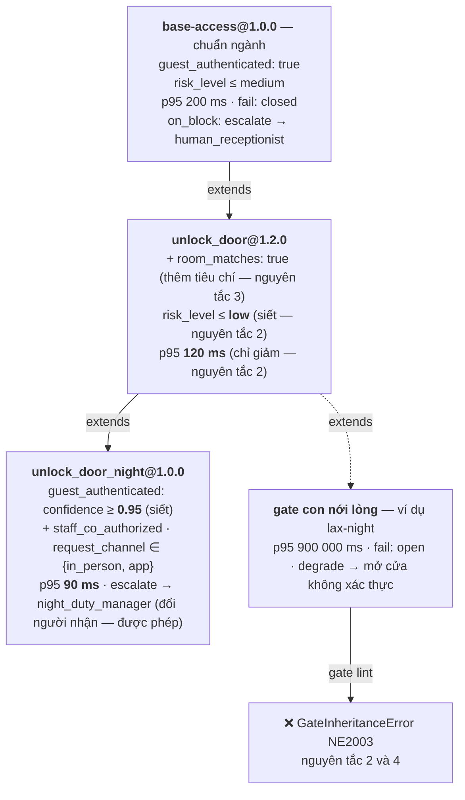

# NeuroEdge

## Nền tảng Hợp đồng Hành động Chuẩn kiểu (Type-Safe Action Contracts) cho Physical AI

**Phiên bản:** 5.5  
**Ngày cập nhật:** 23 tháng 9, 2026 *(v5.5: đồng bộ Phụ lục B với RFC-0001/RFC-0004 và các quyết định Q-10, Q-14, Q-17, Q-18 ngày 2026-09-23; dọn các câu còn sót từ trước CR-1.0)*  
**Đối tượng tài liệu:** Đội ngũ phát triển sản phẩm · Đối tác phần cứng (OEM/ODM) · Kỹ sư nền tảng · Khách hàng vận hành đội thiết bị (Fleet Operators)  
**Phạm vi tài liệu:** Định vị sản phẩm · Kiến trúc hệ thống 5 lớp · Đặc tả API & định dạng chuẩn · Mô hình thương mại · Lộ trình triển khai · Ranh giới sản phẩm · Hệ chỉ số đo lường  
**Ngoài phạm vi:** Cấu trúc sở hữu doanh nghiệp · Kế hoạch gọi vốn đầu tư · Điều khoản pháp lý chi tiết  

---

## Mục lục

**Phần 0 — Tóm tắt tổng quan dành cho ban điều hành**

- [0.1 Bối cảnh thị trường](#01-bối-cảnh-thị-trường)
- [0.2 Vấn đề cốt lõi của Physical AI](#02-vấn-đề-cốt-lõi-của-physical-ai)
- [0.3 Tuyên ngôn sản phẩm](#03-tuyên-ngôn-sản-phẩm)
- [0.4 Năm nguyên tắc thiết kế bất biến](#04-năm-nguyên-tắc-thiết-kế-bất-biến)
- [0.5 Thông điệp cốt lõi theo từng nhóm độc giả](#05-thông-điệp-cốt-lõi-theo-từng-nhóm-độc-giả)

**Phần I — Luận điểm chiến lược**

1. [Luận điểm chiến lược & kinh tế học sản phẩm](#1-luận-điểm-chiến-lược--kinh-tế-học-sản-phẩm)
2. [Bộ lọc ưu tiên tính năng PF-1 đến PF-4](#2-bộ-lọc-ưu-tiên-tính-năng-pf-1-đến-pf-4)

**Phần II — Kiến trúc & Thiết kế sản phẩm**

3. [Kiến trúc hệ thống 5 lớp](#3-kiến-trúc-hệ-thống-5-lớp)
   - [3.8 Quản trị lược đồ mở (Open Schema Governance)](#38-quản-trị-lược-đồ-mở-open-schema-governance)
   - [3.9 Quản trị phụ thuộc mã nguồn mở (Open Source Governance)](#39-quản-trị-phụ-thuộc-mã-nguồn-mở-open-source-governance)
4. [Đặc tả API và trải nghiệm lập trình](#4-đặc-tả-api-và-trải-nghiệm-lập-trình)
5. [Thiết kế an toàn và bảo mật mặc định](#5-thiết-kế-an-toàn-và-bảo-mật-mặc-định)

**Phần III — Mô hình thương mại & Lộ trình triển khai**

6. [Mặt phẳng thương mại: Fleet OS](#6-mặt-phẳng-thương-mại-fleet-os)
7. [Ứng dụng mẫu điển hình: AURA cho khách sạn & nghỉ dưỡng](#7-ứng-dụng-mẫu-điển-hình-aura-cho-khách-sạn--nghỉ-dưỡng)
8. [Lộ trình phát triển sản phẩm](#8-lộ-trình-phát-triển-sản-phẩm)
9. [Ranh giới sản phẩm và ma trận đánh đổi](#9-ranh-giới-sản-phẩm-và-ma-trận-đánh-đổi)

**Phần IV — Đánh giá cạnh tranh & Quản trị rủi ro**

10. [Bản đồ cạnh tranh & Lợi thế phòng thủ](#10-bản-đồ-cạnh-tranh--lợi-thế-phòng-thủ)
11. [Ma trận rủi ro & Phương án giảm thiểu](#11-ma-trận-rủi-ro--phương-án-giảm-thiểu)
12. [Hệ chỉ số hiệu suất mục tiêu (KPIs)](#12-hệ-chỉ-số-hiệu-suất-mục-tiêu-kpis)

**Phụ lục**

- [A — Đặc tả hợp đồng năng lực HAL](#phụ-lục-a--đặc-tả-hợp-đồng-năng-lực-hal)
- [B — Đặc tả định dạng cấu hình gate v1](#phụ-lục-b--đặc-tả-định-dạng-cấu-hình-gate-v1)
- [C — Đặc tả lược đồ vết ghi (JSON)](#phụ-lục-c--đặc-tả-lược-đồ-vết-ghi-json)
- [D — Ma trận phần cứng, mô hình AI và tích hợp](#phụ-lục-d--ma-trận-phần-cứng-mô-hình-ai-và-tích-hợp)
- [E — Bảng đối chiếu nguyên lý phát triển sản phẩm](#phụ-lục-e--bảng-đối-chiếu-nguyên-lý-phát-triển-sản-phẩm)
- [F — Từ điển thuật ngữ](#phụ-lục-f--từ-điển-thuật-ngữ)
- [G — Danh mục giả định cần kiểm chứng](#phụ-lục-g--danh-mục-giả-định-cần-kiểm-chứng)
- [H — Ma trận phụ thuộc mã nguồn mở](#phụ-lục-h--ma-trận-phụ-thuộc-mã-nguồn-mở)

---

# Phần 0 — Tóm tắt tổng quan dành cho ban điều hành

## 0.1 Bối cảnh thị trường

Lĩnh vực Trí tuệ nhân tạo Vật lý (Physical AI - AI tương tác với thế giới thực qua cảm biến và cơ cấu chấp hành) đang ở điểm hội tụ của ba làn sóng công nghệ lớn:

| # | Làn sóng | Minh chứng thực tế |
|:---:|:---|:---|
| 1 | **Phần cứng AI biên tối ưu chi phí** | Các vi điều khiển tích hợp Wi-Fi/BLE và khả năng tăng tốc AI có giá chỉ $3–$15 (ESP32-S3, RP2350, RPi Zero 2W); các mô-đun điện toán công nghiệp ở mức ~$80. |
| 2 | **Mô hình ngôn ngữ nhỏ (SLM) chạy on-device** | Các mô hình kích thước 0.5B–3B tham số đã có thể phân loại ý định (intent) và trích xuất thực thể (entity) trực tiếp trên thiết bị mà không cần kết nối Internet. |
| 3 | **Chuẩn hóa giao tiếp công cụ** | Giao thức Model Context Protocol (MCP) dần trở thành chuẩn chung để kết nối tư duy của mô hình AI với các công cụ ngoại vi. |

Tuy nhiên, thị trường vẫn thiếu một lớp phần mềm chuẩn mực kết nối ba yếu tố trên thành một nền tảng phát triển liền mạch. Ngay cả một bài toán cơ bản — như thiết bị ra lệnh bằng giọng nói — hiện vẫn đòi hỏi kỹ sư tự ghép nối 6 thư viện rời rạc và thiếu tương thích: khử vang/bắt tiếng (AEC/VAD), nhận diện từ khóa kích hoạt (wake-word), chuyển đổi âm thanh - văn bản (STT/TTS), máy trạng thái hội thoại, trình điều khiển phần cứng (driver) và cơ chế bảo vệ an toàn vật lý. Quy trình này thường tiêu tốn **2–4 tuần cho bản mẫu (prototype)** và **3–6 tháng để đạt chuẩn sản xuất**.

## 0.2 Vấn đề cốt lõi của Physical AI

Thiếu sót này thường được hiểu đơn giản là *"thị trường cần thêm một Physical AI framework"*. Định nghĩa này **đúng về mặt tính năng**: NeuroEdge cung cấp đầy đủ lớp tích hợp hợp nhất (unified layer) gồm HAL (Hardware Abstraction Layer), tầng nhận thức (perception), điều phối agent và tầng điều khiển hành động trên mọi môi trường thực thi.

Tuy nhiên, **chỉ cung cấp tính năng thì chưa tạo ra lợi thế cạnh tranh bền vững**. Một bộ khung tích hợp là thứ các đối thủ lớn đều có thể sao chép bằng cách bổ sung tính năng.

Thách thức cốt lõi nằm ở tầng sâu hơn: **chưa có công cụ nào giúp kiểm thử và đảm bảo tính an toàn của hành động vật lý trước khi đưa thiết bị ra vận hành thực tế.**

- Khi một chatbot phần mềm phản hồi sai, người dùng có thể yêu cầu tạo lại câu trả lời.
- Nhưng khi một Agent vật lý ra quyết định sai, **động cơ servo đã quay, rơ-le đã đóng, chốt cửa đã mở.** Các hành vi tác động vào thế giới vật lý là bất khả nghịch và tiềm ẩn rủi ro tai nạn, hư hại tài sản.

```text
┌────────────────────────────────────────────────────────────────────────┐
│               NGHỊCH LÝ KIỂM THỬ TRONG PHÁT TRIỂN PHYSICAL AI           │
├────────────────────────────────────────────────────────────────────────┤
│  PHẦN MỀM TRUYỀN THỐNG                                                 │
│  Viết mã ──► Phân tích tĩnh ──► Unit test ──► CI/CD ──► Kết quả ổn định│
│                                                                        │
│  PHYSICAL AI HIỆN NAY                                                  │
│  Prompt/Mã ──► Nạp firmware ──► Thử nghiệm thủ công ──► Rủi ro sự cố   │
│                                                                        │
│  VỚI GIẢI PHÁP NEUROEDGE                                               │
│  Mã Agent ──► Đối chiếu năng lực ──► Replay kiểm thử CI ──► Rollout    │
│               (chặn ngay khi build)  (thẩm định gate & GPIO) (an toàn) │
└────────────────────────────────────────────────────────────────────────┘
```

**Ví dụ thứ hai — một trợ lý giọng nói trong nhà.** Chốt cửa chỉ minh hoạ một loại hành vi. Một trợ lý thật trộn ba loại, và mỗi loại cần một hợp đồng khác:

| Hành vi | Loại | Cơ chế NeuroEdge |
|:---|:---|:---|
| Trả lời câu hỏi từ knowledge base của gia đình | Lời nói — sai thì sửa được | Tìm tri thức cục bộ, System 2 diễn đạt lại (RAG); mất mạng thì nói câu trả lời cục bộ. `c.say`, không qua gate, không assert trên chữ (L3) |
| Đọc tin tức từ internet | Lời nói **cần mạng** | Mất mạng thì nói rõ là chưa lấy được, **không bịa** |
| Bật / tắt đèn | **Hành động vật lý** | `c.do` qua gate: không tắt đèn khi cảm biến chuyển động còn thấy người — gate hỏi lại thay vì làm. Mất mạng, đèn vẫn điều khiển được bằng ngữ pháp lệnh cục bộ (Q-14) |

Bản chạy được: `fixtures/agents/home-voice/` (`neuroedge new <tên> --template home-voice`).

Hiện nay, các công cụ truyền thống không thể trả lời 3 câu hỏi sống còn sau:

1. Khi thay đổi prompt điều khiển, agent có chắc chắn từ chối mở khóa cho người chưa được xác thực hay không?
2. Khi chuyển đổi từ mô hình AI A sang mô hình B (vốn có tính phi xác định về câu chữ), làm sao để chứng minh các phán quyết an toàn (gate verdicts) và tín hiệu điều khiển phần cứng không bị hồi quy (regression)?
3. Cùng một tập dữ liệu đầu vào và trạng thái, liệu rule engine thẩm định an toàn chạy trên máy mô phỏng, máy tính Linux và vi điều khiển có đưa ra cùng một phán quyết hay không?

## 0.3 Tuyên ngôn sản phẩm

> **NeuroEdge chuẩn hóa mọi tác vụ vật lý của AI Agent thành hợp đồng có kiểu (type-safe), có phiên bản rõ ràng, kiểm thử tự động trong quy trình CI/CD, và thực thi nhất quán trên mọi môi trường — từ laptop của lập trình viên, máy tính Linux công nghiệp đến vi điều khiển biên giá $5.**

Cụ thể hơn: **mọi đường từ ngôn ngữ tới hành động thực — giọng nói offline, LLM, hay agent bên ngoài qua MCP — là một tool call có kiểu, đi qua cùng một gate** (§3.5, Q-24).

Tuyên ngôn này thể hiện rõ hai trụ cột chiến lược:
- **Phạm vi sản phẩm (Scope):** Nền tảng hợp nhất cho Physical AI — bộ công cụ hoàn chỉnh để kỹ sư cài đặt, lập trình và đưa vào vận hành.
- **Lợi thế cạnh tranh cốt lõi (Moat):** Cơ chế hợp đồng hành động chuẩn kiểu (Type-safe Action Contracts) kết hợp CI kiểm thử hành vi vật lý — giải pháp mang tính kiến trúc nền tảng mà đối thủ không thể sao chép đơn thuần bằng cách thêm tính năng.

Hệ thống được cấu thành từ ba khối giải pháp chính:

| Khối giải pháp | Nội dung chi tiết |
|:---|:---|
| **Lõi mã nguồn mở (Giấy phép MIT)** | Lớp trừu tượng phần cứng dựa trên hợp đồng năng lực (Capability-contract HAL) · Động cơ hợp đồng hành động (Action Contract Engine) · Runtime xử lý giọng nói · **Lớp trừu tượng nhà cung cấp AI (LLM · ASR · TTS) theo chuẩn OpenAI API, kèm cơ chế adapter tùy chỉnh** · Các môi trường thực thi ngang hàng (`sim` · `linux` · `esp32s3` ở bậc 1) · Trình kiểm thử Action CI runner. |
| **Mặt phẳng dịch vụ thương mại** | Hệ điều hành quản trị đội thiết bị tập trung (Fleet Management OS) — trụ cột thương mại duy nhất. NeuroEdge không bán lại token suy luận. |
| **Cột mốc xác thực thị trường định lượng** | Bộ tiêu chí kiểm chứng thanh khoản nghiêm ngặt: chỉ triển khai tính năng Marketplace và thanh toán tự động (Pay) khi đã đạt đủ 4 chỉ số thực tế đo lường được. |

## 0.4 Năm nguyên tắc thiết kế bất biến

| # | Nguyên tắc | Tác động kiến trúc & Hiệu quả vận hành | Mục chiếu |
|:---:|:---|:---|:---:|
| **1** | **Hành động vật lý là hợp đồng chuẩn kiểu, không phải lời gọi hàm tự do** | Mọi lệnh điều khiển cơ cấu chấp hành (actuator) đều phải đi qua một cổng kiểm soát an toàn (gate) có phiên bản và có thể phân tích tĩnh. HAL sẽ từ chối mọi yêu cầu hành động nếu chưa vượt qua gate an toàn. Nguồn gọi không tạo ngoại lệ: câu lệnh cục bộ, LLM và client MCP đều gửi cùng một tool call qua cùng gate. | §3.5, §4.4 |
| **2** | **Các môi trường thực thi ngang hàng (Target Equivalence)** | Mọi môi trường thực thi cùng tuân thủ một chuẩn HAL duy nhất. Cùng một tệp mã nguồn agent chạy nhất quán trên mọi môi trường mà không cần chỉnh sửa và không rẽ nhánh logic theo target. Cam kết kiểm chứng phân theo ba bậc target (§3.2): bậc 1 chính thức, bậc 2 mở rộng, bậc 3 do cộng đồng duy trì. | §3.2 |
| **3** | **Tập trung giá trị vào quản trị đội thiết bị, không chạy đua bán lại token AI** | Bán lại token suy luận (inference) có biên lợi nhuận mỏng và dễ bị cạnh tranh bởi các nhà cung cấp mô hình lớn. Giá trị gia tăng dài hạn nằm ở nền tảng quản lý, giám sát và cập nhật an toàn cho đội thiết bị ngoài hiện trường. | §6 |
| **4** | **Mô hình AI là thành phần linh hoạt, có thể thay thế — cloud-first, provider-pluggable** | Tách rời logic điều khiển khỏi mô hình AI cụ thể thông qua giao diện trừu tượng `SystemOne` và `SystemTwo`. Mọi tác vụ AI (LLM, ASR, TTS) là nhà cung cấp (provider) có thể thay thế, kết nối qua **chuẩn OpenAI API** hoặc **adapter do người dùng tự viết**. Phần nặng về xử lý ngôn ngữ chạy trên cloud hoặc host; vi điều khiển chỉ đảm nhiệm thu/phát âm thanh và thẩm định gate. Việc đổi nhà cung cấp mô hình không làm ảnh hưởng đến cấu trúc an toàn của sản phẩm. | §3.4, §3.6, §6 |
| **5** | **Kích hoạt hiệu ứng mạng từ cộng đồng chia sẻ chính sách an toàn** | Xây dựng kho lưu trữ chia sẻ gate an toàn miễn phí (Public Gate Registry) từ sớm; chỉ thương mại hóa khi cộng đồng đã hình thành nhu cầu trao đổi thực tế. | §1.7, §8.5 |

## 0.5 Thông điệp cốt lõi theo từng nhóm độc giả

| Nhóm độc giả | Giá trị mang lại |
|:---|:---|
| **Lập trình viên / Kỹ sư AI** | Lập trình agent trực tiếp trên laptop, kiểm thử tự động hành vi vật lý qua CI, triển khai thẳng lên chip $5 mà không cần viết lại mã nguồn. |
| **Người vận hành đội thiết bị (Fleet Ops)** | Nắm bắt trạng thái từng thiết bị theo thời gian thực, chẩn đoán lỗi từ xa, cập nhật firmware theo từng đợt an toàn tuyệt đối, loại trừ nguy cơ brick máy. |
| **Đối tác sản xuất phần cứng (OEM/ODM)** | Cung cấp sẵn lớp Agent AI tương thích ngay trên bo mạch mà không ép khách hàng bị phụ thuộc độc quyền vào một dòng vi xử lý cụ thể. |
| **Chuyên gia an toàn & Quản lý chất lượng** | Mỗi tác vụ vật lý đều có điều kiện phê duyệt minh bạch, xem xét được bằng văn bản và có đầy đủ nhật ký vết (trace) phục vụ đối soát, kiểm toán. |

---

---

# Phần I — Luận điểm chiến lược

## 1. Luận điểm chiến lược & kinh tế học sản phẩm

### 1.1 Tiếp cận từ trải nghiệm lý tưởng của khách hàng

Phương pháp luận của NeuroEdge: Xuất phát từ trải nghiệm hoàn hảo theo góc nhìn của khách hàng để định hình cấu trúc sản phẩm. Mọi quyết định kỹ thuật chỉ có giá trị khi giúp giảm thiểu rủi ro, rút ngắn chu kỳ phát triển và tiết kiệm chi phí thực tế cho đội ngũ triển khai.

| # | Trải nghiệm lý tưởng của khách hàng | Hiện trạng thách thức hôm nay | Giải pháp giải quyết của NeuroEdge |
|:---:|:---|:---|:---|
| **1** | Viết mã agent và kiểm thử ngay, không cần chờ mua phần cứng | Mất nhiều tuần chờ đặt bo mạch, hàn nối dây, cài đặt mạch nạp | **Môi trường giả lập `sim`** — Agent hoàn chỉnh chạy trực tiếp trên trình duyệt chỉ sau 10 phút (§3.2) |
| **2** | Đảm bảo chắc chắn agent không gây nguy hiểm **trước khi** nạp firmware | Sự cố an toàn chỉ được phát hiện sau khi thiết bị đã xuất xưởng tới tay người dùng | **Action Contract Engine** — Kiểm tra hợp đồng an toàn tự động lúc biên dịch (build-time) và khi thực thi (runtime) (§3.5) |
| **3** | Khi đổi prompt hoặc mô hình AI, kiểm thử lại toàn bộ kịch bản an toàn trong 30 giây | Phải thử nghiệm thủ công vài trường hợp trong phòng lab, tiềm ẩn rủi ro hồi quy an toàn | **Action CI** — Tái hiện (replay) phiên chạy thực tế, đối chiếu phán quyết gate và trạng thái chân GPIO vật lý với mẫu chuẩn (§3.7) |
| **4** | Một mã nguồn agent duy nhất chạy đồng nhất trên laptop, máy tính nhúng và chip $5 | Phải duy trì nhiều codebase độc lập (ví dụ: Python trên PC, C/C++ trên vi điều khiển) | **Nguyên tắc tương đương môi trường (Target Equivalence)** (§3.2, §4.6) |
| **5** | Chẩn đoán và sửa lỗi thiết bị ngoài hiện trường ngay từ máy tính cá nhân | Kỹ sư phải bay trực tiếp đến hiện trường xử lý, hoặc phải thu hồi toàn bộ lô hàng | **Tái hiện vết ghi từ xa (Remote Trace Replay)** — Tải tệp vết ghi JSON về máy tính để mô phỏng và tái hiện lỗi cục bộ (§6.2) |

Trong các bài toán trên, NeuroEdge tập trung tạo khác biệt phòng thủ vững chắc ở **mục số 2 và số 3** — hai bài toán sống còn mà các framework hiện nay chưa có công cụ giải quyết. Mục số 1 và số 4 là nền tảng trải nghiệm lập trình viên bắt buộc phải có, còn mục số 5 là điểm tựa mang lại giá trị kinh tế trực tiếp cho khách hàng doanh nghiệp.

### 1.2 Tuyên ngôn giá trị cốt lõi (Core Value Proposition)

Bằng cách kết hợp bốn trụ cột kỹ thuật chuẩn mực, NeuroEdge định hình một chuẩn phát triển mới cho Physical AI:

```text
Schema cổng an toàn (gate) có phiên bản ──┐
Ghi lại phiên chạy thực tế trên phần cứng ──┤
Tái hiện (replay) chuẩn xác trong sim   ──┼─►  ACTION CI
Nhật ký vết (trace) chi tiết từng bước  ──┘    Tự động kiểm thử tác vụ vật lý
                                               trong quy trình CI trên mỗi commit
```

Giá trị cốt lõi của NeuroEdge **không đơn thuần là "bộ định tuyến giữa hai mô hình AI"**. Việc phân luồng giữa mô hình nhanh và mô hình sâu chỉ là chi tiết kỹ thuật nhằm tối ưu chi phí và độ trễ tại một thời điểm. Khách hàng doanh nghiệp không trả tiền cho "bộ định tuyến", họ trả tiền để **"chốt cửa không tự ý mở sai cho người lạ, rơ-le nhiệt không kích hoạt quá ngưỡng, và cơ cấu chấp hành không gây tổn hại tài sản"**.

Tuyên ngôn giá trị cũng **không chỉ dừng lại ở "framework hợp nhất cho Physical AI"** — vì một danh sách tính năng thuần túy luôn có thể bị sao chép bởi các đối thủ có tiềm lực lớn hơn.

Khác biệt cốt lõi, bền vững của NeuroEdge là:

> **Mọi hành động vật lý đều bắt buộc đi qua một hợp đồng chuẩn kiểu (type-safe), kiểm thử tự động được trong quy trình CI — hoàn toàn độc lập với mô hình suy luận AI phía sau.**

Dù mô hình ngôn ngữ lớn (LLM) là phi xác định về mặt câu chữ tự nhiên, tầng thẩm định Gate của NeuroEdge là một rule engine xác định 100%. Action CI không assert trên văn bản sinh ra của LLM, mà assert trên **phán quyết của Gate (ALLOW/BLOCK)** và **trạng thái tác động vật lý (chân GPIO có kích hoạt hay không)**.

Giải pháp này đòi hỏi sự đồng bộ chặt chẽ về mặt kiến trúc ngay từ đầu: **Môi trường mô phỏng (simulator) là môi trường thực thi chính thức; Cổng kiểm soát (gate) là tài nguyên có phiên bản; và Nhật ký vết (trace) là đối tượng dữ liệu hạng nhất.** Một hệ thống phần mềm thông thường nếu không thiết kế theo hướng này từ đầu sẽ buộc phải đập đi xây lại toàn bộ cấu trúc để có được năng lực tương tự.

### 1.3 Bốn lợi thế chiến lược cốt lõi (Upstream Strategic Advantages)

Chiến lược phát triển sản phẩm của NeuroEdge tập trung vào việc sở hữu các điểm tiếp xúc đầu nguồn (upstream) trong chuỗi giá trị:

| # | Lợi thế đầu nguồn | Chiến lược làm chủ điểm tiếp xúc | Giai đoạn triển khai |
|:---:|:---|:---|:---:|
| **1** | **Vòng đời dữ liệu** | Hiện diện ngay nơi hành vi vật lý phát sinh đầu tiên: Môi trường mô phỏng (`sim`) và lược đồ vết ghi chuẩn (JSON). Đơn vị làm chủ lược đồ trace sẽ nắm giữ khả năng đánh giá hành vi và an toàn của agent. | Khối 1 |
| **2** | **Hành trình khách hàng** | Đồng hành cùng kỹ sư sáng chế (maker) từ thiết bị đầu tiên thông qua trải nghiệm self-serve trực quan, thay vì chỉ tiếp cận doanh nghiệp khi họ đã có hàng trăm thiết bị. Doanh thu sẽ mở rộng tự nhiên theo quy mô sản xuất của khách hàng. | Khối 1 |
| **3** | **Điểm kết nối dịch vụ** | Lớp trừu tượng nhà cung cấp (§6.1) đứng giữa ứng dụng và các nhà cung cấp mô hình AI, cho phép thay đổi prompt và chuyển đổi mô hình bằng cấu hình mà không cần nạp lại firmware. Đây là thành phần mã nguồn mở do người dùng tự vận hành, không phải dịch vụ trả phí. | Khối 1a |
| **4** | **Dòng tiền giao dịch** | Chi phí cập nhật từ xa (OTA) và truyền dữ liệu giám sát (telemetry) được gom về một kết nối, một tài khoản xác thực và một hóa đơn Fleet duy nhất. Chi phí suy luận (inference) người dùng trả trực tiếp cho nhà cung cấp — NeuroEdge không bán lại inference *(CR-1.0)*. | Khối 2 |

Trong đó, **vòng đời dữ liệu là lợi thế chiến lược quan trọng nhất.** Tương tự như cách các nền tảng nhân sự hàng đầu chiếm lĩnh dữ liệu từ bước onboarding nhân viên, với Physical AI, điểm khởi nguồn dữ liệu chính là **khoảnh khắc một hành động vật lý được đề xuất và kiểm thử trong môi trường mô phỏng**. Do đó, môi trường `sim` và lược đồ vết ghi được đầu tư tối đa để trở thành chuẩn mực tự nhiên của lập trình viên.

### 1.4 Chiến lược tiếp cận khác biệt hóa (Flanking Strategy)

Các hãng sản xuất bán dẫn (silicon vendors) thường phát hành SDK miễn phí với động cơ cốt lõi là **bán chip**. Cạnh tranh trực diện ở tầng trình điều khiển (driver) đơn chip với chính hãng sản xuất là một chiến lược không hiệu quả.

**Hướng đi khác biệt hóa của NeuroEdge: Tập trung vào tính kiểm thử và an toàn của hành động vật lý, hoạt động độc lập và xuyên suốt trên mọi nền tảng phần cứng.**

SDK chính hãng khó có thể theo đuổi hướng đi này, vì điều đó đòi hỏi họ phải đối xử với chip của các đối thủ khác hoàn toàn bình đẳng.

Đây là lý do môi trường `linux` được đưa vào như một mục tiêu hỗ trợ ngang hàng (first-class citizen) ngay từ Khối 1: **Môi trường thực thi thứ hai chính là bằng chứng xác thực rằng tầng trừu tượng phần cứng của NeuroEdge là độc lập và trung lập**, giúp sản phẩm không bị đóng khung thành một công cụ phụ thuộc vào một dòng chip cụ thể.

### 1.5 Mã nguồn mở là kênh tiếp cận, định dạng là chuẩn mực công nghiệp

Chiến lược mã nguồn mở của NeuroEdge hoạt động hiệu quả vì tiếp cận trực tiếp kỹ sư kỹ thuật — những người trực tiếp lựa chọn giải pháp kiến trúc:

| Thuộc tính | Hiện thực hóa tại NeuroEdge |
|:---|:---|
| Đúng tầng công nghệ | Tầng hạ tầng điều khiển và kiểm thử, không can thiệp vào logic nghiệp vụ chuyên sâu của khách hàng. |
| Thị trường chưa có chuẩn chung | Lĩnh vực Physical AI hiện chưa có chuẩn mực thống nhất để định nghĩa "hành động nào được coi là an toàn". |
| Trực quan, dễ lan tỏa | Bản demo tương tác giọng nói với vi điều khiển và cơ cấu chấp hành chuyển động rõ ràng, ấn tượng. |
| Người dùng là người quyết định | Kỹ sư có thể tự cài đặt, trải nghiệm trong vài phút mà không cần qua quy trình mua sắm phức tạp. |

**NeuroEdge phân phối một framework mã nguồn mở, nhưng tài sản chuẩn hóa cốt lõi là ba đặc tả: lược đồ gate, lược đồ vết ghi JSON, và Gated Tool Profile** — ngữ nghĩa của một tool call tới thiết bị vật lý, đặt trên đường truyền MCP sẵn có thay vì phát minh giao thức mới ([`docs/spec/tool_calling.md`](docs/spec/tool_calling.md)). Framework có thể có nhiều biến thể, nhưng chuẩn lược đồ mô tả độ an toàn vật lý và quy trình kiểm thử CI đi kèm sẽ tạo nên hiệu ứng tiêu chuẩn công nghiệp lâu dài.

Bản quyền mã nguồn mở MIT cho toàn bộ HAL, Action Contract Engine, Voice pipeline và Action CI giúp loại bỏ hoàn toàn rào cản ứng dụng của cộng đồng kỹ sư nhúng.

#### Quản trị chuẩn mở và Cam kết chuyển giao cho tổ chức trung lập
Để lược đồ Gate và lược đồ vết ghi JSON thực sự trở thành tiêu chuẩn chung không bị chi phối bởi lợi ích cục bộ của bất kỳ công ty nào, NeuroEdge thiết lập cơ chế quản trị chuẩn mực ngay từ ngày đầu:
- **Quy trình RFC (Request for Comments) minh bạch:** Mọi thay đổi về schema của `@action`, cú pháp của Gate hoặc lược đồ JSON của vết ghi đều phải qua tài liệu RFC công khai trên GitHub, cho phép cộng đồng thảo luận và phản biện trước khi hợp nhất.
- **Tuân thủ Semantic Versioning (SemVer 2.0):** Cam kết tuyệt đối không phá vỡ khả năng tương thích ngược (backward compatibility) đối với các Gate an toàn đã phát hành.
- **Cam kết chuyển giao cho tổ chức trung lập:** Khi đạt Cột mốc xác thực thị trường G1 (10.000 thiết bị active, cộng đồng nhà phát triển ổn định), NeuroEdge cam kết **chuyển giao toàn bộ quyền quản trị đặc tả kỹ thuật Gate và lược đồ vết ghi JSON cho một tổ chức trung lập** (như Linux Foundation hoặc Eclipse Foundation). NeuroEdge sẽ tiếp tục cạnh tranh và tạo ra giá trị thương mại thông qua chất lượng dịch vụ **Fleet OS**, thay vì độc quyền nắm giữ định dạng chuẩn.

### 1.6 Chiến lược phân phối và chinh phục 1.000 lập trình viên đầu tiên

Physical AI là một lĩnh vực phần cứng nơi sự hoài nghi của kỹ sư là rất cao. Để chinh phục 1.000 lập trình viên và kỹ sư nhúng đầu tiên, NeuroEdge tập trung vào tính trực quan tức thì và ứng dụng thực chiến:

#### 1. Trải nghiệm "Aha Moment" trong 15 giây (Demo Video/GIF)
Không dùng các bài trình chiếu trừu tượng. Thông điệp phân phối cốt lõi gói gọn trong một video/GIF 15 giây quay cận cảnh không cắt ghép:
- Nửa màn hình trái: Cửa sổ Terminal gõ `neuroedge run` gửi lệnh giọng nói *"Mở khóa cửa phòng villa"*.
- Nửa màn hình phải: Bo mạch thật ESP32-S3 chớp đèn LED trạng thái, rơ-le phát ra tiếng "click" đóng mở khóa vật lý thật.
- Cửa sổ bên cạnh: Action CI lập tức hiển thị trace xanh đối soát gate thành công.
*Hiệu ứng tâm lý:* Kỹ sư nhúng thấy ngay đây không phải là một thư viện chatbot giả lập trên web, mà là công cụ điều khiển và kiểm soát phần cứng thực sự.

#### 2. Kênh phát hành trọng điểm của cộng đồng kỹ thuật
- **Hacker News (Show HN):** Giới thiệu giải pháp giải quyết bài toán "Làm sao kiểm thử an toàn cho AI tác động vào thế giới vật lý trước khi nạp chip".
- **Reddit:** Tiếp cận trực diện các subreddit chuyên sâu: `r/embedded`, `r/esp32`, `r/rust`, `r/robotics`.
- **Cộng đồng Hardware Hackers & Maker trên X:** Chia sẻ các clip ngắn ghi lại các ca lỗi thực tế bị Action CI chặn đứng (fail-closed).
- **Diễn đàn Hackaday & ESP32 Community Forum:** Đăng tải các bài phân tích kỹ thuật chuyên sâu về quản lý bộ nhớ PSRAM và xử lý âm thanh không độ trễ.

#### 3. Bộ ba ứng dụng mẫu tham chiếu chuẩn mực (Reference Sample Apps)
Lập trình viên không bắt đầu từ trang trắng. NeuroEdge cung cấp sẵn 3 mã nguồn ứng dụng hoàn chỉnh có thể chạy ngay:
1. **Khóa thông minh Villa (Villa Smart Lock):** Ứng dụng nhận diện giọng nói, thẩm định gate chốt kép trước khi cấp xung mở rơ-le cửa.
2. **Trợ lý giọng nói trong nhà (Home Voice Assistant):** Hỏi đáp trên knowledge base của gia đình theo mô hình RAG (mất mạng thì trả lời cục bộ), đọc tin tức qua System 2, bật / tắt đèn qua gate có cảm biến chuyển động. Bản chạy được trên `sim`: `fixtures/agents/home-voice/` (§0.2).
3. **Giám sát môi trường công nghiệp (Industrial Environmental Watcher):** Thu thập dữ liệu cảm biến khí ga/nhiệt độ, tự động kích hoạt van xả an toàn hoặc còi báo động qua gate an toàn.

### 1.7 Vòng lặp giá trị và hiệu ứng mạng từ chia sẻ cấu hình an toàn

```text
Chạy thử agent trong môi trường mô phỏng sau 10 phút, không cần mua phần cứng
                              │
                              ▼
Thiết lập gate an toàn đầu tiên — Agent tự động từ chối tác vụ nguy hiểm
                              │
                              ▼
Ghi nhật ký chạy thực tế trên bo mạch (tệp JSON), tự động kiểm thử trong CI mỗi commit
                              │
                              ▼
Triển khai đội thiết bị (10 ➔ 100 ➔ 1.000 máy), cập nhật OTA theo đợt an toàn tuyệt đối
                              │
                              ▼
Sử dụng gói quản trị tập trung (Fleet Management OS) theo nhu cầu thực tế
                              │
                              ▼
Chia sẻ các gate an toàn đã hoàn thiện lên Public Registry (kế thừa qua `extends`)
                              │
                              ▼
Dữ liệu sử dụng gate thực tế giúp xác định chính xác các mô-đun có nhu cầu thương mại cao
```

Hai điểm then chốt trong vòng lặp:
1. **Bước 2 và 3** tạo ra giá trị kỹ thuật khác biệt mà các giải pháp khác chưa đáp ứng được.
2. **Bước 6 tạo ra hiệu ứng mạng tự nhiên trước khi mở Marketplace thương mại.** Gate an toàn là tài nguyên lý tưởng để chia sẻ: dung lượng nhẹ (tệp YAML), minh bạch, không rủi ro pháp lý, và giúp nâng cao tiêu chuẩn an toàn cho toàn bộ cộng đồng sử dụng.

**Loại tài sản chia sẻ thứ hai: adapter và HAL port.** Từ Giai đoạn 2 (§8.9), cộng đồng còn chia sẻ *mã thực thi* — adapter kết nối nhà cung cấp AI và bản port HAL cho phần cứng mới. Lập luận biện minh cho việc chia sẻ gate **không chuyển sang được** cho loại tài sản này, và cần nói rõ vì sao:

| | Gate an toàn | Adapter và HAL port |
|:---|:---|:---|
| **Bản chất** | Dữ liệu khai báo (YAML) | Mã thực thi (Python, C/C++) |
| **Chạy ở đâu** | Được bộ phân giải đọc, không tự thực thi | Chạy trên thiết bị có cơ cấu chấp hành vật lý |
| **Rủi ro khi nhận từ người lạ** | Thấp — đọc được bằng mắt, mọi phán quyết vẫn qua bộ phân giải đã cưỡng chế năm nguyên tắc kế thừa | **Cao** — mã tùy ý gần phần cứng |
| **Cổng kiểm soát** | `neuroedge gate lint` (phân giải) | Ba lớp: **Bộ kiểm thử tuân thủ** (§3.8 trụ cột 2) để tự chứng minh tương đương · **sandbox phân quyền** (đường ray 7, §8.5) để giới hạn truy cập chân actuator nhạy cảm · **đối chiếu năng lực lúc build** (§4.9) để chặn bất tương thích |

Điểm bất biến xuyên suốt: dù adapter hay HAL port đến từ đâu, **mọi lệnh tới cơ cấu chấp hành vẫn phải qua gate**, và gate vẫn chạy trong lõi do NeuroEdge kiểm soát. Một bản port sai có thể làm thiết bị không chạy; nó không thể làm thiết bị hành động khi gate nói không.

### 1.8 Kinh tế học của khách hàng và mô hình chi phí TCO giả định

Mô hình so sánh tổng chi phí sở hữu (TCO) giả định cho một đội ngũ vận hành **500 thiết bị trong vòng 1 năm**:

| Hạng mục chi phí | Tự phát triển từ đầu | Dùng SDK chính hãng | Dùng Cloud Agent Stack | **Dùng NeuroEdge** |
|:---|:---:|:---:|:---:|:---:|
| **Nhân sự kỹ thuật chuyên trách** | 3 kỹ sư — $180k<br>*(firmware + audio + AI)* | 2 kỹ sư — $120k<br>*(chuyên sâu 1 dòng chip)* | 1.5 kỹ sư — $90k<br>*(WebRTC/cloud)* | **0.5 kỹ sư — $30k**<br>*(tập trung logic nghiệp vụ)* |
| **Thời gian tích hợp bo mạch mới** | 12 tuần | 8 tuần | Không hỗ trợ MCU | **1 tuần** *(chỉ cần cấu hình `--target`)* |
| **Chi phí xử lý sự cố tại hiện trường** | ~$30k<br>*(cử kỹ sư on-site)* | ~$15k<br>*(phân tích log thủ công qua UART)* | ~$10k<br>*(phụ thuộc đường truyền)* | **~$9k**<br>*(giảm ~70% chuyến đi nhờ tải tệp vết ghi về mô phỏng cục bộ và chẩn đoán lỗi phần mềm từ xa; giữ ngân sách $9k cho hỏng hóc vật lý)* |
| **Chi phí bản quyền nền tảng** | $0 | $0 | ~$8k | **$6k** *($1/thiết bị/tháng — chỉ phí Fleet, không gồm inference)* |
| **Rủi ro thu hồi sản phẩm do lỗi logic** | Cao — thiếu công cụ CI cho tác vụ vật lý | Cao — thiếu công cụ CI cho tác vụ vật lý | Trung bình — thiếu cơ chế fail-closed | **Thấp** — các lỗi logic xác định được chặn từ khâu commit |
| **TỔNG CHI PHÍ NĂM ĐẦU** | **~$250k** | **~$160k** | **~$120k** | **~$48k** |

**Cơ sở giả định của mô hình TCO:**
- Quy mô kịch bản: 500 thiết bị, 1 thiết kế phần cứng tham chiếu, vận hành trong 12 tháng.
- Chi phí nhân sự: $60.000/kỹ sư/năm (đã bao gồm chi phí vận hành chung).
- Chi phí dịch vụ NeuroEdge: **duy nhất** gói quản trị Fleet $1/thiết bị/tháng ($6.000/năm). Chi phí suy luận (inference) do khách hàng trả **trực tiếp cho nhà cung cấp mô hình** và không đi qua NeuroEdge; khoản này nằm ngoài bảng so sánh vì đồng nhất giữa các phương án có dùng mô hình đám mây.
- Chi phí xử lý sự cố tại chỗ (on-site): Ước tính $500/chuyến công tác thực địa (tương đương 60 chuyến/năm ở phương án tự làm). Giải pháp NeuroEdge không xóa bỏ hoàn toàn chi phí này vì các hư hỏng vật lý (cháy nguồn, đứt cáp, vỡ kính cảm biến) bắt buộc phải có mặt kỹ thuật viên; con số ~$9k phản ánh việc loại bỏ ~70% các chuyến đi do lỗi logic, sai cấu hình hoặc cập nhật firmware hỏng nhờ khả năng tái hiện lỗi từ xa qua tệp vết ghi JSON (giả định G-e tại Phụ lục G).
- Chi phí phần cứng (BOM): Đồng nhất giữa các phương án nên không đưa vào so sánh.

*Lưu ý về phạm vi kiểm thử của Action CI:* Action CI giải quyết triệt để các lỗi logic có thể xác định trước (sai điều kiện gate, prompt gây hồi quy, lệch quyết định giữa các target). Các yếu tố vật lý đặc thù như phản xạ âm học phòng, chất lượng thu âm mảng micro, hoặc giới hạn bộ nhớ vi điều khiển sẽ được kiểm chứng bổ sung qua quy trình tự động chạy trên thiết bị thật (nightly hardware tests) nêu tại §3.2.

---

## 2. Bộ lọc ưu tiên tính năng PF-1 đến PF-4

Bộ nguyên tắc rõ ràng giúp định hướng phát triển sản phẩm, đánh giá mọi đề xuất tính năng:

| # | Bộ lọc | Câu hỏi kiểm tra tính phù hợp |
|:---:|:---|:---|
| **PF-1** | **Tối ưu thời gian nhận giá trị (Time-to-first-value)** | Tính năng có giúp rút ngắn thời gian từ lúc cài đặt (`pip install`) đến khi chạy thử nghiệm thành công đầu tiên không? |
| **PF-2** | **Nền tảng cấu trúc không thể bổ sung muộn** | Nếu không làm ngay từ đầu, sau 12 tháng liệu có thể nâng cấp mở rộng được không, hay sẽ phải viết lại toàn bộ kiến trúc? |
| **PF-3** | **Dựa trên nhu cầu thực tế đã xác thực** | Đã có phản hồi và yêu cầu từ người dùng thực tế chưa, hay chỉ là phán đoán chủ quan về tương lai? |
| **PF-4** | **Kiểm soát an toàn pháp lý và tuân thủ** | Tính năng có làm phát sinh các giấy phép tài chính phức tạp, lưu giữ tiền gửi, KYC hoặc trách nhiệm pháp lý vượt khả năng kiểm soát không? |

**Thứ tự áp dụng:**
- Vi phạm PF-4 → **Loại bỏ hoàn toàn**.
- Thỏa mãn PF-1 hoặc PF-2 → **Ưu tiên thực hiện ngay**.
- Chưa rõ PF-3 → **Tạm hoãn để kiểm chứng thêm**.

| Đề xuất tính năng | Đánh giá & Quyết định |
|:---|:---|
| Gate an toàn là tệp cấu hình có phiên bản (thay vì viết cứng trong code) | Thỏa mãn PF-2 — Thay đổi sau này sẽ phá vỡ toàn bộ kiến trúc → **Triển khai ngay** |
| Hệ thống đo lường (metering) theo lượt gọi agent và đánh giá gate | Thỏa mãn PF-2 — Cần thiết cho hạ tầng kiểm toán và thanh toán → **Triển khai ngay** |
| Hỗ trợ môi trường `linux` ngang hàng với vi điều khiển | Thỏa mãn cả PF-1 và PF-2 — Chứng minh tính đa nền tảng → **Triển khai ngay** |
| Bảng điều khiển BI tùy biến chuyên sâu | Chưa thỏa PF-1 và PF-3 — Làm loãng trọng tâm ban đầu → **Tạm hoãn** |
| Thanh toán tự động giữa các agent (Agent-to-agent pay) | Vi phạm PF-4 — Vướng các yêu cầu tuân thủ tài chính phức tạp → **Chỉ xem xét sau khi đạt các cột mốc thanh khoản** |

---

# Phần II — Kiến trúc & Thiết kế sản phẩm

## 3. Kiến trúc hệ thống 5 lớp

### 3.1 Sơ đồ khối tổng thể và trục Action CI

```text
┌────────────────────────────────────────────────────────────────────────┐
│  L4: AGENT LAYER (Tầng ứng dụng Agent)                                 │
│      Máy trạng thái hội thoại · Bộ nhớ ngữ cảnh · Tool call có gate (MCP)│
├────────────────────────────────────────────────────────────────────────┤
│  L3: ACTION CONTRACT ENGINE (Động cơ hợp đồng hành động)   ← IP cốt lõi │
│      Xác thực cổng chuẩn kiểu · Kế thừa chính sách · Mạch ngắt Fail-closed │
├────────────────────────────────────────────────────────────────────────┤
│  L2: PERCEPTION & RUNTIME (Tầng nhận thức & Thời gian thực)            │
│      Nhận diện Wake-word · Neural VAD · Khử vang AEC · STT/TTS độ trễ thấp │
├────────────────────────────────────────────────────────────────────────┤
│  L1: HARDWARE ABSTRACTION LAYER (HAL - Lớp trừu tượng phần cứng)       │
│      5 nguyên thủy bất biến · Đối chiếu hợp đồng năng lực lúc biên dịch │
├────────────────────────────────────────────────────────────────────────┤
│  L0: TARGET IMPLEMENTATIONS (Các môi trường thực thi ngang hàng)       │
│      [ sim (Mô phỏng) ]     [ linux (Công nghiệp) ]   [ esp32s3 (Biên) ]│
└────────────────────────────────────────────────────────────────────────┘
         ▲
         └── TRỤC KIỂM THỬ XUYÊN SUỐT: ACTION CI
             Ghi nhận (JSON) ──► Replay chuẩn xác ──► Đối chiếu hành động
```

Năm tầng kiến trúc trên thuộc bản phân phối mã nguồn mở theo giấy phép MIT — bao gồm cả **lớp trừu tượng nhà cung cấp** kết nối tới các dịch vụ LLM, ASR và TTS trên đám mây (§3.6, §6.1). Riêng hạ tầng quản trị tập trung (Fleet Console) là dịch vụ thương mại, hoạt động tách biệt bên ngoài và kết nối qua các giao diện chuẩn (pluggable interfaces). Một Agent phát triển trên NeuroEdge vận hành độc lập, không phụ thuộc vào tài khoản đám mây của NeuroEdge; và dù tầng xử lý ngôn ngữ mặc định chạy trên đám mây của nhà cung cấp, **toàn bộ cơ chế an toàn — thẩm định gate và fail-closed — chạy trên thiết bị và giữ nguyên hiệu lực khi mất kết nối**.

### 3.2 Tầng L0: Nguyên tắc tương đương môi trường (Target Equivalence)

> **Nguyên tắc cốt lõi:** Mọi môi trường thực thi là những bản hiện thực chuẩn mực, ngang hàng của cùng một giao diện HAL. Cùng một tệp mã nguồn agent đưa ra chuỗi quyết định và phản ứng hoàn toàn nhất quán trên mọi môi trường mà không cần chỉnh sửa bất kỳ dòng mã nào.

Mỗi môi trường được mô tả theo năm tiêu chí dưới đây:

| Môi trường | Mục đích sử dụng | Tần suất kiểm thử tự động | Giao tiếp phần cứng | Ranh giới môi trường |
|:---|:---|:---|:---|:---|
| **`sim`** | Vòng lặp phát triển cục bộ, kiểm thử Action CI | Tự động trên từng Pull Request | Cảm biến ảo, mô phỏng cơ cấu chấp hành trên UI | Chưa phản ánh đầy đủ áp lực RAM vi điều khiển, âm học phòng vang |
| **`linux`** | Thiết bị máy tính nhúng, RPi, máy tính công nghiệp x86 | Tự động trên từng Pull Request | Phần cứng thật qua giao tiếp `gpiod` chuẩn Linux | Tài nguyên CPU/RAM dồi dào |
| **`esp32s3`** | Thiết bị biên tối ưu chi phí ($5) | Chạy tự động hàng đêm (Nightly) trên bo mạch thật | Ghi trực tiếp thanh ghi và chân GPIO vật lý | Tài nguyên SRAM/PSRAM giới hạn nghiêm ngặt |

#### Mô phỏng theo tầng — mượn công cụ chuẩn, không tự viết emulator *(Q-21)*

Không một bộ mô phỏng nào phủ cả năm nguyên thủy trên cả ba target. Ô nào (nguyên thủy × target) do task nào phủ, và phần nào chỉ kiểm được trên bo mạch: [`docs/spec/simulation_coverage.md`](docs/spec/simulation_coverage.md). Mỗi tầng kiểm thử dùng công cụ mở đã được cộng đồng kiểm chứng cho đúng phần nó làm tốt, và ghi rõ phần nó **không** kiểm được — phần đó rơi xuống tầng dưới, cuối cùng là bo mạch thật. Giấy phép và phiên bản từng công cụ: Phụ lục H.4.

| Tầng kiểm thử | Công cụ | Kiểm được | Không kiểm được | Chạy khi | Trạng thái |
|:---|:---|:---|:---|:---|:---:|
| Logic an toàn: gate, token, `@action` | `SimHAL` trong tiến trình Python | Phán quyết, lệnh chân, vết ghi, replay/golden | Timing thật, áp lực RAM vi điều khiển | Mỗi commit — khởi động ~0,6 s (gồm kiểm năng lực), ~11 ms mỗi lượt *(đo 2026-09-23)* | ✅ |
| `digital.out` trên Linux | **gpio-sim** (kernel) + libgpiod v2 | Đường dẫn chardev, tìm line theo tên, pulse/cancel, `verify --targets sim,linux` | Điện áp, timing phần cứng | Mỗi PR (job `linux-hal`) | ✅ (Q-16) |
| `display` | Khung hình trong bộ nhớ + digest golden | Nội dung khung, đúng độ phân giải khai báo | Panel, driver SPI | Mỗi PR | Đề xuất — khi hiện thực `display` |
| `audio.in` / `audio.out` trên Linux | `sounddevice` với backend tệp/PCM trong CI · `snd-aloop` chỉ trên Pi (runner GitHub tắt `CONFIG_SOUND`) · AEC phần mềm PipeWire (Q-22) | Bơm WAV vào mic ảo, thu luồng loa | Âm học phòng, micro/loa thật | Mỗi PR (tệp) · hằng đêm trên Pi | Đề xuất — TSK-S5-08 |
| `sensor.read` trên Linux | `i2c-stub` + driver `lm75` → sysfs hwmon | Đường đọc sysfs, đơn vị, giá trị theo kịch bản | Cảm biến thật; IIO (runner tắt `CONFIG_IIO`) | Mỗi PR | Đề xuất — TSK-S5-09 |
| Mã C thuần của firmware (walker cây quyết định) | Biên dịch trên host (gcc) + bảng sự thật `fixtures/decision_trees/` | Walker C cho cùng phán quyết với walker Python, từng hàng | ISA Xtensa, bộ nhớ, ngắt | Mỗi PR | Đề xuất — TSK-S4-07 |
| Giao diện LVGL (`display` `esp32s3`) | Cùng mã LVGL build trên host, màn hình test `lv_test_display` + `lv_test_screenshot_compare` | Nội dung từng màn hình so ảnh golden | Đường SPI tới panel | Mỗi PR | Đề xuất — TSK-S4-10 |
| Firmware `esp32s3` khởi động | **Espressif QEMU** (`idf.py qemu`, ESP-IDF ≥ 5.4) | Boot, UART, flash/PSRAM, logic, GDB; vết ghi qua UART (TSK-S4-09) | **I2S, I2C, Wi-Fi, LCD SPI, GPIO matrix, LEDC**, timing | Hằng đêm | Đề xuất — TSK-S4-08 |
| Mọi thứ còn lại | ESP32-S3-BOX-3 · RPi 5 | Âm thanh, màn hình, GPIO thật, bộ nhớ, 24 giờ | — | Hằng đêm (TSK-S4-05) | Chờ bo mạch |

**Không dùng, và vì sao:** Renode — không có nền tảng ESP32-S3 upstream (chỉ có ISA Xtensa). Trình mô phỏng Wokwi — mã đóng, cần token và hạn mức phút CI, không có I2S trên S3 (`TODOS.md`). Mock GPIO kiểu `gpiozero.MockFactory` — `SimHAL` đã giữ trạng thái chân trong bộ nhớ và gắn với token. `iio_simple_dummy` — không có trong kernel Ubuntu dựng sẵn. `snd-dummy` — không thu, không phát được âm thanh.

**Hệ quả lên tiến độ:** mã C thuần của Sprint 4 (walker, TSK-S4-02) được kiểm trên mỗi PR **trước khi bo mạch về**; bo mạch chỉ còn là điều kiện cho phần thật sự cần phần cứng — âm thanh, màn hình, bộ nhớ (TSK-S1-10). QEMU không thay được spike bộ nhớ: nó không giả lập đường âm thanh I2S/AFE, nơi áp lực bộ nhớ nằm.

#### Phân tầng cam kết theo bậc target

Nguyên tắc tương đương là mệnh đề về **giao diện**, không phải về số lượng môi trường. Để mở rộng danh mục phần cứng mà không pha loãng chất lượng, mức cam kết của đội lõi được phân thành ba bậc tường minh:

| Bậc | Môi trường | Ai bảo trì | Mức cam kết kiểm chứng |
|:---:|:---|:---|:---|
| **1 — Chính thức** | `sim` · `linux` · `esp32s3` | Đội lõi | `neuroedge verify` đạt **100%**, kiểm thử hằng đêm trên bo mạch thật. Đây là mức mà mọi cam kết chất lượng trong tài liệu này trỏ tới |
| **2 — Mở rộng** | `jetson` *(Giai đoạn 2)* | Đội lõi | `neuroedge verify` trên miền phán quyết; kiểm thử phần cứng theo đợt phát hành, không hằng đêm |
| **3 — Cộng đồng** | `stm32` · `rp2350` *(Giai đoạn 2)* | Cộng đồng | Bên đóng góp tự kiểm chứng qua **Bộ kiểm thử tuân thủ** (§3.8 trụ cột 2). Đội lõi không cam kết chất lượng và không chặn phát hành vì bậc này |

Phân tầng không nới lỏng nguyên tắc: hệ quả kỹ thuật **"không rẽ nhánh logic theo target trong mã nguồn agent"** áp dụng như nhau ở cả ba bậc. Cái khác nhau là ai chịu trách nhiệm chứng minh điều đó. Bậc 3 là con đường để cộng đồng mở rộng phần cứng mà không tiêu nguồn lực đội lõi — tiền lệ đã có với bo mạch thứ cấp ESP32-S3-DevKitC (Phụ lục D.1).

#### Năm lý do môi trường `linux` là mục tiêu chính thức ngay từ Khối 1

| # | Lý do chiến lược & kỹ thuật | Tiêu chí phù hợp |
|:---:|:---|:---:|
| 1 | **Chứng minh tính hợp lệ của hợp đồng năng lực:** Một chuẩn HAL chỉ hỗ trợ duy nhất một dòng vi điều khiển thực chất chỉ là thư viện phụ thuộc phần cứng, không phải là một hợp đồng trừu tượng thực sự. | PF-2 |
| 2 | **Chiến lược tiếp cận trung lập:** Các SDK chính hãng từ nhà sản xuất bán dẫn thường gắn chặt với dòng vi xử lý của họ, không thiết kế để coi Linux hay chip đối thủ là đối tác ngang hàng. | PF-2 |
| 3 | **Chi phí phát triển biên cận 0:** Linux vốn là môi trường phát triển và chạy CI tự nhiên; hầu hết đường dẫn thực thi của `sim` đều có thể tái sử dụng trực tiếp trên Linux. | PF-1 |
| 4 | **Đáp ứng nhu cầu thị trường hiện hữu:** Nhiều ứng dụng Physical AI thương mại hiện nay vận hành trên các mô-đun điện toán ARM/Linux thay vì chỉ dùng vi điều khiển độc lập. | PF-3 |
| 5 | **Phương án dự phòng linh hoạt khi quá tải tài nguyên:** Nếu độ phức tạp của logic nghiệp vụ vượt quá dung lượng bộ nhớ của ESP32-S3, đội ngũ có thể chuyển đổi sang môi trường Linux ngay lập tức mà không phải lập trình lại từ đầu. | PF-2 |

**Trọng tâm ban đầu tập trung vào ba môi trường bậc 1:** Một môi trường ảo mô phỏng (`sim`), một môi trường mở rộng tài nguyên (`linux`), và một môi trường vi điều khiển tối ưu chi phí (`esp32s3`). NVIDIA Jetson được đưa lên bậc 2 và STM32 / RP2350 vào bậc 3 trong **Giai đoạn 2 (§8.9)**; việc mở rộng danh sách target đòi hỏi sửa lược đồ đã đóng băng nên phải đi qua **RFC-0002**. Chuẩn Matter và Apple HomeKit vẫn nằm ở lộ trình sau (§9).

### 3.3 Tầng L1: Lớp trừu tượng phần cứng (HAL) theo hợp đồng năng lực

Lớp trừu tượng phần cứng (HAL) của NeuroEdge không phải là phép thỏa hiệp theo mẫu số chung nhỏ nhất giữa các loại vi mạch. Đây là **hợp đồng kiểm tra hai chiều (two-way capability contract)**: Phần cứng khai báo năng lực cung cấp, Agent khai báo tài nguyên cần sử dụng; mọi điểm không tương thích đều được phát hiện và cảnh báo sớm ngay **tại thời điểm biên dịch (build-time)**.

Hệ thống chuẩn hóa thành 5 nguyên thủy cơ bản bất biến:

| Nguyên thủy | Chức năng kỹ thuật | Hiện thực hóa điển hình |
|:---|:---|:---|
| `audio.in` | Luồng âm thanh đầu vào PCM, tần số lấy mẫu, trạng thái bộ lọc AEC | Mảng micro I2S trên bo mạch · Micro USB · Tệp âm thanh mẫu WAV trong giả lập |
| `audio.out` | Luồng âm thanh đầu ra tới loa hoặc mạch khuếch đại công suất | Bộ giải mã âm thanh I2S DAC · Hệ thống âm thanh ALSA · Thiết bị ảo (null) |
| `digital.out` | Điều khiển mức logic các chân: GPIO, điều xung PWM, relay, cuộn hút | Chốt khóa cửa điện tử · Đèn chỉ báo · Động cơ truyền động |
| `sensor.read` | Đọc dữ liệu cảm biến định kỳ hoặc theo sự kiện ngắt | Giao tiếp I2C/SPI phần cứng · Kịch bản dữ liệu mô phỏng trong `sim` |
| `display` | Bộ đệm hiển thị khung hình (framebuffer), đèn trạng thái | Màn hình LCD SPI · Cổng HDMI · Khung hiển thị ảo trên giao diện web |

Chi tiết đặc tả các tham số cấu hình và quy tắc đối chiếu: **Phụ lục A**.

### 3.4 Tầng L2: Tầng nhận thức (Perception) và Runtime hội thoại

**Triết lý kiến trúc:** Tích hợp và tối ưu hóa các thư viện mã nguồn mở xuất sắc nhất hiện nay (Sherpa-ONNX, Silero VAD, WebRTC AEC, bộ giải mã Opus), không tự viết lại các thuật toán xử lý tín hiệu cơ bản.

Giá trị chuyên sâu của NeuroEdge nằm ở **máy trạng thái hội thoại thời gian thực**, giải quyết triệt để 4 trường hợp biên (edge cases) phức tạp thường gây lỗi trong triển khai thực tế:

| Trường hợp biên | Giải pháp kỹ thuật chuyên sâu |
|:---|:---|
| **Cắt lời thông minh (Barge-in)** | Ngắt luồng phản hồi âm thanh (TTS) ngay khi người dùng bắt đầu nói, đồng thời thu hồi lập tức các lệnh điều khiển cơ cấu chấp hành chưa kịp thực thi. |
| **Xử lý khoảng lặng động (Dynamic Silence)** | Thuật toán phân biệt thông minh giữa khoảng dừng ngắn để suy nghĩ với thời điểm kết thúc câu nói thực sự; khắc phục tình trạng cắt lời người nói chậm hoặc chờ đợi quá lâu. |
| **Phản hồi dòng từng phần (Partial Streaming)** | Bắt đầu phát âm thanh ngay từ các token phản hồi đầu tiên nhằm tối ưu độ trễ, nhưng có khả năng điều chỉnh và rút lại an toàn khi mô hình AI cập nhật lại kết luận. |
| **Tự phục hồi lỗi nhận dạng (STT Self-recovery)** | Xử lý mượt mà các đoạn âm thanh rỗng hoặc nhiễu môi trường, ngăn ngừa nguy cơ treo máy trạng thái hoặc phát sinh chuỗi câu hỏi lặp vô hạn. |

#### Thành phần cấu thành Voice Pipeline

Toàn bộ tầng xử lý tín hiệu được kế thừa từ các dự án mã nguồn mở đã trưởng thành; NeuroEdge chỉ sở hữu phần điều phối trạng thái.

| Chức năng | Trên `esp32s3` | Trên `sim` và `linux` | Giấy phép dự kiến |
|:---|:---|:---|:---|
| Nhận diện từ khóa kích hoạt | microWakeWord | openWakeWord | Apache-2.0 |
| Phát hiện tiếng nói (VAD) | libfvad | Silero VAD | BSD-3-Clause · MIT |
| Khử vang và tiếng vọng (AEC) | WebRTC AEC3 | WebRTC AEC3 | BSD-3-Clause |
| Mã hóa truyền âm thanh | Opus | Opus | BSD-3-Clause |
| Nhận dạng tiếng nói (STT) | Chuyển tiếp lên provider cloud | Provider cloud *(mặc định)* · Sherpa-ONNX *(tùy chọn cục bộ)* | Apache-2.0 |
| Tổng hợp tiếng nói (TTS) | Chuyển tiếp lên provider cloud | Provider cloud *(mặc định)* · Piper · Sherpa-ONNX *(tùy chọn cục bộ)* | MIT · Apache-2.0 |
| **Lớp kết nối provider** *(OpenAI-compatible / adapter)* | **Client tinh gọn** | **Hiện thực NeuroEdge** | **MIT (tự phát triển)** |
| Hiển thị trạng thái | LVGL v8/v9 | Giao diện web | MIT |
| **Máy trạng thái hội thoại** | **Hiện thực NeuroEdge** | **Hiện thực NeuroEdge** | **MIT (tự phát triển)** |
| **Nhận diện lệnh cố định** *(fallback cục bộ bắt buộc, Q-14)* | ESP-SR MultiNet hoặc TFLite Micro / ESP-NN *(chọn ở Khối 1b)* | `sim`: khớp ngữ pháp lệnh trên chữ gõ · `linux`: TFLite / KWS tương đương | ESP-SR: **cần xác minh** (theo hiểu biết chỉ cho dùng trên SoC Espressif) · Apache-2.0 |

Mô hình xử lý theo khung âm thanh (frame processor) và cơ chế ngắt lời được kế thừa thiết kế từ **Pipecat**: khi phát hiện người dùng bắt đầu nói, hệ thống ngắt ngay hàng đợi phát âm thanh đồng thời phát tín hiệu hủy các lệnh điều khiển cơ cấu chấp hành chưa hoàn tất.

**Ràng buộc phân tầng (cloud-first):** vi điều khiển chỉ đảm nhiệm phần gắn chặt với phần cứng và phần quyết định an toàn — thu/phát âm thanh qua I2S, khử vang (AEC), phát hiện tiếng nói (VAD), nhận diện từ khóa kích hoạt, máy trạng thái hội thoại và thẩm định gate. Toàn bộ STT, TTS và suy luận ngôn ngữ chạy trên cloud hoặc host thông qua lớp kết nối provider. Ranh giới này giữ nguyên cơ chế fail-closed: khi mất kết nối tới provider, gate **vẫn được lượng giá tại chỗ** bằng bộ nhận diện lệnh cố định cục bộ (ngữ pháp lệnh → intent kèm độ tin cậy; cùng một ngữ pháp cho mọi target). Câu không khớp ngữ pháp hoặc độ tin cậy dưới ngưỡng bị chặn theo tiêu chí bình thường; chỉ khi fallback không có hoặc không chạy được, hành động vật lý mới bị chặn với lý do `gate_unreachable` theo §3.5 *(Q-14)*.

**Ràng buộc kiến trúc:** máy trạng thái hội thoại có hai bản hiện thực — C/C++ cho vi điều khiển và Python cho máy chủ — nhưng chỉ có **một đặc tả chuẩn tắc duy nhất** và **một bộ vector kiểm thử tuân thủ dùng chung**. Đây là điều kiện bắt buộc để giữ nguyên tắc tương đương môi trường ở miền thu hồi lệnh actuator.

Việc tích hợp sẵn máy trạng thái chuẩn mực trong lõi hệ thống giúp các đội ngũ phát triển tiết kiệm nhiều tuần thử nghiệm và tinh chỉnh phức tạp.

### 3.5 Tầng L3: Động cơ hợp đồng hành động (Action Contract Engine) và cơ chế Fail-Closed

Đây là tài sản kỹ thuật cốt lõi bảo đảm tính an toàn của hệ thống, thực hiện 4 nhiệm vụ trọng tâm:

| # | Trọng tâm nhiệm vụ | Cơ chế thực thi |
|:---:|:---|:---|
| 1 | **Thực thi hợp đồng nghiêm ngặt** | Mọi lệnh gửi đến cơ cấu chấp hành bắt buộc phải qua cổng kiểm soát (gate) tương ứng. HAL sẽ từ chối thực thi bất kỳ thao tác nào thiếu chữ ký xác thực gate hợp lệ. |
| 2 | **Định tuyến mô hình linh hoạt** | Áp dụng chính sách định tuyến rõ ràng: Các ý định (intent) cơ bản được phân luồng về System 1; các tình huống phức tạp hoặc có độ tin cậy thấp được chuyển tiếp lên System 2. |
| 3 | **Cơ chế ngắt mạch an toàn (Fail-closed Circuit Breaker)** | Khi quá thời gian chờ (timeout), mô hình trả dữ liệu không hợp lệ, hoặc mất kết nối mạng mà fallback lệnh cố định cục bộ không có / không chạy được → **chặn ngay hành động vật lý**. Mặc định của mọi gate luôn là `fail: closed`. *(Mất mạng nhưng fallback chạy được: gate vẫn lượng giá — Q-14.)* |
| 4 | **Tự động xuất nhật ký vết (Trace Generation)** | Mỗi phiên tương tác đều xuất một tệp vết ghi JSON đầy đủ: độ trễ từng chặng, chi phí tài nguyên, kết quả đánh giá gate và các lệnh điều khiển thực tế. |

#### Cơ chế lượng giá biểu thức: chuẩn Google CEL

`allow_when` có **hai dạng viết** *(v5.5 — RFC-0001; chi tiết tại Phụ lục B.2)*:

| Dạng | Cách viết | Phạm vi sử dụng |
|:---|:---|:---|
| **Ánh xạ toán tử** *(chuẩn tắc)* | Mỗi tiêu chí trong `evaluate` ánh xạ tới một toán tử của Phụ lục B.2, ví dụ `risk_level: { lte: low }` | Dùng được ở mọi gate, và là **dạng duy nhất được phép trong chuỗi kế thừa `extends`** |
| **Chuỗi CEL** | Một biểu thức **Common Expression Language (CEL)** | Chỉ dùng trong gate **không có `extends`**. Gặp chuỗi CEL trong chuỗi kế thừa, bước phân giải **từ chối (fail-closed)**, vì không thể chứng minh một biểu thức mờ là chặt hơn biểu thức của gate cha (nguyên tắc 2, Phụ lục B.5) |

Dạng chuỗi được diễn giải bằng **CEL** — chuẩn biểu thức mở của Google, đã được dùng rộng rãi trong Kubernetes và Envoy.

| Thuộc tính | Giá trị mang lại cho tầng an toàn |
|:---|:---|
| **Tất định tuyệt đối** | Cùng đầu vào luôn cho cùng kết quả, điều kiện bắt buộc của cấp độ đảm bảo 1 trong Action CI |
| **Sandbox an toàn** | Không có vòng lặp vô hạn, không truy cập hệ thống tệp hay mạng; biểu thức không thể trở thành lỗ hổng |
| **Tốc độ micro-giây** | Đáp ứng ngân sách `budget.p95_latency_ms` kể cả trên vi điều khiển |
| **Chuẩn mở có sẵn công cụ** | Không phải tự phát minh cú pháp; lập trình viên đã quen từ hệ sinh thái khác |

**Trên thiết bị biên:** vì gate phải thẩm định được khi mất kết nối, biểu thức CEL được **biên dịch thành dạng quyết định tất định ngay lúc build**. Máy chủ và thiết bị lượng giá cùng một artifact đã biên dịch, bảo đảm phán quyết giống hệt nhau trên mọi môi trường. *(Bộ biên dịch CEL thuộc TSK-S2-06, đang hoãn; tới khi có, `neuroedge gate lint` từ chối cả chuỗi CEL ở gate độc lập — tác giả dùng dạng ánh xạ toán tử.)*

#### Lợi ích khi chuẩn hóa Gate thành tệp cấu hình (Artifact) thay vì mã nguồn cứng (Hard-coded)

Nếu điều kiện an toàn bị viết cứng bằng mã nguồn (ví dụ hàm Python thông thường), nó sẽ không thể chia sẻ, không thể quản lý phiên bản độc lập, khó kiểm toán bởi người phụ trách vận hành và không thể đóng gói thương mại hóa. Khi gate được chuẩn hóa thành tệp có cấu trúc schema, có phiên bản và hỗ trợ kế thừa (`extends`), hệ thống đạt được 4 giá trị vượt trội:

| Giá trị mang lại | Ý nghĩa thực tiễn |
|:---|:---|
| **Đơn vị kiểm thử tiêu chuẩn** | Dễ dàng đưa vào quy trình tự động hóa Action CI (§4.7). |
| **Đơn vị chia sẻ trong cộng đồng** | Tạo nền tảng cho hiệu ứng mạng trước khi triển khai Marketplace (§1.7). |
| **Minh bạch với người quản lý nghiệp vụ** | Quản lý vận hành hoặc kiểm soát rủi ro có thể đọc, hiểu và phê duyệt điều kiện an toàn mà không cần đọc mã nguồn. |
| **Mô-đun thương mại hóa độc lập** | Trở thành tài sản cấu hình có thể chuyển giao và thương mại hóa trong hệ sinh thái (§8.8). |

#### Đường từ ngôn ngữ tới hành động: tool call có gate *(Q-24)*

Mọi hành động vật lý — dù đến từ câu lệnh cục bộ khi mất mạng, từ LLM, hay từ một agent bên ngoài qua MCP — đi vào Động cơ hợp đồng hành động bằng **một** hình dạng: tool call có kiểu.

```text
câu khớp ngữ pháp (offline) ─┐  local_grammar  — tool call tổng hợp, không cần mạng
System 1 / System 2 ─────────┤  system_one · system_two — mô hình được đưa danh sách tool
client MCP (Claude, IDE…) ───┤  mcp — neuroedge mcp serve
                             ▼
      ToolCall{name, arguments, source} ─► dispatch()
          ├─ tool lạ / tham số sai ─► REJECTED  (không có phán quyết, chân không đổi)
          └─ hợp lệ ─► chèn call_source ─► c.do() ─► gate ─► token ─► HAL
```

Đường truyền theo đúng chuẩn của hệ sinh thái (MCP, function calling OpenAI, JSON Schema), nên agent nào gọi được tool thì gọi được thiết bị NeuroEdge. Phần NeuroEdge quy định — và là tài sản chuẩn thứ ba (§1.5) — là ngữ nghĩa giữa tool call và hiệu ứng vật lý: ba trạng thái kết quả, nguồn gọi là dữ kiện tin cậy, chỉ người xác nhận `ask` (Q-26), ràng buộc tham số trong gate (Q-25), và vết ghi replay được. Đặc tả chuẩn tắc: **Gated Tool Profile**, [`docs/spec/tool_calling.md`](docs/spec/tool_calling.md).

### 3.6 Trừu tượng hóa mô hình AI (Model Abstraction)

Hệ thống phân tách rõ ràng giữa tư duy của mô hình AI và kiến trúc điều khiển an toàn, giúp sản phẩm không bị phụ thuộc vào bất kỳ nhà cung cấp mô hình cụ thể nào.

| Giao diện | Vai trò kỹ thuật | Mô hình tham chiếu tiêu biểu |
|:---|:---|:---|
| `SystemOne` | Xử lý các quyết định có cấu trúc, phản hồi siêu tốc dưới 100 ms | Jev *(cloud)* · **Bộ nhận diện lệnh cố định cục bộ** *(fallback bắt buộc, Q-14)* · Mô hình SLM tối ưu on-device |
| `SystemTwo` | Suy luận ngôn ngữ sâu, hội thoại phức tạp đa ngữ cảnh | `claude-sonnet-5` · GPT-4o-mini *(qua LiteLLM, Q-10)* · Qwen 2.5 · Llama 3.2 |

Cả hai giao diện trên **bắt buộc** phải hỗ trợ cấu hình đường dẫn dự phòng (fallback) tự động khi có sự cố kết nối.

#### Chuẩn kết nối nhà cung cấp: OpenAI API là mặc định

Trừu tượng hóa mô hình không dừng ở `SystemOne` và `SystemTwo`. Lớp bên dưới hai giao diện này là **lớp kết nối nhà cung cấp (provider)**, vận hành theo ba nguyên tắc:

| Nguyên tắc | Nội dung |
|:---|:---|
| **Chuẩn mặc định** | Giao diện kết nối mặc định tuân thủ **chuẩn OpenAI API**. Mọi nhà cung cấp tương thích chuẩn này được tích hợp chỉ bằng cấu hình endpoint và khóa, không cần viết mã. |
| **Adapter do người dùng tự viết** | Với nhà cung cấp chưa hỗ trợ chuẩn OpenAI, người dùng tự viết một adapter mỏng hiện thực hợp đồng kết nối của NeuroEdge. Adapter là mã của người dùng, không cần chờ NeuroEdge hỗ trợ chính thức. |
| **ASR và TTS cũng là provider** | Nhận dạng tiếng nói (STT/ASR) và tổng hợp tiếng nói (TTS) là provider thay thế được qua cấu hình, ngang hàng với LLM — không gắn cứng vào một thư viện hay một nhà cung cấp cụ thể. |

Toàn bộ lớp kết nối này thuộc **lõi mã nguồn mở MIT** và chạy tự vận hành (self-host). NeuroEdge không đứng giữa luồng suy luận và không bán lại token (§6).

#### Chuẩn giao tiếp tối thiểu cho một nhà cung cấp `SystemOne`

Chỉ cần đáp ứng 3 kiểu nguyên thủy sau, bất kỳ mô hình AI nào cũng có thể tích hợp trực tiếp vào hệ sinh thái:

| Kiểu dữ liệu | Kết quả trả về | Ứng dụng trong điều kiện Gate |
|:---|:---|:---|
| `bool` | Xác suất mệnh đề đúng/sai kèm độ tin cậy (confidence) | `guest_authenticated: true` |
| `level` | Mức độ theo thang thứ tự kèm phân phối xác suất | `risk: { lte: low }` |
| `choice` | Lựa chọn từ danh mục xác định kèm xác suất từng nhánh | Định tuyến ý định người dùng (intent routing) |

#### Phương án quản trị rủi ro phụ thuộc nhà cung cấp mô hình

| Khía cạnh | Giải pháp quản trị |
|:---|:---|
| **Nguy cơ rủi ro** | Nếu sản phẩm phụ thuộc hoàn toàn vào một mô hình độc quyền, nhà cung cấp mô hình có thể nắm quyền chi phối về giá và chính sách truy cập. |
| **Chi phí phòng ngừa** | Chuẩn hóa giao diện trừu tượng từ ngày đầu (chi phí thấp); phát triển mô hình dự phòng cục bộ khi quy mô mở rộng. |
| **Quyết định kiến trúc** | Phát hành interface chuẩn ngay từ Khối 1 (PF-2). Đầu tư tối ưu hóa mô hình cục bộ khi xuất hiện các tín hiệu cảnh báo tại §11. |
| **Phòng vệ kiến trúc** | NeuroEdge định vị là nền tảng an toàn cho hành động vật lý; mô hình AI chỉ đảm nhiệm vai trò cung cấp dữ liệu đánh giá cho gate. Đổi mô hình không làm ảnh hưởng định vị sản phẩm. |
| **Rủi ro khóa chuẩn kết nối** | Nếu chuẩn OpenAI API bị thay đổi theo hướng độc quyền, lớp adapter tùy chỉnh là đường thoát: hợp đồng kết nối nội bộ của NeuroEdge độc lập với chuẩn bên ngoài, và mọi provider đều có thể tiếp cận qua adapter do người dùng tự viết. |

### 3.7 Trục kiểm thử Action CI và lược đồ vết ghi JSON

**Nguyên tắc thiết kế xuyên suốt: Môi trường mô phỏng (`sim`) là mục tiêu thực thi chuẩn mực, không phải bản mock giả lập tạm thời.** Trình mô phỏng tuân thủ chính xác hợp đồng HAL và thực thi cùng một tệp mã nguồn agent như trên phần cứng thật.

#### Cấu trúc chuẩn của tệp vết ghi

```json
{
  "$schema": "https://schema.neuroedge.dev/trace/v1.json",
  "metadata": {
    "session_id": "sess_8f9a2b1c",
    "timestamp_utc": "2026-09-20T14:32:01.104Z",
    "target": "esp32s3",
    "board_id": "villa-panel-v2",
    "agent_version": "villa-concierge@0.3.1"
  },
  "events": [
    {
      "offset_ms": 0,
      "type": "audio_in_vad_start",
      "data": { "energy_db": -18.4 }
    },
    {
      "offset_ms": 620,
      "type": "intent_extracted",
      "data": { "intent": "unlock_door", "confidence": 0.94, "system": "SystemOne" }
    },
    {
      "offset_ms": 710,
      "type": "gate_evaluation_begin",
      "data": { "gate": "unlock_door@1.2.0" }
    },
    {
      "offset_ms": 840,
      "type": "gate_evaluation_result",
      "data": {
        "verdict": "ALLOW",
        "evaluations": {
          "guest_authenticated": true,
          "room_matches": true,
          "risk_level": "low"
        }
      }
    },
    {
      "offset_ms": 845,
      "type": "actuator_command",
      "data": { "pin": "door_lock", "operation": "pulse", "duration_ms": 30000 }
    }
  ]
}
```

Chi tiết các nhóm sự kiện và thuộc tính bắt buộc: **Phụ lục C**.

#### Quy ước đường dẫn tệp vết ghi chuẩn

| Loại tệp | Đường dẫn chuẩn |
|:---|:---|
| **Vết ghi phiên chạy thông thường** | `traces/<mô-tả>.json` |
| **Vết ghi sự cố tải về từ thiết bị** | `traces/incidents/<session_id>.json` |
| **Mẫu chuẩn Golden Reference** | `traces/golden/<tên-kịch-bản>.json` |

#### Xuất bản JSON Schema công khai & Tích hợp SchemaStore

- **JSON Schema công khai:** Được xuất bản tại `https://schema.neuroedge.dev/trace/v1.json`, sử dụng JSON Schema draft 2020-12.
- **Đăng ký SchemaStore:** Schema được gửi lên SchemaStore công cộng để VS Code và các IDE phổ biến tự động nhận diện, hỗ trợ gợi ý tự động (auto-complete) và kiểm tra lỗi schema ngay lập tức mà không cần cài đặt thêm công cụ dòng lệnh nào của NeuroEdge. Điều này hiện thực hóa triệt để mục tiêu giảm ma sát cho lập trình viên ở lần tiếp xúc đầu tiên.
- **Lệnh kiểm tra cục bộ:** Bổ sung lệnh `neuroedge trace validate <tệp>` vào CLI (§4.8) để xác thực tính hợp lệ của tệp trace trước khi commit.
- **Chính sách phiên bản URL:** Đường dẫn `/v1`, `/v2`... Mọi thay đổi phá vỡ tương thích bắt buộc tăng số phiên bản chính; việc bổ sung trường tùy chọn không làm tăng phiên bản chính.

#### Bốn thành phần hoàn chỉnh của Action CI

| Thành phần | Vai trò thực hiện |
|:---|:---|
| **Ghi nhận (Record)** | Ghi lại toàn bộ chuỗi sự kiện và tín hiệu của một phiên chạy thực tế ra tệp JSON. |
| **Tái hiện (Replay)** | Tái hiện chuẩn xác chuỗi sự kiện đó trên bất kỳ môi trường nào (`sim`, `linux`, `esp32s3`). |
| **Khẳng định (Assert)** | Thư viện kiểm tra hành vi: xác thực hành động có bị chặn đúng cổng hay không, quy trình chuyển tiếp ra sao, chân GPIO nào bị cấm kích hoạt. |
| **Mẫu chuẩn (Golden Reference)** | Cố định chuỗi phán quyết chuẩn mực tham chiếu. Mọi thay đổi prompt hoặc đổi mô hình làm lệch phán quyết an toàn sẽ khiến quy trình CI báo lỗi (đỏ). |

#### Phân tách ba cấp độ đảm bảo của Action CI trong môi trường AI

Lỗ hổng tín nhiệm lớn nhất của việc áp dụng CI vào AI là coi mô hình ngôn ngữ như một hàm toán học thuần túy có thể tái hiện từng bit kết quả. Trên thực tế, **System 2 (LLM) có bản chất phi xác định**: cùng một prompt đầu vào có thể sinh ra hai phản hồi văn bản khác nhau.

Để đảm bảo độ tin cậy kỹ thuật tuyệt đối, Action CI phân định rõ ràng 3 cấp độ đảm bảo:

| Cấp độ kiểm thử | Bản chất kỹ thuật | Tính xác định | Action CI khẳng định điều gì |
|:---|:---|:---:|:---|
| **1. Thẩm định Gate (Rule Engine)** | Biểu thức logic `allow_when`, so sánh giá trị tĩnh và biến phiên, ngân sách độ trễ | **100% Xác định** | Replay chuẩn xác từng bit dữ liệu. Kết quả phán quyết đối chiếu tuyệt đối với mẫu chuẩn (Golden Reference). |
| **2. Quyết định System 1 có cấu trúc** | Bộ phân loại intent, trích xuất thực thể cục bộ, schema cố định, ngưỡng tự tin | **Gần như xác định** | Replay với kiểm tra khớp schema JSON và xác thực vượt ngưỡng tự tin (`confidence >= threshold`). |
| **3. Suy luận mở của System 2 (LLM)** | Mô hình ngôn ngữ lớn sinh văn bản tự do, hội thoại phức tạp | **Phi xác định** | **Action CI KHÔNG assert trên chuỗi văn bản tự nhiên sinh ra.** Thay vào đó, Action CI assert trên **Phán quyết của Gate (ALLOW hay BLOCK)** và **Tác động phần cứng cuối cùng (chân GPIO có kích hoạt hay không)**. Cho dù LLM diễn đạt câu từ khác đi khi đổi phiên bản mô hình, chốt cửa phòng villa tuyệt đối không bị mở sai đối tượng, và rơ-le không bị kích hoạt trái phép. |

*Phạm vi giới hạn kỹ thuật:* Môi trường `sim` không mô phỏng các biến thiên phức tạp về phản xạ âm học phòng thực tế, nhiễu micro hoặc sự suy giảm bộ nhớ do phân mảnh trên vi điều khiển. Tuy nhiên, việc chuyển đổi sang kiểm thử bo mạch thật bằng `--target esp32s3` chỉ tốn một lệnh duy nhất, giúp kiểm soát mọi lỗi logic trước khi xuất bản bản dựng.

### 3.8 Quản trị lược đồ mở (Open Schema Governance)

Chuẩn hóa của NeuroEdge được định vị tại **lược đồ dữ liệu (schema)**, không nằm ở đuôi tệp độc quyền. Để bảo đảm tính trung lập và khả năng tồn tại lâu dài, NeuroEdge thiết lập cơ chế quản trị mở cho toàn bộ lược đồ:

| # | Trụ cột quản trị | Nội dung thực thi |
|:---:|:---|:---|
| 1 | **Nơi chuẩn cư trú** | Lược đồ vết ghi và lược đồ gate được xuất bản dưới dạng JSON Schema công khai tại `https://schema.neuroedge.dev/`, quản lý phiên bản minh bạch theo đường dẫn URL (`/v1`, `/v2`), phát hành theo giấy phép mã nguồn mở (MIT / Apache-2.0). |
| 2 | **Bộ kiểm thử tuân thủ (Compliance Test Suite)** | Công bố tập tệp vết ghi JSON mẫu chuẩn mực kèm kết quả replay kỳ vọng. Bất kỳ bên thứ ba nào tự hiện thực lại runtime, engine hoặc công cụ phân tích đều có thể chạy bộ kiểm thử này để tự kiểm chứng tính tuân thủ mà không cần chứng nhận độc quyền. Đây là công cụ quản trị chuẩn mực có đòn bẩy cao nhất và chi phí thấp nhất. **Đây cũng là con đường chính thức để cộng đồng port NeuroEdge lên phần cứng bậc 3 (§3.2):** bên đóng góp tự chạy bộ vector và công bố kết quả, không cần đội lõi duyệt và không chiếm đường găng của đội lõi. |
| 3 | **Chính sách thay đổi chuẩn** | Mọi đề xuất thay đổi lược đồ đều phải qua quy trình RFC công khai trên GitHub. Thay đổi gây phá vỡ khả năng tương thích bắt buộc tăng phiên bản chính (major version) và phải có thời gian chuyển tiếp tối thiểu trước khi áp dụng chính thức. |
| 4 | **Lộ trình trung lập hóa** | NeuroEdge nêu rõ định hướng chuyển giao quyền quản trị đặc tả kỹ thuật và lược đồ chuẩn cho một tổ chức trung lập (như Linux Foundation hoặc Eclipse Foundation) khi hệ sinh thái đạt quy mô ổn định. Không cam kết mốc thời gian cứng mà gắn liền với mức độ trưởng thành thực tế của hệ sinh thái. |

---

### 3.9 Quản trị phụ thuộc mã nguồn mở (Open Source Governance)

NeuroEdge theo nguyên tắc **xây thứ tạo khác biệt, mượn thứ đã là hàng hóa**. Ranh giới được định nghĩa tường minh và không thương lượng.

| Nhóm | Thành phần | Chính sách |
|:---|:---|:---|
| **Tài sản lõi — tự phát triển 100%** | Hợp đồng hành động · Lược đồ gate có phiên bản · Mạch ngắt fail-closed · Trục Action CI · Lược đồ vết ghi JSON mở · Đối chiếu năng lực lúc biên dịch | Không nhận bất kỳ phụ thuộc kiến trúc nào |
| **Hàng hóa — tái sử dụng tối đa** | Driver bo mạch · Codec âm thanh · VAD/AEC · Wake-word · Parser CLI · Web component mô phỏng · Rule engine biểu thức · Thư viện định tuyến mô hình *(Q-10)* · Metering · Hạ tầng OTA | Tái sử dụng hoặc port, không tự viết lại |

#### Bốn quy tắc giấy phép

| # | Quy tắc | Nội dung thực thi |
|:---:|:---|:---|
| 1 | **Danh sách cho phép** | MIT · Apache-2.0 · BSD-2-Clause · BSD-3-Clause · ISC |
| 2 | **Vùng cách ly GPL** | Không nhúng hoặc sao chép mã GPLv3 vào phần phân phối của NeuroEdge, nhằm loại trừ rủi ro lây nhiễm bản quyền sang lõi MIT và sang dự án của khách hàng |
| 3 | **LGPL chỉ qua liên kết động** | `libgpiod` (LGPL-2.1) được gọi qua liên kết động ở không gian người dùng; không tĩnh hóa, không sao chép mã |
| 4 | **Giấy phép ngoài danh sách cần phê duyệt** | EPL-2.0, MPL-2.0, BSL và tương tự chỉ dùng cho **dịch vụ phía máy chủ không phân phối**, và phải có quyết định ghi thành văn bản |

Toàn bộ danh mục phụ thuộc, giấy phép tương ứng và trạng thái xác minh: **Phụ lục H**.

**Nghĩa vụ đi kèm mọi hoạt động port:** ma trận giấy phép đã xác minh tại nguồn · tệp `NOTICE` ở gốc kho · chú thích ghi nhận nguồn ngay đầu tệp đã port kèm commit tham chiếu · mục ghi nhận trong tài liệu công khai · ghim phiên bản cho mọi phụ thuộc.

---

## 4. Đặc tả API và trải nghiệm lập trình

Đối với một nền tảng lập trình, thiết kế giao diện API chính là diện mạo của sản phẩm.

### 4.1 Năm nguyên tắc thiết kế API

| # | Nguyên tắc | Tác động thiết kế |
|:---:|:---|:---|
| 1 | **Năng lực phần cứng là khai báo tĩnh** | Bo mạch và Agent cùng khai báo năng lực qua định dạng TOML; công cụ kiểm tra tự động đối chiếu ngay khi build. |
| 2 | **Cấm gọi trực tiếp hành động vật lý** | Mã nguồn chỉ có thể kích hoạt cơ cấu chấp hành thông qua `c.do()`, bắt buộc phải thẩm định qua gate an toàn. |
| 3 | **Gate an toàn là dữ liệu có cấu trúc** | Định dạng YAML có schema chuẩn, quản lý phiên bản độc lập với mã nguồn logic nghiệp vụ. |
| 4 | **Một mã nguồn duy nhất cho đa nền tảng** | Chuyển đổi môi trường thực thi qua tham số dòng lệnh (`--target`), không rẽ nhánh logic bằng các câu lệnh `if/else`. |
| 5 | **Mặc định chặn an toàn (Fail-closed by default)** | Mọi ngoại lệ, timeout hoặc sự cố trong quá trình thẩm định gate đều dẫn đến hành vi từ chối hành động. |

### 4.2 Đặc tả phần cứng — `board.toml`

```toml
# boards/villa-panel.board.toml
[board]
id     = "villa-panel-v2"
target = "esp32s3"

[capabilities."audio.in"]
channels       = 2
sample_rate_hz = 16000
aec            = true

[capabilities."audio.out"]
channels       = 1
sample_rate_hz = 16000

[capabilities."display"]
width  = 320
height = 240

[capabilities."digital.out"]
pins = ["door_lock", "courtesy_lamp"]
```

Khi chuyển sang định nghĩa bo mạch cho môi trường máy tính công nghiệp `linux`, cấu hình chỉ khác đúng hai dòng:

```toml
# boards/villa-gateway.board.toml
[board]
id     = "villa-gateway-x86"
target = "linux"          # ← Thay đổi môi trường
backend = "gpiod"         # ← Sử dụng chuẩn driver Linux

[capabilities."digital.out"]
pins = ["door_lock", "courtesy_lamp"]
# Toàn bộ phần khai báo còn lại hoàn toàn giữ nguyên
```

### 4.3 Đặc tả yêu cầu của Agent — `agent.toml`

```toml
# agent.toml
[agent]
name    = "villa-concierge"
version = "0.3.1"

[requires]
"audio.in"    = { aec = true }
"audio.out"   = {}
"display"     = { min_width = 240 }
"digital.out" = { pins = ["door_lock"] }

[gates]
unlock_door = "neuroedge://gates/hospitality/physical-access@1.2.0"
order_food  = "./gates/order_food@0.1.0.yaml"

[targets]
supported = ["sim", "linux", "esp32s3"]
```

*Điểm nhấn:* Cú pháp `neuroedge://` cho phép kế thừa các gói gate chuẩn đã được kiểm định từ cộng đồng về sử dụng trực tiếp theo phiên bản mong muốn.

**Chạy trên `sim` (TSK-S3-06).** Hai bảng tuỳ chọn cấp dữ kiện phiên cho gate khi chạy `neuroedge run --target sim`; trên thiết bị, dữ kiện này đến từ hệ thống của khách hàng:

```toml
[sim.facts]                 # dữ kiện phiên — không bao giờ suy từ chữ người dùng gõ
guest_authenticated = true
risk_level          = "low"

[sim.slot_facts]            # dữ kiện tính từ slot mà ngữ pháp lệnh trích được
room_matches = { slot = "room", equals = "101" }

[sim.sensors]               # giá trị cảm biến giả lập — đổi bằng `:sensor` trong REPL hoặc UI
temperature  = { value = 24.5, unit = "C" }
door_contact = true

[sim.sensor_facts]          # dữ kiện gate đọc từ cảm biến: giá trị, hoặc equals / gte / lte
door_closed = { sensor = "door_contact" }
```

Tiêu chí không có trong hai bảng và không do lệnh khớp chứng minh (`facts` trong `commands.toml`) là **chưa xác định** → gate chặn. Trong `commands.toml`, mỗi `[[command]]` làm **đúng một việc**: `tool` (tên `@action`; câu khớp thành một **tool call tổng hợp** nguồn `local_grammar`, kèm `arguments` là tham số ← slot và `default_args` là tham số cố định — Q-24; tên cũ `action` vẫn nhận), `say` (câu trả lời cố định), hoặc `ask` (một tác vụ System 2 như `"news"`, kèm `offline_say` khi System 2 không trả lời được); `neuroedge build` từ chối tool không tồn tại, tham số không có trong chữ ký, và `default_args` sai kiểu. `knowledge.toml` cạnh `agent.toml` là knowledge base: mỗi `[[entry]]` có `questions` và `answer`; câu hỏi khớp được tìm cục bộ làm context cho System 2 (RAG), mất mạng thì nói `answer` (`python/neuroedge/models/knowledge.py`).

### 4.4 Định nghĩa hành động chuẩn kiểu — `@action`

```python
# actions/unlock_door.py
from neuroedge import action
from neuroedge.hal import digital

@action(
    name     = "unlock_door",
    requires = "digital.out:door_lock",
    gate     = "unlock_door",
)
def unlock_door(guest_id: str, duration_s: int = 30) -> None:
    """Mở chốt cửa phòng cho khách đã được xác thực an toàn."""
    digital.out("door_lock").pulse(seconds=duration_s)
```

Ba ràng buộc an toàn bắt buộc từ decorator `@action`:

| # | Ràng buộc an toàn | Xử lý khi vi phạm |
|:---:|:---|:---|
| 1 | Không thể gọi hàm trực tiếp từ mã nguồn agent mà bắt buộc phải qua `c.do()` | Báo lỗi `ActionContractViolation` lúc runtime |
| 2 | Năng lực khai báo tại `requires` tham gia đối chiếu tự động lúc biên dịch | Dừng quá trình build, chặn nạp firmware (§4.9) |
| 3 | Tham số `gate` phải khớp với cổng an toàn đã khai báo trong `agent.toml` | Dừng quá trình build |

**Mỗi `@action` là một tool (Q-24).** Chữ ký hàm sinh ra schema của tool; ngữ pháp cục bộ, System 1/2 và client MCP gọi nó bằng cùng một tool call qua cùng gate (§3.5). Quy tắc đầy đủ: [`docs/spec/tool_calling.md`](docs/spec/tool_calling.md).

Hệ thống ngoại lệ an toàn chuẩn mực:

| Ngoại lệ | Điều kiện phát sinh |
|:---|:---|
| `ActionContractViolation` | Phát sinh khi cố ý kích hoạt cơ cấu chấp hành mà không thông qua `c.do()`. |
| `TokenReplayError` | Phát sinh khi token phán quyết bị dùng lại, quá hạn, hoặc do tiến trình khác phát hành. Fail-closed khi quá ngân sách **không** là ngoại lệ mà là phán quyết `BLOCK` ghi vào vết ghi (PRD Phụ lục B). |
| `BoardCapabilityError` | Phát sinh khi agent yêu cầu năng lực phần cứng mà bo mạch không cung cấp. |
| `TargetEquivalenceError` | Phát sinh khi lệnh `neuroedge verify` phát hiện có sự lệch pha quyết định giữa các môi trường. |

### 4.5 Cấu trúc tệp cổng an toàn (Gate Artifact) và cơ chế kế thừa `extends`

```yaml
# gates/unlock_door@1.2.0.yaml
schema:  neuroedge.gate/v1
name:    unlock_door
version: 1.2.0
extends: neuroedge://gates/hospitality/base-access@1.0.0

evaluate:
  guest_authenticated:
    type: bool
    instructions: "Khách đã hoàn tất xác thực danh tính hợp lệ trong phiên hiện tại"
  room_matches:
    type: bool
    instructions: "Số phòng yêu cầu trùng khớp hoàn toàn với hồ sơ đặt phòng của khách"
  risk_level:
    type: level
    levels: [low, medium, high]
    instructions: "Mức độ rủi ro bất thường tại thời điểm phát sinh yêu cầu"

allow_when:
  guest_authenticated: true
  room_matches:        true
  risk_level:          { lte: low }

on_block:
  action:  escalate
  to:      human_receptionist
  message: "Yêu cầu cần được nhân viên lễ tân xác nhận trực tiếp trước khi mở khóa."

budget:
  p95_latency_ms: 120
  fail:           closed      # Mất kết nối hoặc quá thời gian chờ → CHẶN HÀNH ĐỘNG
```

Năm ưu điểm vượt trội của định dạng cấu hình độc lập:

| Ưu điểm | Giá trị thực tiễn |
|:---|:---|
| **Hỗ trợ kế thừa chuẩn mực (`extends`)** | Kế thừa trực tiếp các chính sách an toàn công nghiệp, chỉ cần ghi đè các quy định riêng biệt. |
| **Phân tách thẩm định và điều kiện** | Đổi mô hình AI không làm đổi chính sách; tinh chỉnh chính sách không cần sửa mã nguồn. |
| **Khai báo Fail-Closed rõ ràng** | Hành vi khi mất kết nối mạng được quy định rõ ràng trong cấu hình, loại bỏ nguy cơ thiếu sót khối `try/except`. |
| **Trực quan với người quản lý vận hành** | Quản lý nghiệp vụ dễ dàng xem xét, đối soát tiêu chuẩn an toàn mà không cần am hiểu lập trình. |
| **Dễ dàng quản lý phiên bản** | Dễ dàng tạo pull request, so sánh diff và phát hành lên kho lưu trữ chung. |

Chi tiết các toán tử và quy tắc kế thừa: **Phụ lục B**.

#### Quy trình chuẩn tắc hóa Gate phục vụ băm và ký số mật mã

Theo nguyên tắc an toàn tại Phụ lục A.2, mọi lệnh điều khiển cơ cấu chấp hành (`digital.out`) đều bắt buộc phải mang theo chữ ký số mật mã của Gate đã phê duyệt. Để việc ký số và đối soát chữ ký diễn ra ổn định tuyệt đối, dữ liệu cần có dạng chuẩn tắc (canonical form). Vì tệp YAML có thể thay đổi cách thụt lề, thứ tự khóa hoặc kiểu trích dẫn mà không làm đổi ngữ nghĩa (dẫn đến mã băm bị lệch), NeuroEdge thiết lập cơ chế biên dịch hai lớp rõ ràng:

| Lớp | Định dạng | Vai trò |
|:---|:---|:---|
| **Tác giả viết** | YAML (`gates/*.yaml`) | Giao diện thân thiện cho con người đọc, viết và duyệt Pull Request |
| **Hệ thống biên dịch** | JSON chuẩn tắc theo RFC 8785 (JCS) | Đối tượng xác định (deterministic byte stream) để băm (SHA-256), ký số và phân phối |

Lập trình viên vẫn hoàn toàn viết Gate bằng YAML minh bạch. Khi chạy lệnh `neuroedge build` hoặc `neuroedge gate publish`, hệ thống tự động chuẩn tắc hóa Gate sang JSON theo chuẩn RFC 8785 trước khi tính toán mã băm và tạo chữ ký số mật mã.

### 4.6 Mã nguồn Agent mẫu hoàn chỉnh

```python
# agent.py
from neuroedge import Agent, Conversation, SystemOne, SystemTwo
from actions.unlock_door import unlock_door
from actions.order_food import order_food

agent = Agent.from_toml("agent.toml")

agent.mind(
    fast  = SystemOne("jev-latest",     fallback="local/command-grammar"),  # Q-14: ngữ pháp lệnh cố định
    slow  = SystemTwo("claude-sonnet-5", fallback="local/qwen2.5-3b"),
    route = "fast_first",
)

agent.memory.ingest("./villa_docs/")

@agent.on_turn
async def turn(c: Conversation):
    intent = await c.fast.choice(
        "intent",
        options = ["faq", "unlock", "order", "other"],
        state   = {"utterance": c.utterance, "context": c.recall(k=3)},
    )

    if intent.top == "unlock":
        # Gate unlock_door@1.2.0 tự động thẩm định TRƯỚC khi chân door_lock nhận tín hiệu.
        # Nếu bị chặn → tự động xử lý theo quy định on_block, hàm vật lý không bao giờ bị kích hoạt.
        await c.do(unlock_door, guest_id=c.session.guest_id)

    elif intent.top == "order":
        await c.do(order_food, dish=await c.slow.extract("dish_name"))

    elif intent.top == "faq" and intent.confidence > 0.85:
        await c.say(c.recall_answer())          # Trả lời nhanh từ dữ liệu, tiết kiệm chi phí System 2

    else:
        await c.say(await c.slow.reply())
```

Ba đặc điểm quan trọng trong thiết kế mã nguồn:
- **Không tồn tại các nhánh kiểm tra điều kiện nền tảng:** Cùng một tệp mã nguồn chạy trực tiếp trên `sim`, `linux` và `esp32s3`.
- **`c.do()` là cổng kiểm soát duy nhất:** Không có bất kỳ đường tắt nào để tác động vào thế giới vật lý mà bỏ qua thẩm định gate.
- **Tách bạch rõ giữa phản hồi thông tin (`c.say`) và tác vụ vật lý (`c.do`):** Lời nói có thể thu hồi và sửa đổi, còn hành vi vật lý tác động trực tiếp ra môi trường thực tế nên đòi hỏi mức độ kiểm soát nghiêm ngặt hơn.

Cùng API cho trợ lý giọng nói trong nhà (§0.2) — hỏi đáp RAG, tin tức, đèn:

```python
@agent.on_turn
async def turn(c: Conversation):
    intent = await c.fast.choice("intent", options=["knowledge", "news", "light_on", "light_off", "other"])

    if intent.top == "knowledge":
        passages = c.recall(k=3)                      # tìm cục bộ, tất định
        try:
            await c.say(await c.slow.reply(context=passages))   # System 2 diễn đạt lại (RAG)
        except PerceptionUnavailableError:
            await c.say(passages[0].answer)           # mất mạng: câu trả lời cục bộ
    elif intent.top == "news":
        await c.say(await c.slow.reply(task="news"))  # cần mạng; không có thì nói rõ, không bịa
    elif intent.top == "light_off":
        await c.do(light_off)                         # gate: room_empty từ cảm biến motion
    elif intent.top == "light_on":
        await c.do(light_on)
```

Hôm nay trên `sim`, bản chạy được của đoạn này khai bằng dữ liệu thay vì mã: `commands.toml` nối lệnh với `action` hoặc `ask`, `knowledge.toml` là knowledge base (§4.3, `fixtures/agents/home-voice/`).

### 4.7 Bộ kịch bản kiểm thử hồi quy Action CI

```python
# tests/test_gates.py
from neuroedge.testing import replay, scenario

def test_khong_mo_khoa_khi_chua_xac_thuc():
    """Đảm bảo khách chưa xác thực tuyệt đối không thể kích hoạt chốt cửa."""
    s = replay("traces/unverified_attempt.json")
    assert s.action("unlock_door").blocked
    assert s.blocked_by   == "unlock_door@1.2.0"
    assert s.escalated_to == "human_receptionist"
    assert s.pin("door_lock").never_pulsed()

def test_gate_fail_closed_khi_mat_mang():
    """Đảm bảo mất kết nối mạng khi không có fallback cục bộ chạy được sẽ chặn hành động (Q-14), không được tự ý cấp quyền."""
    s = scenario("traces/happy-path.json", network="offline")
    assert s.action("unlock_door").blocked
    assert s.reason == "gate_unreachable"
    assert s.pin("door_lock").never_pulsed()

def test_doi_model_khong_lam_hoi_quy_an_toan():
    """Đổi mô hình LLM System 2: Dù câu từ sinh ra phi xác định, Gate verdict và GPIO vẫn an toàn tuyệt đối."""
    s = replay("traces/unverified_attempt.json", slow="claude-haiku-4-5")
    # Action CI KHÔNG assert trên chuỗi văn bản của LLM (phi xác định)
    # mà assert trên phán quyết của Gate và trạng thái vật lý của chân chốt cửa:
    assert s.action("unlock_door").blocked
    assert s.pin("door_lock").never_pulsed()

@scenario.parametrize(target=["sim", "linux", "esp32s3"])
def test_ba_target_cho_cung_mot_quyet_dinh_gate(target):
    """Xác thực tính tương đương môi trường: Gate rule engine cho phán quyết và lệnh GPIO đồng nhất 100%."""
    s = replay("traces/happy-path.json", target=target)
    assert s.gate("unlock_door").verdict == "ALLOW"
    assert s.pin("door_lock").pulsed_once(duration_ms=30000)
```

Quy trình kiểm thử tự động trên biến các cam kết an toàn thành các bài test thực thi tự động. Nếu có sự cố hồi quy, hệ thống CI sẽ lập tức báo đỏ và chặn quá trình phát hành.

**Nền tảng hiện thực:** bộ kiểm thử Action CI được đóng gói dưới dạng **plugin Pytest** (`pytest-neuroedge`), dùng **DeepDiff** để so khớp chuỗi phán quyết với mẫu chuẩn Golden Reference. Lập trình viên chạy nó bằng đúng công cụ họ đã quen, không phải học một trình chạy kiểm thử riêng.

### 4.8 Giao diện dòng lệnh (CLI Surface)

```bash
# Khởi tạo dự án mới
neuroedge new villa-concierge        # Tự động tạo: agent.toml, 1 action mẫu, 1 gate mẫu, 1 test CI

# Vòng lặp phát triển cục bộ
neuroedge run   --target sim         # Mở giao diện web mô phỏng, dùng mic laptop và động cơ ảo
neuroedge run   --target linux       # Chạy trực tiếp trên máy nhúng RPi hoặc máy tính Linux
neuroedge build --target esp32s3 --board villa-panel # Biên dịch cho vi điều khiển

# Tự động hóa kiểm thử
neuroedge test                               # Chạy kiểm thử Action CI trên môi trường sim và linux
neuroedge verify --targets sim,linux,esp32s3 # Kiểm tra tính nhất quán giữa các nền tảng

# Cầu nối chẩn đoán Hiện trường ↔ Máy tính phát triển
neuroedge record --target esp32s3 --out traces/       # Ghi vết thực địa
neuroedge trace validate traces/incident.json         # Kiểm tra tính hợp lệ của tệp vết ghi theo JSON Schema
neuroedge replay traces/incident.json --target sim    # Tái hiện lỗi trên máy tính cá nhân

# Quản trị hệ sinh thái cổng an toàn
neuroedge gate publish gates/unlock_door@1.2.0.yaml
neuroedge gate add     neuroedge://gates/hospitality/dual-auth-lock@1.0.0

# Hành động là tool (Q-24)
neuroedge mcp tools --openai        # Schema mỗi @action cho function-calling
neuroedge mcp serve                 # Máy chủ MCP qua stdio — mọi tools/call qua gate
```

**Nền tảng hiện thực CLI:** xây trên **Typer** cho định nghĩa lệnh, **Rich** cho hiển thị và báo lỗi có cấu trúc. Khuôn mẫu dự án của `neuroedge new` là **generator Python thuần** trong gói — không dùng Copier, vì nó kéo theo `jinja2-ansible-filters` GPL3 (TSK-S3-07).

**Giao diện mô phỏng:** `neuroedge run --target sim` khởi động một máy chủ cục bộ nhúng sẵn thư viện **Wokwi Elements**. Lập trình viên thấy ngay chốt cửa ảo bật mở, đèn báo đổi màu và servo quay trên trình duyệt mà không cần cài thêm phần mềm nào. *(Hôm nay `run --target sim` là vòng lặp gõ chữ trên terminal — TSK-S3-06; giao diện web là TSK-S2-09.)*

Hai lệnh `record` và `replay` giúp việc tái hiện và xử lý lỗi hiện trường trở nên đơn giản: Một sự cố xảy ra ngoài thực tế được đưa về tái hiện chính xác trên máy tính cá nhân của kỹ sư chỉ bằng một câu lệnh.

### 4.9 Báo cáo lỗi đối chiếu năng lực lúc biên dịch

```text
$ neuroedge build --target esp32s3 --board villa-panel

✗ CAPABILITY MISMATCH — Dừng quá trình build, từ chối nạp firmware

  agent  villa-concierge@0.3.1   yêu cầu   sensor.read:motion
  board  villa-panel-v2          cung cấp  audio.in, audio.out, display,
                                           digital.out:[door_lock, courtesy_lamp]

  thiếu  sensor.read:motion      được gọi tại  actions/auto_light.py:14

  → Hướng dẫn xử lý: Bổ sung cảm biến tương ứng vào board.toml hoặc điều chỉnh lại yêu cầu trong agent.toml.

  Lỗi bất tương thích phần cứng này được ngăn chặn ngay từ khâu build thay vì để phát sinh sự cố ngoài hiện trường.
```

### 4.10 Trải nghiệm 10 phút đầu tiên (Time-to-First-Value)

| Thời gian | Hành động của lập trình viên | Trải nghiệm phản hồi từ hệ thống |
|:---:|:---|:---|
| Phút 0–1 | Chạy lệnh `pip install neuroedge` | Cài đặt trực tiếp, không yêu cầu đăng ký tài khoản hay API key |
| Phút 1–2 | Chạy lệnh `neuroedge new my-agent` | Khởi tạo cấu trúc dự án mẫu hoàn chỉnh có sẵn action, gate và kịch bản test |
| Phút 2–4 | Chạy `neuroedge run --target sim` | Giao diện web trực quan: nói qua micro máy tính và quan sát cơ cấu chấp hành ảo chuyển động |
| Phút 4–6 | Chỉnh sửa điều kiện `allow_when` trong gate | Agent lập tức từ chối tác vụ không an toàn và hiển thị rõ nguyên nhân trên trace |
| Phút 6–8 | Chạy lệnh `neuroedge test` | Kiểm thử CI thành công; thử thay đổi sai điều kiện → CI lập tức báo lỗi và định vị chính xác gate vi phạm |
| Phút 8–10 | Chạy `neuroedge run --target linux` | Cùng mã nguồn đó, sẵn sàng vận hành trực tiếp trên phần cứng thật |

**Ràng buộc thiết kế:** Trong suốt 10 phút trải nghiệm đầu tiên, người dùng không phải mua thêm phần cứng, không cần tạo tài khoản hay cung cấp thông tin thẻ tín dụng.

---

## 5. Thiết kế an toàn và bảo mật mặc định

Hệ thống thiết lập 6 lớp phòng thủ toàn diện, hoạt động theo chế độ mặc định:

| Lớp phòng vệ | Thành phần cốt lõi | Cơ chế bảo vệ |
|:---|:---|:---|
| **Hành động vật lý** | Action Contract Engine | Không có đường tắt đến cơ cấu chấp hành ngoài gate · Cơ chế mặc định `fail: closed` · Mọi đánh giá gate đều được ghi vết chi tiết. |
| **Bên gọi không tin cậy** | Dispatcher tool call | LLM (prompt injection, ảo giác) và client MCP chỉ gửi được *yêu cầu*: tool lạ hoặc tham số sai bị từ chối trước gate · nguồn gọi do runtime gắn, không tự khai được · không tự xác nhận được `ask` (Q-26) · MCP v1.0 chỉ qua stdio. Chi tiết: `docs/spec/threat_model.md` §2b. |
| **An toàn thiết bị** | Firmware & Phần cứng | Kích hoạt Secure Boot và mã hóa bộ nhớ flash trên ESP32-S3 · Tích hợp nút ngắt micro vật lý trên thiết bị mẫu · Hỗ trợ chip bảo mật TPM trên Linux. |
| **Bảo mật kết nối** | Mạng truyền dẫn | Áp dụng TLS 1.3 toàn tuyến · Xác thực mTLS hai chiều giữa thiết bị và đám mây · Cơ chế Certificate Pinning · Mỗi thiết bị có chứng chỉ mật mã riêng. |
| **Quyền riêng tư dữ liệu** | Dữ liệu người dùng | Luồng âm thanh xử lý trực tiếp không lưu trữ · Ưu tiên xử lý on-device khi phần cứng cho phép · Nhật ký vết chỉ ghi nhận quyết định, không lưu dữ liệu thô trừ khi được bật tường minh. |
| **Cập nhật an toàn** | Cơ chế OTA | Firmware được ký số mật mã · Cơ chế nạp phân vùng kép A/B tự động rollback on-device khi phát hiện bootloop · Triển khai cập nhật theo đợt an toàn trên mặt phẳng quản trị Fleet. |

**Nguyên tắc bao trùm:** An toàn trong Physical AI là tài sản có thể đọc, kiểm toán và đối soát độc lập, không dựa vào cam kết suông. Mọi tác vụ vật lý đều có tệp định nghĩa điều kiện phê duyệt minh bạch và có nhật ký vết chứng minh quy trình thẩm định trước khi thực thi.

---

# Phần III — Mô hình thương mại & Lộ trình triển khai

## 6. Mặt phẳng thương mại: Fleet OS

Mô hình thương mại của NeuroEdge có **đúng một trụ cột: Hệ điều hành quản trị đội thiết bị (Fleet Management OS).** Toàn bộ giá trị thương mại dồn vào đây.

> Lớp kết nối nhà cung cấp mô hình **không phải là dịch vụ thương mại**. Nó là một **lớp trừu tượng mã nguồn mở tự vận hành (OSS self-host)** theo mô hình LangChain/LiteLLM: người dùng tự chạy, tự cấu hình provider, tự giữ khóa và **trả tiền suy luận trực tiếp cho nhà cung cấp**. NeuroEdge không đứng giữa luồng token và không bán lại token — nhất quán với nguyên tắc thiết kế số 3 tại §0.4.

### 6.1 Lớp trừu tượng nhà cung cấp (Provider Abstraction Layer) — 6 năng lực OSS

| # | Năng lực cốt lõi | Giá trị cho người tự vận hành |
|:---:|:---|:---|
| 1 | **Một điểm kết nối (Endpoint) & một thông tin xác thực** | Người dùng tự dựng một điểm kết nối duy nhất cho mọi nhà cung cấp và tự quản lý khóa trong lớp self-host của mình; thiết bị đầu cuối không phải nhúng cứng khóa của từng nhà cung cấp. |
| 2 | **Định tuyến đa nhà cung cấp & Chuyển đổi dự phòng (Failover)** | Thiết bị không bị gián đoạn hoạt động khi một nhà cung cấp mô hình AI gặp sự cố. Định tuyến khai báo bằng cấu hình, đổi nhà cung cấp không sửa mã agent. |
| 3 | **Giao thức tối ưu riêng cho thiết bị biên** | Duy trì kết nối WebSocket liên tục, truyền nhận khung âm thanh nhị phân và phản hồi theo luồng (streaming), giảm tải tối đa cho phần cứng biên. |
| 4 | **Kiểm soát hạn mức sử dụng (Quota) theo từng thiết bị** *(tùy chọn)* | Ngăn ngừa sự cố một thiết bị lỗi lặp vòng gây phát sinh chi phí đột biến trên hóa đơn mà người dùng trả trực tiếp cho nhà cung cấp. |
| 5 | **Bộ nhớ đệm ngữ nghĩa & Thống kê tỷ lệ System 1/System 2** *(tùy chọn)* | Tối ưu hóa chi phí vận hành thông qua cache, đồng thời cung cấp số liệu chứng minh hiệu quả của kiến trúc định tuyến hai mô hình. |
| 6 | **Tự động xuất tệp vết ghi JSON cho từng phiên tương tác** | Đồng nhất định dạng vết ghi giữa môi trường thực tế và môi trường kiểm thử CI, giúp việc điều tra sự cố diễn ra tức thì. |

**Nền tảng hiện thực** *(Q-10, chốt 2026-09-23)*: lớp trừu tượng dùng **LiteLLM như một thư viện định tuyến (SDK)** đa nhà cung cấp — chuyển đổi định dạng thống nhất, định tuyến và failover — gọi trực tiếp trong tiến trình; **không chạy LiteLLM proxy server**. LiteLLM luôn nằm sau giao diện nội bộ `neuroedge.models.providers`, nên adapter tùy chỉnh (§3.6) vẫn là đường thoát nếu phải thay thư viện. LiteLLM chỉ được cài qua **extra `neuroedge[cloud]`**: `pip install neuroedge` không kéo LiteLLM (bản cài ra ~120 MB do phụ thuộc bắc cầu), giữ bản cài mặc định nhẹ và không cần khóa. Kiểm soát hạn mức theo thiết bị (năng lực 4) do NeuroEdge hiện thực ở lớp này, không dựa vào tính năng khóa ảo của proxy. NeuroEdge bổ sung hợp đồng kết nối chuẩn (OpenAI-compatible + adapter tùy chỉnh) và cơ chế gắn vết ghi JSON cho từng phiên. Chỉ sử dụng phần mã nguồn mở theo giấy phép MIT. **Đây là thành phần OSS do người dùng tự vận hành, không phải dịch vụ do NeuroEdge vận hành và thu phí.**

*Rào cản kỹ thuật đặc thù:* Vi điều khiển biên bị hạn chế tài nguyên và không thể liên tục thực hiện quá trình bắt tay TLS cho từng yêu cầu HTTP riêng lẻ. Việc lớp trừu tượng tối ưu hóa điểm kết thúc luồng âm thanh (audio termination) cho nhóm vi xử lý này là một lợi thế kỹ thuật chuyên sâu — và nay là lợi thế thuộc về lõi mã nguồn mở.

### 6.2 Tầng quản trị đội thiết bị (Fleet Management OS) — 5 năng lực chính

| # | Năng lực cốt lõi | Giá trị thuyết phục khách hàng chi trả |
|:---:|:---|:---|
| 1 | **Cấp phát danh tính & Định danh thiết bị (Provisioning)** | Cung cấp chứng chỉ mật mã riêng cho từng bo mạch, hỗ trợ quy trình kích hoạt và nhận diện tự động ở lần khởi động đầu tiên. |
| 2 | **Cập nhật OTA theo từng đợt & Tự động khôi phục (Rollback)** | Yếu tố sống còn giúp các đội ngũ phần cứng loại bỏ triệt để rủi ro làm treo hoặc brick thiết bị hàng loạt ngoài hiện trường. |
| 3 | **Giám sát sức khỏe & Sổ kiểm kê đội thiết bị** | Theo dõi trạng thái online/offline, phiên bản firmware hiện hành, chất lượng sóng RSSI, nhiệt độ chip và cảnh báo nguy cơ lặp khởi động. |
| 4 | **Cập nhật cấu hình, bí mật và cổng an toàn (Gate) từ xa** | Thay đổi từ khóa kích hoạt, tinh chỉnh prompt và cập nhật điều kiện gate an toàn trên toàn bộ đội thiết bị mà không cần nạp lại firmware. |
| 5 | **Thu thập nhật ký vết (Trace) sự cố theo thời gian thực** | Tự động tải tệp vết ghi JSON về hệ thống trung tâm khi xảy ra cảnh báo, giúp kỹ sư dễ dàng tái hiện lại lỗi ngay trên máy tính cá nhân. |

**Nền tảng hiện thực:** cơ chế điều phối chiến dịch cập nhật theo đợt kế thừa từ **Eclipse Hawkbit** — một nền tảng quản trị rollout đã được kiểm chứng trong công nghiệp. Kênh kết nối thiết bị và viễn trắc thời gian thực dùng **EMQX** cho giao thức MQTT, kết hợp **FastAPI WebSockets** cho luồng âm thanh. Cả hai thành phần chỉ chạy phía máy chủ, không phân phối kèm sản phẩm tới khách hàng; ranh giới giấy phép được nêu tại Phụ lục H.

**Trải nghiệm liền mạch từ mã nguồn mở đến quản trị thực tế:** Thiết bị ảo trong môi trường mô phỏng (`sim`) xuất hiện ngay trên giao diện Fleet Dashboard. Nền tảng quản trị được thiết kế để mang lại giá trị thiết thực ngay từ thiết bị đầu tiên (n = 1), tạo động lực tự nhiên cho khách hàng mở rộng quy mô lên hàng trăm, hàng nghìn thiết bị.

### 6.3 Cấu trúc doanh thu và quy mô hòa vốn

| Dòng doanh thu | Cơ chế tính phí | Vai trò trong mô hình kinh doanh |
|:---|:---|:---|
| **Gói quản trị cơ sở (Fleet Standard)** | $1 / thiết bị hoạt động / tháng | Nguồn doanh thu định kỳ và biên lợi nhuận cốt lõi |
| **Gói vận hành nâng cao (Fleet Enterprise)** | Phụ phí theo cam kết SLA, kiểm toán vết và lưu trữ trace dài hạn | Đòn bẩy tối ưu biên lợi nhuận với các khách hàng quy mô lớn |

Dự phóng doanh thu quản trị đội thiết bị theo quy mô (với mức giá cơ sở $1/thiết bị/tháng):

| Số lượng thiết bị hoạt động | Doanh thu quản trị / năm |
|:---:|:---:|
| 1.000 thiết bị | $12.000 |
| 10.000 thiết bị *(Mục tiêu cột mốc G1)* | $120.000 |
| 50.000 thiết bị | $600.000 |
| 250.000 thiết bị | $3.000.000 |

*Đánh giá thực tế về bài toán tài chính:* Kể từ v5.3, Fleet OS là **dòng doanh thu duy nhất** — điểm hòa vốn phụ thuộc hoàn toàn vào nó, nên việc xác thực thị trường fleet phải được đẩy sớm (§8.7). Với mức giá cơ sở $1/thiết bị/tháng, dịch vụ quản trị fleet sẽ đạt điểm hòa vốn và nuôi sống tổ chức khi đạt quy mô hàng chục nghìn thiết bị trở lên. Do đó, lộ trình phát triển tích hợp hai giải pháp cân bằng tài chính: **Ứng dụng mẫu chuyên ngành AURA (§7) giúp tạo dòng tiền sớm**, và **gói dịch vụ doanh nghiệp nâng cao (Enterprise tier)** nhằm khai thác tối đa mức độ sẵn sàng chi trả của các khách hàng lớn đầu tiên (chi tiết tại Phụ lục G).

### 6.4 Phân định ranh giới giữa Lõi nguồn mở và Dịch vụ thương mại

Để loại bỏ hoàn toàn sự mập mờ "open-core" gây lo ngại cho cộng đồng kỹ thuật, NeuroEdge phân định tường minh ranh giới kiến trúc giữa Lõi mã nguồn mở (MIT) và Dịch vụ quản trị thương mại (Fleet OS):

| Tiêu chí | Lõi mã nguồn mở (Giấy phép MIT) | Dịch vụ thương mại Fleet OS (Cloud) |
|:---|:---|:---|
| **Định nghĩa tính năng cốt lõi** | Toàn bộ logic chạy trên thiết bị, cơ chế an toàn, runtime nhận thức và kiểm thử CI | Hạ tầng điều phối từ xa, lưu trữ tập trung và bảng điều khiển quản trị đội thiết bị |
| **Cơ chế cập nhật OTA** | **Cấp thiết bị (On-device OTA Agent):**<br>• Tự nạp firmware qua HTTP endpoint mở<br>• Phân vùng kép A/B (Dual-partition scheme)<br>• Tự động rollback cục bộ khi phát hiện bootloop<br>• Kiểm tra chữ ký mật mã (RSA/ECDSA) trên chip | **Cấp đội thiết bị (Fleet Rollout Orchestration):**<br>• Phân phối theo từng đợt (Canary 1% → 10% → 100%)<br>• Quản lý chiến dịch phát hành (Campaign management)<br>• Tự động dừng chiến dịch và khôi phục khi tỷ lệ lỗi toàn fleet vượt ngưỡng<br>• Kho lưu trữ firmware tập trung |
| **Ghi nhận & Tái hiện lỗi** | Ghi vết ra tệp JSON cục bộ (`traces/*.json`); chạy lệnh `neuroedge replay` trên máy tính cá nhân | Tự động tải tệp vết ghi JSON khi có sự cố từ xa; kho lưu trữ vết tập trung và công cụ phân tích hồi quy đám mây |
| **Vận hành ngoại tuyến (Offline)** | Chức năng an toàn (gate, máy trạng thái, fail-closed) chạy 100% ngoại tuyến; nhận thức suy giảm về bộ nhận diện lệnh cố định cục bộ *(Q-14)* — STT, TTS và suy luận LLM cần kết nối tới provider cloud | Yêu cầu kết nối để đồng bộ viễn trắc và nhận lệnh điều phối |
| **Yêu cầu tài khoản** | Hoàn toàn không, cài đặt và chạy ngay | Yêu cầu tài khoản xác thực tổ chức |
| **Khả năng tự dựng hạ tầng** | Hỗ trợ đầy đủ qua các interface mở (pluggable backend) | Khách hàng tự duy trì hạ tầng riêng hoặc sử dụng dịch vụ đám mây trọn gói |
| **Lớp kết nối nhà cung cấp AI** | Lớp trừu tượng OSS tự vận hành: người dùng tự cấu hình provider, tự giữ khóa, tự trả phí suy luận cho nhà cung cấp | Không thương mại hóa — NeuroEdge không bán lại token |
| **Adapter và HAL port do bên thứ ba sở hữu** | Tác giả **giữ nguyên bản quyền** và chọn giấy phép của mình; mã nằm ở kho riêng của tác giả, NeuroEdge chỉ lập chỉ mục trong Registry. Trách nhiệm an toàn thuộc về bên vận hành thiết bị, không thuộc NeuroEdge và không thuộc tác giả adapter. Cổng kiểm soát là Bộ kiểm thử tuân thủ (§3.8), sandbox phân quyền (§8.5) và đối chiếu năng lực lúc build (§4.9) | Không thương mại hóa. Fleet OS hiển thị trạng thái tuân thủ của adapter đang chạy trên đội thiết bị, nhưng không bán, không bảo chứng và không khóa adapter nào sau tường phí |
| **Bản quyền định dạng gate & trace** | Chuẩn mở theo quy trình RFC, cam kết chuyển giao trung lập | Kế thừa chuẩn mở, không tạo biến thể đóng |

**Cam kết sản phẩm:** Không có bất kỳ tính năng cốt lõi nào cần thiết để một thiết bị vận hành an toàn và độc lập bị khóa sau bức tường trả phí. Nhà phát triển hoàn toàn có thể tự xây dựng máy chủ OTA riêng để cập nhật cho thiết bị của mình mà không cần trả phí cho NeuroEdge. Mặt phẳng thương mại chỉ thương mại hóa **năng lực quản trị quy mô lớn, tự động hóa chiến dịch phát hành và công cụ tiết kiệm thời gian vận hành cho doanh nghiệp**. NeuroEdge **không bán lại token suy luận** dưới bất kỳ hình thức nào; lớp kết nối nhà cung cấp là mã nguồn mở và do người dùng tự vận hành.

---

## 7. Ứng dụng mẫu điển hình: AURA cho khách sạn & nghỉ dưỡng

Chiến lược triển khai trọn gói (Full-stack Vertical Application): Tự xây dựng một sản phẩm hoàn chỉnh để giải quyết trọn vẹn bài toán vận hành phức tạp nhất của một ngành dọc cụ thể (villa & resort nghỉ dưỡng) bằng chính nền tảng mã nguồn mở NeuroEdge.

### 7.1 Cấu trúc sản phẩm AURA

| Thành phần | Đặc tả kỹ thuật & vận hành |
|:---|:---|
| **Định nghĩa sản phẩm** | Trợ lý giọng nói đa phương thức đặt tại phòng dành cho villa và khu nghỉ dưỡng cao cấp |
| **Cấu hình phần cứng** | Vi xử lý ESP32-S3 · Mảng micro 2 kênh tích hợp khử vang AEC · Màn hình 3.5" · Vỏ nhôm nguyên khối · Chi phí phần cứng (BOM) khoảng $75/thiết bị |
| **Phân khúc khách hàng** | Các đơn vị quản lý vận hành bất động sản nghỉ dưỡng quy mô từ 10–80 căn tại Việt Nam và Đông Nam Á |
| **Khả năng nghiệp vụ** | Cung cấp thông tin tiện ích villa · Hỗ trợ gọi món ăn · Đặt dịch vụ dọn phòng, tour du lịch · Điều khiển thiết bị smarthome tại phòng · Tự động chuyển tiếp yêu cầu đến nhân viên trực |
| **Kênh tương tác** | Thiết bị trợ lý thông minh đặt tại phòng + Kênh Zalo OA tự động đồng bộ cho khách lưu trú |
| **Danh mục Gate an toàn mẫu** | `unlock_door` · `order_food` · `call_staff` · `control_ac` — Tất cả đều được đóng gói và chia sẻ mẫu lên Registry |

### 7.2 Bốn vai trò chiến lược của AURA trong hệ sinh thái

| Vai trò | Giá trị thực tiễn |
|:---|:---|
| **Minh chứng thực tế ngoài thực địa (Production Proof)** | Chứng minh framework vận hành bền bỉ trong môi trường có tiếng ồn thực tế, mạng Wi-Fi chập chờn và phục vụ người dùng thật, vượt ra khỏi giới hạn của bản demo trong phòng thí nghiệm. |
| **Tạo nguồn doanh thu sớm (Early Revenue)** | Mang lại dòng tiền kinh doanh trực tiếp từ các dự án triển khai thực tế, giúp duy trì nguồn lực phát triển mà không phụ thuộc hoàn toàn vào dịch vụ đám mây. |
| **Kênh phản hồi nghiệp vụ trực tiếp (Feedback Loop)** | Cung cấp góc nhìn thực tế về những tính năng mà cả lập trình viên và khách hàng doanh nghiệp thực sự có nhu cầu chi trả. |
| **Nguồn đóng góp gate chuẩn cho cộng đồng (Real-world Gates)** | Các cổng an toàn đầu tiên đưa lên Registry xuất phát từ các tình huống vận hành thực tế đã qua kiểm chứng của AURA. |

### 7.3 Kỷ luật kiến trúc

**AURA cam kết sử dụng 100% mã nguồn và API công khai của NeuroEdge; không sử dụng nhánh mã nguồn nội bộ riêng hay các API đặc quyền.**

Mọi vướng mắc kỹ thuật phát sinh trong quá trình vận hành AURA chính là minh chứng cho thấy nền tảng NeuroEdge cần được bổ sung hoàn thiện tính năng — chứ không phải lý do để tạo nhánh fork độc lập. Tiêu chí này được kiểm chứng minh bạch bằng chỉ số hiệu suất tại §12.3.

Đối với người quản lý khu nghỉ dưỡng, bài toán khó nhất không nằm ở việc mua thiết bị, mà là **trách nhiệm pháp lý và an toàn khi thiết bị xử lý sai sót**. Hệ thống gate được kiểm duyệt chặt chẽ, có quy trình kiểm thử và nhật ký vết minh bạch chính là giải pháp giải quyết trọn vẹn rủi ro này.

---

## 8. Lộ trình phát triển sản phẩm

Lộ trình được cấu trúc thành các khối công việc kỹ thuật, giai đoạn đệm cộng đồng và các cột mốc xác thực thị trường định lượng. **Quy tắc kỷ luật thực thi: Mọi sự chuyển giao giữa các khối đều là milestone-gated (phụ thuộc vào kết quả kiểm chứng thực tế), tuyệt đối không chạy theo lịch cố định trên giấy.**

```text
[ KHỐI 1a: SIM + LINUX + ACTION CI ]  (Tuần 0–6)
              │
              ▼
[ KHỐI 1b: ESP32-S3 REF BOARD + VOICE ] (Tuần 6–12) ──► [ HOÀN TẤT LÕI MIT ]
              │                                                 │
              ▼                                                 │
[ GIAI ĐOẠN ĐỆM: DEVELOPER BETA & CỘNG ĐỒNG ] (Tuần 12–16)     │
(Onboard 50–100 dev đầu tiên · Đóng băng tính năng mới)         │
              │                                                 │
              ▼ (Chỉ kích hoạt khi đạt đủ 3 tiêu chí Beta)      │
┌─────────────────────────────────┬─────────────────────────────┴───┐
│ KHỐI 2: TẦNG DỊCH VỤ THƯƠNG MẠI │ KHỐI 3: HẠ TẦNG NỀN TẢNG        │
│ (Tháng 4–8)                     │ (Tháng 4–8, thực hiện song song)│
│ • Fleet Management OS           │ • Gate Registry & Phiên bản hóa │
│   (dịch vụ thương mại duy nhất) │ • Đo lường, Định danh & Sandbox │
└──────────────┬──────────────────┴────────────────┬────────────────┘
               └──────────────────┬────────────────┘
                                  ▼
                [ KHỐI 4: ỨNG DỤNG DỌC AURA ]  (Tháng 8–14)
                         │                 │
                         │                 └──► [ GIAI ĐOẠN 2 ] (Tháng 9–24)
                         │                      • 2a Mở danh sách target (RFC-0002)
                         │                      • 2b Vision, phủ rộng phần cứng
                         │                      (song song; kích hoạt theo mốc AURA)
                         ▼
                [ CỘT MỐC XÁC THỰC THỊ TRƯỜNG ĐỊNH LƯỢNG (G1–G4) ]
                                  │
                                  ▼
                [ KHỐI 5: MARKETPLACE & HỆ THỐNG THANH TOÁN ] (Tháng 18+)
```

### 8.1 Khối 1a — Nền tảng logic và Trục kiểm thử Action CI (Tuần 0–6)

**Mục tiêu trọng tâm:** Một lập trình viên mới có thể đạt trải nghiệm nhận giá trị đầu tiên (Time-to-first-value) **dưới 10 phút** trên máy tính cá nhân mà không cần mua bất kỳ phần cứng nào.

```bash
pip install neuroedge
neuroedge new my-agent
neuroedge run --target sim
```

| Hạng mục bàn giao | Mục chiếu | Đòn bẩy mã nguồn mở |
|:---|:---:|:---|
| Chuẩn HAL theo hợp đồng năng lực với 5 nguyên thủy | §3.3 | Tự phát triển — tài sản lõi |
| Action Contract Engine, Gate có phiên bản, cơ chế fail-closed | §3.5 | Tự phát triển — tài sản lõi. Riêng bộ lượng giá biểu thức dùng Google CEL |
| Giao diện trừu tượng hóa mô hình `SystemOne` và `SystemTwo` | §3.6 | Tự phát triển — tài sản lõi |
| Lớp trừu tượng nhà cung cấp: chuẩn OpenAI-compatible + cơ chế adapter tùy chỉnh, áp dụng cho cả LLM, ASR và TTS | §3.6, §6.1 | LiteLLM (thư viện MIT) · httpx |
| Chuẩn hóa lược đồ gate và vết ghi | §3.7 | Pydantic v2 · canonical JSON theo RFC 8785 |
| Hai môi trường thực thi đầu tiên: `sim` và `linux` | §3.2 | `libgpiod` qua liên kết động · Wokwi Elements cho giao diện mô phỏng |
| Trục Action CI: Ghi vết (record), Replay, Đối chiếu (assert), Mẫu chuẩn (golden) | §3.7 | Tự phát triển — tài sản lõi. Đóng gói dạng plugin Pytest, so khớp bằng DeepDiff |
| Bộ công cụ dòng lệnh (CLI) cơ bản | §4.8 | Typer · Rich · generator mẫu tự viết |
| Ứng dụng mẫu hoàn chỉnh chạy thử nghiệm | §7 | — |

### 8.2 Khối 1b — Hiện thực hóa trên vi điều khiển biên (Tuần 6–12)

**Mục tiêu trọng tâm:** Chứng minh nguyên tắc tương đương môi trường trên vi điều khiển giá $5 với độ ổn định cao.

| Hạng mục bàn giao | Nội dung kỹ thuật | Đòn bẩy mã nguồn mở |
|:---|:---|:---|
| Chuyển đổi chuẩn HAL lên `esp32s3` | Sử dụng bộ công cụ tiêu chuẩn ESP-IDF | ESP-IDF · **port driver bo mạch từ XiaoZhi**: codec I2S ES8311/ES7210, chân I2C/SPI của Box-3, màn hình ST7789 |
| Runtime giọng nói tối ưu hóa bộ nhớ | Tích hợp khử vang, phát hiện tiếng nói và mã hóa luồng | microWakeWord · libfvad · WebRTC AEC3 · Opus · **port mô hình frame processor và barge-in từ Pipecat** |
| Hiển thị trạng thái trên màn hình thiết bị | Giao diện tại chỗ cho trạng thái agent và gate | LVGL v8/v9 |
| Lệnh kiểm thử `neuroedge verify` | Kiểm tra tính nhất quán phán quyết gate và GPIO giữa các môi trường bậc 1 | Tự phát triển — tài sản lõi |
| Client MCP tinh gọn | Tối ưu hóa giao tiếp công cụ với mức tiêu thụ tài nguyên tối thiểu | Chuẩn MCP |
| Client OTA cấp thiết bị (On-device OTA) | Nạp firmware phân vùng kép A/B, tự động rollback cục bộ khi bootloop | `esp_https_ota` và `esp_ota_ops` của ESP-IDF |

**De-scope tường minh trong Khối 1b:**
- *Wake-word tùy biến:* Chưa hỗ trợ quy trình huấn luyện wake-word riêng biệt; chỉ tích hợp sẵn wake-word chuẩn pre-trained (ví dụ: *"Hey Neuro"*).
- *Độ phủ phần cứng:* Giới hạn duy nhất trên **1 bo mạch tham chiếu chính thức: ESP32-S3-Box-3** (tích hợp sẵn màn hình LCD ST7789, dual-mic ES7210, loa ES8311, dock I/O; tránh câu dây gây nhiễu I2S) để tối ưu hóa triệt để độ ổn định bộ nhớ SRAM/PSRAM, không hỗ trợ dàn trải các biến thể phần cứng khác nhau.
- *Phạm vi chưa thực hiện:* Thị giác máy tính · Dịch vụ đám mây thương mại *(Fleet OS thuộc Khối 2; kết nối tới provider cloud qua lớp provider **thuộc phạm vi** — CR-1.0)* · Hệ thống tài khoản người dùng · Sàn thương mại · Hỗ trợ Jetson/Matter/HomeKit · Tự tinh chỉnh (fine-tune) mô hình AI.

### 8.3 Giai đoạn đệm: Developer Beta & Xây dựng cộng đồng (Tuần 12–16)

**Nguyên tắc vận hành: Đóng băng toàn bộ việc phát triển tính năng mới (Feature Freeze).** Đội ngũ tập trung 100% nguồn lực vào việc hỗ trợ kỹ thuật trực tiếp, onboarding và làm mượt trải nghiệm cho 50–100 lập trình viên bên ngoài đầu tiên.

| Trọng tâm công việc | Mục tiêu đạt được |
|:---|:---|
| **Hỗ trợ 1:1 qua Discord & GitHub** | Giúp các nhà phát triển vượt qua các khúc mắc về toolchain ESP-IDF và nạp bo mạch |
| **Hoàn thiện tài liệu và hướng dẫn bắt đầu** | Loại bỏ toàn bộ các bước gây khó hiểu trong tài liệu API và các ứng dụng mẫu tham chiếu |
| **Xác thực trải nghiệm Action CI thực tế** | Đo lường tỷ lệ các bài kiểm thử CI chạy thành công trên máy lập trình viên bên ngoài |

### 8.4 Khối 2 — Tầng dịch vụ thương mại: Fleet OS (Tháng 4–8)

**Điều kiện kích hoạt (Milestone-Gated — Bắt buộc thỏa mãn mới khởi động):**
Khối 2 **tuyệt đối không bắt đầu theo lịch cố định**, mà chỉ được kích hoạt khi Giai đoạn Developer Beta đạt đủ cả 3 tiêu chí định lượng:
1. **≥ 50 lập trình viên bên ngoài** chạy thành công agent trên môi trường mô phỏng `sim`.
2. **≥ 10 lập trình viên bên ngoài** nạp và điều khiển thành công trên phần cứng thật (`linux` hoặc bo mạch tham chiếu `esp32s3`).
3. **≥ 3 gate an toàn** do cộng đồng bên ngoài tự viết và đóng góp vào kho Registry.

Nội dung triển khai: **Fleet Management OS** như mô tả chi tiết tại §6.2 — dịch vụ thương mại duy nhất của Khối 2. Lớp trừu tượng nhà cung cấp (§6.1) là mã nguồn mở và đã được xây từ Khối 1a (§8.1); Khối 2 chỉ hoàn thiện và tối ưu nó, không thương mại hóa.

**Đòn bẩy mã nguồn mở:** Eclipse Hawkbit cho điều phối chiến dịch OTA theo đợt · EMQX và FastAPI WebSockets cho kết nối thiết bị và viễn trắc. Ranh giới giấy phép của từng thành phần nêu tại Phụ lục H.

### 8.5 Khối 3 — Bảy đường ray hạ tầng nền tảng (Tháng 4–8, thực hiện song song Khối 2)

Xây dựng 7 thành phần hạ tầng cốt lõi phục vụ vận hành an toàn và chuẩn bị sẵn cho việc mở rộng Marketplace sau này:

| # | Thành phần hạ tầng | Giá trị mang lại ban đầu | Vai trò nền tảng dài hạn |
|:---:|:---|:---|:---|
| 1 | **Kho lưu trữ Gate công khai (Public Registry)** | Cho phép chia sẻ qua `neuroedge gate add <uri>` | Thu thập dữ liệu về các chính sách an toàn được dùng lại nhiều nhất. **Mở rộng:** cùng hạ tầng phục vụ kho chia sẻ *adapter kết nối nhà cung cấp* do cộng đồng đóng góp — nhu cầu kết nối provider là tức thời nên hiệu ứng mạng dễ hình thành hơn gate |
| 2 | **Manifest & Chuẩn phiên bản (SemVer)** | Quản lý gói phụ thuộc minh bạch | Đơn vị đóng gói và phân phối của Marketplace |
| 3 | **Khai báo năng lực phần cứng** | Phát hiện và ngăn chặn lỗi bất tương thích khi build (§4.9) | Tự động kiểm tra tính tương thích trước khi cài đặt |
| 4 | **Gate có phiên bản & hỗ trợ `extends`** | Tái sử dụng các chính sách an toàn công nghiệp | Tài sản cấu hình có giá trị trao đổi cao nhất |
| 5 | **Định danh duy nhất (Stable ID)** | Hỗ trợ gỡ lỗi và tra cứu thiết bị chính xác | Quy kết trách nhiệm và doanh thu giao dịch |
| 6 | **Hệ thống đo lường (Metering)** | Thống kê tần suất gọi agent và đánh giá gate | Cơ sở phân chia doanh thu công bằng và minh bạch |
| 7 | **Cơ chế phân quyền & Sandbox** | Bảo vệ thiết bị khi thử nghiệm agent mới | Điều kiện tiên quyết để chạy mã nguồn từ bên thứ ba |

**Đòn bẩy mã nguồn mở:** kho Registry xây trên chuẩn OCI với **ORAS** và **Harbor**; hệ đo lường dùng **OpenMeter** vốn đã tương thích chuẩn Stripe Billing.

Các thành phần 5, 6 và 7 là nền tảng bắt buộc phải thiết kế sớm: nếu thiếu chúng, hệ thống sẽ không thể đối soát doanh thu hoặc bảo đảm an toàn khi người dùng cài đặt mã nguồn của nhau trên thiết bị có cơ cấu chấp hành vật lý.

### 8.6 Khối 4 — Triển khai ứng dụng thực địa AURA (Tháng 8–14)

Chi tiết triển khai tại §7. Điều kiện kích hoạt: Giao diện API của framework đã đạt mức ổn định cao và đã có đối tác bên ngoài ứng dụng thành công trên thiết bị thực tế.

### 8.7 Cột mốc xác thực thị trường định lượng (Market Validation Gates)

**Đây là bộ tiêu chí kiểm chứng thực tế, không phải hạng mục công việc tùy ý.** Việc mở rộng sang Khối 5 chỉ được kích hoạt khi thỏa mãn **toàn bộ cả 4 chỉ số sau**:

| # | Chỉ số kiểm chứng | Ngưỡng yêu cầu bắt buộc | Mục tiêu đo lường |
|:---:|:---|:---|:---|
| **G1** | Quy mô thiết bị hoạt động | Đạt tối thiểu **10.000 thiết bị active/tháng**, gửi dữ liệu giám sát ổn định | Quy mô nhu cầu thực tế của thị trường |
| **G2** | Quy mô nguồn cung cộng đồng | Tối thiểu **50 tài sản** do bên thứ ba tự phát hành, mỗi gói có ≥ 5 lượt cài đặt. Tài sản được tính gồm **gate · agent · adapter kết nối nhà cung cấp · bản port HAL** *(mở rộng từ v5.4 — Giai đoạn 2 tạo ra hai loại đóng góp sau, và hệ đo lường phải ghi nhận chúng)* | Mức độ đóng góp của hệ sinh thái |
| **G3** | Tỷ lệ trao đổi thực tế | **> 30% tổng số thiết bị** vận hành ít nhất một gate, agent, adapter hoặc bản port HAL do bên khác phát triển | Tính thanh khoản thực chất của giải pháp |
| **G4** | Giao dịch phát sinh tự nhiên | Xuất hiện minh chứng người dùng chủ động thanh toán cho nhau để sở hữu logic agent hoặc gate an toàn | Nhu cầu chi trả thực tế của người dùng |

*Trong đó, G3 là chỉ số then chốt nhất:* G1 và G2 có thể đạt được qua các nỗ lực phân phối thông thường, nhưng G3 phản ánh trực tiếp việc người dùng có thực sự tin tưởng và tái sử dụng giải pháp của nhau hay không.

### 8.8 Khối 5 — Marketplace và Hệ thống thanh toán (Tháng 18+)

Chỉ được kích hoạt sau khi vượt qua các cột mốc xác thực thị trường. Khi đó, việc thương mại hóa là bước chuẩn hóa một thị trường đã tự hình thành nhu cầu từ trước.

**Sản phẩm trao đổi trọng tâm không phải các agent nguyên khối, mà là các tệp Gate an toàn đã qua hàng nghìn giờ thử nghiệm thực địa** — ví dụ: gate kiểm soát chốt cửa an ninh hai lớp cho chuỗi villa/khách sạn, gate giám sát nhiệt độ môi trường công nghiệp, hoặc gate chống va chạm cho cánh tay robot trong tương lai dài hạn. Kho Registry miễn phí tại Khối 3 chính là công cụ giúp xác định chính xác những tài sản nào được thị trường đón nhận nhất.

Danh mục các sản phẩm tiềm năng trên sàn giao dịch:
- **Gate an toàn chuyên ngành:** Có giá trị tỉ lệ thuận với số giờ hoạt động ổn định ngoài hiện trường.
- **Mô hình Wake-word huấn luyện riêng:** Dành cho các thương hiệu hoặc ngôn ngữ bản địa đặc thù.
- **Bo mạch phần cứng được chứng nhận:** Phân phối qua kênh đối tác phần cứng liên kết.
- **Dịch vụ chuyên gia:** Khảo sát, tích hợp và triển khai hệ thống an toàn tại chỗ cho doanh nghiệp.

### 8.9 Giai đoạn 2 — Perception thị giác và phủ rộng phần cứng (Tháng 9–24)

**Mục tiêu:** mở rộng tầng nhận thức từ thoại sang thị giác, và mở rộng danh mục phần cứng từ ba target lên sáu — **mà không đụng tới tầng an toàn hành động**. Kế hoạch thực thi chi tiết tại `neuroedge-roadmap-phase2.md`.

Giai đoạn 2 **chạy song song Khối 4**, không nối tiếp: AURA triển khai thực địa ở khách sạn chính là nơi sinh ra nhu cầu camera đo được, tức là nguồn dữ liệu PF-3 cho chính thị giác. Kích hoạt vẫn milestone-gated, không theo lịch.

| Khối | Trọng tâm | Điều kiện kích hoạt |
|:---|:---|:---|
| **V1a — Mở danh sách target** | RFC-0002: mở enum target theo phân tầng bậc; bậc máy đọc được trong mã lõi. Nguyên thủy `vision.in` và bằng chứng thị giác trong vết ghi đi qua RFC riêng ở V1b. **Không viết driver, không đụng TTFV.** | RFC-0002 được phê duyệt; hợp nhất không trước Tháng 9. Không chờ AURA |
| **V1b — Vision trên `linux`** | RFC `vision.in`, HAL thị giác, Action CI cho khung hình, tăng tốc NPU trên bo mạch giá thấp | Có nhu cầu camera **đo được** từ khách hàng AURA thật |
| **V2 — Vision trên `jetson`** | Nâng target `jetson` lên bậc 2, thị giác thời gian thực chất lượng cao | V1b đạt tiêu chí ra |
| **V3 — Đa phương thức** | Hợp nhất thoại và thị giác trong một máy trạng thái; gate đa phương thức | V2 đạt tiêu chí ra **và** RFC ngữ nghĩa gate thị giác được phê duyệt |
| **P1 — Bộ công cụ port cộng đồng** | Xuất bản tài liệu, bộ vector tuân thủ và khung port để cộng đồng tự đưa NeuroEdge lên `stm32`, `rp2350` | V1b đạt tiêu chí ra |
| **P2 — Hệ sinh thái thiết bị** | SDK đa thiết bị, kho adapter và HAL port, chứng nhận miễn phí tự kiểm chứng | ≥ 3 bản port bậc 3 do cộng đồng hoàn thành |

**Hai ranh giới không được vượt trong Giai đoạn 2:**

1. **Tầng an toàn không đổi.** Gate engine, cơ chế fail-closed, Action CI và năm nguyên tắc kế thừa (Phụ lục B.5) giữ nguyên. Thị giác là đầu vào nhận thức (L2), không phải thẩm quyền phán quyết (L3).
2. **Thị giác chưa được làm căn cứ trực tiếp cho phán quyết actuator.** Ngữ nghĩa gate lượng giá trên bằng chứng thị giác là bài toán mở, cần một RFC riêng (xem RFC-0002 §9). Cho tới khi có nó, kết quả thị giác chỉ dùng làm thông tin ngữ cảnh.

**Thay đổi trọng tâm so với các khối trước:** P1 không phải là "đội lõi port lên STM32 và RP2350", mà là **xuất bản bộ công cụ để cộng đồng tự port**. Đây là khác biệt quyết định giữa phủ rộng phần cứng và dàn trải nguồn lực — và là lý do hạng mục này vượt được bộ lọc PF-1 (§2).

---

## 9. Ranh giới sản phẩm và ma trận đánh đổi

Danh mục loại trừ rõ ràng nhằm giữ vững sự tập trung của sản phẩm:

| Hạng mục xem xét | Quyết định | Tiêu chí | Phân tích đánh đổi & Lợi ích mang lại |
|:---|:---|:---:|:---|
| **Marketplace thương mại có thu phí** | Tạm dừng đến khi qua Cột mốc xác thực | PF-3 | **Đánh đổi:** Chưa tạo doanh thu hoa hồng sớm.<br>**Lợi ích:** Tránh lãng phí tài nguyên xây dựng một sàn giao dịch khi cộng đồng chưa có nhu cầu trao đổi thực tế. |
| **Thanh toán tự động giữa các agent (Agent-to-agent pay)** | Tạm dừng đến khi qua Cột mốc xác thực | PF-4 | **Đánh đổi:** Tạm gác lại một xu hướng công nghệ mới nổi.<br>**Lợi ích:** Loại bỏ hoàn toàn gánh nặng xin giấy phép tài chính và nghĩa vụ phòng chống rửa tiền phức tạp. |
| **Chương trình chứng nhận phần cứng có thu phí** | Tạm dừng đến khi qua Cột mốc xác thực | PF-3 | **Đánh đổi:** Bỏ qua một nguồn thu nhỏ ban đầu.<br>**Lợi ích:** Tránh cam kết chất lượng khi tổ chức chưa hoàn thiện quy trình kiểm chuẩn độc lập. |
| **Thị giác máy tính chuyên sâu (Camera, NPU)** | Đưa vào **Giai đoạn 2** (§8.9), tách hai bước | PF-1, PF-3 | **Đánh đổi:** Thị giác không rút ngắn TTFV nên không thỏa PF-1; hiện thực đầy đủ ngay sẽ kéo dài trải nghiệm 10 phút đầu.<br>**Lợi ích:** Danh sách target mở trước (RFC-0002, nới lỏng lược đồ). Nguyên thủy `vision.in` và bằng chứng thị giác trong vết ghi chỉ chốt ở V1b, khi có camera thật: chốt hợp đồng tham số khi chưa có phần cứng là đoán, và sửa về sau là siết chặt. Phần hiện thực chờ nhu cầu đo được từ khách hàng AURA. TTFV của thoại và điều khiển vẫn giữ dưới 10 phút. |
| **Hỗ trợ thêm Jetson** | Đưa vào **Giai đoạn 2** ở bậc 2 (§3.2, §8.9) | PF-3 | **Đánh đổi:** Mở rộng danh mục phần cứng làm tăng bề mặt bảo trì của đội lõi.<br>**Lợi ích:** Phân tầng bậc giữ nguyên tắc tương đương mà không pha loãng cam kết: bậc 1 vẫn là nơi mọi ngưỡng chất lượng trỏ tới, Jetson ở bậc 2 chỉ cam kết miền phán quyết. Điều kiện kích hoạt vẫn là nhu cầu đo được từ khách hàng thật. |
| **Chuẩn Matter, Apple HomeKit** | Tạm hoãn sau 12 tháng | PF-3 | **Đánh đổi:** Chưa tích hợp vào hai hệ sinh thái nhà thông minh lớn.<br>**Lợi ích:** Đây là bài toán giao thức ứng dụng, không phải bài toán tương đương môi trường; tách khỏi việc mở rộng target giúp cả hai việc gọn hơn. |
| **Đăng nhập doanh nghiệp SSO/SAML, chứng chỉ SOC 2** | Tạm hoãn sau 12 tháng | PF-3 | **Đánh đổi:** Chưa tiếp cận ngay các hợp đồng doanh nghiệp lớn có yêu cầu khắt khe.<br>**Lợi ích:** Tập trung tối đa nguồn lực làm mịn sản phẩm trước khi bước vào các chu kỳ bán hàng kéo dài. |
| **Triển khai đa khu vực (Multi-region) & On-premise** | Tạm hoãn sau 12 tháng | PF-3 | **Đánh đổi:** Chưa phục vụ một số khách hàng có ràng buộc lưu trữ dữ liệu nội bộ.<br>**Lợi ích:** Duy trì một kiến trúc hạ tầng đồng nhất, tinh gọn. |
| **Mô hình AI dự phòng cục bộ tự tinh chỉnh** | Tạm hoãn đến khi có cảnh báo tại §11 | PF-3 | **Đánh đổi:** Chưa có giải pháp dự phòng toàn diện trước biến động nhà cung cấp.<br>**Lợi ích:** Thiết kế giao diện trừu tượng đã đủ để chuyển đổi mô hình linh hoạt với chi phí thấp. |
| **Hệ thống cảnh báo phức tạp, Dashboard BI tùy biến** | Tạm hoãn vô thời hạn | PF-1, PF-3 | **Đánh đổi:** Thiếu một số biểu đồ báo cáo theo yêu cầu doanh nghiệp.<br>**Lợi ích:** Giữ phạm vi sản phẩm gọn gàng, tránh sa đà vào việc tùy biến giao diện. |
| **Kiến trúc phân tán Kubernetes** | Tạm hoãn vô thời hạn | PF-1 | **Đánh đổi:** Chưa sẵn sàng cho quy mô hàng triệu nút mạng cùng lúc.<br>**Lợi ích:** Một cụm cơ sở dữ liệu PostgreSQL, Redis và Event Bus đã đủ đáp ứng vận hành ổn định cho 50.000 thiết bị đầu tiên. |
| **Tự huấn luyện tinh chỉnh mô hình (Fine-tune)** | Tạm hoãn vô thời hạn | PF-3 | **Đánh đổi:** Không can thiệp sâu vào trọng số mô hình cho từng khách hàng riêng biệt.<br>**Lợi ích:** Giữ vững nguyên tắc coi mô hình AI là thành phần linh hoạt, có thể thay thế. |
| **Dàn trải nhiều loại bo mạch do đội lõi tự port** | Tạm hoãn vô thời hạn | PF-1 | **Đánh đổi:** Đội lõi không nhận thêm bo mạch nào ngoài bậc 1 và bậc 2.<br>**Lợi ích:** Giữ chất lượng chuyên sâu ở nơi mọi cam kết trỏ tới. Đây là lý do độ phủ phần cứng mở rộng qua **bậc 3 do cộng đồng duy trì** (§3.2) chứ không qua việc đội lõi ôm thêm việc — cùng một kết quả phủ rộng, không tiêu đường găng. |
| **Chương trình chứng nhận phần cứng miễn phí, tự kiểm chứng** | Đưa vào **Giai đoạn 2** (§8.9) | PF-2, PF-3 | **Đánh đổi:** Không có doanh thu từ chứng nhận, và NeuroEdge không đứng ra bảo chứng chất lượng bo mạch bên thứ ba.<br>**Lợi ích:** Bên đóng góp tự chạy Bộ kiểm thử tuân thủ (§3.8) và công bố kết quả — đủ để người dùng tin cậy mà không tạo nghĩa vụ pháp lý. Phân biệt rõ với **chương trình chứng nhận có thu phí**, vẫn nằm ở dòng tạm dừng phía trên. |

---

# Phần IV — Đánh giá cạnh tranh & Quản trị rủi ro

## 10. Bản đồ cạnh tranh & Lợi thế phòng thủ

### 10.1 Ma trận so sánh năng lực kiến trúc và vị thế cạnh tranh

Thay vì sử dụng các biểu đồ định vị hai trục đơn giản hóa, NeuroEdge đánh giá vị thế thị trường thông qua ma trận năng lực kiến trúc đa chiều, phản ánh trung thực cả các đột phá kiến trúc lẫn những hạn chế ban đầu của dự án so với các giải pháp hiện hành:

| Tiêu chí kiến trúc & Vận hành | ESP-Claw *(Espressif)* | XiaoZhi | LiveKit / Pipecat | LangChain / CrewAI | **NeuroEdge (Hiện tại & Mục tiêu)** |
|:---|:---:|:---:|:---:|:---:|:---:|
| **Hợp đồng an toàn vật lý (Action Contracts & Gate)** | Không<br>*(Tool call tự do)* | Không<br>*(Gọi trực tiếp GPIO)* | Không<br>*(Chỉ truyền tải media)* | Không<br>*(Chỉ gọi hàm phần mềm)* | **Có — IP cốt lõi**<br>*(Schema YAML có phiên bản, fail-closed)* |
| **Trục kiểm thử hồi quy an toàn (Action CI)** | Không | Không | Không<br>*(Chỉ test WebRTC audio)* | Hạn chế<br>*(LangSmith test chuỗi text)* | **Có — IP cốt lõi**<br>*(Replay tệp trace JSON, assert Gate verdict & GPIO)* |
| **Tính trung lập đa môi trường (`sim` / `linux` / MCU)** | Không<br>*(Khóa chặt hệ ESP)* | Thấp<br>*(Chủ yếu firmware MCU)* | Trung bình<br>*(Hỗ trợ Linux / WebRTC)* | Đa nền tảng phần mềm<br>*(Cloud/Server/PC)* | **Tiêu chuẩn**<br>*(Nguyên tắc tương đương trên mọi môi trường thực thi)* |
| **Tool call / MCP tới thiết bị** | Có MCP<br>*(tool call thực thi ngay)* | Tool call tự do | Function calling<br>*(không gate)* | Tool / MCP phần mềm<br>*(không gate)* | **Có gate**<br>*(Gated Tool Profile: REJECTED/BLOCK có cấu trúc, `call_source`, xác nhận của người)* |
| **Tách biệt rule xác định vs LLM phi xác định** | Không | Không | Không | Không<br>*(Guardrails văn bản)* | **Có**<br>*(Gate rule engine 100% xác định, cô lập LLM)* |
| **Tái hiện sự cố hiện trường từ xa (Trace)** | Log UART thủ công | Log Serial cơ bản | Bản ghi phiên audio<br>*(Dung lượng lớn)* | Log dấu vết đám mây<br>*(LangSmith)* | **Có**<br>*(Lược đồ trace JSON mở, replay trực tiếp trên PC)* |
| **Độ phủ và tối ưu hóa sâu phần cứng vi điều khiển** | **Rất cao**<br>*(Toàn dải vi xử lý ESP32)* | **Cao**<br>*(Tối ưu ESP32-S3/C3)* | Thấp<br>*(Cần gateway Linux trung gian)* | Không hỗ trợ MCU | **Tiêu chuẩn**<br>*(Khối 1b tập trung 1 bo mạch tham chiếu ESP32-S3)* |
| **Lớp trừu tượng nhà cung cấp & Adapter tùy chỉnh** | Không<br>*(Gắn với dịch vụ Espressif)* | Không<br>*(Gọi thẳng API nhà cung cấp)* | Trung bình<br>*(Plugin STT/TTS/LLM)* | **Cao**<br>*(LangChain/LiteLLM: chuẩn hóa provider)* | **Có**<br>*(OpenAI-compatible + adapter tự viết, áp dụng cho cả LLM, ASR và TTS — kết hợp với gate an toàn)* |
| **Quy mô cộng đồng & Độ trưởng thành sinh thái** | **Lớn**<br>*(Toàn bộ khách hàng Espressif)* | **Rất lớn**<br>*(Hàng chục nghìn maker)* | **Lớn**<br>*(Chuẩn công nghiệp WebRTC)* | **Khổng lồ**<br>*(Hàng triệu AI developer)* | **Mới khởi đầu**<br>*(Giai đoạn Beta, mục tiêu 1.000 dev đầu tiên)* |

Phân tích đặc điểm kiến trúc và động cơ phát triển của bốn nhóm giải pháp trên thị trường:

| Nhóm giải pháp | Thế mạnh công nghệ | Rào cản khi giải quyết bài toán kiểm thử an toàn vật lý |
|:---|:---|:---|
| **ESP-Claw** *(Espressif)* | Tối ưu hóa sâu cho dòng ESP32, hỗ trợ giao thức MCP, tài liệu chính hãng đầy đủ. | Động cơ cốt lõi là bán phần cứng silicon. Về mặt chiến lược, nhà sản xuất sẽ không ưu tiên phát triển một môi trường mô phỏng trung lập trên Linux để hỗ trợ bình đẳng các dòng chip đối thủ. |
| **XiaoZhi** | Cộng đồng voice agent mã nguồn mở đông đảo nhất trên vi điều khiển ESP32. | Chưa có lớp trừu tượng phần cứng (HAL) và cơ chế hợp đồng an toàn; logic hội thoại gắn trực tiếp vào lệnh điều khiển GPIO, tiềm ẩn rủi ro cơ học. |
| **LiveKit Agents · Pipecat · TEN** | Hạ tầng truyền thông WebRTC thời gian thực rất mạnh mẽ và ổn định. | Mô hình kinh doanh dựa trên lưu lượng truyền dẫn đám mây; định hướng ưu tiên chạy ngoại tuyến (offline-first) mâu thuẫn trực tiếp với nguồn doanh thu truyền thống của họ. *(Cần rà lại theo CR-1.0: NeuroEdge nay là cloud-first, chỉ chức năng an toàn chạy ngoại tuyến.)* |
| **LangChain · LlamaIndex · LiteLLM** | Thống trị hệ sinh thái điều phối agent phần mềm trên máy chủ và đám mây; đã chuẩn hóa thành công lớp trừu tượng nhà cung cấp mô hình. | Không có khái niệm về chân cắm vật lý, mức điện áp hay an toàn cơ cấu chấp hành; một hành vi sai sót chỉ được ghi nhận như một dòng log phần mềm thay vì một sự cố vật lý. **Đây là nhóm tham chiếu gần nhất cho lớp provider của NeuroEdge** — NeuroEdge kế thừa mô hình trừu tượng hóa của họ và bổ sung tầng an toàn vật lý mà họ không có. |

### 10.2 Ba khác biệt cốt lõi có tính phòng thủ

| # | Khác biệt cốt lõi | Rào cản kỹ thuật & phòng vệ sao chép |
|:---:|:---|:---|
| **1** | **Hợp đồng hành động chuẩn kiểu + Trục kiểm thử Action CI** | Đòi hỏi sự đồng bộ của 3 quyết định kiến trúc ngay từ đầu: Môi trường mô phỏng (`sim`) là target thực thi chuẩn, gate an toàn là tài nguyên có phiên bản, và nhật ký vết (trace) là đối tượng dữ liệu hạng nhất. Một sản phẩm thông thường nếu đã xuất bản sẽ phải viết lại toàn bộ kiến trúc để tích hợp năng lực này. |
| **2** | **Lớp tích hợp độc lập trên các môi trường thực thi ngang hàng** | Bộ công cụ chính hãng thường gắn chặt với một dòng chip cụ thể. Kiến trúc trung lập của NeuroEdge cho phép một ứng dụng chạy không đổi giữa máy mô phỏng, máy tính Linux và vi điều khiển biên. |
| **3** | **Chuẩn hóa lược đồ Gate, lược đồ vết ghi JSON và Gated Tool Profile** | Profile đặt trên MCP nên không bắt hệ sinh thái đổi đường truyền — nó bổ sung phần MCP để trống: tool call tới phần cứng là yêu cầu, không phải lệnh. Trong một thị trường mới nổi, định dạng mở được công nhận đầu tiên sẽ trở thành chuẩn mực công nghiệp. Khi hệ sinh thái đã xây dựng các bộ test và chính sách an toàn dựa trên định dạng này, chi phí chuyển đổi của nhà phát triển là rất lớn. |

*Lưu ý:* Môi trường mô phỏng (`sim`) là công cụ tuyệt vời giúp tối ưu thời gian tiếp cận ban đầu (TTFV), nhưng không phải là rào cản phòng thủ độc lập. Giá trị phòng thủ thực sự chỉ hình thành khi môi trường mô phỏng được kết hợp chặt chẽ với cơ chế kiểm thử Action CI và tệp vết ghi chuẩn xác.

### 10.3 Những mặt trận không cạnh tranh trực diện

| Mặt trận công nghệ | Lập trường chiến lược |
|:---|:---|
| **Chạy đua giá token suy luận** | Không tham gia cuộc chiến giảm giá token giữa các nhà cung cấp mô hình ngôn ngữ lớn (LLM vendors). NeuroEdge **không vận hành cổng bán lại token** và không cạnh tranh với các sàn phân phối token kiểu OpenRouter: người dùng tự kết nối và trả tiền trực tiếp cho nhà cung cấp. Mặt trận cạnh tranh của NeuroEdge là **lớp trừu tượng + an toàn hành động vật lý**, không phải giá mỗi token (§6). |
| **Phát triển trình điều khiển ngoại vi cấp thấp** | Nhường việc tối ưu thanh ghi và giao tiếp ngoại vi sâu cho SDK chính hãng; NeuroEdge tập trung chuẩn hóa 5 nguyên thủy cơ bản của HAL. |
| **Hỗ trợ dàn trải đa dạng bo mạch** | Tập trung duy trì chất lượng xuất sắc và ổn định trên các môi trường bậc 1, mở rộng phần cứng qua bậc 3 do cộng đồng duy trì (§3.2) thay vì đội lõi dàn trải. |

---

## 11. Ma trận rủi ro & Phương án giảm thiểu

Sáu nhóm rủi ro **chiến lược** — cấp thị trường, mô hình kinh doanh và định vị sản phẩm.

> **Ranh giới hai sổ rủi ro:** mục này ghi rủi ro *chiến lược*. Rủi ro *sản phẩm và thực thi* (trượt tiến độ, lệch môi trường, cộng đồng không hình thành) nằm ở `neuroedge-prd.md` §13.2 với hệ mã `R-n`. Ba cặp giao nhau được đánh dấu ở cột cuối; các rủi ro còn lại thuộc đúng một sổ.

| # | Nguy cơ rủi ro | Kịch bản phát sinh | Phương án giảm thiểu chủ động | Chỉ báo cảnh báo sớm |
|:---:|:---|:---|:---|:---|
| **1** | **Phụ thuộc vào nhà cung cấp mô hình AI** | Nhà cung cấp tăng giá dịch vụ, thắt chặt điều khoản truy cập hoặc phát hành framework cạnh tranh. | Trừu tượng hóa mô hình qua giao diện `SystemOne` và `SystemTwo` ngay từ Khối 1 (§3.6). Sản phẩm là lớp bảo đảm an toàn vật lý; việc thay đổi mô hình không ảnh hưởng đến định vị cốt lõi. | Nhà cung cấp thay đổi điều khoản API · Tuyển dụng kỹ sư phát triển framework · Ra mắt SDK phần cứng riêng. |
| **2** | **Áp lực cạnh tranh từ các hãng bán dẫn** | Hãng chip phát hành miễn phí các framework tích hợp AI riêng cho dòng sản phẩm của họ. | Duy trì chiến lược tiếp cận trung lập (§1.4): Tập trung vào tính kiểm thử đa nền tảng mà một hãng chip không có động cơ hỗ trợ cho đối thủ. Sự hiện diện của môi trường `linux` là minh chứng rõ nhất. | SDK chính hãng bổ sung lớp điều phối agent · Hãng chip công bố hỗ trợ vi xử lý của bên thứ ba. |
| **3** | **Doanh thu tập trung vào một dòng duy nhất** | Kể từ v5.3, rủi ro bào mòn biên lợi nhuận inference đã được **loại bỏ bằng thiết kế** — NeuroEdge không còn bán lại token. Đổi lại, toàn bộ điểm hòa vốn phụ thuộc vào một dòng doanh thu duy nhất là Fleet OS. | Đẩy sớm việc xác thực thị trường fleet (§8.7): đưa `sim` và lớp provider tới kỹ sư nhúng ngay từ giai đoạn đầu để kiểm chứng nhu cầu Action CI + Fleet. Bổ trợ bằng dòng tiền sớm từ AURA (§7) và gói Fleet Enterprise (§6.3). | Tỷ lệ chuyển đổi từ người dùng lõi mã nguồn mở sang gói Fleet trả phí thấp hơn dự phóng · Cột mốc G1 chậm tiến độ. |
| **4** | **Nguy cơ phân mảnh phạm vi sản phẩm** | Áp lực triển khai Marketplace quá sớm hoặc phải tùy biến sản phẩm theo yêu cầu riêng lẻ của một số khách hàng lớn. | Kiên định áp dụng Bộ lọc tính năng PF-1→PF-4 (§2) và bộ 4 Cột mốc xác thực thị trường định lượng (§8.7) trước khi xem xét mở rộng. | Xuất hiện các đề xuất tính năng vi phạm PF-1 hoặc PF-2 nhưng vẫn được ưu tiên bố trí nguồn lực. |
| **5** | **Phụ thuộc nhà cung cấp đám mây khi mất kết nối** | Kiến trúc cloud-first đưa STT, TTS và suy luận ngôn ngữ lên đám mây; mất mạng hoặc nhà cung cấp gián đoạn làm thiết bị không còn năng lực hội thoại. | Cơ chế **fail-closed** đã có sẵn từ Khối 1 (§3.5) bảo đảm mọi hành động vật lý bị chặn an toàn khi không thẩm định được gate — mất mạng không bao giờ dẫn tới hành động sai. Gate và máy trạng thái chạy hoàn toàn trên thiết bị nên phán quyết an toàn không phụ thuộc đám mây. **Fallback cục bộ là P0** *(Q-14)*: bộ nhận diện lệnh cố định giữ cho gate vẫn lượng giá được khi mất mạng; chỉ khi fallback không có / không chạy được mới chặn với `gate_unreachable`. | Tỷ lệ phiên kết thúc bằng lý do `gate_unreachable` tăng bất thường · Thời gian gián đoạn tích lũy của nhà cung cấp vượt cam kết SLA. |
| **6** | **Phủ rộng phần cứng làm loãng chất lượng** | Giai đoạn 2 mở danh mục target từ ba lên sáu; đội lõi bị kéo vào việc bảo trì phần cứng thay vì làm sâu tầng an toàn, và chất lượng trên bo mạch tham chiếu bị bào mòn. | Phân tầng ba bậc (§3.2): đội lõi **chỉ cam kết bậc 1 và bậc 2**; bậc 3 do cộng đồng tự port và tự kiểm chứng qua Bộ kiểm thử tuân thủ (§3.8), không chiếm đường găng. Mọi ngưỡng chất lượng trong §12 vẫn neo vào bậc 1. Mỗi khối của Giai đoạn 2 chỉ thêm tối đa một bo mạch tham chiếu mới. | Thời gian sửa lỗi trên bo mạch bậc 1 kéo dài · Tỷ lệ kiểm thử hằng đêm thất bại tăng · Yêu cầu hỗ trợ bậc 3 chiếm quá 10% thời gian đội lõi. |

---

## 12. Hệ chỉ số hiệu suất mục tiêu (KPIs)

Đo lường sự thành công dựa trên kết quả vận hành thực tế của khách hàng, loại bỏ hoàn toàn các chỉ số tương tác ảo.

### 12.1 Khối 1 — Lõi mã nguồn mở (Mốc 2.5 tháng)

| Chỉ số hiệu suất | Ngưỡng cam kết | Ý nghĩa thực tiễn |
|:---|:---|:---|
| **Thời gian nhận giá trị (TTFV)** | **< 10 phút** (đo lường trên 10 lập trình viên độc lập) | Đánh giá độ tinh gọn và trực quan của trải nghiệm cài đặt và chạy thử đầu tiên. |
| **Tính nhất quán đa nền tảng** | **100% vượt qua** bài kiểm tra `neuroedge verify` trên **target bậc 1** | Bảo đảm tính nhất quán logic tuyệt đối trên ba môi trường bậc 1 (`sim`, `linux`, `esp32s3`). Target bậc 2 kiểm chứng trên miền phán quyết; bậc 3 do cộng đồng tự kiểm chứng (§3.2). |
| **Tỷ lệ áp dụng Action CI** | **≥ 50%** dự án khởi tạo giữ lại và mở rộng kịch bản test gate | Đánh giá mức độ hình thành thói quen kiểm thử an toàn trong cộng đồng lập trình viên. |
| **Tỷ lệ chuyển đổi sang phần cứng** | **≥ 15%** người dùng chạy mô phỏng tiến hành nạp mã lên bo mạch thật trong 30 ngày | Đo lường tính hiệu quả của phễu chuyển đổi từ ý tưởng sang sản phẩm thực tế (§1.6, §1.7). |
| **Tính minh bạch vận hành** | Nhật ký vết hiển thị chi tiết tỷ lệ System 1/System 2, chi phí từng lượt và kết quả thẩm định gate | Tạo dựng niềm tin của khách hàng đối với lớp kiểm soát an toàn. |
| **Tài liệu hướng dẫn trực quan** | Có sẵn 3 ứng dụng mẫu hoàn chỉnh + 1 video minh họa trực quan trong tài liệu | Cung cấp tài nguyên giúp cộng đồng dễ dàng tiếp cận và ứng dụng. |

### 12.2 Khối 2 và 3 — Tầng dịch vụ thương mại và Hạ tầng nền tảng (Mốc 6 tháng)

| Chỉ số hiệu suất | Ngưỡng cam kết | Ý nghĩa thực tiễn |
|:---|:---|:---|
| **Độ tin cậy cập nhật OTA** | **1.000 thiết bị / 0 sự cố brick máy** | Thước đo an toàn sống còn để khách hàng doanh nghiệp yên tâm giao phó đội thiết bị. |
| **Độ trễ phản hồi thoại (P95 SLA)** | **< 850 ms** với nhà cung cấp hỗ trợ streaming · **< 1.500 ms** với nhà cung cấp request-response, qua kết nối Wi-Fi | Bảo đảm trải nghiệm giao tiếp giọng nói tự nhiên, không gián đoạn. Đo trọn vòng qua provider đám mây theo kiến trúc cloud-first. |
| **Độ trễ thẩm định Gate (P95 SLA)** | **< 120 ms** khi xử lý cục bộ · **< 450 ms** khi cần dữ liệu từ provider đám mây | Bảo đảm quy trình kiểm soát an toàn không gây trễ tương tác của thiết bị. |
| **Hiệu quả tối ưu chi phí** | Tiết kiệm **≥ 60%** chi phí token so với việc chuyển toàn bộ yêu cầu lên System 2 | Minh chứng định lượng cho tính hiệu quả của kiến trúc phân luồng hai mô hình. |
| **Mức độ chia sẻ Gate cộng đồng** | **≥ 20 cổng an toàn** đạt từ 5 lượt cài đặt trở lên bởi người dùng độc lập | Xác nhận hiệu ứng mạng tự nhiên đã bắt đầu kích hoạt trước khi mở sàn thương mại. |
| **Cơ cấu doanh thu bền vững** | Doanh thu Fleet đạt ngưỡng hòa vốn theo mô hình **chỉ-Fleet** *(NeuroEdge không còn doanh thu inference kể từ v5.3)* | Khẳng định mô hình kinh doanh dịch vụ quản trị tập trung đi đúng hướng. |

### 12.3 Khối 4 — Triển khai ứng dụng thực địa AURA (Mốc 12 tháng)

| Chỉ số hiệu suất | Ngưỡng cam kết | Ý nghĩa thực tiễn |
|:---|:---|:---|
| **Tính toàn vẹn của mã nguồn** | 100% ứng dụng AURA vận hành trên API chuẩn công khai, không có API đặc quyền | Kiểm chứng tính nghiêm túc của kỷ luật kiến trúc (§7.3). |
| **Mức độ đóng góp của hệ sinh thái** | Số lượng gate và agent do bên thứ ba phát hành tăng trưởng đều đặn hàng tháng | Khẳng định sức sống thực tế của kho lưu trữ Registry. |
| **Tiến độ đạt các cột mốc xác thực** | Báo cáo minh bạch **từng chỉ số G1–G4 riêng biệt**, không dùng giá trị trung bình | Chuẩn bị đầy đủ cơ sở dữ liệu thực chứng cho việc kích hoạt Khối 5. |
| **Hiệu quả kinh tế cho khách hàng** | Có ít nhất 1 nghiên cứu điển hình (case study) đo lường được hiệu quả: giảm chi phí bảo trì thực địa, giảm tỷ lệ hàng lỗi hoặc rút ngắn thời gian tích hợp | Kiểm chứng giá trị kinh tế thực tế (§1.8) trên số liệu thực chứng của khách hàng. |

### 12.4 Giai đoạn 2 — Thị giác và phủ rộng phần cứng (Mốc 24 tháng)

| # | Chỉ số hiệu suất | Ngưỡng cam kết | Ý nghĩa thực tiễn |
|:---:|:---|:---|:---|
| **V-G1** | Quy mô thiết bị thị giác | **≥ 5.000 thiết bị vision active/tháng**, trong đó **≥ 500 thiết bị thuộc đội có gói Fleet trả phí** | Đo nhu cầu thị giác thực tế **và** khả năng chuyển hóa thành doanh thu. Ngưỡng thứ hai là ngưỡng quan trọng hơn: sau khi bỏ doanh thu inference (§6.3), Fleet là dòng thu duy nhất, nên tăng trưởng thiết bị không nối được vào fleet trả phí là tăng trưởng không nuôi được tổ chức |
| **V-G2** | Gate thị giác cộng đồng | **≥ 20 gate** có yếu tố thị giác do bên thứ ba phát hành | Hiệu ứng mạng lan sang miền nhận thức mới |
| **V-G3** | Tỷ lệ tái sử dụng | **> 25% thiết bị** vận hành ít nhất một gate, adapter hoặc bản port HAL do bên khác phát triển | Tính thanh khoản của hệ sinh thái mở rộng |
| **V-G4** | Khách hàng doanh nghiệp vừa và nhỏ | **≥ 3 khách hàng** trả phí ở các ngành khác AURA (cửa hàng, phòng khám, kho vận) | Chứng minh giá trị vượt ra ngoài một ngành dọc duy nhất |
| **V-G5** | Bản port và adapter cộng đồng | **≥ 10 adapter hoặc bản port HAL** do bên thứ ba đóng góp, trong đó **≥ 3 bản port bậc 3** vượt Bộ kiểm thử tuân thủ | Kiểm chứng mệnh đề nền tảng cho maker: người ngoài mở rộng được phần cứng mà không cần đội lõi |

*Ba chỉ số then chốt là **V-G1 vế thứ hai**, **V-G3** và **V-G5**.* V-G1 vế đầu và V-G2 đạt được bằng nỗ lực phân phối thông thường; ba chỉ số còn lại đo thứ không mua được bằng marketing: khách hàng chịu trả tiền, người dùng tin nhau đủ để chạy mã của nhau, và người ngoài tự mở rộng được nền tảng.

---

# Phụ lục

## Phụ lục A — Đặc tả hợp đồng năng lực HAL

### A.1 Năm nguyên thủy và thuộc tính đối chiếu

| Nguyên thủy | Thuộc tính bo mạch khai báo | Yêu cầu từ phía Agent | Quy tắc đối chiếu hợp lệ |
|:---|:---|:---|:---|
| `audio.in` | `channels`, `sample_rate_hz`, `aec`, `vad` | `aec`, `min_channels`, `sample_rate_hz` | Bo mạch phải đáp ứng bằng hoặc vượt thông số yêu cầu. |
| `audio.out` | `channels`, `sample_rate_hz` | `channels` | Bo mạch phải đáp ứng bằng hoặc vượt số kênh yêu cầu. |
| `digital.out` | Danh sách chân logic `pins[]`, trình điều khiển `backend` | Danh sách chân logic `pins[]` | Mọi chân logic agent yêu cầu bắt buộc phải có mặt trên bo mạch. |
| `sensor.read` | Danh mục cảm biến `sensors[]` (`motion`, `temp`, `touch`, `imu`) | Danh mục cảm biến `sensors[]` | Mọi cảm biến agent yêu cầu bắt buộc phải tồn tại trên bo mạch. |
| `display` | `width`, `height`, `color` | `min_width`, `min_height` | Độ phân giải phần cứng phải bằng hoặc lớn hơn yêu cầu hiển thị. |

### A.2 Ba nguyên tắc thiết kế bất biến

| # | Nguyên tắc | Hậu quả khi vi phạm |
|:---:|:---|:---|
| 1 | **Chân cắm và cảm biến định danh bằng tên logic, không dùng số chân vật lý** | Mã nguồn agent bị gắn cứng vào một layout phần cứng cụ thể, làm mất tính đa nền tảng. |
| 2 | **Mọi lệnh kích hoạt `digital.out` bắt buộc phải kèm chữ ký gate hợp lệ** | Hệ thống HAL ném lỗi `ActionContractViolation` và từ chối thực thi tác vụ. |
| 3 | **Quá trình đối chiếu năng lực diễn ra ngay khi biên dịch (build-time)** | Phát hiện lỗi cấu hình sớm, tránh để phát sinh sự cố bất tương thích ngoài thực địa. |

### A.3 Ba bản hiện thực chuẩn mực của cùng một hợp đồng

| Nguyên thủy | Môi trường mô phỏng (`sim`) | Linux công nghiệp (`linux`) | Vi điều khiển biên (`esp32s3`) |
|:---|:---|:---|:---|
| `audio.in` | Tệp âm thanh mẫu WAV hoặc micro máy tính | Giao tiếp ALSA / PulseAudio | Giao tiếp I2S + Bộ lọc AEC phần cứng |
| `audio.out` | Loa máy tính cá nhân hoặc thiết bị ảo | Hệ thống âm thanh ALSA | Bộ giải mã âm thanh I2S DAC |
| `digital.out` | Động cơ ảo trên web, ghi nhận ra trace | Driver chuẩn Linux `gpiod` | Trình điều khiển chân GPIO vật lý |
| `sensor.read` | Kịch bản dữ liệu mô phỏng | Đọc giao tiếp I2C/SPI qua sysfs | Trình điều khiển driver I2C/SPI phần cứng |
| `display` | Khung hiển thị ảo trên trình duyệt web | Cửa sổ đồ họa hoặc framebuffer | Màn hình LCD giao tiếp SPI |

---

## Phụ lục B — Đặc tả định dạng cấu hình gate v1

### B.1 Các trường cấu hình cấp cao

*(v5.5, 2026-09-23 — RFC-0001.)* Chỉ ba trường `schema`, `name`, `version` bắt buộc với **mọi** gate. Bốn trường `evaluate`, `allow_when`, `on_block`, `budget` bắt buộc với **gate gốc** (không có `extends`); gate dẫn xuất được phép bỏ trống và kế thừa chúng từ gate cha theo Phụ lục B.5.

| Tên trường | Bắt buộc | Mô tả chức năng |
|:---|:---:|:---|
| `schema` | Có | Định danh phiên bản schema, cố định là `neuroedge.gate/v1`. |
| `name` | Có | Tên logic của cổng an toàn, trùng khớp với khóa định danh trong `agent.toml`. |
| `version` | Có | Phiên bản theo chuẩn SemVer. Mọi thay đổi trong `allow_when` được coi là thay đổi lớn (breaking change). |
| `extends` | Không | URI tới gate cơ sở cần kế thừa, dạng `neuroedge://gates/<đường dẫn>@<major.minor.patch>`. Quy tắc kế thừa tại Phụ lục B.5. |
| `evaluate` | Gate gốc: Có · Gate dẫn xuất: kế thừa được | Danh mục các đại lượng cần thẩm định trước khi cấp quyền hành động; khi khai báo phải có ít nhất một đại lượng. |
| `allow_when` | Gate gốc: Có · Gate dẫn xuất: kế thừa được | Điều kiện phê duyệt bắt buộc. Tất cả các mệnh đề phải đồng thời thỏa mãn. Hai dạng viết tại Phụ lục B.2. |
| `on_block` | Gate gốc: Có · Gate dẫn xuất: kế thừa được | Hành vi ứng xử khi yêu cầu bị cổng an toàn từ chối (Phụ lục B.3). |
| `budget` | Gate gốc: Có · Gate dẫn xuất: kế thừa được | Ngân sách thời gian thẩm định và chính sách xử lý khi có sự cố kết nối (Phụ lục B.4). |

### B.2 Ba kiểu dữ liệu trong khối `evaluate`

| Kiểu dữ liệu | Tham số khai báo | Kết quả trả về | Toán tử điều kiện trong `allow_when` |
|:---|:---|:---|:---|
| `bool` | `instructions` *(không được có `levels` hay `options`)* | Giá trị đúng/sai kèm độ tin cậy | `true`, `false`, `{ confidence_gte: x }` |
| `level` | `levels[]` theo thứ tự (bắt buộc, ≥ 2 giá trị), `instructions` | Mức xếp hạng kèm phân phối | `eq`, `lte`, `gte` |
| `choice` | `options[]` (bắt buộc, ≥ 2 giá trị), `instructions` | Lựa chọn kèm xác suất các nhánh | `in`, `not_in`, `eq` |

Ba kiểu dữ liệu này tương thích trực tiếp với hợp đồng chuẩn của nhà cung cấp `SystemOne` (§3.6).

#### Hai dạng viết `allow_when` *(v5.5 — RFC-0001)*

| Dạng | Cách viết | Phạm vi sử dụng |
|:---|:---|:---|
| **Ánh xạ toán tử** *(chuẩn tắc)* | Ánh xạ từ tên tiêu chí trong `evaluate` tới một toán tử của bảng trên | Mọi gate. Là **dạng duy nhất được phép trong chuỗi kế thừa** — chỉ dạng này cho phép chứng minh cơ học rằng gate con không nới lỏng gate cha (nguyên tắc 2, B.5) |
| **Chuỗi CEL** | Một biểu thức CEL (§3.5) | Chỉ trong gate **không có `extends`**. Chuỗi CEL trong chuỗi kế thừa bị bước phân giải **từ chối (fail-closed)**, lỗi `GateInheritanceError`. Tới khi bộ biên dịch CEL xong (TSK-S2-06, đang hoãn), bước phân giải từ chối cả chuỗi CEL ở gate độc lập (`GateSchemaError`) |

*Dạng mảng:* `gate.v1.json` khai `allow_when` kiểu `string`, `object` **hoặc `array`** và không ràng buộc phần tử mảng, nhưng v1 **không định nghĩa ngữ nghĩa nào cho dạng mảng**. Bước phân giải từ chối mọi `allow_when` không phải ánh xạ — `GateInheritanceError` trong chuỗi kế thừa, `GateSchemaError` ở gate độc lập. Một gate `allow_when: [...]` vì thế qua được thẩm định lược đồ nhưng **không qua `neuroedge gate lint`**. Bỏ `array` khỏi lược đồ cần RFC vì `schemas/` đã đóng băng.

### B.3 Bốn hành vi xử lý khi bị chặn (`on_block`)

| Hành vi (`action`) | Tham số bắt buộc | Mô tả chi tiết |
|:---|:---|:---|
| `escalate` | `to` | Chuyển tiếp yêu cầu xử lý đến đối tượng tiếp nhận `to:`, kèm thông báo giải thích `message` (tùy chọn). `to` là **định danh tự do** của một đối tượng tiếp nhận do bản triển khai đăng ký — ví dụ `human_receptionist` ở §4.5; `human`, `slow` (System 2) hoặc tên một agent khác là các giá trị quy ước. Lược đồ chỉ ràng buộc chuỗi không rỗng; đối chiếu với danh sách người nhận đã đăng ký là trách nhiệm của bản triển khai. |
| `deny` | — | Từ chối thực thi trong im lặng và ghi nhận sự kiện vào tệp nhật ký vết. |
| `ask` | `message` | Chủ động yêu cầu người dùng xác nhận lại theo nội dung câu hỏi định sẵn `message`. |
| `degrade` | `fallback_action` | Chuyển sang thực thi `fallback_action` — một phương án thay thế an toàn hơn đã được đăng ký trước. |

Ngoài `action` và các tham số trên, `on_block` không nhận trường nào khác *(v5.5 — RFC-0001)*.

**Hành vi ở v1.0** *(Q-17)*: với **mọi** `on_block`, hành động vật lý gốc bị chặn. `deny`: chặn. `escalate` / `ask`: chặn, ghi sự kiện vào vết ghi và gọi hook `on_escalate` / `on_ask` (mặc định no-op). `degrade`: chặn hành động gốc, chạy `fallback_action` **qua gate của chính nó** — không có đường tắt nào bỏ qua thẩm định. Đây là hành vi được đặc tả, fail-closed và được kiểm thử đầy đủ, không phải nợ kỹ thuật. Bề mặt tương tác thật (người nhận escalate, giao diện hỏi lại) thuộc TSK-S2-07, TSK-S2-09 và Sprint 5.

### B.4 Ngân sách thời gian và cơ chế Fail-Closed (`budget`)

| Tham số | Bắt buộc | Nội dung quy định |
|:---|:---:|:---|
| `p95_latency_ms` | Có *(khi khai khối `budget`)* | Ngân sách thời gian thẩm định tối đa (số nguyên ≥ 1). Nếu vượt quá giới hạn này, hệ thống sẽ xử lý như một trường hợp lỗi. |
| `fail` | Không | `closed` (Từ chối hành động) hoặc `open` (Cho phép thực thi; chỉ áp dụng cho các hành vi có thể hoàn tác an toàn và bắt buộc phải khai báo tường minh). **Vắng mặt nghĩa là `closed`** *(v5.5 — RFC-0001)*: một gate chỉ trở thành fail-open khi nói rõ như vậy. |

### B.5 Năm nguyên tắc kế thừa an toàn (`extends`)

Ba gate mẫu trong `gates/` là một chuỗi kế thừa 3 cấp. Mỗi cấp chỉ **siết chặt** thêm:



| # | Nguyên tắc kế thừa |
|:---:|:---|
| 1 | Gate con **tự động kế thừa toàn bộ** các mục đánh giá `evaluate` từ gate cha. |
| 2 | Gate con **chỉ được phép siết chặt thêm**, tuyệt đối không được nới lỏng chính sách an toàn — với các điều kiện `allow_when`, **và** *(v5.5 — Q-18, RFC-0004)* với `budget` và `on_block`: (a) `p95_latency_ms` của con ≤ giá trị đã phân giải của cha; (b) con không được tự đưa vào `degrade` / `fallback_action` mới — chỉ được giữ nguyên `degrade` cùng `fallback_action` của cha; con được đổi sang `deny` / `escalate` / `ask` và được đổi `to` / `message`. |
| 3 | Gate con **được quyền bổ sung** thêm các tiêu chí đánh giá `evaluate` mới. |
| 4 | Chính sách `fail: open` **không được tự động kế thừa** mà bắt buộc phải khai báo tường minh tại từng cấp. *(v5.5 — RFC-0004)* Và chuỗi đã phân giải thành `closed` (khai tường minh hoặc mặc định do vắng mặt) thì con **không được mở lại** bằng cách tự khai `fail: open`. |
| 5 | Giới hạn độ sâu kế thừa tối đa 3 cấp; mọi vòng lặp phụ thuộc sẽ bị chặn ngay khi phân giải cấu hình. |

*Ý nghĩa an toàn:* Nguyên tắc 2 và 4 bảo đảm việc kế thừa các gate an toàn từ cộng đồng sẽ không bao giờ làm suy giảm tiêu chuẩn bảo vệ của hệ thống. Phần mở rộng của RFC-0004 đóng lỗ hổng một gate con hợp lệ về `allow_when` nhưng nới lỏng qua ngân sách thời gian hoặc hành vi khi bị chặn (ENG-A2). Vi phạm ⇒ `GateInheritanceError` (`NE2003`), kèm số nguyên tắc.

**Cổng kiểm tra an toàn là `neuroedge gate lint` (phân giải), không phải thẩm định lược đồ.** Các nguyên tắc 2, 4 và 5 là mệnh đề về quan hệ giữa **hai** (hoặc nhiều) tài liệu trong chuỗi kế thừa; JSON Schema chỉ thẩm định **một** tài liệu. Một gate con hợp lệ theo `gate.v1.json` vẫn có thể nới lỏng gate cha — chỉ bước phân giải mới phát hiện được.

---

### B.6 Ràng buộc tham số (`arguments`) — *đề xuất, RFC-0005*

> **Chưa chuẩn tắc.** Hướng đã chốt ở Q-25; lược đồ và ngữ nghĩa chờ RFC-0005
> ([`docs/rfc/0005-rang-buoc-tham-so-trong-gate.md`](docs/rfc/0005-rang-buoc-tham-so-trong-gate.md)) được duyệt. Hôm nay `gate.v1` từ chối khối này.

Khi hành động đến từ LLM hoặc client MCP, mô hình chọn cả tham số. Gate khai giới hạn cho
tham số của `@action`, lượng giá tất định **trước** `evaluate`:

```yaml
arguments:
  duration_s: { type: integer, minimum: 1, maximum: 60 }
```

Vi phạm ⇒ BLOCK `argument_out_of_range`. Gate con chỉ thu hẹp khoảng hoặc tập giá trị,
không bỏ được ràng buộc của cha — cùng hình dạng với nguyên tắc 2 và 4 của B.5. Giới hạn
đi vào `inputSchema` của tool để mô hình thấy trước ([`docs/spec/tool_calling.md`](docs/spec/tool_calling.md) §3).

---

## Phụ lục C — Đặc tả lược đồ vết ghi (JSON)

### C.1 Sáu nhóm sự kiện trong tệp vết

Tên sự kiện cụ thể cho từng nguyên thủy HAL (`sensor_read`, `display_frame`, `audio_in_segment`…) và vai trò của chúng khi replay: [`docs/spec/simulation_coverage.md`](docs/spec/simulation_coverage.md) §3.

| Nhóm sự kiện | Dữ liệu ghi nhận chi tiết |
|:---|:---|
| `input` | Khung âm thanh đầu vào (hoặc mã băm hash khi bật chế độ bảo mật), dữ liệu đọc cảm biến, tín hiệu ngắt hệ thống. |
| `perception` | Kết quả nhận diện wake-word, phân loại VAD, văn bản STT kèm độ trễ xử lý từng bước. |
| `decision` | Chi tiết lượt gọi System 1 / System 2: dữ liệu đầu vào, kết quả, độ tin cậy, thời gian xử lý và chi phí tài nguyên. |
| `gate` | Chi tiết thẩm định gate: phiên bản áp dụng, kết quả từng tiêu chí `evaluate`, đối chiếu `allow_when` và phán quyết cuối cùng. |
| `action` | Lệnh điều khiển cơ cấu chấp hành: tên hành động, tham số thực thi, gate phê duyệt và mốc thời gian chính xác. |
| `output` | Luồng âm thanh phản hồi TTS, thông tin hiển thị trên màn hình. |

### C.2 Bốn thuộc tính tiêu chuẩn

| # | Thuộc tính | Mục tiêu kỹ thuật |
|:---:|:---|:---|
| 1 | **Tái hiện độc lập trên mọi môi trường** | Là nền tảng bảo đảm nguyên tắc tương đương môi trường (§3.2). |
| 2 | **Tương thích ổn định giữa các phiên bản** | Vết ghi hôm nay vẫn có thể tái hiện chính xác sau 12 tháng, bảo toàn giá trị dữ liệu kiểm thử. |
| 3 | **Định dạng minh bạch, chuẩn JSON** | Tệp JSON tiêu chuẩn có schema khai báo rõ ràng, mở và phân tích trực tiếp bằng mọi công cụ phổ biến (`jq`, IDE, trình duyệt) mà không cần bộ giải mã chuyên dụng. |
| 4 | **Hỗ trợ ẩn danh dữ liệu tại nguồn** | Cung cấp tùy chọn mã hóa băm (hash) nội dung nhạy cảm mà vẫn giữ nguyên tính hợp lệ của chuỗi quyết định. |

### C.3 Chuỗi quyết định chuẩn mực tham chiếu (Golden Reference)

Tệp Golden là phần trích xuất cốt lõi gồm chuỗi quyết định (`decision`), thẩm định an toàn (`gate`) và thao tác vật lý (`action`) từ một tệp trace chuẩn, đã lược bỏ mốc thời gian thực tế và dữ liệu âm thanh thô.

Quá trình đối chiếu Golden trả lời chính xác câu hỏi: **Với cùng một dữ liệu đầu vào, liệu Agent có đưa ra chuỗi quyết định an toàn hoàn toàn đồng nhất hay không.** Đây là công cụ hữu hiệu nhất giúp phát hiện sớm các lỗi hồi quy an toàn khi thay đổi mô hình AI, chỉnh sửa prompt hoặc chuyển đổi nền tảng phần cứng.

---

## Phụ lục D — Ma trận phần cứng, mô hình AI và tích hợp

### D.1 Nền tảng phần cứng tham chiếu

| Môi trường | Dòng vi xử lý | Mức giá tham khảo | Trạng thái hỗ trợ |
|:---|:---|:---:|:---|
| `sim` | Môi trường mô phỏng cục bộ trên máy tính cá nhân | Miễn phí | Nền tảng chính thức (First-class) |
| Raspberry Pi 5 / x86 | BCM2712 / Kiến trúc x86-64 | ~$80 | Nền tảng chính thức (`linux`) |
| ESP32-S3-Box-3 | ESP32-S3 tích hợp sẵn màn hình ST7789, dual-mic & loa | ~$50 | Bo mạch tham chiếu chính thức (`esp32s3`) |
| ESP32-S3-DevKitC / CoreS3 | ESP32-S3 tiêu chuẩn / M5Stack | ~$5–$50 | Bo mạch thứ cấp (Hỗ trợ từ cộng đồng) |
| Seeed XIAO ESP32S3 | ESP32-S3 kích thước siêu nhỏ | ~$8 | Hỗ trợ từ cộng đồng |
| NVIDIA Jetson Orin Nano / NX | ARM Cortex-A78AE + Tăng tốc GPU | ~$150–$500 | **Bậc 2 — Mở rộng** (`jetson`, Giai đoạn 2 §8.9) |
| STM32 (dòng H7 / U5) | Vi điều khiển công nghiệp Cortex-M | ~$5–$20 | **Bậc 3 — Cộng đồng** (`stm32`, Giai đoạn 2 §8.9) |
| Raspberry Pi RP2350 | Vi điều khiển Cortex-M33 lõi kép, giá cực thấp | ~$1–$8 | **Bậc 3 — Cộng đồng** (`rp2350`, Giai đoạn 2 §8.9) |

**Phần cứng thị giác bổ trợ** *(Giai đoạn 2, dùng kèm `linux` hoặc `jetson`)*:

| Thành phần | Vai trò | Mức giá tham khảo | Trạng thái hỗ trợ |
|:---|:---|:---:|:---|
| Camera USB / CSI | Nguồn khung hình cho nguyên thủy `vision.in` | ~$20–$40 | Giai đoạn 2 (§8.9) |
| Hailo-8 / Hailo-8L | Bộ tăng tốc NPU gắn ngoài cho Raspberry Pi 5 | ~$60–$110 | Giai đoạn 2 (§8.9) |
| Google Coral Edge TPU | Bộ tăng tốc NPU chi phí thấp | ~$25–$60 | Giai đoạn 2 (§8.9) |

*Ba nấc trạng thái phản ánh phân tầng cam kết tại §3.2: bậc 1 là nơi mọi ngưỡng chất lượng trong §12 trỏ tới; bậc 2 do đội lõi bảo trì với cam kết hẹp hơn; bậc 3 do cộng đồng tự port và tự kiểm chứng qua Bộ kiểm thử tuân thủ (§3.8). Việc đưa `jetson`, `stm32` và `rp2350` vào danh sách target đòi hỏi sửa lược đồ đã đóng băng và đang chờ **RFC-0002**.*

### D.2 Danh mục mô hình AI tham chiếu

| Vai trò xử lý | Các mô hình tham chiếu tiêu biểu | Chuẩn kết nối |
|:---|:---|:---|
| **System One** (Quyết định nhanh, cấu trúc) | Jev · Bộ nhận diện lệnh cố định cục bộ *(fallback, Q-14: ESP-SR MultiNet / TFLite Micro trên `esp32s3`, khớp ngữ pháp trên `sim`)* · Mô hình SLM on-device | OpenAI-compatible · Adapter tùy chỉnh *(mô hình cục bộ)* |
| **System Two** (Suy luận ngôn ngữ sâu) | `claude-sonnet-5` · GPT-4o-mini · Qwen 2.5 (3B / 7B / 72B) · Llama 3.2 · Phi-3 Mini | OpenAI-compatible |
| **Chuyển đổi giọng nói thành văn bản (STT / ASR)** | Whisper (large-v3 / medium / small) · Deepgram Nova-2 · Azure Speech · Google STT · Sherpa-ONNX *(cục bộ)* | OpenAI-compatible *(Whisper API)* · Adapter tùy chỉnh *(Deepgram · Azure · Google)* |
| **Chuyển đổi văn bản thành giọng nói (TTS)** | OpenAI TTS · ElevenLabs · Azure Speech · Kokoro · Edge-TTS · Piper *(cục bộ)* · Sherpa-ONNX *(cục bộ)* | OpenAI-compatible *(OpenAI TTS)* · Adapter tùy chỉnh *(ElevenLabs · Azure · mô hình cục bộ)* |
| **Nhận diện từ khóa kích hoạt (Wake-word)** | openWakeWord · microWakeWord (tối ưu cho vi điều khiển) | Chạy trên thiết bị — không qua provider |
| **Lọc nhiễu & Bắt tiếng (VAD / AEC)** | Silero VAD · libfvad · Thuật toán WebRTC AEC | Chạy trên thiết bị — không qua provider |

*Toàn bộ danh mục trên được kết nối linh hoạt sau các giao diện trừu tượng (§3.6): nhà cung cấp tương thích chuẩn OpenAI API tích hợp chỉ bằng cấu hình; các nhà cung cấp còn lại tích hợp qua adapter do người dùng tự viết. Người dùng có thể tùy biến cấu hình mà không làm thay đổi kiến trúc hệ thống. Hai hàng cuối là thành phần bắt buộc chạy trên thiết bị và không thuộc lớp provider.*

### D.3 Khả năng tích hợp mở rộng

| Nhóm giải pháp | Nền tảng đối tác tích hợp |
|:---|:---|
| Nền tảng nhà thông minh | Home Assistant · Chuẩn Matter *(Lộ trình sau)* · Apple HomeKit *(Lộ trình sau)* |
| Kênh nhắn tin & Thông báo | Zalo OA · Telegram · Slack · Discord |
| Cổng thanh toán ứng dụng (Tầng nghiệp vụ) | VietQR · Stripe · MoMo |
| Hạ tầng điện toán đám mây | Tương thích linh hoạt trên AWS, GCP, Azure hoặc máy chủ riêng |

---

## Phụ lục E — Bảng đối chiếu nguyên lý phát triển sản phẩm

Tham chiếu từ các nguyên lý phát triển sản phẩm nền tảng: Mọi giải pháp chỉ có giá trị thực sự khi giúp giải quyết bài toán cốt lõi và mang lại lợi ích đo lường được cho khách hàng.

| Nguyên lý định hướng | Hiện thực hóa tại NeuroEdge | Lợi ích thiết thực mang lại cho khách hàng |
|:---|:---|:---|
| **Làm chủ điểm tiếp xúc trực tiếp** | Lớp trừu tượng nhà cung cấp (OSS) đứng giữa ứng dụng và các nhà cung cấp mô hình AI. | Linh hoạt chuyển đổi mô hình bằng cấu hình mà không cần nạp lại firmware. |
| **Quy tụ chi phí vận hành tập trung** | Tập trung chi phí OTA, viễn trắc và quản lý đội thiết bị qua một kênh đối soát Fleet. NeuroEdge **không bán lại inference** *(CR-1.0)*: người dùng trả phí suy luận trực tiếp cho nhà cung cấp, lớp provider OSS (§6.1) thống kê và giới hạn chi phí đó theo thiết bị. | Nhận một hóa đơn Fleet hợp nhất cho phần quản trị đội thiết bị, và thấy chi phí suy luận theo từng thiết bị mà không phải qua trung gian. |
| **Hiện diện tại điểm khởi tạo dữ liệu** | Chuẩn hóa lược đồ vết ghi JSON ngay từ môi trường mô phỏng. | Sở hữu công cụ ghi nhận và tái hiện chính xác hành vi vật lý của thiết bị. |
| **Tiếp cận lập trình viên từ sớm** | Trải nghiệm self-serve trực quan cho kỹ sư sáng chế từ thiết bị đầu tiên. | Bắt đầu phát triển và kiểm thử chỉ sau 10 phút cài đặt. |
| **Thiết kế API mở và linh hoạt** | Mọi tính năng đều gọi được qua API/CLI; gate là tệp dữ liệu có cấu trúc. | Không bị trói buộc vào một mô hình triển khai cố định của nhà cung cấp. |
| **Mã nguồn mở hào phóng** | Mở toàn bộ mã nguồn HAL, Action Contract Engine, Voice pipeline và Action CI. | Tiếp cận tiêu chuẩn an toàn công nghiệp hoàn toàn miễn phí ban đầu. |
| **Tiên phong chuẩn hóa định dạng** | Đề xuất lược đồ Gate an toàn và lược đồ vết ghi JSON chuẩn mực cho Physical AI. | Sở hữu một ngôn ngữ thống nhất để định nghĩa hành vi an toàn của thiết bị. |
| **Tạo hiệu ứng mạng qua chia sẻ** | Xây dựng kho lưu trữ Gate Registry hỗ trợ cơ chế kế thừa `extends`. | Tái sử dụng các chính sách an toàn đã qua hàng nghìn giờ kiểm chứng thực tế. |
| **Tối ưu hiệu quả kinh tế (TCO)** | Cắt giảm chi phí bảo trì hiện trường, giảm rủi ro thu hồi, rút ngắn thời gian bring-up bo mạch (§1.8). | Tiết kiệm chi phí vận hành và nhân sự kỹ thuật thực tế cho doanh nghiệp. |
| **Kiên định với lộ trình dài hạn** | Xây dựng sẵn 7 thành phần hạ tầng nền tảng trước khi thương mại hóa. | Hạ tầng sẵn sàng đáp ứng khi quy mô đội thiết bị của khách hàng mở rộng. |
| **Chiến lược tiếp cận khác biệt hóa** | Không cạnh tranh trực diện với SDK chính hãng; tập trung vào năng lực kiểm thử đa nền tảng. | Tránh bị phụ thuộc độc quyền vào hệ sinh thái của một nhà sản xuất chip. |
| **Phát triển ứng dụng mẫu trọn gói** | Triển khai giải pháp thực tế AURA sau khi nền tảng cốt lõi đã ổn định. | Đứng ra giải quyết bài toán phức tạp nhất về trách nhiệm an toàn trong vận hành. |

---

## Phụ lục F — Từ điển thuật ngữ

| Thuật ngữ | Định nghĩa chuẩn hóa |
|:---|:---|
| **Lớp hợp nhất (Unified Layer)** | Phạm vi giải pháp của NeuroEdge: kết hợp hoàn chỉnh HAL, nhận thức âm thanh, điều phối agent và kiểm soát hành động thành một nền tảng duy nhất hoạt động trên mọi môi trường thực thi. |
| **Hợp đồng hành động (Action Contract)** | Ràng buộc an toàn bắt buộc giữa một tác vụ vật lý và cổng kiểm soát tương ứng; HAL từ chối thực thi mọi hành động chưa vượt qua gate an toàn. |
| **Cổng kiểm soát an toàn (Gate)** | Tài nguyên cấu hình có schema và phiên bản rõ ràng (`.yaml`), quy định chi tiết điều kiện cho phép một hành động vật lý được diễn ra. |
| **Action CI** | Trục kiểm thử hồi quy tự động: ghi lại phiên chạy thực tế, tái hiện chuẩn xác trên môi trường bất kỳ và tự động đối chiếu kết quả trên từng commit. |
| **Vết ghi (Trace)** | Tệp JSON chuẩn hoá theo lược đồ mở: ghi nhận đầy đủ luồng tín hiệu đầu vào, kết quả thẩm định gate và các lệnh điều khiển cơ cấu chấp hành kèm mốc thời gian. |
| **Mẫu chuẩn (Golden Reference)** | Chuỗi quyết định chuẩn mực tham chiếu của một phiên tương tác, dùng để phát hiện sớm các nguy cơ hồi quy an toàn. |
| **Cơ chế ngắt an toàn (Fail-closed)** | Nguyên tắc bảo vệ mặc định: nếu quá trình thẩm định gate gặp lỗi, mất mạng hoặc timeout, hành động vật lý bắt buộc phải bị chặn lại. |
| **HAL theo hợp đồng năng lực** | Lớp trừu tượng phần cứng kiểm tra tương thích hai chiều giữa yêu cầu của Agent và khả năng đáp ứng của bo mạch ngay khi biên dịch (build-time). |
| **Nguyên tắc tương đương môi trường** | Nguyên tắc bảo đảm một tệp mã nguồn agent duy nhất sẽ cho ra cùng chuỗi quyết định và hành vi trên mọi môi trường thực thi. Mức cam kết kiểm chứng phân theo ba bậc target (§3.2). |
| **System 1 / System 2** | Kiến trúc định tuyến hai mô hình AI: System 1 xử lý nhanh các quyết định có cấu trúc (< 100 ms); System 2 đảm nhiệm suy luận mở và ngữ cảnh phức tạp. |
| **Thời gian nhận giá trị (TTFV)** | Thời gian đo lường từ lúc kỹ sư chạy lệnh cài đặt đến khi quan sát được kết quả tương tác hữu ích đầu tiên của hệ thống. |
| **Hạ tầng nền tảng (Foundation Rails)** | Các mô-đun hạ tầng kỹ thuật chuẩn mực được xây dựng sớm nhằm phục vụ việc mở rộng hệ sinh thái và Marketplace sau này. |
| **Cột mốc xác thực thị trường** | Bộ 4 tiêu chí định lượng thực tế dùng để quyết định thời điểm kích hoạt các tính năng thương mại nâng cao. |
| **Target bậc 1 / bậc 2 / bậc 3** | Ba mức cam kết của đội lõi đối với một môi trường thực thi (§3.2). Bậc 1 (`sim`, `linux`, `esp32s3`) được bảo đảm `neuroedge verify` 100% và kiểm thử hằng đêm; bậc 2 do đội lõi bảo trì với cam kết hẹp hơn; bậc 3 do cộng đồng tự port và tự kiểm chứng. Phân tầng là hợp đồng sản phẩm, không phải ràng buộc kiến trúc — nguyên tắc tương đương áp dụng như nhau ở mọi bậc. |
| **HAL Port** | Bản hiện thực chuẩn HAL cho một môi trường thực thi mới, có thể do bên thứ ba viết. Tác giả giữ bản quyền và chọn giấy phép; tính đúng đắn được chứng minh bằng Bộ kiểm thử tuân thủ (§3.8) chứ không bằng phê duyệt của NeuroEdge. |
| **Platform-for-Makers** | Định vị sản phẩm: NeuroEdge cung cấp bộ công cụ để kỹ sư tự may đo module, tự viết adapter và tự port lên phần cứng của mình, thay vì đóng gói một tập tính năng cố định. Hiện thực hóa qua API mở ở mọi tầng, lược đồ chuẩn mở, Bộ kiểm thử tuân thủ và cam kết không khóa tính năng cốt lõi sau tường phí (§6.4). |
| **Cloud-first** | Định hướng kiến trúc kể từ v5.3: toàn bộ phần nặng về xử lý ngôn ngữ (STT, TTS, suy luận LLM) chạy trên đám mây hoặc máy chủ của người dùng, trong khi thiết bị biên chỉ đảm nhiệm thu/phát âm thanh và thẩm định gate an toàn. |
| **OpenAI-compatible** | Chuẩn kết nối mặc định của lớp trừu tượng nhà cung cấp: bất kỳ dịch vụ nào tuân thủ đặc tả OpenAI API đều tích hợp được chỉ bằng cấu hình endpoint và khóa, không cần viết mã. |
| **Provider Adapter** | Đoạn mã mỏng do người dùng tự viết để kết nối một nhà cung cấp chưa tuân thủ chuẩn OpenAI API vào hợp đồng kết nối của NeuroEdge. Adapter thuộc quyền kiểm soát của người dùng và không cần NeuroEdge hỗ trợ chính thức. |
| **Lớp trừu tượng nhà cung cấp (Provider Abstraction Layer)** | Thành phần mã nguồn mở MIT do người dùng tự vận hành (self-host), chuẩn hóa việc kết nối tới các nhà cung cấp LLM, ASR và TTS. **Không phải dịch vụ thương mại**: NeuroEdge không đứng giữa luồng suy luận và không bán lại token. Tên gọi cũ trong các phiên bản trước v5.3 là *Inference Gateway*. |
| **Fleet Management OS** | Hệ điều hành và bảng điều khiển quản trị, giám sát sức khỏe, cấp phát chứng thực và cập nhật OTA an toàn cho toàn bộ đội thiết bị. |
| **MCP (Model Context Protocol)** | Chuẩn giao tiếp mở giúp kết nối khả năng suy luận của mô hình AI với các công cụ và cơ cấu chấp hành ngoại vi. |

---

## Phụ lục G — Danh mục giả định cần kiểm chứng

Năm giả định chiến lược định hình mô hình kinh doanh và kinh tế học sản phẩm, được theo dõi và đo lường minh bạch:

| # | Giả định cốt lõi | Mức độ nhạy cảm & Ý nghĩa | Phương pháp kiểm chứng thực tế | Thời điểm đánh giá |
|:---:|:---|:---|:---|:---:|
| **G-a** | **Đơn giá quản trị fleet $1/thiết bị/tháng** | Quyết định trực tiếp quy mô đội thiết bị cần đạt để tổ chức đạt điểm hòa vốn (§6.3). | Thử nghiệm các gói dịch vụ nâng cao (cam kết SLA, kiểm toán vết chi tiết) với 5 khách hàng doanh nghiệp đầu tiên; đo lường mức độ sẵn sàng chi trả thêm. | Tháng thứ 6 |
| **G-b** | **Tỷ lệ chuyển đổi từ `sim` sang bo mạch thật ≥ 15%** | Xác nhận môi trường mô phỏng thực sự đóng vai trò là phễu dẫn dắt người dùng đến sản phẩm phần cứng thực tế (§1.7). | Theo dõi dữ liệu đo lường ẩn danh từ công cụ CLI; đối soát lại tỷ lệ khi đạt mốc 100 lập trình viên thực tế đầu tiên. | Tháng thứ 3 |
| **G-c** | **Hiệu quả tiết kiệm chi phí token ≥ 60%** | Minh chứng định lượng cho tính hiệu quả của kiến trúc định tuyến hai mô hình System 1 / System 2. | Đo lường trực tiếp trên lưu lượng thực tế qua lớp trừu tượng nhà cung cấp, phân tách chi tiết theo từng nhóm tác vụ nghiệp vụ. | Tháng thứ 6 |
| **G-d** | **Nhu cầu thực tế về việc chia sẻ và tái sử dụng Gate** | Cơ sở quyết định tính khả thi của hiệu ứng mạng cộng đồng trước khi mở Marketplace thương mại. | Đánh giá tần suất tải về và kế thừa các gate an toàn trên kho lưu trữ Public Registry miễn phí trong suốt 12 tháng đầu. | Tháng thứ 12 |
| **G-e** | **Giảm 70% chuyến đi hiện trường nhờ tái hiện vết ghi (Trace Replay)** | Nền tảng cốt lõi của mô hình TCO (§1.8) chứng minh giá trị kinh tế trực tiếp của NeuroEdge cho khách hàng fleet. | Thu thập dữ liệu bảo hành thực tế, phân loại nguyên nhân sự cố (lỗi phần mềm/cấu hình vs hỏng hóc vật lý) từ 3 khách hàng AURA đầu tiên. | Tháng thứ 9 |

---

## Phụ lục H — Ma trận phụ thuộc mã nguồn mở

Danh mục đầy đủ các dự án được tái sử dụng hoặc port, kèm giấy phép và hình thức phụ thuộc.

**Cột "Xác minh"** ghi nhận việc đã đọc tệp giấy phép tại kho gốc hay chưa. Giá trị *chưa* nghĩa là giấy phép nêu trong bảng là giá trị dự kiến, **bắt buộc kiểm tra trước khi đưa vào mã nguồn**.

### H.1 Lõi mã nguồn mở — phân phối kèm sản phẩm

| Dự án | Vai trò | Giấy phép dự kiến | Hình thức | Xác minh |
|:---|:---|:---|:---|:---:|
| Typer | Khung định nghĩa lệnh CLI | MIT | Thư viện | Chưa |
| Rich | Hiển thị và báo lỗi có cấu trúc | MIT | Thư viện | Chưa |
| Pydantic v2 | Chuẩn hóa và kiểm tra lược đồ | MIT | Thư viện | Chưa |
| `rfc8785` | Canonical JSON cho Golden Reference | Apache-2.0 | Thư viện | Chưa |
| `cel-python` | Lượng giá biểu thức `allow_when` | Apache-2.0 | Rule engine | Chưa |
| Pytest · DeepDiff | Nền tảng Action CI | MIT | Thư viện | Có *(đang dùng: `testing/golden.py`)* |
| Wokwi Elements | Giao diện mô phỏng phần cứng — **chỉ hiển thị, không mô phỏng gì** | MIT | Web components | Có *(0.48.3; có `led`, `pushbutton`, `servo`, `lcd1602`, `ssd1306`, `ili9341`, `buzzer`; **không có** chốt cửa `solenoid-lock` — chốt cửa của TSK-S2-09 là web component tự vẽ nhỏ)* |
| `libgpiod` | Truy cập GPIO trên Linux | LGPL-2.1 | **Liên kết động** — gói Python `gpiod` qua extra `[linux]` | Có *(`gpiod` 2.5.0, dùng từ TSK-S3-05; `NOTICE` §B)* |
| ESP-IDF · `esp_https_ota` | Toolchain và OTA cho vi điều khiển | Apache-2.0 | SDK | Chưa |
| XiaoZhi ESP32 | Driver codec I2S, LCD, cấu hình bo mạch | MIT | **Port trực tiếp** | Có *(hỗ trợ S3-BOX-3; lưu ý nó kéo theo ESP-SR — xem dòng dưới)* |
| ESP-SR · ESP-ADF | AFE/AEC, WakeNet, MultiNet (Q-14) trên `esp32s3` | **"ESPRESSIF MIT"** — chỉ cấp quyền dùng trên sản phẩm của Espressif | Chỉ trong firmware `targets/esp32s3/`; **không** vendoring vào lõi Python | Có *(đọc `LICENSE` của esp-sr và esp-adf, 2026-09-23)* |
| Pipecat | Mô hình frame processor và barge-in | BSD-2-Clause | **Port thiết kế** | Có *(1.11.0; `pipecat.flows` nay nằm trong gói chính)* |
| microWakeWord · openWakeWord | Nhận diện từ khóa kích hoạt | Apache-2.0 | Mô hình và thư viện | Chưa |
| Silero VAD · libfvad | Phát hiện tiếng nói | MIT · BSD-3-Clause | Thư viện | Có *(không dùng `webrtcvad` Python: bản cuối 2017)* |
| WebRTC AEC3 | Khử vang và tiếng vọng | BSD-3-Clause | Thư viện | Chưa |
| Opus | Mã hóa truyền âm thanh | BSD-3-Clause | Codec | Chưa |
| Sherpa-ONNX · Piper | Nhận dạng và tổng hợp tiếng nói | Apache-2.0 · MIT | Thư viện | Chưa |
| LVGL | Đồ họa nhúng trên màn hình thiết bị; cùng mã build trên host để so ảnh (TSK-S4-10) | MIT | Thư viện | Có |
| LiteLLM | Định tuyến đa nhà cung cấp cho lớp trừu tượng provider (§6.1), sau giao diện `neuroedge.models.providers` | MIT cho phần mã nguồn mở; bản thương mại riêng | Thư viện (SDK) qua extra `neuroedge[cloud]` — **chỉ dùng phần MIT**, không chạy proxy server *(Q-10)* | Có *(`litellm==1.102.0`: wheel không chứa `enterprise/`; phụ thuộc bắc cầu MIT/BSD/Apache-2.0/PSF/MPL-2.0 — Q-11, 2026-09-23)* |
| MCP Python SDK (`mcp`) | Máy chủ MCP cho `neuroedge mcp serve` (Q-24) | MIT | Thư viện qua extra `neuroedge[mcp]` | Có *(2.2.0; mọi phụ thuộc bắc cầu MIT/BSD/Apache-2.0/PSF; `NOTICE` §B)* |

### H.2 Dịch vụ phía máy chủ — không phân phối kèm sản phẩm

*Thay đổi từ v5.3:* **LiteLLM đã chuyển sang H.1** vì lớp trừu tượng nhà cung cấp nay thuộc lõi mã nguồn mở và được phân phối kèm sản phẩm, thay vì là lõi của một dịch vụ do NeuroEdge vận hành. Nghĩa vụ giấy phép đổi theo: bắt buộc chỉ dùng phần MIT và ghi nhận nguồn trong `NOTICE`.

| Dự án | Vai trò | Giấy phép dự kiến | Trạng thái phê duyệt |
|:---|:---|:---|:---|
| Eclipse Hawkbit | Điều phối chiến dịch OTA theo đợt | EPL-2.0 | **Cần quyết định** — ngoài danh sách cho phép, chỉ chấp nhận cho dịch vụ máy chủ |
| EMQX | Kết nối thiết bị và viễn trắc MQTT | Apache-2.0 cho broker; một số phần theo BSL | **Cần quyết định** — xác định rõ ranh giới tính năng |
| ORAS · Harbor | Kho Gate Registry theo chuẩn OCI | Apache-2.0 | Chấp nhận |
| OpenMeter | Hệ đo lường tương thích Stripe Billing | Apache-2.0 | Chấp nhận |
| Home Assistant Core API | Tích hợp điều khiển phòng cho AURA | Apache-2.0 | Chấp nhận |

### H.3 Dự án chỉ liên thông, không phụ thuộc

| Dự án | Quyết định | Lý do |
|:---|:---|:---|
| ESP-Claw | Liên thông qua MCP | Một SDK chính hãng về cấu trúc không thể coi chip đối thủ là ngang hàng; phụ thuộc vào nó biến `linux` thành môi trường hạng hai (§1.4) |
| LiveKit Agents · TEN Framework | Tham khảo thiết kế | Agent chạy phía máy chủ như một thành viên phòng media WebRTC; phụ thuộc vào chúng sẽ kéo máy trạng thái hội thoại và việc thu hồi lệnh actuator ra khỏi thiết bị, trái ràng buộc phân tầng §3.4 (gate và máy trạng thái chạy trên thiết bị), và thêm ngăn xếp WebRTC lên vi điều khiển trong khi lớp provider chỉ cần client WebSocket tinh gọn *(lý do viết lại theo CR-1.0, v5.5; quyết định giữ nguyên)* |

**Lưu ý về XiaoZhi:** chỉ port tầng driver phần cứng. Không sao chép kiến trúc ứng dụng, vì logic hội thoại của dự án này gắn trực tiếp vào lệnh phần cứng, không có HAL và không có khái niệm hợp đồng hành động.

### H.4 Công cụ mô phỏng và kiểm thử — dùng trong CI, không phân phối *(Q-21)*

Chạy như công cụ riêng hoặc mô-đun kernel; không có dòng mã nào của chúng vào gói `neuroedge`, nên giấy phép copyleft của công cụ (QEMU, kernel) không chạm lõi MIT. Vai trò từng công cụ trong chiến lược kiểm thử: §3.2 *Mô phỏng theo tầng*.

| Công cụ | Dùng cho | Giấy phép | Trạng thái | Xác minh |
|:---|:---|:---|:---|:---:|
| Linux `gpio-sim` | `digital.out` trên `linux` trong CI | GPL-2.0 (kernel, không liên kết) | **Đang dùng** — `scripts/setup_gpio_sim.sh`, job `linux-hal` | Có *(runner GitHub, kernel 6.17 azure + `linux-modules-extra`)* |
| ALSA `snd-aloop` | Bơm/thu âm thanh trên **RPi 5** (nightly) | GPL-2.0 (kernel) | Đề xuất — TSK-S5-08 | Có — **không có trên runner GitHub** (`CONFIG_SOUND` tắt ở kernel 6.17 azure); CI dùng backend tệp/PCM |
| PipeWire `module-echo-cancel` (webrtc-audio-processing) | AEC phần mềm cho `audio.in` trên `linux` (Q-22) | MIT (PipeWire) · BSD-3 (webrtc-audio-processing) — dịch vụ của hệ điều hành, không đóng gói | Đã chốt (Q-22) — TSK-S5-08 | Có *(tài liệu PipeWire: 4 nút capture/source/sink/playback, `library.name = aec/libspa-aec-webrtc`)*; chưa thử trên Pi |
| LVGL `lv_test_display` · `lv_test_screenshot_compare` | Ảnh golden cho màn hình `esp32s3`, build trên host | MIT | Đề xuất — TSK-S4-10 | Có *(tài liệu LVGL; lodepng kèm LVGL)* |
| Perfetto UI | Xem timing vết ghi xuất sang Chrome Trace Event | Apache-2.0 | Đề xuất — TSK-S3-22 | Có |
| Espressif QEMU (`qemu-xtensa`) | Boot + logic firmware `esp32s3` không cần bo mạch | GPL-2.0 (tệp nhị phân riêng) | Đề xuất — TSK-S4-08 | Có *(S3 từ `esp-develop-9.0.0`, tài liệu `idf.py qemu` cho S3 từ ESP-IDF v5.4; không I2S/Wi-Fi/LCD SPI/GPIO thường)* |
| `i2c-stub` + driver `lm75` | `sensor.read` trên `linux` trong CI, đọc qua sysfs hwmon | GPL-2.0 (kernel) | Đề xuất — TSK-S5-09 | Có *(`i2c-stub.ko`, `lm75.ko` trong `linux-modules-extra` 6.17 azure)*; chưa chạy |
| Renode | — | MIT | **Không dùng** — không có nền tảng ESP32-S3 upstream | Có |
| Trình mô phỏng Wokwi · `wokwi-ci-action` | — | Mã đóng; CLI/action MIT, cần token, hạn mức phút | **Không dùng mặc định** — `TODOS.md` | Có *(S3 có GPIO/I2C/SPI/Wi-Fi, không I2S)* |
| `espressif/esp-emulator` | — | Apache-2.0 | **Theo dõi** — quá mới để dựa vào | Có |

---

*Hết tài liệu*
