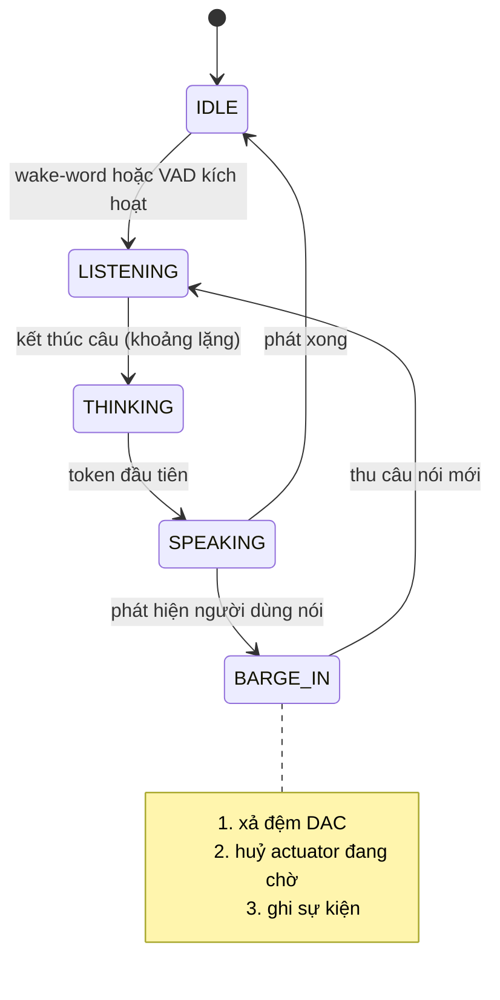

# NeuroEdge — Roadmap thực thi

## Kế hoạch triển khai từ Tuần 0 đến Tháng 8

**Phiên bản:** 1.4


**Ngày lập:** 21 tháng 9, 2026 · **Cập nhật:** 24 tháng 9, 2026 · lịch sử thay đổi: `CHANGELOG.md`


**Tài liệu nguồn:** `neuroedge-proposal.md` · `neuroedge-prd.md` · kế hoạch Giai đoạn 1 đã duyệt (lịch sử, đóng băng 2026-09-23) [`docs/archive/giai-doan-1-wedge-truoc-mcu-sau.md`](docs/archive/giai-doan-1-wedge-truoc-mcu-sau.md) · việc hoãn có chủ ý [`TODOS.md`](TODOS.md)


**Phạm vi:** Khối 1a · Khối 1b · Developer Beta · Khối 2 và 3


**Ngoài phạm vi:** Khối 4 (AURA thực địa) · Khối 5 (Marketplace) · **Giai đoạn 2** (thị giác, phủ rộng phần cứng) — xem [`neuroedge-roadmap-phase2.md`](neuroedge-roadmap-phase2.md) · **Giai đoạn 1.5** (NeuroBrain, bản nháp) — xem [`neuroedge-roadmap-phase1-5.md`](neuroedge-roadmap-phase1-5.md)

---

## Mục lục

0. [Bảng theo dõi tiến độ & Nhật ký bàn giao](#0-bảng-theo-dõi-tiến-độ--nhật-ký-bàn-giao-live-execution--handoff-dashboard)
1. [Giả định nguồn lực](#1-giả-định-nguồn-lực)
2. [Đường găng và phụ thuộc](#2-đường-găng-và-phụ-thuộc)
3. [Chiến lược tái sử dụng mã nguồn mở](#3-chiến-lược-tái-sử-dụng-mã-nguồn-mở)
4. [Khối 1a — Lõi và Action CI (Tuần 0–6)](#4-khối-1a--lõi-và-action-ci-tuần-06)
5. [Khối 1b — Vi điều khiển biên (Tuần 6–12)](#5-khối-1b--vi-điều-khiển-biên-tuần-612)
6. [Developer Beta (Tuần 12–16)](#6-developer-beta-tuần-1216)
7. [Điểm rẽ quyết định Tuần 16](#7-điểm-rẽ-quyết-định-tuần-16)
8. [Khối 2 và 3 — Tầng dịch vụ (Tháng 4–8)](#8-khối-2-và-3--tầng-dịch-vụ-tháng-48)
9. [Thang cắt phạm vi](#9-thang-cắt-phạm-vi)
10. [Lịch chốt quyết định](#10-lịch-chốt-quyết-định)
11. [Nhịp vận hành](#11-nhịp-vận-hành)
12. [Chỉ báo sớm và ngưỡng can thiệp](#12-chỉ-báo-sớm-và-ngưỡng-can-thiệp)

**Phụ lục**

- [A — Bảng mốc tổng hợp](#phụ-lục-a--bảng-mốc-tổng-hợp)
- [B — Danh mục mua sắm và hạ tầng](#phụ-lục-b--danh-mục-mua-sắm-và-hạ-tầng)
- [C — Bố cục kho mã nguồn](#phụ-lục-c--bố-cục-kho-mã-nguồn)
- [D — Giao thức truyền dẫn](#phụ-lục-d--giao-thức-truyền-dẫn)

---

## Quy ước tài liệu

Mọi mã và ký hiệu dùng trong tài liệu này (`TSK-*`, `A1`–`C8`, `TR-N`, `Q-N`, `RB-N`, `V1`–`V4`, `Tuần N` · `Tháng N`, `§x.y`…) được giải mã ở **[`docs/user/thuat-ngu.md`](docs/user/thuat-ngu.md)** — nơi duy nhất, kèm chỗ định nghĩa đầy đủ.

## 0. Bảng theo dõi tiến độ & Nhật ký bàn giao (Live Execution & Handoff Dashboard)

> **Mục đích:** Cung cấp điểm nhìn tập trung duy nhất về trạng thái thời gian thực của toàn bộ dự án. Mọi phiên làm việc (session), kỹ sư hoặc AI Agent khi nhận bàn giao chỉ cần đọc mục này là nắm được ngay: *Hệ thống đang ở đâu, vừa hoàn thành gì, ai đang làm gì, và bước hành động kế tiếp là gì.*

### 0.1 Thanh trạng thái điều hành (Executive Status Bar)

| Chỉ số | Trạng thái hiện hành | Ghi chú & Liên kết |
|:---|:---|:---|
| **Pha đang thực thi** | 🟡 **Khối 1a: Lõi logic & Action CI (Tuần 0 → 2026-11-15)** | Tiến độ theo sprint: §0.2 |
| **Sprint hiện hành** | 🟡 **Sprint 2 theo lịch (≈ A1, 2026-09-28 → 2026-10-25)** — mã đã xong trước lịch; việc đang làm thuộc A2 (Sprint 3) và phần firmware không cần bo mạch kéo lên từ Sprint 4 | Sprint 2: **10 / 10** task trong phạm vi, **6 / 6** tiêu chí ra · Sprint 3–4: §0.2 · Sprint 1 còn TSK-S1-10 chờ bo mạch |
| **Cột mốc tiếp theo** | **M1: Time-to-first-value < 10 phút trên `sim`** | Hạn chót: cuối Sprint 3 = **2026-11-15** — trễ ~2 tuần so với bản gốc (Tuần 6 gốc = 2026-11-02) (Q-19) |
| **Lần cập nhật cuối** | **2026-09-24** | Phiên gần nhất: §0.3 (định vị "Hợp đồng vào Physical AI", Q-30) · chi tiết `CHANGELOG.md` `[Chưa phát hành]` |
| **Trạng thái CI Lõi** | ✅ **PASS 958/958 · SKIP 0** | `python/tests/` — 46 bộ test; `verify` quét 0 artifact ⇒ mã 1; gate chuẩn mực khoá ở `digests.lock` (job Frozen artifacts); wheel đã cài chạy cả hành trình (job `wheel-smoke`); cổng CI chặn mọi test bị skip · `tests_linux/` 8/8 trên gpio-sim (job `linux-hal`) · extra `cloud` trên litellm thật + giấy phép Q-11 (job `cloud-extra`) |
| **Chặn ngoài tầm kỹ thuật** | 🟡 **1 hạng mục chặn + 1 còn mở** | 🔴 TSK-S1-10 chờ bo mạch vật lý · 🟡 Q-11 phần còn lại (Hawkbit EPL-2.0 / EMQX BSL) — **không chặn cho tới khi mở Khối 2** |
| **Hoãn có chủ ý** | 📋 [`TODOS.md`](TODOS.md) | Mỗi mục kèm mốc kích hoạt · gồm câu hỏi kinh doanh mở rà lại tại cổng nhu cầu **2026-10-25** (Q-20) |

---

### 0.2 Bảng tổng quan tiến độ các Sprint (Sprint Matrix Overview)

| Mốc | Sprint / Giai đoạn | Thời gian | Trọng tâm kỹ thuật | Tiến độ | Trạng thái |
|:---:|:---|:---:|:---|:---:|:---:|
| **Khối 1a** | **Sprint 1 — Đóng băng lược đồ** | Tuần 0–2<br>2026-09-21 → 2026-09-27 | Schemas, Monorepo, Test fixtures, Memory spike | **12 / 13** | 🟡 **Chờ phần cứng** (chỉ TSK-S1-10) |
| | **Sprint 2 — Lõi thực thi trên `sim`** *(≈ A1, wedge `sim`)* | **2026-09-28 → 2026-10-25** (Q-19) | Gate Engine, cây quyết định host, HAL sim, fail-closed + fallback ngữ pháp lệnh (Q-14), `@action` + token, kế thừa `budget`/`on_block` (Q-18) | **10 / 10** | ✅ Mã A1 + web UI `sim` xong 2026-09-23; TSK-S2-11 (LiteLLM) xong 2026-09-24 |
| | **Sprint 3 — Action CI & Linux** *(≈ A2)* | **2026-10-26 → 2026-11-15** (Q-19) | HAL linux (`gpio-sim`, Q-16), Record/Replay/Assert/Golden, lớp provider LiteLLM, release PyPI, TTFV < 10' | **20 / 23** | 🟡 Action CI + HAL `linux` xong (2026-09-23); TSK-S3-14 chờ go-live; tiêu chí ra 5/6 |
| **Khối 1b** | **Sprint 4 — HAL trên `esp32s3`** | **Từ 2026-11-16** (Q-19) · gốc Tuần 6–8 | Port driver XiaoZhi, verify target bậc 1 không audio, walker C + sổ token (Q-23, RFC-0003), ghim `extends` (TSK-S3-21) | **3 / 11** | 🟡 Phần không cần bo mạch kéo lên A2: TSK-S4-02, S4-07, S4-08 xong (2026-09-24); còn lại chờ lịch hoặc bo mạch |
| | **Sprint 5 — Runtime thoại MCU** | Tuần 8–10 | Thu/phát âm thanh, AEC/VAD, C/C++ state machine, stream lên provider | **0%** | ⏳ Chưa bắt đầu |
| | **Sprint 6 — OTA & Nghiệm thu v1.0** | Tuần 10–12 | A/B OTA, secure boot, tiêu chí A1–A9 | **0%** | ⏳ Chưa bắt đầu |
| **Beta** | **Developer Beta** | Tuần 12–16 | Hỗ trợ 50–100 lập trình viên, chỉ số B1–B5 | **0%** | ⏳ Chưa bắt đầu |
| **Khối 2** | **Fleet OS** *(dịch vụ thương mại duy nhất)* | Tháng 4–8 | Hawkbit Canary OTA, EMQX Broker, Provisioning | **0%** | ⏳ Chờ mốc Beta |
| **Khối 3** | **Bảy đường ray nền tảng** | Tháng 4–8 | OCI/ORAS Registry, OpenMeter usage billing | **0%** | ⏳ Chờ mốc Beta |

**Lịch theo ngày tuyệt đối (Q-19).** Sprint 2 và 3 ghi bằng ngày, thay cho quy ước cũ *"Tuần N ở kế hoạch = Tuần N+1 roadmap"* (đã bỏ). M1 trễ **~2 tuần** so với roadmap gốc (Tuần 6 gốc = 2026-11-02), và **Khối 1b cùng mọi mốc sau nó (Sprint 5, Sprint 6, Beta, Điểm rẽ Tuần 16) lùi tương ứng**; cột "Thời gian" của các dòng đó vẫn ghi tuần của lịch gốc cho tới khi ngày tuyệt đối được chốt lúc mở Sprint 4. Ước lượng V1 ~6,6–7,1 tuần-người trong 7 tuần — sát, không có đệm lớn.

---

### 0.3 Thẻ Bàn giao Hiện tại (Active Session Handoff Card)

```text
┌────────────────────────────────────────────────────────────────────────────────────────┐
│ THẺ BÀN GIAO PHIÊN LÀM VIỆC (LIVING HANDOFF CARD)                 Cập nhật: 2026-09-24 │
├────────────────────────────────────────────────────────────────────────────────────────┤
│ 1. VỪA HOÀN THÀNH — phiên gần nhất (chi tiết: CHANGELOG.md [Chưa phát hành])           │
│    • Q-30 — định vị "Hợp đồng vào Physical AI" (proposal §0.3, PRD §15, README;        │
│      TODOS.md #32, #34) · NeuroBrain "Copilot for building Physical AI" (chờ Q-31)      │
│                                                                                        │
│ 2. ĐANG THỰC HIỆN                                                                      │
│    • TSK-S1-10 (V2) — chờ bo mạch; đo thêm MultiNet (+ WakeNet) theo Q-14              │
│                                                                                        │
│ 3. VIỆC TIẾP THEO — đúng thứ tự                                                        │
│    1. Đặt 2 Box-3 + 1 RPi 5 nightly (Phụ lục B, Q-16)                                  │
│    2. V3: go-live TSK-S3-14 theo docs/release.md → đo TTFV                             │
│    3. A2 V2: TSK-S4-09 (vết ghi UART, chạy trên QEMU của S4-08) · S4-11                │
│    4. A2 V1: TSK-S2-07 (đặc tả FSM thoại) — TSK-S2-11 đã xong                          │
│    5. Kỹ thuật trưởng xác nhận TSK-S3-15 (golden = vết ghi chuẩn mực)                  │
│                                                                                        │
│ 4. LƯU Ý — bất biến ở CHANGELOG.md §3.3; dưới đây chỉ điều chưa có ở đó                │
│    • Chỉ c.do() điều khiển được chân: HAL chưa gắn ledger từ chối mọi lệnh             │
│    • Replay tính lại phán quyết từ dữ kiện đã ghi; golden chỉ so quyết định            │
│    • Mọi hành động đi qua dispatch(): lỗi hợp đồng ném ra, không thành BLOCK           │
│    • Wheel mang asset ở neuroedge/_data/; paths.py: checkout → gói → lỗi               │
│    • tests_linux/ chỉ chạy trên gpio-sim (job linux-hal); gpiod là extra [linux]       │
│    • Chạy ruff check + ruff format --check trước khi commit (CI chặn)                  │
└────────────────────────────────────────────────────────────────────────────────────────┘
```

### 0.4 Quy ước Cập nhật & Bàn giao (Handoff Protocol)

Khi xong một task: làm theo [`CONTRIBUTING.md` §8](CONTRIBUTING.md#8-hoàn-thành-một-task--cập-nhật-tài-liệu-tiến-độ-changelog) —
nơi duy nhất định nghĩa việc cập nhật trạng thái task, tiêu chí ra, §0.1–§0.3 và changelog.

---

## 1. Giả định nguồn lực

> **Đây là giả định, không phải dữ kiện.** Toàn bộ lịch trình bên dưới phụ thuộc vào nó. Nếu cấu hình đội khác đi, xem §1.3 trước khi đọc tiếp.

### 1.1 Bốn vai trò bắt buộc


| Vai trò                                   | Trách nhiệm chính                                                       | Có mặt từ                           |
| :----------------------------------------- | :----------------------------------------------------------------------- | :-----------------------------------: |
| **V1 — Kỹ sư lõi nền tảng**               | HAL, Action Contract Engine, lược đồ gate và trace, Action CI           | Tuần 0                              |
| **V2 — Kỹ sư nhúng**                      | Port `esp32s3`, runtime thoại trên MCU, OTA cấp thiết bị, tối ưu bộ nhớ | Tuần 0 *(bán thời gian tới Tuần 6)* |
| **V3 — Kỹ sư trải nghiệm lập trình viên** | Giao diện `sim`, CLI, scaffold, tài liệu, ví dụ mẫu                     | Tuần 2                              |
| **V4 — Kỹ sư hạ tầng dịch vụ**            | Fleet OS, Registry, hệ đo lường, hoàn thiện lớp provider OSS            | Tháng 3                             |


**Cấu hình tối thiểu khả thi: 3 người cho Khối 1**, trong đó một người kiêm vai trò kỹ thuật trưởng và vẫn viết mã. Vai trò V4 tuyển trước Khối 2 một tháng để có thời gian làm quen kiến trúc.

### 1.2 Vì sao V2 phải có mặt từ Tuần 0

Rủi ro **R-1** của PRD (phạm vi Khối 1b vượt hạn do tối ưu bộ nhớ MCU) được đánh giá mức **Cao** lúc lập kế hoạch, nay **Trung bình** nhờ cloud-first (PRD §13.2). Cách giảm thiểu hiệu quả không phải là giám sát ở Tuần 9, mà là **chạy spike khả thi bộ nhớ ngay Tuần 2**, khi vẫn còn đủ thời gian để đổi phạm vi.

V2 làm bán thời gian trong Khối 1a: một phần cho spike, phần còn lại rà soát thiết kế HAL dưới góc nhìn ràng buộc MCU. Một HAL thiết kế mà không có tiếng nói của kỹ sư nhúng sẽ phải viết lại ở Tuần 6.

### 1.3 Độ nhạy theo quy mô đội


| Cấu hình                       | Tác động lên lịch trình                                                                                                             |
| :------------------------------ | :----------------------------------------------------------------------------------------------------------------------------------- |
| **2 người**                    | Khối 1a giãn sang 8–9 tuần; Khối 1b sang 14–16 tuần. Bắt buộc áp dụng bậc 5 của thang cắt phạm vi (§9) ngay từ đầu                  |
| **3 người** *(giả định cơ sở)* | Lịch trình như tài liệu này                                                                                                         |
| **4–5 người**                  | Khối 1a rút còn 5 tuần; Khối 1b song song hóa nhiều hơn. Không rút được dưới 4 tuần vì đường găng là chuỗi thiết kế lược đồ tuần tự |


Thêm người **không** rút ngắn được Sprint 1: đóng băng lược đồ là công việc thiết kế tuần tự, không chia nhỏ song song được.

---

## 2. Đường găng và phụ thuộc

### 2.1 Đồ thị phụ thuộc

```text
Tuần 0 ──► LƯỢC ĐỒ GATE v1 ──┐
           LƯỢC ĐỒ TRACE v1 ─┼──► ĐÓNG BĂNG (Tuần 2)
           HỢP ĐỒNG HAL     ─┘        │
                                      ├──► Gate Engine ──► Action CI ──┐
                                      │    (fail-closed)   (record/     │
                                      │                     replay)     │
                                      ├──► Target sim ─────────────────┤──► TTFV < 10'
                                      │         │                       │    (Tuần 6)
                                      │         └──► Target linux ──────┤
                                      │                                 │
                                      └──► Port esp32s3 ────────────────┴──► verify bậc 1  
                                           (Tuần 6–8)                        (Tuần 8)
                                                │
                                                └──► Runtime thoại MCU ──► OTA ──► v1.0
                                                     (Tuần 8–10)         (Tuần 10–12)

    ⟂ Song song từ Tuần 2:  SPIKE BỘ NHỚ ESP32-S3  ──► quyết định phạm vi 1b (Tuần 4)
```

### 2.2 Đường găng


| #   | Mắt xích                        | Tuần | Vì sao nằm trên đường găng                                                                                    |
| :---: | :------------------------------- | :----: | :------------------------------------------------------------------------------------------------------------- |
| 1   | Đóng băng lược đồ gate và trace | 0–2  | FR-TRC-05 yêu cầu định dạng ổn định giữa các phiên bản. Mọi vết ghi đã tạo sẽ hỏng nếu đổi lược đồ sau Tuần 6 |
| 2   | Gate Engine với fail-closed     | 2–4  | Mọi thành phần khác gọi vào nó                                                                                |
| 3   | Record và replay                | 4–5  | Là điều kiện để có assert và golden                                                                           |
| 4   | Port HAL lên `esp32s3`          | 6–8  | Không có target thứ ba thì không chứng minh được tương đương                                                  |
| 5   | Runtime thoại trên MCU          | 8–10 | Vẫn là mắt xích khó nhất nhưng **rủi ro đã giảm** từ CR-1.0: STT/TTS chuyển lên provider cloud, MCU chỉ thu/phát + FSM + gate; xem §9 |


**Đòn bẩy mã nguồn mở trên đường găng:** mắt xích 4 rút ngắn nhờ driver XiaoZhi, mắt xích 5 nhờ Pipecat và bộ mô hình âm thanh. Chi tiết và mức rút ngắn thực tế tại §3.7.

**Phụ thuộc mới từ CR-1.0:** lớp trừu tượng provider (TSK-S2-11, ✅ 2026-09-24) là điều kiện tiên quyết cho ASR/TTS qua cloud (TSK-S3-13, hoãn sang Sprint 5) và cho vòng lặp thoại ở Sprint 5 (TSK-S5-06). Nó không nằm trên đường găng của mắt xích 2 và 3.

**Không nằm trên đường găng, làm song song:** giao diện `sim`, CLI, tài liệu, ví dụ mẫu, hạ tầng CI.

### 2.3 Quy tắc đóng băng lược đồ

Từ **cuối Tuần 2**, mọi thay đổi đối với lược đồ gate hoặc lược đồ vết ghi bắt buộc:

1. Có đề xuất RFC viết ra, nêu rõ lý do và ảnh hưởng tương thích ngược
2. Được kỹ thuật trưởng phê duyệt
3. Kèm kịch bản di trú cho toàn bộ vết ghi đã tồn tại

Đây là quy tắc nghiêm ngặt nhất của toàn bộ dự án. Lược đồ trôi nổi làm sụp đổ mệnh đề trung tâm.

**RFC đang mở:** [RFC-0002](docs/rfc/0002-mo-rong-target-va-nguyen-thuy-thi-giac.md) đề xuất mở rộng enum `target` ở `board.v1` và `trace.v1`, và đưa bậc target vào mã lõi (`TARGET_TIERS`) — phục vụ Giai đoạn 2. Nguyên thủy `vision.in` đã tách khỏi RFC này, sang một RFC riêng ở Khối V1b (RFC-0002 §9.1). RFC ở trạng thái *đang thảo luận*; **lược đồ chưa đổi và không được đổi cho tới khi RFC được phê duyệt**. Roadmap này không phụ thuộc vào kết quả RFC đó.

---
## 3. Chiến lược tái sử dụng mã nguồn mở

**Nguyên tắc bao trùm: xây thứ tạo khác biệt, mượn thứ đã là hàng hóa.**

Mục tiêu là rút ngắn tối đa thời gian ra thị trường bằng cách tái sử dụng và port các dự án mã nguồn mở hàng đầu vào mọi khâu — đồng thời bảo vệ tuyệt đối phần tài sản trí tuệ lõi.

### 3.1 Ranh giới bất di bất dịch

Ranh giới *tài sản lõi — tự xây 100%* / *hàng hóa — mượn tối đa* nằm ở **proposal §3.9** (nơi duy nhất). Nó quyết định mọi mục còn lại: thành phần thuộc tài sản lõi thì dù có thư viện sẵn cũng không dùng; thuộc hàng hóa thì dù viết được cũng không viết.

### 3.2 Phép thử quyết định

> **Phụ thuộc vào nó có buộc ta vi phạm P-1, P-2 ([PRD §1.5](neuroedge-prd.md#15-năm-nguyên-tắc-thiết-kế-bất-biến)), hoặc ba quyết định kiến trúc Tuần 1 — `sim` là target thật · gate là artifact có phiên bản · trace là công dân hạng nhất — không?**

**Có** → chỉ liên thông hoặc tham khảo thiết kế. **Không** → tái sử dụng tối đa.

### 3.3 Kỷ luật giấy phép

Năm quy tắc giấy phép: **proposal §3.9**. Ma trận phụ thuộc và trạng thái xác minh: **proposal Phụ lục H**. Hai ngoại lệ còn chờ quyết định — Hawkbit (EPL-2.0) và EMQX (một phần BSL) — là phần còn mở của Q-11 (§10.2, [`TODOS.md`](TODOS.md) #16). LiteLLM đã duyệt (Q-11) và dùng như SDK qua extra `neuroedge[cloud]` (Q-10).

### 3.4 Ma trận tích hợp theo khối

| Khối | Hạng mục kỹ thuật | Dự án tái sử dụng | Hình thức | Tiết kiệm |
|:---|:---|:---|:---|:---:|
| **1a** | CLI `new` / `run` / `test` | Typer · Rich · generator mẫu Python (không Copier — TSK-S3-07) | Thư viện Python | 2 tuần |
| **1a** | `allow_when` dạng chuỗi CEL *(tùy chọn, ⏸ TSK-S2-06)* | Google CEL (`cel-python`) — chỉ phân tích cú pháp trên máy tính | Front-end của trình biên dịch cây | — *(chưa dùng)* |
| **1a** | Giao diện web môi trường `sim` | Wokwi Elements *(đã cân nhắc, chưa dùng — TSK-S2-09 giao trang tự viết, không CDN)* | Web components | — |
| **1a** | Khung kiểm thử Action CI | Pytest · DeepDiff | Helper `neuroedge.testing` *(plugin `pytest-neuroedge` dự kiến)* | 2 tuần |
| **1a** | Chuẩn hóa lược đồ gate và trace | Pydantic v2 · `rfc8785` canonical JSON | Thư viện chuẩn hóa | 1 tuần |
| **1b** | Bo mạch tham chiếu ESP32-S3 | XiaoZhi ESP32 | **Port trực tiếp driver** | 5 tuần |
| **1b** | Barge-in, VAD, xử lý khung âm thanh | Pipecat · microWakeWord · libfvad | **Port mô hình pipeline** | 4 tuần |
| **1b** | OTA cấp thiết bị | ESP-IDF `esp_https_ota`, `esp_ota_ops` | Tận dụng SDK chuẩn | 2 tuần |
| **1b** | Hiển thị trạng thái trên màn hình | LVGL v8/v9 | Thư viện đồ họa nhúng | 2 tuần |
| **1a** | Lớp trừu tượng nhà cung cấp (OpenAI-compatible + adapter) | LiteLLM | **Thư viện trong lõi MIT** | 6 tuần |
| **2** | Điều phối OTA canary | Eclipse Hawkbit | Backend điều phối | 5 tuần |
| **2** | Kết nối thiết bị và viễn trắc | EMQX · FastAPI WebSockets | Hạ tầng kết nối | 3 tuần |
| **3** | Kho Gate Registry công khai | CNCF ORAS · Harbor | Chuẩn lưu trữ OCI | 4 tuần |
| **3** | Hệ đo lường sử dụng | OpenMeter | Hạ tầng metering | 4 tuần |
| **4** | Điều khiển phòng cho AURA | Home Assistant Core API | Integration adapter | 4 tuần |

**Cách đọc cột "Tiết kiệm":** đây là công sức *viết mã* tránh được, không phải thời gian lịch rút ngắn. Xem §3.7 để biết phần nào thật sự chạm vào đường găng.

### 3.5 Năm dự án port trực tiếp

Năm dự án này không dừng ở `pip install`. Chúng cần trích xuất mã hoặc kiến trúc và đưa thẳng vào codebase.

| # | Dự án | Đích đến | Phần trích xuất |
|:---:|:---|:---|:---|
| 1 | **XiaoZhi ESP32** | `targets/esp32s3/drivers/` | Khởi tạo codec I2S (ES8311, ES7210) · cấu hình chân I2C/SPI của ESP32-S3-Box-3 · driver LCD ST7789 · vòng lặp streaming WebSocket nhị phân |
| 2 | **Pipecat** | `neuroedge/perception/pipeline/` | Frame processor theo khung âm thanh · thuật toán khoảng lặng động · **cơ chế barge-in**: ngắt hàng đợi phát và phát tín hiệu hủy lệnh actuator chưa hoàn tất |
| 3 | **Wokwi Elements** *(chưa dùng)* | `neuroedge/sim/web/` *(dự kiến)* | `<wokwi-led>` · `<wokwi-pushbutton>` · `<wokwi-servo>` · `<wokwi-lcd1602>`; không có `solenoid-lock` (proposal Phụ lục H.1). TSK-S2-09 giao trang tự viết, không phụ thuộc |
| 4 | **LiteLLM** | `neuroedge/models/providers/` | Chuyển đổi I/O về một chuẩn chung · failover — gọi như SDK trong tiến trình, không chạy proxy (Q-10); hạn mức theo thiết bị do NeuroEdge tự làm (proposal §6.1). **Từ CR-1.0: thư viện trong lõi MIT phân phối kèm sản phẩm**, không phải lõi của một dịch vụ do NeuroEdge vận hành — xem Q-11 |
| 5 | **OpenMeter** | Lõi metering Khối 3 | Engine gom cụm sự kiện · đối soát số lượt gọi agent và lượt thẩm định gate |

**Giá trị lớn nhất nằm ở mục 1 và 2** vì chúng nằm trên đường găng: loại bỏ rủi ro kẹt thanh ghi, lỗi clock I2S, méo tiếng, và toàn bộ vòng thử sai của các ca biên hội thoại.

### 3.6 Ba dự án chỉ liên thông, không phụ thuộc

ESP-Claw (liên thông qua MCP), LiveKit Agents và TEN Framework (chỉ tham khảo thiết kế) — quyết định và lý do: **proposal Phụ lục H.3**.

Riêng **XiaoZhi tuyệt đối không fork toàn bộ**: đó là một ứng dụng firmware, logic hội thoại gắn thẳng vào lệnh phần cứng, không có HAL và không có khái niệm hợp đồng hành động. Chỉ port tầng driver theo §3.5, phần còn lại không đụng tới.

**Điểm chiến lược:** cộng đồng XiaoZhi là kênh phân phối. Tương thích với bo mạch XiaoZhi phổ biến có giá trị cao hơn nhiều so với dùng lại mã — người dùng đã có sẵn phần cứng, cắm vào chạy được ngay là đòn bẩy trực tiếp cho chỉ tiêu B2.

### 3.7 Tác động thật lên đường găng

Tổng tiết kiệm công sức viết mã khoảng 50 tuần-người. **Nhưng phần lớn không nằm trên đường găng.**

| Mắt xích đường găng | Có đòn bẩy OSS không | Mức rút ngắn thực tế |
|:---|:---|:---|
| Đóng băng lược đồ gate và trace | Một phần — Pydantic và canonical JSON | Không đáng kể, vì đây là công việc thiết kế |
| Gate Engine với fail-closed | Không — ánh xạ toán tử và cây quyết định là mã NeuroEdge; CEL hoãn (TSK-S2-06) | 0 |
| Record và replay | Một phần — DeepDiff cho so khớp golden | Dưới 1 tuần |
| **Port HAL lên `esp32s3`** | **Có — driver XiaoZhi** | **2–3 tuần** |
| **Runtime thoại trên MCU** | **Có — Pipecat, microWakeWord, libfvad** | **2–3 tuần** |

**Kết luận thực tế:** đòn bẩy OSS rút ngắn Khối 1b nhiều hơn Khối 1a, và quan trọng hơn cả là nó **hạ rủi ro R-1 từ mức Cao xuống Trung bình**. Tuy vậy chi phí tích hợp, rà soát giấy phép và ghim phiên bản là chi phí mới phát sinh. Lịch trình trong tài liệu này **giữ nguyên**; phần tiết kiệm được chuyển thành vùng đệm cho Sprint 5, nơi rủi ro tập trung.

### 3.8 Bảo toàn tương đương target khi có hai ngôn ngữ

Đây là hệ quả nghiêm trọng nhất của việc port, và cần xử lý tường minh.

Quyết định **Q-8 đã chốt**: C/C++ trên ESP-IDF cho firmware, Python cho `sim` và `linux`. Hệ quả: máy trạng thái hội thoại **buộc phải có hai hiện thực**. Không thể chia sẻ mã giữa hai bên.

Điều này va thẳng vào P-2. FR-PER-02 yêu cầu barge-in thu hồi lệnh actuator chưa thực thi — nghĩa là hành vi cắt lời rò trực tiếp vào miền hành động vật lý. Hai hiện thực barge-in khác nhau cho ra hai hành vi thu hồi khác nhau.

**Giải pháp bắt buộc: một đặc tả chuẩn tắc, hai hiện thực tuân thủ, một bộ kiểm thử tuân thủ dùng chung.**

| # | Thành phần | Nội dung | Sprint |
|:---:|:---|:---|:---:|
| 1 | **Đặc tả máy trạng thái** | Năm trạng thái và hợp đồng thu hồi lệnh, đặc tả bên dưới. Là nguồn sự thật duy nhất, không phải mã Python | A2 (TSK-S2-07) |
| 2 | **Bộ vector kiểm thử tuân thủ** | Ba tệp vết ghi chuẩn tại `fixtures/traces/`, kèm chuỗi phán quyết và trạng thái GPIO kỳ vọng, độc lập với ngôn ngữ | Sprint 5 (TSK-S3-10) |
| 3 | **Hiện thực Python** | Cho `sim` và `linux`, port thiết kế từ Pipecat | Sprint 5 (TSK-S3-11) |
| 4 | **Hiện thực C/C++** | Cho `esp32s3`, port driver từ XiaoZhi | Sprint 5 |
| 5 | **`neuroedge verify` chạy bộ vector trên mọi target bậc 1** | Lệch nhau sinh `SafetyRegressionError` (NE4002) | Sprint 4–5 |

**Không có bước 1 và 2 thì việc port Pipecat là một rủi ro, không phải một đòn bẩy.** Đặc tả và bộ vector phải có trước khi viết hiện thực thứ hai.

#### Đặc tả chuẩn tắc: năm trạng thái



**Hợp đồng thu hồi lệnh vật lý (Actuator Abort Contract).** Mọi lệnh actuator có độ trễ thực thi — ví dụ `pulse` chốt cửa sau 1.000 ms — nếu gặp sự kiện `barge_in` trong lúc đang chờ cấp xung thì **HAL bắt buộc huỷ lệnh ngay lập tức** và ghi mã trạng thái `ACTUATOR_ABORTED_BY_BARGE_IN` vào tệp vết ghi.

Đây là mệnh đề mà cả hai hiện thực phải thoả, và là mệnh đề mà bộ vector tuân thủ kiểm tra trực tiếp.

#### Hệ quả tương tự với tầng lượng giá gate

Gate chạy on-device và phải fail-closed đúng cách khi mất mạng, nên phán quyết phải lượng giá được **trên cả vi điều khiển**, từ cùng một artifact với host. Cách làm đã chốt ở **Q-9 (phương án A) và Q-23** — nội dung, lý do và phương án bị bác ở PRD §15: `neuroedge build` biên dịch gate thành cây quyết định; firmware duyệt bố cục nhị phân `NETR` v1 bằng walker C99 (TSK-S4-02, RFC-0003).

**Ranh giới tài sản lõi:** trình biên dịch sang cây quyết định và bộ duyệt cây trên thiết bị là **mã của NeuroEdge** — ngữ nghĩa an toàn, thuộc nhóm không nhận phụ thuộc (§3.1). `cel-python`, nếu dùng, chỉ phân tích cú pháp chuỗi CEL trên máy tính; front-end CEL đang hoãn (TSK-S2-06).

#### Ba tệp vết ghi chuẩn mực

Bộ vector tuân thủ khởi đầu bằng đúng ba kịch bản, cố định tại `fixtures/traces/`:

| Tệp | Kịch bản | Kết quả kỳ vọng |
|:---|:---|:---|
| `happy-path.json` | Khách đã xác thực yêu cầu mở cửa | Gate `ALLOW` · chân `door_lock` nhận xung 30.000 ms |
| `unverified_attempt.json` | Người chưa xác thực yêu cầu mở cửa | Gate `BLOCK` · `escalate` tới lễ tân · chân `door_lock` **không bao giờ** nhận xung |
| `network_offline.json` | Mất kết nối khi đang thẩm định gate | Fail-closed kích hoạt · hành động bị từ chối · lý do `gate_unreachable` |

Ba tệp này là thước đo tuân thủ cho cả Khối 1a và 1b, và là đầu vào trực tiếp của `neuroedge verify`.

### 3.9 Nghĩa vụ ghi nhận nguồn

**Hạn chót: hoàn tất trước khi port bất kỳ dòng mã nào — chậm nhất cuối Tuần 2.**

Năm nghĩa vụ — (1) ma trận giấy phép, (2) tệp `NOTICE` ở gốc kho, (3) ghi nhận tại chỗ trong mã, (4) mục ghi nhận trong tài liệu công khai, (5) ghim phiên bản cho mọi phụ thuộc — đặc tả ở **proposal §3.9**.

Đây là nghĩa vụ pháp lý. Một vi phạm phát hiện sau khi phát hành công khai tốn kém hơn nhiều so với vài ngày rà soát trước.

### 3.10 Rủi ro khi làm ngược

| Nếu | Hậu quả |
|:---|:---|
| Fork toàn bộ XiaoZhi làm nền | Kế thừa kiến trúc không có HAL; phải gỡ để chèn gate; gánh nhánh fork vĩnh viễn |
| Xây trên ESP-Claw | `linux` thành hạng hai → mất bằng chứng hợp đồng năng lực → mất luận điểm đánh sườn |
| Port Pipecat mà không có đặc tả và bộ vector tuân thủ | Hai hiện thực barge-in phân kỳ → tương đương target vỡ ở miền thu hồi lệnh actuator |
| Dùng CEL trên host nhưng cú pháp khác trên thiết bị | Gate cho phán quyết khác nhau giữa hai target ở đúng tầng an toàn |
| Nhúng mã GPLv3 vào phần phân phối | Lây nhiễm bản quyền sang lõi MIT và sang dự án của khách hàng |
| Port mã trước khi rà soát giấy phép | Rủi ro pháp lý phát hiện sau khi công khai, chi phí khắc phục rất cao |
| Tự viết AEC, VAD, codec, rule engine | Đốt Sprint 2 và 5 vào bài toán đã có lời giải tốt, trễ mốc mà không tạo khác biệt |

---

## 4. Khối 1a — Lõi và Action CI (Tuần 0–6)

**Mục tiêu khối:** một lập trình viên lạ chạy được agent có gate trong dưới 10 phút, không cần mua phần cứng.

### 4.1 Sprint 1 — Đóng băng lược đồ (Tuần 0–2)


| Mã Task | Hạng mục công việc | Yêu cầu PRD | Người | Trạng thái | Sản phẩm bàn giao (Artifact) |
|:---:|:---|:---|:---:|:---:|:---|
| **TSK-S1-01** | Đặc tả 5 nguyên thủy HAL và thuộc tính đối chiếu | FR-HAL-01, FR-HAL-02, FR-HAL-03 | V1 | ✅ Hoàn thành | [`schemas/board.v1.json`](schemas/board.v1.json) |
| **TSK-S1-02** | Lược đồ gate v1: 8 trường, 3 kiểu `evaluate`, 4 hành vi `on_block`, `budget` | FR-GATE-02, FR-GATE-03, FR-GATE-04 | V1 | ✅ Hoàn thành | [`schemas/gate.v1.json`](schemas/gate.v1.json) · sửa theo [RFC-0001](docs/rfc/0001-gate-schema-conditional-requirements.md) (bắt buộc có điều kiện) |
| **TSK-S1-03** | Quy tắc kế thừa `extends`: 5 nguyên tắc an toàn | FR-GATE-06, FR-GATE-07, FR-GATE-08 | V1 | ✅ Hoàn thành | **Đã cưỡng chế bằng mã:** [`gate_resolver.py`](python/neuroedge/engine/gate_resolver.py), [`constraints.py`](python/neuroedge/engine/constraints.py) · test tại [`test_gate_resolver.py`](python/tests/test_gate_resolver.py) |
| **TSK-S1-04** | Lược đồ vết ghi v1: 6 nhóm sự kiện, khối `metadata` | FR-TRC-01, FR-TRC-02, FR-TRC-03 | V1 | ✅ Hoàn thành | [`schemas/trace.v1.json`](schemas/trace.v1.json) |
| **TSK-S1-05** | Ma trận giấy phép và tệp `NOTICE` cho toàn bộ dự án sẽ port (§3.9) | — | V2 | ✅ Hoàn thành | [`NOTICE`](NOTICE) 4 mục A–D · cổng CI chặn copyleft mạnh · [`requirements-lock.txt`](python/requirements-lock.txt) (nghĩa vụ 5) |
| **TSK-S1-06** | **Dựng bộ khung monorepo** theo [`CONTRIBUTING.md` §6](CONTRIBUTING.md#6-cấu-trúc-kho): `schemas/` · `python/` · `targets/` · `fixtures/` | — | V1 | ✅ Hoàn thành | [`schemas/`](schemas/), [`python/`](python/), [`targets/`](targets/), [`fixtures/`](fixtures/) |
| **TSK-S1-07** | **Ba tệp lược đồ chính thức** trong `schemas/`: `trace.v1.json` · `gate.v1.json` · `board.v1.json` | FR-TRC-01, FR-GATE-02, FR-HAL-02 | V1 | ✅ Hoàn thành | JSON Schema draft 2020-12 · CI thẩm định `$id` và `check_schema` · test tại [`test_schemas.py`](python/tests/test_schemas.py) |
| **TSK-S1-08** | **Ba tệp vết ghi chuẩn mực** tại `fixtures/traces/` (`happy-path`, `unverified_attempt`, `network_offline`) | FR-CI-01, FR-CI-02 | V1 | ✅ Hoàn thành | [`fixtures/traces/`](fixtures/traces/) + [fixture phản chứng](fixtures/traces/invalid/) kèm [`expected_errors.yaml`](fixtures/traces/expected_errors.yaml) · thẩm định cả `format: date-time` |
| **TSK-S1-09** | Khung Python SDK, CLI và Action CI ban đầu (`replay`, `scenario`) | FR-CLI-01, FR-CI-01 | V1 | ✅ Hoàn thành | [`python/neuroedge/`](python/neuroedge/) · CLI thực thi `gate resolve/lint/publish`, `trace validate/show`, `board list/show`, `verify` · lệnh chưa có engine thoát mã 2 |
| **TSK-S1-10** | **Spike khả thi bộ nhớ trên ESP32-S3-Box-3** | NFR-RES-01, NFR-RES-02 | V2 | 🔴 **Chờ bo mạch** | Khung đo xong: [`memory_probe.c`](targets/esp32s3/main/memory_probe.c) (4 checkpoint, dòng JSON máy đọc), [`check_firmware_size.py`](scripts/check_firmware_size.py) · **chưa có số đo thực** → [báo cáo](docs/reports/memory_spike_report.md) · danh sách đo **thêm ESP-SR MultiNet** (và WakeNet nếu cân nhắc thay microWakeWord của Q-7) theo **Q-14** |
| **TSK-S1-11** | Rà soát thiết kế HAL dưới ràng buộc MCU | — | V2 | ✅ Hoàn thành | [`docs/spec/hal_mcu_review.md`](docs/spec/hal_mcu_review.md) (5 kết luận + 4 ràng buộc cho Sprint 4) · hiện thực tại [`hal/board.py`](python/neuroedge/hal/board.py) + [`boards/`](boards/) 3 target |
| **TSK-S1-12** | Hai workflow CI: `ci-sim-linux.yml` và `nightly-hardware.yml` | FR-CI-05, FR-CI-06 | V1 | ✅ Hoàn thành | [`ci-sim-linux.yml`](.github/workflows/ci-sim-linux.yml) (lược đồ · phân giải gate · vết ghi · test 3 bản Python · lint · cổng giấy phép · **cổng chặn test skip**) · [`nightly-hardware.yml`](.github/workflows/nightly-hardware.yml) (dựng IDF · ngân sách flash Q-3 · thu số đo · trôi phụ thuộc) |
| **TSK-S1-13** | Quy ước đóng góp và mẫu RFC đổi lược đồ | — | V1 | ✅ Hoàn thành | [`CONTRIBUTING.md`](CONTRIBUTING.md) · [`docs/rfc/`](docs/rfc/): [quy trình](docs/rfc/README.md), [mẫu](docs/rfc/0000-template.md), [RFC-0001](docs/rfc/0001-gate-schema-conditional-requirements.md) |

**Đòn bẩy OSS Sprint 1:** Pydantic v2 và `rfc8785` cho chuẩn hóa lược đồ · Typer, Rich cho khung CLI ban đầu (Copier dùng lúc dựng khung, bỏ hẳn ở TSK-S3-07 vì GPL3 bắc cầu). Tiết kiệm ước tính 3 tuần công sức viết mã.

**Nội dung spike bộ nhớ:** nạp thử AEC + VAD + Opus streaming **+ ESP-SR MultiNet** (bộ nhận diện lệnh cố định làm fallback cục bộ, Q-14; thêm WakeNet nếu cân nhắc thay microWakeWord) lên ESP32-S3-Box-3, đo dung lượng SRAM và PSRAM còn lại sau khi trừ ngăn xếp mạng và hệ điều hành. Kết quả là **một con số**, không phải một nhận định.

Ngưỡng đối chiếu đã chốt tại Q-3: **SRAM cho ứng dụng ≥ 120 KB · PSRAM ≥ 2 MB · firmware ≤ 3,5 MB**. Không đạt ngưỡng nào thì kích hoạt bậc 5 của thang cắt phạm vi (§9) ngay, không chờ Tuần 9.

**Tiêu chí ra Sprint 1 (Exit Criteria):** — **5 / 6 đạt · 1 bị chặn bởi phần cứng**

- [x] **Tiêu chí 1:** JSON Schema của gate và trace publish nội bộ, có ví dụ hợp lệ và ví dụ sai kèm thông báo lỗi kỳ vọng.
  *Bằng chứng:* [`schemas/`](schemas/) 3 tệp · hợp lệ: [`gates/`](gates/) + [`fixtures/gates/valid/`](fixtures/gates/valid/) · **sai kèm lỗi kỳ vọng:** [`fixtures/gates/invalid/`](fixtures/gates/invalid/) + [`expected_errors.yaml`](fixtures/gates/expected_errors.yaml), [`fixtures/traces/invalid/`](fixtures/traces/invalid/) + [`expected_errors.yaml`](fixtures/traces/expected_errors.yaml). Test cưỡng chế corpus khép kín cả hai chiều (mỗi tệp có một mục, mỗi mục có một tệp) và mọi lỗi đủ 3 thành phần FR-DX-04.
- [x] **Tiêu chí 2:** Ba gate mẫu viết tay được công cụ phân giải đúng, gồm một trường hợp kế thừa 2 cấp.
  *Bằng chứng:* chuỗi `base-access@1.0.0` → `unlock_door@1.2.0` → `unlock_door_night@1.0.0` (đúng 3 cấp, tức **kế thừa 2 cấp**). `neuroedge gate lint` xanh. [`test_sample_gates.py`](python/tests/test_sample_gates.py) kiểm tra từng nguyên tắc trên corpus thật, gồm mệnh đề **điều kiện chỉ siết chặt đơn điệu xuống chuỗi**.
- [ ] 🔴 **Tiêu chí 3:** Báo cáo spike bộ nhớ có số liệu đo thực, đối chiếu trực tiếp với ngưỡng Q-3 (SRAM ≥ 120 KB, PSRAM ≥ 2 MB, flash ≤ 3,5 MB).
  **CHƯA ĐẠT — chặn bởi phần cứng vật lý, không thể xử lý bằng công việc trên máy tính.** Khung đo đã xong và ngưỡng Q-3 đã ghim thành hằng số; [báo cáo](docs/reports/memory_spike_report.md) nêu rõ 5 việc còn lại. Hàm đối chiếu trả `INCONCLUSIVE` khi checkpoint `audio_ready` chưa được lấy, để số đo sàn không bị đọc thành một kết quả đạt.
- [x] **Tiêu chí 4:** Bộ khung monorepo dựng xong; `schemas/` chứa đủ ba tệp lược đồ và được CI kiểm tra tính hợp lệ.
  *Bằng chứng:* job `frozen-artifacts` của [`ci-sim-linux.yml`](.github/workflows/ci-sim-linux.yml) chạy `check_schema` draft 2020-12, đối chiếu `$id`, và **khẳng định nghịch đảo**: corpus phản chứng phải tiếp tục thất bại, nếu phân giải được thì job đỏ.
- [x] **Tiêu chí 5:** Ba tệp vết ghi chuẩn mực tại `fixtures/traces/` đã viết tay và phân giải đúng.
  *Bằng chứng:* `neuroedge trace validate fixtures/traces/*.json` → 3/3 VALID. [`test_trace_fixtures.py`](python/tests/test_trace_fixtures.py) kiểm tra **nội dung kịch bản**, không chỉ tính hợp lệ lược đồ (happy-path cấp xung 30 000 ms; hai kịch bản còn lại **không sinh lệnh actuator nào**).
- [x] **Tiêu chí 6:** Quyết định Q-11 đã chốt (§10.2) — điều kiện để bắt đầu port bất kỳ dòng mã nào.
  **ĐẠT cho phạm vi Giai đoạn 1 (2026-09-23).** Phần LiteLLM của Q-11 đã duyệt: `litellm==1.102.0` là MIT, wheel không chứa `enterprise/`, mọi phụ thuộc bắc cầu đạt chính sách phụ thuộc bắc cầu của Q-11 (PRD §15), cưỡng chế bằng CI (job `cloud-extra`). **Phần Hawkbit EPL-2.0 / EMQX BSL chuyển thành cổng mở Khối 2** ([`TODOS.md`](TODOS.md) #16) — chưa có dòng mã nào của chúng được port; phần D của [`NOTICE`](NOTICE) ghi rõ phạm vi phơi nhiễm. Phát hiện phát sinh trong Sprint 1: `copier` kéo theo `jinja2-ansible-filters` **GPL3** — đã chuyển sang extra `scaffold` để lõi MIT không bị lây nhiễm, và cổng CI giấy phép chặn tái diễn; TSK-S3-07 thay `copier` bằng generator Python thuần và bỏ hẳn extra đó.

**Ghi chú về phạm vi đã đóng:** toàn bộ khối lượng Sprint 1 **không phụ thuộc phần cứng** đã hoàn tất (12/13 task, 5/6 tiêu chí ra). Hạng mục còn lại (TSK-S1-10, Tiêu chí 3) không thể đóng bằng nỗ lực kỹ thuật thêm nữa — nó chờ bo mạch.


### 4.2 Sprint 2 — Lõi thực thi trên `sim` (≈ A1 · 2026-09-28 → 2026-10-25, Q-19)

Phạm vi và thứ tự chạy theo kế hoạch Giai đoạn 1 đã duyệt [`docs/archive/giai-doan-1-wedge-truoc-mcu-sau.md`](docs/archive/giai-doan-1-wedge-truoc-mcu-sau.md) (wedge `sim`; lịch sử, đóng băng 2026-09-23). **Thứ tự bắt buộc:** TSK-S2-03 → S2-08 → S2-01 → S2-04 → S2-05 → S2-02; TSK-S2-12 và S2-13 chạy kèm. Việc hoãn ghi `⏸ Hoãn` kèm lý do và đích đến; mốc kích hoạt ở [`TODOS.md`](TODOS.md).

| Mã Task | Hạng mục công việc | Yêu cầu PRD | Người | Trạng thái | Sản phẩm bàn giao (Artifact) |
|:---:|:---|:---|:---:|:---:|:---|
| **TSK-S2-01** | Hiện thực HAL cho target `sim` | FR-TGT-01, FR-HAL-01 | **V2** *(ENG-T3)* | ✅ Hoàn thành (2026-09-23) | `python/neuroedge/hal/sim.py` · `tests/test_hal_sim.py` |
| **TSK-S2-02** | Đối chiếu năng lực lúc build, thông báo lỗi đầy đủ 3 thành phần | FR-HAL-04, FR-HAL-05, FR-DX-04 | V1 | ✅ Hoàn thành (2026-09-23) | `python/neuroedge/engine/compiler.py` · lệnh `neuroedge build` · agent mẫu `fixtures/agents/villa-concierge/` · `tests/test_compiler.py` |
| **TSK-S2-03** | Gate Engine: `evaluate`, `allow_when`, `on_block`, `budget`. `on_block` v1.0 theo **Q-17**: mọi hành vi đều chặn hành động vật lý; `escalate`/`ask` ghi sự kiện + gọi hook (mặc định no-op); `degrade` chạy `fallback_action` qua gate của chính nó; xác nhận `ask` là TSK-S3-26 (Q-26). ✅ khi xong phạm vi đã đặc tả | FR-GATE-03, FR-GATE-04, FR-GATE-09 | V1 | ✅ Hoàn thành (2026-09-23) | `python/neuroedge/engine/gate.py` · `engine/trace_sink.py` (`EventLog`) · `tests/test_gate_engine.py` |
| **TSK-S2-04** | Cơ chế fail-closed và mạch ngắt suy giảm | FR-ACE-03, NFR-REL-02 | V1 | ✅ Hoàn thành (2026-09-23) | `python/neuroedge/engine/circuit_breaker.py` · `tests/test_fail_closed.py` |
| **TSK-S2-05** | Decorator `@action`, cấm gọi trực tiếp, `c.do()` và `c.say()`, **token phán quyết dùng một lần** | FR-ACE-02, FR-ACE-04, FR-ACE-05, FR-ACE-07 | V1 | ✅ Hoàn thành (2026-09-23) | `python/neuroedge/actions/` (`spec.py`, `conversation.py`, `token.py`) · `python/neuroedge/hal/digital.py` · `docs/spec/threat_model.md` · `tests/test_actions.py` |
| **TSK-S2-06** | Lượng giá `allow_when` trên nền Google CEL, kèm đường biên dịch gate cho thiết bị (§3.8, Q-9) | FR-GATE-03 | V1 | ⏸ **Hoãn → Sprint 5** | Dạng mapping đủ cho wedge; CEL là front-end biên dịch xuống *cùng* cây quyết định của TSK-S2-12 (Q-9 phương án A) |
| **TSK-S2-07** | **Đặc tả chuẩn tắc máy trạng thái hội thoại** — nguồn sự thật cho cả hai hiện thực (§3.8) | FR-PER-02, FR-PER-03 | V1 | ⏳ **Kéo lên A2 (V1)** — sau TSK-S2-11 | Hoãn **cùng** TSK-S3-10, S3-11 để giữ thứ tự §3.10: nằm trên đường găng Sprint 2 nhưng không trên đường găng wedge — wedge không chạm âm thanh. Phải xong trước TSK-S5-03 |
| **TSK-S2-08** | Interface `SystemOne` / `SystemTwo` + trường độ tin cậy + test double tất định + **fallback cục bộ = bộ nhận diện lệnh cố định** (ngữ pháp lệnh → intent + độ tin cậy) chạy trên chữ gõ ở `sim` (**Q-14**, Q-15). Connector cloud thật đi cùng TSK-S2-11. Q-17: ✅ khi xong phạm vi đã đặc tả | FR-MDL-01, FR-MDL-02, FR-MDL-03, FR-ACE-03 | V1 | ✅ Hoàn thành (2026-09-23) | `python/neuroedge/models/` (`system.py`, `grammar.py`, `doubles.py`) · ngữ pháp mẫu `fixtures/agents/villa-concierge/commands.toml` · `tests/test_models.py` |
| **TSK-S2-09** | Giao diện web `sim`: cảm biến ảo, trạng thái actuator — `neuroedge run --ui` | FR-TGT-06 | V3 | ✅ Hoàn thành (2026-09-23) | [`sim/ui.py`](python/neuroedge/sim/ui.py) — `run --ui`: trang cục bộ 127.0.0.1, SSE, không mạng, từ chối POST khác nguồn; commit `8a023f3` · `pytest tests/test_sim_ui.py` |
| **TSK-S2-10** | Kết luận phạm vi Khối 1b dựa trên spike | — | V2 + trưởng nhóm | ⏸ **Hoãn → Sprint 5** *(hoặc sớm hơn khi bo mạch về)* | Chặn bởi bo mạch (TSK-S1-10). `docs/reports/memory_spike_report.md` |
| **TSK-S2-11** | **Lớp trừu tượng nhà cung cấp** (CR-1.0): hợp đồng OpenAI-compatible + adapter tùy chỉnh sau `neuroedge.models.providers`; LiteLLM làm SDK qua extra `neuroedge[cloud]` (Q-10); kiểm giấy phép bắc cầu trong CI (Q-11); vòng tool của System 2 với provider thật (FR-MDL-11, `docs/spec/tool_calling.md`; vòng và MCP host trên `sim`: TSK-S3-28). **Phạm vi giao: LLM của System 2** (Q-28). Hoãn: ASR/TTS (TSK-S3-13, S5-06), provider cloud cho SystemOne và failover khai trong `agent.toml` ([`TODOS.md`](TODOS.md) #27, #28) | FR-MDL-06, FR-MDL-07, FR-MDL-08, FR-MDL-11, FR-GW-01, FR-GW-03 | V1 | ✅ Hoàn thành (2026-09-24) | `python/neuroedge/models/providers/` (`LiteLLMProvider`, adapter `python:pkg.mod:factory`, bảng `[system_two]`) · `python/pyproject.toml` (extra `cloud = litellm==1.102.0`) · job CI `cloud-extra` (`scripts/check_licences.py`, `scripts/cloud_smoke.py` trên litellm thật) · `scripts/live_llm_smoke.py` (chạy tay) · `pytest tests/test_providers.py` · PR `feat/litellm-provider` |
| **TSK-S2-12** | **Đặc tả ngữ nghĩa quyết định:** trình biên dịch phía host `import parse_constraint` (không sửa `constraints.py`, không RFC) → cây quyết định mang `criteria_order` + `gate_digest`; `evaluate()` đi cây, trả phán quyết + `reason`. **Định dạng nội bộ, chưa đóng băng** — đóng băng ở RFC-0003 (Sprint 4) | FR-GATE-03, FR-ACE-01, FR-TGT-04 | V1 | ✅ Hoàn thành (2026-09-23) | `python/neuroedge/engine/decision_tree.py` · `decision_tree.v1.json` (nội bộ) · bảng sự thật `fixtures/decision_trees/*.truth.json` (sinh bằng `scripts/generate_truth_tables.py`) · `tests/test_decision_tree.py` |
| **TSK-S2-13** | **Kế thừa `budget`/`on_block`** (RFC-0004, **Q-18**): `p95_latency_ms` của con ≤ cha · chuỗi đã `closed` thì con không khai `fail: open` · con không tự đưa vào `degrade`/`fallback_action` mới. Vi phạm ⇒ `GateInheritanceError`. Đóng lỗ `lax-night` (ENG-A2) | FR-GATE-06, FR-GATE-07, FR-GATE-09 | V1 | ✅ Hoàn thành (2026-09-23) | `python/neuroedge/engine/gate_resolver.py` · fixture phản chứng tại `fixtures/gates/invalid/` + `expected_errors.yaml` · test `test_rfc0004_*` · commit `87890c8` |

**Tiêu chí ra Sprint 2 (Exit Criteria):** — **6 / 6 đã đạt**

- [x] **Tiêu chí 1:** Agent mẫu chạy trên `sim`, gate chặn đúng theo `allow_when`.
  *Bằng chứng:* `pytest tests/test_compiler.py -k sample_agent_runs` — agent `fixtures/agents/villa-concierge/` qua `c.do()` trên `SimHAL`: ALLOW ⇒ `door_lock` kích 30 000 ms, `risk_level: high` ⇒ `never_pulsed()`.
- [x] **Tiêu chí 2:** Gọi trực tiếp hành động vật lý ném `ActionContractViolation`, chân GPIO ảo không kích.
  *Bằng chứng:* `pytest tests/test_actions.py -k direct` — `test_a_direct_call_is_a_contract_violation_naming_the_caller` (NE1001 nêu `file:line` nơi gọi, `never_pulsed()`).
- [x] **Tiêu chí 3 (Q-14):** Kịch bản mất mạng → gate **vẫn lượng giá** bằng bộ nhận diện lệnh cố định cục bộ; câu không khớp ngữ pháp hoặc độ tin cậy dưới ngưỡng → BLOCK theo tiêu chí bình thường; fallback không có / không chạy được → hành động bị chặn với lý do `gate_unreachable`.
  *Bằng chứng:* `pytest tests/test_models.py -k offline` — `test_offline_a_known_command_is_still_adjudicated`, `test_offline_an_unknown_command_blocks_by_normal_criteria`, `test_offline_without_a_fallback_is_gate_unreachable`, `test_a_fallback_that_fails_at_run_time_is_gate_unreachable`; chạy khi socket bị chặn (`test_the_offline_path_opens_no_socket`).
- [x] **Tiêu chí 4:** Gate con nới lỏng `allow_when` bị từ chối phân giải.
  *Bằng chứng (ĐÃ ĐÓNG ở Sprint 1):* [`test_gate_resolver.py`](python/tests/test_gate_resolver.py) + fixture nới `allow_when` (`loosens_choice`, `loosens_confidence`, `loosens_level`, `loosens_via_not_in`) tại [`fixtures/gates/invalid/`](fixtures/gates/invalid/).
- [x] **Tiêu chí 5:** Quyết định Q-3, Q-7 đã chốt.
  *Bằng chứng (ĐÃ THOẢ SẴN):* Q-3 và Q-7 tại §10.1 của tài liệu này và `neuroedge-prd.md` §15.
- [x] **Tiêu chí 6:** Đổi nhà cung cấp mô hình chỉ bằng thay đổi cấu hình, không sửa mã agent và không sửa gate; một adapter tùy chỉnh mẫu chạy được mà không sửa lõi.
  *Bằng chứng (2026-09-24):* agent `home-voice` không đổi mã hay gate, chỉ thêm `[system_two]` — `pytest tests/test_providers.py -k "light_on_through_the_gate or custom_adapter"`: LiteLLM (`anthropic/claude-sonnet-5`) gọi `light_on` → ALLOW → chân bật; adapter viết ngoài lõi (`provider = "python:my_llm.echo:make_provider"`) trả lời mà không import gì từ NeuroEdge. Trên litellm 1.102.0 thật: job CI `cloud-extra` (`python scripts/cloud_smoke.py`). Phạm vi là System 2; SystemOne vẫn chạy ngữ pháp cục bộ (`TODOS.md` #27).


### 4.3 Sprint 3 — Action CI, `linux` và TTFV (≈ A2 · 2026-10-26 → 2026-11-15, Q-19)

**Điều kiện mở A2:** thí nghiệm `gpio-sim` 2 giờ trên runner GitHub Ubuntu đã chạy (Q-16). V3 chạy từ **2026-10-05 → 2026-11-15**, song song A1 và A2.

**Kéo lên A2 (kế hoạch lấp khoảng trống kỹ thuật, 2026-09-23):** V2 chờ bo mạch nên làm phần firmware **không cần bo mạch** trong A2 — TSK-S4-02 (walker C, Q-23), S4-07 (walker trên host, mỗi PR), S4-08 (QEMU), S4-09 (vết ghi qua UART), S4-11 (ngân sách RAM tĩnh). V1 làm TSK-S2-07 (đặc tả FSM thoại) ngay sau TSK-S2-11, để Sprint 5 mở với đặc tả sẵn. Phần cần phần cứng thật ở lại Sprint 4: TSK-S4-01, S4-03, S4-05, S4-12.

| Mã Task | Hạng mục công việc | Yêu cầu PRD | Người | Trạng thái | Sản phẩm bàn giao (Artifact) |
|:---:|:---|:---|:---:|:---:|:---|
| **TSK-S3-01** | Record: ghi phiên ra tệp JSON hợp lệ | FR-CI-01 | V1 | ✅ Hoàn thành (2026-09-23) | [`testing/recorder.py`](python/neuroedge/testing/recorder.py) · `neuroedge record`; commit `f4f104e`, PR #13 |
| **TSK-S3-02** | Replay trên target bất kỳ | FR-CI-02 | V1 | ✅ Hoàn thành (2026-09-23) | [`testing/player.py`](python/neuroedge/testing/player.py) · `neuroedge replay` thực thi; commit `38a5db5`, PR #13 |
| **TSK-S3-03** | Thư viện assert: chặn, gate nào, leo thang, chân cấm kích | FR-CI-03 | V1 | ✅ Hoàn thành (2026-09-23) | [`testing/assertions.py`](python/neuroedge/testing/assertions.py) · `neuroedge test`; commit `89b5bd4`, PR #13 |
| **TSK-S3-04** | Golden Reference và so khớp chuỗi phán quyết | FR-CI-04 | V1 | ✅ Hoàn thành (2026-09-23) | [`testing/golden.py`](python/neuroedge/testing/golden.py) — so quyết định, bỏ qua timing; commit `cb4fe26`, PR #13 |
| **TSK-S3-05** | Hiện thực HAL cho target `linux` qua `gpiod`; CI dùng **`gpio-sim`** (kernel ≥ 5.19, configfs), **1 RPi 5** làm nightly phần cứng và phương án B; **ném lỗi** khi không có `/dev/gpiochip*`, không no-op (Q-16) | FR-TGT-02 | **V2** *(ENG-T3)* | ✅ Hoàn thành (2026-09-23) | [`hal/linux.py`](python/neuroedge/hal/linux.py) · [`scripts/setup_gpio_sim.sh`](scripts/setup_gpio_sim.sh) · job CI `linux-hal` (gpio-sim trên runner GitHub, kernel 6.17 azure + `linux-modules-extra`); PR #13 |
| **TSK-S3-06** | Vỏ CLI + `--help` + **hợp đồng mã thoát** cho `new`, `run`, `build`, `test`, `record`, `replay`, `trace validate`; nối engine theo từng tuần khi A1/A2 xong | FR-CLI-01→04, FR-CLI-06, FR-TRC-08 | V3 | ✅ Hoàn thành (2026-09-23) | Cả 7 lệnh có engine: `run` (commit `190b241`), `record` / `replay` / `test` (PR #13). Phiên tương tác trên `linux` chưa có — `run --target linux` thoát mã 2 (→ TSK-S5-10), `replay --target linux` chạy được |
| **TSK-S3-07** | Scaffold `neuroedge new` có sẵn action, gate, test — **không dùng `copier`** (tránh GPL3 `jinja2-ansible-filters`) | FR-DX-01 | V3 | ✅ Hoàn thành (2026-09-23) | [`python/neuroedge/templates/`](python/neuroedge/templates/) — mẫu `minimal`, `villa-concierge`; commit `e03e206` · `pytest tests/test_cli_new.py` |
| **TSK-S3-08** | Ba ví dụ mẫu chạy được, README có tài sản trực quan | FR-DX-05, FR-DX-06 | V3 | 🟡 **2 / 3 mẫu** (2026-09-23) | `villa-concierge` và `home-voice` ([`fixtures/agents/home-voice/`](fixtures/agents/home-voice/): RAG knowledge base, tin tức, đèn qua gate) chạy được qua `neuroedge new --template`, có test và nằm trong `wheel-smoke`. Còn: mẫu giám sát môi trường công nghiệp, tài sản trực quan cho README (Sprint 5) |
| **TSK-S3-09** | Telemetry CLI ẩn danh, có thể tắt | FR-TEL-01, FR-TEL-02 | V3 | ⏸ **Hoãn → Sprint 5** | Không đo wedge; cần trước Beta (B1–B5) |
| **TSK-S3-10** | **Bộ vector kiểm thử tuân thủ độc lập ngôn ngữ** cho máy trạng thái hội thoại (§3.8) | FR-CI-07, FR-TGT-04 | V1 | ⏸ **Hoãn → Sprint 5** | Hoãn cùng TSK-S2-07 (thứ tự §3.10); phải có trước TSK-S5-03 |
| **TSK-S3-11** | Hiện thực Python của máy trạng thái hội thoại, port thiết kế từ Pipecat | FR-PER-02→05 | V1 | ⏸ **Hoãn → Sprint 5** | Hoãn cùng TSK-S2-07; wedge không chạm âm thanh |
| **TSK-S3-12** | Pipeline CI mẫu chạy `sim` + `linux` trên mỗi PR | FR-CI-05 | V1 | ✅ Hoàn thành (2026-09-23) | [`ci-sim-linux.yml`](.github/workflows/ci-sim-linux.yml): job `linux-hal` dựng gpio-sim, chạy `tests_linux/` và `verify --targets sim,linux`; PR #13 |
| **TSK-S3-13** | **Tích hợp ASR/TTS qua provider cloud** — dòng đầy đủ ở §5.2 | FR-MDL-09, FR-PER-07 | V1 | ⏸ **Hoãn → Sprint 5** | Wedge `sim` gõ chữ không cần (Q-15) |
| **TSK-S3-14** | **Workflow release lên PyPI**; nghiệm thu `pip install neuroedge==<tag>` rồi **chạy** `gate lint` + `trace validate` từ bản cài | FR-DX-02, FR-GOV-01 | V3 | 🟡 **Workflow sẵn, chờ go-live** (2026-09-24) | [`release-pypi.yml`](.github/workflows/release-pypi.yml): `build` (sdist → wheel từ sdist, `twine check --strict`, tag = `version`) → `smoke` (runner sạch, `wheel_smoke.sh --wheel` trên đúng wheel sẽ phát hành) → `publish-testpypi` / `publish-pypi` (OIDC, không token; chỉ khi có tag **và** `PUBLISH_ENABLED == 'true'`); [`LICENSE`](LICENSE) MIT trong wheel/sdist. **Còn:** người sở hữu repo làm [`docs/release.md`](docs/release.md) (public repo, trusted publisher, environment, biến, tag `v0.1.0rc1` rồi `v0.1.0`), rồi nghiệm thu `pip install neuroedge==0.1.0` |
| **TSK-S3-15** | **RFC golden reference:** ba vết ghi chuẩn mực khai `"target": "esp32s3"` nhưng replay ở Tiêu chí 4 chạy trên `sim`/`linux` thật; `fixtures/traces/` là RFC-gated | FR-CI-04, FR-TRC-05 | V1 | 🟡 **Chờ kỹ thuật trưởng** | TSK-S3-04 so **quyết định**, không so `metadata.target`: ba vết ghi chuẩn mực làm golden nguyên trạng trên `sim` và `linux`, không sửa `fixtures/traces/`. Nếu kỹ thuật trưởng đồng ý thì RFC không còn cần — đóng task |
| **TSK-S3-16** | **Cổng CI `digests.lock`:** khoá digest của `gates/**` + `fixtures/gates/valid/**` + `fixtures/gates/registry/**`; phân biệt *digest mới* với *digest đổi* (cần RFC) | FR-GATE-01, FR-GOV-02, FR-CI-05 | **V3** *(ENG-T3)* | ✅ Hoàn thành (2026-09-24) | [`digests.lock`](digests.lock) (digest JCS của YAML đã parse) · [`scripts/check_digests.py`](scripts/check_digests.py) `--check` trong job CI Frozen artifacts · `pytest tests/test_digests_lock.py` (mới / đổi / xoá, `--accept` thiếu RFC bị từ chối, đổi định dạng không tính) · PR `feat/ci-gates` |
| **TSK-S3-17** | **Đóng gói asset vào wheel:** lược đồ, bo mạch, gate, vết ghi chuẩn mực, agent mẫu; `paths.py` đọc từ gói; `repo_root()` ném lỗi 3 thành phần nêu `NEUROEDGE_ROOT`. *Mở rộng 2026-09-23: đo được wheel cài từ pip gãy ở `build`/`run`/`test`* | FR-DX-02, FR-DX-04 | **V3** *(ENG-T3)* | ✅ Hoàn thành (2026-09-23) | [`python/hatch_build.py`](python/hatch_build.py) — wheel mang `schemas/`, `boards/`, `gates/`, `fixtures/traces/`, `fixtures/agents/` trong `neuroedge/_data/` (cả khi build từ sdist); [`paths.py`](python/neuroedge/paths.py) báo lỗi 3 thành phần thay vì đoán; job CI `wheel-smoke` chạy cả hành trình trên bản đã cài ([`scripts/wheel_smoke.sh`](scripts/wheel_smoke.sh)); commit `6e2d5f9` |
| **TSK-S3-18** | **`neuroedge gate explain`:** giải thích gate đã phân giải cho người duyệt không đọc mã (J6) | FR-GATE-01, FR-CLI-05 | **V3** *(ENG-T3)* | ✅ Hoàn thành (2026-09-23) | [`engine/gate_explain.py`](python/neuroedge/engine/gate_explain.py) + [`cli/explain.py`](python/neuroedge/cli/explain.py); commit `d80964e` · `pytest tests/test_cli_explain.py` |
| **TSK-S3-19** | **`verify` đếm artifact, ném khi = 0** (lỗi 3 thành phần) + test phản chứng cây rỗng | FR-CI-07, FR-CLI-06, FR-DX-04 | **V3** *(ENG-T3)* | ✅ Hoàn thành (2026-09-24) | `verify` in số gate / vết ghi / replay; loại nào bằng 0 hoặc thiếu thư mục ⇒ `VerificationError` (NE4004), mã 1 · `pytest tests/test_cli.py -k verify` (cây rỗng, có gate mà không có vết ghi, không target) · PR `feat/ci-gates` |
| **TSK-S3-20** | **`README.md` gốc** một màn hình, thành trang PyPI; liên kết tuyệt đối, không hướng dẫn cài editable | FR-DX-02, FR-DX-05 | **V3** *(ENG-T3)* | ✅ Hoàn thành (2026-09-24) | [`README.md`](README.md) — ba lệnh cài → `new --template home-voice` → `mcp desktop-config --write`, link tuyệt đối; là trang PyPI qua `ReadmeHook` trong [`hatch_build.py`](python/hatch_build.py) · `pytest tests/test_readme_quickstart.py tests/test_packaging.py` · `wheel_smoke.sh` chạy các lệnh đó trên wheel đã cài |
| **TSK-S3-21** | **Ghim `extends` bằng digest** (`@<ver>#sha256:…`) + `digests.lock` thành lock của `extends` + kiểm danh tính `URI ↔ name/version` | FR-GATE-05, FR-GATE-06 | V1 | ⏸ **Hoãn → Sprint 4** | Cần RFC-0003 (đổi `pattern` của `gate.v1.json`, đóng băng `decision_tree.v1.json`); chỉ cần khi firmware C đọc cây hoặc có registry ([`TODOS.md`](TODOS.md) #15) |
| **TSK-S3-22** | **`neuroedge trace view`** — một tệp HTML tĩnh: dòng thời gian, phán quyết + lý do, chân, cảm biến, khung màn hình; mở không cần mạng. Kèm `trace export --format chrome` cho Perfetto *(Q-21)* | FR-CLI-04, FR-DX-04 | V3 | ✅ Hoàn thành (2026-09-23) | [`viz/`](python/neuroedge/viz/) — `trace view` (HTML tự chứa, thanh tua thời gian), `trace export --format chrome`; commit `650a517` · `pytest tests/test_trace_view.py` |
| **TSK-S3-23** | **`sensor.read` và `display` trên `sim` đủ đường:** `[sim.sensors]` trong `agent.toml`, `:sensor` trong REPL, sự kiện `sensor_read` / `display_frame` (digest + PNG), replay cấp lại giá trị cảm biến đã ghi *(Q-21)* | FR-TGT-01, FR-TGT-06, FR-CI-02 | V3 | ✅ Hoàn thành (2026-09-23) | `hal/sim.py`, `hal/sensor.py`, `hal/display.py`, `sim/session.py`; commit `b3c118e` · `pytest tests/test_sim_sensors_display.py` |
| **TSK-S3-24** | **Corpus tuân thủ Gated Tool Profile:** `fixtures/tool_calls/{valid,invalid}/` + `expected_results.yaml` khép kín hai chiều; `outputSchema` cho mỗi tool MCP; trường `fallback` trong kết quả `degrade` | FR-MDL-10, FR-ACE-09 | V1 | ✅ Hoàn thành (2026-09-24) | `fixtures/tool_calls/` (`valid/`, `invalid/`; agent mới `fixtures/agents/driveway/`) · runner [`testing/tool_corpus.py`](python/neuroedge/testing/tool_corpus.py), chạy trong `neuroedge verify` · `result_schema()` là `outputSchema` (`actions/tools.py`) · `pytest tests/test_tool_corpus.py` (mỗi ca cả qua client MCP thật) · `docs/spec/tool_calling.md` §4, §9 |
| **TSK-S3-25** | **Hiện thực RFC-0005** — khối `arguments:` trong gate: resolver (kế thừa chỉ thu hẹp), `gate lint`, compiler (nút tham số), giới hạn đi vào `inputSchema`. **Phải xong trước TSK-S4-02** | FR-ACE-08, FR-GATE-06 | V1 | ✅ Hoàn thành (2026-09-24) | `python/neuroedge/engine/arguments.py` · `pytest tests/test_gate_arguments.py` · corpus `fixtures/gates/invalid/` (mục mới) |
| **TSK-S3-26** | **Vòng xác nhận `ask` (Q-26) trên `sim`:** REPL và UI hỏi lại, sự kiện `tool_confirm_requested` / `tool_confirmed`, TTL, dùng một lần; gate lượng giá lại, chỉ thay tiêu chí trong `on_block.confirms` (RFC-0006) | FR-ACE-10 | V3 | ✅ Hoàn thành (2026-09-24) | `python/neuroedge/actions/confirmation.py` · `pytest tests/test_tool_confirm.py` · RFC-0006 |
| **TSK-S3-27** | **`neuroedge mcp serve --ui`:** máy chủ MCP và giao diện web `sim` chung một phiên — điều khiển từ Claude Desktop, thấy đèn/chốt ảo đổi và gate chặn | FR-CLI-12, FR-DX-04 | V3 | ✅ Hoàn thành (2026-09-24) | `python/neuroedge/mcp_server.py` (móc `lock`/`on_change`), `sim/ui.py`, `viz/` · `pytest tests/test_mcp_serve_ui.py` · cấu hình Desktop: `neuroedge mcp desktop-config` (`mcp_desktop.py`), khởi động như Desktop — `cwd=/`, `PATH` tối giản — ở `pytest tests/test_mcp_desktop.py`; lỗi tiến trình mồ côi giữ cổng lộ ra ở lần thử đầu: `CHANGELOG.md` *Đã sửa* · **Desktop thật: ✅ 2026-09-24** (macOS, Claude Desktop 2.7032.0, mục do `mcp desktop-config --ui --write` ghi, mã ở `5b8bc11`): gõ "bật đèn lên" ⇒ Desktop gọi `light_on` ⇒ `{"tool":"light_on","status":"ALLOW"}`; `/state` của cùng phiên có `tool_call {light_on, source: mcp}` rồi `actuator_command {porch_light, on}`; các tiến trình Desktop mở thêm ghi `warning: sim UI port 8765 is taken` rồi vẫn phục vụ ở cổng trống, không còn tiến trình mồ côi |
| **TSK-S3-28** | **System 2 làm MCP host (Q-27):** `ToolHost` — tool thiết bị qua MCP server của chính agent, MCP server bên ngoài từ `[mcp.servers]` (allowlist, digest trong vết ghi), vòng ReAct `max_rounds`; `mcp tools --external`; tin tức home-voice qua `mcp/news_server.py` | FR-MDL-11, FR-MDL-12 | V1 | ✅ Hoàn thành (2026-09-23) | `python/neuroedge/mcp_host.py` · `pytest tests/test_mcp_host.py` |

**Tiêu chí ra Sprint 3 — cổng kết thúc Khối 1a (Exit Criteria):** — **5 / 6 đã đạt**

- [ ] **Tiêu chí 1 (A1):** TTFV đo thử nội bộ trên **3 người ngoài đội** đạt trung vị dưới 10 phút *(đo đầy đủ ở Tuần 12)*. Scaffold TSK-S3-07 và README một màn hình TSK-S3-20 đã có; workflow TSK-S3-14 sẵn. Còn đúng một bước trước khi đo: phát hành thật theo [`docs/release.md`](docs/release.md).
- [x] **Tiêu chí 2 (A2):** `neuroedge verify --targets sim,linux` đạt 100%.
  *Bằng chứng:* job CI `linux-hal` (PR #13) — ba vết ghi chuẩn mực replay trên `SimHAL` và `LinuxHAL` (gpio-sim) cho cùng phán quyết (ALLOW · BLOCK · BLOCK) và cùng lệnh chân, khớp golden; `tests_linux/test_gpio_sim.py` xanh. So quyết định, chưa so timing (TSK-S4-04).
- [x] **Tiêu chí 3 (A3):** Không tồn tại đường tắt kích hoạt GPIO bỏ qua gate.
  *Bằng chứng:* `docs/spec/threat_model.md` §2 liệt kê mọi đường tắt và test chặn nó — `test_no_path_reaches_a_pin_without_a_valid_token`, `test_a_hal_without_a_ledger_refuses_every_command`, các test `token_replayed` / `token_expired` trong `tests/test_actions.py`.
- [x] **Tiêu chí 4 (A4):** 100% kịch bản suy giảm đều chặn hành động.
  *Bằng chứng:* `pytest tests/test_fail_closed.py` — ma trận kịch bản suy giảm × gate mẫu + thiếu độ tin cậy + gate không tồn tại: mọi ô BLOCK và `never_pulsed()`; mất mạng có fallback chạy được thì lượng giá bình thường (Q-14).
- [x] **Tiêu chí 5 (A5):** Bộ kiểm thử kế thừa gate đạt 100%.
  *Bằng chứng (ĐÃ ĐÓNG ở Sprint 1):* [`test_gate_resolver.py`](python/tests/test_gate_resolver.py) + [`test_sample_gates.py`](python/tests/test_sample_gates.py) + corpus `fixtures/gates/invalid/`; `neuroedge gate lint` xanh. TSK-S2-13 mở rộng bộ này cho `budget`/`on_block` (Q-18) và phải giữ 100%.
- [x] **Tiêu chí 6 (A7):** 100% phiên sinh vết ghi qua được `neuroedge trace validate`.
  *Bằng chứng:* mọi đường ghi (`record`, `run --trace-out`, `replay --trace-out`) thẩm định theo `trace.v1` **trước** khi ghi và từ chối ghi tệp sai — `test_a_trace_that_fails_the_schema_is_never_written`; `test_recorder.py`, `test_cli_run.py` đọc lại tệp bằng `load_trace`.


---

## 5. Khối 1b — Vi điều khiển biên (Tuần 6–12)

**Mục tiêu khối:** chứng minh nguyên tắc tương đương môi trường trên vi điều khiển $5, với độ ổn định sản xuất.

### 5.1 Sprint 4 — HAL trên `esp32s3` (Tuần 6–8)

Sprint này **cố tình chưa làm thoại**. Mục đích là chứng minh tương đương target trên miền quyết định trước, khi biến số còn ít.


| Mã Task | Hạng mục công việc | Yêu cầu PRD | Người | Trạng thái | Sản phẩm bàn giao (Artifact) |
|:---:|:---|:---|:---:|:---:|:---|
| **TSK-S4-01** | Port 5 nguyên thủy HAL lên ESP-IDF | FR-TGT-03, FR-HAL-01 | V2 | ⏳ Chưa bắt đầu | `targets/esp32s3/hal/` |
| **TSK-S4-02** | Gate Engine chạy trên MCU: walker C99 duyệt **bố cục nhị phân `NETR` v1** do `neuroedge build` sinh (Q-23, RFC-0003), kể cả giới hạn tham số (RFC-0005) và `confirms` (RFC-0006); token dùng một lần | FR-ACE-01, FR-ACE-03, FR-ACE-08 | V2 + V1 | ✅ Hoàn thành (2026-09-24) — trên host và QEMU; bo mạch thật ở TSK-S4-03 | `targets/esp32s3/components/ne_gate/` (walker + `ne_token.c`) · `targets/esp32s3/main/gate_selftest.c` · `python/neuroedge/engine/binary_tree.py` · RFC-0003 · `pytest tests/test_c_walker.py tests/test_c_token.py` · PR #27, #29 |
| **TSK-S4-03** | Đường dẫn `digital.out` và `sensor.read` trên phần cứng thật | FR-HAL-06, FR-HAL-07 | V2 | ⏳ Chưa bắt đầu | `targets/esp32s3/drivers/` |
| **TSK-S4-04** | Lệnh `neuroedge verify` cho cả 3 target bậc 1 | FR-CI-07, FR-TGT-04 | V1 | ⏳ Chưa bắt đầu | `python/neuroedge/cli/main.py` (`verify`) |
| **TSK-S4-05** | Runner kiểm thử nightly trên bo mạch thật | FR-CI-06, NFR-REL-03 | V3 | ⏳ Chưa bắt đầu | `.github/workflows/nightly-hardware.yml` |
| **TSK-S4-07** | **Walker C biên dịch trên host** (gcc/clang, ASan + UBSan) chạy trên mỗi PR: khớp engine host trên mọi gate + bảng sự thật `fixtures/decision_trees/`, fuzz tệp cây, RAM tĩnh 0, stack ≤ 512 B — kiểm TSK-S4-02 **không cần bo mạch** *(Q-21)* | FR-ACE-01, FR-CI-07 | V2 | ✅ Hoàn thành (2026-09-24) | `python/tests/test_c_walker.py` · `targets/esp32s3/components/ne_gate/Makefile` |
| **TSK-S4-08** | **Smoke test firmware trên Espressif QEMU** (ESP-IDF 5.4, `sdkconfig.qemu`): boot, UART, flash, self-test gate lúc khởi động (walker + sổ token trên gate home-voice, dòng `NE_SELFTEST PASS`); mỗi PR đụng `targets/**` và hằng đêm. Không phủ I2S, Wi-Fi (`NEUROEDGE_SKIP_NETWORK`), PSRAM octal (QEMU không có; `SPIRAM_IGNORE_NOTFOUND`), LCD SPI, GPIO thường *(Q-21)* | FR-CI-06, FR-TGT-03 | V2 | ✅ Hoàn thành (2026-09-24) | `.github/workflows/firmware-qemu.yml` · PR #29 |
| **TSK-S4-09** | **Vết ghi từ firmware qua UART** (JSON-lines, tiền tố `NE1 `) + `neuroedge record --target esp32s3 --port`; chạy cả trên QEMU ⇒ `verify --targets esp32s3` trên miền quyết định trước khi bo mạch về *(Q-21)* | FR-CI-01, FR-TGT-04, FR-CLI-04 | V2 + V1 | ⏳ **Kéo lên A2 (V2)** *(2026-10-26 → 11-15)* | `targets/esp32s3/trace/` · `python/neuroedge/testing/` |
| **TSK-S4-10** | **Ảnh golden cho giao diện LVGL:** cùng mã màn hình của firmware build trên host, `lv_test_display` + `lv_test_screenshot_compare`, mỗi PR *(Q-21)* | FR-HAL-01, FR-CI-05 | V2 | ⏳ Chưa bắt đầu | `targets/esp32s3/ui/` · `.github/workflows/ci-sim-linux.yml` |
| **TSK-S4-11** | **Ngân sách RAM tĩnh trên mỗi PR:** `idf.py size` của firmware có link ESP-SR AFE; fail khi `.bss`/`.data` làm SRAM còn lại dưới Q-3 (≥ 120 KB). QEMU in heap trong còn trống lúc boot (QEMU không giả lập PSRAM octal của Box-3, TSK-S4-08). Phần áp lực lúc chạy âm thanh vẫn chờ TSK-S1-10 | NFR-RES-01, NFR-RES-02 | V2 | ⏳ **Kéo lên A2 (V2)** *(2026-10-26 → 11-15)* | `scripts/check_firmware_size.py` · `.github/workflows/` |
| **TSK-S4-12** | **Bài kiểm ngày đầu có bo mạch:** codec ES8311/ES7210 port nguyên văn từ XiaoZhi; vòng loa → micro so tín hiệu mẫu, GPIO `door_lock` đo bằng đầu dò; chạy trong ngày Box-3 về | FR-PER-06, FR-HAL-06 | V2 | ⏳ Khi bo mạch về | `targets/esp32s3/tests/bringup/` |


*Mã TSK-S4-06 chưa từng được cấp; các mã còn lại giữ nguyên để không vỡ truy vết.*

**Đòn bẩy OSS Sprint 4:** ESP-IDF làm toolchain · port driver bo mạch từ XiaoZhi vào `targets/esp32s3/drivers/` (codec I2S ES8311/ES7210, chân I2C/SPI của Box-3, LCD ST7789) · LVGL cho hiển thị trạng thái · gcc trên host và Espressif QEMU để kiểm logic firmware trước khi có bo mạch (TSK-S4-07, S4-08; Q-21). XiaoZhi kéo theo ESP-SR — giấy phép chỉ cho chip Espressif, nên chỉ nằm trong `targets/esp32s3/` (proposal Phụ lục H.1). Tiết kiệm ước tính 7 tuần, trong đó 2–3 tuần nằm trên đường găng.

**Tiêu chí ra Sprint 4 (Exit Criteria):**

- [ ] **Tiêu chí 1 (A2):** `neuroedge verify --targets sim,linux,esp32s3` đạt 100% trên kịch bản **không dùng audio** → **A2 đạt cho miền phán quyết**. Trên QEMU (TSK-S4-09, `device_id = "qemu"`) chạy được trước khi bo mạch về; tiêu chí chỉ đóng khi cũng đạt trên bo mạch.
- [ ] **Tiêu chí 2:** Sai lệch phán quyết giữa các target sinh `SafetyRegressionError` (NE4002) chỉ rõ sự kiện lệch đầu tiên — cơ chế đã có từ TSK-S3-04; tiêu chí đạt khi áp cho `esp32s3`.
- [ ] **Tiêu chí 3:** Nightly runner chạy tự động và gửi báo cáo.


### 5.2 Sprint 5 — Runtime thoại trên MCU (Tuần 8–10)

**Đây vẫn là sprint khó nhất của toàn dự án, nhưng rủi ro đã giảm một bậc kể từ CR-1.0.** Kiến trúc cloud-first đưa STT, TTS và suy luận ngôn ngữ ra khỏi vi điều khiển; `esp32s3` chỉ còn thu/phát âm thanh, AEC/VAD, máy trạng thái hội thoại và thẩm định gate. Áp lực bộ nhớ SRAM/PSRAM giảm đáng kể, và rủi ro R-1 của PRD hạ từ Cao xuống Trung bình.


| Mã Task | Hạng mục công việc | Yêu cầu PRD | Người | Trạng thái | Sản phẩm bàn giao (Artifact) |
|:---:|:---|:---|:---:|:---:|:---|
| **TSK-S5-01** | Tích hợp WebRTC AEC, libfvad (VAD), Opus streaming | FR-PER-06 | V2 | ⏳ Chưa bắt đầu | `targets/esp32s3/audio/` |
| **TSK-S5-02** | Port đường dẫn audio thu/phát theo §3.5, tuân thủ nghĩa vụ ghi nhận nguồn §3.9. **Không hiện thực STT/TTS trên thiết bị** | FR-PER-01 | V2 | ⏳ Chưa bắt đầu | `targets/esp32s3/drivers/audio_path.c` |
| **TSK-S5-03** | **Hiện thực C/C++ của máy trạng thái hội thoại** theo đặc tả Sprint 2, phải vượt bộ vector tuân thủ Sprint 3 (§3.8) | FR-PER-02, FR-PER-03, FR-PER-05 | V1 + V2 | ⏳ Chưa bắt đầu | `targets/esp32s3/fsm/voice_fsm.c` |
| **TSK-S5-04** | Thu hồi lệnh actuator chưa thực thi khi bị cắt lời | FR-PER-02 | V1 + V2 | ⏳ Chưa bắt đầu | `targets/esp32s3/fsm/actuator_abort.c` |
| **TSK-S5-05** | Tối ưu bộ nhớ theo ngân sách đã chốt ở Q-3 | NFR-RES-01, NFR-RES-02 | V2 | ⏳ Chưa bắt đầu | `targets/esp32s3/sdkconfig.defaults` |
| **TSK-S5-06** | **Client streaming âm thanh lên provider cloud**: đẩy khung Opus lên STT, nhận luồng TTS về, tái dùng hợp đồng kết nối của TSK-S2-11 (CR-1.0) | FR-PER-07, FR-GW-04 | V2 | ⏳ Chưa bắt đầu | `targets/esp32s3/audio/provider_client.c` |
| **TSK-S5-07** | **Fallback cục bộ trên `esp32s3`** (Q-14): bộ nhận diện lệnh cố định dùng **cùng ngữ pháp lệnh** với `sim` (TSK-S2-08). Backend chọn ở Khối 1b giữa **ESP-SR MultiNet** (lệnh offline, vài chục–vài trăm câu) và **TFLite Micro / ESP-NN** (KWS tự train < 500 KB). **Điều kiện trước Sprint 5:** xác minh giấy phép ESP-SR (theo hiểu biết: chỉ cho dùng trên SoC Espressif), ghi vào `NOTICE`, không lọt vào gói Python ([`TODOS.md`](TODOS.md) #17); giấy phép không hợp ⇒ dùng TFLite Micro / ESP-NN (Apache-2.0). Số đo bộ nhớ lấy từ spike TSK-S1-10 | FR-MDL-03, FR-ACE-03, NFR-RES-01 | V2 | ⏳ Chưa bắt đầu | `targets/esp32s3/fallback/` |
| **TSK-S5-08** | **`audio.in` / `audio.out` trên `linux`:** `sounddevice` (PortAudio, MIT); AEC phần mềm PipeWire `module-echo-cancel` (Q-22): `audio.in` đọc nút `source` đã khử vang, `audio.out` phát vào nút `sink` của module; cấu hình drop-in `pipewire.conf.d/neuroedge-echo-cancel.conf` giao kèm; `linux-rpi5` khai `aec = true` **chỉ** khi đạt tiêu chí đo `simulation_coverage.md` §6 ⇒ agent mẫu build được cho `linux`. CI: backend tệp/PCM (runner không có `snd-aloop`); Pi: `snd-aloop` + HAT I2S hằng đêm | FR-TGT-02, FR-PER-01 | V2 | ⏳ Chưa bắt đầu | `python/neuroedge/hal/linux.py` · `boards/linux-rpi5.toml` |
| **TSK-S5-09** | **`sensor.read` và `display` trên `linux`:** cảm biến qua sysfs hwmon + IIO; CI dùng `i2c-stub` + `lm75` (IIO chỉ trên Pi); màn hình ghi `/dev/fb*` trên Pi, khung trong bộ nhớ + digest trong CI | FR-TGT-02, FR-HAL-01 | V2 | ⏳ Chưa bắt đầu | `python/neuroedge/hal/linux.py` · `scripts/` |
| **TSK-S5-10** | **Phiên tương tác `neuroedge run --target linux`** — REPL và `run -c` trên `LinuxHAL` (gpio-sim trong CI, RPi 5 hằng đêm), cùng hợp đồng mã thoát như `sim`; làm cùng TSK-S5-08. Hôm nay `run --target linux` thoát mã 2, chỉ `replay --target linux` chạy (TSK-S3-06) | FR-CLI-02, FR-TGT-02 | V2 + V3 | ⏳ Chưa bắt đầu | `python/neuroedge/cli/run.py` · `python/neuroedge/hal/linux.py` |
| **TSK-S3-13** | **Tích hợp ASR/TTS qua provider cloud** cho `sim` và `linux`, kèm tùy chọn mô hình cục bộ (CR-1.0) — **chuyển từ Sprint 3** (wedge `sim` gõ chữ không cần, Q-15); dùng lại hợp đồng provider của TSK-S2-11, làm cùng TSK-S5-06. Âm thanh `linux` là TSK-S5-08 | FR-MDL-09, FR-PER-07 | V1 | ⏳ Chưa bắt đầu | `python/neuroedge/perception/providers/` |

**Việc hoãn từ Sprint 2–3 đổ về Sprint 5:** TSK-S2-06 (CEL), TSK-S3-10 + TSK-S3-11 (vector tuân thủ · FSM Python — theo đặc tả TSK-S2-07, đặc tả đã kéo lên A2; cả ba phải xong **trước** TSK-S5-03), TSK-S2-10 (kết luận phạm vi 1b, sớm hơn nếu bo mạch về), TSK-S3-08 (ví dụ mẫu), TSK-S3-09 (telemetry), TSK-S3-13 (bảng trên), và TSK-S5-10 tách từ TSK-S3-06. Lý do từng task ở §4.2 và §4.3. Đây là tải thật của Khối 1b — phải tính vào khi chốt ngày tuyệt đối cho Sprint 5 (Q-19).

**Ràng buộc kiến trúc bắt buộc:** máy trạng thái hội thoại có **một đặc tả chuẩn tắc** (TSK-S2-07) và **hai hiện thực** — Python cho `sim`/`linux` (TSK-S3-11), C/C++ cho `esp32s3` (TSK-S5-03) — cùng vượt **một bộ vector tuân thủ** (TSK-S3-10, §3.8). Hiện thực C/C++ là bản thứ hai của cùng đặc tả, không phải thiết kế độc lập, và chỉ được nghiệm thu khi vượt toàn bộ bộ vector. Hai bản mà phân kỳ thì hành vi thu hồi lệnh actuator khi cắt lời sẽ khác nhau giữa các target, phá vỡ tương đương ở đúng miền nguy hiểm nhất.

**Đòn bẩy OSS Sprint 5:** microWakeWord trên MCU và openWakeWord trên Linux · Silero VAD và libfvad · WebRTC AEC3 · Opus · port mô hình frame processor và barge-in từ Pipecat. Không còn hạng mục STT/TTS trên thiết bị. Tiết kiệm ước tính 4 tuần, phần lớn nằm trên đường găng.

**Tiêu chí ra Sprint 5 (Exit Criteria):**

- [ ] **Tiêu chí 1:** Vòng lặp thoại chạy end-to-end trên bo mạch tham chiếu với STT, TTS và suy luận ngôn ngữ đặt ở provider cloud.
- [ ] **Tiêu chí 2:** Cắt lời giữa câu: TTS dừng dưới 300 ms, không có lệnh actuator nào rò rỉ.
- [ ] **Tiêu chí 3:** Bơm 20 khung nhiễu liên tiếp: máy trạng thái vẫn phản hồi đúng.
- [ ] **Tiêu chí 4:** Bộ nhớ còn lại sau 4 giờ chạy nằm trong ngân sách Q-3.
- [ ] **Tiêu chí 5 (Q-14):** Mất kết nối tới provider giữa phiên → gate lượng giá bằng fallback cục bộ của TSK-S5-07; fallback không có / không chạy được → hành động vật lý bị chặn với lý do `gate_unreachable`; thiết bị không treo và phục hồi được khi có mạng trở lại.


### 5.3 Sprint 6 — OTA, ổn định hóa, nghiệm thu (Tuần 10–12)


| Mã Task | Hạng mục công việc | Yêu cầu PRD | Người | Trạng thái | Sản phẩm bàn giao (Artifact) |
|:---:|:---|:---|:---:|:---:|:---|
| **TSK-S6-01** | OTA cấp thiết bị: phân vùng kép A/B | FR-OTA-01 | V2 | ⏳ Chưa bắt đầu | `targets/esp32s3/ota/` |
| **TSK-S6-02** | Tự động rollback khi phát hiện vòng lặp khởi động | FR-OTA-02 | V2 | ⏳ Chưa bắt đầu | `targets/esp32s3/ota/rollback.c` |
| **TSK-S6-03** | Xác minh chữ ký firmware trên chip | FR-OTA-03 | V2 | ⏳ Chưa bắt đầu | `targets/esp32s3/security/signature.c` |
| **TSK-S6-04** | Nạp firmware từ HTTP endpoint mở bất kỳ | FR-OTA-04 | V2 | ⏳ Chưa bắt đầu | `targets/esp32s3/ota/http_ota.c` |
| **TSK-S6-05** | Secure boot, mã hóa flash, nút ngắt micro vật lý | NFR-SEC-02, NFR-SEC-03 | V2 | ⏳ Chưa bắt đầu | `targets/esp32s3/security/` |
| **TSK-S6-06** | Kiểm thử chịu tải 24 giờ | NFR-RES-01, A6 | V3 | ⏳ Chưa bắt đầu | `tests/stress/` |
| **TSK-S6-07** | Publish JSON Schema công khai và bộ kiểm thử tuân thủ | FR-GOV-01, FR-GOV-03, A9 | V1 | ⏳ Chưa bắt đầu | `schemas/`, `tests/compliance/` |
| **TSK-S6-08** | Hoàn thiện tài liệu, ví dụ, video minh họa | FR-DX-05, FR-DX-06, A8 | V3 | ⏳ Chưa bắt đầu | `docs/`, `examples/` |


**Đòn bẩy OSS Sprint 6:** `esp_https_ota` và `esp_ota_ops` của ESP-IDF cho cập nhật phân vùng kép A/B và rollback cục bộ. Tiết kiệm ước tính 2 tuần.

**Tiêu chí ra Sprint 6 — cổng phát hành v1.0 (Exit Criteria):**
Đạt **toàn bộ A1 đến A9** — ngưỡng và phương pháp kiểm chứng ở [PRD §11.1](neuroedge-prd.md#111-nghiệm-thu-v10--lõi-mã-nguồn-mở) (không chấp nhận đạt một phần):

- [ ] **A1** — Time-to-first-value
- [ ] **A2** — Tương đương môi trường (`verify --targets sim,linux,esp32s3`)
- [ ] **A3** — Không có đường tắt tới actuator
- [ ] **A4** — Fail-closed *(mất mạng: lượng giá qua fallback cục bộ, Q-14)*
- [ ] **A5** — Kế thừa gate an toàn
- [ ] **A6** — Độ ổn định trên vi điều khiển
- [ ] **A7** — Vết ghi hợp lệ
- [ ] **A8** — Tài liệu
- [ ] **A9** — Lược đồ công khai

---

## 6. Developer Beta (Tuần 12–16)

### 6.1 Nguyên tắc vận hành

> **Đóng băng hoàn toàn việc phát triển tính năng mới.** Mọi đề xuất tính năng trong giai đoạn này được ghi vào danh mục chờ, không đưa vào mã nguồn.

Ngoại lệ duy nhất: lỗi chặn người dùng hoàn thành hành trình 10 phút.

### 6.2 Phân bổ công sức


| Trọng tâm                                  | Tỷ lệ công sức | Người             |
| :------------------------------------------ | :--------------: | :-----------------: |
| Hỗ trợ 1:1 qua Discord và GitHub           | 50%            | Cả đội luân phiên |
| Hoàn thiện tài liệu theo vướng mắc thực tế | 25%            | V3                |
| Sửa lỗi chặn                               | 20%            | V1, V2            |
| Đo đạc và tổng hợp chỉ số                  | 5%             | Trưởng nhóm       |


### 6.3 Mục tiêu tuyển người dùng


| Tuần | Mục tiêu tích lũy | Kênh                                          |
| :----: | :----------------- | :--------------------------------------------- |
| 12   | 10 lập trình viên | Mạng lưới cá nhân, cộng đồng nhúng địa phương |
| 13   | 25                | Bài viết kỹ thuật kèm video demo              |
| 14   | 50                | Diễn đàn ESP32, cộng đồng maker               |
| 16   | 50–100            | Tích lũy tự nhiên                             |


### 6.4 Chỉ số phải đo trong Beta


Ngưỡng ở [PRD §11.2](neuroedge-prd.md#112-nghiệm-thu-developer-beta) (B1–B5) và §11.1 (A1); mục này chỉ theo dõi trạng thái.

| Mã | Chỉ số | Trạng thái | Nguồn đo |
|:---:|:---|:---:|:---|
| **B1** | Lập trình viên ngoài chạy thành công agent trên `sim` | ⏳ Chưa bắt đầu | FR-TEL-01 |
| **B2** | Lập trình viên ngoài nạp thành công phần cứng thật | ⏳ Chưa bắt đầu | FR-TEL-01 |
| **B3** | Gate do cộng đồng tự viết và đóng góp | ⏳ Chưa bắt đầu | Registry |
| **B4** | Tỷ lệ giữ lại và mở rộng test gate mặc định | ⏳ Chưa bắt đầu | FR-TEL-01 |
| **B5** | Tỷ lệ chuyển đổi `sim` → phần cứng trong 30 ngày | ⏳ Chưa bắt đầu | FR-TEL-01 |
| **A1** | TTFV đo đầy đủ trên 10 người độc lập | ⏳ Chưa bắt đầu | Biên bản đo |


---

## 7. Điểm rẽ quyết định Tuần 16

Kết thúc Beta, dự án đi theo đúng một trong ba nhánh. **Quyết định dựa trên số liệu B1–B5, không dựa trên cảm nhận về đà phát triển.**


| Nhánh                               | Điều kiện                                                | Hành động                                                                                                               |
| :----------------------------------- | :-------------------------------------------------------- | :----------------------------------------------------------------------------------------------------------------------- |
| **Nhánh A — Khởi động Khối 2**      | Đạt đồng thời B1, B2, B3                                 | Tuyển V4, bắt đầu **Fleet OS** (thương mại) theo §8; song song hoàn thiện lớp provider OSS                                                                           |
| **Nhánh B — Kéo dài Beta 4–6 tuần** | Đạt 2 trên 3 tiêu chí, tiêu chí còn lại đạt ≥ 60% ngưỡng | Giữ đóng băng tính năng, tập trung vào tiêu chí yếu nhất, đánh giá lại ở Tuần 22                                        |
| **Nhánh C — Xem xét lại luận điểm** | Không đạt hoặc chỉ đạt 1 trên 3                          | Dừng lộ trình thương mại. Phỏng vấn sâu 20 người dùng đã thử và bỏ. Xác định luận điểm sai ở đâu trước khi viết thêm mã |


**Chỉ báo quan trọng nhất là B2** (10 người ngoài nạp được phần cứng thật). B1 đo sự tò mò; B2 đo cam kết. Một dự án có B1 cao nhưng B2 thấp là một dự án mà simulator hấp dẫn còn đường lên phần cứng bị nghẽn — khi đó việc cần làm là sửa đường lên phần cứng, không phải xây Fleet OS.

---

## 8. Khối 2 và 3 — Tầng dịch vụ (Tháng 4–8)

Khởi động **chỉ khi** đi nhánh A. Hai khối chạy song song.

### 8.1 Trình tự Khối 2 — Fleet OS

Khối 2 chỉ còn **một dịch vụ thương mại: Fleet OS**. Ba hạng mục đầu (TSK-K2-01→03) là phần **hoàn thiện lớp trừu tượng provider OSS** đã dựng từ Khối 1a — giữ nguyên mã task để không vỡ truy vết, nhưng không thương mại hóa.


| Mã Task | Tháng | Trọng tâm công việc | Yêu cầu PRD | Người | Trạng thái | Sản phẩm bàn giao (Artifact) | Tiêu chí nghiệm thu |
|:---:|:---:|:---|:---|:---:|:---:|:---|:---|
| **TSK-K2-01** | **4** | Lớp provider OSS: gom một endpoint, một credential, xoay khóa do người dùng tự quản lý | FR-GW-01, FR-GW-02 | V4 | ⏳ Chờ mốc Beta | `python/neuroedge/models/providers/auth.py` | Một cấu hình phục vụ nhiều provider; xoay khóa không nạp lại firmware |
| **TSK-K2-02** | **5** | Lớp provider OSS: định tuyến đa nhà cung cấp, failover, hạn mức theo thiết bị *(tùy chọn)* | FR-GW-03, FR-GW-05 | V4 | ⏳ Chờ mốc Beta | `python/neuroedge/models/providers/routing.py` | Ngắt nhà cung cấp chính, thiết bị không gián đoạn |
| **TSK-K2-03** | **5–6** | Lớp provider OSS: giao thức tối ưu edge, xuất vết ghi đồng nhất định dạng | FR-GW-04, FR-GW-07 | V4 | ⏳ Chờ mốc Beta | `python/neuroedge/models/providers/traces.py` | Vết ghi từ lớp provider replay được trên máy cá nhân |
| **TSK-K2-04** | **6** | Fleet: cấp phát danh tính và chứng chỉ thiết bị | FR-FLT-01 | V4 | ⏳ Chờ mốc Beta | `services/fleet/provisioning.py` | Claim tự động trên lô 100 thiết bị |
| **TSK-K2-05** | **6–7** | Fleet: sổ kiểm kê, giám sát sức khỏe, dashboard hữu ích ở n = 1 | FR-FLT-03, FR-FLT-06 | V4 | ⏳ Chờ mốc Beta | `services/fleet/inventory.py` | Trạng thái phản ánh đúng trong 60 giây |
| **TSK-K2-06** | **7** | Fleet: cập nhật cấu hình, bí mật và gate từ xa | FR-FLT-04 | V4 | ⏳ Chờ mốc Beta | `services/fleet/config_sync.py` | Đổi ngưỡng gate toàn đội, không nạp lại firmware |
| **TSK-K2-07** | **7–8** | Fleet: điều phối OTA canary 1% → 10% → 100%, tự dừng khi vượt ngưỡng lỗi | FR-FLT-02 | V4 | ⏳ Chờ mốc Beta | `services/fleet/canary.py` | **1.000 thiết bị / 0 brick** |
| **TSK-K2-08** | **8** | Fleet: tự động tải vết ghi sự cố về kho tập trung | FR-FLT-05 | V4 | ⏳ Chờ mốc Beta | `services/fleet/trace_collector.py` | Sự cố xuất hiện trong kho dưới 5 phút |


**Đòn bẩy OSS Khối 2:** Eclipse Hawkbit cho điều phối chiến dịch OTA canary · EMQX hoặc FastAPI WebSockets cho kết nối và viễn trắc. **LiteLLM không còn là lõi của một gateway do NeuroEdge vận hành** — nó là thư viện của lớp trừu tượng provider self-host, đã dùng từ Sprint 2 và nay thuộc phần phân phối kèm sản phẩm (proposal Phụ lục H.1). Tiết kiệm ước tính 14 tuần. Xem ngoại lệ giấy phép tại §3.3.

### 8.2 Trình tự Khối 3 — Đường ray hạ tầng


| Mã Task | Tháng | Thành phần kỹ thuật | Yêu cầu PRD | Người | Trạng thái | Sản phẩm bàn giao (Artifact) |
|:---:|:---:|:---|:---|:---:|:---:|:---|
| **TSK-K3-01** | **4** | Định danh ổn định cho thiết bị, agent, gate | FR-REG-05 | V4 | ⏳ Chờ mốc Beta | `services/registry/identity.py` |
| **TSK-K3-02** | **4–5** | Hệ đo lường theo lượt gọi agent và lượt thẩm định gate | FR-REG-06, FR-TEL-04 | V4 | ⏳ Chờ mốc Beta | `services/metering/engine.py` |
| **TSK-K3-03** | **5** | Manifest và chuẩn phiên bản SemVer | FR-REG-02 | V4 | ⏳ Chờ mốc Beta | `schemas/manifest.v1.json` |
| **TSK-K3-04** | **5–6** | Kho Gate công khai miễn phí | FR-REG-01 | V4 | ⏳ Chờ mốc Beta | `services/registry/oci_store.py` |
| **TSK-K3-05** | **6–7** | Cơ chế phân quyền và sandbox | FR-REG-07 | V4 | ⏳ Chờ mốc Beta | `services/registry/sandbox.py` |
| **TSK-K3-06** | **6–7** | Kho chia sẻ adapter kết nối provider do cộng đồng đóng góp, dùng chung hạ tầng Registry của TSK-K3-04 (CR-1.0) | FR-REG-08 | V4 | ⏳ Chờ mốc Beta | `services/registry/adapters.py` |


**Thứ tự này không tùy tiện.** FR-REG-05, FR-REG-06 và FR-REG-07 phải đi trước vì không bổ sung sau được: thiếu định danh ổn định và đo lường thì Registry không quy kết được ai dùng gì; thiếu sandbox thì không dám cho mã người lạ chạy trên thiết bị có cơ cấu chấp hành.

**Đòn bẩy OSS Khối 3:** CNCF ORAS và Harbor cho kho Gate Registry theo chuẩn OCI · OpenMeter cho hệ đo lường tương thích Stripe Billing. Tiết kiệm ước tính 8 tuần.

### 8.3 Tiêu chí ra Khối 2 và 3 (Exit Criteria)

Bảy tiêu chí **TR-1 đến TR-7** dưới đây là tiêu chí ra **cấp thực thi** của Khối 2 và 3. Chúng là một bộ **khác** với bộ nghiệm thu phát hành **C1–C8** của PRD §11.3: TR đo *việc đã làm xong chưa*, C đo *sản phẩm đã đủ điều kiện phát hành chưa*. Cột cuối chỉ rõ mỗi TR phục vụ tiêu chí C nào; TR nào không có C tương ứng là tiêu chí nội bộ của roadmap.

| Mã | Tiêu chí ra Khối 2 và 3 | Phục vụ tiêu chí nghiệm thu PRD |
|:---|:---|:---:|
| **TR-1** | Provider Layer Self-Host | — *(nội bộ)* |
| **TR-2** | Zero-Brick Fleet OTA | **C1** |
| **TR-3** | Incident MTTR dưới 10 phút | — *(nội bộ)* |
| **TR-4** | Registry Verified Gates | Tiền đề của **C5** |
| **TR-5** | Usage Attribution | — *(nội bộ)* |
| **TR-6** | Failover Resiliency | — *(nội bộ; hiện thực hóa FR-GW-03)* |
| **TR-7** | Fleet Remote Config | — *(nội bộ)* |

*Tiêu chí PRD **C2, C3, C4, C6, C7, C8** không có TR tương ứng vì chúng được đo ở mức sản phẩm sau khi Khối 2 và 3 hoàn tất, không đo được trong lúc thực thi.*

- [ ] **TR-1 (Provider Layer Self-Host):** Lớp trừu tượng provider chạy tự vận hành trên hạ tầng của người dùng; thiết bị biên không nhúng cứng API key của từng nhà cung cấp, và khóa xoay được mà không nạp lại firmware.
- [ ] **TR-2 (Zero-Brick Fleet OTA):** Triển khai thử nghiệm 1.000 thiết bị ảo/thật qua canary; tỷ lệ brick là 0%.
- [ ] **TR-3 (Incident MTTR < 10m):** Vết ghi sự cố từ thiết bị được tải về dashboard trung tâm trong dưới 5 phút; kỹ sư tái hiện lỗi bằng `replay` trong dưới 5 phút tiếp theo.
- [ ] **TR-4 (Registry Verified Gates):** Ít nhất 10 gate mã nguồn mở được publish lên Gate Registry có kiểm định tự động.
- [ ] **TR-5 (Usage Attribution):** Hệ đo lường OpenMeter đối soát chính xác 100% số lượt gọi mô hình và phán quyết gate tới cấp thiết bị *(phục vụ vận hành và đối soát nội bộ — NeuroEdge không thu phí trên lượt gọi mô hình)*.
- [ ] **TR-6 (Failover Resiliency):** Giả lập ngắt kết nối nhà cung cấp LLM chính; lớp trừu tượng provider tự động chuyển sang nhà cung cấp dự phòng trong dưới 2 giây.
- [ ] **TR-7 (Fleet Remote Config):** Đổi chính sách gate từ dashboard điều khiển từ xa có hiệu lực trên toàn đội dưới 30 giây mà không cần khởi động lại firmware.

---

## 9. Thang cắt phạm vi

Khi tiến độ trượt, cắt theo đúng thứ tự sau. **Không cắt nhảy bậc, không cắt tùy hứng.**


| Bậc   | Hạng mục cắt                                                                       | Mất gì                                                                          | Yêu cầu bị ảnh hưởng |
| :-----: | :---------------------------------------------------------------------------------- | :------------------------------------------------------------------------------- | :-------------------- |
| **1** | Ví dụ mẫu thứ 2 và 3, giữ lại 1                                                    | Tài liệu mỏng hơn                                                               | FR-DX-05             |
| **2** | Chính sách định tuyến khai báo được → viết cứng `fast_first`                       | Mất tính linh hoạt cấu hình                                                     | FR-MDL-05 *(P1)*     |
| **3** | MCP server bên ngoài của System 2 (`[mcp.servers]`, Q-27) — tool thiết bị qua MCP vẫn giữ | Mất tin tức / tra cứu qua MCP bên ngoài | FR-MDL-12 |
| **4** | Phản hồi dòng từng phần                                                            | Độ trễ cảm nhận tăng                                                            | FR-PER-04 *(P1)*     |
| **5** | **Tách Khối 1b:** `esp32s3` chỉ chạy gate và GPIO; runtime thoại đẩy sang sau Beta | Chứng minh tương đương target trên miền quyết định nhưng chưa có thoại trên MCU | FR-PER-06            |


### 9.1 Tuyệt đối không cắt


| Hạng mục                              | Lý do                                                           |
| :------------------------------------- | :--------------------------------------------------------------- |
| Hợp đồng năng lực HAL                 | Là nền của tương đương target                                   |
| Gate Engine và fail-closed            | Là mệnh đề trung tâm của sản phẩm                               |
| Lược đồ vết ghi và record/replay      | Không retrofit được                                             |
| Golden Reference                      | Không có nó thì Action CI chỉ là một thư viện test thông thường |
| `sim` là target thật, không phải mock | Cắt cái này là cắt toàn bộ luận điểm                            |
| Nguyên tắc kế thừa gate an toàn       | Thiếu nó, `extends` là rủi ro chứ không phải tính năng          |


### 9.2 Ghi chú về bậc 5

Bậc 5 là bậc nặng nhất và cũng là phương án ứng phó chính cho rủi ro **R-1**. Nó giữ được luận điểm tương đương target — vốn được chứng minh trên phán quyết gate và trạng thái GPIO, không phải trên chất lượng thoại — đồng thời giữ được mốc phát hành. Cái mất là sức thuyết phục của bản demo, vì video "nói chuyện với con chip $5" là tài sản phân phối mạnh nhất (§1.5 của proposal).

**Quyết định áp dụng bậc 5 phải đưa ra chậm nhất ở Tuần 9.** Muộn hơn thì vừa mất thoại vừa mất mốc.

---

## 10. Lịch chốt quyết định

**Sổ quyết định là PRD §15** — nội dung, lý do và phương án đã cân nhắc của mọi `Q-N` chỉ nằm ở đó. Mục này chỉ theo dõi ngày chốt, hạn chốt, người quyết và task áp dụng; nó không định nghĩa quyết định mới. Khi hai tài liệu lệch nhau, PRD §15 đúng.

### 10.1 Các quyết định đã chốt

| Mã | Tên ngắn | Chốt | Task / nơi áp dụng |
|:---:|:---|:---:|:---|
| **Q-1** | Python tối thiểu 3.11 | — | NFR-COMP-05 |
| **Q-2** | Bo mạch tham chiếu ESP32-S3-Box-3 | — | Phụ lục B |
| **Q-3** | Ngân sách bộ nhớ và firmware | — | TSK-S1-10, S4-11, S5-05 |
| **Q-4** | Nhà cung cấp System 1 / System 2 ở v1.0 | sửa 2026-09-23 | TSK-S2-08, S2-11 · `TODOS.md` #27 |
| **Q-7** | Wake-word mặc định *"Hey Neuro"* | — | Sprint 5 |
| **Q-8** | C/C++ cho firmware, Python cho `sim`/`linux` | — | §3.8 |
| **Q-9** | Biên dịch gate lúc build (phương án A) | — | TSK-S2-12, S4-02 |
| **Q-10** | LiteLLM dạng SDK, extra `neuroedge[cloud]` | 2026-09-23 | TSK-S2-11 |
| **Q-12** | Chuẩn OpenAI API + adapter tự viết | CR-1.0 | TSK-S2-11 |
| **Q-13** | Phân tầng ba bậc target | CR-1.0 | RFC-0002, Giai đoạn 2 |
| **Q-14** | Mất mạng + fallback lệnh cố định cục bộ | 2026-09-23 | TSK-S2-08, S5-07, S1-10 |
| **Q-15** | Đầu vào mặc định của `sim` là gõ chữ | 2026-09-23 | TSK-S2-08, S3-06 |
| **Q-16** | `gpio-sim` cho `linux` trong CI | 2026-09-23 | TSK-S3-05, Phụ lục B |
| **Q-17** | Hành vi `on_block` ở v1.0 | 2026-09-23 | TSK-S2-03, §11.3 |
| **Q-18** | Kế thừa `budget`/`on_block` (RFC-0004) | 2026-09-23 | TSK-S2-13 |
| **Q-19** | Lịch Sprint 2–3 theo ngày tuyệt đối | 2026-09-23 | §0.2, §4.2, §4.3 |
| **Q-20** | Cổng nhu cầu mềm 2026-10-25 | 2026-09-23 | `TODOS.md` #19 |
| **Q-21** | Mô phỏng theo tầng bằng OSS | 2026-09-23 | TSK-S4-07, S4-08, S4-10, S5-08, S5-09 |
| **Q-22** | AEC phần mềm PipeWire trên `linux` | 2026-09-23 | TSK-S5-08 |
| **Q-23** | Cây quyết định trên MCU: bố cục nhị phân | 2026-09-23 | TSK-S4-02, RFC-0003 |
| **Q-24** | Hành động là tool call · MCP | 2026-09-23 | TSK-S3-24, FR-CLI-12 |
| **Q-25** | Ràng buộc tham số trong gate (RFC-0005, 2026-09-24) | 2026-09-23 | TSK-S3-25 |
| **Q-26** | Chỉ người xác nhận `ask` (RFC-0006, 2026-09-24) | 2026-09-23 | TSK-S3-26 |
| **Q-27** | System 2 làm MCP host | 2026-09-23 | TSK-S3-28 |
| **Q-28** | Mốc giao FR-GW: 01, 03 tối thiểu ở v1.0 | 2026-09-24 | TSK-S2-11, K2-01→03 |
| **Q-29** | Định vị trước MHS: theo dõi, adapter cộng đồng khi chuẩn mở | 2026-09-24 | `TODOS.md` #32–#33, Phụ lục H.3 |
| **Q-30** | Định vị "Hợp đồng vào Physical AI" (engine-first) | 2026-09-24 | PRD §15; `TODOS.md` #32, #34; phase1-5 §1 |

**Hệ quả trực tiếp lên Sprint 1:** Q-1, Q-2 và Q-3 đã chốt nghĩa là đội có thể đặt bo mạch, dựng kho mã và bắt đầu spike ngay Tuần 0 mà không chờ quyết định nào.

**Một điều chỉnh so với đề xuất gốc:** Q-4 ghi Claude Sonnet 5 thay vì Sonnet 3.5. Thế hệ 3.5 đã bị thay thế; chốt một định danh mô hình lỗi thời vào tài liệu nền sẽ tạo nợ ngay từ ngày đầu.

### 10.2 Ba quyết định còn mở và một RFC

| Hạn | Mã | Quyết định | Vì sao hạn đó | Người quyết | Trạng thái |
|:---:|:---:|:---|:---|:---:|:---:|
| **Trước Khối 2** | **Q-11** | Phần còn lại: Hawkbit EPL-2.0, EMQX BSL | Chỉ Khối 2 dùng; không viết thiết kế phụ thuộc nào của Fleet OS trước khi có phê duyệt bằng văn bản ([`TODOS.md`](TODOS.md) #16). Phần LiteLLM đã duyệt 2026-09-23 | Kỹ thuật trưởng | 🟡 **Một phần** |
| **Trước Tháng 4** | Q-5 | Xác thực và chống lạm dụng cho Registry công khai | Cần trước khi thiết kế hạ tầng Khối 3 | Kỹ thuật nền tảng | ⏳ Đang mở |
| **Tháng 9** | **RFC-0002** | Mở rộng enum `target` và đưa bậc target vào mã lõi (`TARGET_TIERS`); `vision.in` tách sang RFC riêng ở V1b | Không chặn roadmap này. Chặn Khối V1a của Giai đoạn 2 và mọi board profile mới — lịch ở `neuroedge-roadmap-phase2.md` §5 | Kỹ thuật trưởng | ⏳ Đang mở |
| **Trước Tháng 4** | Q-6 | Chính sách lưu trữ vết ghi: thời hạn và hạn mức | Ảnh hưởng chi phí vận hành và cam kết SLA | Sản phẩm | ⏳ Đang mở |

**Chính sách phụ thuộc bắc cầu** là một phần của Q-11: nguyên văn ở PRD §15, cưỡng chế bằng `scripts/check_licences.py` (job `cloud-extra`) và `pip-licenses --fail-on` (job `licence-obligations`). *(Ngoại lệ LGPL qua liên kết động của `libgpiod` — proposal §3.9 quy tắc 3 — là thư viện hệ thống C, không phải phụ thuộc Python bắc cầu.)*

#### Phát hiện giấy phép trong Sprint 1 (đã xử lý, ghi lại để không tái diễn)

Khi dựng cổng giấy phép cho CI (TSK-S1-12), rà soát phụ thuộc phát hiện **hai đường lây nhiễm copyleft mạnh vào lõi MIT** — cả hai đều là phụ thuộc bắc cầu, không ai chủ ý thêm:

| Đường lây nhiễm | Giấy phép | Cách xử lý |
|:---|:---|:---|
| `neuroedge` → `copier` → `jinja2-ansible-filters` | **GPL3** | `copier` rời tập phụ thuộc lõi; TSK-S3-07 hiện thực `neuroedge new` bằng generator Python thuần nên bỏ hẳn extra `scaffold` |
| `neuroedge` → `jsonschema[format]` → `rfc3987` | **GPL** | Ghim extra `[format-nongpl]`, dùng `rfc3987-syntax` (MIT). Extra này là **bắt buộc**, không phải tùy chọn: thiếu bộ kiểm tra format thì `format: date-time` trong `trace.v1.json` chỉ là chú thích, và một vết ghi có mốc thời gian không phân tích được vẫn thẩm định đạt |

Cả hai đều trực tiếp hiện thực hóa rủi ro mà §3.10 của tài liệu này nêu: *"Nhúng mã GPLv3 vào phần phân phối → Lây nhiễm bản quyền sang lõi MIT và sang dự án của khách hàng."* Điều đáng chú ý là **không ai thêm một phụ thuộc GPL nào một cách chủ ý** — cả hai đến qua phụ thuộc bắc cầu của một thư viện hoàn toàn permissive. Rà soát giấy phép bằng mắt ở tầng phụ thuộc trực tiếp sẽ bỏ sót cả hai.

Vì vậy job `licence-obligations` trong [`ci-sim-linux.yml`](.github/workflows/ci-sim-linux.yml) chạy `pip-licenses --fail-on` trên **toàn bộ cây phụ thuộc** ở mỗi pull request, và lưu bảng giấy phép đầy đủ làm artifact. Đây là nghĩa vụ 1 và 5 của §3.9 được tự động hóa, thay cho một lần rà soát thủ công.

**Hệ quả cho Q-11 (đã thực hiện 2026-09-23):** quyết định Q-11 bao gồm luôn chính sách phụ thuộc bắc cầu ở trên, không chỉ phê duyệt các thành phần đã nêu tên.

---

## 11. Nhịp vận hành

### 11.1 Nhịp định kỳ


| Tần suất        | Hoạt động                                                   | Từ tuần |
| :--------------- | :----------------------------------------------------------- | :-------: |
| Hằng ngày       | Đồng bộ ngắn 15 phút                                        | 0       |
| Hằng tuần       | Demo chạy thật — **trên phần cứng thật từ Tuần 6**          | 2       |
| Hằng tuần       | Rà soát chỉ báo sớm §12                                     | 2       |
| Hằng đêm        | Kiểm thử tự động trên bo mạch thật                          | 8       |
| Cuối mỗi sprint | Nghiệm thu theo tiêu chí ra, không nghiệm thu theo cảm nhận | 2       |


### 11.2 Định nghĩa hoàn thành

Một hạng mục chỉ được coi là hoàn thành khi đủ **cả năm** điều kiện:


| #   | Điều kiện                                                                      |
| :---: | :------------------------------------------------------------------------------ |
| 1   | Mã đã review và hợp nhất                                                       |
| 2   | Có kiểm thử tự động chạy trong CI, bao gồm ít nhất một ca thất bại             |
| 3   | Tiêu chí nghiệm thu của yêu cầu PRD tương ứng đã đạt và ghi nhận               |
| 4   | `--help` cập nhật; tài liệu, tiến độ, changelog cập nhật theo `CONTRIBUTING.md` §8 |
| 5   | Thông báo lỗi liên quan nêu đủ ba thành phần: sai ở đâu, vì sao, xử lý thế nào |


### 11.3 Quy tắc bảo vệ đường găng


| Quy tắc                              | Nội dung                                                                         |
| :------------------------------------ | :-------------------------------------------------------------------------------- |
| **Đóng băng lược đồ**                | Sau Tuần 2, mọi thay đổi lược đồ cần RFC, phê duyệt và kịch bản di trú           |
| **Không nợ kỹ thuật ở tầng an toàn** | Gate Engine và HAL không được hợp nhất kèm ghi chú "sẽ sửa sau". **Làm rõ (Q-17):** một hành vi **đã đặc tả, fail-closed và được test đầy đủ** — ví dụ `on_block` ở v1.0, nơi mọi hành vi đều chặn hành động vật lý còn bề mặt tương tác thật (người nhận escalate, UI hỏi lại) để sau — **không phải** nợ "sẽ sửa sau" và không cần waiver. Nợ là hành vi chưa đặc tả, fail-open, hoặc chưa có test |
| **Sai lệch tương đương là lỗi chặn** | `SafetyRegressionError` (NE4002) giữa các target trong nightly dừng mọi việc khác cho tới khi xử lý xong |
| **Đóng băng tính năng trong Beta**   | Không ngoại lệ ngoài lỗi chặn hành trình 10 phút                                 |


---

## 12. Chỉ báo sớm và ngưỡng can thiệp


| #     | Chỉ báo                              | Ngưỡng vàng                              | Ngưỡng đỏ                           | Hành động khi đỏ                                                          |
| :-----: | :------------------------------------ | :---------------------------------------- | :----------------------------------- | :------------------------------------------------------------------------- |
| **1** | Tiến độ Sprint 1 — đóng băng lược đồ | Chậm 3 ngày                              | Chậm 1 tuần                         | Cắt phạm vi lược đồ về mức tối thiểu chạy được; hoãn `choice` sang bản vá |
| **2** | Kết quả spike bộ nhớ                 | Còn dư dưới 30% ngân sách                | **Không đủ chỗ cho voice pipeline** | Kích hoạt bậc 5 thang cắt ngay, không chờ Tuần 9                          |
| **3** | Sai lệch `neuroedge verify`          | 1 ca lệch                                | Từ 3 ca lệch trở lên                | Dừng phát triển tính năng, truy nguyên gốc kiến trúc                      |
| **4** | Tiến độ Sprint 5 — thoại trên MCU    | Tuần 9 chưa có vòng lặp thoại hoàn chỉnh | Tuần 10 chưa có                     | Kích hoạt bậc 5                                                           |
| **5** | Số người dùng Beta ngoài đội         | Tuần 14 dưới 25 người                    | Tuần 14 dưới 10 người               | Dừng tuyển thêm, phỏng vấn sâu 10 người đã thử để tìm điểm nghẽn          |
| **6** | Tỷ lệ B2 — nạp phần cứng thật        | Dưới 20% của B1                          | Dưới 10% của B1                     | Điều tra đường lên phần cứng; đây là chỉ báo sớm của nhánh C              |
| **7** | Tỷ lệ áp dụng Action CI              | Dưới 40%                                 | Dưới 25%                            | Xem lại scaffold và tài liệu: Action CI chưa được đặt làm trung tâm       |


**Nguyên tắc đọc bảng:** ngưỡng vàng kích hoạt thảo luận trong buổi rà soát tuần. Ngưỡng đỏ kích hoạt hành động đã ghi sẵn, không thảo luận lại.

---

# Phụ lục

## Phụ lục A — Bảng mốc tổng hợp

| Mốc | Thời điểm | Nội dung | Cổng nghiệm thu |
|:---|:---:|:---|:---|
| Đóng băng lược đồ | Tuần 2 (2026-09-27) | Gate v1, trace v1, hợp đồng HAL | Tiêu chí ra Sprint 1 |
| Lõi chạy trên `sim` | 2026-10-25 (cuối A1, Q-19) | Gate Engine, fail-closed, `@action` | Tiêu chí ra Sprint 2 |
| **Kết thúc Khối 1a** | **2026-11-15** (cuối A2, Q-19; gốc Tuần 6) | Action CI, `linux`, CLI, TTFV | A1 nội bộ, A2 một phần, A3, A4, A5, A7 |
| Tương đương bậc 1 | gốc Tuần 8 | `esp32s3` chạy gate và GPIO | **A2 đầy đủ** trên miền phán quyết |
| Thoại trên MCU | gốc Tuần 10 | Thu/phát + gate trên MCU, STT/TTS cloud | Tiêu chí ra Sprint 5 |
| **Phát hành v1.0** | **gốc Tuần 12** | OTA, bảo mật thiết bị, tài liệu | **Toàn bộ A1–A9** |
| Kết thúc Beta | gốc Tuần 16 | 50–100 lập trình viên ngoài | B1–B5 |
| **Điểm rẽ** | **gốc Tuần 16** | Chọn nhánh A, B hoặc C | §7 |
| Lớp provider OSS xong | Tháng 6 | Định tuyến, failover, vết ghi đồng nhất (Q-28) | TR-1, TR-6 |
| **Phát hành v1.1** | **Tháng 8** | Fleet OS, OTA canary, Registry | **TR-1→TR-7** + PRD **C1–C8** |

Mốc từ Khối 1b trở đi lùi ~2 tuần so với lịch gốc (Q-19); ngày tuyệt đối chốt khi mở Sprint 4 (§0.2).

## Phụ lục B — Danh mục mua sắm và hạ tầng

Cần chuẩn bị trước Tuần 1 để không chặn đường găng.


| Hạng mục                                       | Số lượng | Cần trước  | Ghi chú                                              |
| :---------------------------------------------- | :--------: | :----------: | :---------------------------------------------------- |
| **ESP32-S3-Box-3** (bo mạch tham chiếu chính thức) — **đợt 1** | **2** | **ĐẶT NGAY** (2026-09-23) | Chặn TSK-S1-10 (spike bộ nhớ, đo cả MultiNet theo Q-14) và Tiêu chí ra Sprint 1 #3. Giá và lead time còn mở (design doc Open Q4) |
| **ESP32-S3-Box-3** — đợt 2 | 3–6 | Sprint 4 (từ 2026-11-16) | Chốt tại Q-2. Đã tích hợp LCD, dual-mic và loa nên không cần mua rời. Tổng 5–8; dư ra cho nightly runner và bo mạch hỏng |
| **Raspberry Pi 5** — cho `gpio-sim` / nightly (Q-16) | **1** | **ĐẶT NGAY**, về trước A2 (2026-10-26) | Nightly phần cứng cho HAL `linux` (TSK-S3-05). Phương án B không cần nữa: runner GitHub chạy được `gpio-sim` (2026-09-23) |
| ESP32-S3-DevKitC (bo mạch thứ cấp) | 2 | Tuần 3 | Kiểm chứng tính di động của HAL ngoài Box-3; hỗ trợ ở mức cộng đồng |
| Raspberry Pi 5                                 | 2        | Tuần 3     | Target `linux` trên ARM64 *(ngoài chiếc của Q-16 ở trên)* |
| Máy Linux x86-64                               | 1        | Tuần 3     | Target `linux` trên x86, có thể dùng máy ảo          |
| Mạch nạp và cáp JTAG                           | 2 bộ     | Tuần 1     | Gỡ lỗi cấp thanh ghi                                 |
| Runner CI tự quản có gắn bo mạch thật          | 1        | **Tuần 6** | Bắt buộc cho nightly từ Tuần 8                       |
| Tên miền và hạ tầng cho `schema.neuroedge.dev` | —        | Tuần 10    | Phục vụ FR-GOV-01 và A9                              |
| Máy chủ Discord và kho GitHub công khai        | —        | Tuần 10    | Phục vụ giai đoạn Beta                               |

Mua sắm Giai đoạn 2: [`neuroedge-roadmap-phase2.md` Phụ lục B](neuroedge-roadmap-phase2.md#phụ-lục-b--danh-mục-mua-sắm).


---

## Phụ lục C — Bố cục kho mã nguồn

Cây thư mục và thủ tục sửa từng thư mục: **[`CONTRIBUTING.md` §6](CONTRIBUTING.md#6-cấu-trúc-kho)** — nơi duy nhất. Bốn quy ước dưới đây là ràng buộc kiến trúc cho cây đó.

**Bốn quy ước bắt buộc:**

| # | Quy ước | Lý do |
|:---:|:---|:---|
| 1 | `schemas/` là nguồn sự thật duy nhất; mã Python và firmware C đều sinh hoặc kiểm tra theo nó, không định nghĩa lại | Chống trôi lược đồ giữa hai ngôn ngữ |
| 2 | `fixtures/traces/` dùng chung cho mọi target, không có bản riêng theo ngôn ngữ | Là cơ sở của `neuroedge verify` |
| 3 | `targets/` chỉ chứa hiện thực HAL, không chứa logic nghiệp vụ hay chính sách an toàn | Giữ ranh giới tài sản lõi tại §3.1 |
| 4 | Lớp kết nối nhà cung cấp nằm trong `python/neuroedge/models/providers/`, **không** nằm trong `services/` | Nó thuộc lõi mã nguồn mở phân phối kèm sản phẩm, không phải dịch vụ do NeuroEdge vận hành (CR-1.0) |

---

## Phụ lục D — Giao thức truyền dẫn

Kênh truyền (Wi-Fi/LAN, UART) và định dạng âm thanh chuẩn cho `record`, `replay` và luồng thoại thời gian thực: **[PRD Phụ lục D.2](neuroedge-prd.md#d2-giao-thức-truyền-dẫn--định-dạng-vết-ghi-wire-protocol)** — nơi duy nhất.

---

*Hết tài liệu*
