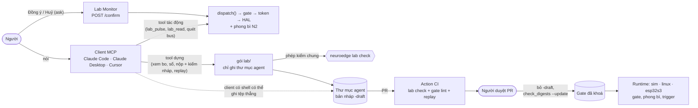

# NeuroEdge — Ghi chú thiết kế NeuroEdge Lab (lab qua MCP)

## Dựng phần cứng có hợp đồng, bằng AI người dùng đang có

> **Ghi chú thiết kế.** Tệp này giữ định vị, nguyên tắc, kiến trúc, ranh giới với tầng an
> toàn và thiết kế từng khối N0–N7. Nó **không** có lịch, trạng thái, tiêu chí ra hay thang
> cắt: task, tiêu chí ra và phụ thuộc chỉ nằm ở [`neuroedge-roadmap.md`](neuroedge-roadmap.md)
> increments **I4a** (host, §4.5.1) và **I5a** (chip, §4.6.1), phong bì N2 ở **I2a** (§4.3.1);
> không có thang cắt riêng (roadmap §9.1). Quyết định chỉ nằm ở `neuroedge-prd.md` §15: **Q-71**
> (NeuroEdge Lab qua MCP, thay NeuroBrain và Q-31), **Q-55** (vào MVP, phạm vi giữ nguyên).

**Cập nhật:** 2026-10-10 (Q-71: tệp này trước là `neuroedge-design-neurobrain.md`) · lịch sử
thay đổi: `CHANGELOG.md`

**Tài liệu nguồn:**
- `neuroedge-prd.md` §1.5 (P-1), §15 (Q-24, Q-26, Q-27, Q-11, Q-21, Q-55, Q-71)
- `neuroedge-proposal.md` Phụ lục B (B.4 ngân sách, B.5 kế thừa, B.6 `arguments`)
- `docs/spec/threat_model.md` (§2b, §2c), `docs/spec/simulation_coverage.md`, `docs/spec/tool_calling.md` §8
- `docs/rfc/0005-rang-buoc-tham-so-trong-gate.md`, `docs/rfc/0006-xac-nhan-ask-confirms.md`, `docs/rfc/0007-digital-in-i2c-analog-in-phong-bi.md`

**Phạm vi:** Khối N0 · N1 · N2 · N3 · N4 · N5 · N5b · N6 · N7

**Ngoài phạm vi:**
- Tool MCP điều khiển chân thô, không qua gate.
- Tool MCP khoá chính sách, sửa `digests.lock`, bật `[lab]` hay trả lời `ask` — không bao giờ có (§1.3.3).
- Một vòng LLM riêng của NeuroEdge để dựng hợp đồng (Q-71). System 2 vẫn là bên gọi lúc chạy, việc khác.
- Blacklist chân.
- Runtime Lua kiểu ESP-Claw.
- Kênh IM (Telegram, Zalo).
- Sinh ràng buộc gate từ datasheet.
- Client chỉ chạy trên cloud (ChatGPT): cần cổng mạng không mTLS — `TODOS.md` #61.

---

## Mục lục

1. [Định vị, kiến trúc và nguyên tắc](#1-định-vị-kiến-trúc-và-nguyên-tắc)
2. [Ranh giới với tầng an toàn](#2-ranh-giới-với-tầng-an-toàn)
3. [Giả định nguồn lực](#3-giả-định-nguồn-lực)
4. [Đường găng và phụ thuộc](#4-đường-găng-và-phụ-thuộc)
5. [Khối N0 — Quản trị](#5-khối-n0--quản-trị)
6. [Khối N1 — Lab action có gate](#6-khối-n1--lab-action-có-gate)
7. [Khối N2 — Phong bì an toàn vật lý](#7-khối-n2--phong-bì-an-toàn-vật-lý)
8. [Khối N3 — Bus I2C chỉ đọc](#8-khối-n3--bus-i2c-chỉ-đọc)
9. [Khối N4 — Sổ bàn làm việc](#9-khối-n4--sổ-bàn-làm-việc)
10. [Khối N5 — Hợp đồng nháp qua MCP](#10-khối-n5--hợp-đồng-nháp-qua-mcp)
11. [Khối N5b — Lab Monitor](#11-khối-n5b--lab-monitor)
12. [Khối N6 — Trigger theo sự kiện](#12-khối-n6--trigger-theo-sự-kiện)
13. [Khối N7 — NeuroEdge Lab trên ESP32-S3](#13-khối-n7--neuroedge-lab-trên-esp32-s3)
14. [Cổng nhu cầu và cột mốc](#14-cổng-nhu-cầu-và-cột-mốc)
15. [Rủi ro và giảm thiểu](#15-rủi-ro-và-giảm-thiểu)
16. [Cắt phạm vi](#16-cắt-phạm-vi)

**Phụ lục**
- [A — Tái dùng có chọn lọc từ ESP-Claw](#phụ-lục-a--tái-dùng-có-chọn-lọc-từ-esp-claw)

---

## Quy ước tài liệu

Mọi mã và ký hiệu (`TSK-N*`, `N0`–`N7`, `§x.y`…) được giải mã ở
**[`docs/user/thuat-ngu.md`](../docs/user/thuat-ngu.md)**. Mã task `TSK-N*` giữ từ thời
NeuroBrain; mã không bao giờ đánh lại.

---

## 1. Định vị, kiến trúc và nguyên tắc

### 1.1 Định vị (Q-71, gộp vào Q-30)

> **NeuroEdge Lab — Physical AI, under contract, with the AI you already use.**
> *Dựng phần cứng bằng AI bạn đang dùng — có hợp đồng: AI quét bus, viết bản nháp; NeuroEdge
> chấm nó trong CI và cưỡng chế nó trên bo mạch; người duyệt rồi mới khoá.*

Q-71 thay NeuroBrain (Q-31). NeuroBrain tự dựng một vòng hội thoại với LLM bên trong
NeuroEdge. NeuroEdge Lab bỏ vòng đó: "não" là client MCP người dùng đã có — Claude Code,
Claude Desktop, Cursor — và NeuroEdge chỉ làm phần mà không client nào làm thay được.

**Khác biệt với ESP-Claw.** ESP-Claw làm theo chuỗi: nói chuyện → LLM viết Lua → Lua chạy ngay
trên chip. Riêng phần "LLM chọc GPIO qua MCP" thì Espressif đã phát hành miễn phí
([esp-gpio-tool](https://github.com/espressif/esp-gpio-tool), `cap_mcp_server` của ESP-Claw).
NeuroEdge Lab không cạnh tranh ở phần đó. Chuỗi của nó:

1. Người nói với client MCP của mình.
2. Client đọc bo, quét bus, thử chân — mọi lệnh tác động là `@action` có gate.
3. Client nộp một **hợp đồng nháp**: `@action` + gate `0.1.0-draft` + test replay hai chiều.
4. NeuroEdge chấm bản nháp (`neuroedge lab check`) — cùng phép kiểm chạy lại trong Action CI.
5. Người duyệt PR; chỉ khi đó gate mới được khoá.
6. Cùng một gate chạy y hệt trên `sim`, `linux` rồi chip.

Khác biệt nằm ở hai chỗ, không đổi từ thời NeuroBrain:
- mọi thao tác vật lý đều có gate, trace và fail-closed;
- mọi hành vi sinh ra đều thành gate có phiên bản, có test hồi quy.

### 1.2 Kiến trúc: client viết, NeuroEdge chấm và cưỡng chế, người khoá

**Ba vai của NeuroEdge (Q-71):**

| Vai | Ở đâu | Không ở đâu |
|:---|:---|:---|
| **Chấm** — bản nháp đúng lược đồ, `gate lint` sạch, test hai chiều, chân truy được về trace, `motion.*` có phong bì và trạng thái an toàn, không ghi đè | `neuroedge lab check` — cùng mã ở tool MCP (N5) và ở Action CI (TSK-N5-06) | Không tin client đã tự kiểm. CI là chốt |
| **Cưỡng chế** — gate, phong bì, trần tần suất trigger | Runtime, HAL (N2), firmware (N7) | Không ở client. Client sai thì lệnh vẫn bị chặn |
| **Giữ cửa khoá** — bỏ hậu tố `-draft`, khoá digest | PR có người duyệt, nhánh được bảo vệ (TSK-N0-05) | Không có tool nào làm được |

**Vì sao không giữ vòng LLM riêng.** Vòng LLM riêng (NeuroBrain) phải tự xử lý lỗi model, tự
chọn provider, tự giữ hội thoại — công sức không làm gate an toàn hơn. Phần làm gate an toàn
(chấm, cưỡng chế, khoá) giữ nguyên dù ai viết bản nháp. Client nào nói MCP cũng dùng được,
và người dùng được model mạnh nhất họ có.

### 1.3 Bề mặt tool

Danh sách dưới đây là thiết kế. Đặc tả chuẩn tắc — tên, đầu vào, đầu ra, mã lỗi — là việc của
TSK-N0-07 (`docs/spec/lab_tools.md`), viết trước mã. Mọi tool chỉ được đăng ký khi
`[lab] enabled` (TSK-N1-02). Tool phải dùng được với client **không có shell**: mọi việc client
có shell làm bằng tệp, client không có shell làm được bằng tool.

#### 1.3.1 Tool tác động — `@action` có gate

| Tool | Việc | Khối |
|:---|:---|:---:|
| `lab_pulse(pin, duration_ms)` | Xung `digital.out`; gate `gates/lab/lab_pulse@1.0.0`, `duration_ms ≤ 2000` | N1 |
| `lab_read(pin)` | Đọc `digital.in` | N1 |
| `lab_scan(bus)` | Quét I2C chỉ đọc (read-byte), đọc chip ID | N3 |

Đây là lời gọi `mcp` thường: `dispatch()` → gate → token → HAL, phong bì kiểm trước
`authorize`. Kết quả kèm `gate explain` để client tự sửa lệnh sai (TSK-N1-04).

#### 1.3.2 Tool dựng — không có hiệu ứng vật lý

| Tool | Việc | Khối |
|:---|:---|:---:|
| `lab_board` | Chân trong allow-list, giới hạn phong bì từng chân, lý do chân khác bị cấm (cùng nội dung `board show --lab`) | N1 |
| `lab_notebook` | Đọc sổ bàn làm việc: sự thật đã phát hiện, mỗi mục kèm trace nguồn | N4 |
| `lab_board_draft` | Nhận profile bo nháp do client đề xuất, kiểm bằng `BoardProfile`, cảnh báo chân đặc biệt, ghi profile **mới** | N4 |
| `lab_draft_check` | Chấm một bản nháp (đề xuất có cấu trúc hoặc tệp đã có trong thư mục agent) — không ghi gì | N5 |
| `lab_draft_write` | Kiểm rồi render đề xuất bằng `templates.scaffold` thành `@action` + gate `0.1.0-draft` + test replay; **trả nội dung tệp** cho client; chỉ ghi thẳng vào thư mục agent khi client và `mcp serve` dùng chung cây làm việc (`sim` trên laptop); không ghi đè | N5 |
| `lab_replay` | Chạy test replay của bản nháp trên `sim` (và `linux` trên gpio-sim) từ vết ghi đã thu bằng lab action đã khoá; không nạp bản nháp lên bo thật trước khi khoá (§2.4) | N5 |
| `lab_trigger_check` | Chấm khai báo trigger nháp: chỉ trỏ action đã khoá, không trỏ lab action, có debounce và trần tần suất | N6 |
| `lab_report` | Báo cáo bring-up Markdown (cùng `trace export --report`) | N5 |

`lab_draft_check` và `neuroedge lab check` là **một** hàm, và nhận **nội dung** bản nháp, không
nhận đường dẫn trên thiết bị. Client có shell ghi tệp trong kho của nó rồi gửi nội dung cho
`lab_draft_check`; client không có shell gọi `lab_draft_write`. Hai đường gặp nhau ở cùng phép
kiểm, và CI của dự án chạy lại phép kiểm đó trên PR. Khi quyền thiết bị đã tách (§2.4), bản nháp
sống trong kho của client và chỉ tới thiết bị sau khi được khoá — tiến trình giữ thiết bị không
ghi vào kho của client, client không ghi vào cây mà `mcp serve` nạp.

Hình dạng đề xuất là `inputSchema` của tool, nằm trong mã. Đưa nó vào `schemas/` để bên thứ
ba hiện thực thì cần RFC (CONTRIBUTING §3).

#### 1.3.3 Không bao giờ có

| Không có tool để… | Vì sao |
|:---|:---|
| Khoá bản nháp (bỏ `-draft`), cập nhật `digests.lock` | Nguyên tắc 5. Khoá là việc của người, qua PR (TSK-N0-05) |
| Sửa hay xoá gate đã khoá | CONTRIBUTING §3: cần RFC |
| Bật hay tắt `[lab]`, sửa `agent.toml` ngoài bảng trigger nháp | Cờ là quyết định của người vận hành (TSK-N1-02) |
| Trả lời `ask` | Q-26: `mcp` ∉ `HUMAN_SOURCES`. Người bấm trên Lab Monitor |
| Ghi chân không qua gate, ghi I2C | Nguyên tắc 1; RFC-0007 không có hàm ghi I2C |

### 1.4 Bảy nguyên tắc

| # | Nguyên tắc | Hệ quả |
|:---:|:---|:---|
| 1 | **Không tool chân thô** | Đường duy nhất tới chân là `dispatch()` → `c.do()` → gate → token → HAL (P-1, Q-24) |
| 2 | **B-1: `lab/` không gọi HAL** | Gói `python/neuroedge/lab/` chỉ đi qua `dispatch()`. Có một test quét AST và import để canh (TSK-N1-07) |
| 3 | **Allow-list, không blacklist** | Chân không khai trong profile board thì bị từ chối (`BoardProfile.require_pin`) |
| 4 | **Gate thuần** | Trạng thái tích luỹ (phong bì) nằm ở HAL/runtime; gate không đọc đồng hồ. `gate.v1` không đổi |
| 5 | **AI không tự khoá chính sách** | Mọi thứ client nộp đều là bản nháp (`0.1.0-draft`); không tool nào khoá được; khoá chỉ qua `gate lint`, PR và người duyệt |
| 6 | **`sim` không mạnh hơn bo tham chiếu** | Không tự viết emulator (Q-16, Q-21). Dữ liệu bus trên `sim` chỉ phát lại từ trace |
| 7 | **Quản trị trước, mã sau** | Mục `Q-N`, threat model và RFC đi trước mã của khối tương ứng |

---

## 2. Ranh giới với tầng an toàn

### 2.1 Ba thứ NeuroEdge Lab không được đụng

| Thứ | Vì sao |
|:---|:---|
| `schemas/gate.v1.json` | Phong bì khai ở `board.v1`, không ở gate. Gate giữ tính thuần (bất biến #4) |
| Ngữ nghĩa phân giải gate (`gate_resolver.py`, `constraints.py`) | Gate lab là gate thường; không có luật kế thừa mới |
| Gate đã khoá trong `digests.lock` | Gate nháp không vào `digests.lock` cho tới khi được duyệt. Sửa gate đã khoá vẫn cần RFC (CONTRIBUTING §3) |

`extends` từ chối version pre-release, nên không gate nào extends được một bản nháp. Đây là
hành vi mong muốn.

### 2.2 Xác nhận của con người

- Q-26: `mcp` và `system_two` không xác nhận được `ask`. Nguồn `trigger` cũng không.
- Người đứng cạnh bo xác nhận qua `POST /confirm` của Lab Monitor (same-origin).
- Không có kênh thiết bị thì lab gate dùng `deny`, không dùng `ask`.

### 2.3 Giới hạn phần mềm khi tắt

Libgpiod thả line khi tiến trình thoát, và *"it should not be assumed that a line will retain its state"* ([gpioset](https://libgpiod.readthedocs.io/en/latest/gpioset.html)).

| Kiểu tắt | Có đưa chân về mức an toàn? |
|:---|:---|
| Thoát bình thường, SIGINT, SIGTERM | **Có**, qua `hal.close()` (TSK-N2-03) |
| Crash, SIGKILL | **Không bảo đảm được bằng phần mềm.** README lab bắt buộc ghi rõ cần điện trở kéo xuống hoặc watchdog phần cứng |

### 2.4 Client có shell (Q-71)

Claude Desktop chỉ gọi được tool. Claude Code — và mọi client chạy lệnh được — còn ghi được
tệp và chạy được `gpioset`, `i2cset`, `git`. NeuroEdge không ngăn được tiến trình đó; an toàn
nằm ở hai ranh giới mà client không vượt được bằng phần mềm:

| Ranh giới | Cách đặt | Nếu thiếu |
|:---|:---|:---|
| **Quyền thiết bị tách khỏi client** | Chỉ tiến trình `mcp serve` giữ quyền `gpio`/`i2c`. Đường chính cho client có shell: **stdio qua SSH** tới máy giữ bo, với khoá ép lệnh `restrict,command="neuroedge mcp serve …"` trong `authorized_keys` (`restrict` tắt cả chuyển cổng, agent và pty — `command=` một mình chưa đủ). Hai đường khác: `mcp serve` dưới một user riêng trên cùng máy, user của client không trong nhóm `gpio`/`i2c`; hoặc `mcp serve --http` — chỉ khi client trình được chứng chỉ client mTLS và token gắn chứng chỉ (`threat_model.md` §2b), điều chưa kiểm với Claude Code (TSK-N0-08). Trên `sim` không có thiết bị thật nên không cần | Client chạy thẳng `gpioset` — gate chỉ để trang trí. `neuroedge lab doctor` cảnh báo khi user đang chạy mở được thiết bị (TSK-N0-08); nó không phát hiện được `sudo` hay một user khác client dùng được |
| **Chính sách nạp từ cây đã duyệt** | `mcp serve` trên bo thật nạp gate, profile bo (gồm phong bì) và `agent.toml` từ một bản checkout đã duyệt mà user của client **không ghi được**. Bản nháp `-draft` và profile bo nháp không được nạp trên bo thật trước khi khoá; trên bo thật, lab action chạy dưới gate và phong bì đã khoá | Client sửa chính sách mà `mcp serve` thi hành — tách quyền thiết bị thành vô nghĩa. Phong bì "do HAL chặn" chỉ đáng tin khi profile không do client viết |
| **Khoá chỉ qua người** | Nhánh chính được bảo vệ, PR cần người duyệt; `CODEOWNERS` và workflow bắt buộc chạy từ nhánh gốc cho `.github/`, `scripts/check_digests.py`, `digests.lock`, `gates/` và mã của `lab check` — vì client có shell sửa được chính các tệp đó trong PR để CI xanh (TSK-N0-05) | Client tự bỏ `-draft`, sửa phép kiểm rồi merge. Một gate lỏng mà đúng lược đồ, đủ test hai chiều, chỉ người duyệt bắt được |

**Rủi ro còn lại, nói thẳng:** client có shell sửa được bản nháp *trong thư mục agent cục bộ*
và chạy nó trên `sim` hay trên bo mà nó có quyền. `[lab]` và `build --release` (TSK-N1-03)
giữ bản nháp khỏi bản phát hành, không giữ nó khỏi máy của người dùng. Chi tiết:
`docs/spec/threat_model.md` §2c.

---

## 3. Giả định nguồn lực

→ Người (V7) và điều kiện vào của I4a: [`neuroedge-roadmap.md`](neuroedge-roadmap.md) §1.1 và §4.5.1.

---

## 4. Đường găng và phụ thuộc

→ Phụ thuộc của I4a, I5a và của từng task: [`neuroedge-roadmap.md`](neuroedge-roadmap.md) §0.2, §4.5.1 và §4.6.1.

---

## 5. Khối N0 — Quản trị

Chỉ có tài liệu, không có mã (nguyên tắc 7, §1.4): mục `Q-N` (Q-71), threat model §2c, đặc tả
bề mặt tool (§1.3), quy trình duyệt bản nháp, hướng dẫn tách quyền thiết bị (§2.4).

→ Task và tiêu chí ra: [`neuroedge-roadmap.md`](neuroedge-roadmap.md) I4a (§4.5.1), Khối N0.

---

## 6. Khối N1 — Lab action có gate

`lab_pulse` chạy trên `sim`. `lab_read` dùng primitive `digital.in` của RFC-0007. Lab qua MCP
trên bo `linux` thật cần phiên tương tác `linux` (TSK-S5-10).

**`call_source` của lab action:**
- **Nhận:** `mcp` (và `mcp:<client>`), `test`, cùng các nguồn người là `local_grammar` và `ui`.
- **Từ chối:** `trigger` và `system_two`. Lab là dụng cụ bàn thí nghiệm, không phải hành vi tự động.

**Cấu hình client.** `mcp desktop-config --lab` cho Claude Desktop; với client có shell
(Claude Code), một mục `.mcp.json` tương đương. Vẫn đúng một mục server mỗi client (TSK-N1-05).

→ Task và tiêu chí ra: [`neuroedge-roadmap.md`](neuroedge-roadmap.md) I4a (§4.5.1), Khối N1.

---

## 7. Khối N2 — Phong bì an toàn vật lý

Phong bì gồm giới hạn tổng thời gian bật và tần suất theo chân, khai ở `board.v1` (RFC-0007).
Cưỡng chế không ở client: client đề xuất giới hạn trong profile nháp, nhưng trên bo thật HAL chặn
theo profile **đã khoá** nạp từ cây client không ghi được (§2.4) — không theo profile nháp.

→ Hook phong bì và thứ tự kiểm (TSK-N2-01), chính sách check-và-reserve nguyên tử (TSK-N2-02), móc tắt an toàn (TSK-N2-03) và tiêu chí ra: [`neuroedge-roadmap.md`](neuroedge-roadmap.md) I2a (§4.3.1), Khối N2.

### 7.1 Hợp đồng hồi quy

1. Không cấu hình phong bì ⇒ `digital_out` y hệt cũ: cùng thứ tự lỗi, sai chân không tiêu token.
2. Corpus `fixtures/tool_calls/` cho cùng kết quả.
3. Mọi profile trong `boards/` hợp lệ với `board.v1` có trường mới.
4. `verify` giữ nguyên chuỗi phán quyết của ba trace chuẩn mực.
5. `mcp serve` khi thoát vẫn ghi trace, và có gọi `hal.close()`.

---

## 8. Khối N3 — Bus I2C chỉ đọc

N3 dựng trên `sensor.read` qua `i2c-stub` của TSK-S5-09. Bề mặt quét của HAL đã có
(TSK-I2a-03); N3 thêm nhận diện chip và tool `lab_scan`.

**ADC.** Spike TSK-N3-03 đạt (`ads7828`, `ina219` trên `i2c-stub`), nên `analog.in` đọc hwmon
(TSK-I2a-04). `sim` chỉ phát lại giá trị đã ghi, không có quét I2C thật.

→ Quét bus (TSK-N3-01), test trên `i2c-stub` (TSK-N3-02) và tiêu chí ra: [`neuroedge-roadmap.md`](neuroedge-roadmap.md) I4a (§4.5.1), Khối N3.

---

## 9. Khối N4 — Sổ bàn làm việc

Sổ ghi sự thật phát hiện được, mỗi mục kèm trace nguồn, và phơi qua `lab_notebook` để client
đọc thay vì đoán. Profile bo nháp do client đề xuất; NeuroEdge kiểm và ghi qua mã đọc/ghi
`BoardProfile`, không ghi TOML bằng chuỗi. Nếu profile mới cần qua `test_boards.py`, nó phụ
thuộc RFC-0002 (đã ký).

→ Sổ sự thật (TSK-N4-01), profile board nháp (TSK-N4-02), cảnh báo chân đặc biệt (TSK-N4-03): [`neuroedge-roadmap.md`](neuroedge-roadmap.md) I4a (§4.5.1), Khối N4.

---

## 10. Khối N5 — Hợp đồng nháp qua MCP

Trước Q-71, khối này tên "Chat Contracting": NeuroEdge tự gọi LLM để sinh bản nháp và phải
xử lý ba kiểu lỗi model. Nay client viết đề xuất; NeuroEdge **chấm và render**. Phép kiểm chạy được trên `sim` với bản nháp; trên
bo thật, chỉ gate đã khoá được nạp (§2.4):

1. Đề xuất có cấu trúc (action, gate, test) hoặc tệp đã có trong thư mục agent.
2. Phép kiểm: lược đồ, `gate lint`, test hai chiều (ít nhất một ALLOW, một BLOCK/
   `argument_out_of_range`), mọi chân truy được về trace, `motion.*` có phong bì và trạng thái
   an toàn, tên action không trùng.
3. Đề xuất hỏng ⇒ lỗi có kiểu, ba phần (cái gì, ở đâu, sửa thế nào — FR-DX-04), không ghi tệp rác.
4. Ghi bằng `templates.scaffold`/`_render` có sẵn, chỉ vào thư mục agent của người dùng.
5. PR của bản nháp in `gate explain` bằng lời, diff chính sách và các test ALLOW/BLOCK.

→ Task: [`neuroedge-roadmap.md`](neuroedge-roadmap.md) I4a (§4.5.1), Khối N5.

---

## 11. Khối N5b — Lab Monitor

Là một panel trong trang sim hiện có (`python/neuroedge/viz/assets/ui.js`, `ui.css`), **không
có tab riêng**. Panel chỉ hiện khi `[lab] enabled`. Đây là chỗ duy nhất người trả lời `ask`
của lời gọi lab — client MCP không làm thay được (Q-26). Wireframe tham chiếu:
[`wireframe/lab-monitor-v2.html`](../wireframe/lab-monitor-v2.html).

**Thứ bậc:**
- Cột phải: thẻ xác nhận → hàng "đang bật" → timeline xung → phán quyết.
- Cột trái: thiết bị → bus I2C.
- Header: huy hiệu LAB MODE.

→ Task và tiêu chí ra: [`neuroedge-roadmap.md`](neuroedge-roadmap.md) I4a (§4.5.1), Khối N5b.

---

## 12. Khối N6 — Trigger theo sự kiện

Luật "khi X thì Y" là **cấu hình agent**, không phải mở rộng gate. Mỗi trigger gọi một
`@action` **đã khoá** có gate; lab action từ chối nguồn `trigger` (§6). Client viết khai báo
trigger nháp; `lab_trigger_check` chấm nó; runtime chạy nó — kể cả khi không có phiên client
nào mở, nên debounce và trần tần suất nằm ở runtime, không ở client.

→ Task: [`neuroedge-roadmap.md`](neuroedge-roadmap.md) I4a (§4.5.1), Khối N6.

---

## 13. Khối N7 — NeuroEdge Lab trên ESP32-S3

N7 đưa lab action, gate và phong bì của N1–N6 xuống chip, nên cần bo Box-3 và HAL `esp32s3`.
Chip không có client: bản nháp được dựng và khoá trên host, chip chạy gate đã khoá. MCP trên
chip chỉ qua cổng có xác thực của TSK-P2-04, hoặc qua UART.

→ Task: [`neuroedge-roadmap.md`](neuroedge-roadmap.md) I5a (§4.6.1), Khối N7; cưỡng chế phong bì trong firmware (TSK-N7-02) ở I3a.

## 14. Cổng nhu cầu và cột mốc

→ Q-40 bỏ luật cổng nhu cầu riêng của NeuroBrain; Q-56 bỏ luôn luật cổng nhu cầu chung. Tín hiệu đo của I4a và I5a: [`neuroedge-roadmap.md`](neuroedge-roadmap.md) §4.5.1 và §4.6.1.

---

## 15. Rủi ro và giảm thiểu

| # | Rủi ro | Mức độ | Dấu hiệu sớm | Phương án ứng phó |
|:---:|:---|:---:|:---|:---|
| **1** | NeuroEdge Lab kéo người khỏi đường găng v1.0 | Cao | Việc của v1.0 bị gán cho N0/N1 | Q-55 giữ NeuroEdge Lab trong MVP, nên I6 phụ thuộc I5a (`neuroedge-roadmap.md` §0.2); Q-71 bỏ vòng LLM riêng nên khối N5 nhẹ hơn. MVP trượt thì dời ngày, không cắt phạm vi (Q-52) |
| **2** | AI viết gate nới lỏng hơn ý người nói | Cao | Bản nháp chỉ có test ALLOW | Test hai chiều (TSK-N5-02), chạy lại trong CI (TSK-N5-06), `gate explain` trong PR (TSK-N5-04), người duyệt (TSK-N0-05) |
| **3** | Chân kẹt HIGH khi tiến trình chết | Trung bình | Relay nóng hoặc kêu sau crash | §2.3: phần mềm không cứu được. README lab và runbook bắt buộc ghi rõ cần điện trở kéo xuống |
| **4** | Lab lọt vào bản phát hành | Trung bình | Báo cáo build ghi `lab_enabled: true` | Cờ mặc định tắt, `build --release` chặn (TSK-N1-03) |
| **5** | Không có người cho vai trò V7 | Trung bình | Chưa có ai khi I4a sắp mở | Q-60: một người + AI agent; thiếu người thì dời ngày ở `neuroedge-roadmap.md` §0.2, không cắt phạm vi |
| **6** | Mở rộng Q-11 (font OFL) bị bác | Thấp | Phản biện tập trung vào giấy phép font | Restyle giữ font hệ thống, chỉ bỏ viền trái (TSK-N5b-07) |
| **7** | Client có shell đi vòng qua gate (`gpioset`, sửa tệp) | Cao | Lab chạy trên bo mà user của client nằm trong nhóm `gpio` | §2.4: tách quyền thiết bị; `lab doctor` cảnh báo (TSK-N0-08); `threat_model.md` §2c |
| **8** | Client tự khoá bản nháp | Cao | Commit bỏ `-draft` không qua PR | Không có tool khoá (§1.3.3); nhánh được bảo vệ; `check_digests.py` và `lab check` trong CI |
| **9** | Trải nghiệm phụ thuộc client bên ngoài | Trung bình | Client đổi cách hỗ trợ MCP; người dùng không có tài khoản | Tool trung lập, nghiệm thu trên hai client (A11); `sim` và `neuroedge add` vẫn dùng được không cần AI |

---

## 16. Cắt phạm vi

→ NeuroEdge Lab không có thang cắt riêng; phần tuyệt đối không cắt của MVP: [`neuroedge-roadmap.md`](neuroedge-roadmap.md) §9.1 (Q-52).

---

# Phụ lục

## Phụ lục A — Tái dùng có chọn lọc từ ESP-Claw

Nguồn: [espressif/esp-claw](https://github.com/espressif/esp-claw), Apache-2.0 (nằm trong allowlist Q-11). Theo khuôn XiaoZhi (`NOTICE` Section A mục 1):
- clone **ngoài kho** để đọc, ghim commit;
- mỗi tệp port ghi tệp và commit gốc ở đầu tệp (CONTRIBUTING §4).

| Lấy | Dùng cho |
|:---|:---|
| `application/edge_agent/boards/*/board_peripherals.yaml` (có `esp_box_3`) | Dữ liệu "chân đã bị ngoại vi chiếm" cho TSK-N4-03 |
| Lớp ESP-IDF bên dưới binding Lua của `lua_driver_{i2c,adc,gpio}` | N3/N7 firmware |
| `components/claw_modules/claw_event_router` | Tham khảo thiết kế N6/N7 |

**Không lấy:**
- `cap_lua`, `lua_module_*`: Lua tự do phá P-1.
- `claw_core`, `cap_im_*`, `cap_web_search`.
- MCP HTTP + mDNS của `cap_mcp_server`: chỉ qua cổng có xác thực của TSK-P2-04 (NFR-SEC-09), không tự mở cổng.

Phụ lục B cũ (quyết định chờ mã `Q-N`) đã chốt trong Q-71 và bị bỏ khỏi tệp này.
